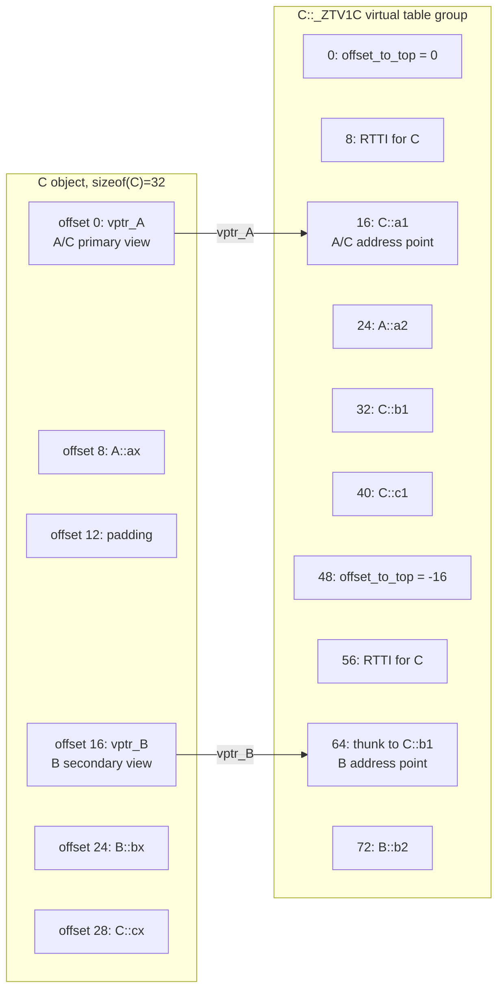

最近看了一篇文章讲了 C++ 的多重继承的多态实现，让我比较好奇 C++、 Rust 这两个语言一个继承一个组合，分别是怎么实现运行时多态的。

C++ 的实现把 `vptr` 放进对象或基类子对象里。单继承时这很直观；多重继承时，对象里可能有多个基类子对象，这会让一个简单的虚函数表不太够用，需要以更复杂的形式来实现多态。

Rust 具体类型实现 trait 不会改变对象布局。其运行时多态的实现非常聪明，充分利用了其类型系统和组合的特性。其多态实现较 C++ 简单非常多。

<!--more-->

## 最简单的多态

### C++

```cpp
struct Animal {
    virtual void speak();
    int age;
};

struct Dog : Animal {
    void speak() override;
    int weight;
};
```

在常见实现下，只要 `Animal` 有虚函数，`Animal` 对象布局里就会有一个隐藏的 `vptr`。`Dog` 继承 `Animal` 后，`Dog` 对象开头通常就是 `Animal` 子对象；这个子对象里的 `vptr` 在构造完成后指向 `Dog` 的虚表。虚表就是虚函数表，其实就是类似一个契约，只要遵守虚函数表的布局方式，那么就可以通过虚函数表调用对应的函数。

64 位下大致布局：

```text
Dog object

offset  content
------  -------------------------------
0       vptr, points to Dog vtable
8       Animal::age
12      Dog::weight
```

`Dog` 的虚表大致是：

```text
Dog vtable
+----------------+
| RTTI / metadata |
+----------------+
| Dog::speak      |
+----------------+
```

虚调用路径比较简单：

```text
1. p 指向 Dog 对象里的 Animal 子对象起点
2. 从对象开头读取 vptr
3. 通过 vptr 找到 Dog vtable
4. 从 speak 对应槽位取出 Dog::speak
5. 把 p 作为 this 传入，执行 Dog::speak
```

这个简单单继承场景里，`Animal*` 和 `Dog*` 通常同址，不需要调整 `this`。复杂度主要是：对象内部多了一个 `vptr`，构造对象时要把它写成正确虚表地址。

### Rust

Rust 对应的写法不是继承，而是 trait：

```rust
trait Speak {
    fn speak(&self);
}

struct Dog {
    age: u32,
    weight: u32,
}

impl Speak for Dog {
    fn speak(&self) {}
}
```

`Dog` 实现了 `Speak`，但 `Dog` 本身的内存布局仍然只是字段：

```text
Dog object

offset  content
------  -------------
0       age
4       weight
```

它不会因为 `impl Speak for Dog` 就在对象里多放一个 `vptr`。只有当它被转换成 trait object 时，运行时多态信息才出现：

```rust
let dog = Dog { age: 3, weight: 20 };
let p: &dyn Speak = &dog;
p.speak();
```

此时 `&dyn Speak` 是胖指针（fat pointer）：

```text
&dyn Speak

+----------------+
| data pointer   | -> Dog object
+----------------+
| vtable pointer | -> Dog as Speak vtable
+----------------+
```

调用路径是：

```text
1. 从 &dyn Speak 中拿到 data pointer
2. 从 &dyn Speak 中拿到 vtable pointer
3. 在 Dog as Speak vtable 中找到 speak 槽位
4. 把 data pointer 作为 self 传入
5. 执行 <Dog as Speak>::speak
```

这个实现非常聪明，把运行时多态单独成 dyn 一个类型，而不是像 C++ 一样，让指针类型同时承担多态和对类型的借用与访问。

所以最简单情况下，两者差异已经很明显：

| 维度 | C++ 单继承虚函数 | Rust `dyn Trait` |
| --- | --- | --- |
| 具体对象布局 | 对象内部通常有 `vptr` | 具体对象不因 `impl Trait` 增加字段 |
| 多态信息位置 | 对象或子对象内的 `vptr` | trait object 指针里的 vtable pointer |
| 指针大小 | `Base*` 通常 8 bytes | `&dyn Trait` 通常 16 bytes |
| 构造对象时 | 构造函数写入 `vptr` | 构造具体对象不需要 trait vtable |
| 发生动态分发时 | 通过对象内 `vptr` 查虚表 | 通过胖指针内 vtable pointer 查表 |

## C++ 的多重继承实验

为了避免 Clang/MSVC 标准库版本限制，实验只用 C 头文件和 `printf`：

```cpp
#include <stdint.h>
#include <stdio.h>
#include <string.h>

struct A {
    virtual void a1();
    virtual void a2();
    int ax = 0x11;
};

struct B {
    virtual void b1();
    virtual void b2();
    int bx = 0x22;
};

struct C : public A, public B {
    void a1() override;
    void b1() override;
    virtual void c1();
    int cx = 0x33;
};

void A::a1() { printf("A::a1 this=%p\n", static_cast<void*>(this)); }
void A::a2() { printf("A::a2 this=%p\n", static_cast<void*>(this)); }
void B::b1() { printf("B::b1 this=%p\n", static_cast<void*>(this)); }
void B::b2() { printf("B::b2 this=%p\n", static_cast<void*>(this)); }

void C::a1()
{
    printf("C::a1 this(C*)=%p ax=0x%x\n", static_cast<void*>(this), ax);
}

void C::b1()
{
    printf("C::b1 this(C*)=%p ax=0x%x bx=0x%x cx=0x%x\n",
           static_cast<void*>(this),
           ax,
           bx,
           cx);
}

void C::c1()
{
    printf("C::c1 this(C*)=%p cx=0x%x\n", static_cast<void*>(this), cx);
}

template <typename T>
uintptr_t addr(T* p)
{
    return reinterpret_cast<uintptr_t>(p);
}

uintptr_t read_word(const void* p)
{
    uintptr_t value = 0;
    memcpy(&value, p, sizeof(value));
    return value;
}

void print_ptr(const char* name, const void* p)
{
    printf("  %-26s = %p\n", name, p);
}

int main()
{
    C obj;

    C* pc = &obj;
    A* pa = &obj;
    B* pb = &obj;

    printf("sizes\n");
    printf("  sizeof(A)=%zu alignof(A)=%zu\n", sizeof(A), alignof(A));
    printf("  sizeof(B)=%zu alignof(B)=%zu\n", sizeof(B), alignof(B));
    printf("  sizeof(C)=%zu alignof(C)=%zu\n\n", sizeof(C), alignof(C));

    printf("subobject addresses\n");
    print_ptr("C* pc", pc);
    print_ptr("A* pa", pa);
    print_ptr("B* pb", pb);
    printf("  A offset in C = %lld\n",
           static_cast<long long>(addr(pa) - addr(pc)));
    printf("  B offset in C = %lld\n\n",
           static_cast<long long>(addr(pb) - addr(pc)));

    printf("vptr values read from subobject starts\n");
    printf("  vptr at A subobject = 0x%llx\n",
           static_cast<unsigned long long>(read_word(pa)));
    printf("  vptr at B subobject = 0x%llx\n\n",
           static_cast<unsigned long long>(read_word(pb)));

    printf("top-object recovery through RTTI data\n");
    print_ptr("dynamic_cast<void*>(pa)", dynamic_cast<void*>(pa));
    print_ptr("dynamic_cast<void*>(pb)", dynamic_cast<void*>(pb));
    printf("\n");

    printf("virtual calls\n");
    pa->a1();
    pa->a2();
    pb->b1();
    pb->b2();
    pc->b1();
    pc->c1();
}
```

这段代码主要验证：

1. `A*`、`B*`、`C*` 指向同一个完整对象的哪个位置。
2. `A` 子对象和 `B` 子对象开头的 `vptr` 是否不同。
3. `dynamic_cast<void*>` 能否从 `A*` / `B*` 找回完整 `C` 对象起点。
4. 通过 `B*` 调 `b1()` 时，最终进入 `C::b1()` 的 `this` 是 `B*` 还是 `C*`。

GNU 编译运行：

```shell
g++ -std=c++17 -O0 -g cpp_mi_polymorphism.cpp -o cpp_mi_gnu.exe
./cpp_mi_gnu.exe
```

部分输出如下：

```text
sizeof(A)=16
sizeof(B)=16
sizeof(C)=32

C* pc = ...fe10
A* pa = ...fe10
B* pb = ...fe20
A offset in C = 0
B offset in C = 16

dynamic_cast<void*>(pa) = ...fe10
dynamic_cast<void*>(pb) = ...fe10

C::b1 this(C*)=...fe10 ax=0x11 bx=0x22 cx=0x33
B::b2 this=...fe20
```

现象：

- `A*` 和 `C*` 同址
- `B*` 指向 `C` 对象内部偏移 16 的位置。
- `dynamic_cast<void*>(pb)` 可以从 `B` 子对象回到完整 `C` 对象起点。
- `pb->b1()` 最终进入 `C::b1()` 时，`this` 已经不是 `B*`，而是完整的 `C*`。
- `pb->b2()` 没有被 `C` 覆盖，所以进入 `B::b2()` 时，`this` 仍然是 `B` 子对象地址。

因为实验在 windows 下运行的，Clang 默认目标是 MSVC ABI，本机运行结果也符合这个对象模型，输出基本一致，不过 `sizeof(C)` 在 MSVC ABI 下是 40，而 GNU ABI 下是 32。

## C++ 多重继承的对象布局与实现

 根据运行时地址、`-fdump-lang-class` 和 Clang record layout，`C` 对象大致是这样排布的：

```text
C object, sizeof(C) = 32

offset  content
------  --------------------------------------------
0       A subobject begins
0       vptr_A, also C's primary vptr
8       A::ax
12      padding
16      B subobject begins
16      vptr_B, B's secondary vptr in C
24      B::bx
28      C::cx
```

可以看到其布局：
- 当继承了多个父类且均具有虚函数之后，会选择一个父类作为 primary。在这里`A` 是 primary，它的子对象从偏移 0 开始。
- `C` 没有自己的 `vptr`，而是复用 `A` 或者说 primary 子对象开头的 `vptr_A`。
- `B` 是 non-primary 的，它的子对象从偏移 16 开始，它有自己的 `vptr_B`。
- `C::cx` 被放在 `B::bx` 后面，复用了 `B` 子对象尾部对齐后的空间，所以 GNU ABI 下 `sizeof(C)` 是 32。

其布局如下“
```text
C object

offset 0:
+-----------------------------+
| vptr_A --------------------+ |  points to C::_ZTV1C + 16
| A::ax                      | |
| padding                    | |
+-----------------------------+ |
offset 16:                    |
+-----------------------------+ |
| vptr_B --------------------|-+  points to C::_ZTV1C + 64
| B::bx                      |
| C::cx                      |
+-----------------------------+

C::_ZTV1C virtual table group

byte offset  entry
-----------  ---------------------------------
0            offset_to_top = 0
8            RTTI for C
16           C::a1        <-- vptr_A points here
24           A::a2
32           C::b1
40           C::c1
48           offset_to_top = -16
56           RTTI for C
64           thunk to C::b1 <-- vptr_B points here
72           B::b2
```



对象里的 `vptr` 并不一定指向虚表组的最开头。通常指向所谓 address point，也就是“当前视角下第一个可按槽位调用的虚函数入口”。所以：

- `vptr_A` 指向 `C::_ZTV1C + 16`，也就是 `C::a1()` 那一格。
- `vptr_B` 指向 `C::_ZTV1C + 64`，也就是 `B` 视角下第一个虚函数 `b1()` 对应的入口。
- `offset_to_top` 和 RTTI 在 address point 前面，通过负下标位置访问。

因此，从 `A*` 看对象和从 `B*` 看对象，拿到的是不同的 `vptr`，进入的是同一个 virtual table group 的不同 address point。

## C++ 多重继承的虚表 dump 形态

```powershell
clang++ --target=x86_64-w64-windows-gnu -std=c++17 -O0 `
  -Xclang -fdump-vtable-layouts `
  -c cpp_mi_polymorphism.cpp `
  -o cpp_mi_clang_gnu.o
```

`C` 的虚表 dump 如下：

```text
Vtable for 'C' (10 entries).
   0 | offset_to_top (0)
   1 | C RTTI
       -- (A, 0) vtable address --
       -- (C, 0) vtable address --
   2 | void C::a1()
   3 | void A::a2()
   4 | void C::b1()
   5 | void C::c1()
   6 | offset_to_top (-16)
   7 | C RTTI
       -- (B, 16) vtable address --
   8 | void C::b1()
       [this adjustment: -16 non-virtual]
   9 | void B::b2()

Thunks for 'void C::b1()' (1 entry).
   0 | this adjustment: -16 non-virtual
```

这里出现了一个 Thunk，所谓 Thunk 是为了解决 B* 指针和 C* 指针的偏移问题。通过前面我们可以知道对于同一个对象，B* 和 C* 的值是不同的，这是因为在 C 对象中 B 子对象的 offset 不为零，所以这是必然的。但是 C 类型又 override 了 B 类型的虚函数，所以为了通过 B* 指针调用函数时可以调用到 C 类型的函数，就需要对指针进行矫正。

具体 Thunk 的工作原理等会会说。

这个时候再看上面的内容。可见索引 `0..5`，存的是 A 和 C 的虚函数表。

```text
0 | offset_to_top (0)
1 | C RTTI
2 | void C::a1()
3 | void A::a2()
4 | void C::b1()
5 | void C::c1()
```

- RTTI 指向 `C`，不是 `A`，因为动态类型是 `C`。
- `A::a1()` 被覆盖，所以槽里放 `C::a1()`。
- `A::a2()` 没有被覆盖，所以槽里仍然是 `A::a2()`。
- `C::c1()` 是 `C` 自己新增的虚函数，它追加在 primary vtable 里。

另外，索引 `6..9`，是 `B` 在 `C` 里的 secondary vtable：

```text
6 | offset_to_top (-16)
7 | C RTTI
8 | void C::b1()
    [this adjustment: -16 non-virtual]
9 | void B::b2()
```

- `offset_to_top` 是 `-16`，因为 `B` 子对象位于完整 `C` 对象偏移 16 的位置。
- RTTI 仍然指向 `C`，所以 `B* pb = &c; typeid(*pb)` 这类动态类型查询仍然能得到真实派生类型。
- `B::b1()` 被 `C::b1()` 覆盖，但通过 `B*` 调用时传入的是 `B` 子对象地址，所以这个槽位需要 thunk。
- `B::b2()` 没被覆盖，仍然是 `B::b2()`。
- `C::c1()` 不会出现在 `B` 部分，因为 `B*` 的调用者并不知道 `C` 新增了这个虚函数。

## C++ 多重继承的 thunk


在图片上半部分，是没有 Thunk 的时候工作过程。可以看到，即使没有 Thunk，虚函数表仍然可以保证调用到正确的 C::b1() 函数。我们知道，其实 C++ 类的函数中隐藏了 this 指针这个参数，然而实际上函数在调用的时候是需要传入对象的指针的。

没有 Thunk 时，虽然调用了正确的 C::b1() 函数，传入的却是 B* 的指针，而不是 C* 的指针，这中间存在 offset。Thunk 就是为了解决这个问题。

但是为什么非要引入 Thunk 呢？相比没有 Thunk 的情况，Thunk 又引入了一个跳转。光虚函数就需要一次跳转了，Thunk 又引入了第二次跳转，这不是低效吗？我的 C++ 零成本抽象去哪了？

一句话最简单最直接的回答你，确实如此。在这种对象布局下（虚函数指针藏在对象中），只能这么解决。因为对象只要有成员变量同时允许多重继承的话，就一定会产生偏移，导致 this 指针的偏移。除非禁止多重继承，或者把复杂度进行替换。

比如，使用 fat pointer + 禁止存在虚函数的类有成员变量，就可以解决这个问题了。

这两个东西其实是同一个意思，都是为了避免继承多个父类的时候，会在对象中产生偏移。把虚函数指针放在 fat pointer 中（虚函数指针现在不占用地址了）；禁止存在虚函数的类有成员变量（父类不会有产生偏移了）。现在，就可以根据调用的函数，在 fat pointer 中直接进行路由，这样就不需要 Thunk 了。（欸，这不就是 Rust 吗？）

接下来来看看 Thunk 是怎么实现的

看看目标文件里的反汇编：

```powershell
objdump -d -C cpp_mi_gnu.o
```

关键部分：

```asm
0000000000000125 <non-virtual thunk to C::b1()>:
   125: 48 83 e9 10        sub    $0x10,%rcx
   129: eb b1              jmp    dc <C::b1()>
```

在当前 Windows x64 调用约定下，`this` 放在 `rcx`。所以这段 thunk 做的事情就是：

```text
this = this - 16
jump C::b1
```

也就是把 `B*` 修正成完整的 `C*`。

为什么必须这样？因为 `C::b1()` 的函数体是按 `C* this` 编译的，它访问成员时会使用 `C` 布局下的偏移：

- `ax` 在 `C + 8`
- `bx` 在 `C + 24`
- `cx` 在 `C + 28`

如果直接把 `B*` 传给 `C::b1()`，那么所有成员偏移都会错 16 字节。thunk 就是专门补这个差值的入口代码。

## Rust trait object：组合式运行时多态

C++ 的多态通常从继承层级出发，虚表指针常见实现是对象布局的一部分。Rust 的运行时多态从 trait object 出发，典型写法是：

```rust
trait Draw {
    fn draw(&self) -> &'static str;
}

struct Button;

impl Draw for Button {
    fn draw(&self) -> &'static str {
        "Button as Draw"
    }
}

let d: &dyn Draw = &Button;
d.draw();
```

`Button` 对象本身不会因为实现了 `Draw` 而多出一个隐藏 `vptr`。只有当它被看成 `&dyn Draw`、`Box<dyn Draw>`、`Arc<dyn Draw>` 这类 trait object 时，指针才变成胖指针：

```text
&dyn Draw
+----------------+
| data pointer   | -> Button object
+----------------+
| vtable pointer | -> vtable for Button as Draw
+----------------+
```

在 64 位平台上，这个胖指针通常就是 16 bytes：一个数据指针加一个 vtable 指针。

## Rust trait object 的实验代码

核心代码如下：

```rust
use std::mem::{size_of, transmute};

trait Draw {
    fn draw(&self) -> &'static str;
}

trait Click {
    fn click(&self) -> &'static str;
}

trait Widget: Draw + Click {}

impl<T: Draw + Click> Widget for T {}

trait EmptyMarker {}

trait MarkedDraw: Draw + EmptyMarker {}

impl<T: Draw + EmptyMarker> MarkedDraw for T {}

struct Button {
    id: u64,
    state: u32,
}

impl Draw for Button {
    fn draw(&self) -> &'static str {
        "Button as Draw"
    }
}

impl Click for Button {
    fn click(&self) -> &'static str {
        "Button as Click"
    }
}

impl EmptyMarker for Button {}

fn split_draw(p: &dyn Draw) -> (*const (), *const ()) {
    unsafe { transmute::<&dyn Draw, (*const (), *const ())>(p) }
}

fn split_click(p: &dyn Click) -> (*const (), *const ()) {
    unsafe { transmute::<&dyn Click, (*const (), *const ())>(p) }
}

fn split_widget(p: &dyn Widget) -> (*const (), *const ()) {
    unsafe { transmute::<&dyn Widget, (*const (), *const ())>(p) }
}
```

这里的 `transmute` 只是为了观察实验结果：把 `&dyn Trait` 拆成 `(data pointer, vtable pointer)`。

```powershell
rustc rust_trait_object_poly.rs -o rust_trait_object_poly.exe
./rust_trait_object_poly.exe
```

关键输出：

```text
target pointer width: 64 bits
plain sized values
  size_of::<Button>() = 16
  size_of::<&Button>() = 8

trait object pointer sizes
  size_of::<&dyn Draw>() = 16
  size_of::<&(dyn Draw + Send + Sync)>() = 16
  size_of::<&dyn Click>() = 16
  size_of::<&dyn Widget>() = 16
  size_of::<&dyn MarkedDraw>() = 16
  size_of::<Box<dyn Draw>>() = 16
  size_of::<Box<dyn Widget>>() = 16

fat pointer parts
&dyn Draw                data=...fa90 vtable=...9518
&dyn Draw+Send+Sync      data=...fa90 vtable=...9518
&dyn Click               data=...fa90 vtable=...9538
&dyn Widget              data=...fa90 vtable=...9558
&dyn MarkedDraw          data=...fa90 vtable=...9518

comparisons
  Draw data == Click data: true
  Draw vtable == Click vtable: false
  Draw vtable == Draw+Send+Sync vtable: true
  Draw vtable == Widget vtable: false
  Draw vtable == MarkedDraw vtable: true
```

输出说明：
1. 64 位平台上，`&dyn Trait` 和 `Box<dyn Trait>` 都是 16 bytes。`&Button` 是普通引用，只有 8 bytes；`&dyn Draw` 是胖指针，有 data pointer 和 vtable pointer 两个机器字。
2. 同一个 `Button` 转成 `&dyn Draw`、`&dyn Click`、`&dyn Widget` 时，data pointer 相同，说明它们都指向同一个对象：

```text
Button object
  ^
  |
+----------------------+----------------------+
| &dyn Draw.data       | &dyn Click.data      |
+----------------------+----------------------+
```

3. vtable pointer 会随 principal trait 改变：

```text
&dyn Draw   -> vtable for Button as Draw
&dyn Click  -> vtable for Button as Click
&dyn Widget -> vtable for Button as Widget
```

## Rust trait object：auto trait 与空 marker trait

Rust 允许下面这种 trait object：

```rust
&(dyn Draw + Send + Sync)
```

但这里真正参与动态分发的是 `Draw`。`Send` 和 `Sync` 是 auto trait，它们没有可调用方法，更多是类型系统里的线程安全能力标记。实验里：

```text
size_of::<&dyn Draw>() = 16
size_of::<&(dyn Draw + Send + Sync)>() = 16

Draw vtable == Draw+Send+Sync vtable: true
```

至少在这次编译结果中，`&dyn Draw` 和 `&(dyn Draw + Send + Sync)` 的 vtable pointer 也相同。这很好理解：`Send + Sync` 没有方法槽要分发，它们只是约束“背后的真实类型必须满足这些 auto trait”。

但是要注意：不是所有“没有方法的 trait”都能像 `Send` / `Sync` 一样附加到 trait object 上。普通空 trait 仍然是 non-auto trait：

```rust
trait EmptyMarker {}

// 不合法
Box<dyn Draw + EmptyMarker>
```

下面代码编译会失败：

```rust
trait Draw {
    fn draw(&self);
}

trait Click {
    fn click(&self);
}

trait EmptyMarker {}

struct Button;

impl Draw for Button {
    fn draw(&self) {}
}

impl Click for Button {
    fn click(&self) {}
}

impl EmptyMarker for Button {}

fn main() {
    let _bad_methods: Box<dyn Draw + Click> = Box::new(Button);
    let _bad_empty_marker: Box<dyn Draw + EmptyMarker> = Box::new(Button);
}
```

```powershell
rustc rust_multi_trait_object_fail.rs
```

报错核心是：

```text
error[E0225]: only auto traits can be used as additional traits in a trait object
let _bad_methods: Box<dyn Draw + Click> = Box::new(Button);
                               ----   ^^^^^ additional non-auto trait

error[E0225]: only auto traits can be used as additional traits in a trait object

let _bad_empty_marker: Box<dyn Draw + EmptyMarker> = Box::new(Button);
                                    ----   ^^^^^^^^^^^ additional non-auto trait
```

这说明判断标准不是“有没有方法”，而是“是不是 auto trait”。`EmptyMarker` 没有方法，但它不是 auto trait，所以不能作为 `dyn Draw + EmptyMarker` 里的附加 trait。不过如果仅从多态的实现来看的话，其实可以通过识别空 trait 来实现多态，这样并不会直接导致编译失败。

## Rust trait object 多个 trait 的运行时多态

欸，既然 Rust 支持一个结构体实现多个 trait，而 dyn 又必须是 sized 的，为了类型擦除必须一样的话。那么如果一个结构体实现了多个 trait 的话，那么虚函数表岂不是要组合爆炸？

比如：存在 trait A, trait B, trait C, 然后 struct D 实现了这三个。那么就可以存在 dyn A, dyn B, dyn C, dyn A + B, dyn A + C, dyn B + C, dyn A + B + C 多达七个 dyn 类型，如果更多则会指数爆炸。

那么答案就是，拒绝这种情况即可，换句话说就是拒绝多重继承。

```rust
// 不支持
Box<dyn Draw + Click>
```

Rust trait object 只有一个 principal trait。额外能跟在后面的，是 `Send`、`Sync`、`Unpin` 这类 auto trait，以及生命周期约束。

但 Rust 存在对应的 workaround。可以通过 supertrait 定义一个新的 principal trait，把多个能力组合成一个接口：

```rust
trait Widget: Draw + Click {}

impl<T: Draw + Click> Widget for T {}

let w: Box<dyn Widget> = Box::new(Button { id: 7, state: 3 });
w.draw();
w.click();
```

此时 `dyn Widget` 仍然是一个 trait object，胖指针仍然是 16 bytes：

```text
Box<dyn Widget>
+----------------+
| data pointer   | -> Button object
+----------------+
| vtable pointer | -> vtable for Button as Widget
+----------------+
```

它不是：

```text
Box<dyn Draw + Click>
+----------------+
| data pointer   |
+----------------+
| Draw vtable    |
+----------------+
| Click vtable   |
+----------------+
```

也就是说，supertrait 组合不是让 fat pointer 变成“三个指针”或“多个 vtable 指针”。它是把 `Widget` 作为新的 principal trait，生成一张 `Button as Widget` 的 vtable。这张 vtable 能支持通过 `dyn Widget` 调用 `draw()` 和 `click()`。这可以让 dyn 类型永远保持 16 bytes，是 sized 的。

也因为这样的实现，Rust 把运行时多态的复杂度转化为用户自己定义一个新的 trait，让 fat pointer 始终保持 16 bytes，同时虚函数的调用永远都是一次跳转，没有两次跳转（真正的零成本抽象，bushi）

## vtable 生成时机

其实我们根据 Rust 的布局推出一个有趣的结论，由于 Rust 的虚指针不会放在结构体内部，而只会在 dyn 出现时出现；而 C++ 由于会把虚指针放在结构体内部，所以只要该类型出现，就会出现。

那么可以猜想一个优化，Rust 只要 dyn 没有用到的话，该结构体对应的 trait 的虚函数表其实就不需要生成；而 C++ 由于这种内存布局的原因，即使从来没有使用过多态，也必须生成对应的虚函数表。

接下来考虑进行实验：

```rust
trait Draw {
    fn draw(&self) -> u32;
}

struct Button(u32);

impl Draw for Button {
    fn draw(&self) -> u32 {
        self.0
    }
}

#[inline(never)]
fn call_static<T: Draw>(x: &T) -> u32 {
    x.draw()
}

fn main() {
    let b = Button(7);
    println!("{}", call_static(&b));
}
```

生成 LLVM IR：

```powershell
rustc rust_vtable_static_only.rs --emit=llvm-ir -C opt-level=0 -o rust_vtable_static_only.ll
```

```llvm
; call <Button as Draw>::draw
%_0 = call i32 @"...Button as ...Draw...draw"(ptr align 4 %x)
```

这里没有 `Button as Draw` 的 trait object vtable。IR 里可能有其他 `@vtable`，比如 `std::rt::lang_start` 闭包用的 vtable，但那不是 `Draw` 的 vtable。

动态分发版本：

```rust
#[inline(never)]
fn call_dyn(x: &dyn Draw) -> u32 {
    x.draw()
}

fn main() {
    let b = Button(7);
    let d: &dyn Draw = &b;
    println!("{}", call_dyn(d));
}
```

生成的 LLVM IR 里出现了 `Button as Draw` 的 vtable 常量：

```llvm
@vtable.0 = private unnamed_addr constant <{ [24 x i8], ptr }> <{
  [24 x i8] c"... size/align/drop metadata ...",
  ptr @"...Button as ...Draw...draw"
}>
```

调用 `call_dyn` 时传入两个指针：

```llvm
call i32 @call_dyn(ptr %b, ptr @vtable.0)
```

而 `call_dyn` 内部从 vtable 里取方法入口：

```llvm
%slot = getelementptr inbounds i8, ptr %x.1, i64 24
%method = load ptr, ptr %slot
%result = call i32 %method(ptr %x.0)
```

所以，Rust 可以对此进行优化，当然这可能只是一个小的优化。

反观 C++：

```cpp
#include <stdio.h>

struct Base {
    virtual int value();
    int x = 1;
};

struct Derived : Base {
    int value() override;
    int y = 2;
};

int Base::value()
{
    return x;
}

int Derived::value()
{
    return x + y;
}

__attribute__((noinline)) int make_and_read()
{
    Derived d;
    return d.x + d.y;
}

int main()
{
    printf("%d\n", make_and_read());
}
```

注意这里没有：

```cpp
Base* p = &d;
p->value();
```

也就是说，没有通过基类指针发生虚调用。可是用 Clang 生成 LLVM IR：

```powershell
clang++ --target=x86_64-w64-windows-gnu -std=c++17 -O0 `
  -S -emit-llvm cpp_vtable_construct_no_virtual_call.cpp `
  -o cpp_vtable_construct_no_virtual_call.ll
```

仍然能看到 `Base` 和 `Derived` 的 vtable：

```llvm
@_ZTV4Base = constant { [3 x ptr] } {
  [3 x ptr] [ptr null, ptr @_ZTI4Base, ptr @_ZN4Base5valueEv]
}

@_ZTV7Derived = constant { [3 x ptr] } {
  [3 x ptr] [ptr null, ptr @_ZTI7Derived, ptr @_ZN7Derived5valueEv]
}
```

更关键的是 `Derived` 构造函数里会写 `vptr`：

```llvm
call void @_ZN4BaseC2Ev(ptr %this)
store ptr getelementptr inbounds ({ [3 x ptr] }, ptr @_ZTV7Derived, i32 0, i32 0, i32 2), ptr %this
```

GNU 的 class dump 也显示：

```text
Vtable for Derived
Derived::_ZTV7Derived: 3 entries
0     0
8     & _ZTI7Derived
16    Derived::value

Class Derived
   size=16 align=8
Derived
    vptr=((& Derived::_ZTV7Derived) + 16)
Base
      primary-for Derived
```

这说明，在 C++ 常见实现下，vtable 的需求不只是“发生虚调用”。构造一个多态对象本身就需要初始化对象里的 `vptr`。这个 `vptr` 以后可能服务于虚调用、`typeid`、`dynamic_cast`、析构期间的动态类型变化等机制。

不过，C++ 也不是“只要源代码里写了一个多态类，最终二进制必然保留它的 vtable”。如果类完全没被 ODR-use，或者链接器 GC / LTO 发现 vtable 不可达，它也可能不出现在最终产物里。但在对象布局层面，C++ 的多态成本更早地绑定到了对象本身；Rust 的多态成本则主要在 `dyn Trait` 胖指针视角出现。

当然，这其实一个有趣的问题而已，实际上最后生成的二进制文件中到底有没有对应的虚函数表可能存在更多的考量。我只是觉得这是一个比较有趣的问题而已。

## 总结

| 维度 | C++ 多重继承 | Rust trait object |
| --- | --- | --- |
| 多态单位 | 类继承层级中的虚函数 | 一个 principal trait |
| 多态元数据位置 | 常见实现中，`vptr` 在对象或子对象内 | `data ptr + vtable ptr` 在 trait object 指针里 |
| 一个对象多个接口 | 多个多态基类子对象可能各有 `vptr` | 同一对象可被转成多个 `&dyn Trait`，每个 fat pointer 有自己的 vtable ptr |
| 多接口合并 | 多重继承直接进入对象布局和 ABI | 用 supertrait 定义新 principal trait，如 `trait Widget: Draw + Click` |
| 调用时修正 | 非 primary base 可能经 thunk 调整 `this` | trait object 调用把 data pointer 作为 `self` 传入 |
| 指针大小 | 基类指针通常 8 bytes，但可能指向子对象中间 | trait object 指针通常 16 bytes |
| vtable 生成动机 | 多态对象布局、构造析构、RTTI、虚调用共同需要 | 主要由实际 `dyn Trait` 视角触发 |
| 多张 vtable 的组织 | 一般会把 primary / secondary vtable 组织成 group | 通常按 `T as dyn Trait` 独立存在，不维护“某类型所有 trait vtable group” |

C++ 的复杂度主要落在对象布局和继承层级里；复杂的多重继承是复杂的原因。

Rust 主要是因为其类型系统和组合的简单性（trait 无成员变量；拒绝多重继承；dyn 和指针类型进行区分），让其实现也非常简单，简单的 fat pointer 即可。
