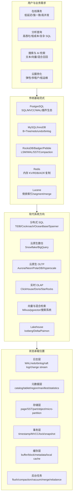

## 今日主题

主主题：`现代数据库行业全景：传统系统如何演进出现代数据库`

本篇不是某一个系统的源码深挖，而是建立后续三个月学习的地图。今天先回答四个问题：

1. 现代数据库系统大体在解决哪些需求？
2. 传统单机系统提供了哪些基础范式？
3. 前沿系统到底在传统范式上推进了什么？
4. 后续深入每个系统时，应该问哪些能落到实现的问题？

## 今日结论

现代数据库不是沿着一条线演进，而是围绕几个压力同时分化：

| 压力 | 传统答案 | 现代推进方向 | 代价 |
| --- | --- | --- | --- |
| 单机容量与吞吐不够 | 更强机器、分库分表、读写分离 | 分布式 SQL、shared-nothing、自动分片 | 分布式事务、元数据、热点、重平衡复杂 |
| 存储成本太高 | 本地盘、归档库、冷热分层 | 存算分离、对象存储、serverless | 远程 I/O、缓存一致性、元数据服务成为核心瓶颈 |
| OLTP 与 OLAP 互相影响 | 主库做事务，ETL 到数仓 | HTAP、CDC、列存副本、实时数仓 | 新鲜度、一致性、资源隔离、写放大 |
| 查询形态变复杂 | B+Tree 索引、二级索引 | 倒排索引、向量索引、JSON/半结构化、湖仓表格式 | 更新成本、召回率/精度、索引构建与回收 |
| 运维复杂度高 | DBA 手工调参、备份、扩容 | 云托管、自动弹性、无服务器 | 可观测性、成本失控、黑盒化 |
| 生态需求多 | 内核功能 + 少量插件 | 插件、外部系统组合、专门系统协同 | “能做”不等于“适合长期重度使用” |

从 storage-first 角度看，现代系统的核心并不是“用了 Raft、LSM、列存、对象存储”这些名词，而是把状态重新分配到了不同组件里：

- 数据状态：page、SST、part、segment、micro-partition、object file。
- 日志状态：WAL、redo、undo、binlog、raft log、AOF、change stream。
- 事务状态：timestamp、lock、write intent、MVCC version、snapshot。
- 元数据状态：catalog、schema、tablet/region/part manifest、placement、statistics。
- 缓存状态：buffer pool、block cache、metadata cache、local SSD cache、result cache。
- 后台状态：flush、compaction、vacuum、merge、GC、rebalance、index build。

所谓“计算节点无状态”，通常不是没有状态，而是把需要长期保持的状态移到了共享存储、日志服务、元数据服务、事务协调器或远端缓存里。

## 整体架构模型图

下图是根据公开资料整理的行业学习地图，不对应某一个具体产品的官方架构图。后续学习单个系统时，需要优先替换为该系统官方架构图或官方论文图。

这张图要服务后续学习，不是为了分类漂亮。每次看一个系统，都要把它拆到：

- 计算层在哪里，是否真的无状态。
- 存储层在哪里，数据单位是什么。
- 日志层在哪里，日志如何写入、读取、截断和回收。
- 事务层在哪里，MVCC/锁/时间戳由谁维护。
- 元数据层在哪里，谁负责分片、schema、placement、版本和统计信息。
- 复制层在哪里，复制对象是日志、page、SST、part、tablet 还是 query result。
- 缓存层在哪里，cache miss 后走什么路径。

## 传统系统提供的基础范式

这些系统不是“过时系统”，而是现代系统反复复用或改写的基础范式。

| 系统 | 核心目标 | 关键范式 | 它启发了什么 | 典型 badcase |
| --- | --- | --- | --- | --- |
| PostgreSQL | 通用关系数据库、正确性、扩展性 | SQL、MVCC、WAL、heap table、B+Tree、extension | 现代 SQL 层、插件生态、单机 OLTP 语义基准 | VACUUM/膨胀、长事务拖累 GC、扩展能力和内核能力边界不清 |
| MySQL/InnoDB | 高并发 OLTP、生态兼容 | clustered index、redo/undo、buffer pool、binlog | 互联网 OLTP 默认模型、主从复制、二级索引回表 | 热点页、二级索引维护、binlog 与引擎日志边界、在线 DDL 复杂 |
| RocksDB | 嵌入式高性能 KV 存储 | LSM、WAL、memtable、SST、compaction、block cache | TiKV、Cockroach Pebble、流处理 state store、对象存储元数据 KV | compaction 放大、读放大、参数多、事务/SQL 需上层补齐 |
| Redis | 低延迟内存数据结构服务 | 单线程事件循环、内存结构、RDB/AOF、复制、cluster | 缓存、轻量状态、队列/限流/会话等工程模式 | 大 key、fork 抖动、AOF rewrite、持久化和缓存定位混用 |
| Lucene | 文本检索与相关性排序 | 倒排索引、segment、IndexWriter、merge、near-real-time search | Elasticsearch/OpenSearch/Solr，后续也影响混合检索系统 | 更新等于删除加新增、segment merge 成本、事务语义弱于 OLTP |

这里的学习重点不是背“PostgreSQL 是 MVCC，RocksDB 是 LSM”，而是问：

- 日志里记录的是物理变更、逻辑命令、redo 还是复制事件？
- 存储层的最小变更单位是什么，page、key/value、segment 还是 object？
- 崩溃恢复从哪个 checkpoint 或 manifest 开始？
- 二级索引和主数据如何保持一致？
- 后台任务如果跟不上，系统先表现为延迟抖动、空间放大、读放大，还是不可用？

## 现代前沿方向

### 1. 分布式 SQL

代表系统：`TiDB`、`CockroachDB`、`OceanBase`、`YugabyteDB`、`Spanner`。

目标是让 SQL/事务能力横向扩展，减少应用自己分库分表的复杂度。它们通常把数据拆成 range/tablet/region，通过 Raft/Paxos 等复制协议维护副本，并把事务、时间戳、元数据调度放到专门组件里。

真正需要追问的不是“是否用了 Raft”，而是：

- 一个 SQL row 如何编码成 KV key？
- 二级索引是全局索引、局部索引，还是异步索引？
- 一个事务写多行、多 region 时，prewrite/commit/rollback 状态如何恢复？
- raft log、存储引擎 WAL、binlog/changefeed 三者有什么边界？
- region/tablet split、merge、leader transfer 由谁触发，元数据如何保持一致？

典型 badcase：

- 热点 key 或热点 range 让自动分片失效。
- 大事务跨很多 region，锁、日志、回滚和 GC 成本放大。
- 元数据调度器成为隐性关键路径。
- “兼容 MySQL/PostgreSQL 协议”不等于完整复制其执行语义和插件生态。

### 2. 云原生存算分离数仓

代表系统：`Snowflake`、`BigQuery`。

目标是让存储和计算独立扩缩，用户不再维护本地磁盘、节点、升级和容量规划。Snowflake 官方把架构描述为数据库存储、计算和云服务三层；BigQuery 官方文档明确强调 storage layer 与 compute layer 独立运作。

storage-first 视角下，重点不是“数据放对象存储”这么简单，而是：

- 文件或 micro-partition 如何组织，统计信息在哪里维护？
- metadata cache 如何避免每次查询都扫对象存储目录？
- 小文件、频繁更新、删除和 schema evolution 如何处理？
- 计算节点读远端数据时，本地缓存何时有效、何时失效？
- 多租户下如何把缓存、shuffle、metadata 和 object storage 请求隔离？

典型 badcase：

- 小批量高频写入会放大元数据和小文件管理成本。
- 远程 I/O 把性能问题转成缓存命中率和对象存储请求模式问题。
- serverless 降低运维门槛，但成本模型更容易黑盒化。

### 3. 云原生 OLTP 与共享存储

代表系统：`Aurora`、`Neon`、`PolarDB`、`Azure SQL Hyperscale`。

这类系统更接近你公司项目关注的方向：大容量、低成本、SQL、分布式、共享存储、计算节点尽量无状态。

学习重点应该放在状态转移：

- 传统数据库里的 buffer pool、WAL、page、checkpoint 被拆到了哪里？
- page server / storage node / log service / safekeeper 之间如何交互？
- 主计算节点故障后，新计算节点从哪里恢复内存状态？
- 日志服务如何截断，page version 如何 GC？
- 只读节点读的是共享 page、redo 回放后的 page，还是缓存副本？

典型 badcase：

- 计算节点“无状态”会把恢复压力转到日志服务、page service 和 metadata service。
- 共享存储降低扩容成本，但远程 page miss 可能导致尾延迟。
- 多版本 page 与快照保留容易带来 GC 和存储膨胀问题。

### 4. 实时 OLAP 与列存

代表系统：`ClickHouse`、`Apache Doris`、`StarRocks`、`Druid`、`Pinot`、`DuckDB`。

目标是低延迟分析、实时写入、复杂聚合和高并发看板。ClickHouse 官方文档强调列式存储和向量化执行，MergeTree 用 part、稀疏主键、后台 merge 来支撑大规模分析；Doris 官方文档强调 MPP、FE/BE、列存和存算一体/存算分离两种部署方式；StarRocks 官方文档强调 MPP、向量化执行、列存和实时更新。

storage-first 视角要问：

- 写入是 append part、segment、rowset，还是先写 log 再转换？
- 主键更新如何实现，是 merge-on-read、copy-on-write，还是后台 compaction？
- 稀疏索引、min/max、Bloom、倒排索引、物化视图如何协同？
- 小批量实时写入和大批量分析扫描如何隔离？
- 后台 merge/compaction 跟不上时，查询性能如何退化？

典型 badcase：

- 点查和高频小事务通常不是列存强项。
- 更新/删除看似支持，实际可能依赖后台合并，读路径会变复杂。
- 物化视图和预聚合提高性能，但带来一致性、刷新和资源隔离问题。

### 5. 搜索、向量与混合检索

代表系统：`Lucene/Elasticsearch/OpenSearch`、`Milvus`、`pgvector`、`BigQuery/Snowflake/Spanner 的搜索或向量能力`。

目标是从结构化 SQL 扩展到非结构化数据、全文搜索、embedding 相似性检索和混合检索。Lucene 提供倒排索引和 segment merge 的基础范式；Milvus 官方文档把自己定位为面向海量向量相似性搜索的云原生向量数据库，并强调控制面/数据面分离、共享存储和 WAL。

storage-first 视角要问：

- 向量索引是 HNSW、IVF、DiskANN 还是其他结构？
- 新写入向量何时进入可查询索引？
- 删除和更新如何进入索引 GC？
- segment sealed/growing 的边界是什么？
- 混合检索时，标量过滤和向量 ANN 谁先执行，代价模型如何估计？

典型 badcase：

- pgvector 让 PostgreSQL 能做向量检索，但高维、大规模、高更新、低延迟场景下要重新评估索引构建、VACUUM、内存和召回率。
- 专门向量库擅长 ANN，但事务、SQL、复杂约束和生态能力通常不如关系数据库。
- 混合检索不是“全文 + 向量”简单相加，过滤下推、召回候选数和重排成本会决定实际效果。

### 6. Lakehouse 与对象存储表格式

代表系统：`Iceberg`、`Delta Lake`、`Paimon`。

目标是在对象存储上提供表语义、schema evolution、snapshot、time travel、ACID commit 和多引擎共享。它们不是传统意义上的数据库内核，但正在影响云数仓、实时数仓和 AI 数据平台。

storage-first 视角要问：

- manifest、snapshot、metadata file 如何提交和回收？
- 并发 writer 如何保证提交原子性？
- 小文件如何合并，数据文件如何删除？
- 多计算引擎读同一张表时，缓存和元数据一致性如何处理？

典型 badcase：

- 元数据文件链过长会拖慢 planning。
- 小文件和高频 commit 会放大对象存储请求。
- 表格式提供的是数据湖上的表协议，不自动提供数据库级索引、事务调度和低延迟服务能力。

## 插件、生态补丁与变相方案

这部分后续每篇系统报告都要保留。判断标准不是“能不能做”，而是“放大到数据量、并发、更新频率和长期运维后是否仍然适合”。

| 场景 | 原生擅长系统 | 常见补丁或组合 | 需要警惕的边界 |
| --- | --- | --- | --- |
| 向量检索 | Milvus、专门向量库、部分云数据库原生向量能力 | PostgreSQL + pgvector、Elasticsearch/OpenSearch vector、BigQuery vector indexes | 插件补功能不一定补查询优化、索引维护、召回率治理和资源隔离 |
| 地理空间 | PostGIS、部分商业/云数据库 | MySQL GIS、搜索系统 geo capability | 空间索引、复杂拓扑、事务更新成本差异很大 |
| 时间序列 | 专门时序库、ClickHouse/Druid/Pinot | PostgreSQL + TimescaleDB、MySQL 分区表 | 高基数标签、乱序写入、压缩、降采样和 retention 是核心 |
| 全文搜索 | Lucene/Elasticsearch/OpenSearch | PostgreSQL FTS、MySQL fulltext、数据库外接搜索系统 | 更新延迟、分词、相关性、事务一致性和回填成本 |
| 分布式扩展 | 原生分布式 SQL | PostgreSQL + Citus、MySQL sharding middleware | 应用透明性、跨分片事务、二级索引、DDL 和 rebalance |
| 实时分析 | ClickHouse/Doris/StarRocks/Pinot/Druid | MySQL/PostgreSQL + CDC + OLAP | CDC 延迟、乱序、幂等、schema change 和 exactly-once 边界 |

工程上最容易踩的坑是把“生态强”误解成“内核原生适合”。插件通常能补能力入口，但核心 badcase 常常出现在：

- 事务一致性和失败恢复。
- 大规模回填和索引重建。
- 内核优化器是否理解该插件的代价。
- 后台任务是否能被统一调度和限流。
- 观测和运维是否能进入主系统的诊断路径。

## 后续深入每个系统时的提问框架

为了避免把技术路线写成方案罗列，后续每个重点系统都按模块问到实现边界。

### 日志

- 日志记录的是物理 page diff、逻辑命令、KV mutation、row change，还是复制协议 entry？
- 写入路径是否有 group commit、batch、日志聚合？
- 日志如何分段、读取、截断、删除、归档和回收？
- checkpoint、snapshot、manifest 与日志截断的关系是什么？
- CDC 读取的是 WAL/binlog/changefeed/raft log，还是额外变更流？
- BLOB 或大对象是直接进入日志，还是只记录引用？

典型 badcase：日志保留被长事务、复制延迟、CDC consumer 或备份任务拖住，导致磁盘膨胀或恢复时间变长。

### 存储

- 存储单位是 page、SST、part、segment、tablet、region、object file 还是 micro-partition？
- 写入先进入内存结构、日志、远端存储，还是直接生成不可变文件？
- batch/事务如何落到存储单位上？
- 版本可见性在哪里维护，page tuple、key sequence、delete marker、manifest，还是 metadata service？
- 缓存是 buffer pool、block cache、OS page cache、local SSD cache，还是 metadata cache？
- 后台任务如何避免和前台读写竞争？

典型 badcase：后台 compaction/merge/vacuum 跟不上，表现为读放大、空间放大、尾延迟或 GC 堵塞。

### 事务与一致性

- 隔离级别如何实现，锁、MVCC、timestamp、optimistic/pessimistic 哪个为主？
- 跨分片事务如何提交和恢复？
- 事务状态存在哪里，客户端、SQL 节点、事务协调器、KV 层，还是 metadata service？
- 读快照如何选择，是否依赖 physical clock、logical clock、hybrid time 或 timestamp oracle？
- follower read、read replica、learner read 是否牺牲新鲜度？

典型 badcase：大事务、长事务和热点写会同时放大锁等待、GC 压力、日志保留和复制延迟。

### 元数据

- catalog、schema、table、index、partition、tablet/region/shard、manifest、statistics 分别由谁维护？
- 元数据如何持久化和复制？
- 元数据更新与数据更新是否在同一个事务里？
- 节点故障、分片迁移、leader 迁移时，元数据如何收敛？
- metadata cache 如何失效和刷新？

典型 badcase：数据面看似分布式，控制面或元数据服务成为扩展、可用性和恢复的真正瓶颈。

### 二级索引

- 二级索引是同步写、异步写，还是后台构建？
- 唯一约束如何检查，是否需要跨分片读写？
- 索引回填如何与在线写入保持一致？
- 索引 GC 和主数据 GC 如何协调？
- 索引 key 如何编码，是否包含 primary key、timestamp 或 shard 信息？

典型 badcase：在线建索引和回填会与前台写入争抢 I/O、CPU、锁和日志空间；失败重试还要保证幂等。

## 本地源码锚点

Day 001 只记录源码入口，不写实现级结论。后续涉及实现细节时，必须回到这些本地源码验证。

| 系统 | 本地源码 | 当前状态 | 后续优先入口 |
| --- | --- | --- | --- |
| PostgreSQL | `D:\program\postgres` | `master 7424aac0 clean` | `src/backend/access/transam/xlog.c`、`src/backend/access/heap/heapam.c`、`src/backend/storage/buffer/bufmgr.c`、`src/backend/access/nbtree`、`src/backend/utils/cache/relcache.c` |
| MySQL/InnoDB | `D:\program\mysql-server` | `trunk 447eb26e clean` | `storage/innobase/log`、`storage/innobase/buf`、`storage/innobase/trx`、`storage/innobase/btr`、`storage/innobase/dict` |
| RocksDB | `D:\program\rocksdb` | `4595a5e9`，存在未跟踪 build 输出 | `db/db_impl/db_impl_write.cc`、`db/write_batch.cc`、`db/version_set.cc`、`db/memtable.cc`、`db/wal_manager.cc`、`table/block_based` |
| Redis | `D:\program\redis` | `unstable 247307de clean` | `src/aof.c`、`src/rdb.c`、`src/replication.c`、`src/cluster.c`、`src/db.c`、`src/t_stream.c` |
| Lucene | `D:\program\lucene` | `main 733141ec clean` | `lucene/core/src/java/org/apache/lucene/index/IndexWriter.java`、`SegmentInfos.java`、`store/Directory.java`、`search/IndexSearcher.java` |
| TiDB | `D:\program\tidb` | `master f1901d83 clean` | `pkg/session`、`pkg/planner`、`pkg/executor`、`pkg/ddl`、`pkg/meta`、`pkg/kv` |
| ClickHouse | `D:\program\ClickHouse` | `master c2fb57f3 dirty/partial` | 当前 checkout 不完整，暂不写源码级结论；后续需修复本地仓库后再进入 `src/Storages`、`src/Processors`、`src/Interpreters` |
| Apache Doris | `D:\program\doris` | `master 467e7e7a dirty/partial` | 当前 checkout 不完整，暂不写源码级结论；后续需修复本地仓库后再进入 `fe`、`be`、`cloud`、`docs` |
| Milvus | `D:\program\milvus` | `master 54c25d00 clean` | `internal/rootcoord`、`internal/datacoord`、`internal/querycoordv2`、`internal/datanode`、`internal/querynodev2`、`internal/streamingcoord` |

## 闭源系统公开资料边界

| 系统 | 资料类型 | 当前能写的结论边界 |
| --- | --- | --- |
| Snowflake | 官方 key concepts / architecture 文档 | 可讨论三层架构、存算分离、micro-partition、virtual warehouse、cloud services；内部实现细节必须标注为公开资料推断 |
| BigQuery | 官方 overview / storage / query 文档 | 可讨论 serverless、compute/storage separation、列式存储、外部表和治理能力；内部调度、存储格式细节需谨慎 |
| Spanner | Google Cloud 官方页面、Spanner 论文 | 可讨论全球分布式 SQL、TrueTime、Paxos、自动 split、强一致事务；托管服务实现细节以公开资料为准 |
| Aurora/Neon/PolarDB/Hyperscale | 官方论文、博客、文档 | 后续云原生 OLTP 专题再深入；今天只作为共享存储方向入口 |

## 我的问题

1. 对共享存储 SQL 数据库而言，计算节点“无状态”的最低条件是什么？buffer pool、prepared statement、session、lock table、temporary table、transaction state 哪些可以丢，哪些必须恢复？
2. 日志服务和 page/storage service 分离后，checkpoint 的定义是否改变？日志截断由谁决定？
3. 分布式 SQL 中，二级索引维护到底更像 OLTP B+Tree 索引，还是更像跨 region 的物化视图？
4. 元数据服务为什么在不同系统里变成 PD、catalog service、FE master、root coord、manifest list 或 page server？这些名字背后的共同职责是什么？
5. 插件补能力时，优化器和后台任务是否理解插件的数据结构？如果不理解，什么规模下会从“方便”变成 badcase？
6. 实时 OLAP 的主键更新、删除和物化视图刷新，到底把一致性问题推给了查询时合并、后台 compaction，还是写入路径？
7. 向量索引和全文索引进入通用数据库后，如何处理事务可见性、索引回收、召回率和代价模型？

## badcase 与架构边界

这里不单独做“缺点专题”，而是按模块记录今天全景阶段识别到的边界。

| 模块 | badcase | 后续验证方式 |
| --- | --- | --- |
| 日志 | WAL/binlog/raft log/changefeed 多套日志并存，故障恢复、CDC 和复制保留互相影响 | 看 PostgreSQL WAL、InnoDB redo/binlog、TiDB/TiKV changefeed、RocksDB WAL |
| 存储 | LSM/列存/object file 都倾向不可变文件，删除和更新通常转成后台合并问题 | 看 RocksDB compaction、ClickHouse MergeTree、Doris rowset、Milvus segment |
| 事务 | 分布式事务把单机锁/MVCC问题扩展成时间戳、锁表、重试、GC、跨副本复制问题 | 看 TiDB transaction、Spanner 论文、Cockroach/Yugabyte 后续资料 |
| 元数据 | 元数据服务既要高可用又要强一致，还要参与调度；它经常是系统真正的控制面 | 看 TiDB PD、Doris FE、Milvus RootCoord/DataCoord、Lakehouse manifest |
| 二级索引 | 全局索引、异步索引、在线回填和唯一约束会放大跨分片一致性问题 | 看 PostgreSQL/InnoDB 索引基础，再看 TiDB/OceanBase/Cockroach |
| 缓存 | 存算分离后，缓存从优化项变成性能关键路径；cache miss 可能变成远程 I/O 尾延迟 | 看 Neon/Aurora/BigQuery/Snowflake 公开资料和后续源码系统 |
| 后台任务 | compaction、merge、vacuum、GC、rebalance 资源抢占会直接影响前台延迟 | 看 RocksDB、PostgreSQL VACUUM、ClickHouse/Doris merge |
| 成本 | serverless 和对象存储降低固定成本，但请求数、扫描量、shuffle 和缓存 miss 会造成账单不稳定 | 看 BigQuery/Snowflake/Doris 存算分离资料 |
| 生态补丁 | 插件让能力进入系统，但通常难以完整进入优化器、恢复、观测和资源隔离体系 | 看 pgvector、PostGIS、TimescaleDB、Citus、Redis modules |

## 工程启发

第一，学习现代数据库要从“状态在哪里”入手。

架构图里最重要的不是组件数量，而是每类状态由谁持久化、谁复制、谁缓存、谁负责恢复。只要状态没有被说清楚，“无状态计算节点”“存算分离”“serverless”都只是表述。

第二，日志和元数据是现代数据库最容易被低估的核心。

传统单机系统里 WAL/redo/binlog 已经很复杂；分布式和云原生系统又引入 raft log、change stream、object manifest、placement metadata。很多系统的坏情况不是前台 SQL 执行本身，而是日志保留、元数据变更、恢复和后台 GC 互相牵制。

第三，插件生态是能力扩展，不是内核能力等价替代。

pgvector、PostGIS、TimescaleDB、Citus 这类扩展很有价值，但必须追问它们是否进入优化器、事务、恢复、复制、备份、监控和限流体系。否则规模放大后，插件边界会变成工程边界。

第四，现代数据库经常用“后台任务”换取前台简洁。

LSM 的 compaction、列存的 merge、MVCC 的 vacuum、对象存储表格式的小文件合并、向量索引的构建与重排，本质都是把复杂性推迟到后台。评估系统时必须看后台任务跟不上时的退化路径。

第五，对你们项目最相关的主线是共享存储 SQL 数据库。

需要重点比较 Aurora/Neon/PolarDB/Hyperscale/Snowflake/BigQuery/Doris 存算分离模式，但不能只看“计算无状态”。真正要学的是日志服务、page/object 存储、metadata service、cache、recovery 和多租户资源隔离如何配合。

## 下一步

Day 002 建议进入：`传统 OLTP 与存储基础：PostgreSQL、MySQL/InnoDB、SQLite`

优先学习：

- page/heap/B+Tree 的数据组织。
- WAL、redo、undo、binlog 的职责边界。
- MVCC 可见性和长事务 badcase。
- buffer pool 与 OS page cache。
- 二级索引、唯一约束、回表和在线 DDL。

这一步是为了给后续分布式 SQL 和共享存储数据库建立对照基线。

## 参考来源与引用

### 官方文档与论文

- [PostgreSQL 官方文档：Database Physical Storage](https://www.postgresql.org/docs/current/storage.html)
- [PostgreSQL 官方文档：Write-Ahead Logging](https://www.postgresql.org/docs/current/wal-intro.html)
- [MySQL 8.4 Reference Manual：InnoDB Architecture](https://dev.mysql.com/doc/refman/8.4/en/innodb-architecture.html)
- [RocksDB Wiki：RocksDB Overview](https://github.com/facebook/rocksdb/wiki/RocksDB-Overview)
- [Redis 官方文档：Redis persistence](https://redis.io/docs/latest/operate/oss_and_stack/management/persistence/)
- [Apache Lucene API：IndexWriter](https://lucene.apache.org/core/10_3_1/core/org/apache/lucene/index/IndexWriter.html)
- [Snowflake 官方文档：Key concepts and architecture](https://docs.snowflake.com/en/user-guide/intro-key-concepts)
- [BigQuery 官方文档：BigQuery overview](https://cloud.google.com/bigquery/docs/introduction)
- [Google Cloud Spanner 官方页面](https://cloud.google.com/spanner)
- [Spanner 论文：Spanner: Google's Globally Distributed Database](https://research.google/pubs/spanner-googles-globally-distributed-database/)
- [TiDB 官方文档：TiDB Architecture](https://docs.pingcap.com/tidb/stable/tidb-architecture/)
- [ClickHouse 官方文档：Architecture Overview](https://clickhouse.com/docs/development/architecture)
- [Apache Doris 官方文档：Introduction to Apache Doris](https://doris.apache.org/docs/dev/gettingStarted/what-is-apache-doris/)
- [StarRocks 官方文档：Introduction to StarRocks](https://docs.starrocks.io/docs/introduction/StarRocks_intro/)
- [Milvus 官方文档：Architecture Overview](https://milvus.io/docs/architecture_overview.md)

### 本地源码

- `D:\program\postgres`
- `D:\program\mysql-server`
- `D:\program\rocksdb`
- `D:\program\redis`
- `D:\program\lucene`
- `D:\program\tidb`
- `D:\program\ClickHouse`：当前 checkout 不完整，暂不写源码级结论。
- `D:\program\doris`：当前 checkout 不完整，暂不写源码级结论。
- `D:\program\milvus`
