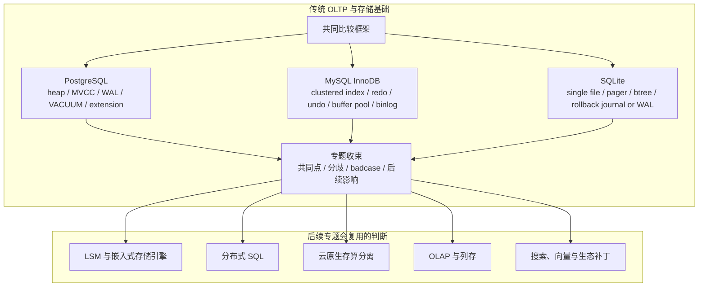

## 今日主题

主主题：`现代数据库行业全景之传统 OLTP 与存储基础预览`

这是 `Topic 1：现代数据库行业全景` 中的第一篇后续专题预览文。它不是 PostgreSQL、MySQL/InnoDB、SQLite 的系统深挖，而是解释：

1. 为什么传统 OLTP 仍然是现代数据库学习的基线。
2. PostgreSQL、MySQL/InnoDB、SQLite 后续为什么各自需要单独成文。
3. 后续进入系统文章时，应该围绕哪些 storage-first 问题展开。
4. 哪些 badcase 会贯穿传统 OLTP、分布式 SQL 和云原生数据库。

## 这个专题为什么独立存在

传统 OLTP 数据库解决的是一组非常基础但很难绕开的工程问题：

- 多用户并发读写同一批数据。
- 单条 SQL 或事务失败后，系统仍要保持一致。
- 进程、机器或操作系统崩溃后，已提交数据不能丢。
- 索引、约束、元数据和主数据要共同演进。
- 读写性能不能只靠“全量扫描”或“全局锁”支撑。

现代数据库虽然在分布式、云原生、列存、向量、对象存储上继续演进，但很多核心问题仍然可以回到传统 OLTP 基础：

| 现代问题 | 传统 OLTP 中的基线问题 |
| --- | --- |
| 分布式事务 | 单机事务、锁、MVCC、redo/undo 的边界 |
| 存算分离恢复 | WAL/checkpoint/page/buffer 的职责拆分 |
| 二级索引一致性 | 单机二级索引、唯一约束、回表和回滚 |
| 元数据服务 | catalog/schema/table/index 元数据如何持久化和变更 |
| 后台 GC | VACUUM、purge、checkpoint、page reuse |
| 插件生态 | 内核能力和扩展能力的边界 |

所以这个专题的目的不是怀旧，也不是学“老数据库怎么实现 SQL”。它是为后续判断 TiDB、Spanner、Aurora、Neon、Snowflake、ClickHouse、pgvector 等系统建立基线。

## 整体学习地图

下图是根据公开资料整理的学习地图，不对应某个单一系统的官方架构图。

这个专题应当形成一个“对照表”，而不是只形成三个互不相关的系统笔记。后续每篇系统文都要回答同一组问题，这样最后收束时才能比较。

## 代表系统与学习顺序

| 顺序 | 系统 | 为什么选它 | 后续文章重点 |
| --- | --- | --- | --- |
| 1 | PostgreSQL | 关系数据库正确性、MVCC、WAL、VACUUM、extension 生态的典型代表 | heap tuple、page、WAL、snapshot、VACUUM、B-Tree、logical decoding、extension 边界 |
| 2 | MySQL/InnoDB | 互联网 OLTP 生态中的默认基线之一，clustered index、redo/undo、binlog、buffer pool 很有代表性 | clustered index、secondary index 回表、redo/undo、purge、buffer pool、binlog 与引擎日志边界 |
| 3 | SQLite | 单文件嵌入式 SQL 的极简边界，适合观察 pager、btree、journal/WAL、锁和本地事务 | pager、single-file format、rollback journal/WAL、locking、atomic commit、嵌入式场景边界 |

学习顺序先 PostgreSQL，再 MySQL/InnoDB，最后 SQLite。

原因是：

- PostgreSQL 更适合作为关系数据库语义、MVCC、WAL、扩展生态的理解基线。
- MySQL/InnoDB 更适合作为 clustered index、互联网主从复制、binlog 与 OLTP 工程实践的对照。
- SQLite 更适合作为“去掉服务端和分布式之后，数据库最小内核仍然要解决什么”的极简对照。

## 核心问题域

### 1. 存储模型

需要比较的问题：

- 数据行如何放到 page 或文件里？
- 主表和索引是否是同一棵树？
- 二级索引里存的是 tuple id、primary key，还是别的定位信息？
- 大字段、溢出页、TOAST 或 BLOB 如何处理？
- free space、page reuse、fragmentation 如何管理？

后续重点：

- PostgreSQL：heap table 与 index 分离。
- InnoDB：clustered index 让主键和数据组织绑定。
- SQLite：btree/pager 把单文件数据库组织成 pages。

### 2. 日志、恢复与 checkpoint

需要比较的问题：

- 日志记录的是物理变化、逻辑变化，还是混合信息？
- checkpoint 负责什么，何时可以回收日志？
- 崩溃恢复从哪里开始？
- 复制或 CDC 读取的是 WAL、binlog，还是额外机制？
- 大对象是否直接进入日志，还是记录引用？

后续重点：

- PostgreSQL：WAL 与 checkpoint、replication、logical decoding 的关系。
- InnoDB：redo/undo 与 MySQL binlog 的职责边界。
- SQLite：rollback journal 和 WAL 两种模式分别牺牲什么。

### 3. 事务、MVCC 与并发控制

需要比较的问题：

- 一个事务的可见性由谁维护？
- 版本保存在 tuple、undo log、page，还是其他结构里？
- 读写冲突如何检测？
- 长事务会拖住什么资源？
- 回滚时需要恢复哪些状态？

后续重点：

- PostgreSQL：tuple version 与 VACUUM。
- InnoDB：undo log、read view、purge。
- SQLite：锁、snapshot 和单文件事务边界。

### 4. 二级索引与约束维护

需要比较的问题：

- 二级索引如何指向主数据？
- 唯一约束如何在并发下检查？
- 更新主键或索引列时，主数据和索引如何保持一致？
- 在线建索引或回填会影响哪些资源？

后续重点：

- PostgreSQL：heap + index 的松耦合与 dead tuple。
- InnoDB：secondary index 到 clustered index 的回表路径。
- SQLite：单文件内的索引、约束和事务原子性。

### 5. 元数据与扩展边界

需要比较的问题：

- catalog/schema/table/index 元数据如何存储？
- DDL 与普通事务是什么关系？
- 元数据缓存如何失效？
- 插件或扩展能改变什么，不能改变什么？

后续重点：

- PostgreSQL：extension 是优势，但也要判断什么时候只是变通。
- MySQL：存储引擎接口、InnoDB 与 server 层职责边界。
- SQLite：嵌入式库的简洁性和扩展边界。

### 6. 缓存、后台任务与资源隔离

需要比较的问题：

- buffer pool / shared buffers / OS page cache 谁负责缓存？
- 后台任务和前台查询如何竞争？
- checkpoint、VACUUM、purge、page flush 会造成什么抖动？
- 单机系统没有多租户调度时，资源隔离靠什么？

后续重点：

- PostgreSQL：shared buffers、autovacuum、checkpoint。
- InnoDB：buffer pool、change buffer、purge、flush。
- SQLite：page cache 与嵌入式进程内资源边界。

## 典型技术路线

传统 OLTP 不是一个技术路线，而是几种路线的交叉：

| 路线 | 代表系统 | 核心选择 | 后续要验证的问题 |
| --- | --- | --- | --- |
| heap + secondary indexes | PostgreSQL | 主数据和索引分离，MVCC 版本在 heap tuple 上体现 | VACUUM 为什么关键，索引如何处理 dead tuple，logical decoding 如何读取变化 |
| clustered index + undo/redo | MySQL/InnoDB | 主键索引组织数据，undo 支撑 MVCC，redo 支撑恢复 | 二级索引回表成本，binlog 与 redo 的一致性，purge 如何回收版本 |
| single file + pager + btree | SQLite | 数据库是一个文件，pager 负责 page 与事务边界 | 多写并发边界，rollback journal/WAL 的取舍，嵌入式场景为什么成立 |

预览阶段只记住路线，不提前下源码结论。系统文章阶段再回到本地源码和官方文档验证。

## badcase 与架构边界

| 模块 | 典型 badcase | 为什么后续专题会复用 |
| --- | --- | --- |
| 日志 | 日志不能及时回收，恢复时间变长，复制或 CDC 拖住保留点 | 分布式 SQL 的 raft log/changefeed、云原生日志服务也会遇到类似问题 |
| MVCC | 长事务拖住旧版本，导致空间膨胀或 GC 延迟 | TiDB safepoint、Spanner old version、Lakehouse snapshot retention 都有类似影子 |
| 二级索引 | 更新、唯一约束、在线建索引和回填影响前台写入 | 分布式全局索引、异步索引和物化视图会把问题放大 |
| 缓存 | checkpoint、flush、cold cache 造成尾延迟 | 存算分离里远程 page miss 与 cache warmup 更敏感 |
| 后台任务 | VACUUM、purge、checkpoint 抢资源 | LSM compaction、OLAP merge、Lakehouse compaction 都是后台复杂性 |
| 元数据 | DDL、catalog cache、schema change 与事务边界复杂 | 分布式 meta service、PD、FE、catalog service 都继承这个问题 |
| 插件生态 | 插件能补功能，但可能进不了优化器、恢复、复制、监控和限流体系 | pgvector、PostGIS、TimescaleDB、Citus 等都要看工程边界 |

## 对后续专题的影响

### 对 LSM 与嵌入式存储引擎

传统 OLTP 先提供 page/B+Tree/WAL/MVCC 基线。到 RocksDB、BadgerDB、Pebble 时，需要反问：

- 为什么从 page update 转向 LSM append/compaction？
- LSM 如何替代或弱化 buffer pool？
- 事务和 SQL 为什么通常要上层补齐？

### 对分布式 SQL

分布式 SQL 不是“把 PostgreSQL/MySQL 做成多节点”这么简单。它需要把单机事务、索引、元数据和日志拆成跨节点版本：

- 单机 WAL/redo 对应到 raft log 和复制日志。
- 单机二级索引对应到全局/局部索引。
- 单机 catalog 对应到 PD/meta service/catalog service。
- 单机长事务对应到全局 timestamp、lock、GC safepoint。

### 对云原生存算分离数据库

传统 OLTP 帮助我们问清楚“计算节点无状态”到底拆掉了什么：

- WAL 是否下沉到日志服务？
- page 是否交给远端 page server 或共享存储？
- buffer pool 冷启动如何处理？
- checkpoint 和 log truncation 由谁决定？
- 元数据服务是否成为恢复路径的一部分？

### 对搜索、向量与生态补丁

PostgreSQL 的 extension 生态会成为判断插件边界的重要基线。后续看 pgvector、PostGIS、TimescaleDB、Citus 时，不能只看“能做”，还要问：

- 优化器是否理解插件代价？
- 索引是否参与事务、恢复、复制、备份？
- 大规模更新和回填如何处理？
- 监控、限流和资源隔离是否进入主系统体系？

## 本地源码锚点

Day 002 是专题预览，不写源码级结论；这里只记录后续系统文章的源码入口。

| 系统 | 本地源码 | 当前状态 | 后续优先入口 |
| --- | --- | --- | --- |
| PostgreSQL | `D:\program\postgres` | `master 7424aac0 clean` | `src/backend/access/heap/heapam.c`、`src/backend/access/transam/xlog.c`、`src/backend/storage/buffer/bufmgr.c`、`src/backend/access/nbtree`、`src/backend/access/heap/vacuumlazy.c`、`src/backend/catalog` |
| MySQL/InnoDB | `D:\program\mysql-server` | `trunk 447eb26e clean` | `storage/innobase/btr`、`storage/innobase/buf`、`storage/innobase/log`、`storage/innobase/trx`、`storage/innobase/row`、`storage/innobase/dict` |
| SQLite | `D:\program\sqlite` | `master 97901bbd clean` | `src/btree.c`、`src/pager.c`、`src/wal.c`、`src/vdbe.c`、`src/build.c`、`src/backup.c` |

## 我的问题

1. PostgreSQL 的 heap + index 分离让 MVCC 表达更直接，但它把哪些成本转移给 VACUUM 和索引清理？
2. InnoDB clustered index 对 OLTP 点查很自然，但二级索引回表、主键选择和页分裂在高并发下会如何放大？
3. SQLite 用单文件 + pager 解决事务原子性，它的锁模型和 WAL 模式为什么足够支撑嵌入式场景，但不适合作为通用多租户服务端数据库？
4. WAL、redo、undo、binlog 这些名字相近的日志，分别服务恢复、回滚、复制、CDC 中的哪一部分？
5. 传统 OLTP 的长事务 badcase，到了分布式 SQL、云原生存储、Lakehouse snapshot 时分别会变成什么？
6. 插件补能力时，什么时候只是 API 层可用，什么时候真正进入了优化器、事务、恢复和运维体系？

## 工程启发

第一，传统 OLTP 是后续所有数据库架构判断的基线。

不先搞清 page、WAL、MVCC、索引、checkpoint、后台 GC，就很难判断分布式 SQL 和云原生数据库到底新增了什么复杂性，也很难判断某个系统是否只是把复杂性转移到了 metadata service、log service 或后台任务里。

第二，同样叫“日志”，职责可能完全不同。

WAL/redo 主要服务崩溃恢复，undo 服务事务回滚和历史版本，binlog 常服务复制和 CDC。后续看 Raft log、changefeed、object manifest 时，也要先问日志服务的是恢复、一致性、复制、审计还是外部消费。

第三，单机系统的 badcase 往往是分布式 badcase 的缩小版。

长事务、后台回收、二级索引回填、元数据变更、缓存冷启动，在单机里已经麻烦；到分布式和存算分离系统里，往往只是多了复制、调度、网络和多租户维度。

第四，SQLite 是很重要的“下界”。

它提醒我们数据库不一定必须是服务端系统。把数据库压缩到单文件和嵌入式库之后，仍然要处理 page、journal/WAL、atomic commit、locking。这对理解数据库最小闭环很有价值。

## 下一步

Day 003 建议进入：`LSM 与嵌入式存储引擎预览`

预览重点：

- 为什么传统 OLTP 的 B+Tree/page update 之外还需要 LSM。
- RocksDB、BadgerDB、Pebble 分别代表什么取舍。
- WAL、memtable、SST、value log、compaction、snapshot、iterator、GC 如何成为 LSM 主线。
- LSM badcase 为什么集中在写放大、读放大、空间放大、write stall 和 compaction 资源竞争。

## 参考来源与引用

### 官方文档

- [PostgreSQL Documentation: Database Page Layout](https://www.postgresql.org/docs/current/storage-page-layout.html)
- [PostgreSQL Documentation: Write-Ahead Logging](https://www.postgresql.org/docs/current/wal-intro.html)
- [PostgreSQL Documentation: Multiversion Concurrency Control](https://www.postgresql.org/docs/current/mvcc.html)
- [PostgreSQL Documentation: Routine Vacuuming](https://www.postgresql.org/docs/current/routine-vacuuming.html)
- [MySQL 8.4 Reference Manual: InnoDB Architecture](https://dev.mysql.com/doc/refman/8.4/en/innodb-architecture.html)
- [MySQL 8.4 Reference Manual: Clustered and Secondary Indexes](https://dev.mysql.com/doc/refman/8.4/en/innodb-index-types.html)
- [MySQL 8.4 Reference Manual: The Redo Log](https://dev.mysql.com/doc/refman/8.4/en/innodb-redo-log.html)
- [MySQL 8.4 Reference Manual: Undo Logs](https://dev.mysql.com/doc/refman/8.4/en/innodb-undo-logs.html)
- [SQLite Documentation: Database File Format](https://www.sqlite.org/fileformat.html)
- [SQLite Documentation: Write-Ahead Logging](https://www.sqlite.org/wal.html)
- [SQLite Documentation: File Locking And Concurrency](https://www.sqlite.org/lockingv3.html)
- [SQLite Documentation: Atomic Commit In SQLite](https://www.sqlite.org/atomiccommit.html)

### 本地源码

- `D:\program\postgres`
- `D:\program\mysql-server`
- `D:\program\sqlite`
