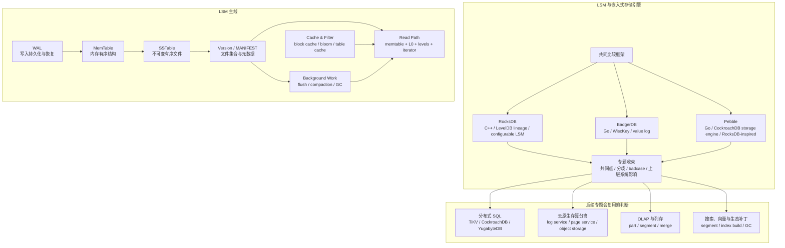

## 今日主题

主主题：`现代数据库行业全景之 LSM 与嵌入式存储引擎预览`

这是 `Topic 1：现代数据库行业全景` 中的第二篇后续专题预览文。它不是 RocksDB、BadgerDB、Pebble 的系统深挖，而是先回答：

1. 为什么传统 OLTP 的 B+Tree/page update 之外还需要 LSM。
2. 为什么 LSM 经常以嵌入式 KV 引擎的形态出现，而不是直接表现为完整数据库产品。
3. RocksDB、BadgerDB、Pebble 后续为什么各自需要单独成文。
4. 进入系统文章时，应该围绕哪些 storage-first 问题比较。
5. LSM 的 badcase 为什么集中在放大、stall、compaction、GC 和参数治理上。

## 这个专题为什么独立存在

传统 OLTP 基线里，B+Tree/page update 很自然：一条记录更新到某个 page，索引也在树结构里维护，buffer pool 缓存热页，WAL/redo 保证崩溃恢复。

但当 workload 变成高写入吞吐、大规模 KV、SSD 友好、嵌入式状态存储、流处理 state store、分布式 SQL 底层 KV 时，B+Tree 的原地更新和随机写会遇到压力：

- 随机写放大：小更新可能触发 page 写回、页分裂、索引维护和日志写入。
- 写入并发：前台写路径越依赖原地修改，越容易受锁、latch、buffer flush 影响。
- 设备特性：SSD 更适合大块顺序写和并行 I/O，而不是大量小随机覆盖。
- 复制和分片：上层系统常希望底层是有序 KV、range scan、snapshot 和批量导入能力。
- 嵌入式复用：TiKV、MyRocks、CockroachDB、Flink/RisingWave state backend 这类系统希望把存储内核作为库嵌入，而不是重新实现 page manager。

LSM 的核心回答是：前台写入先进入 WAL 和内存结构，持久化数据以不可变文件逐步落盘，再通过后台 compaction 维护读性能和空间回收。

这不是免费午餐。LSM 只是把一部分随机写复杂性转成了：

- memtable flush。
- SST 文件版本管理。
- compaction 调度。
- tombstone 和旧版本回收。
- block cache 与 bloom/filter。
- write stall 和后台 I/O 资源隔离。
- 大 value 是否进入 LSM，还是进入 value log/blob file。

所以这个专题独立存在，是因为它提供了和传统 OLTP 完全不同的状态组织方式：page update 变成 append + immutable file + background merge。

## 整体学习地图

下图是根据公开资料整理的学习地图，不对应单个系统的官方架构图。后续进入系统文章时，需要替换成 RocksDB、BadgerDB、Pebble 的官方文档、论文或源码级图示。

这张图要表达一个核心判断：LSM 系统的关键状态不是只在一棵树里，而是分散在 WAL、memtable、SST、manifest/version、cache、snapshot 和后台任务队列中。

## 代表系统与学习顺序

| 顺序 | 系统 | 为什么选它 | 后续文章重点 |
| --- | --- | --- | --- |
| 1 | RocksDB | LevelDB 之后最重要的通用嵌入式 LSM KV 引擎之一，配置面和工程细节非常丰富 | write path、WAL、memtable、SST、VersionSet、MANIFEST、block cache、compaction、write stall、BlobDB、TransactionDB 边界 |
| 2 | BadgerDB | 用 Go 写的嵌入式 KV，明确采用 WiscKey 思路，把 value 从 LSM 中分离到 value log | value log、LSM 只存 key/value pointer、SSI 事务、iterator、value GC、崩溃恢复和 key-value separation badcase |
| 3 | Pebble | CockroachDB 内部使用的 Go KV 引擎，受 RocksDB 启发但收敛到 CockroachDB 需要的功能集 | commit pipeline、indexed batch、L0 sublevels、range deletion、flush/compaction pacing、format version、RocksDB 兼容边界 |

学习顺序先 RocksDB，再 BadgerDB，最后 Pebble。

原因是：

- RocksDB 是 LSM 工程复杂性的基准，先用它建立 WAL、memtable、SST、version、compaction、cache 的完整词汇表。
- BadgerDB 用 value log 把“LSM 写放大”问题拆开，适合观察 key-value separation 如何降低一类成本，又如何引入 value GC。
- Pebble 适合观察一个上层数据库系统如何重新裁剪 RocksDB 风格的存储引擎，把通用能力收敛成 CockroachDB 所需的能力。

## 核心问题域

### 1. 存储模型

需要比较的问题：

- 数据是否全部进入 LSM，还是 value 被拆到 value log/blob file。
- memtable 用 skiplist、arena skiplist，还是其他内存结构。
- SST 的 block、index、filter、properties 如何组织。
- L0 与下层 level 的重叠关系如何影响读放大。
- MANIFEST/version 如何描述当前活跃文件集合。

后续重点：

- RocksDB：LSM + 多种 table/memtable/compaction/cache 选择，配置面极宽。
- BadgerDB：LSM tree with value log，LSM 中主要保存 key 和 value pointer。
- Pebble：继承 RocksDB 文件格式脉络，同时围绕 CockroachDB 的需求强化 L0、batch、range deletion 和 format evolution。

### 2. 写入路径

需要比较的问题：

- `Put/Write/Batch` 如何进入 WAL。
- WAL 写入和 memtable 插入之间如何保证顺序。
- group commit、batch、commit pipeline 如何降低同步成本。
- memtable 满了如何切换为 immutable memtable。
- flush 输出 SST 后，如何通过 MANIFEST 或 version edit 原子发布。
- 写入太快时，是 slow down、stall，还是依赖后台任务追赶。

后续重点：

- RocksDB：`WriteBatch`、write thread、WAL、memtable、flush、write stall。
- BadgerDB：事务写入、value log、LSM table、commit callback 和 value pointer。
- Pebble：commit queue、visible sequence number、flushable batch、WAL/memtable 约束。

### 3. 读取路径与 iterator

需要比较的问题：

- 一次 point lookup 要查多少层：mutable memtable、immutable memtable、L0 文件、各级 SST。
- Bloom/filter、block cache、table cache 如何减少 I/O。
- 范围扫描如何合并多个层级的 iterator。
- snapshot read 如何通过 sequence number 或 timestamp 过滤版本。
- tombstone、range deletion、merge operand 如何影响 iterator。

后续重点：

- RocksDB：`DBIter`、`MergingIterator`、block-based table reader、prefix/bloom、snapshot sequence。
- BadgerDB：iterator 同时处理 key version 和 value pointer；key-only iteration 与 value fetch 是不同成本。
- Pebble：把 batch 视作 LSM 中的一层，range deletion 直接进入 merged iteration 逻辑。

### 4. 日志、恢复与版本元数据

需要比较的问题：

- WAL 记录的是 batch、record，还是更高层事务语义。
- memtable 与 WAL 是否存在一一对应关系。
- 崩溃恢复时，先恢复 MANIFEST/version，还是先回放 WAL。
- WAL 何时可以删除，是否被 snapshot、flush、replication 或 checkpoint 拖住。
- value log/blob file 的元数据如何和 LSM version 保持一致。

后续重点：

- RocksDB：WAL manager、VersionSet、MANIFEST、flush 后日志回收、BlobDB 文件元数据。
- BadgerDB：MANIFEST、SST、value log 和 value GC 的一致性。
- Pebble：MANIFEST、format major version、WAL recycling、record/log writer。

### 5. 事务、snapshot、batch 与并发控制

需要比较的问题：

- LSM 本身提供的是 KV 原语，还是完整 ACID 事务。
- sequence number 如何表达可见性。
- batch 的原子可见性如何保证。
- snapshot 会拖住哪些旧版本、WAL 或 value log。
- 上层系统如果要 SQL 事务、Raft、MVCC，需要补哪些层。

后续重点：

- RocksDB：默认 KV 原语、snapshot、WriteBatch；事务能力需要看 TransactionDB/WritePrepared 等 utilities 边界。
- BadgerDB：官方文档强调 concurrent ACID transactions 和 SSI，需要单独拆 read timestamp、commit timestamp、冲突检测和 value version。
- Pebble：CockroachDB 自己有更高层 MVCC/事务，Pebble 更像底层 storage engine，需要看内部 sequence 与上层 MVCC key 的关系。

### 6. compaction、GC 与后台任务

需要比较的问题：

- compaction 选择哪个 level、哪些文件、输出到哪里。
- compaction 是为了降低读放大、空间放大，还是为了清理 tombstone/旧版本/blob。
- compaction filter 或 GC 是否需要读取 value。
- 后台 I/O 如何限速和调度。
- compaction 跟不上时，系统先表现为 read amplification、space amplification、write stall，还是 value log 膨胀。

后续重点：

- RocksDB：leveled/universal/FIFO compaction、rate limiter、write stall、BlobDB GC。
- BadgerDB：LSM compaction 不能自动清理 value log，需要 `RunValueLogGC` 这类独立 value GC 机制。
- Pebble：flush/compaction pacing、compaction debt、delete-only compaction、tombstone density heuristics。

### 7. 嵌入式边界与上层系统责任

需要比较的问题：

- 嵌入式 KV 引擎负责什么，不负责什么。
- SQL、schema、二级索引、分布式事务、复制和调度由谁补齐。
- 上层系统如何把自身 MVCC 编码进 key。
- 上层系统是否能接受 LSM 的后台 compaction 和 write stall。
- 备份、checkpoint、bulk load、external SST ingestion 是否成为上层系统的关键能力。

后续重点：

- RocksDB：MyRocks、TiKV、流处理 state backend 等上层系统如何利用它。
- BadgerDB：纯 Go、嵌入式、value log 适合哪些 Go 生态场景。
- Pebble：CockroachDB 为什么需要一个可控、可裁剪、和自身测试体系更贴近的引擎。

## 典型技术路线

| 路线 | 代表系统 | 核心选择 | 后续要验证的问题 |
| --- | --- | --- | --- |
| 通用可配置 LSM KV | RocksDB | WAL + memtable + SST + MANIFEST + 多种 compaction/cache/format 选择 | 配置复杂性如何治理，write stall 如何产生，BlobDB 是否真正降低大 value 写放大 |
| LSM + value log | BadgerDB | key 与 value 分离，LSM 维护 key/value pointer，大 value 进入 append-only value log | value GC 如何判断有效性，snapshot/transaction 如何拖住旧 value，崩溃恢复如何保持 LSM 与 value log 一致 |
| 上层数据库定制 LSM | Pebble | RocksDB-inspired，但围绕 CockroachDB 需求实现 commit pipeline、range deletion、format version 等 | 功能裁剪边界在哪里，为什么不追求完整 RocksDB 兼容，CockroachDB MVCC 如何影响存储引擎设计 |

预览阶段只记住路线，不提前下源码结论。系统文章阶段再回到本地源码和官方文档验证。

## 插件、生态补丁与变相方案

LSM 嵌入式引擎最容易被误解的地方是：它们常常是“数据库内核的一块”，不是完整数据库。

| 层次 | 在 LSM 专题中的含义 | 例子 | 需要警惕的边界 |
| --- | --- | --- | --- |
| 原生能力 | 嵌入式 KV、ordered key、snapshot、iterator、batch、flush、compaction | RocksDB/Pebble 的有序 KV；BadgerDB 的 transaction API | 原生 KV 不等于 SQL、schema、二级索引或分布式事务 |
| 官方或主流扩展 | 通过 utilities/options 扩展能力 | RocksDB TransactionDB、BlobDB、compaction filter、backup/checkpoint | 扩展能力是否进入恢复、MANIFEST、compaction、cache 和运维体系 |
| 外围系统组合 | 上层数据库把 LSM 当 storage engine | MyRocks、TiKV、CockroachDB、Flink/RisingWave state backend | 上层必须处理 schema、复制、二级索引、事务、调度、观测 |
| 变通方案 | 直接把 LSM 当通用数据库或队列使用 | 用 key prefix 模拟表，用 range scan 模拟索引，用 tombstone 模拟队列消费 | compaction、删除回收、热点 key、scan 边界和运维诊断容易变成长期成本 |

结论不能停在“LSM 很快”。更准确的说法是：LSM 把高写入吞吐做成了一个可复用的底层能力，但越往 SQL、分布式、复杂查询和多租户靠近，上层要补的状态和协议越多。

## badcase 与架构边界

| 模块 | 典型 badcase | 为什么后续专题会复用 |
| --- | --- | --- |
| 写放大 | 同一个 key/value 随 compaction 被多次重写，尤其大 value 会放大成本 | OLAP part merge、Lakehouse compaction、搜索 segment merge 都有类似后台合并问题 |
| 读放大 | L0 文件多、level 多、filter/cache 失效时，point lookup 和 iterator 要查更多文件 | 分布式 SQL 底层 KV 的尾延迟会直接影响事务和 SQL 查询 |
| 空间放大 | tombstone、旧版本、obsolete SST/blob/value log 不能及时回收 | MVCC、snapshot retention、CDC、备份和长事务都会放大空间问题 |
| write stall | memtable、L0、compaction debt 堆积后，前台写入被迫等待后台任务 | 上层系统如果没有背压，会把存储引擎 stall 扩散成服务级延迟抖动 |
| compaction 资源竞争 | compaction 抢 CPU、I/O、cache，影响前台读写 | 云原生、多租户和实时分析系统都要面对后台任务隔离 |
| value log / blob GC | key-value separation 降低写放大，但旧 value 回收需要额外机制 | 后续看 BadgerDB、RocksDB BlobDB、Pebble value separation 时都要追问 GC |
| 参数治理 | write buffer、level size、target file size、rate limiter、bloom、cache 都会改变表现 | LSM 系统的“可调”也意味着难以稳定运营 |
| 嵌入式边界 | 底层 KV 不理解上层 SQL/索引/租户/复制语义 | TiDB、CockroachDB、MyRocks 必须把上层状态编码到 key 和事务协议里 |

## 对后续专题的影响

### 对分布式 SQL

很多分布式 SQL 系统把 SQL row、index row、MVCC timestamp 编码到底层 KV key 里。LSM 专题会帮助我们判断：

- region/range/tablet 的底层存储是否仍然是 LSM。
- Raft log、引擎 WAL、changefeed 三者是否重叠。
- 二级索引写入是不是变成额外 KV mutation。
- 大事务是否会制造大量 L0/SST/tombstone/GC 压力。

### 对云原生存算分离数据库

LSM 的 immutable file 和 manifest 思路，会在云原生系统里以对象存储文件、page version、delta log、metadata manifest 的形式反复出现。后续要问：

- 数据文件不可变后，metadata 是否成为提交协议核心。
- compaction/GC 是否可以异步化，谁负责限流。
- 远端对象存储是否改变 WAL、SST 和 cache 的职责。

### 对 OLAP、列存与实时分析

列存系统里的 part/segment/rowset merge 和 LSM compaction 很像，都是把前台写入简化成 append，把复杂性推给后台合并。后续看 ClickHouse、Doris、StarRocks 时，可以复用这些问题：

- 小批量写入如何变成不可变文件。
- 删除和更新如何用 tombstone/delta/merge 表达。
- 后台 merge 跟不上时，读放大和空间放大如何表现。

### 对搜索、向量与生态补丁

Lucene segment merge、向量索引构建、pgvector HNSW 更新，都有类似的“前台写入 + 后台整理 + 索引可见性”问题。LSM 专题能提供一套判断语言：

- 新写入什么时候可见。
- 删除什么时候真正回收。
- 多个不可变段如何合并。
- 后台任务是否会影响查询尾延迟。

## 本地源码锚点

Day 003 是专题预览，不写源码级结论；这里只记录后续系统文章的源码入口。

| 系统 | 本地源码 | 当前状态 | 后续优先入口 |
| --- | --- | --- | --- |
| RocksDB | `D:\program\rocksdb` | `4595a5e95`，当前工作区存在本地修改和构建输出；只作为源码锚点，不把未核对变更作为结论 | `db/db_impl/db_impl_write.cc`、`db/write_batch.cc`、`db/memtable.cc`、`db/version_set.cc`、`db/wal_manager.cc`、`db/compaction`、`table/block_based`、`db/blob` |
| BadgerDB | `D:\program\badger` | `main 897f12f clean` | `db.go`、`txn.go`、`memtable.go`、`levels.go`、`manifest.go`、`value.go`、`compaction.go`、`table`、`skl` |
| Pebble | `D:\program\pebble` | `master e56d029 clean` | `db.go`、`batch.go`、`mem_table.go`、`version_set.go`、`compaction.go`、`compaction_picker.go`、`wal`、`record`、`sstable`、`internal/manifest` |

## 我的问题

1. RocksDB 的 write path 中，WAL、memtable、sequence number 和 visible state 的边界到底在哪里？哪些状态进入 `VersionSet`，哪些状态只在内存里？
2. RocksDB 的 write stall 是由哪些阈值共同触发的？它和 memtable 数量、L0 文件数、pending compaction bytes 的关系如何？
3. BadgerDB 的 value log 降低了大 value 的 compaction 写放大，但 value GC 如何避免和前台写入、snapshot、iterator 冲突？
4. BadgerDB 的 SSI 事务和 LSM/value log 的版本管理如何配合？它的事务语义是内核原生优势，还是需要 workload 配合？
5. Pebble 为什么选择不实现 RocksDB 的全部功能？功能裁剪对稳定性、可维护性和 CockroachDB 上层语义有什么影响？
6. Pebble 把 indexed batch 当成 LSM 的一层，这个设计对 batch read-your-writes、iterator 和 large batch 有什么工程启发？
7. LSM 引擎作为上层系统的 storage engine 时，上层应如何把 SQL row、secondary index、MVCC timestamp、tenant、range metadata 编码进 key？
8. key-value separation、BlobDB、value log 和 object storage blob 在设计目标上有什么共性？它们分别把 GC 复杂性放到了哪里？

## 工程启发

第一，LSM 的本质是把随机更新转成顺序写入和后台整理。

这条路线非常适合高写入吞吐和 SSD，但它没有消灭复杂性，只是把复杂性转移到 compaction、GC、cache、filter、manifest 和限速策略里。评估 LSM 系统时，不能只看写入吞吐，要看后台任务跟不上时的退化路径。

第二，放大因子比单个数据结构名更重要。

LSM 的关键指标不是“用了 SST”，而是写放大、读放大、空间放大如何随 workload 改变。RocksDB 的 WAF/RAF/SAF、BadgerDB 的 value log、Pebble 的 L0 sublevels 和 pacing，本质都在处理这三类放大。

第三，嵌入式引擎的边界必须被明确写出来。

RocksDB/Pebble/BadgerDB 能提供可靠的底层 KV 能力，但 SQL、schema、二级索引、分布式事务、复制、租户隔离和查询优化通常不是它们原生解决的问题。上层系统把这些能力补上时，也会把自己的 badcase 编码到底层 key space 和写入模式里。

第四，value log/blob 是降低写放大的常见补丁，但 GC 会变成新核心。

把大 value 移出 LSM 可以减少 compaction 搬运成本，但旧 value 什么时候失效、如何发现、如何搬迁、如何删除，会变成新的后台任务。这个问题会在 BadgerDB、RocksDB BlobDB、Pebble value separation、云原生对象存储文件里反复出现。

## 下一步

Day 004 建议进入：`分布式 SQL 与 shared-nothing 架构预览`

预览重点：

- 为什么单机 OLTP 和嵌入式 LSM 之后，需要分布式 SQL。
- TiDB、CockroachDB、OceanBase、YugabyteDB、Spanner 分别代表什么路线。
- SQL row 如何落到 range/tablet/region、Raft/Paxos、timestamp、二级索引和元数据服务上。
- 分布式 SQL 的 badcase 为什么集中在热点、跨分片事务、全局索引、GC safepoint、调度和元数据服务上。

## 参考来源与引用

### 官方文档、论文与设计文档

- [RocksDB README](https://github.com/facebook/rocksdb/blob/main/README.md)
- [RocksDB Getting Started](https://github.com/facebook/rocksdb/blob/main/docs/_docs/getting-started.md)
- [RocksDB Wiki: RocksDB Overview](https://github.com/facebook/rocksdb/wiki/RocksDB-Overview)
- [RocksDB Wiki: Write-Ahead Log File Format](https://github.com/facebook/rocksdb/wiki/Write-Ahead-Log-File-Format)
- [RocksDB Wiki: RocksDB BlockBasedTable Format](https://github.com/facebook/rocksdb/wiki/Rocksdb-BlockBasedTable-Format)
- [RocksDB Blog: Integrated BlobDB](https://rocksdb.org/blog/2021/05/26/integrated-blob-db.html)
- [RocksDB Blog: FlushWAL](https://rocksdb.org/blog/2017/08/25/flushwal.html)
- [BadgerDB README](https://github.com/dgraph-io/badger/blob/main/README.md)
- [BadgerDB Design](https://github.com/dgraph-io/badger/blob/main/docs/design.md)
- [BadgerDB Quickstart](https://github.com/dgraph-io/badger/blob/main/docs/quickstart.md)
- [WiscKey: Separating Keys from Values in SSD-conscious Storage](https://www.usenix.org/system/files/conference/fast16/fast16-papers-lu.pdf)
- [Pebble README](https://github.com/cockroachdb/pebble/blob/master/README.md)
- [Pebble vs RocksDB: Implementation Differences](https://github.com/cockroachdb/pebble/blob/master/docs/rocksdb.md)
- [Pebble Memory Usage](https://github.com/cockroachdb/pebble/blob/master/docs/memory.md)
- [Pebble Range Deletions](https://github.com/cockroachdb/pebble/blob/master/docs/range_deletions.md)

### 本地源码

- `D:\program\rocksdb`
- `D:\program\badger`
- `D:\program\pebble`
