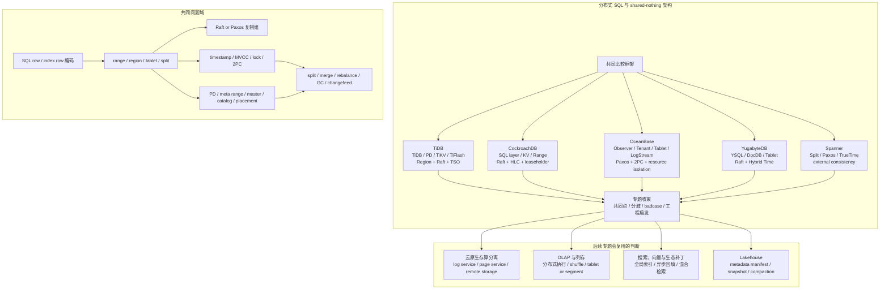

## 今日主题

主主题：`现代数据库行业全景之分布式 SQL 与 shared-nothing 架构预览`

这是 `Topic 1：现代数据库行业全景` 中的第三篇后续专题预览文。它不是 TiDB、CockroachDB、OceanBase、YugabyteDB、Spanner 的系统深挖，而是先回答：

1. 为什么单机 OLTP 和嵌入式 LSM 之后，需要单独看分布式 SQL。
2. 分布式 SQL 为什么不是“把 PostgreSQL/MySQL 加几个副本”。
3. TiDB、CockroachDB、OceanBase、YugabyteDB、Spanner 后续为什么各自值得成文或横向对照。
4. 进入系统文章时，应该围绕哪些 storage-first 问题比较。
5. 分布式 SQL 的 badcase 为什么集中在热点、跨分片事务、全局索引、GC safepoint、leader 调度、元数据服务和长事务上。

## 这个专题为什么独立存在

传统 OLTP 给了我们 page、WAL、MVCC、B+Tree、buffer pool、catalog、二级索引和事务的基线。LSM 与嵌入式存储引擎又提供了另一条路线：WAL、memtable、SST、manifest、compaction、snapshot 和底层 KV API。

但只靠这两类系统，仍然无法直接解决一组新的工程压力：

- 单机容量和吞吐上限：数据、索引、日志和缓存都被限制在单机边界内。
- 高可用和容灾：主从复制可以兜底读扩展和灾备，但 failover、写入一致性和跨地域延迟会暴露边界。
- SQL 透明扩展：业务希望继续使用 SQL、事务、索引和约束，而不是手工分库分表。
- 跨分片事务：一次事务可能同时修改多个 key range、region、tablet 或 partition。
- 全局二级索引：索引项和主数据可能不在同一个分片，唯一约束和回填会变成分布式问题。
- 元数据调度：region/tablet/range 的位置、leader、lease、split、merge、rebalance 需要一个持续运行的控制面。

分布式 SQL 的核心回答是：把传统关系数据库的逻辑模型保持给用户，同时把底层数据切成可复制、可迁移、可调度的小分片，再用 Raft/Paxos、timestamp/MVCC、2PC、metadata service 和分布式执行把它们重新组织成一个数据库。

这条路线的困难不在“多节点存储数据”，而在于：

- 每个分片都可能有自己的复制组和 leader。
- 事务、索引、元数据和 SQL 执行都可能跨分片。
- 一致性协议、时间戳服务、锁和 GC 必须一起工作。
- 后台调度一旦失衡，会直接影响前台事务延迟。

所以这个专题独立存在，是因为它把单机数据库的核心问题全部放大到分布式维度。

## 整体学习地图

下图是根据公开资料整理的学习地图，不对应单个系统的官方架构图。后续进入系统文章时，需要替换成 TiDB、CockroachDB、OceanBase、YugabyteDB、Spanner 的官方图、论文图或源码级图示。

这张图要表达一个判断：分布式 SQL 的关键状态不是只在 SQL 层，也不是只在底层 KV。它分布在 SQL row/index 编码、分片元数据、复制组日志、事务状态、时间戳、锁、GC safepoint、placement 和后台调度里。

## 代表系统与学习顺序

| 顺序 | 系统 | 为什么选它 | 后续文章重点 |
| --- | --- | --- | --- |
| 1 | TiDB | 组件边界清晰：TiDB server 无状态 SQL 层、PD 元数据/调度/TSO、TiKV 分布式事务 KV、TiFlash 列存副本；适合观察 SQL 到 KV、Region、Raft、Percolator-style 事务的拆分 | SQL row/index 编码、PD TSO、Region/Raft、TiKV MVCC、2PC、GC safepoint、changefeed、TiFlash learner/read path、热点和调度 |
| 2 | CockroachDB | 层次化文档和论文很完整：SQL -> transaction -> distribution -> replication -> storage；适合观察 Range、leaseholder、HLC、write intent、transaction record、meta range | Range descriptor、meta1/meta2、Raft group、leaseholder、serializable transaction、write intent、schema change、DistSQL、range split/merge |
| 3 | OceanBase | shared-nothing、多租户、MySQL/Oracle 兼容、Tablet/LogStream/Paxos/资源隔离很有代表性；适合观察企业级分布式 OLTP 如何把事务、租户和调度放在一起 | tenant/resource unit、tablet、log stream、Paxos 日志、跨 LS 2PC、MemTable/SSTable、均衡层、SQL 兼容和多租户隔离 |
| 4 | YugabyteDB | PostgreSQL 兼容 SQL API + DocDB/RocksDB/Tablet/Raft 的组合，适合和 CockroachDB、TiDB 对照 | YSQL 到 DocDB、tablet、RocksDB 定制、Hybrid Time、transaction status tablet、Raft replication、PostgreSQL 兼容边界 |
| 5 | Spanner | 闭源但论文和官方文档是分布式 SQL 的基准材料，TrueTime、Paxos、split、external consistency 影响了许多后续系统 | split/tablet、Paxos group、TrueTime、外部一致性、读写事务、锁和 2PC、schema/placement、托管服务边界 |

学习顺序先 TiDB，再 CockroachDB，然后 OceanBase、YugabyteDB，最后 Spanner。

原因是：

- TiDB 的组件拆分最直观，适合把 SQL 层、事务 KV、PD/TSO、Raft、Region 的词汇表建立起来。
- CockroachDB 适合验证另一条路线：每个节点对称，SQL 到 KV 再到 Range/Raft，事务靠 HLC、write intents 和 transaction records 组织。
- OceanBase 适合观察 shared-nothing 架构和多租户资源隔离如何成为系统核心，而不是外部部署问题。
- YugabyteDB 适合观察 PostgreSQL 兼容层和 DocDB/RocksDB/tablet/Raft 的组合方式。
- Spanner 是闭源系统，但它的 TrueTime、Paxos、external consistency 和 split 模型是后续很多系统绕不开的参照系。

## 核心问题域

### 1. SQL row、index row 与底层 key 编码

需要比较的问题：

- SQL 表行如何编码成 KV key/value？
- primary key、secondary index、unique index 是否对应不同 key space？
- 二级索引项和主数据是否可能落在不同分片？
- 索引回填和 schema change 如何保证新旧 schema 并存期间的一致性？
- tenant、database、table、index、partition、row id、timestamp 是否都进入 key 编码？

后续重点：

- TiDB：SQL execution plan 最终变成 TiKV API 调用，Region 是 KV key range 的切分单位。
- CockroachDB：SQL row/index 被编码成有序 KV；表和二级索引会映射到一个或多个 Range。
- YugabyteDB：YSQL/YCQL 通过 tablet 和 DocDB 管理底层 key/value。
- OceanBase：table/partition 对应 tablet，tablet 内部再用 MemTable/SSTable 管理。
- Spanner：表按 primary key range 切成 split，split 再复制到多个 Paxos replica。

### 2. 分片单位：Region、Range、Tablet、Split、LogStream

需要比较的问题：

- 分片单位是按 key range、hash，还是 table/partition 组织？
- 一个分片是否对应一个复制组？
- 分片大小阈值、split/merge 策略、leader 分布如何决定？
- 分片元数据存在独立服务里，还是也存在数据库自己的 key space 里？
- 数据迁移时，复制组、锁、事务、索引和 GC 如何保持一致？

后续重点：

- TiDB：Region 是连续 key range，也是 Raft replication 和调度的基本单位。
- CockroachDB：Range descriptor 记录 keyspace 与 replica 地址，并通过 meta range 查找。
- OceanBase：tablet 和 log stream 不是一一全局固定关系，多个 tablet 可以对应一个 log stream。
- YugabyteDB：table 被拆成 tablet，tablet 由 DocDB 管理并通过 Raft 复制。
- Spanner：split 是连续 primary key range，Paxos replica set 负责复制。

### 3. 日志与复制：Raft log、Paxos log、WAL、changefeed

需要比较的问题：

- 用户写入先进入事务日志、Raft/Paxos 日志，还是本地 WAL？
- 复制日志和存储引擎 WAL 是同一套，还是多套日志？
- committed 的判断是 majority/quorum 成功，还是还要等待 timestamp/commit-wait？
- follower/learner/read-only replica 如何追赶和服务读取？
- CDC/changefeed 读的是 raft log、MVCC version、额外 change log，还是上层事件流？

后续重点：

- TiDB/TiKV：写入通过 Raft 接口复制到 Region 的多个 replica，底层还要落 RocksDB。
- CockroachDB：Range 的 write 需要 Raft quorum；write intent 本身也被复制。
- OceanBase：log stream 持久化事务 redo log，副本之间通过 Paxos 保持一致。
- YugabyteDB：tablet 默认按复制因子同步复制，使用 Raft 保证一致性。
- Spanner：split 通过 Paxos-based replication 复制，leader replica 处理写。

### 4. 事务、timestamp、MVCC 与并发控制

需要比较的问题：

- 全局时间戳来自 TSO、HLC、Hybrid Time、TrueTime，还是每个事务状态独立协调？
- MVCC version 如何编码，旧版本如何回收？
- 分布式事务的 coordinator 在哪里？
- 单分片事务和跨分片事务是否走不同快路径？
- 锁是本地内存锁、replicated write intent、key lock、transaction record，还是日志状态？
- 事务失败后，谁负责清理锁、临时记录、write intent 和未完成 commit？

后续重点：

- TiDB：SQL engine 协调事务，PD 提供时间戳，TiKV 实现 MVCC 和分布式事务接口。
- CockroachDB：write intent 同时像临时 MVCC value 和 replicated lock，transaction record 记录事务状态。
- YugabyteDB：Hybrid Time 支撑 MVCC；transaction status tablet、transaction manager 和 provisional records 共同完成事务。
- OceanBase：跨 log stream 事务通过优化 2PC 保证原子性，重启恢复要从 WAL/commit log 找回状态。
- Spanner：TrueTime 给事务时间戳，Paxos leader 和 2PC 组织跨 split 事务。

### 5. 元数据服务与调度

需要比较的问题：

- 谁记录分片在哪里、leader 在哪里、replica 怎么分布？
- 元数据自身如何高可用？
- 元数据变更是否走和普通数据同样的复制/事务协议？
- split、merge、rebalance、leader transfer、placement rule 如何触发？
- 元数据缓存失效后，读写请求的退化路径是什么？

后续重点：

- TiDB：PD 是 cluster brain，负责 region metadata、调度和 timestamp。
- CockroachDB：meta range 和 range descriptor 组织 range location，节点本地有 meta cache。
- OceanBase：均衡层负责 log stream split/merge、tablet 搬迁和 tenant 资源均衡。
- YugabyteDB：YB-Master 管 catalog 与 cluster orchestration，YB-TServer 管每个节点上的 tablet。
- Spanner：公开资料中 split lookup 与 placement 由服务内部管理，闭源细节要标注为公开资料推断。

### 6. 缓存、后台任务与资源隔离

需要比较的问题：

- cache 是每节点本地缓存、block cache、metadata cache，还是远端 page/cache 服务？
- 后台 split、merge、raft snapshot、compaction、GC、schema change、index backfill 如何限速？
- 多租户系统如何隔离 CPU、内存、I/O、日志和 compaction？
- 热点 key/range/tablet 如何发现和缓解？
- follower read、learner、read replica 能降低读压力，还是会引入新鲜度和一致性边界？

后续重点：

- TiDB：PD 调度、Region split/merge、leader balance、TiKV compaction 和 GC safepoint。
- CockroachDB：range split/merge、replica rebalance、leaseholder、MVCC GC、schema change。
- OceanBase：tenant resource unit、log stream 均衡、MemTable flush/SSTable 合并。
- YugabyteDB：tablet splitting、cluster balancing、DocDB compaction、read replicas/xCluster。
- Spanner：split 调度、leader placement、TrueTime-based strong read、托管服务内部资源隔离。

## 典型技术路线

| 路线 | 代表系统 | 核心选择 | 后续要验证的问题 |
| --- | --- | --- | --- |
| SQL 层 + 分布式 KV + 独立调度面 | TiDB | TiDB server 无状态，TiKV 负责事务 KV，PD 管 metadata/TSO/scheduling，TiFlash 提供列存副本 | PD 是否成为关键控制面；Region/Raft/GC safepoint/changefeed 如何影响 SQL 事务 |
| 对称节点 + 层次化 KV range | CockroachDB | SQL 到 KV，Range 复制成 Raft group，leaseholder 协调读写，HLC/MVCC/write intent 做事务 | Range metadata、lease transfer、write intent cleanup、serializable retry 的成本在哪里 |
| shared-nothing + 多租户 + LogStream | OceanBase | 每个节点有 SQL/storage/transaction engine，tenant 隔离资源，tablet/log stream/Paxos 组织数据和日志 | tablet 与 log stream 的关系如何影响调度、跨 LS 事务和资源隔离 |
| PostgreSQL 兼容查询层 + DocDB tablet | YugabyteDB | YSQL/YCQL 上层，DocDB 基于 RocksDB 管 tablet，Raft 复制，Hybrid Time 管 MVCC | PostgreSQL 兼容层和底层 tablet/DocDB 的语义缝隙在哪里 |
| TrueTime + Paxos + 全球强一致 | Spanner | split/Paxos/TrueTime/external consistency，闭源托管服务把时钟、复制、事务深度绑定 | TrueTime 能解决哪些 timestamp 问题，又把硬件和平台前提带到哪里 |

预览阶段只记住路线，不提前下源码结论。系统文章阶段再回到本地源码、官方论文和官方文档验证。

## 插件、生态补丁与变相方案

分布式 SQL 的“生态能力”比单机数据库更容易误判。它们通常兼容 MySQL 或 PostgreSQL 协议/语法，但这不等于完整继承原系统的插件、执行语义、存储引擎接口和运维生态。

| 层次 | 在分布式 SQL 专题中的含义 | 例子 | 需要警惕的边界 |
| --- | --- | --- | --- |
| 原生能力 | 系统内核直接支持分布式事务、复制、自动分片、强一致读写 | TiDB Region/Raft/TSO，CockroachDB Range/Raft/HLC，Spanner TrueTime/Paxos | 原生分布式能力通常牺牲了部分单机数据库插件和底层存储可控性 |
| 官方或主流扩展 | 官方生态补迁移、CDC、备份、列存副本、地理分布 | TiDB TiFlash/CDC，CockroachDB changefeed，YugabyteDB xCluster，OceanBase ODP/OCP | 扩展是否进入事务一致性、调度、限流和恢复体系，需要逐项验证 |
| 外围系统组合 | 用中间件或外部系统拼水平扩展 | MySQL sharding middleware，PostgreSQL + Citus，MySQL + Canal + OLAP | 应用透明性、跨分片事务、全局索引和 schema change 往往不完整 |
| 变通方案 | 用单机数据库或 KV 手工模拟分布式 SQL 能力 | 应用层分库分表，按用户 hash 手写路由，用异步任务维护全局索引 | 短期能做，长期会在事务、回填、容灾、扩容和热点治理上付出成本 |

结论不能停在“兼容 PostgreSQL/MySQL”。更准确的说法是：分布式 SQL 试图保留 SQL 和事务体验，但实现路径已经和单机 PostgreSQL/MySQL 分离。兼容性越往插件、锁语义、DDL、系统表、备份、CDC、性能诊断深入，越需要单独验证。

## badcase 与架构边界

| 模块 | 典型 badcase | 为什么后续专题会复用 |
| --- | --- | --- |
| 热点分片 | 单调递增主键、热点账户、热点索引前缀让单个 range/region/tablet leader 承压 | 云原生、多租户和 OLAP 写入也会遇到局部热点和调度不均 |
| 跨分片事务 | 一次事务修改多个分片，2PC、锁、timestamp、retry 和 participant 状态变复杂 | 存算分离、Lakehouse manifest commit、跨分区索引都会复用类似提交协议问题 |
| 全局二级索引 | 索引项和主数据分布在不同分片，唯一约束、回填、删除 GC 都会放大 | 搜索、向量、物化视图和实时分析里的二级结构也要维护一致性 |
| GC safepoint | 长事务、stale read、CDC、备份或 follower lag 拖住旧版本回收 | Lakehouse snapshot retention、LSM tombstone、OLAP part cleanup 都有类似保留点 |
| leader/lease 调度 | leader 迁移、leaseholder 变化、Paxos/Raft election 影响延迟和可用性 | 多地域系统都需要在读延迟、写 quorum 和故障恢复之间权衡 |
| 元数据服务 | PD/master/meta range/catalog cache 出问题时，普通读写可能无法定位分片或提交 schema change | 云原生 page server、catalog service、Lakehouse catalog 都会成为控制面风险 |
| 后台任务 | split、merge、rebalance、snapshot、compaction、index backfill 抢占前台资源 | 所有现代数据库最终都要处理后台任务的资源隔离和优先级 |
| SQL 兼容 | 语法兼容不等于执行计划、锁语义、插件、系统表和运维工具兼容 | 迁移数据库时，兼容性边界通常比宣传页复杂 |
| 多租户成本 | 一个租户的热点、长事务、GC 或大查询可能影响共享节点资源 | 云数据库和 serverless 数据库会把这个问题进一步放大到计费和限流 |

## 对后续专题的影响

### 对云原生存算分离数据库

分布式 SQL 先把数据拆成 region/range/tablet/split。云原生存算分离会进一步追问：如果计算节点无状态，日志、page、segment、cache、metadata 又由谁承担？

- Raft/Paxos log 是否被独立 log service 替代？
- local storage 是否被 page server、remote object storage 或 shared storage 替代？
- leader 和 placement 的语义是否还存在，还是变成租户级计算资源调度？
- metadata service 是否从调度面变成提交协议和恢复路径的核心？

### 对 OLAP、列存与实时分析

分布式 SQL 强调事务和一致性；OLAP 更强调扫描、列存、shuffle、聚合和高吞吐导入。后续看 ClickHouse、Doris、StarRocks 时，可以复用这些问题：

- 分片元数据和副本调度由谁管理？
- 分布式执行是靠 SQL planner 贴近数据，还是靠独立 MPP coordinator？
- 写入是事务提交，还是先进入 immutable part/rowset 再后台合并？
- primary key/unique key 在分布式列存里是否仍然有 OLTP 语义？

### 对搜索、向量与生态补丁

分布式 SQL 的二级索引问题会帮助我们判断搜索/向量索引：

- 全文索引和向量索引是事务性维护，还是异步补齐？
- 索引分片和主数据分片是否同构？
- 回填、重建、删除和 GC 的成本由谁承担？
- 插件能力是否进入分布式执行、调度和资源隔离体系？

### 对 Lakehouse 与对象存储表格式

Lakehouse 看似远离 OLTP，但 metadata/snapshot/manifest/commit 协议和分布式 SQL 有共同问题：

- 一次 commit 如何原子发布多个文件或分区变化？
- metadata catalog 如何成为一致性边界？
- snapshot retention 如何拖住旧文件回收？
- compaction 和 rewrite 如何避免影响前台查询？

## 本地源码锚点

Day 004 是专题预览，不写源码级结论；这里只记录后续系统文章的源码入口和待补状态。

| 系统 | 本地源码 | 当前状态 | 后续优先入口 |
| --- | --- | --- | --- |
| TiDB | `D:\program\tidb` | `master f1901d8 clean` | `pkg/session`、`pkg/planner`、`pkg/executor`、`pkg/ddl`、`pkg/meta`、`pkg/kv`；后续还需要配合 `tikv`、`pd` 源码验证 Region/Raft/TSO |
| CockroachDB | 暂未发现本地仓库 | 本篇不写源码级结论；后续系统文章前需要 clone 到 `D:\program\cockroach` | `pkg/sql`、`pkg/kv`、`pkg/kv/kvserver`、`pkg/roachpb`、`pkg/storage`、`pkg/sql/schemachanger` |
| OceanBase | 暂未发现本地仓库 | 本篇不写源码级结论；后续系统文章前需要 clone 到 `D:\program\oceanbase` | `src/sql`、`src/storage`、`src/storage/tx`、`src/storage/ls`、`src/share`、`src/rootserver` |
| YugabyteDB | 暂未发现本地仓库 | 本篇不写源码级结论；后续系统文章前需要 clone 到 `D:\program\yugabyte-db` | `src/yb/yql`、`src/yb/tablet`、`src/yb/docdb`、`src/yb/consensus`、`src/yb/master`、`src/yb/tserver` |
| Spanner | 闭源系统 | 不强行源码验证；只能基于官方文档、论文和演讲，无法验证的实现判断必须标注为“基于公开资料推断” | Google Cloud Spanner 官方文档、Spanner OSDI 2012 论文、Life of Spanner Reads & Writes 白皮书 |

## 我的问题

1. TiDB 的 Region split、leader transfer、GC safepoint 和 changefeed 之间有哪些隐含耦合？长事务或下游 CDC lag 会拖住哪些资源？
2. TiDB 的二级索引写入在 TiKV 里具体编码成哪些 key mutation？唯一索引和普通索引在锁、回滚、GC 上有什么差别？
3. CockroachDB 的 write intent 既是临时值又是 replicated lock，这种设计如何影响读路径、事务重试和 intent cleanup？
4. CockroachDB 的 range descriptor/meta cache 失效时，SQL 请求如何重新定位 range？meta range 自身如何避免成为瓶颈？
5. OceanBase 的 tablet 和 log stream 关系如何影响跨分区事务、Paxos 日志、均衡迁移和多租户资源隔离？
6. YugabyteDB 的 transaction status tablet 和 DocDB provisional records 如何配合？单行快路径和跨 tablet 事务的边界在哪里？
7. Spanner 的 TrueTime 把时间同步变成事务协议的一部分，这种能力在普通开源系统里能否用 HLC/TSO 近似？不能近似的部分是什么？
8. 全局二级索引到底更像传统 OLTP 的索引，还是更像跨分片物化视图？不同系统的答案是否不同？
9. 分布式 SQL 的“兼容 PostgreSQL/MySQL”应该如何分层评估：协议、语法、类型、优化器、锁语义、扩展、系统表、备份、CDC、运维工具分别怎么看？

## 工程启发

第一，分布式 SQL 的本质是把单机数据库的隐含状态显式拆开。

单机里 page、WAL、锁、buffer、catalog、索引和事务通常在一个进程内协作。分布式 SQL 把它们拆成 region/range/tablet、复制组、时间戳、事务记录、元数据服务和后台调度。学习时不能只看 SQL 兼容层，必须追到这些状态如何组合。

第二，复制组是新的“局部单机”。

每个 range/region/tablet/split 的 Raft/Paxos group 都像一个小数据库：有 leader、log、replica、lease、local storage 和 recovery。跨分片事务就是多个小数据库之间的协议组合。理解这个局部边界，比背系统名字更重要。

第三，元数据服务不是旁路控制台，而是数据路径的一部分。

PD、meta range、YB-Master、OceanBase rootserver/均衡层、Spanner split lookup 都会影响请求路由、调度、扩容、leader 位置和 schema change。metadata 一旦退化，系统不是“慢一点”，而是可能无法正确定位和推进状态变化。

第四，分布式 SQL 的 badcase 通常不是某个模块单独失败，而是多个保留点互相拖住。

长事务拖住 MVCC GC，CDC 拖住版本保留，热点拖住 leader，index backfill 拖住写入，rebalance 又抢占后台资源。这些问题在单机里已经存在，到了分布式系统里会和复制、网络、调度、多租户一起放大。

第五，兼容性必须拆层判断。

兼容 MySQL 或 PostgreSQL 协议能降低迁移入口成本，但不能自动继承单机数据库的插件生态、存储引擎接口、锁行为、系统表语义和运维工具。后续每个系统文章都要单独写“原生能力、官方扩展、外围组合、变通方案”的边界。

## 下一步

Day 005 建议进入：`云原生存算分离数据库预览`

预览重点：

- 为什么 shared-nothing 分布式 SQL 之后，还会出现存算分离、serverless、remote storage、log service、page server。
- Aurora、Neon、PolarDB、Azure SQL Hyperscale、Snowflake、BigQuery 分别代表什么路线。
- WAL/log、page、object file、metadata、cache、checkpoint 和 recovery 如何被重新拆分。
- 云原生数据库的 badcase 为什么集中在 remote read tail latency、cache warmup、log replay、metadata bottleneck、tenant isolation 和成本不可预测上。

## 参考来源与引用

### 官方文档、论文与设计文档

- [TiDB Docs: TiDB Architecture](https://docs.pingcap.com/tidb/stable/tidb-architecture/)
- [TiDB Docs: TiDB Storage](https://docs.pingcap.com/tidb/stable/tidb-storage/)
- [TiDB Development Guide: Introduction of TiDB Architecture](https://pingcap.github.io/tidb-dev-guide/understand-tidb/introduction.html)
- [TiDB: A Raft-based HTAP Database](https://www.vldb.org/pvldb/vol13/p3072-huang.pdf)
- [CockroachDB Docs: Architecture Overview](https://www.cockroachlabs.com/docs/stable/architecture/overview)
- [CockroachDB Docs: SQL Layer](https://www.cockroachlabs.com/docs/stable/architecture/sql-layer)
- [CockroachDB Docs: Transaction Layer](https://www.cockroachlabs.com/docs/stable/architecture/transaction-layer)
- [CockroachDB Docs: Distribution Layer](https://www.cockroachlabs.com/docs/stable/architecture/distribution-layer)
- [CockroachDB Docs: Replication Layer](https://www.cockroachlabs.com/docs/stable/architecture/replication-layer)
- [CockroachDB: The Resilient Geo-Distributed SQL Database](https://www.cockroachlabs.com/pdf/cockroachdb-the-resilient-geo-distributed-sql-database-sigmod-2020.pdf)
- [YugabyteDB Docs: Architecture](https://docs.yugabyte.com/stable/architecture/)
- [YugabyteDB Docs: DocDB storage layer](https://docs.yugabyte.com/stable/architecture/docdb/)
- [YugabyteDB Docs: DocDB transactions layer](https://docs.yugabyte.com/stable/architecture/transactions/)
- [YugabyteDB Docs: DocDB replication layer](https://docs.yugabyte.com/stable/architecture/docdb-replication/)
- [OceanBase Docs: Overall architecture of OceanBase Database](https://en.oceanbase.com/docs/common-oceanbase-database-10000000003217949)
- [Google Cloud Spanner: TrueTime and external consistency](https://cloud.google.com/spanner/docs/true-time-external-consistency)
- [Google Cloud Spanner: Replication](https://cloud.google.com/spanner/docs/replication)
- [Google Cloud Spanner: Life of Spanner Reads & Writes](https://cloud.google.com/spanner/docs/whitepapers/life-of-reads-and-writes)
- [Spanner: Google's Globally-Distributed Database](https://research.google.com/archive/spanner-osdi2012.pdf)

### 本地源码

- `D:\program\tidb`

### 待补源码

- `D:\program\cockroach`
- `D:\program\oceanbase`
- `D:\program\yugabyte-db`
