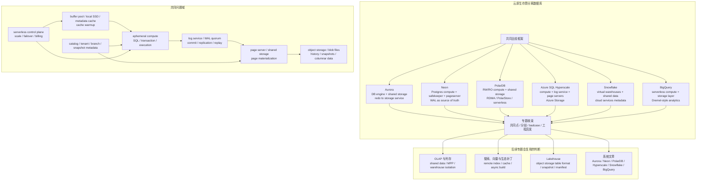

## 今日主题

主主题：`现代数据库行业全景之云原生存算分离数据库预览`

这是 `Topic 1：现代数据库行业全景` 中的第四篇后续专题预览文。它不是 Aurora、Neon、PolarDB、Azure SQL Hyperscale、Snowflake、BigQuery 的系统深挖，而是先回答：

1. 为什么 shared-nothing 分布式 SQL 之后，还需要单独看云原生存算分离数据库。
2. 存算分离为什么不只是“把磁盘换成云盘”。
3. Aurora、Neon、PolarDB、Azure SQL Hyperscale、Snowflake、BigQuery 分别代表什么路线。
4. 进入系统文章时，应该围绕哪些 storage-first 问题比较。
5. 云原生数据库的 badcase 为什么集中在 remote read tail latency、cache warmup、log replay、metadata bottleneck、tenant isolation 和成本不可预测上。

本文的 Aurora 指传统 Aurora MySQL/PostgreSQL 的共享存储路线，不展开 Aurora DSQL。Snowflake 和 BigQuery 更偏 OLAP/数据仓库，但它们的 shared-data、serverless、metadata 和 compute isolation 经验，对理解云原生数据库同样关键。

## 这个专题为什么独立存在

分布式 SQL 把数据拆成 region、range、tablet 或 split，再通过 Raft/Paxos、timestamp、2PC、metadata service 和调度面把 SQL 语义拼回来。它解决的是单机容量、强一致复制、跨分片事务和 SQL 透明扩展问题。

但云上数据库又遇到另一组压力：

- 计算资源需要快速扩缩容，甚至按请求、按租户、按 warehouse 或 endpoint 启停。
- 存储容量需要独立增长，不能因为加读节点就复制整份数据。
- failover、clone、branch、restore 希望变成元数据操作，而不是搬运 TB 级文件。
- 读写节点可能是临时的， durable state 不能绑在某台机器的本地盘上。
- 云服务需要多租户隔离、跨 AZ/region 容灾、统一计费和托管运维。
- OLAP/AI 场景希望很多计算集群共享一份数据，而不是每个集群各自持有副本。

云原生存算分离的核心回答是：把 durable state 从 database process 里拆出去，交给共享存储、log service、page server、object storage、catalog/metadata service 或云厂商基础设施；计算节点尽量变成可替换、可横向扩缩、可按需启动的执行层。

这条路线不是免费午餐。它只是把单机或 shared-nothing 里的复杂性重新分配：

- 本地 WAL fsync 变成跨网络 log quorum 或 log service。
- 本地 page read 变成 buffer pool、local SSD cache、page server、object storage 多级路径。
- 本地 checkpoint/recovery 变成 log replay、page materialization、remote snapshot 和 metadata restore。
- 本地后台任务变成 shared storage GC、object file compaction、cache warming 和 tenant-level throttling。
- 本地调优变成云服务的资源隔离、计费模型和控制面稳定性。

所以这个专题独立存在，是因为它把数据库的“状态在哪里”从进程内、单机内、复制组内，进一步拆到云基础设施和托管服务边界里。

## 整体学习地图

下图是根据公开资料整理的学习地图，不对应单个系统的官方架构图。后续进入系统文章时，需要替换成 Aurora、Neon、PolarDB、Azure SQL Hyperscale、Snowflake、BigQuery 的官方图、论文图或源码级图示。

这张图要表达一个判断：云原生数据库的关键状态不再只属于数据库进程。日志、page、object file、metadata、cache 和 tenant control plane 都可能被拆成独立服务，任何一个服务的延迟、恢复或限流都会进入数据库语义和用户体验。

## 代表系统与学习顺序

| 顺序 | 系统 | 为什么选它 | 后续文章重点 |
| --- | --- | --- | --- |
| 1 | Amazon Aurora | 云原生 OLTP 共享存储路线的经典代表，把 redo processing 推给多租户 scale-out storage service，DB instance 连接共享 cluster volume | redo log、storage node quorum、page materialization、fast crash recovery、reader failover、cluster volume、I/O 计费和存储回收 |
| 2 | Neon | 开源 Serverless Postgres 路线，compute 无 durable state，WAL 进入 safekeeper quorum，pageserver 负责按 LSN 生成 page，object storage 保存历史 | safekeeper、pageserver、WAL-to-page、branch/copy-on-write、cache miss、scale-to-zero、restore 和 long history GC |
| 3 | PolarDB | 阿里云 shared-storage / disaggregated data center 路线，适合观察 RW/RO 节点、共享存储、RDMA、serverless 和强一致读优化 | compute-storage decoupling、RW/RO log shipment、read-after-write consistency、PolarStore/PolarFS、serverless resource pool 和云上硬件协同 |
| 4 | Azure SQL Hyperscale | SQL Server 语义下的 page server + log service 路线，官方文档清楚拆出 compute、page servers、log service、Azure Storage | primary/secondary compute、RBPEX cache、page server 分片、log service fanout、backup snapshot、named replicas 和 cache priming |
| 5 | Snowflake | 云数据仓库的 multi-cluster shared-data 代表，把 storage、virtual warehouse compute、cloud services metadata 拆成三层 | micro-partition、metadata pruning、virtual warehouse isolation、cloud services、time travel、clone、data sharing、OLAP 成本和并发隔离 |
| 6 | BigQuery | serverless 数据仓库代表，计算与存储分层，Dremel-style execution 和 columnar storage 形成全托管分析体验 | storage/compute separation、slot/reservation、columnar storage、query planner、external tables、metadata indexing、serverless 运维边界 |

学习顺序先 Aurora，再 Neon、PolarDB、Azure SQL Hyperscale，最后 Snowflake 和 BigQuery。

原因是：

- Aurora 最适合建立“数据库 engine + 共享存储服务”的基本词汇表。
- Neon 把 Postgres compute、WAL quorum、page server、object storage 的职责拆得很清楚，适合观察 serverless database 的可恢复状态。
- PolarDB 适合观察云厂商如何把共享存储、RDMA、RO 强一致读和 serverless 资源池结合起来。
- Azure SQL Hyperscale 适合把 page server/log service/RBPEX/cache priming 这组概念和 SQL Server 语义联系起来。
- Snowflake 和 BigQuery 把存算分离推进到 OLAP 和全托管 serverless，能帮助区分 OLTP page/log disaggregation 与 OLAP shared-data 架构的不同目标。

## 核心问题域

### 1. 状态归属：compute 到底还拥有什么

需要比较的问题：

- compute 是否拥有 durable data，还是只拥有 buffer、local SSD cache、session 和临时文件？
- 事务 commit 的 durable point 在本地 WAL、remote WAL quorum、log service，还是 object storage metadata commit？
- 计算节点宕机后，重启需要回放多少日志、预热多少缓存、恢复哪些 metadata lease？
- reader/replica/warehouse 是否共享同一份 durable state，还是有自己的数据副本？

后续重点：

- Aurora：DB instance 连接共享 cluster volume，持久数据独立于 DB instance。
- Neon：compute 可替换，durable state 由 safekeeper、pageserver、object storage 共同承担。
- Hyperscale：compute 运行关系引擎，page server/log service/Azure Storage 承担长期存储和日志传播。
- Snowflake/BigQuery：compute 集群面向分析执行，持久表数据和 metadata 在托管存储与服务层。

### 2. 写入路径：WAL、redo、log service 与 quorum

需要比较的问题：

- 前台 commit 等待的是本地 fsync、storage node acknowledgement、safekeeper quorum，还是 metadata commit？
- log 记录的是物理 page redo、logical WAL、columnar ingest event，还是 file/manifest 变化？
- log service 是否成为所有写入的 fanout 和恢复中心？
- 日志何时可以截断，是否被 page materialization、备份、branch、time travel、CDC 或 replica lag 拖住？

后续重点：

- Aurora：论文强调把 redo processing 推给 scale-out storage service，降低网络流量并支持快速恢复。
- Neon：WAL 是 source of truth；commit 由 safekeeper quorum 确认，page materialization 不在 commit 关键路径。
- Hyperscale：log service 接收 primary compute 的 transaction log records，并传播给 page servers 和 secondary compute。
- PolarDB：RW 到 RO 的 log shipment 与强一致读是后续重点。

### 3. 读取路径：remote page、cache miss 与尾延迟

需要比较的问题：

- 读路径优先访问 buffer pool、本地 SSD cache、page server，还是直接读对象存储？
- cache miss 后是否需要远端 page reconstruction 或 log replay？
- failover、新建 reader、新启 compute 后如何避免冷缓存拖慢前台请求？
- OLAP 查询是扫描共享对象文件，还是先把数据拉到 warehouse/slot 本地执行？

后续重点：

- Neon：compute 优先 RAM/local NVMe，cache miss 才请求 pageserver；object storage 不在 hot query path。
- Hyperscale：compute 有 RBPEX cache，page server 也有 local SSD cache，continuous priming 用于减少 failover 后冷缓存。
- Aurora：reader 不需要复制整份数据，但 page cache 与 storage read latency 的边界要单独验证。
- Snowflake/BigQuery：shared data 降低数据复制，但 scan、metadata pruning、remote read 和 cache 仍决定查询尾延迟。

### 4. checkpoint、恢复、backup、clone 与 branch

需要比较的问题：

- checkpoint 是本地脏页刷盘，还是 page server/object storage 的历史整理？
- crash recovery 从 log service、storage node、pageserver，还是 metadata snapshot 开始？
- backup/restore 是复制数据文件，还是存储快照或历史版本引用？
- clone/branch/time travel 是真实复制，还是 copy-on-write metadata 操作？

后续重点：

- Aurora：共享存储和 redo processing 让 crash recovery 和 replica failover 成为核心优势之一。
- Neon：branch、restore 和 compute attach 依赖 immutable history 与 metadata reference。
- Hyperscale：backup/restore 基于 storage snapshot，降低 compute 侧处理负担。
- Snowflake：time travel、clone、micro-partition metadata 是后续理解 data warehouse elasticity 的入口。

### 5. 元数据与控制面

需要比较的问题：

- catalog、tenant、branch、snapshot、warehouse、page range、file manifest 由谁管理？
- metadata service 是否在请求路径中，还是只在规划、调度、恢复、DDL 时参与？
- 元数据缓存失效后，读写请求如何退化？
- serverless autoscaling 的决策如何和事务、cache、tenant quota、billing 绑定？

后续重点：

- Neon：branch/history 是 metadata-heavy 操作，catalog/control plane 与 storage history 的边界要看清。
- Hyperscale：page server 管理 page subset，compute 与 page server/log service 的 topology 是核心 metadata。
- Snowflake：cloud services layer 管 query optimization、metadata management、access control 等协调职责。
- BigQuery：数据集、表、分区、slot/reservation、external table 和 metadata indexing 都会进入成本与性能判断。

### 6. 多租户、资源隔离与成本模型

需要比较的问题：

- 多租户隔离在 compute、storage、log、cache、metadata、background GC 中分别如何实现？
- serverless 的 scale-to-zero 或 autoscaling 是否引入启动延迟和 cache warmup？
- I/O、storage、compute、warehouse、slot、backup、time travel、egress 分别如何计费？
- 一个租户的长事务、大查询、冷数据扫描、branch 历史或 replay 是否会影响其他租户？

后续重点：

- Aurora：需要区分 compute instance、storage volume、I/O 与 backup 成本。
- Neon：scale-to-zero 和 branch 很适合开发者体验，但要追问冷启动、缓存和历史保留成本。
- Snowflake/BigQuery：资源隔离更偏 warehouse/slot/reservation 和元数据调度，成本边界不同于 OLTP。

## 典型技术路线

| 路线 | 代表系统 | 核心选择 | 后续要验证的问题 |
| --- | --- | --- | --- |
| OLTP engine + distributed shared storage | Aurora、PolarDB | 保留 MySQL/PostgreSQL 兼容 engine，把 durable storage 下沉到共享存储层 | redo/WAL 与 page 的职责边界；RO 节点强一致读；shared storage 是否成为新瓶颈 |
| WAL service + page server + object storage | Neon、Azure SQL Hyperscale | commit 进入 log quorum/log service，page server 负责 materialization，object storage 负责长期持久化 | cache miss 尾延迟；log replay 和 page server 恢复；branch/restore/GC 如何影响前台 |
| Multi-cluster shared-data OLAP | Snowflake | central data repository + independent virtual warehouses + cloud services metadata | micro-partition metadata、warehouse isolation、clone/time travel、concurrency 和成本治理 |
| Fully managed serverless analytics | BigQuery | storage layer 与 compute layer 独立扩缩，用户不管理集群 | slot/reservation、storage/compute 调度、external data、metadata indexing 和 serverless 成本边界 |

预览阶段只记住路线，不提前下源码结论。系统文章阶段再回到官方论文、官方文档、公开演讲和可用源码验证。

## 插件、生态补丁与变相方案

云原生数据库的生态能力更容易被“兼容 SQL”或“兼容 PostgreSQL/MySQL”掩盖。存储、日志和计算已经被拆开后，插件、扩展、外部工具是否还能进入同一套一致性、恢复和调度体系，需要逐项判断。

| 层次 | 在云原生存算分离专题中的含义 | 例子 | 需要警惕的边界 |
| --- | --- | --- | --- |
| 原生能力 | 内核或托管服务直接支持存算分离、共享存储、serverless、clone、time travel、read scale-out | Aurora cluster volume，Neon branch，Hyperscale page server，Snowflake virtual warehouse，BigQuery serverless query | 原生能力通常依赖托管控制面，迁移到自建或跨云环境不一定成立 |
| 官方或主流扩展 | 官方 CDC、replica、data sharing、external table、ML/AI、lake integration | Aurora global database，Neon logical replication，Snowflake external/Iceberg tables，BigQuery external tables | 扩展是否参与事务、快照、权限、元数据和成本控制，要单独验证 |
| 外围系统组合 | 用普通数据库加云盘、对象存储、缓存或 ETL 拼出类似体验 | PostgreSQL + S3 backup，MySQL + binlog + object storage，OLTP + warehouse sync | 能备份不等于能快速恢复；能同步不等于能共享一致快照 |
| 变通方案 | 用 shared disk、NFS、手写冷热分层或应用层多租户模拟云原生能力 | 多个读实例共享文件系统，应用层 clone schema，手动归档冷数据 | 一致性、cache coherence、failover、GC、权限和计费通常会变成长期成本 |

结论不能停在“支持存算分离”。更准确的说法是：云原生数据库把基础设施能力纳入数据库语义，只有当日志、page、metadata、cache、recovery、tenant isolation 和 billing 一起工作时，存算分离才是系统能力，而不是部署技巧。

## badcase 与架构边界

| 模块 | 典型 badcase | 为什么后续专题会复用 |
| --- | --- | --- |
| remote read tail latency | cache miss 后走 page server、shared storage 或 object storage，网络抖动直接进入查询延迟 | OLAP、搜索、Lakehouse 都要面对远端对象存储和多级缓存 |
| cache warmup | failover、新建 reader、新启 compute 后，buffer pool/local SSD/metadata cache 都是冷的 | serverless、warehouse auto-suspend、read replica 扩容都会遇到 |
| log service bottleneck | 所有写入、replica、page server、CDC 都依赖 log fanout 或 WAL quorum | 分布式 SQL changefeed、Lakehouse commit log、搜索索引更新也有类似中心化日志风险 |
| page materialization lag | page server 从 WAL 重建 page 或追赶历史版本，前台读可能被 replay 拖慢 | Neon/Hyperscale/Aurora 后续都要验证 replay 与 read path 的交互 |
| metadata bottleneck | branch、clone、snapshot、catalog、warehouse、page range metadata 变成控制面热点 | Snowflake、BigQuery、Lakehouse table format 都高度依赖 metadata |
| long history retention | time travel、branch、backup、CDC、长事务拖住旧版本和对象文件回收 | MVCC GC、Lakehouse snapshot retention、LSM tombstone 都是同类问题 |
| tenant isolation | 一个租户的大查询、冷扫描、日志堆积或后台 GC 影响共享服务 | 云数据库、serverless、OLAP warehouse 和向量检索都会复用 |
| cost surprise | remote I/O、warehouse idle、serverless cold start、backup、egress、time travel 存储共同放大账单 | 云原生系统的架构判断必须包含成本路径，而不是只看性能 |
| 兼容性边界 | MySQL/PostgreSQL/SQL 兼容不等于插件、文件系统、superuser、extension、锁语义全部兼容 | 后续迁移评估和插件生态专题会继续用这套分层判断 |

## 对后续专题的影响

### 对 OLAP、列存与实时分析

Snowflake 和 BigQuery 已经提前进入 OLAP 世界。后续看 ClickHouse、Doris、StarRocks、DuckDB、Druid、Pinot 时，可以复用这些问题：

- 共享数据和本地计算如何平衡 scan throughput 与缓存。
- immutable part/segment/micro-partition 是否通过 metadata pruning 降低读放大。
- 多个查询集群是否共享对象存储文件，还是各自维护副本。
- 后台 compaction、clustering、materialized view refresh 如何与前台查询隔离。

### 对搜索、向量与生态补丁

搜索和向量系统也会遇到“远端持久化 + 本地热索引/cache”的问题：

- 索引文件是否在对象存储，查询节点如何拉取和缓存。
- 向量索引 build、merge、delete GC 是否是后台任务。
- PostgreSQL extension 或外部搜索系统能否共享主库快照和权限语义。
- 冷索引、冷 segment、远端 blob 会如何影响尾延迟。

### 对 Lakehouse 与对象存储表格式

云原生存算分离和 Lakehouse 的共同点更直接：对象存储负责数据文件，metadata/manifest/catalog 决定可见性。

- 一次 commit 是否只是 metadata pointer 切换。
- snapshot retention 如何拖住旧文件回收。
- compaction/rewrite 是否会制造读写冲突。
- catalog outage 是否会让数据文件存在但不可查询。

## 本地源码锚点

Day 005 是专题预览，不写源码级结论；这里只记录后续系统文章的源码入口和待补状态。

| 系统 | 本地源码 | 当前状态 | 后续优先入口 |
| --- | --- | --- | --- |
| Aurora | 闭源系统 | 不强行源码验证；只能基于 AWS 官方文档、Aurora SIGMOD 论文和公开演讲，无法验证的实现判断必须标注为“基于公开资料推断” | Amazon Aurora storage 文档、Aurora SIGMOD 2017 论文、AWS re:Invent 技术演讲 |
| Neon | 暂未发现本地仓库 | 本篇不写源码级结论；后续系统文章前需要 clone 到 `D:\program\neon` | `pageserver`、`safekeeper`、`compute_tools`、`storage_broker`、`libs`、官方 architecture docs |
| PolarDB | 服务主体闭源；本地未发现 PolarDB 相关源码 | 本篇不写源码级结论；后续如果研究开源分支，需要先确认具体 repo 是否等价于云服务实现 | Alibaba Cloud PolarDB 文档、PolarDB Serverless SIGMOD 2021、PolarDB-SCC PVLDB 2023、PolarDB shared-storage 论文 |
| Azure SQL Hyperscale | 闭源系统 | 不强行源码验证；只能基于 Microsoft Learn、Socrates/Hyperscale 论文和公开资料 | Hyperscale architecture、page server、log service、RBPEX、backup snapshot |
| Snowflake | 闭源系统 | 不强行源码验证；只能基于官方文档、SIGMOD 2016 论文和公开资料 | key concepts and architecture、micro-partition、virtual warehouse、cloud services、time travel |
| BigQuery | 闭源系统 | 不强行源码验证；只能基于 Google Cloud 官方文档、Dremel 论文和公开资料 | BigQuery overview、storage overview、Dremel paper、slot/reservation、metadata indexing |

## 我的问题

1. Aurora 的 redo log 下沉到 storage service 后，DB engine、storage node、reader instance 之间的 page cache 和 recovery 边界到底在哪里？
2. Aurora 的 cluster volume 自动扩缩和存储回收如何与 long transaction、undo、binlog、backtrack/backup 保留交互？
3. Neon 的 pageserver 在 cache miss 时重建 page，需要读取多少 base image 和 WAL record？长 branch 历史会如何影响 page reconstruction 和 GC？
4. Neon 的 safekeeper quorum 和 Postgres transaction commit 语义如何对应？异常情况下 compute 如何判断哪些 WAL 已经 durable？
5. PolarDB 的 RO 强一致读如何避免 stale read？RW timestamp、RO log apply、RDMA 和 buffer 状态之间如何协调？
6. Azure SQL Hyperscale 的 log service fanout 和 page server replay 在高写入 workload 下如何避免成为瓶颈？
7. Hyperscale 的 continuous priming 能缓解哪些冷缓存问题？哪些 cache miss 仍然无法提前预热？
8. Snowflake 的 micro-partition metadata、clustering、time travel 和 clone 如何共同决定扫描成本和旧数据保留成本？
9. BigQuery 的 serverless 体验背后，slot/reservation、storage layout、metadata indexing 和 external table 的成本边界分别在哪里？
10. 存算分离系统中，哪些复杂性真正被消除了，哪些只是从数据库进程转移到了控制面、cache、object storage 和计费模型？

## 工程启发

第一，存算分离首先是状态边界设计，不是部署形态。

如果 durable state 仍然隐含在某个 compute node 的本地文件系统里，那么即使用了云盘，也只是把磁盘远端化。真正的云原生数据库要明确 commit point、page ownership、metadata authority、cache ownership 和 recovery authority 分别在哪里。

第二，日志经常成为新的系统中心。

Aurora 的 redo、Neon 的 WAL quorum、Hyperscale 的 log service 都说明：一旦 compute 不再持久化本地状态，log 就会同时承担 commit、replication、page reconstruction、recovery、CDC 和历史保留的职责。评估这类系统要先追 log path，而不是先看 SQL layer。

第三，cache warmup 是存算分离的长期成本。

计算节点可替换带来了弹性和快速 failover，但也带来了冷缓存、metadata cache miss、remote page read 和 local SSD refill。所谓 serverless database 的体验，很大程度取决于系统如何把冷启动和缓存预热隐藏起来。

第四，metadata 从辅助信息变成了数据可见性的控制面。

branch、clone、snapshot、time travel、warehouse、page range、micro-partition、dataset/table metadata 都会决定“哪个版本的数据可见”。metadata service 的可靠性、延迟和缓存一致性，已经是数据路径的一部分。

第五，云原生架构必须把成本当作技术指标。

存储、I/O、compute、log、backup、time travel、egress、warehouse idle、serverless cold start 都可能分别计费。一个方案是否适合，不只看它能不能做，还要看 workload 放大后成本是否可解释、可预测、可限流。

## 下一步

Day 006 建议进入：`OLAP、列存与实时分析预览`

预览重点：

- 为什么 OLTP、LSM、分布式 SQL、云原生存算分离之后，需要单独看 OLAP 和实时分析。
- ClickHouse、Apache Doris、StarRocks、DuckDB、Druid、Pinot 分别代表什么路线。
- 列存、part/segment/rowset、导入、merge、delete/update、primary key、物化视图和 MPP 执行如何组织。
- OLAP 的 badcase 为什么集中在小文件/小批量导入、后台 merge、数据倾斜、查询内存、冷热分层和实时一致性上。

## 参考来源与引用

### 官方文档、论文与设计文档

- [Amazon Aurora storage](https://docs.aws.amazon.com/AmazonRDS/latest/AuroraUserGuide/Aurora.Overview.StorageReliability.html)
- [Amazon Aurora: Design considerations for high throughput cloud-native relational databases](https://www.amazon.science/publications/amazon-aurora-design-considerations-for-high-throughput-cloud-native-relational-databases)
- [Neon Docs: Architecture overview](https://neon.com/docs/introduction/architecture-overview)
- [Alibaba Cloud PolarDB: What is PolarDB for MySQL Standard Edition?](https://www.alibabacloud.com/help/en/polardb/polardb-for-mysql/what-is-polardb-for-mysql-standard-edition)
- [PolarDB Serverless: A Cloud Native Database for Disaggregated Data Centers](https://users.cs.utah.edu/~lifeifei/papers/polardbserverless-sigmod21.pdf)
- [PolarDB-SCC: A Cloud-Native Database Ensuring Low Latency for Strongly Consistent Reads](https://www.vldb.org/pvldb/vol16/p3754-chen.pdf)
- [Cloud-Native Database Systems at Alibaba: Opportunities and Challenges](https://www.vldb.org/pvldb/vol12/p2263-li.pdf)
- [Microsoft Learn: Azure SQL Database Hyperscale service tier](https://learn.microsoft.com/en-us/azure/azure-sql/database/service-tier-hyperscale?view=azuresql)
- [Microsoft Learn: Hyperscale distributed functions architecture](https://learn.microsoft.com/en-us/azure/azure-sql/database/hyperscale-architecture?view=azuresql)
- [Snowflake Docs: Key concepts and architecture](https://docs.snowflake.com/en/user-guide/intro-key-concepts)
- [The Snowflake Elastic Data Warehouse](https://www.snowflake.com/wp-content/uploads/2019/06/Snowflake_SIGMOD.pdf?_fsi=7hkSrLqs)
- [BigQuery overview](https://cloud.google.com/bigquery/docs/introduction)
- [Dremel: Interactive Analysis of Web-Scale Datasets](https://research.google/pubs/dremel-interactive-analysis-of-web-scale-datasets-2/)

### 本地源码

- 本篇是专题预览，未使用本地源码写实现级结论。

### 待补源码或公开资料

- `D:\program\neon`
- PolarDB 开源分支或相关 repo 需要在系统文章前确认是否等价于云服务实现。
