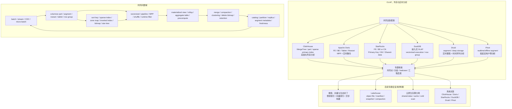

## 今日主题

主主题：`现代数据库行业全景之 OLAP、列存与实时分析预览`

这是 `Topic 1：现代数据库行业全景` 中的第五篇后续专题预览文。它不是 ClickHouse、Apache Doris、StarRocks、DuckDB、Druid、Pinot 的系统深挖，而是先回答：

1. 为什么 OLTP、LSM、分布式 SQL、云原生存算分离之后，还需要单独看 OLAP、列存与实时分析。
2. OLAP 系统为什么不是“把行存换成列存”这么简单。
3. ClickHouse、Apache Doris、StarRocks、DuckDB、Druid、Pinot 分别代表什么路线。
4. 进入系统文章时，应该围绕哪些 storage-first 问题比较。
5. OLAP 的 badcase 为什么集中在小批量导入、part/segment 过多、后台 merge、主键更新、物化视图刷新、shuffle 倾斜、查询内存、冷数据扫描和实时一致性上。

本文只做专题预览。涉及实现细节时，只建立后续源码和官方资料入口，不写源码级结论。

## 这个专题为什么独立存在

前面几篇已经建立了几个基础视角：

- 传统 OLTP 关注 page、WAL、MVCC、B+Tree、buffer pool、二级索引和事务语义。
- LSM 与嵌入式存储引擎关注 WAL、memtable、SST、manifest、compaction 和底层 KV API。
- 分布式 SQL 关注 region/range/tablet、Raft/Paxos、timestamp、2PC、全局索引和 metadata service。
- 云原生存算分离关注 log service、page server、object storage、metadata、cache warmup、serverless compute 和多租户成本。

但这些视角仍然不能完整解释另一类需求：大量事实数据已经写入，用户真正想做的是扫描、过滤、聚合、join、排序、窗口函数、明细钻取、报表刷新、用户画像、日志分析、实时看板和面向客户的低延迟指标查询。

OLAP 与实时分析的核心压力不同：

- 查询经常读取少数列、扫描大量行，列式组织比行式 page 更关键。
- 写入不是单行事务，而是批量导入、流式导入、CDC 导入和微批提交。
- primary key 通常不等于 OLTP 里的唯一索引语义，更多是排序键、去重键、merge key 或更新定位结构。
- 数据文件常以 part、segment、rowset、tablet、micro-batch、time chunk 的形式积累，再由后台 merge/compaction/clustering 变成更适合扫描的布局。
- 查询执行重心从点查和事务转向向量化、pipeline、MPP、shuffle、runtime filter、pre-aggregation、materialized view 和索引裁剪。
- 实时性要求让系统必须同时承担 ingestion、freshness、查询并发和后台整理，任何一条路径失衡都会影响用户体验。

所以这个专题独立存在，是因为 OLAP 系统把“存储模型”和“执行模型”的关系重新放到中心：数据如何被切成列、part、segment 和 rowset，决定了扫描 I/O、压缩、索引、merge、更新删除、物化视图和查询内存的上限。

## 整体学习地图

下图是根据公开资料整理的学习地图，不对应单个系统的官方架构图。后续进入系统文章时，需要替换成 ClickHouse、Apache Doris、StarRocks、DuckDB、Druid、Pinot 的官方图、论文图或源码级图示。

这张图要表达一个判断：OLAP 系统的关键状态不只在 SQL 层，也不只在列式文件。它分布在导入队列、part/segment/rowset、分区和副本元数据、排序键和稀疏索引、物化视图、后台 merge、删除向量、冷热分层和执行内存里。

## 代表系统与学习顺序

| 顺序 | 系统 | 为什么选它 | 后续文章重点 |
| --- | --- | --- | --- |
| 1 | ClickHouse | MergeTree 路线非常适合建立列存 OLAP 的基本词汇：part、partition、sparse primary index、granule、background merge、Replacing/Summing/Aggregating 等表引擎 | MergeTree part 组织、排序键与稀疏索引、replication、mutation、materialized view、MergeTree family 的语义边界、小 part 和 merge 压力 |
| 2 | Apache Doris | FE/BE、tablet、rowset、segment、MPP、实时导入和多种数据模型适合观察“实时数仓”如何兼顾导入、查询和更新 | FE metadata、BE tablet/rowset、stream load/routine load、duplicate/aggregate/unique/key model、compaction、materialized view、shared-nothing 与存算分离模式 |
| 3 | StarRocks | 和 Doris 有共同谱系，但在 Primary Key、persistent index、物化视图、pipeline engine、shared-data 架构上有自己的路线，适合横向对照 | FE/BE/CN、primary key table、delete vector、persistent index、async MV、shared-data object storage、资源隔离与查询并发 |
| 4 | DuckDB | 嵌入式 OLAP 代表，不依赖集群也能展示向量化执行、列式/row group、单机内存管理和文件格式兼容的边界 | vectorized execution、row group、checkpoint/storage format、Parquet/Arrow integration、single-node concurrency、extension 和 embedded analytics |
| 5 | Druid | 面向实时摄取、时间序列和 observability 的 segment 架构，服务拆分清楚：Coordinator、Overlord、Broker、Historical、Middle Manager/Indexer | segment lifecycle、deep storage、metadata store、realtime ingestion、rollup、compaction、historical query path、retention 和 segment availability |
| 6 | Pinot | 面向用户侧低延迟分析和高并发 serving，realtime/offline segment、Controller/Broker/Server/Minion、Helix/ZooKeeper 很适合观察在线分析服务边界 | segment store、realtime ingestion、upsert、star-tree/inverted/range index、broker routing、server pruning、minion task、tenant isolation |

学习顺序先 ClickHouse，再 Doris、StarRocks，然后 DuckDB，最后 Druid 和 Pinot。

原因是：

- ClickHouse 最适合建立列存 part、排序键、稀疏索引和后台 merge 的基本框架。
- Doris 和 StarRocks 适合观察 MPP 实时数仓如何处理 tablet/rowset、主键更新、物化视图和查询并发。
- DuckDB 帮助把“OLAP 不一定等于分布式系统”这件事讲清楚：单机嵌入式也可以因为向量化、列存和文件生态成为重要路线。
- Druid 和 Pinot 适合观察低延迟实时分析服务：segment 生命周期、流式摄取、broker/server 路由、历史数据和实时数据如何同时被查询。

## 核心问题域

### 1. 存储模型：列、part、segment、rowset、tablet、row group

需要比较的问题：

- 数据的最小持久化单位是什么：part、segment、rowset、tablet、row group，还是对象存储文件？
- 分区、排序键、主键、bucket、tablet 和 segment 的边界如何对应？
- 列文件、mark、zone map、bitmap、inverted index、star-tree、Bloom filter 是否随数据文件一起生成？
- 小批量写入会制造多少小 part、小 segment 或小 rowset？后台整理是否能追上前台导入？
- 冷热分层、TTL 和 object storage 是否改变查询路径和回收路径？

后续重点：

- ClickHouse：MergeTree 表由按主键排序的 data parts 组成，插入会生成 parts，后台再合并；primary key 是稀疏索引，不要求唯一。
- Doris：FE 管元数据和调度，BE 同时承担计算和存储；数据按 tablet 水平切分，并用列式存储和副本保障查询与可靠性。
- StarRocks：shared-nothing 下 BE 负责存储和计算，shared-data 下 CN 负责计算和缓存，数据进入对象存储或 HDFS；segment 文件和索引能力仍是关键。
- DuckDB：存储格式包含 row group，row group 支撑压缩和并行扫描。
- Druid/Pinot：segment 是非常核心的可查询与可调度单元。

### 2. 写入路径：batch、stream、CDC、micro-batch 与可见性

需要比较的问题：

- 写入是同步 INSERT、批量 load、stream load、routine load、Kafka ingestion，还是 CDC connector？
- 写入是否先进入内存 buffer 或 memtable，再 flush 成 segment/rowset/part？
- commit 可见性由谁决定：FE transaction、table metadata、segment publish、broker routing、manifest 更新，还是本地文件写完？
- exactly-once、at-least-once、dedup、幂等写入分别在哪里实现？
- 高频小批量写入会如何影响列存布局和后台 merge？

后续重点：

- ClickHouse：小批量 insert 会生成更多 parts，merge 压力和 part 数量是重要 badcase。
- Doris/StarRocks：实时导入、事务提交、tablet/rowset 生成、compaction 和 primary key 更新要一起看。
- Druid：Overlord/Indexer/Middle Manager 负责 ingestion task 和 segment publishing。
- Pinot：realtime table 要同时处理 consuming segment、committed segment、broker routing 和 upsert。

### 3. 读取路径：列裁剪、索引裁剪、MPP、shuffle 与内存

需要比较的问题：

- 查询如何裁剪列、partition、part/segment/rowset、granule 或 tablet？
- 稀疏索引、zone map、bitmap、inverted index、star-tree、min/max metadata 如何减少扫描？
- MPP 执行如何切分 fragment/stage/operator？shuffle 在什么时候发生？
- join、group by、order by、distinct 和 window function 如何分配内存，spill 是否可靠？
- 查询并发和长查询是否会拖住导入、compaction、cache 和 metadata？

后续重点：

- ClickHouse：排序键和 sparse primary index 的选择决定数据跳读能力。
- Doris/StarRocks：FE 规划执行计划，BE/CN 做本地 scan、pipeline、shuffle 和聚合。
- Druid/Pinot：Broker 路由查询到 segment 所在服务，服务侧索引和 segment pruning 决定低延迟能力。
- DuckDB：单进程内的向量化执行、内存管理和文件扫描很适合观察小型/中型分析工作流。

### 4. 更新删除与 primary key：OLAP 的“事务边界”

需要比较的问题：

- primary key 是唯一约束、排序键、去重键、merge key，还是 upsert 定位结构？
- update/delete 是原地修改、mutation、delete bitmap、delete vector、tombstone，还是重新写文件？
- 可见性是立即生效，还是依赖后台 merge 后最终一致？
- 大范围 delete、late arriving data、CDC 更新、乱序事件会制造哪些保留点？
- 主键更新和物化视图、rollup、secondary index、segment compaction 的关系如何？

后续重点：

- ClickHouse：ReplacingMergeTree、Collapsing/Summing/Aggregating 等表引擎给了不同语义，但不能误读成通用 OLTP 更新。
- Doris/StarRocks：Unique/Primary Key 模型更接近实时数仓里的更新需求，但代价会落到索引、delete bitmap/vector、compaction 和内存上。
- Druid/Pinot：upsert 和 background purge 能覆盖部分实时实体分析，但仍要看 segment immutable 假设与更新放大的边界。

### 5. 物化视图、rollup 与预聚合

需要比较的问题：

- 物化视图是写入时同步维护、异步刷新，还是查询时自动 rewrite？
- rollup/aggregate table/star-tree/projection 是否参与数据导入和 compaction？
- 物化结构失效、刷新落后或 schema 变更时，查询是否能正确回退到基表？
- 多个物化视图会如何放大写入、存储和后台任务？
- 预聚合适合固定报表，还是能支撑高变动探索式分析？

后续重点：

- ClickHouse materialized view 更偏写入触发的管道式预计算，要小心历史数据补齐和刷新边界。
- Doris/StarRocks 的物化视图和 query rewrite 适合观察实时数仓优化路径。
- Pinot star-tree 和 Druid rollup 更适合低延迟指标服务，但会牺牲一部分灵活性或写入成本。

### 6. 元数据、复制、调度与资源隔离

需要比较的问题：

- catalog、table、partition、tablet、segment、replica、load job、MV refresh task 的元数据在哪里？
- 元数据服务是否在前台查询路径里？cache miss 或 leader failover 会如何影响查询？
- 副本调度、segment assignment、rebalance、repair、load balancing 是否会抢占前台资源？
- 多租户隔离在 query、ingestion、compaction、cache、metadata 和 object storage 上分别如何实现？
- shared-data 架构中，cache 和 metadata 是否成为新的瓶颈？

后续重点：

- Doris/StarRocks：FE 的 metadata、leader/follower、query plan 和调度职责需要单独拆解。
- Druid：Coordinator、Overlord、Broker、Historical 和 Middle Manager/Indexer 的服务分工非常清楚。
- Pinot：Controller、Broker、Server、Minion、Helix、ZooKeeper 共同决定 segment 生命周期和服务可用性。

## 典型技术路线

| 路线 | 代表系统 | 核心选择 | 后续要验证的问题 |
| --- | --- | --- | --- |
| MergeTree-style 列存 part | ClickHouse | 插入生成按排序键组织的 part，后台 merge，稀疏 primary index 和 marks 支撑跳读 | 小 part、merge backlog、mutation、物化视图、replication 和冷热分层如何影响前台 |
| MPP 实时数仓 | Doris、StarRocks | FE 负责 metadata/planning，BE/CN 执行与存储，tablet/rowset/segment 组织数据 | rowset/segment、primary key、compaction、MV rewrite、导入事务和资源隔离的边界 |
| 嵌入式 OLAP | DuckDB | 单进程、向量化执行、列式/row group、深度集成 Parquet/Arrow/Python/R | 单机并发、内存/spill、文件格式兼容、事务和 extension 的边界 |
| Realtime segment analytics | Druid、Pinot | segment 是可查询和可调度单元，stream ingestion 与 historical/offline segment 结合 | segment publish、broker routing、deep storage、upsert、rollup、star-tree 和 tenant isolation |

预览阶段只记住路线，不提前下源码结论。系统文章阶段再回到本地源码、官方文档、论文和运行实验验证。

## 插件、生态补丁与变相方案

OLAP 系统的生态边界比 OLTP 更容易被“都能查 SQL、都能接 Kafka、都能读 Parquet”掩盖。真正要判断的是能力是否进入存储、元数据、执行和后台任务体系。

| 层次 | 在 OLAP 专题中的含义 | 例子 | 需要警惕的边界 |
| --- | --- | --- | --- |
| 原生能力 | 系统内核直接支持列存、批量/流式导入、向量化或 MPP 查询、segment/part 管理 | ClickHouse MergeTree，Doris/StarRocks MPP，Druid/Pinot segment serving，DuckDB vectorized execution | 原生能力通常有清晰 workload 假设，不等于通用事务数据库 |
| 官方或主流扩展 | 官方 connector、Kafka ingestion、Parquet/Iceberg/Hive catalog、materialized view、UDF、query federation | ClickHouse Kafka engine/MV，Doris/StarRocks lakehouse catalog，DuckDB httpfs/iceberg/postgres extension，Druid/Pinot ingestion connector | 扩展是否参与事务、快照、权限、schema evolution、资源隔离和刷新语义，要逐项验证 |
| 外围系统组合 | 用 OLTP + CDC + OLAP、湖仓 + serving engine、对象存储 + 查询引擎拼分析链路 | MySQL + Flink + Doris/ClickHouse，Kafka + Druid/Pinot，S3 + DuckDB/StarRocks external table | 能查不等于 freshness 可控；能同步不等于一致快照；能接入不等于成本可预测 |
| 变通方案 | 用 OLTP 做大报表，用搜索系统做复杂 OLAP，用 OLAP 承担强事务更新 | PostgreSQL 大表报表，Elasticsearch 聚合代替数仓，ClickHouse 模拟订单状态强事务更新 | 短期能跑，长期会在写放大、查询内存、数据修正、schema 变更和权限治理上付出代价 |

结论不能停在“支持实时分析”。更准确的说法是：实时分析是一组端到端能力，必须同时看摄取、可见性、列存布局、索引、预聚合、查询执行、后台整理、元数据和多租户限流。

## badcase 与架构边界

| 模块 | 典型 badcase | 为什么后续专题会复用 |
| --- | --- | --- |
| 小批量导入 | 高频小 insert 生成大量小 part/segment/rowset，后台 merge 跟不上，查询要扫更多文件 | Lakehouse 小文件、LSM compaction、云原生 object file 都是同类问题 |
| 后台 merge/compaction | merge、clustering、rollup、delete cleanup 与前台查询抢 CPU、I/O、内存 | 所有现代数据库最终都要处理后台任务优先级和资源隔离 |
| 主键更新 | OLAP primary key 常常不是 OLTP 唯一索引，upsert/delete 依赖 delete bitmap/vector、merge 或版本裁剪 | 搜索向量索引和 Lakehouse equality delete/position delete 会遇到类似更新放大 |
| 物化视图刷新 | MV 落后、刷新失败或 rewrite 误判，导致性能退化或语义不一致 | 后续搜索、向量、Lakehouse 都会遇到派生结构维护问题 |
| 数据倾斜 | 分区、bucket、segment 或 query key 分布不均，导致单节点 scan、shuffle 或聚合热点 | 分布式 SQL hotspot、云数仓 warehouse skew、搜索 shard hotspot 都会复用 |
| 查询内存 | 大 join、distinct、order by、window function、top-k 和 high-cardinality group by 容易打爆内存 | 向量检索、Lakehouse 大 shuffle、serverless analytics 都会面对 |
| 冷数据扫描 | 数据在对象存储或冷层，metadata 和 cache miss 让查询尾延迟放大 | 云原生、Lakehouse、搜索冷 segment 都是同类问题 |
| 实时一致性 | stream ingestion、CDC、late event、duplicate event、upsert 和 MV refresh 之间的可见性不一致 | CDC 到 OLAP、搜索索引同步、跨系统派生数据都会遇到 |
| 多租户隔离 | 一个租户的大查询、导入、compaction 或 MV refresh 影响共享集群 | 云服务和用户侧 analytics serving 都必须把资源隔离当核心能力 |

## 对后续专题的影响

### 对搜索、向量与生态补丁

OLAP 的 segment、索引、预聚合和异步维护会帮助判断搜索/向量系统：

- 全文索引和向量索引是原生主存储，还是 OLAP/OLTP 的派生结构？
- 索引 build、merge、delete 和 compaction 是否和主数据共用资源池？
- 查询低延迟靠倒排/向量索引，还是靠列存 scan 与 bitmap 过滤？
- 插件能力是否进入一致性、权限、快照和资源隔离体系？

### 对 Lakehouse 与对象存储表格式

OLAP 的 part/segment/rowset 和 Lakehouse 的 data file/manifest/snapshot 很容易对应起来：

- 小文件问题本质上是写入粒度和扫描粒度不匹配。
- compaction/rewrite 会改变数据布局，也会制造并发可见性和旧文件回收问题。
- metadata pruning、partition pruning、zone map 和 stats 都是避免扫全量对象文件的关键。
- 多引擎共享对象存储时，cache、catalog、权限和 snapshot isolation 会成为边界。

### 对云原生存算分离数据库

StarRocks shared-data、Doris 存算分离模式、Snowflake/BigQuery 这类系统会把 OLAP 和云原生问题合并：

- 计算节点可弹性扩缩，但冷 cache 和远端对象存储扫描会进入尾延迟。
- object storage 降低存储成本，但 metadata、manifest 和 cache 变得更关键。
- warehouse/CN/BE 的资源隔离必须覆盖 query、load、compaction 和 MV refresh。
- 成本模型要同时看 scan bytes、compute time、cache miss、object I/O 和后台任务。

## 本地源码锚点

Day 006 是专题预览，不写源码级结论；这里只记录后续系统文章的源码入口和待补状态。

| 系统 | 本地源码 | 当前状态 | 后续优先入口 |
| --- | --- | --- | --- |
| ClickHouse | `D:\program\ClickHouse` | 已发现本地仓库；本篇只登记入口，不基于源码写实现级结论 | `src/Storages/MergeTree`、`src/Processors`、`src/Interpreters`、`src/Columns`、`src/DataTypes` |
| Apache Doris | `D:\program\doris` | 已发现本地仓库；本篇只登记入口，不基于源码写实现级结论 | `be/src/olap`、`be/src/vec`、`be/src/pipeline`、`be/src/cloud`、`fe/fe-core/src/main/java/org/apache/doris` |
| StarRocks | 暂未发现本地仓库 | 本篇不写源码级结论；后续系统文章前需要 clone 到 `D:\program\starrocks` | `be/src/storage`、`be/src/exec`、`be/src/connector`、`fe/fe-core`、shared-data/cloud native table 相关目录 |
| DuckDB | 暂未发现本地仓库 | 本篇不写源码级结论；后续系统文章前需要 clone 到 `D:\program\duckdb` | `src/storage`、`src/execution`、`src/optimizer`、`src/include/duckdb`、extension 目录 |
| Druid | 暂未发现本地仓库 | 本篇不写源码级结论；后续系统文章前需要 clone 到 `D:\program\druid` | `server`、`processing`、`indexing-service`、`extensions-core`、segment 和 coordinator/overlord 相关模块 |
| Pinot | 暂未发现本地仓库 | 本篇不写源码级结论；后续系统文章前需要 clone 到 `D:\program\pinot` | `pinot-core`、`pinot-segment-local`、`pinot-server`、`pinot-broker`、`pinot-controller`、`pinot-minion` |

## 我的问题

1. ClickHouse MergeTree 的 part 数量、merge 线程、mutation、TTL 和 replication queue 在高频小批量导入下如何互相影响？
2. ClickHouse primary key 是稀疏索引且不要求唯一，这和 OLTP 主键语义的差异会如何影响用户建模？
3. Doris 的 tablet、rowset、segment、delete bitmap、compaction 和 load transaction 之间的边界在哪里？Unique Key 模型下更新成本由谁承担？
4. StarRocks Primary Key 表的 persistent index 和 delete vector 如何影响写入延迟、查询裁剪、内存和 compaction？
5. Doris/StarRocks 的异步物化视图在 refresh lag、query rewrite、schema change 和数据修正时如何保证语义可解释？
6. DuckDB 的 row group、checkpoint、WAL、MVCC 和 vectorized execution 如何在单机进程内协作？它适合多大规模的并发分析？
7. Druid 的 segment publish、deep storage、metadata store 和 Historical loading 之间，哪个步骤最容易成为 freshness 或 availability 的边界？
8. Pinot 的 consuming segment、committed segment、upsert metadata、star-tree index 和 broker routing 如何共同决定用户侧低延迟？
9. OLAP 的实时性到底应该按 ingestion latency、query freshness、MV freshness、CDC exactly-once，还是业务指标可解释性来衡量？
10. 当一个系统同时宣称支持 OLAP、实时更新、湖仓、搜索、向量和高并发 serving 时，哪些能力是原生强项，哪些其实是生态补丁或变相方案？

## 工程启发

第一，OLAP 的核心不是“列存”一个词，而是写入粒度、扫描粒度和后台整理的平衡。

列式文件能让扫描更便宜，但如果写入不断制造小 part、小 segment 或小 rowset，查询会被文件数量、metadata、merge backlog 和 cache miss 拖慢。评估 OLAP 系统要同时追 ingest path 和 merge path。

第二，primary key 在 OLAP 里必须重新理解。

很多 OLAP 系统里的 primary key、sorting key、unique key、upsert key 更接近数据组织和去重/更新结构，不等价于传统 OLTP 的强事务唯一约束。把 OLTP 主键直觉带进 OLAP，容易误判更新、删除和一致性成本。

第三，物化视图和预聚合是性能手段，也是状态维护负担。

预计算可以把查询压力前移到写入和后台刷新，但它会引入刷新延迟、回填、失效、rewrite 判断和多版本语义。越依赖物化结构，越要关心它和基表的一致性边界。

第四，低延迟实时分析通常靠“多层裁剪”而不是单一优化。

partition pruning、segment pruning、sort key、zone map、bitmap、inverted index、star-tree、runtime filter、cache 和 MPP 并行通常一起工作。任一层失效，系统就可能从毫秒级 serving 退化到大扫描。

第五，OLAP 系统的 badcase 往往出现在前台查询和后台任务的交界处。

导入、compaction、MV refresh、schema change、delete cleanup、replica repair、cold data prefetch 都可能与用户查询争用资源。一个架构是否适合长期运行，要看它如何解释和隔离这些后台成本。

## 下一步

Day 007 建议进入：`搜索、向量与生态补丁预览`

预览重点：

- 为什么 OLAP、实时分析之后，需要单独看搜索、向量和 PostgreSQL extension 生态。
- Lucene/Elasticsearch、Milvus、pgvector、PostgreSQL extension 生态分别代表什么路线。
- 倒排索引、segment merge、向量索引 build、delete/update、metadata、cache 和异步回填如何组织。
- 搜索/向量的 badcase 为什么集中在索引构建、删除 GC、召回率与过滤条件结合、冷 segment、主库一致性和插件边界上。

## 参考来源与引用

### 官方文档、论文与设计文档

- [ClickHouse Docs: MergeTree table engine](https://clickhouse.com/docs/engines/table-engines/mergetree-family/mergetree)
- [Apache Doris Docs: System Architecture](https://doris.apache.org/docs/dev/features-architecture/system-architecture/)
- [Apache Doris Docs: Load Internals and Performance Optimization](https://doris.apache.org/docs/dev/data-operate/import/load-internals/)
- [Apache Doris Docs: MPP Architecture](https://doris.apache.org/docs/dev/key-features/mpp/)
- [StarRocks Docs: Architecture](https://docs.starrocks.io/docs/introduction/Architecture/)
- [StarRocks Docs: Primary Key table](https://docs.starrocks.io/docs/table_design/table_types/primary_key_table/)
- [DuckDB Docs: Overview of DuckDB Internals](https://duckdb.org/docs/current/internals/overview)
- [DuckDB Docs: Storage Versions and Format](https://duckdb.org/docs/current/internals/storage)
- [Apache Druid Docs: Architecture](https://druid.apache.org/docs/latest/design/architecture/)
- [Apache Druid Docs: Segments](https://druid.apache.org/docs/latest/design/segments/)
- [Apache Pinot Docs: Architecture](https://docs.pinot.apache.org/architecture-and-concepts/concepts/architecture)
- [Apache Pinot Docs: Pinot storage model](https://docs.pinot.apache.org/basics/concepts/pinot-storage-model)

### 本地源码

- `D:\program\ClickHouse`
- `D:\program\doris`

### 待补源码

- `D:\program\starrocks`
- `D:\program\duckdb`
- `D:\program\druid`
- `D:\program\pinot`
