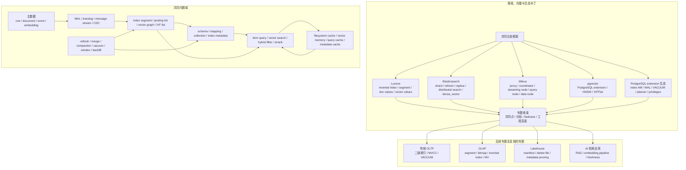

## 今日主题

主主题：`现代数据库行业全景之搜索、向量与生态补丁预览`

这是 `Topic 1：现代数据库行业全景` 中的第六篇后续专题预览文。它不是 Lucene/Elasticsearch、Milvus、pgvector 或 PostgreSQL extension 生态的系统深挖，而是先回答：

1. 为什么 OLAP、列存与实时分析之后，还需要单独看搜索、向量与生态补丁。
2. 倒排索引、向量索引和关系数据库二级索引的边界在哪里。
3. Lucene/Elasticsearch、Milvus、pgvector、PostgreSQL extension 生态分别代表什么路线。
4. 进入系统文章时，应该围绕哪些 storage-first 问题比较。
5. 搜索与向量的 badcase 为什么集中在 segment merge、删除 GC、索引构建、召回率与过滤条件结合、冷索引、主库一致性和插件边界上。

本文只做专题预览。涉及实现细节时，只建立后续源码和官方资料入口，不写源码级结论。

## 这个专题为什么独立存在

前面几篇已经覆盖了几个数据系统主线：

- OLTP 关注事务、WAL、B+Tree、MVCC、二级索引和 buffer pool。
- LSM 关注 WAL、memtable、SST、manifest、compaction 和嵌入式 KV API。
- 分布式 SQL 关注 range/tablet、Raft/Paxos、timestamp、2PC、全局索引和元数据服务。
- 云原生存算分离关注 log service、page server、object storage、metadata、cache warmup 和 serverless 控制面。
- OLAP 关注列存、part/segment/rowset、批量导入、后台 merge、物化视图和 MPP 执行。

搜索与向量检索把问题又推到另一侧：用户不再只按主键、范围、聚合或 join 访问数据，而是按“文本相关性、语义相似度、关键词过滤、向量邻近、权限过滤、实时更新、排序融合”来访问数据。

这类系统的核心状态不只是表和行，而是派生索引：

- 倒排索引把 term 映射到 doc list、frequency、position、payload 和评分统计。
- 向量索引把 embedding 组织成 HNSW graph、IVF list、量化向量、磁盘图或混合结构。
- 搜索 segment 往往是不可变或近似不可变的持久单元，更新删除靠新 segment、live docs、tombstone、merge 或 compaction 消化。
- 混合检索需要把关键词过滤、结构化条件、向量召回、重排、权限和排序规则放在同一个查询路径里。
- 生态补丁把这些能力塞进 PostgreSQL、OLTP 主库、OLAP、应用层缓存或外部服务时，会遇到一致性、延迟、回填和运维边界。

所以这个专题独立存在，是因为它专门研究“派生索引如何成为主查询路径”。一旦搜索或向量索引进入核心业务，索引构建、索引刷新、删除回收、召回率、过滤条件、缓存、租户隔离和主库一致性就不再是附属问题，而是系统正确性和成本模型的一部分。

## 整体学习地图

下图是根据公开资料整理的学习地图，不对应单个系统的官方架构图。后续进入系统文章时，需要替换成 Lucene/Elasticsearch、Milvus、pgvector 和 PostgreSQL extension 生态的官方图、源码级图示或实验图。

这张图要表达一个判断：搜索和向量系统的状态通常不在一处。主数据、日志、索引 segment、向量图、collection/index metadata、缓存和后台任务共同决定查询结果是否新鲜、是否可解释、是否稳定，以及成本是否可控。

## 代表系统与学习顺序

| 顺序 | 系统 | 为什么选它 | 后续文章重点 |
| --- | --- | --- | --- |
| 1 | Lucene | 搜索索引的基础词汇来自 Lucene：segment、term dictionary、postings、stored fields、doc values、live docs、merge、vector values | index file format、segment 生命周期、IndexWriter/DirectoryReader、deleted docs、merge policy、doc values、KNN vector format |
| 2 | Elasticsearch | 把 Lucene 扩展成分布式搜索和向量检索服务，提供 shard、replica、refresh、translog、mapping、distributed search 和 dense_vector | refresh 与 near real-time、shard/replica、translog、segment merge、mapping、kNN、filter + vector、resource isolation |
| 3 | Milvus | 专门向量数据库代表，把向量数据、WAL、object storage、index build、segment、query node、data node 和 coordinator 拆成云原生架构 | collection/partition/segment、WAL、growing/sealed segment、index build、compaction、query routing、object storage、consistency |
| 4 | pgvector | PostgreSQL 内的向量检索扩展代表，适合观察 extension 如何复用 PostgreSQL 表、WAL、MVCC、planner、VACUUM 和索引 AM | HNSW、IVFFlat、approximate recall、filter 后置、VACUUM、index build memory、PostgreSQL 事务语义与向量检索边界 |
| 5 | PostgreSQL extension 生态 | 生态补丁的底座。PostGIS、pgvector、TimescaleDB、Citus、FDW 等都要和核心内核边界协作 | extension packaging、index access method、planner/cost model、WAL、权限、升级、备份恢复、运维边界 |

学习顺序先 Lucene，再 Elasticsearch，然后 Milvus，最后 pgvector 和 PostgreSQL extension 生态。

原因是：

- Lucene 最适合建立倒排索引、segment、live docs 和 merge 的基本模型。
- Elasticsearch 把 Lucene 的本地索引能力放进分片、复制、刷新、路由和集群控制面里，适合观察搜索服务化后的成本。
- Milvus 把向量检索变成专门数据库，适合观察向量系统如何处理 WAL、object storage、index build、query routing 和 compaction。
- pgvector 和 PostgreSQL extension 生态适合回答“能不能直接在主库里补一个能力”这个工程问题。

## 核心问题域

### 1. 索引是不是主存储

需要比较的问题：

- Lucene segment 是搜索索引的持久主状态，还是外部主数据的派生状态？
- Elasticsearch 的 `_source`、stored fields、doc values、inverted index 和 vector values 分别承担什么职责？
- Milvus 的 object storage、WAL、segment 和 index file 谁是可恢复状态的 authority？
- pgvector 中主数据仍在 PostgreSQL heap，HNSW/IVFFlat 是二级索引；这和专门向量库的主存储模型有什么不同？
- 当搜索索引和 OLTP 主库分离时，用户真正信任哪一份数据？

后续重点：

- Lucene：segment 是独立可搜索单元，索引由多个 segment 和 commit point 组成。
- Elasticsearch：near real-time 搜索依赖 refresh，把新 segment 打开为可搜索状态，但不等于强同步事务可见性。
- Milvus：需要追踪 WAL、growing segment、sealed segment、object storage 和 index file 的恢复关系。
- pgvector：索引仍是 PostgreSQL 索引，必须接受 PostgreSQL 的 tuple、TID、MVCC、VACUUM 和 planner 约束。

### 2. 写入、刷新与可见性

需要比较的问题：

- 文档或向量写入后，什么时候对查询可见？
- refresh、commit、flush、fsync、WAL durable、segment publish、index build 完成分别代表什么？
- 实时写入是否先进入内存 buffer、WAL、streaming node 或 growing segment？
- 批量导入和在线增量写入是否走同一条路径？
- 高频更新会制造多少小 segment、小 graph、tombstone 或未合并删除？

后续重点：

- Lucene/Elasticsearch：新增文档会形成新 segment，refresh 让它可搜索，merge 后才真正清理部分删除和小 segment。
- Milvus：写入通过 streaming path 进入 WAL 和 growing data，达到条件后转成 sealed segment，再由 Data Node 处理 compaction 和 index build。
- pgvector：普通表写入遵循 PostgreSQL 事务；向量索引构建、insert 维护、WAL、VACUUM 和查询可见性需要在系统文章里逐项验证。

### 3. 删除、更新与 GC

需要比较的问题：

- 删除是立刻从索引结构中移除，还是先记录 live docs、delete bitmap、tombstone 或 delta log？
- 更新是原地修改，还是 delete old + add new？
- 删除记录什么时候被物理回收：segment merge、compaction、VACUUM，还是对象存储 GC？
- 向量索引删除后，graph 或 list 是否会退化？是否需要 rebuild 或 background cleanup？
- 长时间保留历史、快照、replica lag、CDC lag、备份或租户隔离会不会拖住回收？

后续重点：

- Lucene 的删除和 docID 变化要放在 segment merge 语境里理解。
- Elasticsearch 的删除压力会转化成 merge、disk、query filtering 和 cache 压力。
- Milvus 的 delete、compaction、sealed segment 和 object storage 回收要一起看。
- PostgreSQL/pgvector 的 dead tuple、index entry、VACUUM、HOT 例外和 approximate index 质量要一起看。

### 4. 混合检索：关键词、向量、过滤和重排

需要比较的问题：

- 关键词倒排和向量 ANN 谁先执行？过滤条件是在索引前、索引中还是索引后应用？
- 权限、租户、时间范围、业务状态这类过滤条件会不会破坏向量召回率？
- HNSW、IVF、量化、rerank、BM25、semantic ranker 如何组合？
- 如果向量先召回再过滤，低选择性过滤下是否会返回不足结果？
- 如果过滤先做，是否会让向量索引无法有效裁剪？

后续重点：

- Elasticsearch 可以同时承担关键词、过滤和 dense vector，但要验证 per-segment vector index、candidate 数、filter 和 rerank 的真实交互。
- Milvus 需要看 scalar filter、bitset、segment pruning、query node 搜索和后处理如何协作。
- pgvector README 已经明确 approximate index 下过滤可能在索引扫描后应用，后续要用 PostgreSQL planner 和本地测试验证边界。

### 5. 元数据、分片、缓存与资源隔离

需要比较的问题：

- mapping、schema、collection、partition、segment、shard、replica、index metadata 由谁持久化？
- 查询路由依赖哪些 metadata cache？cache miss 是否会打到 coordinator、master 或 catalog？
- 冷 segment、冷向量索引、object storage、filesystem cache miss 会如何放大尾延迟？
- index build、merge、compaction、refresh、VACUUM、reindex 和 query 是否共用资源池？
- 多租户场景下，一个租户的大索引构建或高维向量查询会不会拖慢其他租户？

后续重点：

- Elasticsearch：cluster state、shard routing、segment cache、filesystem cache 和 merge scheduler 都要进入判断。
- Milvus：Coordinator、Streaming Node、Query Node、Data Node、etcd、object storage、WAL 共同决定服务路径。
- PostgreSQL extension：extension 能复用 PostgreSQL 运维体系，但也会共享同一个 buffer、WAL、VACUUM、锁和连接资源。

### 6. 生态补丁边界

需要比较的问题：

- 这个能力是系统原生擅长，还是通过插件补齐？
- 插件是否进入 WAL、备份恢复、权限、事务、快照、planner、监控和升级体系？
- 外部搜索/向量系统和主库之间靠什么同步：dual write、CDC、消息队列、定时回填，还是应用层补偿？
- 数据修正、schema 变更、权限变化和删除请求如何传播到索引侧？
- 能做 demo 的方案，在数据量、更新频率、召回率、SLO 和运维复杂度放大后是否仍然适合？

后续重点：

- pgvector 代表“在主库里做向量检索”的便利性和边界。
- Elasticsearch/Milvus 代表“专门服务承载检索”的能力和同步成本。
- PostgreSQL extension 生态代表“内核边界可扩展，但不是所有能力都能无代价进入核心路径”。

## 典型技术路线

| 路线 | 代表系统 | 核心选择 | 后续要验证的问题 |
| --- | --- | --- | --- |
| 搜索库内核 | Lucene | 本地 segment、倒排索引、stored fields、doc values、live docs、vector values | segment merge、deleted docs、docID 变化、vector file format、IndexWriter 与 reader reopen 的边界 |
| 分布式搜索服务 | Elasticsearch | Lucene shard + replica + refresh + translog + distributed query | near real-time 可见性、shard routing、merge 压力、kNN per segment、filter + vector、冷热 tier 成本 |
| 专门向量数据库 | Milvus | 向量 collection/segment、WAL、object storage、index build、query node、coordinator | growing/sealed segment、index build lag、delete/compaction、object storage cache、consistency 和资源隔离 |
| 关系数据库扩展 | pgvector | PostgreSQL extension、HNSW/IVFFlat、MVCC 表、planner、VACUUM | approximate recall、filter 后置、index build memory、WAL/VACUUM、主库 workload 干扰 |
| 生态组合方案 | PostgreSQL + Elasticsearch/Milvus/应用层 RAG | 主库承载事实数据，外部系统承载检索索引 | CDC 延迟、dual write、权限同步、删除传播、回填、重建和一致性解释 |

预览阶段只记路线，不提前下源码结论。系统文章阶段再回到本地源码、官方文档和小实验验证。

## 插件、生态补丁与变相方案

搜索和向量专题必须把“能力在系统内”与“能力在系统外”区分清楚。

| 层次 | 在本专题中的含义 | 例子 | 需要警惕的边界 |
| --- | --- | --- | --- |
| 原生能力 | 系统内核直接围绕搜索或向量索引设计主路径 | Lucene 倒排索引，Elasticsearch shard/search，Milvus vector collection/index | 原生能力也有 workload 假设；高频更新、强事务和复杂 join 未必是强项 |
| 官方或主流扩展 | 在已有数据库内补检索能力，并进入一部分内核机制 | pgvector、PostgreSQL GIN/GiST/SP-GiST、PostGIS、全文检索 | 能复用事务和备份恢复，但会共享主库资源，也受 planner、VACUUM 和索引 AM 边界约束 |
| 外围系统组合 | 主库加外部搜索或向量服务，通过 CDC、消息队列或批处理同步 | PostgreSQL + Elasticsearch，MySQL + Canal + Elasticsearch，PostgreSQL + Milvus | 同步延迟、权限变更、删除传播、回填和故障补偿需要单独设计 |
| 变通方案 | 用不擅长的系统模拟搜索或向量服务 | SQL LIKE 做全文检索，JSONB 存 embedding，自建内存 ANN 服务，应用层拼排序 | 小数据可用，放大后会在索引维护、召回率、恢复、监控和成本上失控 |

结论不能停在“支持向量检索”或“支持全文检索”。更准确的说法是：搜索/向量能力只有进入写入、索引构建、刷新、查询、过滤、删除、回收、权限和资源隔离体系后，才算真正进入数据库架构。

## badcase 与架构边界

| 模块 | 典型 badcase | 为什么后续专题会复用 |
| --- | --- | --- |
| 高频小写入 | 不断生成小 segment、小 graph 或待构建索引，refresh/merge/index build 跟不上 | OLAP 小 part、Lakehouse 小文件、LSM compaction 都是同类问题 |
| 删除与更新 | 删除只打标，物理回收依赖 merge、compaction 或 VACUUM；向量 graph/list 质量可能退化 | MVCC dead tuple、OLAP delete bitmap、Lakehouse delete file 都会复用 |
| 召回率与过滤 | 向量先召回再过滤可能结果不足；过滤先做可能让 ANN 不好用 | RAG、权限过滤、多租户检索和语义搜索都会遇到 |
| 冷索引和冷缓存 | segment 或向量索引在远端存储，本地 cache miss 放大尾延迟 | 云原生、OLAP、Lakehouse 和搜索冷 tier 都有相同成本 |
| 后台任务争用 | merge、reindex、compaction、index build、VACUUM 与前台查询抢 CPU、I/O、内存 | 所有现代数据库都要处理后台任务资源隔离 |
| 主库一致性 | 外部搜索/向量服务落后主库，用户读到旧权限、旧状态或已删除内容 | CDC 到 OLAP、分布式二级索引、物化视图都会遇到 |
| schema 和 mapping 变更 | 字段类型、分词器、embedding 维度、index option 变化可能要求 reindex | OLAP MV、Lakehouse schema evolution、PostgreSQL extension 升级都会复用 |
| 多租户隔离 | 一个租户的大索引构建、高维查询或 reindex 拖慢共享节点 | 云服务、向量数据库和 PostgreSQL 主库扩展都需要隔离策略 |
| 成本不可解释 | 向量内存、object I/O、query fanout、rerank、embedding 生成和重建成本分散 | AI 检索系统尤其容易低估端到端成本 |

## 对后续专题的影响

### 对 Lakehouse 与对象存储表格式

搜索/向量和 Lakehouse 都会遇到“主数据文件 + 派生索引/metadata”的关系：

- Lakehouse data file、manifest、delete file 和 stats 很像搜索里的 segment、live docs 和 metadata pruning。
- 索引或 metadata 的异步维护会带来 refresh lag、回填、旧版本保留和回收压力。
- 多引擎共享对象存储时，权限、schema、snapshot 和 cache 一致性会更难解释。

### 对传统 OLTP 与 PostgreSQL

pgvector 会提前暴露 Topic 2 里要深挖的问题：

- PostgreSQL 索引是独立物理 relation，表更新会产生新的 tuple 和 index entry。
- extension 能复用 PostgreSQL 的事务、WAL、备份恢复和权限体系，但也会共享同一个主库资源池。
- 当向量检索、全文检索、JSON、地理空间和时序能力都塞进主库后，真正的边界不在“能不能建索引”，而在 workload 隔离和运维复杂度。

### 对 AI 检索应用

搜索和向量专题是理解 RAG 基础设施的入口：

- embedding pipeline 是否和数据库事务绑定。
- 文档 chunk、向量、metadata、权限和原文之间如何保持一致。
- 删除和权限变更是否能及时传播到检索索引。
- 召回率、freshness、成本和可解释性要一起衡量，不能只看一次查询延迟。

## 本地源码锚点

Day 007 是专题预览，不写源码级结论；这里只记录后续系统文章的源码入口和待补状态。

| 系统 | 本地源码 | 当前状态 | 后续优先入口 |
| --- | --- | --- | --- |
| Lucene | `D:\program\lucene` | 已发现本地仓库，工作区干净；本篇只登记入口，不基于源码写实现级结论 | `lucene/core/src/java/org/apache/lucene/index/IndexWriter.java`、`DirectoryReader.java`、`SegmentInfos.java`、`DocumentsWriter*.java`、`lucene/core/src/java/org/apache/lucene/codecs/lucene103`、`lucene/core/src/java/org/apache/lucene/codecs/lucene99` |
| Elasticsearch | 暂未发现本地仓库 | 本篇不写源码级结论；后续系统文章前需要 clone 到 `D:\program\elasticsearch` 或确认是否只做公开资料级分析 | shard、engine、translog、refresh、merge、mapping、dense vector、query phase 相关模块 |
| Milvus | `D:\program\milvus` | 已发现本地仓库，工作区干净；本篇只登记入口，不基于源码写实现级结论 | `internal/datacoord`、`internal/querynodev2`、`internal/proxy`、`internal/rootcoord`、`internal/indexnode`、`pkg`、`docs` |
| PostgreSQL | `D:\program\postgres` | 已发现本地仓库，工作区干净；本篇只登记入口，不基于源码写实现级结论 | `src/backend/access`、`src/backend/commands/extension.c`、`src/include/access`、`src/include/catalog`、`contrib` |
| pgvector | `D:\program\pgvector` | 本次已 clone；工作区干净；本篇只登记入口，不基于源码写实现级结论 | `src/hnsw*.c`、`src/ivf*.c`、`src/vector.c`、`sql/vector.sql`、`vector.control`、`test/t/*hnsw*`、`test/t/*ivfflat*` |

## 我的问题

1. Lucene segment merge 如何同时处理 deleted docs、doc values、vector values、stored fields 和 postings？merge 期间查询可见性如何维持？
2. Lucene 的向量索引和倒排索引在同一 segment 内如何协作？HNSW graph、quantized vectors、live docs 对召回率和删除有什么影响？
3. Elasticsearch refresh、flush、translog fsync、replica acknowledgement 和 Lucene commit 分别对应什么持久化与可见性语义？
4. Elasticsearch 的 kNN 检索在 shard、segment、filter、num_candidates、rerank 和 global top-k 合并之间如何取舍？
5. Milvus 的 growing segment 与 sealed segment 在查询路径里如何合并结果？sealed segment 的 index build lag 会不会影响 freshness？
6. Milvus 的 DataCoord/QueryCoord/IndexCoord、object storage、WAL 和 etcd 之间，谁决定 segment 的可见性和可恢复性？
7. Milvus delete、compaction 和 index rebuild 如何影响向量召回率、object storage 回收和前台查询延迟？
8. pgvector 的 HNSW/IVFFlat 在 PostgreSQL MVCC、VACUUM、WAL、parallel index build 和 planner cost model 下分别有什么边界？
9. 当 `WHERE` 过滤条件和向量 ANN 结合时，PostgreSQL、Elasticsearch 和 Milvus 分别如何避免“召回了相似向量但过滤后不够”的问题？
10. 对业务系统来说，什么时候应该用主库 extension，什么时候应该外接 Elasticsearch/Milvus，什么时候应该避免把搜索/向量放进数据库路径？

## 工程启发

第一，搜索和向量系统的核心不是“多一种索引”，而是派生状态如何进入主查询路径。

倒排索引、向量图、doc values、stored fields、metadata cache 和权限过滤一旦参与用户关键路径，就必须像主数据一样考虑写入、恢复、刷新、删除、回收、监控和限流。

第二，near real-time 不是事务实时。

refresh、segment publish、index build、CDC apply 和 embedding pipeline 都可能让检索结果落后主库。业务文案里可以说“实时搜索”，架构判断里必须追问：哪一层实时，延迟多大，失败时如何补偿。

第三，删除比插入更能暴露架构边界。

插入可以追加，删除和更新却要处理 live docs、tombstone、dead tuple、graph 退化、segment merge、VACUUM、compaction 和对象存储回收。合规删除、权限变更和数据修正会把这些边界全部放大。

第四，向量检索必须和过滤条件一起评估。

单独测 ANN 延迟和召回率意义有限。真实应用通常有租户、权限、时间、状态、语言、地域、业务类型过滤，再叠加关键词和 rerank。过滤发生在 ANN 前还是后，会直接影响结果数量、召回率和延迟。

第五，插件生态是生产力，也是复杂性转移。

pgvector 这类 extension 的价值在于复用 PostgreSQL 的事务、权限、备份和运维体系；代价是向量检索也会共享主库资源，并接受 PostgreSQL planner、VACUUM、buffer、WAL 和连接模型的约束。外部系统则相反：能力更专门，但一致性和运维要自己承担。

## 下一步

Day 008 建议进入：`Lakehouse 与对象存储表格式预览`

预览重点：

- 为什么搜索、向量与生态补丁之后，需要看 Lakehouse、对象存储和表格式。
- Iceberg、Delta Lake、Paimon 分别代表什么路线。
- object file、manifest、metadata tree、snapshot、delete file、compaction、schema evolution 和多引擎共享如何组织。
- Lakehouse 的 badcase 为什么集中在小文件、commit 冲突、旧 snapshot 保留、delete file 膨胀、catalog 可用性、多引擎一致性和成本上。

## 参考来源与引用

### 官方文档、论文与设计文档

- [Apache Lucene 10.3.1 Documentation](https://lucene.apache.org/core/10_3_1/)
- [Apache Lucene 10.3.1 Index File Formats](https://lucene.apache.org/core/10_3_1/core/org/apache/lucene/codecs/lucene103/package-summary.html)
- [Elasticsearch Docs: Near real-time search](https://www.elastic.co/docs/manage-data/data-store/near-real-time-search)
- [Elasticsearch Docs: Dense vector field type](https://www.elastic.co/guide/en/elasticsearch/reference/current/dense-vector.html)
- [Elasticsearch Docs: kNN search](https://www.elastic.co/docs/solutions/search/vector/knn)
- [Milvus Docs: Architecture Overview](https://milvus.io/docs/architecture_overview.md)
- [Milvus Docs: Insert Entities](https://milvus.io/docs/insert-update-delete.md)
- [PostgreSQL Docs: Packaging Related Objects into an Extension](https://www.postgresql.org/docs/current/extend-extensions.html)
- [PostgreSQL Docs: Index Access Method Interface Definition](https://www.postgresql.org/docs/current/indexam.html)
- [pgvector README](https://github.com/pgvector/pgvector)

### 本地源码

- `D:\program\lucene`
- `D:\program\milvus`
- `D:\program\postgres`
- `D:\program\pgvector`

### 待补源码或公开资料

- `D:\program\elasticsearch`
