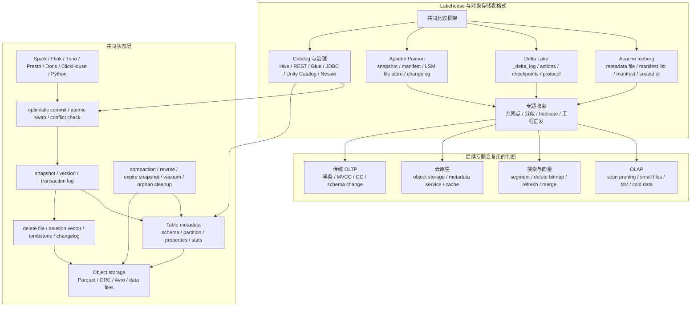

## 今日主题

主主题：`现代数据库行业全景之 Lakehouse 与对象存储表格式预览`

这是 `Topic 1：现代数据库行业全景` 中的第七篇后续专题预览文。它不是 Iceberg、Delta Lake 或 Paimon 的系统深挖，而是先回答：

1. 为什么搜索、向量与生态补丁之后，还需要单独看 Lakehouse、对象存储和开放表格式。
2. Lakehouse 的核心状态为什么不只是 Parquet/ORC 数据文件，而是 metadata、snapshot、manifest、transaction log、delete file 和 catalog 的组合。
3. Iceberg、Delta Lake、Paimon 分别代表什么技术路线。
4. 后续进入系统文章时，应该围绕哪些 storage-first 问题比较。
5. Lakehouse 的 badcase 为什么集中在小文件、commit 冲突、旧 snapshot 保留、delete file/deletion vector 膨胀、catalog 可用性、多引擎一致性和对象存储成本上。

本文只做专题预览。涉及实现细节时，只建立后续源码和官方资料入口，不写源码级结论。

## 这个专题为什么独立存在

前面几篇已经覆盖了从 OLTP 到搜索/向量的几条主线：

- OLTP 把正确性压在 WAL、B+Tree、MVCC、锁、二级索引和 buffer pool 上。
- LSM 把写入吞吐压在 WAL、memtable、SST、manifest 和 compaction 上。
- 分布式 SQL 把事务和分片复制压在 timestamp、2PC、Raft/Paxos、range/tablet 和元数据服务上。
- 云原生存算分离把 durable state 拆到 log service、page server、object storage、metadata service 和 cache 层。
- OLAP 把大规模扫描压在列存文件、segment、part、rowset、物化视图和后台 merge 上。
- 搜索/向量把主查询路径转移到派生索引、segment、向量图、refresh、merge 和外部同步上。

Lakehouse 继续把问题往“开放对象存储上的共享数据状态”推进。数据不再只归一个数据库内核所有，而是被 Spark、Flink、Trino、Presto、Doris、ClickHouse、Snowflake、BigQuery、流式作业、批处理作业、Python 引擎和治理系统共同读取或写入。

这类系统的核心不是“把 Parquet 放到 S3 上”，而是要给对象存储补上数据库表语义：

- 哪些 object file 属于当前表版本。
- 哪些文件是历史版本、删除文件、changelog、metadata、checkpoint 或统计信息。
- 一个写入如何变成可见 snapshot。
- 多个 writer 如何做 optimistic commit 和冲突检测。
- schema、partition、sort order、primary key、delete、branch/tag、time travel 如何演进。
- 多个计算引擎如何读取同一份 metadata，并在不互相破坏的情况下写入。
- 历史版本、孤儿文件、小文件和 deletion vector/delete file 如何被回收。

因此 Lakehouse 与对象存储表格式是一个独立专题：它研究的是“如何在便宜、弹性、但缺少数据库语义的对象存储上，构造可共享、可演进、可恢复、可治理的表状态”。

## 整体学习地图

下图是根据公开资料整理的学习地图，不对应单个系统的官方架构图。后续进入系统文章时，需要替换成 Iceberg、Delta Lake、Paimon 的官方图、规范图、源码级图示或实验图。

这张图要表达一个判断：Lakehouse 的 durable state 分散在对象文件、metadata、snapshot/log、catalog 和后台维护结果里。任何一个环节解释不清，都会影响读写正确性、成本、延迟和多引擎互操作。

## 代表系统与学习顺序

| 顺序 | 系统 | 为什么选它 | 后续文章重点 |
| --- | --- | --- | --- |
| 1 | Apache Iceberg | 开放表格式代表，围绕 metadata file、manifest list、manifest、snapshot、partition evolution、delete file、REST catalog 建立了清晰规范 | table spec、metadata JSON、manifest pruning、snapshot commit、row-level delete、catalog、expire snapshots、rewrite manifests |
| 2 | Delta Lake | 以 `_delta_log` 事务日志、action、checkpoint、protocol/table feature 为核心，适合观察日志式表状态和 Spark 生态下的 ACID 语义 | transaction log、AddFile/RemoveFile、checkpoint、optimistic transaction、deletion vector、VACUUM、protocol compatibility |
| 3 | Apache Paimon | 更偏向流批统一和主键表，适合观察 object storage 上的 LSM file store、changelog、manifest、snapshot 和 compaction | snapshot/manifest/file layout、primary-key table、LSM sorted run、MOR/COW/MOW、changelog、deletion vector、compaction |
| 4 | Catalog 与治理系统 | 表格式最终要通过 catalog 暴露给多引擎和权限治理；catalog 可用性和 commit 语义会进入主路径 | Hive/Glue/JDBC/REST catalog、Unity Catalog、Nessie、credential vending、multi-engine compatibility、权限和治理边界 |

学习顺序先 Iceberg，再 Delta Lake，然后 Paimon，最后横向看 catalog 与治理。

原因是：

- Iceberg 的规范最适合建立 metadata tree、manifest、snapshot、delete file 和 atomic metadata swap 的基础词汇。
- Delta Lake 的 `_delta_log` 适合和数据库 WAL/redo/binlog 做类比，但它承载的是表版本和文件级 action，不是单行 redo。
- Paimon 把流式更新、主键表和 LSM 组织带入 Lakehouse，适合连接前面 LSM 与 OLAP 的学习线。
- Catalog 是多引擎共享的真实入口。表格式再开放，如果 catalog、权限、credential、commit 冲突和 metadata cache 解释不清，生产使用仍然会出问题。

## 核心问题域

### 1. 谁是表状态的 authority

需要比较的问题：

- Iceberg 中，当前表状态由 catalog 指向的 metadata file、metadata file 内的当前 snapshot，以及 snapshot 引用的 manifest list/manifest 共同决定。
- Delta Lake 中，当前表状态由 `_delta_log` 中的有序 action 和 checkpoint 重放得到。
- Paimon 中，snapshot 是读表入口，manifest list 和 manifest 进一步指向 data file、changelog file 或 index file。
- catalog 是只保存 metadata pointer，还是参与 commit、权限、credential、冲突处理和多表事务？
- 对象存储里的 data file 是否可以单独解释为表数据，还是必须通过表 metadata/log 才能解释？

后续重点：

- Iceberg：追 metadata JSON、snapshot、manifest list 和 manifest 之间的层次。
- Delta Lake：追 `_delta_log` action、checkpoint、protocol 和 active file set 的生成。
- Paimon：追 snapshot、manifest、bucket、LSM sorted run、changelog 和 primary-key table 的关系。

### 2. 写入、commit 与可见性

需要比较的问题：

- 写入是否先落 data file，再提交 metadata/log？
- 提交是 atomic metadata pointer swap、递增 log version，还是 catalog-level commit？
- 多 writer 冲突如何检测：文件集合、predicate、partition、snapshot parent、table version，还是 catalog lock？
- commit 成功后，reader 什么时候看见新版本？metadata cache 和 catalog cache 会不会让可见性滞后？
- 写失败后，已经落到对象存储但未提交的文件如何清理？

后续重点：

- Iceberg：atomic swap 和 optimistic concurrency 是理解 serializable isolation 的入口。
- Delta Lake：optimistic concurrency 的 read/write/validate-and-commit 三阶段要和 `_delta_log` 文件提交结合看。
- Paimon：Flink checkpoint、commit、snapshot、manifest 和 compaction 的关系需要单独验证。

### 3. 删除、更新与行级变更

需要比较的问题：

- 删除是 rewrite data file、写 delete file、写 deletion vector，还是写 changelog？
- row-level delete 如何和 snapshot、sequence number、data file position、primary key 或 bucket 绑定？
- Update/Merge 是 copy-on-write、merge-on-read，还是 merge-on-write？
- delete file/deletion vector/changelog 膨胀后，读路径要付出多少额外合并成本？
- 物理清理依赖 expire snapshot、VACUUM、compaction、REORG、orphan cleanup，还是 catalog 维护？

后续重点：

- Iceberg：position delete、equality delete、deletion vector 与 data/delete manifest 的关系。
- Delta Lake：RemoveFile、deletion vector、OPTIMIZE/REORG/VACUUM 的边界。
- Paimon：主键表的 MOR/COW/MOW、deletion vector 和 compaction 如何影响读写。

### 4. 读取路径、裁剪与缓存

需要比较的问题：

- 查询如何从 catalog 找到当前 metadata/log，再生成 scan plan？
- metadata pruning 用什么统计信息：partition stats、column stats、manifest stats、file stats、data skipping index？
- manifest、checkpoint、metadata table、file listing、object storage list/read 分别在哪里消耗延迟？
- 多引擎共享时，不同引擎是否都理解同一组 table feature、delete semantics、schema evolution 和统计信息？
- 冷对象存储读、metadata cache miss、小文件和高并发 list operation 如何放大尾延迟？

后续重点：

- Iceberg：manifest list 和 manifest 的统计信息如何减少 planning I/O。
- Delta Lake：checkpoint 如何减少重放 `_delta_log` 的成本，data skipping 如何依赖文件级 stats。
- Paimon：primary-key table 的 LSM read merge、read-optimized table 和 full compaction 关系。

### 5. 元数据、schema evolution 与多引擎共享

需要比较的问题：

- schema、partition、sort order、primary key、table property、feature flag 由谁记录和验证？
- schema evolution 是否依赖 field id、column mapping、name mapping 或 engine-specific rule？
- 一个引擎启用新特性后，旧引擎还能不能读写？
- REST catalog、Unity Catalog、Nessie、Hive Metastore、Glue、JDBC catalog 分别承担哪些责任？
- catalog 不可用时，读写是全部中断，还是已有 snapshot 可继续读取？

后续重点：

- Iceberg：field id、partition evolution、REST catalog 和 branch/tag 需要一起看。
- Delta Lake：protocol version、table feature、checkpoint protection 和 feature downgrade 是兼容性入口。
- Paimon：schema file、catalog、Iceberg compatibility 和主键表可见性要重点验证。

### 6. 维护任务与成本模型

需要比较的问题：

- 小文件从哪里来：流式小批量、分区过细、writer 并发、低延迟 commit，还是 compaction 不足？
- metadata 文件、manifest、transaction log、checkpoint、snapshot 历史会不会膨胀？
- expire snapshot/VACUUM 是否会误删仍被旧 snapshot、branch、tag、streaming reader 或 time travel 使用的文件？
- compaction/rewrite 是否和前台读写抢对象存储带宽、CPU、shuffle、catalog commit 和锁？
- 对象存储 API 成本、list/read/write/delete 请求数和 egress 是否可解释？

后续重点：

- Iceberg：expire snapshots、rewrite manifests、delete orphan files、compact data files。
- Delta Lake：OPTIMIZE、VACUUM、checkpoint 和 deletion vector purge。
- Paimon：universal compaction、full compaction、snapshot/tag/changelog expiration。

## 典型技术路线

| 路线 | 代表系统 | 核心选择 | 后续要验证的问题 |
| --- | --- | --- | --- |
| Metadata tree + manifest | Iceberg | metadata JSON 指向 snapshot，snapshot 指向 manifest list，manifest 指向 data/delete file | manifest pruning、metadata pointer swap、sequence number、delete file、REST catalog commit |
| Transaction log + checkpoint | Delta Lake | `_delta_log` 记录 action，checkpoint 加速重放，protocol/table feature 控制兼容性 | optimistic transaction、AddFile/RemoveFile、checkpoint、deletion vector、VACUUM、feature downgrade |
| LSM file store + snapshot | Paimon | snapshot/manifest 管理对象文件，主键表用 LSM sorted run 和 compaction 支持更新 | MOR/COW/MOW、bucket、changelog、compaction、deletion vector、Iceberg reader 兼容 |
| Catalog-governed multi-engine table | Iceberg REST、Unity Catalog、Nessie、Glue、Hive Metastore | catalog 统一 metadata pointer、权限、credential、branch/tag 或 commit coordination | catalog 可用性、credential vending、metadata cache、跨引擎 feature compatibility、权限一致性 |

预览阶段只记路线，不提前下源码结论。系统文章阶段再回到本地源码、官方文档和小实验验证。

## 插件、生态补丁与变相方案

Lakehouse 专题必须区分“表格式能力”与“数据库能力”。开放表格式能补上对象存储缺少的表版本和元数据，但它不是完整数据库内核。

| 层次 | 在本专题中的含义 | 例子 | 需要警惕的边界 |
| --- | --- | --- | --- |
| 原生能力 | 表格式直接定义的版本、metadata、delete、schema evolution、snapshot、commit 语义 | Iceberg snapshot/manifest，Delta `_delta_log`，Paimon snapshot/manifest/primary-key table | 原生表格式语义仍依赖引擎实现；不是所有引擎都支持全部 feature |
| 官方或主流扩展 | 通过 catalog、connector、procedure、maintenance job 扩展能力 | Iceberg REST Catalog、Spark/Flink procedures、Delta Kernel、Paimon Flink/Spark connector | connector 版本、表 feature、checkpoint、权限和 credential 可能成为兼容性边界 |
| 外围系统组合 | 表格式加计算引擎、catalog、对象存储、治理系统、compaction 服务 | S3 + Iceberg + Trino + Spark，Delta + Spark + Unity Catalog，Flink + Paimon + Hive Catalog | 多组件之间的 commit、cache、权限、schema 和维护任务需要单独设计 |
| 变通方案 | 只把 Parquet/CSV 当表，靠目录分区、文件名和应用约定维护状态 | Hive-style partition 目录，手工覆盖分区，定时清理文件，应用层记录版本 | 小规模可用，放大后会在并发写、历史版本、schema 变更、删除和孤儿文件上失控 |

结论不能停在“支持 ACID”或“支持 time travel”。更准确的问题是：表格式的 ACID 覆盖的是表版本和文件集合，是否能满足业务层的行级事务、约束、唯一性、低延迟更新和跨表一致性，还要看系统文章中的实现和 workload。

## badcase 与架构边界

| 模块 | 典型 badcase | 为什么后续专题会复用 |
| --- | --- | --- |
| 小文件 | 流式小批量和高并发 writer 生成大量小 data file，scan planning 和对象存储请求数膨胀 | OLAP part/segment、搜索小 segment、LSM L0 文件都是同类问题 |
| commit 冲突 | 多 writer 同时改同一表、分区、文件集合或 predicate，乐观提交反复失败 | 分布式 SQL 的事务冲突、物化视图 refresh 和二级索引回填都会遇到 |
| 旧 snapshot 保留 | time travel、branch/tag、streaming reader、备份和审计拖住文件回收 | MVCC 长事务、CDC lag、搜索 live docs、云原生旧 page 回收都有相似边界 |
| delete file/deletion vector 膨胀 | 删除和更新不重写数据文件，读路径需要叠加 delete 信息，compaction 滞后后读放大明显 | 搜索 deleted docs、PostgreSQL dead tuple、OLAP delete bitmap 都会复用 |
| catalog 可用性 | catalog 服务或 metastore 抖动导致 commit、metadata refresh、权限和 credential 获取失败 | 分布式 SQL master/PD、云原生 metadata service、搜索 cluster state 是同类主路径 |
| 多引擎一致性 | 一个引擎启用新 feature 或新 schema，另一个引擎无法读写或语义不同 | PostgreSQL extension、OLAP connector、搜索外部同步都有兼容性问题 |
| 对象存储语义 | rename、list consistency、multipart upload、delete marker、credential 过期和请求限流影响提交与清理 | 云原生存算分离和冷数据分析都会遇到 |
| 维护任务争用 | compaction、rewrite、VACUUM、expire、checkpoint 与前台查询抢资源 | 所有现代数据库的后台任务隔离问题 |
| 成本不可解释 | metadata scan、object list、small file read、shuffle rewrite、egress 和 catalog 请求分散在多个系统 | Lakehouse 很容易只看存储单价，低估端到端运行成本 |

## 对后续专题的影响

### 对 OLAP、列存与实时分析

Lakehouse 会把 OLAP 的存储边界前移到开放表格式：

- 列存文件本身不够，query planning 需要 metadata、manifest、stats 和 snapshot。
- 小文件和 delete vector 会直接影响 scan fanout、predicate pruning 和 tail latency。
- 实时写入越频繁，metadata 和 compaction 压力越像 OLAP 小 part/rowset 问题。

### 对搜索、向量与生态补丁

Lakehouse 和搜索/向量共享“主数据文件 + 派生状态”的问题：

- delete file/deletion vector 与搜索里的 live docs/delete bitmap 类似，都是先逻辑删除，再靠 merge/compaction 消化。
- metadata pruning 与搜索 segment metadata、doc values、vector index cache 都是查询裁剪入口。
- 异步维护让 freshness、成本和正确性变成同一个问题。

### 对云原生存算分离

Lakehouse 是对象存储成为 durable state authority 的极端场景：

- 数据文件、metadata 文件、transaction log 和 checkpoint 都在远端存储，cache miss 会显著影响尾延迟。
- catalog 与 metadata service 的边界决定了 serverless、多租户和跨引擎共享是否可靠。
- branch、time travel、clone、audit 和 backup 会把旧版本回收问题放大。

### 对传统 OLTP

Lakehouse 不是传统 OLTP 的替代品，但它会复用很多 OLTP 问题：

- optimistic concurrency 和 snapshot isolation 需要回答冲突、可见性和历史版本。
- schema evolution 和 constraint 不能只看 DDL 语法，要看 metadata、reader compatibility 和 write validation。
- 行级更新/delete 的代价常被转移到 delete file、deletion vector、read merge 和 compaction。

## 本地源码锚点

Day 008 是专题预览，不写源码级结论；这里只记录后续系统文章的源码入口和待补状态。

| 系统 | 本地源码 | 当前状态 | 后续优先入口 |
| --- | --- | --- | --- |
| Apache Iceberg | `D:\program\iceberg` | 本次已 clone；工作区干净；本篇只登记入口，不基于源码写实现级结论 | `site/docs/spec.md`、`docs/docs/maintenance.md`、`core/src/main/java/org/apache/iceberg/TableMetadata.java`、`SnapshotProducer.java`、`BaseMetastoreTableOperations.java`、`ManifestFiles.java`、`RemoveSnapshots.java`、`api/src/main/java/org/apache/iceberg/Snapshot.java`、`ManifestFile.java`、`DataFile.java`、`DeleteFile.java` |
| Delta Lake | `D:\program\delta` | 本次已 clone；Windows checkout 需要启用 `core.longpaths` 后恢复；工作区干净；本篇只登记入口，不基于源码写实现级结论 | `PROTOCOL.md`、`spark/src/main/scala/org/apache/spark/sql/delta/DeltaLog.scala`、`Snapshot.scala`、`OptimisticTransaction.scala`、`Checkpoints.scala`、`ConflictChecker.scala`、`commands/VacuumCommand.scala`、`actions/DeletionVectorDescriptor.scala`、`kernel/kernel-api/src/main/java/io/delta/kernel/internal/actions/AddFile.java`、`RemoveFile.java` |
| Apache Paimon | `D:\program\paimon` | 本次已 clone；工作区干净；本篇只登记入口，不基于源码写实现级结论 | `paimon-api/src/main/java/org/apache/paimon/Snapshot.java`、`paimon-core/src/main/java/org/apache/paimon/manifest/ManifestList.java`、`ManifestFile.java`、`ManifestEntry.java`、`operation/FileStoreCommitImpl.java`、`FileStoreScan.java`、`SnapshotDeletion.java`、`catalog/FileSystemCatalog.java`、`schema/SchemaManager.java`、`deletionvectors/DeletionVector.java` |

## 我的问题

1. Iceberg 的 metadata file pointer swap 在不同 catalog 中如何实现原子性？Hive、REST、Glue、JDBC、Nessie 的失败恢复语义有什么差异？
2. Iceberg manifest list 和 manifest 的统计信息如何影响 scan planning？manifest 过多时 rewrite manifests 的收益和代价如何判断？
3. Iceberg row-level delete 的 position delete、equality delete、deletion vector 与 sequence number 如何共同决定可见性？
4. Delta Lake 的 `_delta_log` action 重放到 active file set 的过程里，checkpoint、protocol、table feature 分别承担什么职责？
5. Delta Lake optimistic transaction 如何判断 update/delete/merge 与并发写是否冲突？predicate 和 file-level conflict 的边界在哪里？
6. Delta deletion vector 延迟重写数据文件时，读放大、VACUUM、REORG/OPTIMIZE 和兼容性成本如何权衡？
7. Paimon 主键表的 LSM sorted run、bucket、manifest、snapshot、changelog 和 compaction 如何组合成读写路径？
8. Paimon MOR、COW、MOW 三种模式分别把成本放到读路径、写路径还是 compaction 路径？deletion vector 可见性为什么依赖 compaction？
9. 多引擎共享同一张 Lakehouse 表时，如何避免一个引擎启用的新 feature、schema evolution 或 delete semantics 破坏另一个引擎？
10. Lakehouse 的“ACID”与 OLTP 数据库的事务语义差异在哪里？什么时候表格式事务足够，什么时候必须回到 OLTP/分布式 SQL？

## 工程启发

第一，开放表格式的核心价值是把对象存储文件变成可解释的表版本。

裸 Parquet 文件只提供列式存储，不提供当前版本、历史版本、删除、schema 演进、并发提交和跨引擎共享。Iceberg、Delta Lake、Paimon 的共同点，是把这些语义编码到 metadata/log/snapshot/manifest/catalog 体系里。

第二，Lakehouse 的“日志”不是传统数据库 redo log。

Delta 的 `_delta_log`、Iceberg 的 metadata/snapshot/manifest、Paimon 的 snapshot/manifest 都是在描述表版本和文件集合变化。它们能提供表级 ACID 和 snapshot 语义，但不能自动等价于 OLTP 的行级锁、唯一约束、低延迟点更新和跨表事务。

第三，删除和更新会暴露真实成本。

追加写入很适合对象存储；删除、更新和 merge 会引入 delete file、deletion vector、changelog、copy-on-write、merge-on-read 和 compaction。系统是否适合某个 workload，常常取决于这些异步清理和读放大能不能被控制。

第四，catalog 是主路径，不是后台配置。

当 catalog 负责 metadata pointer、权限、credential、branch/tag、commit coordination 或多引擎访问时，它就和分布式 SQL 的 PD/master、云原生数据库的 metadata service 一样，成为可用性和正确性的核心组件。

第五，小文件是对象存储上的 L0。

小文件会放大 metadata、list/read 请求、scan planning、shuffle 和 compaction 成本。它和 LSM L0、OLAP 小 part、搜索小 segment 是同一个工程问题：为了写入低延迟而制造了后续读路径和后台维护压力。

## 下一步

Day 009 建议进入：`现代数据库行业全景收束`

收束重点：

- 回看 Day 001 到 Day 008 的专题地图，整理现代数据库行业的主线。
- 把 OLTP、LSM、分布式 SQL、云原生存算分离、OLAP、搜索/向量、Lakehouse 的共同问题收敛到 storage-first 框架。
- 明确 Topic 2：传统 OLTP 与存储基础的开篇学习顺序。
- 把当前问题队列整理成后续系统文章的问题清单。

## 参考来源与引用

### 官方文档、规范与设计资料

- [Apache Iceberg Table Spec](https://iceberg.apache.org/spec/)
- [Apache Iceberg Maintenance](https://iceberg.apache.org/docs/latest/maintenance/)
- [Apache Iceberg REST Catalog Spec](https://iceberg.apache.org/rest-catalog-spec/)
- [Delta Lake Documentation](https://docs.delta.io/)
- [Delta Lake Transaction Log Protocol](https://github.com/delta-io/delta/blob/master/PROTOCOL.md)
- [Delta Lake Concurrency Control](https://docs.delta.io/concurrency-control/)
- [Delta Lake: What are deletion vectors?](https://docs.delta.io/delta-deletion-vectors/)
- [Delta Lake: Table deletes, updates, and merges](https://docs.delta.io/delta-update/)
- [Delta Lake: Feature compatibility](https://docs.delta.io/versioning/)
- [Apache Paimon Basic Concepts](https://paimon.apache.org/docs/master/concepts/basic-concepts/)
- [Apache Paimon Manifest Spec](https://paimon.apache.org/docs/master/concepts/spec/manifest/)
- [Apache Paimon Table Mode](https://paimon.apache.org/docs/master/primary-key-table/table-mode/)
- [Apache Paimon Manage Snapshots](https://paimon.apache.org/docs/master/maintenance/manage-snapshots/)
- [Apache Paimon Compaction](https://paimon.apache.org/docs/master/primary-key-table/compaction/)

### 本地源码

- `D:\program\iceberg`
- `D:\program\delta`
- `D:\program\paimon`
