## 今日主题

主主题：`现代数据库行业全景收束`

这是 `Topic 1：现代数据库行业全景` 的收束文。它不新增某个系统的源码深挖，而是把 Day 001 到 Day 008 的学习地图合并成一套后续可复用的问题框架：

1. 现代数据库行业的主线到底是什么。
2. OLTP、LSM、分布式 SQL、云原生存算分离、OLAP、搜索/向量、Lakehouse 的共同问题在哪里。
3. storage-first 视角下，后续系统文章应该固定追哪些状态。
4. 哪些 badcase 会在不同系统里反复出现。
5. Topic 2：传统 OLTP 与存储基础应该按什么顺序展开。

本文是专题收束，不写新的源码级结论。涉及实现判断时，后续 Topic 2+ 的系统文章必须重新回到本地源码、官方文档、论文或官方设计资料验证。

## 收束结论

Day 001 到 Day 008 之后，一个更稳定的判断是：现代数据库不是按产品品类线性演进，而是在不同 workload 压力下重新分配 durable state、derived state、metadata、日志、缓存和后台任务。

| 压力 | 典型系统方向 | 核心状态搬到了哪里 | 主要代价 |
| --- | --- | --- | --- |
| 事务正确性与低延迟 | 传统 OLTP | page、WAL/redo、undo/MVCC、B+Tree、buffer pool | 长事务、VACUUM/undo、二级索引、checkpoint 和在线 DDL |
| 高写入吞吐 | LSM 与嵌入式存储引擎 | WAL、memtable、SST、manifest、compaction、value log | 写放大、读放大、空间放大、write stall、value GC |
| 横向扩展 SQL | 分布式 SQL | range/tablet/region、Raft/Paxos log、timestamp、事务记录、metadata service | 热点、跨分片事务、全局索引、GC safepoint、调度和元数据瓶颈 |
| 弹性与低运维 | 云原生存算分离 | log service、page server、object storage、metadata/control plane、remote cache | remote read、cache warmup、log replay、旧版本回收、成本黑盒 |
| 大规模分析 | OLAP、列存与实时分析 | part/segment/rowset、列文件、排序键、物化视图、MPP shuffle、后台 merge | 小批导入、merge backlog、更新删除、MV freshness、查询内存和数据倾斜 |
| 非结构化与相似性检索 | 搜索、向量与生态补丁 | inverted index、vector graph、segment、refresh、index build、delete bitmap | 删除 GC、segment merge、召回率与过滤、冷索引、主库一致性和插件边界 |
| 开放共享数据 | Lakehouse 与表格式 | object file、metadata file、manifest、snapshot/log、catalog、compaction | 小文件、commit 冲突、旧 snapshot、delete file 膨胀、多引擎兼容和对象存储成本 |

所以后续学习每个系统时，不能只问“它用了什么数据结构”。更重要的是问：

- 哪个组件是 durable state 的 authority。
- 写入成功、持久化、可见、可复制、可回收分别由谁决定。
- 读取路径是否依赖远端 I/O、metadata cache、manifest、segment、index 或派生状态。
- 删除、更新和 schema change 的成本被转移到了哪条后台路径。
- 插件、connector、外部系统组合是否真正进入事务、恢复、优化器、权限和运维体系。

## Topic 1 全景地图

下图是根据 Day 001 到 Day 008 整理的全景收束图，不对应单个系统的官方架构图。它的作用是给后续系统文章提供检查清单。

```mermaid
flowchart TB
    subgraph Need[需求压力]
        Txn[低延迟事务\n正确性 / 并发 / 恢复]
        Write[高写入吞吐\n顺序写 / 后台整理]
        Scale[横向扩展\n分片 / 复制 / 调度]
        Cloud[弹性和低运维\n存算分离 / serverless]
        Analytics[大规模分析\n列存 / MPP / 实时看板]
        Search[搜索和 AI 检索\n倒排 / 向量 / 混合查询]
        OpenData[开放共享数据\n对象存储 / 多引擎]
    end

    subgraph State[共同状态框架]
        Data[data state\npage / SST / part / segment / object file]
        Log[log state\nWAL / redo / undo / raft log / transaction log]
        TxnState[transaction state\ntimestamp / MVCC / lock / snapshot]
        Meta[metadata state\ncatalog / manifest / range / tablet / schema]
        Cache[cache state\nbuffer / block / metadata / local / result cache]
        Derived[derived state\nsecondary index / MV / search index / vector index]
        BG[background state\nflush / compaction / vacuum / merge / GC]
    end

    subgraph Topics[后续专题]
        OLTP[Topic 2\n传统 OLTP 与存储基础]
        LSM[Topic 3\nLSM 与嵌入式存储引擎]
        DS[Topic 4\n分布式 SQL]
        CN[Topic 5\n云原生存算分离]
        OLAP[Topic 6\nOLAP 与实时分析]
        SV[Topic 7\n搜索、向量与生态补丁]
        LH[Topic 8\nLakehouse 与表格式]
    end

    Need --> State
    State --> Topics
```

这张图刻意把产品名放到后面。因为后续读 PostgreSQL、RocksDB、TiDB、ClickHouse、Lucene、Iceberg 这类系统时，真正需要复用的是状态框架，而不是分类标签。

## 七条路线的共同主线

### 1. 传统 OLTP：正确性的基线

传统 OLTP 是整个学习线的基线。PostgreSQL、MySQL/InnoDB、SQLite 解决的不是“老式数据库问题”，而是所有现代系统仍然绕不开的问题：page 如何修改、WAL/redo 如何恢复、undo/MVCC 如何表达历史、二级索引如何保持一致、checkpoint 如何推进、长事务如何拖住回收。

后续 Topic 2 需要先把这条线打牢。否则分布式 SQL 的全局索引、云原生数据库的 page server、Lakehouse 的 snapshot 和搜索系统的删除回收都会变成孤立名词。

### 2. LSM：把前台写入换成后台整理

LSM 的主线是把随机更新变成 WAL + memtable + SST 的顺序写入，然后把复杂性推给 compaction、manifest、filter、block cache、value log 和限速策略。它适合高写入吞吐，但不是免费午餐。

后续看 RocksDB、BadgerDB、Pebble 时，最重要的不是背 Level/Tiered/Universal compaction 名字，而是量化写放大、读放大、空间放大和 write stall 如何出现。

### 3. 分布式 SQL：把单机状态显式拆开

分布式 SQL 的主线是把单机数据库里隐含协作的 page、WAL、锁、catalog、索引和事务拆成 region/range/tablet、复制组、timestamp、事务记录、元数据服务和后台调度。

后续看 TiDB、CockroachDB、OceanBase、YugabyteDB、Spanner 时，要先明确每个复制组像一个局部数据库；跨分片事务、全局二级索引和 schema change 都是多个局部数据库之间的协议组合。

### 4. 云原生存算分离：把 durable state 移出 compute

云原生存算分离的主线不是“上云”，而是把 durable state 的 authority 从 compute 本地文件系统转移到 log service、page server、object storage、metadata service 或 cloud services。

这条路线降低了扩缩容和运维成本，但会引入 remote page read、cache warmup、log replay、metadata cache miss、旧版本保留和成本可解释性问题。后续看 Aurora、Neon、PolarDB、Hyperscale、Snowflake、BigQuery 时，第一步要追 commit point 和 recovery authority。

### 5. OLAP：存储布局决定执行上限

OLAP 的主线是让大量数据更适合扫描、过滤、聚合和 join。列存、part、segment、rowset、sorting key、zone map、bitmap、物化视图、MPP shuffle 都服务这个目标。

但实时分析会把写入压力重新带回来：高频小批量导入、CDC、primary key update、物化视图刷新、后台 merge 和查询内存会互相抢资源。后续看 ClickHouse、Doris、StarRocks、DuckDB、Druid、Pinot 时，必须把 ingestion、freshness、query latency 和 background merge 放在同一张图里。

### 6. 搜索与向量：派生索引成为主查询路径

搜索和向量系统的主线是让倒排索引、向量图、segment、index file 和混合检索成为核心查询路径。它们可能是专门系统，也可能作为 PostgreSQL extension、OLAP 索引、外部同步系统或应用侧 pipeline 存在。

后续要特别区分：索引是主存储还是派生状态；refresh、flush、commit、segment publish、index build 分别代表什么可见性；删除和更新是否只是 tombstone/live docs/delete bitmap，最终还要靠 merge、VACUUM 或 compaction 消化。

### 7. Lakehouse：对象存储上的表语义

Lakehouse 的主线是给对象存储补上表版本、snapshot、schema evolution、delete、commit、catalog 和多引擎共享语义。它不是简单把 Parquet 放进 S3，而是构造一套可以解释 object file 的 metadata/log/manifest/catalog 系统。

后续看 Iceberg、Delta Lake、Paimon 时，要反复问：当前表状态由谁决定，commit 如何原子化，delete file/deletion vector/changelog 如何影响读路径，catalog 是否已经进入主路径，多引擎 feature compatibility 如何保证。

## 共同问题域

### 1. Durable state 的 authority

每个系统文章都要先回答一个问题：谁说了算。

| 系统方向 | authority 常见位置 | 需要验证的问题 |
| --- | --- | --- |
| 传统 OLTP | 本地数据文件、WAL/redo、catalog | 崩溃恢复从哪里开始，提交记录和 page state 如何对应 |
| LSM | WAL、MANIFEST、SST、VersionSet 或等价结构 | memtable、SST、sequence number、snapshot 的可见性边界 |
| 分布式 SQL | 复制组日志、事务记录、timestamp oracle、metadata service | 跨分片事务和 metadata change 的 authority 是否一致 |
| 云原生存算分离 | log service、page server、object storage、control plane | compute 故障后如何恢复，谁确认提交已经 durable |
| OLAP | part/segment/rowset、FE/catalog、transaction label、manifest | 导入成功、查询可见和副本一致的边界在哪里 |
| 搜索/向量 | segment/index file、WAL/translog、collection metadata | 主数据和派生索引不一致时用户信任谁 |
| Lakehouse | metadata pointer、transaction log、snapshot、catalog | data file 脱离 metadata 是否还能被解释为表状态 |

### 2. 写入、可见性与恢复不是同一个概念

一个写入至少有四个阶段：进入系统、持久化、对读者可见、可以被安全回收。不同系统会把这些阶段拆给不同组件。

- PostgreSQL 中，事务提交、WAL flush、heap/index tuple 可见性、VACUUM 回收是不同路径。
- RocksDB 中，WAL、memtable、flush、SST、manifest 和 compaction 决定不同层面的状态。
- TiDB 这类分布式 SQL 中，prewrite、commit、Raft apply、MVCC GC、changefeed 消费会互相影响。
- Elasticsearch 中，refresh 让 segment 可搜索，但 durable commit、translog、merge 和删除回收是其他问题。
- Delta Lake 或 Iceberg 中，data file 写完不代表表可见，metadata/log commit 才定义表版本。

后续系统文章要固定拆开这些词，不允许只写“支持事务”或“支持实时写入”。

### 3. 后台任务决定长期稳定性

Day 001 到 Day 008 反复出现同一个现象：很多架构看起来优雅，是因为把复杂性推给后台任务。

| 后台任务 | 出现位置 | 如果跟不上会发生什么 |
| --- | --- | --- |
| VACUUM / purge | PostgreSQL、InnoDB、pgvector | dead tuple、undo/history、索引垃圾和空间膨胀 |
| compaction | RocksDB、Pebble、BadgerDB、Paimon、Milvus | 写放大、读放大、空间放大、stalls、旧文件堆积 |
| merge | ClickHouse、Doris、StarRocks、Lucene | 小 part/segment 过多、删除无法物理清理、查询尾延迟上升 |
| checkpoint | SQLite、InnoDB、Delta Lake、云原生日志服务 | replay 成本上升，日志保留和恢复时间变长 |
| rewrite / optimize / vacuum | Iceberg、Delta Lake、Lakehouse 系统 | 小文件、delete file、deletion vector、旧 snapshot 和孤儿文件堆积 |
| index build / backfill | OLTP、分布式 SQL、搜索、向量、OLAP MV | 与前台写入抢资源，失败重试和一致性难处理 |

这个框架会成为后续 badcase 分析的核心。

### 4. 元数据不是辅助信息

现代系统里，metadata 经常已经进入主路径：

- 分布式 SQL 的 range/tablet/region metadata 决定请求路由和调度。
- 云原生系统的 page range、branch、clone、tenant、warehouse metadata 决定可见性和恢复。
- OLAP 的 tablet、partition、segment、MV、stats metadata 决定 scan 和 MPP planning。
- 搜索/向量的 mapping、collection、index metadata 决定索引可用性和查询解释。
- Lakehouse 的 metadata file、manifest、snapshot、catalog 决定对象文件是否属于当前表。

因此后续每篇系统文章都要问：metadata 如何持久化、复制、缓存、变更、失效、回滚和恢复。

### 5. 插件和生态补丁要分层判断

Day 001 到 Day 008 已经形成一个规则：不要把“能做”误判成“适合长期重度使用”。

| 层次 | 需要问的问题 |
| --- | --- |
| 原生能力 | 是否进入内核的事务、恢复、优化器、权限、监控和后台任务体系 |
| 官方或主流扩展 | 扩展补的是功能、性能、生态，还是只是接入入口 |
| 外围系统组合 | 数据同步、schema、权限、失败恢复和重放如何保持一致 |
| 变通方案 | 放大到高并发、高更新、大数据量、多租户后，成本是否仍可解释 |

pgvector、PostgreSQL extension、OLAP 外挂倒排索引、Lakehouse connector、多引擎 catalog 都要按这四层拆。

## badcase 总表

| badcase | 传统 OLTP | LSM | 分布式 SQL | 云原生 | OLAP | 搜索/向量 | Lakehouse |
| --- | --- | --- | --- | --- | --- | --- | --- |
| 长保留点 | 长事务拖住 VACUUM/undo | snapshot/iterator 拖住旧 SST/value | GC safepoint、CDC lag | branch/backup/log replay 拖住 page/log | MV refresh 或历史版本拖住清理 | segment reader、replica、备份拖住删除 | time travel、branch/tag、streaming reader 拖住文件回收 |
| 小文件/小段 | page 层不典型，但索引碎片存在 | L0 文件过多 | region/tablet split 过细 | object/page/cache 粒度不合适 | 小 part/rowset/segment | 小 segment、小 graph | 小 data file、manifest 过多 |
| 后台任务落后 | VACUUM/checkpoint | compaction/value GC | rebalancing/backfill/GC | log replay/cache warmup/GC | merge/compaction/MV refresh | merge/reindex/VACUUM | rewrite/expire/vacuum/compaction |
| 元数据瓶颈 | catalog lock、DDL | manifest/version edit | PD/meta range/master | control plane/page metadata | FE/catalog/segment metadata | cluster state/collection metadata | catalog/metadata pointer |
| 派生状态不一致 | 二级索引、MV | 上层编码的索引 key | 全局索引、changefeed | cache/page version | materialized view/rollup | search/vector index | manifest/delete file/statistics |
| 冷读与缓存 | buffer miss | block cache miss | leader/cache miss | remote page/object read | cold segment/remote scan | cold index/vector memory | metadata/object storage cold read |
| 成本不可解释 | 锁等待和膨胀成本 | 放大和调参成本 | 调度、复制和热点成本 | serverless、log、I/O、egress | shuffle、scan、merge、MV 成本 | index memory、rebuild、recall 成本 | object request、small file、catalog、compaction 成本 |

这个表不是为了证明所有系统一样，而是提醒后续学习：同一个现象会在不同状态载体上重现。真正的比较点是系统如何暴露、观测、限流和恢复这些 badcase。

## 后续系统文章的问题清单

### Topic 2：传统 OLTP 与存储基础

1. PostgreSQL 的 heap + index 分离如何影响 MVCC、HOT update、VACUUM、index cleanup 和 bloat？
2. PostgreSQL WAL、CLOG/pg_xact、visibility map、free space map、buffer manager 之间如何协作恢复和回收？
3. MySQL/InnoDB 的 clustered index、secondary index、redo、undo、doublewrite、buffer pool 和 purge 如何组成写入与恢复路径？
4. InnoDB 的 binlog 与 redo/undo 边界如何影响 replication、crash recovery 和 CDC？
5. SQLite 的 pager、rollback journal/WAL、lock model 和 single-file format 如何构成最小数据库闭环？
6. 传统 OLTP 的长事务、在线 DDL、二级索引回填、checkpoint 和 vacuum/purge badcase 如何成为后续系统的比较基线？

### Topic 3：LSM 与嵌入式存储引擎

1. RocksDB 的 write path 中，WAL、memtable、sequence number、VersionSet、flush 和 compaction 的可见性边界是什么？
2. BadgerDB 的 value log 在降低写放大时，把 GC 复杂性放到了哪里？
3. Pebble 的 indexed batch、L0 sublevels、range deletion 和 pacing 对 CockroachDB 这类上层系统有什么影响？
4. SQL row、MVCC timestamp、secondary index、tenant 和 range metadata 应该如何编码进底层 key space？

### Topic 4：分布式 SQL

1. 全局二级索引更像传统 OLTP 索引，还是跨分片物化视图？
2. timestamp oracle、transaction record、lock/write intent、Raft/Paxos log 和 storage WAL 的边界如何划分？
3. metadata service 如何影响请求路由、split/merge、leader 调度、schema change 和故障恢复？
4. 长事务、CDC lag、backup 和 follower lag 拖住 GC safepoint 时，系统如何定位和限流？

### Topic 5：云原生存算分离

1. log service、page server、object storage、metadata service 谁是 durable state authority？
2. remote page read、cache warmup、log replay 和 metadata cache miss 如何共同决定 serverless 尾延迟？
3. branch、clone、time travel、backup、CDC 和 long transaction 如何拖住旧版本回收？
4. 成本模型如何拆到 compute、storage、log、I/O、egress、backup 和 idle resource？

### Topic 6：OLAP、列存与实时分析

1. part、segment、rowset、tablet、row group 分别如何影响 scan planning、压缩、索引和后台 merge？
2. primary key、sorting key、unique key、upsert key 分别对应什么存储语义和一致性语义？
3. 高频小批量导入如何放大 metadata、part 数量、merge backlog 和查询尾延迟？
4. 物化视图、rollup、projection、star-tree 在刷新、schema change 和数据修正时如何保持语义可解释？

### Topic 7：搜索、向量与生态补丁

1. refresh、segment publish、index build、CDC apply 和 embedding pipeline 分别对应什么 freshness 语义？
2. 向量 ANN 与租户、权限、时间、状态过滤结合时，先过滤还是先召回，召回率损失如何解释？
3. Lucene/Elasticsearch、Milvus、pgvector 在删除、更新、segment merge、compaction、VACUUM 和索引重建上的复杂性分别落在哪里？
4. PostgreSQL extension 能复用主库事务、WAL、权限和备份恢复，但搜索/向量 workload 放大后如何避免拖垮主库资源池？

### Topic 8：Lakehouse 与对象存储表格式

1. object file、metadata file、manifest、snapshot、transaction log、checkpoint 和 catalog 分别承担什么 durable state 职责？
2. Iceberg、Delta Lake、Paimon 的 optimistic commit、事务日志或 snapshot commit 如何处理多 writer 冲突和失败恢复？
3. delete file、deletion vector、changelog 和 compaction 分别把删除/更新成本放到了哪里？
4. 多引擎共享同一张开放表时，schema evolution、table feature、metadata cache、catalog 权限和对象存储 credential 如何保持语义一致？

## Topic 2 学习顺序

下一阶段进入 `Topic 2：传统 OLTP 与存储基础`。建议按以下顺序推进：

| Day | 文章类型 | 主题 | 目标 |
| --- | --- | --- | --- |
| 010 | 专题开篇 | 传统 OLTP 与存储基础开篇 | 建立 PostgreSQL、MySQL/InnoDB、SQLite 的共同问题框架 |
| 011 | 系统文章 | PostgreSQL | 深入 heap、WAL、MVCC、B+Tree、VACUUM、buffer、catalog、extension |
| 012 | 系统文章 | MySQL/InnoDB | 深入 clustered index、redo、undo、buffer pool、binlog、purge、online DDL |
| 013 | 系统文章 | SQLite | 深入 pager、B-tree、rollback journal/WAL、locking、single-file transaction |
| 014 | 专题收束 | 传统 OLTP 与存储基础收束 | 总结 OLTP 基线如何影响分布式 SQL、云原生、Lakehouse 和 extension |

Day 010 不应该直接进入 PostgreSQL 源码细节，而是先建立 Topic 2 的开篇框架。Day 011 开始才按单系统模板深挖 PostgreSQL。

## 本地源码与公开资料边界

本篇主要收束 Day 001 到 Day 008 已经登记的来源和本地源码锚点，不新增源码级结论。

后续系统文章中，以下开源系统已经有本地源码入口或已登记待补入口：

| 专题 | 已有本地源码入口 | 待补或闭源边界 |
| --- | --- | --- |
| 传统 OLTP | `D:\program\postgres`、`D:\program\mysql-server`、`D:\program\sqlite` | 无法引用源码级结论前仍需逐篇重新确认工作区状态 |
| LSM | `D:\program\rocksdb`、`D:\program\badger`、`D:\program\pebble` | RocksDB 当前存在本地修改或构建输出时，只能作为锚点，不能把未核对变更写成结论 |
| 分布式 SQL | `D:\program\tidb` | CockroachDB、OceanBase、YugabyteDB 需要在系统文章前补 clone；Spanner 只能基于公开资料推断 |
| 云原生存算分离 | 暂无核心开源系统源码用于本篇结论 | Aurora、PolarDB、Azure SQL Hyperscale、Snowflake、BigQuery 多为闭源；Neon 后续需补 clone |
| OLAP | `D:\program\ClickHouse`、`D:\program\doris` | StarRocks、DuckDB、Druid、Pinot 后续需按系统文章补源码或公开资料 |
| 搜索/向量 | `D:\program\lucene`、`D:\program\milvus`、`D:\program\pgvector` | Elasticsearch/OpenSearch 和 PostgreSQL extension 生态后续需补充具体入口 |
| Lakehouse | `D:\program\iceberg`、`D:\program\delta`、`D:\program\paimon` | Catalog 与治理系统需要按具体系统另行确认 |

本篇中的实现级判断都保持在“从前文归纳的问题框架”层面。真正进入系统文章时，必须重新记录源码路径、关键文件、官方文档或论文来源。

## 我的问题

1. 传统 OLTP 的 page、WAL、MVCC、B+Tree 和 VACUUM/purge 能否形成一套足够稳定的“数据库最小闭环”解释框架？
2. 后续每个系统文章应该如何避免写成产品介绍，而是固定追踪 durable state、write path、read path、metadata、GC 和 badcase？
3. 分布式系统里，metadata service 什么时候只是控制面，什么时候已经进入数据正确性的主路径？
4. 派生状态应该如何分类：二级索引、物化视图、搜索索引、向量索引、Lakehouse manifest 是否可以用同一套一致性问题比较？
5. 长事务、CDC lag、time travel、branch、snapshot reader 和 backup 拖住回收时，哪些现象是同构的，哪些系统有特殊机制？
6. “实时”在 OLTP、OLAP、搜索、向量、Lakehouse 里分别代表什么：提交可见、查询新鲜、索引可查、MV 可解释，还是业务指标准实时？
7. 插件能力在什么时候应该被视作系统优势，什么时候应该被视作主库资源池的风险入口？
8. 云原生系统的成本模型如何和 storage-first 结合，避免只看存储单价而忽略 I/O、metadata、cache、log 和后台任务？
9. 后续源码阅读应该优先从写入路径开始，还是从恢复路径开始？不同系统是否应采用不同入口？
10. 每篇系统文章是否需要保留一个“能做但不适合做”的小节，用来强制拆开原生能力、扩展、外围组合和变通方案？

## 工程启发

第一，状态归属比架构标签更重要。

“分布式”“云原生”“实时”“serverless”“Lakehouse”这些标签都不够精确。工程上更有解释力的问题是：提交点在哪里，数据版本由谁声明，故障后从哪里恢复，旧版本何时能回收，metadata 失效时系统如何继续。

第二，日志的含义必须逐系统重写。

WAL、redo、undo、binlog、Raft log、translog、transaction log、manifest、changelog 都叫日志或日志式结构，但服务对象不同。后续文章要先拆清它服务崩溃恢复、复制、一致性、外部消费、表版本，还是审计和时间旅行。

第三，删除和更新最能暴露系统边界。

追加写入经常看起来顺滑，删除和更新才会把 MVCC、undo、tombstone、delete bitmap、deletion vector、delete file、compaction、VACUUM、merge 和 rewrite 的真实成本暴露出来。评估任何系统都要问删除更新的长期路径。

第四，后台任务不是运维细节，而是架构的一部分。

compaction、VACUUM、merge、checkpoint、index backfill、MV refresh、expire snapshot、object cleanup 一旦跟不上，系统会在读放大、空间膨胀、尾延迟、成本和可用性上退化。后续学习要把后台任务写进主架构图。

第五，生态能力必须回到资源池和恢复路径判断。

插件、connector、外部索引和多引擎共享能扩大系统能力，但也可能把主库资源、权限、备份恢复、优化器、CDC 和后台任务拖入新 workload。好的判断不是“能不能做”，而是“放大后谁承担成本，失败后谁恢复”。

## 下一步

Day 010 建议进入：`传统 OLTP 与存储基础开篇`

建议重点：

- 先建立 Topic 2 的共同比较框架，不直接跳进 PostgreSQL 源码。
- 明确 PostgreSQL、MySQL/InnoDB、SQLite 的学习顺序和各自承担的基线角色。
- 把 page、WAL/redo/undo、MVCC、B+Tree、buffer pool、checkpoint、VACUUM/purge、二级索引、在线 DDL 和 extension 边界写成后续系统文章检查清单。
- 为 Day 011 PostgreSQL 系统文章列出源码入口、官方文档入口和实验问题。

## 参考来源与引用

### 本系列已完成报告

- `content/posts/learning-database-industry-day001-2026-04-28-modern-database-overview.md`
- `content/posts/learning-database-industry-day002-2026-04-30-traditional-oltp-foundations-preview.md`
- `content/posts/learning-database-industry-day003-2026-05-28-lsm-embedded-storage-preview.md`
- `content/posts/learning-database-industry-day004-2026-05-29-distributed-sql-preview.md`
- `content/posts/learning-database-industry-day005-2026-05-30-cloud-native-disaggregated-database-preview.md`
- `content/posts/learning-database-industry-day006-2026-05-31-olap-columnar-realtime-analytics-preview.md`
- `content/posts/learning-database-industry-day007-2026-06-01-search-vector-ecosystem-preview.md`
- `content/posts/learning-database-industry-day008-2026-06-02-lakehouse-table-format-preview.md`

### 官方文档、论文与设计资料

- [PostgreSQL Documentation: Write-Ahead Logging](https://www.postgresql.org/docs/current/wal-intro.html)
- [PostgreSQL Documentation: Multiversion Concurrency Control](https://www.postgresql.org/docs/current/mvcc.html)
- [PostgreSQL Documentation: Routine Vacuuming](https://www.postgresql.org/docs/current/routine-vacuuming.html)
- [MySQL 8.4 Reference Manual: InnoDB Architecture](https://dev.mysql.com/doc/refman/8.4/en/innodb-architecture.html)
- [SQLite Documentation: Atomic Commit In SQLite](https://www.sqlite.org/atomiccommit.html)
- [RocksDB Wiki: RocksDB Overview](https://github.com/facebook/rocksdb/wiki/RocksDB-Overview)
- [WiscKey: Separating Keys from Values in SSD-conscious Storage](https://www.usenix.org/system/files/conference/fast16/fast16-papers-lu.pdf)
- [TiDB Docs: TiDB Architecture](https://docs.pingcap.com/tidb/stable/tidb-architecture/)
- [Spanner: Google's Globally-Distributed Database](https://research.google.com/archive/spanner-osdi2012.pdf)
- [Amazon Aurora: Design considerations for high throughput cloud-native relational databases](https://www.amazon.science/publications/amazon-aurora-design-considerations-for-high-throughput-cloud-native-relational-databases)
- [The Snowflake Elastic Data Warehouse](https://www.snowflake.com/wp-content/uploads/2019/06/Snowflake_SIGMOD.pdf?_fsi=7hkSrLqs)
- [Dremel: Interactive Analysis of Web-Scale Datasets](https://research.google/pubs/dremel-interactive-analysis-of-web-scale-datasets-2/)
- [ClickHouse Docs: MergeTree family table engines](https://clickhouse.com/docs/en/engines/table-engines/mergetree-family/mergetree)
- [Apache Doris Docs: Architecture](https://doris.apache.org/docs/dev/gettingStarted/what-is-apache-doris/)
- [Apache Lucene Documentation](https://lucene.apache.org/core/)
- [Milvus Docs: Architecture Overview](https://milvus.io/docs/architecture_overview.md)
- [pgvector README](https://github.com/pgvector/pgvector)
- [Apache Iceberg Table Spec](https://iceberg.apache.org/spec/)
- [Delta Lake Transaction Log Protocol](https://github.com/delta-io/delta/blob/master/PROTOCOL.md)
- [Apache Paimon Basic Concepts](https://paimon.apache.org/docs/master/concepts/basic-concepts/)

### 本地源码

- `D:\program\postgres`
- `D:\program\mysql-server`
- `D:\program\sqlite`
- `D:\program\rocksdb`
- `D:\program\badger`
- `D:\program\pebble`
- `D:\program\tidb`
- `D:\program\ClickHouse`
- `D:\program\doris`
- `D:\program\lucene`
- `D:\program\milvus`
- `D:\program\pgvector`
- `D:\program\iceberg`
- `D:\program\delta`
- `D:\program\paimon`
