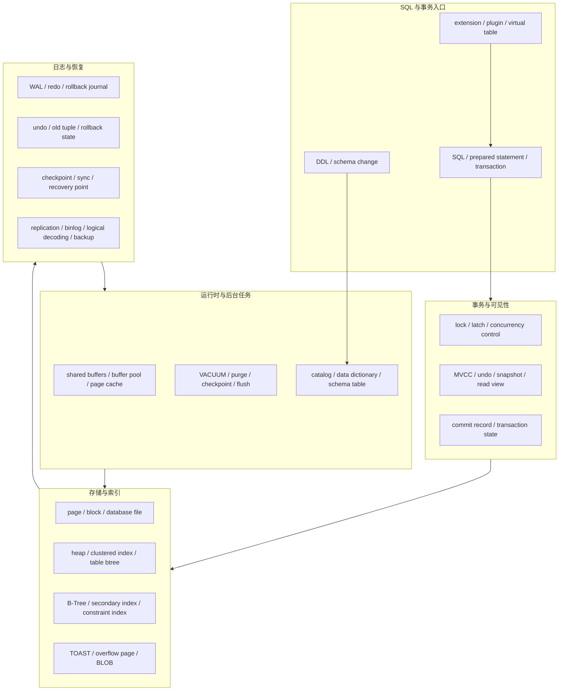

## 今日主题

主主题：`传统 OLTP 与存储基础开篇`

这是 `Topic 2：传统 OLTP 与存储基础` 的开篇文。它接在 Day 009 的现代数据库行业全景收束之后，任务不是立刻深挖 PostgreSQL 源码，而是建立后续 Day 011 到 Day 014 可以复用的比较框架：

1. 为什么传统 OLTP 是后续所有专题的工程基线。
2. PostgreSQL、MySQL/InnoDB、SQLite 分别承担什么对照角色。
3. 后续系统文章必须固定追问哪些 storage-first 模块。
4. page、WAL/redo/undo、MVCC、B+Tree、buffer、checkpoint、VACUUM/purge、二级索引、DDL 和插件生态如何组成传统 OLTP 的核心问题域。
5. Day 011 PostgreSQL 系统文章应该从哪些官方文档、本地源码入口和实验问题开始。

本文是专题开篇，只做框架和学习路线。涉及实现细节的判断，后续单系统文章必须重新回到本地源码、官方文档或设计资料验证。

## 为什么先回到传统 OLTP

Day 001 到 Day 009 已经把现代数据库行业分成传统 OLTP、LSM、分布式 SQL、云原生存算分离、OLAP、搜索/向量和 Lakehouse 几条路线。进入系统深挖前，需要先补一层共同语言：单机关系数据库如何把事务、日志、页面、索引、缓存和后台回收组织成一个可恢复系统。

传统 OLTP 不是“旧数据库专题”。它是后续问题的基准尺：

| 后续专题 | 如果缺少传统 OLTP 基线，会看不清的问题 |
| --- | --- |
| LSM 与嵌入式存储引擎 | 为什么从 page update 转向 WAL + memtable + SST；事务和 SQL 语义为什么常由上层补齐 |
| 分布式 SQL | range/tablet/region、Raft log、全局索引和 timestamp 如何从单机事务、索引和日志拆出来 |
| 云原生存算分离 | log service、page server、object storage 和 metadata service 分别替代了单机里的哪些职责 |
| OLAP 与实时分析 | primary key、upsert、merge、MV refresh 和 small batch 为什么仍然会碰到回收、索引和日志语义 |
| 搜索、向量与生态补丁 | pgvector、PostGIS、TimescaleDB、Citus 这类扩展到底复用了主库哪些事务、WAL、权限和恢复能力 |
| Lakehouse 与表格式 | snapshot、transaction log、manifest 和 metadata pointer 如何像关系数据库一样定义表状态 |

所以 Topic 2 的目标不是背 PostgreSQL、InnoDB、SQLite 的功能列表，而是把“数据库最小闭环”拆出来：写入如何持久化，读取如何判断可见性，崩溃后如何恢复，旧版本如何回收，索引和主数据如何保持一致，元数据变更如何进入事务边界。

## Topic 2 范围

Topic 2 按以下文章推进：

| Day | 文章类型 | 主题 | 目标 |
| --- | --- | --- | --- |
| 010 | 专题开篇 | 传统 OLTP 与存储基础开篇 | 建立统一比较框架和后续源码入口 |
| 011 | 系统文章 | PostgreSQL | 深入 heap、WAL、MVCC、B-Tree、VACUUM、buffer、catalog、extension |
| 012 | 系统文章 | MySQL/InnoDB | 深入 clustered index、redo、undo、buffer pool、binlog、purge、online DDL |
| 013 | 系统文章 | SQLite | 深入 pager、B-tree、rollback journal/WAL、locking、single-file transaction |
| 014 | 专题收束 | 传统 OLTP 与存储基础收束 | 比较三套系统的共同点、分歧、badcase 和后续影响 |

学习顺序仍然是 PostgreSQL、MySQL/InnoDB、SQLite：

- PostgreSQL 用来建立 heap + MVCC + WAL + VACUUM + extension 的关系数据库基线。
- MySQL/InnoDB 用来对照 clustered index + redo/undo + binlog + buffer pool + purge 的工程路线。
- SQLite 用来观察 single-file + pager + B-tree + journal/WAL + locking 的最小数据库闭环。

## 整体架构模型图

下图根据 PostgreSQL、MySQL/InnoDB、SQLite 的官方文档和本地源码入口整理，不是单个系统的官方架构图。它的用途是给 Topic 2 后续系统文章提供统一检查清单。

这张图把几个容易混在一起的概念拆开：写入路径、日志路径、可见性路径、回收路径和元数据路径不是同一条线。后续每篇系统文章都要说明它们在哪里重合，在哪里分离。

## 三套系统的基线角色

### PostgreSQL：heap 与 MVCC 的对照基线

PostgreSQL 值得先学，因为它把很多关系数据库问题暴露得比较清楚：

- 主数据在 heap relation 中，索引和主数据分离。
- MVCC 与 tuple version、事务可见性、snapshot 和 VACUUM 强相关。
- WAL 是崩溃恢复、复制和逻辑解码的重要入口。
- B-Tree、catalog、buffer manager、autovacuum、extension 生态都足够完整，适合作为后续系统的对照基线。

后续 Day 011 要重点验证：

- heap tuple 的可见性信息如何影响读路径和 VACUUM。
- HOT update、visibility map、free space map 和 index cleanup 如何共同影响 bloat。
- WAL record、checkpoint、replication slot、logical decoding 之间如何形成日志保留链条。
- extension 什么时候复用主库事务和恢复体系，什么时候把新 workload 压回主库资源池。

### MySQL/InnoDB：clustered index 与双日志边界

InnoDB 的价值在于提供另一条常见 OLTP 工程路线：

- 表数据按 clustered index 组织，primary key 直接影响物理访问路径。
- secondary index 通常需要通过主键回到 clustered index。
- redo log 支撑崩溃恢复，undo log 支撑回滚和一致性读，binlog 位于 MySQL server 层并服务复制、恢复和 CDC 场景。
- buffer pool、change buffer、doublewrite、purge、flush 和 online DDL 是理解互联网 OLTP badcase 的重要入口。

后续 Day 012 要重点验证：

- clustered index 如何改变主键选择、页分裂、二级索引大小和回表成本。
- redo、undo、binlog 在提交、恢复和复制中的边界。
- purge 线程落后时，历史版本、索引和空间回收如何退化。
- server 层和 InnoDB 层的职责分界如何影响插件、DDL、备份和 CDC。

### SQLite：单文件数据库的最小闭环

SQLite 的价值不是“功能少”，而是它把数据库系统压缩到嵌入式库和单文件格式里，仍然保留了数据库必须面对的核心问题：

- database file 由 page 组成，B-tree 和 pager 共同定义存储访问边界。
- rollback journal 与 WAL 模式分别表达不同的原子提交和并发取舍。
- locking、transaction、schema、backup 都发生在本地文件和进程边界内。
- 没有服务端调度、多租户控制面和复制服务，反而更容易观察数据库最小闭环。

后续 Day 013 要重点验证：

- pager 如何把 page cache、journal/WAL、sync 和 transaction 绑定在一起。
- B-tree 层和 VDBE 执行层如何分工。
- WAL 模式如何改善读写并发，又为什么仍然不是通用多写服务端数据库。
- 单文件格式如何影响 backup、schema change、vacuum 和嵌入式部署边界。

## 共同比较框架

### 1. 存储模型

后续每篇系统文章先回答：

- 数据的最小持久化单位是 page、record、tuple、cell，还是其他结构。
- 主表和主键索引是否绑定。
- 二级索引里保存的是物理位置、tuple id、primary key，还是逻辑 rowid。
- 大字段、溢出页、TOAST、BLOB 如何组织。
- free space、fragmentation、page reuse、vacuum/purge 如何影响长期稳定性。

对照重点：

| 系统 | 存储主线 | 需要警惕的边界 |
| --- | --- | --- |
| PostgreSQL | heap + independent indexes | dead tuple、index bloat、VACUUM、visibility map |
| InnoDB | clustered index + secondary indexes | primary key 选择、回表、页分裂、二级索引放大 |
| SQLite | single file + pager + btree | 文件锁、page cache、journal/WAL、vacuum |

### 2. 写入路径

写入路径不能只写“先写日志再写数据”。需要拆成：

1. SQL 或 API 请求进入事务上下文。
2. 生成主数据、索引、元数据或 undo 状态。
3. 写 WAL、redo、rollback journal 或其他日志结构。
4. 事务提交点决定何时 durable。
5. 后台 checkpoint、flush、sync、vacuum/purge 推进物理状态。

后续系统文章要明确：用户看到的提交成功、数据文件落盘、索引可见、日志可回收、旧版本可清理，分别由谁决定。

### 3. 读取路径

读取路径至少拆三条：

- 点查：主键、rowid、tuple id 或 index lookup 如何定位主数据。
- 范围查：B-Tree traversal、visibility check、回表、buffer/cache miss 如何组合。
- snapshot read：读者看到哪个版本，旧版本在哪里，长读事务会拖住什么。

PostgreSQL 的 heap + index 分离、InnoDB 的 secondary index 回表、SQLite 的 pager + btree 都会给同一个问题不同答案。

### 4. 日志、恢复、CDC

Topic 2 要特别拆清名字相近但职责不同的日志：

| 日志或日志式结构 | 常见职责 | 后续要追问 |
| --- | --- | --- |
| WAL | 崩溃恢复、复制、逻辑解码入口 | 记录物理还是逻辑变化，checkpoint 后如何回收 |
| redo log | 崩溃恢复和 page 重放 | commit 与 flush 的边界，doublewrite 如何参与恢复 |
| undo log / old tuple | 回滚、MVCC、一致性读 | 长事务如何拖住 purge/VACUUM，旧版本如何回收 |
| binlog | server 层复制、恢复、CDC | 与引擎提交如何保持一致，失败时如何恢复 |
| rollback journal | SQLite 原子提交和回滚 | journal 文件如何创建、同步、删除或截断 |

后续看分布式 SQL、云原生日志服务、Lakehouse transaction log 时，也要沿用这套问题，而不是只看日志名称。

### 5. 事务、MVCC 与并发控制

传统 OLTP 的事务问题是后续所有系统的语义来源：

- 快照由事务 ID、read view、page version，还是锁状态决定。
- 可见性判断发生在 heap tuple、undo chain、pager snapshot，还是索引访问阶段。
- 长事务拖住的是 dead tuple、undo history、WAL segment、binlog、snapshot，还是整个文件锁。
- 失败事务回滚需要撤销哪些主数据、索引和元数据状态。

后续系统文章要把 lock、latch、MVCC、undo、snapshot、checkpoint 拆开，不把它们混写成“并发控制”。

### 6. 元数据与 DDL

传统 OLTP 的 catalog / data dictionary / schema table 是理解后续 metadata service 的入口。需要问：

- table、index、constraint、type、function、extension、trigger 元数据存在哪里。
- DDL 是否事务化，失败后如何回滚。
- 元数据缓存如何失效，schema change 如何影响正在运行的事务。
- online DDL、CREATE INDEX、ALTER TABLE 这类操作如何和前台读写共享资源。

分布式系统的 PD、master、catalog service，本质上会把这些问题放大到多节点路由、调度和恢复路径里。

### 7. 二级索引与约束维护

二级索引是 Topic 2 必须打牢的重点，因为它会直接迁移到分布式全局索引、OLAP 物化视图、搜索索引和 Lakehouse manifest 的一致性问题。

后续要固定问：

- 二级索引条目如何指向主数据。
- 更新索引列时，是原地更新、delete + insert，还是延迟清理。
- 唯一约束在并发事务下如何检查。
- 在线建索引、回填、失败重试和回滚如何处理。
- 索引垃圾如何清理，清理是否依赖后台任务。

### 8. 缓存、后台任务与资源隔离

传统 OLTP 的长期稳定性很大程度由后台任务决定：

| 模块 | PostgreSQL | InnoDB | SQLite |
| --- | --- | --- | --- |
| 缓存 | shared buffers + OS cache | buffer pool | page cache + OS cache |
| 写回 | checkpoint、background writer | flush、checkpoint | pager sync、checkpoint |
| 旧版本回收 | VACUUM / autovacuum | purge | VACUUM / checkpoint / journal cleanup |
| 索引维护 | B-Tree cleanup、reindex、CREATE INDEX | secondary index maintenance、online DDL | btree page balance、vacuum |
| 资源边界 | 后台任务与前台 query 竞争 | buffer pool、redo、purge、flush 竞争 | 嵌入式进程内资源和文件锁边界 |

后续所有系统文章都要把后台任务写成主路径的一部分，而不是运维附录。

### 9. 插件、生态补丁与变相方案

Topic 2 还要建立插件边界判断：

| 层次 | 判断问题 |
| --- | --- |
| 原生能力 | 是否进入事务、恢复、优化器、权限、备份、监控和限流体系 |
| 官方或主流扩展 | 补的是功能、性能、数据类型、索引类型，还是接入生态 |
| 外围系统组合 | 数据同步、schema 演进、权限、失败恢复和重放由谁保证 |
| 变通方案 | 数据量、并发、更新频率、查询形态放大后是否仍然可解释 |

PostgreSQL extension 生态会是 Day 011 的重点之一；MySQL 的 storage engine / plugin 边界和 SQLite 的 virtual table / extension 机制则作为后续对照。

## badcase 与架构边界

| badcase | PostgreSQL 观察点 | InnoDB 观察点 | SQLite 观察点 | 后续专题映射 |
| --- | --- | --- | --- | --- |
| 长事务拖住回收 | VACUUM 无法回收 dead tuple，WAL 或 replication slot 保留变长 | undo history 和 purge lag 增长 | reader snapshot 与 WAL checkpoint 受限 | TiDB GC safepoint、Lakehouse snapshot retention、搜索 segment reader |
| 二级索引膨胀 | heap/index 分离导致 dead index entries 和 bloat | secondary index 回表和主键大小放大 | index btree 页面碎片 | 分布式全局索引、OLAP MV、搜索/向量派生索引 |
| checkpoint 抖动 | dirty buffers、WAL replay、checkpoint tuning | redo checkpoint、flush、doublewrite | pager sync、WAL checkpoint | 云原生日志服务 replay、OLAP merge、Lakehouse checkpoint |
| 元数据锁和 DDL | catalog、CREATE INDEX、ALTER TABLE 与事务并发 | metadata lock、online DDL、data dictionary | schema table、file-level constraints | PD/catalog service、multi-engine table schema |
| 日志保留过长 | WAL archive、replication slot、logical decoding | redo/undo/binlog 保留链条 | rollback journal/WAL 文件增长 | CDC lag、backup、branch、time travel |
| 插件压垮主库 | extension 索引、类型、后台 worker 争用主库资源 | plugin / storage engine 边界 | extension / virtual table 运行在进程内 | pgvector、PostGIS、外部索引、应用侧 pipeline |

这些 badcase 的共同点是：它们不是某个 SQL 写错了，而是长期状态无法被及时推进、回收或解释。

## Day 011 到 Day 013 的源码入口

本地源码已确认存在，当前只作为入口清单；后续系统文章必须重新记录分支、提交、关键文件和具体函数或结构。

| 系统 | 本地源码 | 当前确认 | 后续优先入口 |
| --- | --- | --- | --- |
| PostgreSQL | `D:\program\postgres` | `master 7424aac` | `src/backend/access/heap/heapam.c`、`src/backend/access/transam/xlog.c`、`src/backend/storage/buffer/bufmgr.c`、`src/backend/access/nbtree`、`src/backend/access/heap/vacuumlazy.c`、`src/backend/catalog` |
| MySQL/InnoDB | `D:\program\mysql-server` | `trunk 447eb26e` | `storage/innobase/btr`、`storage/innobase/buf`、`storage/innobase/log`、`storage/innobase/trx`、`storage/innobase/row`、`storage/innobase/dict` |
| SQLite | `D:\program\sqlite` | `master 97901bb` | `src/btree.c`、`src/pager.c`、`src/wal.c`、`src/vdbe.c`、`src/build.c`、`src/backup.c` |

Day 011 PostgreSQL 建议先从官方文档和源码同时进入：

- 官方文档：physical storage、WAL、MVCC、routine vacuuming、B-Tree indexes、logical decoding、extensions。
- 源码入口：heap access、WAL/xlog、buffer manager、nbtree、lazy vacuum、catalog。
- 实验问题：长事务如何影响 VACUUM；HOT update 何时成立；replication slot 如何影响 WAL 保留；extension 索引如何进入 planner、WAL 和 recovery 边界。

## 我的问题

1. PostgreSQL 的 heap + index 分离到底把多少复杂性转移给 VACUUM、visibility map、index cleanup 和 autovacuum tuning？
2. InnoDB clustered index 看起来更贴近主键点查，但主键选择、页分裂、二级索引大小和 redo/undo 压力如何互相影响？
3. SQLite 的 pager 是否可以作为理解“最小事务系统”的最好入口？它缺少服务端调度后，哪些问题反而更清楚？
4. WAL、redo、undo、binlog、rollback journal 这些日志结构能否按“恢复、回滚、复制、CDC、原子提交”建立一张职责表？
5. 二级索引是否可以作为比较传统 OLTP、分布式 SQL、搜索索引、物化视图和 Lakehouse manifest 的统一切入点？
6. 传统 OLTP 的 DDL 和 online index build 是否应该被视作元数据事务，而不是单纯的 schema 管理功能？
7. 插件能力在什么条件下算数据库的核心优势，什么条件下只是把异构 workload 放进主库资源池？
8. 后续系统文章是否需要固定保留“长事务/长 reader 拖住回收”的小节，用来横向比较所有系统？

## 工程启发

第一，传统 OLTP 的核心不是 SQL，而是状态推进。

写入、可见、持久化、复制、checkpoint、回收和索引清理是不同阶段。一个系统长期稳定，靠的不是单次提交成功，而是这些阶段能持续推进。

第二，page 和日志的边界决定恢复模型。

PostgreSQL 的 WAL、InnoDB 的 redo/undo、SQLite 的 rollback journal/WAL 看起来都在解决原子性和持久性，但它们服务的 page 模型、版本模型和并发模型不同。后续读云原生 page server、Raft log、Lakehouse transaction log 时，也必须先问它保护的状态是什么。

第三，二级索引是派生状态一致性的最小样本。

只要主数据和查询入口分离，就会出现派生状态一致性问题。传统 OLTP 的二级索引是最小样本；分布式全局索引、搜索索引、向量索引、OLAP 物化视图和 Lakehouse manifest 都是在不同规模上重复这个问题。

第四，后台任务必须进入架构图。

VACUUM、purge、checkpoint、flush、online index build、journal cleanup 一旦落后，系统会表现为空间膨胀、日志保留、恢复变慢、尾延迟变高或写入停顿。它们不是维护细节，而是架构的一部分。

第五，插件生态要从恢复和资源池判断。

一个扩展能否长期使用，不只看 API 是否可用，还要看它是否进入事务、WAL、优化器、备份恢复、权限、监控和限流体系。否则它可能只是把新 workload 放进主库，成本和失败恢复仍由用户承担。

## 下一步

Day 011 建议进入：`PostgreSQL OLTP 存储系统文章`

建议重点：

- 从 heap tuple、page layout、WAL、MVCC、VACUUM、B-Tree、shared buffers、catalog 和 extension 边界展开。
- 同时读取官方文档和 `D:\program\postgres` 本地源码入口，不把文档级描述直接写成源码级结论。
- 优先验证写入路径、读取路径、VACUUM 回收路径和 WAL 保留路径。
- 把 pgvector/PostGIS/TimescaleDB/Citus 作为 extension 边界问题，不在 PostgreSQL 主文里展开成完整插件专题。

## 参考来源与引用

### 官方文档

- [PostgreSQL Documentation: Database Physical Storage](https://www.postgresql.org/docs/current/storage.html)
- [PostgreSQL Documentation: Write-Ahead Logging](https://www.postgresql.org/docs/current/wal-intro.html)
- [PostgreSQL Documentation: Multiversion Concurrency Control](https://www.postgresql.org/docs/current/mvcc.html)
- [PostgreSQL Documentation: Routine Vacuuming](https://www.postgresql.org/docs/current/routine-vacuuming.html)
- [PostgreSQL Documentation: Extensions](https://www.postgresql.org/docs/current/extend-extensions.html)
- [MySQL 8.4 Reference Manual: InnoDB Architecture](https://dev.mysql.com/doc/refman/8.4/en/innodb-architecture.html)
- [MySQL 8.4 Reference Manual: InnoDB Indexes](https://dev.mysql.com/doc/refman/8.4/en/innodb-indexes.html)
- [MySQL 8.4 Reference Manual: The InnoDB Redo Log](https://dev.mysql.com/doc/refman/8.4/en/innodb-redo-log.html)
- [MySQL 8.4 Reference Manual: Undo Logs](https://dev.mysql.com/doc/refman/8.4/en/innodb-undo-logs.html)
- [SQLite Documentation: Database File Format](https://www.sqlite.org/fileformat.html)
- [SQLite Documentation: Atomic Commit In SQLite](https://www.sqlite.org/atomiccommit.html)
- [SQLite Documentation: Write-Ahead Logging](https://www.sqlite.org/wal.html)
- [SQLite Documentation: File Locking And Concurrency](https://www.sqlite.org/lockingv3.html)

### 本地源码

- `D:\program\postgres`：`master 7424aac`
- `D:\program\mysql-server`：`trunk 447eb26e`
- `D:\program\sqlite`：`master 97901bb`

### 本系列上下文

- `content/posts/learning-database-industry-day002-2026-04-30-traditional-oltp-foundations-preview.md`
- `content/posts/learning-database-industry-day009-2026-06-03-modern-database-overview-wrapup.md`
- `content/posts/learning-database-industry-day000-index.md`
