## 今日主题

主主题：`PostgreSQL OLTP 存储系统文章`

这是 `Topic 2：传统 OLTP 与存储基础` 的第一篇系统文章。Day 010 建立了传统 OLTP 的比较框架；今天进入 PostgreSQL。本文不再把 PostgreSQL 写成功能目录，也不把源码函数名堆成清单，而是围绕几条真实状态路径展开：

1. PostgreSQL 的专有名词先说清楚：relation、fork、page、tuple、TID、xmin/xmax、snapshot、WAL、LSN、VM、FSM、HOT、VACUUM、catalog、extension。
2. heap/page/MVCC 如何共同决定“这行是否存在、是否可见、能否回收”。
3. 一次 INSERT 从 SQL executor 到 heap page、WAL、index tuple、commit record、checkpoint，会让哪些状态发生变化。
4. 一次 UPDATE 为什么通常不是原地覆盖，HOT update 为什么能减少索引写放大，又为什么把复杂性留给 page pruning 和 VACUUM。
5. B-Tree 为什么不是最终真相：它定位 heap TID，但 unique check、index scan、index-only scan 都要和 heap 可见性配合。
6. VACUUM 为什么不是维护命令，而是 PostgreSQL 长期稳定运行的后台主路径。
7. replication slot、logical decoding、extension 生态如何复用主库能力，也如何把新 workload 压回主库资源池。

本文基于 PostgreSQL 18 官方文档和本地源码入口整理。本地源码路径为 `D:\program\postgres`，当前确认分支 `master`，提交 `7424aac`，工作区干净。官方文档和本地 `master` 并不等同于同一个稳定发布版本；涉及实现细节时，本文只把源码读到的函数和文件作为锚点，不把文档级描述直接写成版本精确结论。

## PostgreSQL 专有名词速查

这部分先把后文会反复出现的 PostgreSQL 术语压平。很多理解障碍不是因为机制难，而是同一个概念在 SQL 层、存储层、事务层、日志层有不同名字。

| 名词 | 可以先这样理解 | 为什么重要 |
| --- | --- | --- |
| `relation` | PostgreSQL 内部对表、索引、TOAST 表等关系对象的统称 | 源码和 catalog 很少只说 table，很多路径围绕 relation 展开 |
| `relfilenode` / relation file | relation 在磁盘上的物理文件身份或文件集合 | DDL、rewrite、VACUUM FULL、checkpoint、恢复都会触及物理文件身份 |
| fork | 一个 relation 的不同物理分叉，例如 main、fsm、vm、init | 主数据、free space、visibility 摘要不是放在同一个文件里 |
| page / block | PostgreSQL 存储和缓冲的基本单位，默认 8KB | heap、B-Tree、FSM、VM、WAL replay、buffer manager 都围绕 page/block 运行 |
| line pointer / item identifier | page 内指向 tuple 的槽位 | TID 稳定性、HOT redirect、LP_DEAD、LP_UNUSED 都围绕 line pointer |
| heap | PostgreSQL 默认表访问方法，表数据以 heap tuple 存放 | 主数据在 heap，索引通常只是指向 heap TID |
| heap tuple | heap page 里的行版本，不等同于业务意义上的“当前行” | MVCC 下 UPDATE 会产生新 tuple version |
| tuple header | tuple 头部，包含 `xmin`、`xmax`、`ctid`、infomask 等 | 可见性判断、锁、HOT、VACUUM 都要读这些字段 |
| TID / `ctid` | tuple identifier，通常是 `(block number, offset number)` | B-Tree index tuple 指向 heap 的常见方式 |
| `xmin` | 创建该 tuple version 的 transaction ID | 当前 snapshot 能否看见该版本，要看 `xmin` 是否已提交并对快照可见 |
| `xmax` | 删除、更新或锁住该 tuple version 的 transaction ID 或 MultiXact | 判断旧版本是否仍可见、是否被删除、是否被并发事务影响 |
| `ctid` | tuple header 中指向自身或后继版本的 TID | UPDATE 后旧 tuple 的 `ctid` 常指向新版本，HOT chain 依赖它 |
| XID | transaction ID | MVCC、VACUUM horizon、wraparound、`pg_xact` 都围绕 XID |
| `pg_xact` / CLOG | 事务提交状态存储，老名字常叫 CLOG | tuple 只记录 XID，XID 是提交还是回滚要查事务状态 |
| snapshot | 一次读看到的事务可见性边界 | 长 snapshot 会拖住 VACUUM 和 old version 回收 |
| WAL | write-ahead log，先写日志再允许数据页异步落盘 | 崩溃恢复、物理复制、logical decoding、backup 都依赖 WAL |
| LSN | WAL 位置，log sequence number | page LSN、commit LSN、flush LSN、restart LSN 都用它描述推进位置 |
| checkpoint | 建立一个恢复起点，把 dirty page 和 WAL replay 边界推进 | checkpoint 太慢影响恢复时间，太集中可能造成 I/O 抖动 |
| full-page image | checkpoint 后 page 第一次被修改时可能记录完整 page image | 防止 torn page，是 WAL 放大的重要来源之一 |
| visibility map / VM | relation 的可见性摘要，记录 page 是否 all-visible / all-frozen | index-only scan、VACUUM 跳页、freeze 优化都依赖 VM |
| free space map / FSM | relation 的空闲空间摘要 | INSERT 找可用 page、VACUUM 暴露可复用空间会用到 FSM |
| HOT | heap-only tuple update | 更新不触及索引列且新版本留在同页时，可减少索引更新 |
| pruning | page 内清理不可见版本、整理 HOT chain 的局部动作 | 发生在访问 page 或 VACUUM 时，是比 VACUUM 更局部的回收推进 |
| VACUUM | 清理 dead tuple、维护 VM/FSM、freeze XID、清理索引的后台路径 | PostgreSQL 长期稳定的核心机制，不是可选维护动作 |
| freeze | 把足够老的 XID 处理成不再需要普通 XID 比较的状态 | 防止 transaction ID wraparound，也降低未来可见性判断成本 |
| B-Tree / nbtree | PostgreSQL 默认最常用索引访问方法 | 定位候选 heap TID，但可见性仍然要回 heap 判断 |
| index AM / table AM | index/table access method 抽象 | PostgreSQL 扩展表存储和索引类型的重要内核接口 |
| operator class / operator family | 索引如何比较某种数据类型的一组规则 | B-Tree、GiST、GIN、pgvector 等能力不是只有数据结构，还要有比较语义 |
| TOAST | 大字段外置存储机制 | 宽行、大对象、WAL、logical decoding、VACUUM 都会受它影响 |
| catalog | 系统元数据表，例如 `pg_class`、`pg_attribute`、`pg_index` | PostgreSQL 的元数据也走事务、WAL、缓存失效和依赖管理 |
| relcache / syscache | relation 和 catalog 元数据缓存 | DDL、extension、cache invalidation 会影响运行中会话 |
| replication slot | 为复制或 decoding 消费者保留 WAL 和 catalog horizon 的状态对象 | 慢 consumer 会拖住 WAL 回收和 catalog tuple 清理 |
| logical decoding | 从 WAL 中提取逻辑变更流 | CDC、审计、迁移很依赖它，但大事务和 slot lag 会放大成本 |
| extension | 通过 SQL、C、catalog、access method、background worker 等方式扩展内核 | 优势是进入数据库边界，风险是共享主库资源池 |

我会在后文尽量把函数名放在“证据锚点”位置，而不是让函数名代替机制说明。

## 1. 系统目标与历史动机

PostgreSQL 的核心目标可以概括为：在一个可扩展关系数据库内核里，把 SQL、事务、MVCC、WAL、索引、catalog、类型系统、函数、扩展机制和复制放进同一个恢复与权限边界。

从 storage-first 视角看，它最值得作为传统 OLTP 第一篇系统文章，是因为 PostgreSQL 把关系数据库最基础的矛盾暴露得很清楚：

- 主数据放在 heap，二级索引指向 heap。
- tuple version 由 `xmin`、`xmax`、`ctid`、snapshot 和事务状态共同解释。
- UPDATE 通常生成新版本，不是简单原地覆盖。
- 索引能帮你找到候选位置，但是否可见要回 heap。
- WAL 保护 page 修改和事务提交，数据页可以稍后落盘。
- VACUUM 把旧版本、index entry、line pointer、VM、FSM 和 XID horizon 一起往前推。
- extension 能进入类型、函数、索引、planner、catalog、WAL 或 background worker 边界，但也共享主库的 CPU、内存、WAL、I/O、autovacuum 和连接资源。

这条路线的优点是清晰、通用、生态强；代价是长期运行后的“状态推进”很复杂。PostgreSQL 的许多线上问题，本质上不是某条 SQL 慢，而是某条后台推进链停住了：VACUUM 停住、WAL 回收停住、slot 停住、checkpoint 停住、index cleanup 停住、catalog cleanup 停住。

## 2. 目标 workload 与用户需求

PostgreSQL 面向通用关系 OLTP，也常被用作混合业务数据库和扩展平台。

| 需求 | PostgreSQL 的对应能力 | storage-first 观察点 |
| --- | --- | --- |
| 事务读写 | MVCC、row lock、snapshot、WAL commit | tuple header 和事务状态共同决定可见性 |
| 点查和范围查 | B-Tree、heap TID、index scan、bitmap scan | 索引定位之后通常还要回 heap |
| 高更新业务表 | HOT、VACUUM、FSM、VM、autovacuum | bloat、index cleanup、freeze 和 fillfactor 影响长期稳定 |
| 崩溃恢复 | WAL、page LSN、checkpoint、redo | commit 成功和 page 落盘不是同一个事件 |
| 复制和 CDC | physical replication、logical decoding、replication slot | 消费者落后会拖住 WAL 和 catalog horizon |
| 元数据和 DDL | catalog、relcache、syscache、dependency | DDL 是事务化元数据变更，不只是 schema 文本更新 |
| 扩展生态 | extension、index AM、FDW、background worker、自定义类型 | 进入主库边界，也共享主库资源池 |

这里最容易误判的是 extension 和混合 workload。PostgreSQL 能做很多事，不代表所有事都适合放进同一个主库。搜索、向量、时序、地理空间、队列、分析查询、CDC、在线索引构建，都会把成本投到 shared buffers、WAL、VACUUM、planner、catalog 或连接池上。

## 3. 整体架构模型图

下图根据 PostgreSQL 18 官方文档和 `D:\program\postgres` 本地源码入口整理，不是官方架构图。它表达的是 PostgreSQL OLTP 内核里几类 durable state 和 derived state 的关系。

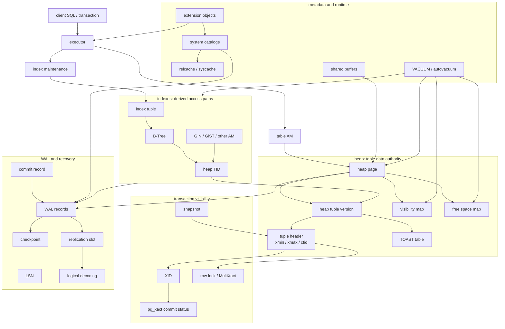

这张图有三个关键判断：

第一，heap 是主数据 authority，索引是 derived access path。B-Tree 不决定一行是否“存在”，它只是提供候选 heap TID。

第二，MVCC 状态分散在 tuple header、snapshot、`pg_xact` 和锁状态里。理解 PostgreSQL 读路径，不能只看索引结构。

第三，VACUUM、checkpoint、logical decoding、extension、catalog cache 不是旁路细节。它们会直接决定写入尾延迟、读取稳定性、磁盘增长和 DDL 行为。

## 4. 存储模型

PostgreSQL 默认表存储是 heap。一个普通表不是单一抽象对象，而是一组 relation 文件和 fork。

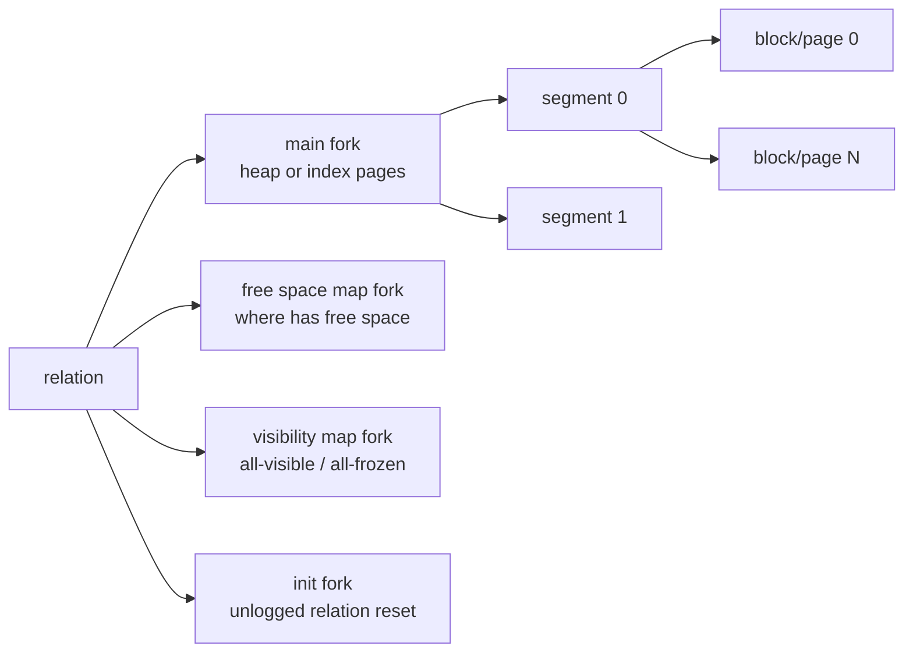

普通表的 main fork 里是 heap page。FSM 和 VM 是两个容易被忽略但很重要的辅助状态：

- FSM 不是主数据，它帮助 INSERT 找到可能有空闲空间的 page。
- VM 不是权限或事务表，它是 page 级可见性摘要，影响 index-only scan 和 VACUUM 跳页。
- main fork、FSM、VM 的推进节奏不同。数据可见、空间可复用、页面全可见，不是同一件事。

### Page 和 tuple

一个 heap page 可以粗略理解为：

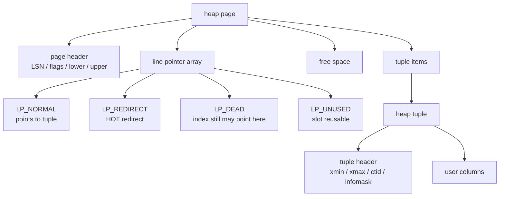

这里最重要的不是 8KB 这个数字，而是 line pointer 和 tuple 分离。索引通常保存的是 heap TID，TID 指向 block number + offset number。offset number 对应的是 page 内 line pointer，而不是直接指向某段业务数据。

这就是为什么 VACUUM 不能随便把 line pointer 复用：只要某个 index tuple 还可能指向这个 TID，line pointer 就必须保持可解释。否则一次 index scan 可能把旧索引条目解释成新行。

### Tuple header

PostgreSQL 的一行不是只有用户列。heap tuple header 至少要承载 MVCC 所需的信息：

| 字段或状态 | 作用 | 典型问题 |
| --- | --- | --- |
| `xmin` | 创建该版本的 XID | 创建者是否提交、是否对当前 snapshot 可见 |
| `xmax` | 删除、更新或锁定该版本的 XID/MultiXact | 旧版本是否被删除，是否仍对某些 snapshot 可见 |
| `ctid` | 当前 tuple 或后继版本的 TID | UPDATE 后用于追踪 version chain，HOT 尤其依赖它 |
| infomask | 缓存可见性、锁、HOT 等状态位 | hint bit 能减少重复查事务状态，但会带来 page dirty |
| null bitmap / data offset | 描述 tuple 数据布局 | 宽行、NULL、多列变更会影响存储和 TOAST |

源码锚点只保留在这里作为证据：

- `src/backend/access/heap/heapam.c` 中 `heap_insert()` 和 `heap_prepare_insert()` 会设置 tuple header、选择 page、清 VM、写 heap WAL record。
- `src/backend/access/heap/heapam.c` 中 `heap_update()` 会设置旧 tuple 的 `xmax`，写入新 tuple，并把旧 tuple 的 `ctid` 指向新版本。
- `src/backend/access/heap/heapam_indexscan.c` 中 `heap_hot_search_buffer()` 展示了 index TID 进入 heap 后如何沿 HOT chain 找可见版本。

这比单纯背函数名更重要：PostgreSQL 的主数据状态不是“表里有一行”，而是“一组 tuple version + line pointer + transaction state + visibility summary”。

## 5. 写入路径

一次 INSERT 不是一条直线，而是多个状态边界依次推进。下面是简化路径：

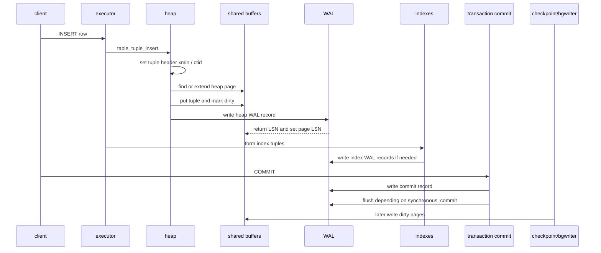

这里要分清几个时间点：

| 事件 | 谁推进 | 含义 |
| --- | --- | --- |
| tuple 放入 heap page | heap + buffer manager | page 已在内存中改变，但不等于数据文件已落盘 |
| heap WAL record 写入 WAL buffer | WAL insert path | 恢复信息进入 WAL 结构，但不等于已 fsync |
| page LSN 设置 | heap/index AM | 数据页知道自己被哪个 WAL 位置保护 |
| index tuple 插入 | executor + index AM | 派生访问路径更新，但唯一性还要结合 heap 可见性 |
| commit record 写入 | transaction manager | 事务提交状态进入 WAL |
| WAL flush | WAL manager | 持久性边界推进，受 `synchronous_commit` 等影响 |
| dirty page 写回 | background writer/checkpointer/eviction | 数据文件落盘，通常晚于 commit |

这解释了 PostgreSQL 的 write-ahead 含义：不是“每次写入都立即写数据页”，而是“数据页落盘前，能恢复它的 WAL 必须先持久化”。所以 commit 成功、WAL flush、heap page 落盘、checkpoint 完成，是不同阶段。

### UPDATE 路径

UPDATE 更能体现 PostgreSQL 的设计。它通常不是覆盖旧 tuple，而是把旧版本标记为被更新，再写入新版本。

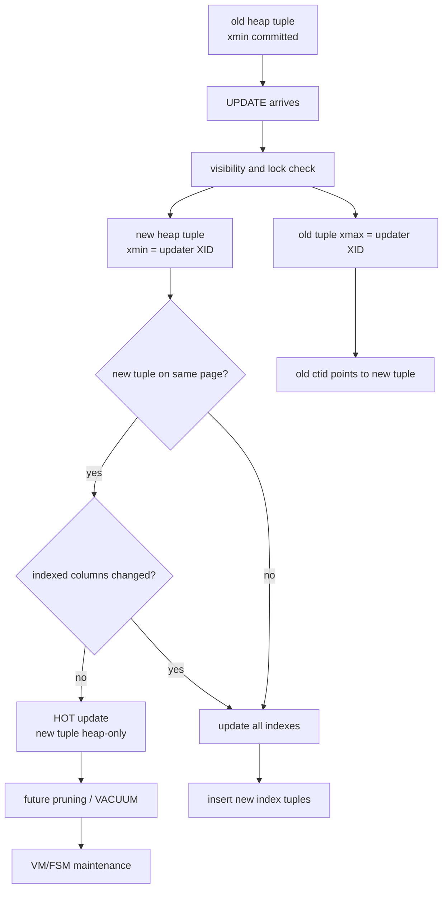

HOT update 是 PostgreSQL 的核心优化之一。它减少索引写放大，但条件并不宽松：

- 新 tuple 要能留在同一个 heap page。
- 更新不能改变会阻塞 HOT 的索引列。
- 旧 tuple 和新 tuple 通过 `ctid` 和 line pointer 形成 page 内链条。
- 后续读取需要沿 HOT chain 找可见版本。
- page pruning 和 VACUUM 要负责把不再需要的链条清理掉。

所以 HOT 不是“免费更新”。它把索引维护成本换成 page 内版本链和后台回收复杂性。对于频繁更新 indexed column、fillfactor 太高、行太宽或 page 空间不足的表，HOT 命中率会下降，UPDATE 就更容易变成 heap 写入 + 全部相关索引写入。

源码锚点：

- `heap_update()` 中会计算被修改列是否和 HOT-blocking indexes 重叠，再决定 `use_hot_update`。
- `ExecInsertIndexTuples()` 在 UPDATE 后根据 `TU_All`、`TU_None`、`TU_Summarizing` 决定索引维护范围。
- `log_heap_update()` 把 heap update 的恢复信息写入 WAL。

这些函数名不是重点，重点是它们共同证明：PostgreSQL UPDATE 的成本由 heap page 空间、索引列变化、WAL、visibility map、后续 VACUUM 一起决定。

## 6. 读取路径

PostgreSQL 的读取路径有一个基本原则：索引负责缩小候选集，heap 负责最终可见性。

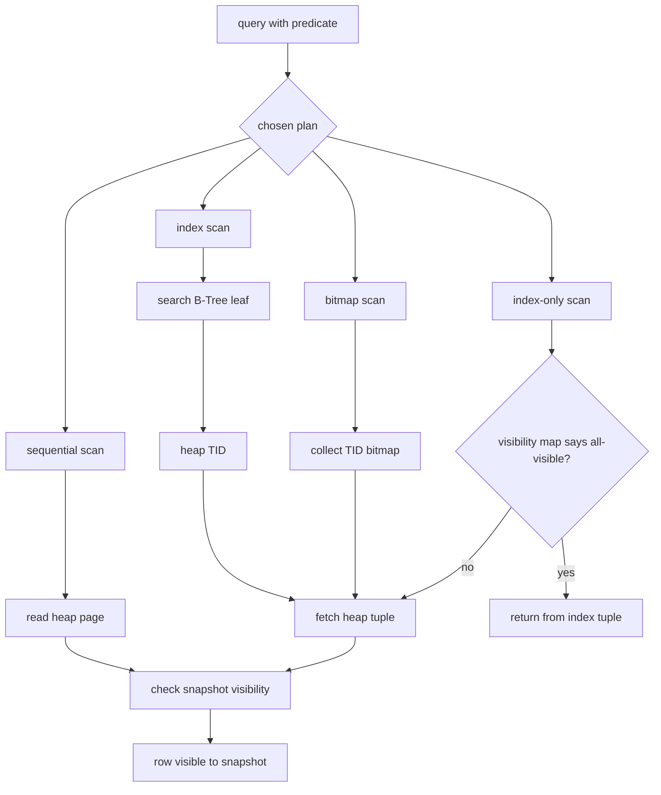

这张图解释了几个常见现象：

第一，B-Tree 命中不等于行可见。索引 tuple 指向 heap TID，但 heap tuple 可能是未提交、已删除、已更新、对当前 snapshot 不可见，或者是 HOT chain 的起点。

第二，index-only scan 不是“索引里有列就一定不回表”。它还依赖 visibility map。只有 VM 能证明 page 上 tuple 对所有事务可见时，才能跳过 heap 可见性检查。

第三，bitmap scan 不是单纯慢版 index scan。它把多个索引条件或大量 TID 聚合后，再按 heap page 访问，可以减少随机 I/O，但仍要在 heap 层做可见性判断。

第四，hint bit、VM、VACUUM 都会影响读性能。一个查询计划看起来相同，底层可见性检查成本可能因为 VM 覆盖率、dead tuple 数量、HOT chain 长度、buffer 命中率而完全不同。

源码锚点：

- B-Tree 查找入口在 `src/backend/access/nbtree/nbtsearch.c` 的 `_bt_search()`。
- index scan 返回 tuple 的入口可从 `src/backend/access/nbtree/nbtree.c` 的 `btgettuple()` 理解。
- heap 可见性和 HOT chain 查找可从 `heap_hot_search_buffer()` 理解。

## 7. 日志、恢复、CDC

WAL 是 PostgreSQL 的恢复主线，但 WAL 不是只服务崩溃恢复。它同时影响物理复制、备份、logical decoding、slot lag 和磁盘增长。

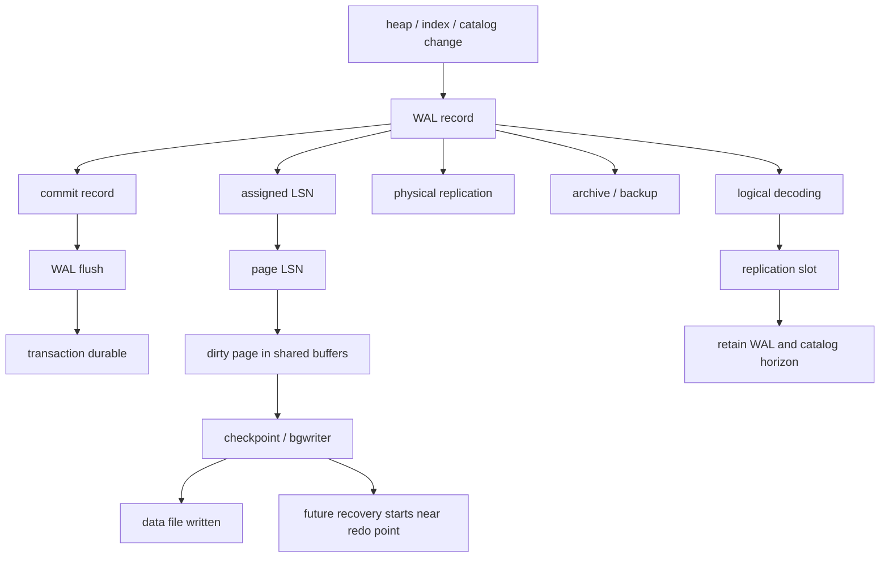

几个边界必须拆开：

- WAL record 写入：生成恢复材料。
- WAL flush：把 WAL 持久化到磁盘，提交持久性依赖它。
- page writeback：把 dirty data page 写回数据文件，通常晚于提交。
- checkpoint：建立恢复起点，降低崩溃后需要 replay 的 WAL 范围。
- logical decoding：从 WAL 中抽取表级逻辑变更。
- replication slot：为消费者保留 WAL 和 catalog horizon。

PostgreSQL 的 commit 路径里，`RecordTransactionCommit()` 会写 commit WAL record，并根据同步提交、是否有 WAL 记录、是否有 pending deletes 等条件决定是否立即 `XLogFlush()`。这说明 commit 不是一个单纯“标记内存变量”的动作，它要和 WAL durable boundary 对齐。

### WAL 保留链

replication slot 的风险可以用一张保留链表示：

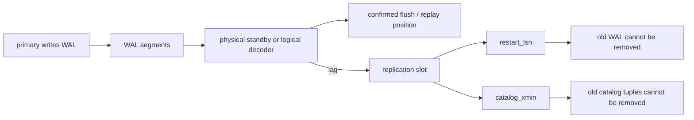

这个 badcase 的本质是 reader/consumer 落后。慢 standby、停掉的 logical consumer、大事务 decoding、网络问题、应用消费慢，都可能让 slot 保留旧 WAL。对于 logical decoding，`catalog_xmin` 还会拖住 catalog tuple 清理。它和长事务拖住 VACUUM 是同一类问题：系统必须保留历史，因为还有某个观察者声称自己可能需要它。

源码锚点：

- `src/backend/access/transam/xloginsert.c`：WAL record 构造入口。
- `src/backend/access/transam/xlog.c`：WAL flush、checkpoint、recovery 相关路径。
- `src/backend/access/transam/xact.c`：commit record 与事务提交边界。
- `src/include/replication/slot.h`：`ReplicationSlotPersistentData` 中的 `restart_lsn`、`catalog_xmin`、`confirmed_flush` 等状态。
- `src/backend/replication/logical`：logical decoding、reorder buffer 和 slot 推进路径。

## 8. 事务、MVCC、batch、并发控制

PostgreSQL MVCC 的重点不是“读不阻塞写”这句口号，而是 tuple version、XID、snapshot、commit status 和 VACUUM horizon 如何配合。

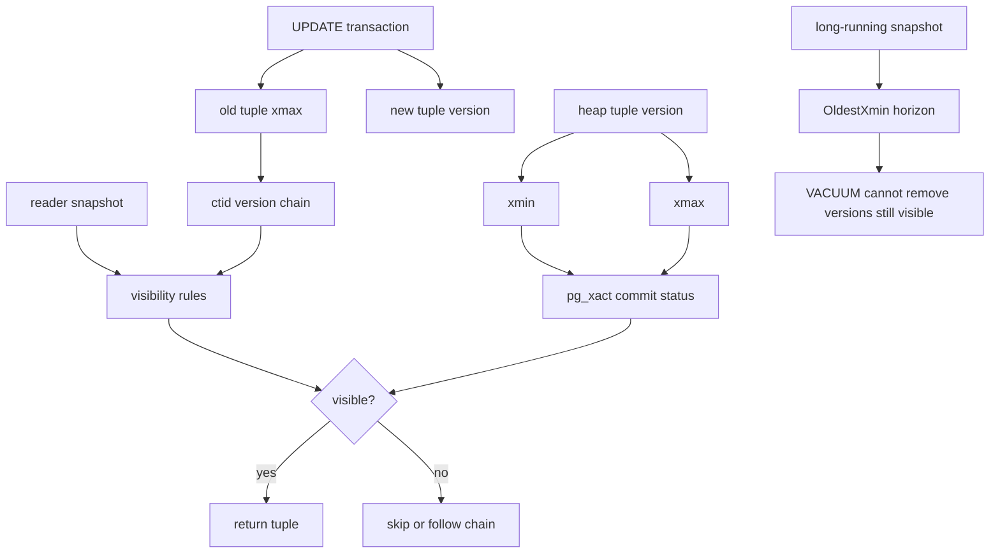

可以把 PostgreSQL 可见性理解为三个问题：

1. 创建这个 tuple version 的事务是否提交，并且对我这个 snapshot 是否可见？
2. 删除或更新这个 tuple version 的事务是否提交，并且对我这个 snapshot 是否可见？
3. 如果这个版本不可见，但它是 HOT chain 或 update chain 的一部分，我是否应该继续找后继版本？

`pg_xact` 或 CLOG 的存在说明：tuple header 只记录 XID，不直接永久保存完整事务状态。系统需要查事务提交状态，并可能通过 hint bit 把结果缓存回 tuple page。hint bit 可以减少未来查询成本，但也可能让一个读操作把 page 标 dirty，这就是 PostgreSQL 读路径和写放大之间一个很细的边界。

并发控制也不能混成一个词：

| 机制 | 解决的问题 | 和 storage-first 的关系 |
| --- | --- | --- |
| row lock / tuple lock | 并发 UPDATE/DELETE 同一行 | 影响 `xmax`、MultiXact、等待和死锁 |
| buffer content lock | 保护 page 内结构并发修改 | heap insert/update、B-Tree split、pruning 都要用 |
| lwlock / lightweight lock | 保护共享内存结构 | WAL insert、buffer mapping、ProcArray 等路径会遇到 |
| predicate lock / SSI | Serializable 隔离级别下的读写冲突检测 | 不是 tuple version 本身，但会影响并发事务是否可提交 |
| snapshot | 确定读视图 | 长 snapshot 会拖住 VACUUM horizon |

batch 方面，PostgreSQL 支持批量插入、COPY、multi-insert 等优化，但 storage-first 视角下仍然要看 WAL、index maintenance、buffer dirty、checkpoint 和 autovacuum 后续压力。批量写入如果集中修改大量 index pages，会把成本转移到 WAL 体积、checkpoint I/O 和后续 VACUUM 上。

## 9. 复制与分布式一致性

PostgreSQL 单机内核不是 shared-nothing 分布式 SQL 系统。它的复制主线围绕 WAL：

- 物理复制：standby 接收并重放 WAL，状态接近 primary 的物理 page 变化。
- logical replication：publisher 通过 logical decoding 输出逻辑变更，subscriber 应用变更。
- replication slot：保留消费者需要的 WAL 和 catalog horizon。
- synchronous replication：可以让提交等待 standby 确认，但它仍然不是多主共识数据库。

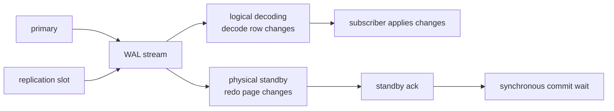

PostgreSQL 复制的 durable authority 仍然在 primary 的 WAL 和数据页状态上。standby、decoder、subscriber 都是围绕 WAL 位置推进。它对后续分布式系统学习的启发是：复制不是“多一份数据”这么简单，而是要追问：

- 哪个节点或组件决定提交成功？
- 消费者落后时，谁保留历史？
- 历史保留在哪里，是 WAL、old tuple、undo、snapshot、object file，还是 transaction log？
- 落后的消费者是否能被强制失效？

这些问题会在 TiDB 的 GC safepoint、Spanner 的 timestamp read、Aurora/Neon 的 log/page service、Lakehouse 的 snapshot retention 里反复出现。

## 10. 元数据管理

PostgreSQL 的 metadata 不是外部 catalog service，而是系统 catalog 表。`pg_class`、`pg_attribute`、`pg_index`、`pg_type`、`pg_proc`、`pg_depend`、`pg_extension` 等 catalog 本身就是 PostgreSQL relation。

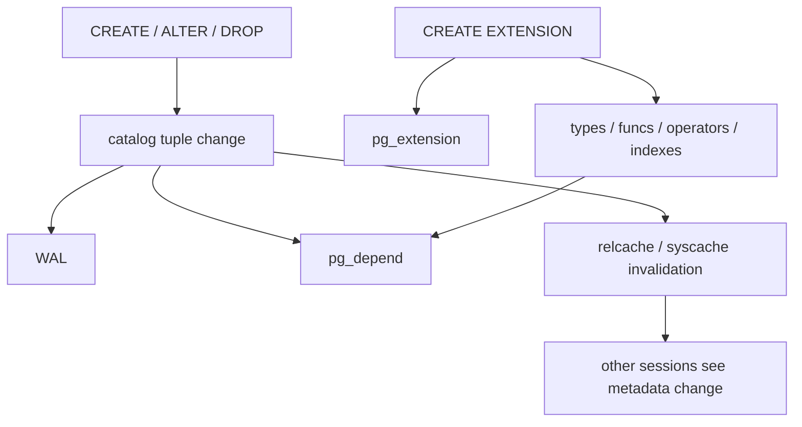

这带来几个重要结论：

第一，DDL 是事务化 metadata 变更。它不是简单修改 schema 文件，而是写 catalog tuple、写 WAL、处理依赖关系、发送缓存失效。

第二，catalog 也会受 MVCC、VACUUM、logical decoding 和 slot lag 影响。长事务和 logical slot 不只影响用户表，也可能影响 catalog old tuple 清理。

第三，extension 不是把文件放进插件目录。`CREATE EXTENSION` 会写 `pg_extension`，extension 创建的函数、类型、operator、access method、配置表会进入 catalog 和 dependency 图。

源码锚点：

- `src/include/catalog/pg_class.h`、`pg_attribute.h`、`pg_index.h`、`pg_extension.h` 定义重要 catalog。
- `src/backend/catalog/heap.c`、`index.c`、`indexing.c` 处理 relation 和 index catalog 路径。
- `src/backend/catalog/pg_depend.c` 处理对象依赖，包括 extension membership。
- `src/backend/commands/extension.c` 处理 `CREATE EXTENSION`、`pg_extension` 写入和 extension script 执行。

## 11. 二级索引与约束维护

PostgreSQL 的二级索引最重要的设计点是：索引和 heap 分离。B-Tree index tuple 通常保存 key 和 heap TID，而不是保存整行的最终可见状态。

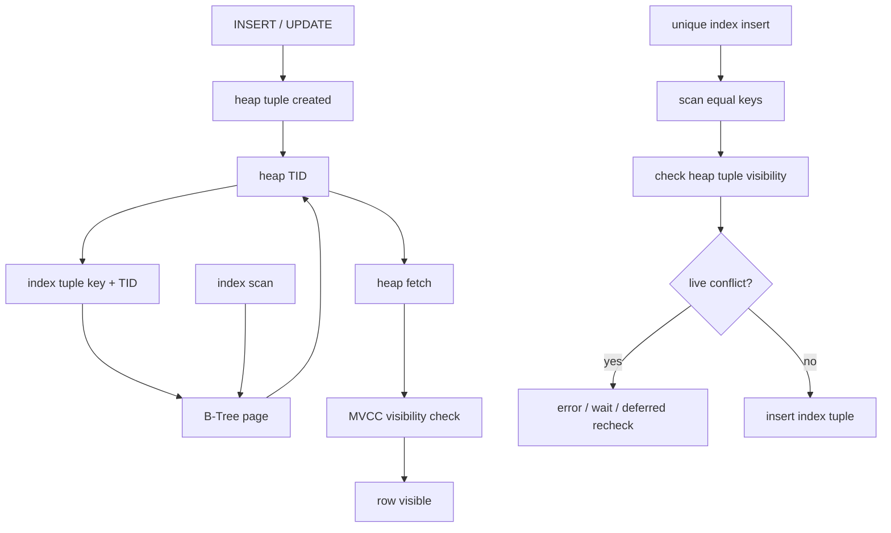

unique constraint 的关键不是 B-Tree 上 key 唯一这么简单。并发事务下，B-Tree 里可能有相同 key 的 index tuple，但对应 heap tuple 的创建事务未提交、已回滚、对当前事务不可见，或者是 speculative insertion。`_bt_check_unique()` 必须结合 heap 可见性判断 live conflict。这是分布式全局唯一索引的最小样本：派生结构上的冲突判断，最终要回到主数据和事务状态。

PostgreSQL 二级索引的几个边界：

- heap + index 分离让索引 AM 扩展更灵活，但索引不会天然知道 tuple 是否可见。
- UPDATE 如果无法 HOT，就可能为所有相关索引写新条目。
- dead heap tuple 和 dead index tuple 的清理节奏不同，可能产生 heap bloat 和 index bloat。
- B-Tree dedup、page split、bottom-up deletion、VACUUM index cleanup 都是在缓解索引长期膨胀，但不能消除“派生状态需要清理”的本质。
- index-only scan 的成功依赖 visibility map，不只是覆盖索引列。

源码锚点：

- `src/backend/executor/execIndexing.c` 的 `ExecInsertIndexTuples()` 是 executor 侧索引维护入口。
- `src/backend/access/index/indexam.c` 是 index AM 抽象入口。
- `src/backend/access/nbtree/nbtree.c`、`nbtinsert.c`、`nbtsearch.c` 展示 B-Tree 插入、查找和唯一性检查路径。

## 12. 缓存、后台任务、资源隔离

PostgreSQL 的 shared buffers 是数据库页缓存。它和 OS page cache 共同影响 I/O 行为，但 shared buffers 还承载 buffer pin、dirty flag、page LSN、content lock 等数据库语义。

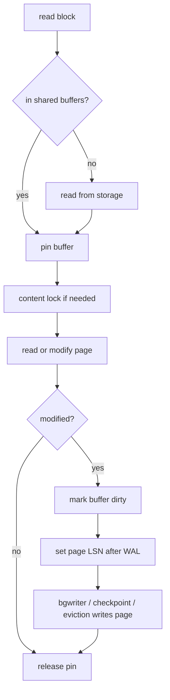

几个概念要拆开：

- pin 表示当前 backend 正在使用这个 buffer，避免被换出。
- content lock 保护 page 内容并发访问。
- dirty 表示 page 被修改但还没写回数据文件。
- page LSN 表示这个 page 的修改由哪个 WAL 位置保护。
- checkpoint 不等于每次提交，它是后台推进恢复边界。

后台任务里，VACUUM 最关键。它不是“清理垃圾”这么简单，而是多阶段状态机。

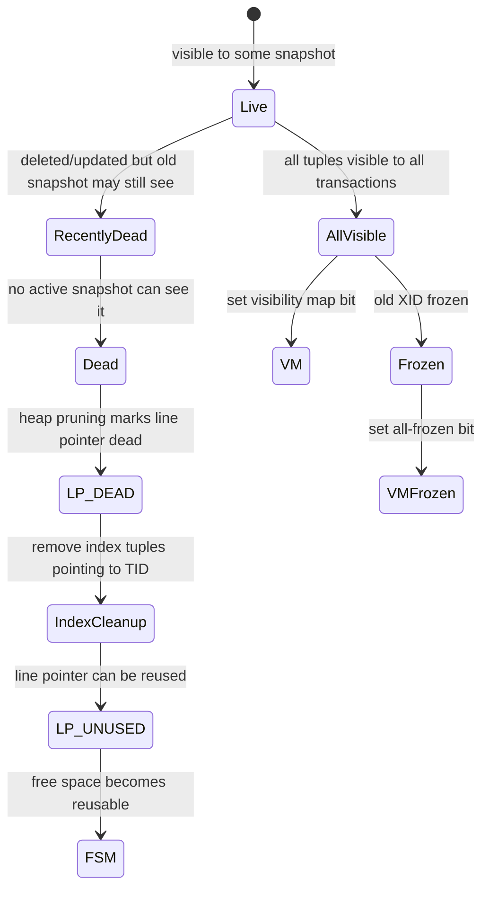

`vacuumlazy.c` 的注释体现了 PostgreSQL VACUUM 的重要约束：在有索引的表上，不能过早把 heap line pointer 变成 `LP_UNUSED`，因为仍然存在的 index tuple 可能指向它。VACUUM 常需要先扫描 heap，收集 dead TID，再清理索引，最后回 heap 推进 line pointer 状态。这就是为什么 VACUUM 既是空间回收，也是索引一致性维护。

资源隔离方面，PostgreSQL 没有把 OLTP、分析、向量、CDC、extension background worker 天然隔离成独立资源池。它们会共享：

- shared buffers 和 OS cache。
- WAL insert、WAL flush、WAL segment 空间。
- autovacuum worker 和 I/O。
- CPU、连接、lock、latch。
- catalog 和 relcache/syscache。
- checkpoint 和 background writer。

因此，插件或混合 workload 的风险不是“PostgreSQL 不支持”，而是“它们把成本放到了同一套状态推进路径上”。

## 13. 插件、生态补丁与变相方案

PostgreSQL extension 生态是它的核心优势之一，但要分层判断。

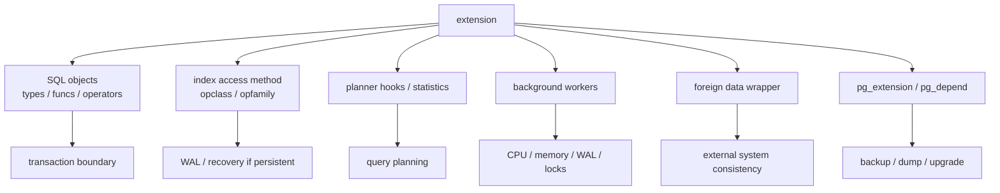

| 层次 | PostgreSQL 中的含义 | 判断 |
| --- | --- | --- |
| 原生能力 | SQL、heap、MVCC、WAL、B-Tree、catalog、权限、复制 | 进入事务和恢复闭环，是主库能力 |
| 主流 extension | pgvector、PostGIS、TimescaleDB、Citus、FDW、自定义类型和索引 AM | 能复用 catalog、权限、备份和事务，但资源仍在主库边界内 |
| 外围系统组合 | PostgreSQL + Elasticsearch、PostgreSQL + Kafka、PostgreSQL + ClickHouse | 需要额外处理 CDC、schema、重放、权限和回补 |
| 变通方案 | JSONB 模拟文档库、关系表模拟队列、触发器维护派生表 | 小规模可用，放大后要重新评估锁、WAL、VACUUM 和查询计划 |

pgvector 是典型例子。它复用 PostgreSQL 的表、事务、权限、备份、SQL 和 extension 分发方式，这是强集成优势。但如果向量写入、ANN index build、过滤条件、召回率、VACUUM、autovacuum 和主 OLTP 写入共享同一个库，就会出现新的资源竞争。此时问题不是“能不能向量检索”，而是：

- ANN 索引是否进入 WAL 和恢复边界。
- 大量向量写入是否放大 WAL 和 checkpoint。
- 向量索引是否受 VACUUM、REINDEX、autovacuum 影响。
- 过滤条件是在 PostgreSQL executor 里处理，还是索引 AM 内处理。
- 主库连接池、shared buffers、CPU 是否被搜索 workload 吃掉。

PostGIS、TimescaleDB、Citus、FDW 也类似。越接近内核，越能复用 PostgreSQL 的事务和恢复体系；越复杂，越要证明它没有把不可控的后台任务、外部一致性或资源竞争藏进主库。

## 14. 我的问题

1. PostgreSQL 的 HOT update 在真实业务中有多大比例能命中？哪些 schema 设计会系统性破坏 HOT，例如频繁更新 indexed column、page fillfactor 太高或宽行太多？
2. autovacuum 的触发阈值、freeze 策略和 index cleanup 参数，在高更新 OLTP 与 mixed workload 中应该如何观察，而不是只套默认值？
3. replication slot 同时拖住 `restart_lsn` 和 `catalog_xmin` 时，如何快速判断主要成本落在 WAL 磁盘、catalog dead tuple，还是 logical decoding reorder buffer？
4. PostgreSQL 的 index bloat 与 heap bloat 是否应该分开建指标？哪些场景只 VACUUM 不够，必须 REINDEX 或表重写？
5. extension 如果定义新的 index AM 或 background worker，它如何参与 WAL、recovery、cost model、statistics、VACUUM 和监控？
6. logical decoding 对 TOAST、大事务、DDL 和 replica identity 的边界，是否应该单独写一篇 CDC 文章验证？
7. DDL 的事务性和 catalog cache invalidation 在长事务下如何表现？这会如何映射到后续分布式 SQL 的 schema change 问题？
8. hint bit 导致读路径标脏 page 的实际影响如何观测？它对 checkpoint 和写放大有多大贡献？
9. index-only scan 的收益是否可以用 visibility map 覆盖率解释？不同表的 VM 命中率应该如何进入性能分析？
10. extension 带来的对象依赖和升级路径，在大版本升级、pg_dump/restore、logical replication 中有哪些边界？

## 15. badcase 与架构边界

| 模块 | badcase | 机制原因 | 后续专题映射 |
| --- | --- | --- | --- |
| MVCC / VACUUM | 长事务拖住 dead tuple 回收 | old snapshot 让 tuple 仍可能被读到，VACUUM 不能越过 horizon | TiDB GC safepoint、Lakehouse snapshot retention |
| Heap | heap bloat 持续增长 | UPDATE/DELETE 生成旧版本，空间回收依赖 VACUUM 和 page reuse | LSM compaction、OLAP merge |
| Index | index bloat 和回表成本增长 | index tuple 是派生状态，dead entry 清理节奏和 heap 不同 | 分布式全局索引、搜索 segment delete |
| HOT | HOT 命中率低导致索引写放大 | 更新索引列、新 tuple 放不回同页、fillfactor 不合适 | LSM write amplification、OLAP upsert merge |
| WAL | replication slot 或 archive lag 拖住 WAL | 消费者需要旧 WAL 继续 decode/replay | CDC lag、云原生日志服务 retention |
| Logical decoding | 大事务或慢 consumer 造成内存、磁盘和 WAL 压力 | reorder buffer 和 slot 需要保留足够历史 | Kafka CDC、在线迁移、审计流 |
| Checkpoint | dirty page 集中 flush 带来尾延迟 | commit、WAL flush、page writeback 和 checkpoint 是不同阶段 | page server replay、OLAP compaction |
| Catalog / DDL | 长事务与 DDL、cache invalidation 互相影响 | catalog 也是事务化关系，元数据变更要保持可见性语义 | 分布式 schema change、catalog service |
| Extension | 插件 workload 压垮主库 | 扩展复用主库事务与恢复，也共享 CPU、WAL、buffer、VACUUM | pgvector、PostGIS、FDW、外部索引 |
| TOAST / wide row | 大字段更新放大 WAL、VACUUM 和 logical decoding 成本 | 主 tuple 和 TOAST tuple 生命周期相关但物理上分离 | 对象存储 blob、value log、column family |

PostgreSQL 的架构边界不是能力少，而是很多能力都在同一个主库内核里。它可以通过 extension 扩展得很远，但越往外扩，越要重新证明：这个 workload 是否仍然适合共享同一套 WAL、buffer、VACUUM、catalog 和连接资源。

## 16. 工程启发

第一，PostgreSQL 的核心不是“heap + B-Tree”，而是主状态和派生状态的分工。

heap 是主数据 authority，B-Tree 是访问路径，VM/FSM 是摘要状态，WAL 是恢复材料，catalog 是元数据状态，VACUUM 是长期推进器。任何一个状态落后，都会表现为性能、空间或可用性问题。

第二，二级索引一致性的最小样本在单机里已经存在。

PostgreSQL 单机 B-Tree unique check 都需要回 heap 看事务可见性，说明索引和主数据分离后，一致性判断天然跨结构。后续看分布式全局索引、搜索索引、向量索引和物化视图时，要从这个最小样本出发。

第三，日志保留和旧版本回收本质上都是 reader/consumer 落后问题。

长事务、replication slot、logical decoding、backup、standby replay 都可能要求系统保留历史。名字不同，但问题一样：谁声明还需要旧状态，旧状态保留在哪里，保留成本由谁承担，什么时候可以强制失效。

第四，VACUUM 是 PostgreSQL 架构的一部分，不是运维附录。

没有 VACUUM，heap tuple、index tuple、VM、FSM、freeze horizon、catalog cleanup 都不能健康推进。PostgreSQL 的长期稳定性，很大程度取决于后台回收路径是否能跟上前台写入和更新。

第五，extension 的真正价值在于进入数据库边界，而不是“插件很多”。

PostgreSQL extension 可以复用事务、WAL、catalog、权限、备份和 SQL 生态，这是巨大优势。但如果 extension 的 workload 和主 OLTP workload 争用同一个资源池，就需要限流、隔离、拆库或外置系统，而不是只看功能支持。

第六，图比函数清单更能承载系统理解。

函数名只有在能证明某个状态转移时才有意义。本文把源码锚点放在 INSERT、UPDATE、VACUUM、B-Tree、slot、extension 等路径下，是为了说明“这个模型从哪里来”，而不是把源码路径当作结论本身。

## 17. 参考来源与引用

### 官方文档

- [PostgreSQL 18 Documentation: Database Physical Storage](https://www.postgresql.org/docs/18/storage.html)
- [PostgreSQL 18 Documentation: Database File Layout](https://www.postgresql.org/docs/18/storage-file-layout.html)
- [PostgreSQL 18 Documentation: Database Page Layout](https://www.postgresql.org/docs/18/storage-page-layout.html)
- [PostgreSQL 18 Documentation: Heap-Only Tuples](https://www.postgresql.org/docs/18/storage-hot.html)
- [PostgreSQL 18 Documentation: Write-Ahead Logging](https://www.postgresql.org/docs/18/wal-intro.html)
- [PostgreSQL 18 Documentation: Multiversion Concurrency Control](https://www.postgresql.org/docs/18/mvcc.html)
- [PostgreSQL 18 Documentation: Routine Vacuuming](https://www.postgresql.org/docs/18/routine-vacuuming.html)
- [PostgreSQL 18 Documentation: B-Tree Indexes](https://www.postgresql.org/docs/18/btree.html)
- [PostgreSQL 18 Documentation: Logical Decoding Concepts](https://www.postgresql.org/docs/18/logicaldecoding-explanation.html)
- [PostgreSQL 18 Documentation: Extensions](https://www.postgresql.org/docs/18/extend-extensions.html)

### 本地源码

- `D:\program\postgres`：`master 7424aac`
- `src/backend/access/heap/heapam.c`：`heap_insert()`、`heap_update()`、`log_heap_update()`
- `src/backend/access/heap/heapam_indexscan.c`：`heap_hot_search_buffer()`
- `src/backend/access/heap/pruneheap.c`：page pruning 与 HOT chain 清理
- `src/backend/access/heap/vacuumlazy.c`：`lazy_scan_heap()`、`lazy_vacuum_heap_rel()`
- `src/backend/access/transam/xact.c`：`RecordTransactionCommit()`
- `src/backend/access/transam/xloginsert.c`：`XLogBeginInsert()`、`XLogInsert()`
- `src/backend/access/transam/xlog.c`：`XLogFlush()`、checkpoint、recovery
- `src/backend/storage/buffer/bufmgr.c`：`ReadBuffer()`、`BufferAlloc()`、`MarkBufferDirty()`、`FlushBuffer()`
- `src/backend/executor/execIndexing.c`：`ExecInsertIndexTuples()`
- `src/backend/access/nbtree/nbtree.c`：`btinsert()`、`btgettuple()`
- `src/backend/access/nbtree/nbtinsert.c`：`_bt_doinsert()`、`_bt_check_unique()`、`_bt_split()`
- `src/backend/access/nbtree/nbtsearch.c`：`_bt_search()`
- `src/include/replication/slot.h`、`src/backend/replication/slot.c`：`ReplicationSlotPersistentData`、`ReplicationSlotCreate()`、`restart_lsn`、`catalog_xmin`
- `src/backend/commands/extension.c`：`CreateExtension()`、`creating_extension`
- `src/backend/catalog/pg_depend.c`：`recordDependencyOnCurrentExtension()`
- `src/include/catalog/pg_class.h`、`pg_attribute.h`、`pg_index.h`、`pg_extension.h`

### 本系列上下文

- `content/posts/learning-database-industry-day000-index.md`
- `content/posts/learning-database-industry-day002-2026-04-30-traditional-oltp-foundations-preview.md`
- `content/posts/learning-database-industry-day010-2026-06-09-traditional-oltp-foundations-overview.md`

## 下一步

Day 012 建议进入：`MySQL/InnoDB OLTP 存储系统文章`

建议重点：

- 从 clustered index、secondary index 回表、redo、undo、binlog、buffer pool、doublewrite、purge 和 online DDL 展开。
- 同时读取 MySQL 8.4 官方文档和 `D:\program\mysql-server` 本地源码入口。
- 优先验证 InnoDB 写入路径、事务提交路径、purge 回收路径、二级索引维护路径和 binlog/redo/undo 的边界。
- 把 PostgreSQL 的 heap + independent indexes 与 InnoDB 的 clustered index 作为主对照。
