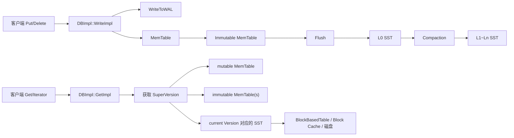
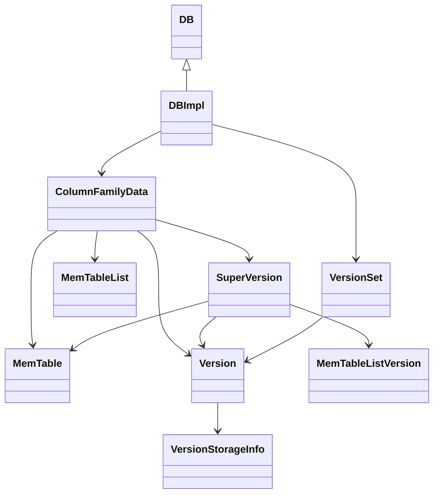

## 今日主题

- 主主题：`整体架构与 LSM-Tree`
- 副主题：`核心对象关系预览`

## 学习目标

- 建立 RocksDB 的第一张全局图：数据从哪里写入、暂存、落盘、再被读取。
- 在本地源码里定位最重要的几个核心对象：`DBImpl`、`ColumnFamilyData`、`SuperVersion`、`MemTable`、`VersionSet`。
- 先理解“为什么 RocksDB 需要 LSM”，再理解“为什么它还需要一套对象关系把内存态和磁盘态绑起来”。
- 为后续 Day 002 的 DB 打开流程、Day 003 的写路径和后续 Compaction 学习留出明确接口。

## 前置回顾

- 这是这套 RocksDB 主线学习的正式 Day 001。
- 当前仓库中已有一篇历史文章 `content/posts/Rocksdbskiplist.md`，它适合作为后续学习 `MemTable / SkipList` 时的补充参考，但不算本主线的已完成 Day。
- 本日目标不是吃透所有实现细节，而是先把“架构骨架”搭起来，后面每一章再把骨架上的关节拆开看。

## 源码入口

- `D:\program\rocksdb\include\rocksdb\db.h`
  - 对外接口 `DB`，包括 `Open`、`Put`、`Get`、`NewIterator`
- `D:\program\rocksdb\db\db_impl\db_impl.h`
  - 真正实现接口的 `DBImpl`
- `D:\program\rocksdb\db\column_family.h`
  - `ColumnFamilyData`、`SuperVersion`
- `D:\program\rocksdb\db\memtable.h`
  - `MemTable`
- `D:\program\rocksdb\db\memtable_list.h`
  - `MemTableList`
- `D:\program\rocksdb\db\version_set.h`
  - `VersionSet`、`VersionStorageInfo`
- `D:\program\rocksdb\db\dbformat.h`
  - `InternalKey`、`SequenceNumber` 等基础编码语义
- `D:\program\rocksdb\db\db_impl\db_impl_open.cc`
  - 打开 DB、恢复、安装 `SuperVersion`
- `D:\program\rocksdb\db\db_impl\db_impl_write.cc`
  - 写路径第一入口 `WriteImpl`
- `D:\program\rocksdb\db\db_impl\db_impl.cc`
  - 读路径第一入口 `GetImpl`
- `D:\program\rocksdb\db\db_impl\db_impl_compaction_flush.cc`
  - Flush / Compaction 调度入口

## 它解决什么问题

RocksDB 不是把数据直接“原地改写”到磁盘页里，而是把写入优先变成两件更容易做对、也更容易做快的事情：

1. 先顺序写 WAL，保证崩溃恢复时不丢更新。
2. 先写入内存里的 `MemTable`，把随机写转换成内存操作。

随后，后台线程再把内存里的有序数据刷成 `SST`，并通过 compaction 把多层文件重新组织。这就是 LSM 的核心思想：前台写入尽量便宜，后台逐步整理结构。

但只知道 “`MemTable -> SST -> Compaction`” 还不够。RocksDB 还必须回答另外几个工程问题：

- 一个读请求到底应该看哪些内存结构和哪些 SST？
- Flush 或 Compaction 运行时，老的读请求怎么还能安全读到旧视图？
- 多个列族并存时，每个列族的内存态、版本态和后台任务如何隔离？

今天看的核心对象，正是在回答这些问题。

## 它是怎么工作的

先看整体数据流：

再看“谁把这些状态串起来”：

这两张图合起来，能得到今天最重要的结论：

- `DBImpl` 是总调度者，对外接 `DB` 接口，对内调用恢复、读写、flush、compaction。
- `ColumnFamilyData` 是“单个列族的运行时状态容器”，把当前 `mem`、`imm`、`current version` 这些本该一起变化的状态放在一处。
- `SuperVersion` 是读路径真正拿到的“稳定快照视图”，把 `mem`、`imm`、`current version` 打包后交给读者使用。
- `VersionSet` 管的是整个 DB 的版本演化和 MANIFEST 相关元数据，不直接替代读路径里的稳定视图。

## 关键数据结构与实现点

### `DBImpl`

`D:\program\rocksdb\db\db_impl\db_impl.h` 里可以直接看到：

- `class DBImpl : public DB`
- 它实现了 `Put`、`Delete`、`Write`、`Get`、`MultiGet` 等核心接口。
- 它还负责恢复、WAL、后台 flush/compaction 调度、`SuperVersion` 安装等全局行为。

这说明一个重要边界：`DB` 是 API 抽象，`DBImpl` 才是 RocksDB 的主引擎。

### `ColumnFamilyData`

在 `D:\program\rocksdb\db\column_family.h` 中，`ColumnFamilyData` 暴露了几个非常关键的方法和成员语义：

- `mem()`：当前可写 `MemTable`
- `imm()`：不可变 memtable 链表
- `current()`：当前 `Version`
- `ConstructNewMemtable()` / `CreateNewMemtable()`
- `PickCompaction()`

也就是说，对某个列族而言，内存态、磁盘版本态、flush 和 compaction 的入口都围绕 `ColumnFamilyData` 组织。

### `SuperVersion`

`column_family.h` 里给了一大段非常值钱的注释图。核心意思是：

- 读请求拿到的是一个 `SuperVersion`
- `SuperVersion` 内部同时指向
  - 当前 mutable memtable
  - 当前 immutable memtable 集合
  - 当前 `Version`
- 即使后台线程已经推进了更新版本，旧读请求引用的老 `SuperVersion` 仍然可以把旧 memtable / 旧 SST 文件保活

这是 RocksDB 读路径能不长期持有全局互斥锁、同时仍保证一致性的关键工程技巧。

### `MemTable` 与 `MemTableList`

在 `D:\program\rocksdb\db\memtable.h` 和 `D:\program\rocksdb\db\memtable_list.h` 中可以看到：

- `MemTable::Add(...)` 负责把带有 `SequenceNumber` 的记录写入内存结构
- `MemTable::Get(...)` 支持点查
- `MemTableList` 维护一组 immutable memtable
- `PickMemtablesToFlush(...)` 用于选出待 flush 的 memtable

这表明 RocksDB 的“内存层”并不是单一结构，而是：

- 一个当前可写 memtable
- 零到多个等待 flush 的 immutable memtable

### `VersionSet` 与 `VersionStorageInfo`

在 `D:\program\rocksdb\db\version_set.h` 中：

- `VersionSet` 表示整个数据库所有列族的版本集合
- `VersionStorageInfo` 维护 levels、文件、compaction score、overlap 等信息

这说明磁盘上的 LSM 视图并不是“目录里有几堆 SST 文件”这么简单，而是一套被组织、被评分、被调度的元数据结构。

### `InternalKey` 与 `SequenceNumber`

在 `D:\program\rocksdb\db\dbformat.h` 中：

- `ParsedInternalKey` 由 `user_key + sequence + type` 组成
- `PackSequenceAndType()` 把 sequence number 和 value type 打包到一起

这件事非常关键：RocksDB 不是只存“用户 key”，而是存“带版本语义的内部 key”。之后的 snapshot、可见性、覆盖关系，都会建立在这里。

## 源码细读

### 1. 从 `DB` 到 `DBImpl`

`D:\program\rocksdb\include\rocksdb\db.h` 先定义了 `DB` 抽象接口，外部用户只看得到：

- `DB::Open(...)`
- `DB::Put(...)`
- `DB::Get(...)`
- `DB::NewIterator(...)`

然后在 `D:\program\rocksdb\db\db_impl\db_impl.h` 中，`DBImpl` 继承 `DB` 并实现这些接口。这一层的意义是：

- 对外暴露稳定 API
- 对内可以把实现拆到多个 `db_impl_*.cc` 中

所以以后顺着主流程找实现时，第一反应应该是：

`DB API -> DBImpl 对应方法 -> 具体的 db_impl_xxx.cc`

### 2. `ColumnFamilyData` 把“一个列族的 LSM 状态”收在一起

如果只从概念上理解列族，很容易把它想成“逻辑命名空间”。但从源码看，它远不止这个程度。

`ColumnFamilyData` 同时持有：

- 当前 `MemTable`
- immutable memtable 列表 `imm()`
- 当前 `Version`
- `TableCache`
- flush / compaction 相关方法

这意味着列族不是仅仅把 key 做了分组，而是几乎拥有一套独立的 LSM 运行时状态。多个列族共享 DB 级别的基础设施，但每个列族各自推进自己的内存态和版本态。

### 3. `SuperVersion` 才是读路径真正依赖的稳定视图

`column_family.h` 的注释明确说明：

- `ColumnFamilySet` 指向的是最新视图
- 但实际正在运行的读、迭代器、compaction 任务可能仍持有旧的 `SuperVersion`
- 老 `SuperVersion` 不释放，旧 memtable / 旧 version / 旧 SST 就不能被真正清掉

这件事可以把很多看似零散的行为统一起来理解：

- 为什么 Flush/Compaction 推进后，旧文件不会立刻消失？
- 为什么 Iterator 能在后台版本切换时继续工作？
- 为什么读路径要“先拿稳定视图，再读”？

答案都是：读的不是“当前全局可变状态”，而是“某个被引用住的 `SuperVersion`”。

### 4. 写路径第一眼：先 WAL，再内存，再考虑后台整理

在 `D:\program\rocksdb\db\db_impl\db_impl_write.cc` 的 `DBImpl::WriteImpl(...)` 中，虽然细节很多，但第一天只抓主干就够了：

- 写请求先进入写线程组织逻辑
- WAL 相关路径通过 `WriteToWAL(...)` 落日志
- 然后通过 `WriteBatchInternal::InsertInto(...)` 写入 memtable
- 写入后如果状态达到条件，会触发后续 flush / compaction 调度

这里先记住一个架构级判断：

- WAL 解决的是 durability
- MemTable 解决的是前台写入吞吐
- Flush / Compaction 解决的是把内存态逐步收敛到磁盘层级结构

至于写线程如何分组、如何分配 sequence number、如何处理并发，这些留到后续写路径专题再细拆。

### 5. 读路径第一眼：先拿 `SuperVersion`，再按内存到磁盘的顺序查

`D:\program\rocksdb\db\db_impl\db_impl.cc` 中 `DBImpl::GetImpl(...)` 的主流程非常值得记住：

1. 先拿 `ColumnFamilyData`
2. 再 `GetAndRefSuperVersion(cfd)`
3. 决定 snapshot sequence
4. 先查 `sv->mem`
5. 再查 `sv->imm`
6. 最后查 `sv->current->Get(...)`
7. 结束后 `ReturnAndCleanupSuperVersion(...)`

这里还有一个非常关键的源码注释：

- 如果没有显式 snapshot，读路径会在“拿到 `SuperVersion` 之后”再确定 `snapshot = GetLastPublishedSequence()`
- 注释解释了原因：否则如果在两者之间发生 flush/compaction，可能让读者既看不到旧快照该看到的数据，也看不到更新后的数据

这说明 RocksDB 在读路径上非常强调“视图”和“可见性”的绑定顺序，而不是简单读几个结构拼起来。

### 6. 后台线程如何把 LSM 推进下去

在 `D:\program\rocksdb\db\db_impl\db_impl_compaction_flush.cc` 的 `MaybeScheduleFlushOrCompaction()` 中可以看到：

- 先判断 DB 是否已打开、后台任务是否暂停、是否有 hard error
- 有待执行 flush 就调度 `BGWorkFlush`
- 有待执行 compaction 就调度 `BGWorkCompaction`

这让整个系统形成一个清晰闭环：

- 前台写入把数据推进到 WAL 和 memtable
- memtable 满了或满足条件后进入 immutable 队列
- 后台 flush 生成 SST
- 后台 compaction 调整 levels 和文件分布

所以 RocksDB 的核心并不是“某个单独的数据结构”，而是“前台快速写 + 后台持续整形”的协作系统。

### 7. `DB::Open()` 在做什么

虽然 Day 002 会专讲打开流程，但今天已经可以先从 `D:\program\rocksdb\db\db_impl\db_impl_open.cc` 看出它的大致职责：

- 校验 options
- 创建目录
- 调用 `Recover(...)`
- 创建新的 WAL
- 做恢复后的 `LogAndApplyForRecovery(...)`
- 为每个列族安装 `SuperVersion`
- 最后 `MaybeScheduleFlushOrCompaction()`

所以 `Open()` 不是“把文件句柄打开一下”这么简单，它实际上是在把整个数据库运行时骨架搭起来，并把恢复后的状态切换成可服务的 LSM 视图。

## 今日问题与讨论

### 我的问题

#### 问题 1：为什么 `GetImpl()` 要先拿 `SuperVersion`，再决定默认 snapshot？

- 简答：
  - 因为读请求必须先固定住“要读的那一批 memtable / version”，再绑定可见 sequence；否则 flush 或 compaction 可能在中间切走视图。
- 源码依据：
  - `D:\program\rocksdb\db\db_impl\db_impl.cc`
  - `GetImpl()` 中拿到 `SuperVersion` 后才执行 `snapshot = GetLastPublishedSequence()`，并有注释解释 flush 夹在中间会导致可见性问题。
- 当前结论：
  - `SuperVersion` 和 snapshot sequence 不是两个完全独立的概念，它们在读路径上必须按顺序绑定。
- 是否需要后续回看：
  - `是`
  - 到 `Snapshot / Sequence Number / 可见性语义` 那一天再彻底闭环。

#### 问题 2：为什么 `ColumnFamilyData` 同时持有 `mem`、`imm`、`current version`？

- 简答：
  - 因为对一个列族来说，这三者共同定义了“当前 LSM 视图”，把它们拆散会让读写、flush、compaction 的协作边界很混乱。
- 源码依据：
  - `D:\program\rocksdb\db\column_family.h`
  - `mem()`、`imm()`、`current()`、`ConstructNewMemtable()`、`PickCompaction()` 都围绕 `ColumnFamilyData` 暴露。
- 当前结论：
  - `ColumnFamilyData` 是列族级运行时状态容器，而不是简单 handle。
- 是否需要后续回看：
  - `否`
  - 但 Day 002 讲 DB 打开流程时还会继续补细节。

#### 问题 3：为什么旧 memtable / 旧 SST 在版本切换后不会立刻消失？

- 简答：
  - 因为仍可能有旧 `SuperVersion` 被读请求、迭代器、compaction 任务引用。
- 源码依据：
  - `D:\program\rocksdb\db\column_family.h` 中关于 `SuperVersion` 引用关系的长注释图。
- 当前结论：
  - RocksDB 的资源生命周期不是“状态一更新，旧对象立刻销毁”，而是“等最后一个引用它的稳定视图释放之后再清理”。
- 是否需要后续回看：
  - `是`
  - 读迭代器和 compaction 细讲时会再次遇到。

### 外部高价值问题

- 今日未引入外部问题。
- 原因：
  - Day 001 先建立本地源码驱动的主框架，避免一开始就被外部讨论带偏。

## 常见误区或易混点

- 误区 1：LSM 只等于 “很多 SST 文件”
  - 更准确地说，LSM 是“WAL + MemTable + immutable memtable + SST levels + compaction”的整体协作机制。
- 误区 2：`VersionSet` 就是读请求直接使用的当前视图
  - 读请求真正拿的是 `SuperVersion`；`VersionSet` 更偏向版本演进和元数据管理。
- 误区 3：列族只是 key 的逻辑分组
  - 从源码结构看，每个列族几乎都拥有自己的一套 memtable、version、flush/compaction 状态。
- 误区 4：compaction 只是“清理重复 key”
  - 它同时在维护层级组织、读放大、写放大、空间放大的整体平衡。

## 设计动机

### 为什么 RocksDB 更偏爱 LSM 而不是原地更新

如果采用原地更新，随机写会更频繁地打到磁盘页，写放大和 I/O 模式都不够友好。LSM 的取舍是：

- 前台写变快：先 WAL + 内存
- 后台整理变复杂：需要 flush 和 compaction
- 读路径变复杂：需要同时看内存态和磁盘态

RocksDB 明显选择了“把复杂性转移到后台和元数据管理”，来换前台写吞吐和 SSD/HDD 上更友好的写模式。

### 为什么要有 `SuperVersion`

如果每次读都直接盯着一套全局可变状态看，那么 flush、compaction、iterator、snapshot 很容易互相打架。`SuperVersion` 的价值在于：

- 给读者一个稳定的点时间视图
- 减少读路径长时间持锁
- 让旧资源生命周期跟随引用自然回收

这不是一个“额外包装层”，而是 RocksDB 把高并发读和后台版本推进同时做对的关键设计。

## 横向对比

| 维度 | RocksDB / LSM | 传统 B+Tree 式存储 |
| --- | --- | --- |
| 前台写入 | 先顺序 WAL，再写内存，随机写压力较小 | 更偏向原地更新或页分裂，随机写更直接 |
| 后台维护 | 依赖 flush / compaction 持续整理 | 依赖页管理、分裂/合并、buffer pool 协调 |
| 读路径 | 可能需要同时查 memtable、immutable、多个 level | 通常围绕 buffer pool + 树页遍历 |
| 版本可见性 | 常和 sequence number / snapshot 结合 | 常结合页级结构和事务/MVCC 设计 |
| 典型优势 | 写吞吐高，适合写多场景 | 点查和范围查询模式更直观，结构更稳定 |

这里先记一个学习上的判断：

- RocksDB 不是“天然简单”
- 它只是把复杂性从“前台随机写”换成了“后台整理 + 读路径协调 + 元数据管理”

## 工程启发

- 当一个系统需要同时兼顾高并发读和后台结构演进时，给读者一个“稳定视图对象”往往比让所有读都盯着全局可变状态更可控。
- 把“前台必须快”的路径和“后台可以慢慢做”的路径拆开，是 RocksDB 非常典型的工程取舍。
- `ColumnFamilyData` 这种“围绕一个子系统聚合状态与行为”的做法很值得借鉴，它让 flush、compaction、read view 的边界更清楚。

## 今日小结

今天最重要的收获不是记住某个函数，而是建立一张能继续往下挂细节的图：

- 对外入口是 `DB` / `DBImpl`
- 列族运行时核心是 `ColumnFamilyData`
- 读路径依赖 `SuperVersion`
- 内存态由 `MemTable + MemTableList` 组成
- 磁盘层级与版本元数据由 `VersionSet / Version / VersionStorageInfo` 组织

只要这张图是清楚的，后面写路径、读路径、Manifest、Compaction 都能找到自己的落点。

## 明日衔接

下一天建议进入：`DB 打开流程与核心对象关系`

重点继续看：

- `D:\program\rocksdb\db\db_impl\db_impl_open.cc`
- `D:\program\rocksdb\db\version_set.cc`
- `D:\program\rocksdb\db\column_family.cc`

要回答的问题是：

- `DB::Open()` 具体如何恢复 MANIFEST / WAL？
- `ColumnFamilyData`、`VersionSet`、`SuperVersion` 是在打开阶段怎么真正连起来的？
- 打开完成后，为什么数据库就已经具备了一个可服务的稳定视图？

## 复习题

1. 为什么说 RocksDB 的 LSM 不只是 `SST`，而是一整套前台写入与后台整理协作系统？
2. `DBImpl`、`ColumnFamilyData`、`SuperVersion` 三者分别负责什么？
3. 为什么读路径要先拿 `SuperVersion`，再决定默认 snapshot sequence？
4. `MemTable` 和 `MemTableList` 在架构上分别代表什么状态？
5. `VersionSet` 和 `SuperVersion` 的职责边界有什么不同？
