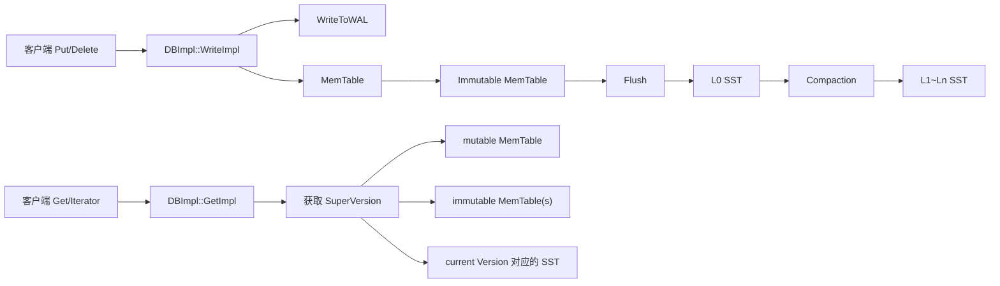
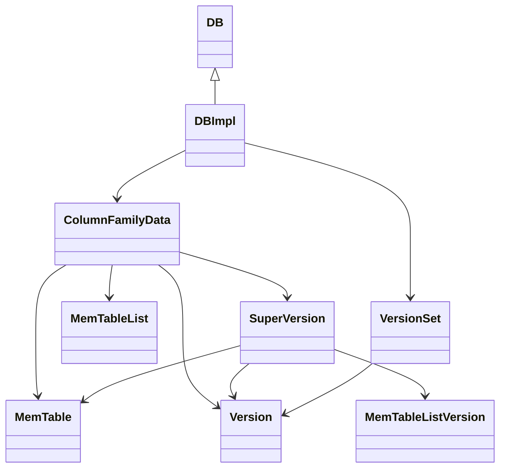

## 今日主题

- 主主题：`整体架构与 LSM-Tree`
- 副主题：`核心对象关系预览`

## 学习目标

- 建立 RocksDB 的第一张全局图：数据从哪里写入、暂存、落盘、再被读取。
- 在本地源码里先认清几个最重要的对象：`DBImpl`、`ColumnFamilyData`、`SuperVersion`、`MemTable`、`VersionSet`。
- 理解 RocksDB 的 LSM 不只是 `MemTable -> SST`，而是一整套前台写入与后台整理协作系统。
- 给后续 Day 002 的打开流程、Day 003 的写路径留出明确阅读入口。

## 前置回顾

- 这是 RocksDB 主线学习的正式 Day 001。
- 仓库里已有 [Rocksdbskiplist.md](D:/program/Dog-Du.github.io/content/posts/Rocksdbskiplist.md)，它更适合作为后续 `MemTable / SkipList` 的补充，不算主线 Day。
- 今天的目标不是吃透每个细节，而是先建立“之后继续读源码时不容易迷路”的第一张地图。

## 源码入口

- `D:\program\rocksdb\include\rocksdb\db.h`
- `D:\program\rocksdb\db\db_impl\db_impl.h`
- `D:\program\rocksdb\db\column_family.h`
- `D:\program\rocksdb\db\db_impl\db_impl.cc`
- `D:\program\rocksdb\db\db_impl\db_impl_write.cc`
- `D:\program\rocksdb\db\db_impl\db_impl_compaction_flush.cc`
- `D:\program\rocksdb\db\version_set.h`
- `D:\program\rocksdb\db\dbformat.h`

## 它解决什么问题

RocksDB 不走“直接原地改写磁盘页”的路线，而是把写入拆成几步：

1. 先顺序写 WAL，保证崩溃后能恢复。
2. 先写入内存中的 `MemTable`，把前台随机写改成内存操作。
3. 再由后台把内存整理成 SST，并持续做 compaction。

但只知道 `MemTable -> SST -> Compaction` 还不够。真正的工程难点是：

- 读请求要同时看哪些地方。
- 后台 flush / compaction 改变状态时，前台读如何拿到稳定视图。
- 多个 Column Family 共存时，谁负责把“某个列族当前的内存态和磁盘态”收在一起。

## 它是怎么工作的

先看整体数据流：



再看对象关系：



今天要先记住四个结论：

- `DBImpl` 是总调度器。
- `ColumnFamilyData` 是“单个列族的运行时状态容器”。
- `SuperVersion` 是读路径拿到的稳定视图。
- `VersionSet` 负责全库的版本元数据与 MANIFEST 相关演进。

## 关键数据结构与实现点

### `DBImpl`

它不是单纯的 API 实现类，而是 RocksDB 的主引擎。

### `ColumnFamilyData`

它不是一个轻量 handle，而是一个列族当前运行态的聚合点。

### `SuperVersion`

它不是额外包装层，而是“让读线程拿到稳定快照视图”的关键对象。

### `VersionSet`

它不直接服务前台读，而是维护磁盘版本视图、文件元数据和版本切换。

## 源码细读

下面不再整段搬源码，而是挑最值得带着问题回看的 5 个片段。

### 1. 从 `DB` 落到 `DBImpl`

如果你之后自己读源码，第一步先建立这个入口感：外部拿到的是 `DB` 抽象，真正工作的是 `DBImpl`。

关键片段：

```cpp
// db/db_impl/db_impl.h, class DBImpl
class DBImpl : public DB {
 public:
  DBImpl(const DBOptions& options, const std::string& dbname,
         const bool seq_per_batch = false, const bool batch_per_txn = true,
         bool read_only = false);
```

这一段说明了什么：

- `DBImpl` 直接继承 `DB`。
- 之后看到 `DB::Open`、`Put`、`Get` 之类对外 API，往下追时第一反应就应该是去找 `DBImpl` 对应实现。

这段在主流程中的位置：

- 它不是业务逻辑，而是“源码导航入口”。

读者后续自己读源码时先看哪里：

- 先从 `include/rocksdb/db.h` 看公开 API。
- 再跳到 `db/db_impl/db_impl.h` 和相应 `db_impl_*.cc` 找实现。

### 2. `ColumnFamilyData` 为什么是核心运行时容器

如果只把列族理解成 key 空间分组，会低估 RocksDB 的对象边界。

关键片段：

```cpp
// db/column_family.h, class ColumnFamilyData
MemTableList* imm() { return &imm_; }
MemTable* mem() { return mem_; }

bool IsEmpty() {
  return mem()->GetFirstSequenceNumber() == 0 && imm()->NumNotFlushed() == 0;
}

Version* dummy_versions() { return dummy_versions_; }
Version* current() { return current_; }  // 要求：持有 DB mutex
```

这一段说明了什么：

- 同一个 `ColumnFamilyData` 里直接挂着：
  - 当前可写 `mem`
  - 不可变 `imm`
  - 当前磁盘版本 `current`
- 也就是说，列族不是“名字”，而是“一整组 LSM 运行时状态”。

为什么这里重要：

- 以后无论看 flush、compaction、open、read path，很多逻辑最后都会落到“拿某个 `cfd` 的 `mem/imm/current`”。

本节先不展开什么：

- 这里先不细讲 `TableCache`、`MutableCFOptions` 等更外围字段，Day 001 只抓最关键的三件套。

### 3. `SuperVersion` 为什么值得单独记

真正的读路径不是直接盯着一堆全局可变状态读，而是拿一个稳定视图。

关键片段：

```cpp
// db/column_family.h, class ColumnFamilyData
SuperVersion* GetSuperVersion() { return super_version_; }
SuperVersion* GetReferencedSuperVersion(DBImpl* db);
SuperVersion* GetThreadLocalSuperVersion(DBImpl* db);
bool ReturnThreadLocalSuperVersion(SuperVersion* sv);
void InstallSuperVersion(SuperVersionContext* sv_context,
                         InstrumentedMutex* db_mutex,
                         std::optional<std::shared_ptr<SeqnoToTimeMapping>>
                             new_seqno_to_time_mapping = {});
```

这一段说明了什么：

- `SuperVersion` 不是临时局部技巧，而是列族上的一等对象。
- 它有获取、引用、归还、安装这一整套生命周期接口。
- 这意味着读路径、后台线程、TLS 缓存、旧视图回收都围绕它组织。

为什么这里重要：

- 读懂 RocksDB 的前提之一，就是接受“读线程拿到的不是最新可变状态本体，而是一个稳定视图对象”。

读者后续自己读源码时先看哪里：

- Day 001 先记接口。
- Day 002 再回看 `InstallSuperVersion(...)` 和打开流程。
- 之后到 read path 再细看 `GetThreadLocalSuperVersion(...)`。

### 4. 写路径第一层骨架：WAL、memtable、状态切换

今天不细拆并发写线程和 sequence 分配，但至少要知道写路径最后把状态推向哪里。

关键片段：

```cpp
// db/db_impl/db_impl_write.cc, memtable 切换与 InstallSuperVersionAndScheduleWork(...) 调用点
cfd->mem()->SetNextLogNumber(cur_wal_number_);
assert(new_mem != nullptr);
cfd->imm()->Add(cfd->mem(), &context->memtables_to_free_);
if (new_imm) {
  new_imm->SetNextLogNumber(cur_wal_number_);
  cfd->imm()->Add(new_imm, &context->memtables_to_free_);
}
new_mem->Ref();
cfd->SetMemtable(new_mem);
InstallSuperVersionAndScheduleWork(cfd, &context->superversion_context);
```

这一段说明了什么：

- 当前 memtable 会被转入 `imm()`。
- 新 memtable 会成为新的活跃 memtable。
- 状态切换之后会立刻安装新的 `SuperVersion`。

为什么这里重要：

- 这段把“内存态切换”与“读视图发布”直接连了起来。
- 它说明 RocksDB 的状态推进不是改几个指针就完，而是要同步更新读路径可见视图。

本节先不展开什么：

- `WriteImpl(...)` 前面大量参数检查、写线程分组、WAL 写入细节先不展开。
- 这些放到 Day 003 单独讲更合适。

### 5. 读路径为什么先拿 `SuperVersion` 再定默认 snapshot

这是 Day 001 最值得提前记住的一段，因为它能避免之后理解 snapshot 时走偏。

关键片段：

```cpp
// db/db_impl/db_impl.cc, DBImpl::GetImpl(...)
SuperVersion* sv = GetAndRefSuperVersion(cfd);

SequenceNumber snapshot;
if (read_options.snapshot != nullptr) {
  ...
} else {
  // 注意：必须先引用 super version，再设置 snapshot；
  // 否则如果中间发生 flush，可能会把该 snapshot 需要的数据 compact 掉。
  snapshot = GetLastPublishedSequence();
  ...
}
```

这一段说明了什么：

- 默认 snapshot 不是随便什么时候拿都行。
- 读路径先固定住 `SuperVersion`，再拿 `GetLastPublishedSequence()`。

为什么这里重要：

- 如果先拿 sequence、后拿视图，中间发生 flush/compaction，读者可能看到一个前后不一致的世界。
- 所以 RocksDB 很强调“可见性”和“视图”的绑定顺序。

读者后续自己读源码时先看哪里：

- 之后到 `Snapshot / Sequence Number / 可见性语义` 那天，再回到这段注释。
- 那时这段会从“先记住”升级成“彻底闭环”。

再补一小段，把“拿到 `SuperVersion` 之后怎么归还”补完整。

关键片段：

```cpp
// db/db_impl/db_impl.cc, DBImpl::GetAndRefSuperVersion(...) / DBImpl::ReturnAndCleanupSuperVersion(...)
SuperVersion* DBImpl::GetAndRefSuperVersion(ColumnFamilyData* cfd) {
  return cfd->GetThreadLocalSuperVersion(this);
}

void DBImpl::ReturnAndCleanupSuperVersion(ColumnFamilyData* cfd,
                                          SuperVersion* sv) {
  if (!cfd->ReturnThreadLocalSuperVersion(sv)) {
    CleanupSuperVersion(sv);
  }
}
```

这一段说明了什么：

- 读路径拿的并不一定是“现拿现建”的 `SuperVersion`，而是优先走线程本地缓存。
- 归还时也不是一律直接删除，而是先尝试放回线程本地；只有放不回去时才真正做 cleanup。

为什么这里重要：

- 它把 Day 001 里“读路径依赖稳定视图”再往前推进了一步，变成“读路径依赖的是可复用、可延迟清理的稳定视图对象”。
- 这也是为什么后面读 `GetImpl()`、`MultiGet()`、iterator 相关代码时，会反复看到“先取 sv，最后归还 sv”这条固定节奏。

读者后续自己读源码时先看哪里：

- 先回看 `DBImpl::GetImpl()` 里 `GetAndRefSuperVersion(...)` 和 `ReturnAndCleanupSuperVersion(...)` 的成对出现。
- 再看 `ColumnFamilyData::GetThreadLocalSuperVersion(...)` 和 `ReturnThreadLocalSuperVersion(...)`，确认 `SuperVersion` 的线程本地复用是怎么落地的。

### 6. 后台调度不是附属，而是 LSM 主体的一部分

最后看一眼后台调度骨架，就知道 compaction/flush 不是可有可无的收尾，而是系统核心。

关键片段：

```cpp
// db/db_impl/db_impl_compaction_flush.cc, DBImpl::MaybeScheduleFlushOrCompaction(...)
void DBImpl::MaybeScheduleFlushOrCompaction() {
  mutex_.AssertHeld();
  if (!opened_successfully_) {
    return;
  }
  if (bg_work_paused_ > 0) {
    return;
  }
  ...
  while (!is_flush_pool_empty && unscheduled_flushes_ > 0 &&
         bg_flush_scheduled_ < bg_job_limits.max_flushes) {
    env_->Schedule(&DBImpl::BGWorkFlush, fta, Env::Priority::HIGH, this,
                   &DBImpl::UnscheduleFlushCallback);
    --unscheduled_flushes_;
  }
  ...
}
```

这一段说明了什么：

- RocksDB 会持续根据当前状态安排后台 flush / compaction。
- 前台写入只是把数据推进系统，后台任务负责把系统维持成可控的 LSM 结构。

为什么这里重要：

- Day 001 就要先建立一个判断：RocksDB 的核心不是某个单独数据结构，而是“前台快写 + 后台整形”的协作系统。

## 今日问题与讨论

### 我的问题

#### 问题 1：为什么 `GetImpl()` 要先拿 `SuperVersion`，再决定默认 snapshot？

- 简答：
  - 因为读请求必须先固定“要读的那一份 mem/imm/version 视图”，否则 flush/compaction 会让 sequence 和视图错位。
- 源码依据：
  - `D:\program\rocksdb\db\db_impl\db_impl.cc`
- 当前结论：
  - `SuperVersion` 和 snapshot sequence 在读路径上必须按顺序绑定。
- 是否需要后续回看：
  - `是`

#### 问题 2：为什么 `ColumnFamilyData` 同时持有 `mem`、`imm`、`current version`？

- 简答：
  - 因为它们共同组成了“这个列族当前的 LSM 运行态”，拆散之后读、写、flush、compaction 的协作边界会很乱。
- 源码依据：
  - `D:\program\rocksdb\db\column_family.h`
- 当前结论：
  - `ColumnFamilyData` 是列族级运行时容器，不是简单 handle。
- 是否需要后续回看：
  - `是`

#### 问题 3：为什么状态切换后要立刻安装新的 `SuperVersion`？

- 简答：
  - 因为旧的读视图还可能被引用，而新的读请求又必须看到新的 mem/imm/current 组合，系统需要明确的“视图发布”动作。
- 源码依据：
  - `D:\program\rocksdb\db\db_impl\db_impl_write.cc`
  - `D:\program\rocksdb\db\column_family.h`
- 当前结论：
  - RocksDB 把“切状态”和“发布读视图”视为一组操作。
- 是否需要后续回看：
  - `是`

### 外部高价值问题

- 今日未引入外部问题。
- 原因：
  - Day 001 先建立本地源码驱动的第一张全局图，避免一开始就被外部讨论分散注意力。

## 常见误区或易混点

- 误区 1：LSM 只等于“一堆 SST 文件”
  - 更准确地说，LSM 是 `WAL + MemTable + immutable memtable + SST levels + compaction` 的整体协作系统。
- 误区 2：`VersionSet` 就是前台读请求直接使用的当前视图
  - 前台读路径真正拿的是 `SuperVersion`。
- 误区 3：列族只是 key 的逻辑分组
  - 从源码看，每个列族几乎都有自己的一整组 memtable / version / flush / compaction 状态。
- 误区 4：compaction 只是“清理重复 key”
  - 它还在维持层级组织、读放大、写放大、空间放大的整体平衡。

## 设计动机

### 为什么 RocksDB 更偏爱 LSM 而不是原地更新

如果采用原地更新，随机写会更频繁地打到磁盘页，I/O 模式和写放大都不够友好。LSM 的取舍是：

- 前台写变快：先 WAL + 内存
- 后台整理变复杂：需要 flush 和 compaction
- 读路径变复杂：需要同时看内存态和磁盘态

RocksDB 明显选择了“把复杂性转移到后台和元数据管理”，换前台写吞吐和更友好的写模式。

### 为什么要有 `SuperVersion`

如果每次读都盯着一组全局可变状态看，flush、compaction、iterator、snapshot 很容易相互打架。`SuperVersion` 的价值是：

- 给读者一个稳定视图对象
- 避免读路径长期持锁
- 让旧资源的生命周期跟着视图引用自然回收

## 横向对比

| 维度 | RocksDB / LSM | 传统 B+Tree 式存储 |
| --- | --- | --- |
| 前台写入 | 先 WAL，再内存，尽量避免随机磁盘写 | 更偏向原地更新或页分裂 |
| 后台维护 | 依赖 flush / compaction 持续整理 | 更依赖页管理与 buffer pool |
| 读路径 | 可能同时看 memtable、immutable、多个 level | 通常围绕树页遍历 |
| 可见性语义 | 经常和 sequence / snapshot 绑定 | 常结合事务 / MVCC |

## 工程启发

- 高并发读系统里，给读者一个“稳定视图对象”，往往比让所有人直接看全局可变状态更可控。
- 把“前台必须快”的路径和“后台可以慢慢做”的路径拆开，是 RocksDB 很典型的工程取舍。
- 学 RocksDB 时，先抓对象边界比先钻函数细节更重要，否则很容易在代码里迷路。

## 今日小结

今天最重要的收获不是记住了多少函数，而是建立了一张后续读源码不容易迷路的地图：

- 对外入口是 `DB` / `DBImpl`
- 列族运行时核心是 `ColumnFamilyData`
- 读路径依赖 `SuperVersion`
- 内存态由 `MemTable + MemTableList` 组成
- 磁盘版本元数据由 `VersionSet / Version` 维护

之后继续读源码时，可以按这条路径走：

1. 先问自己当前看的是前台写、前台读、还是后台整理。
2. 再找它落到哪个 `cfd`。
3. 再看它动的是 `mem`、`imm`、`current` 还是 `SuperVersion`。

## 明日衔接

下一天建议进入：`DB 打开流程与核心对象关系`

重点继续看：

- `D:\program\rocksdb\db\db_impl\db_impl_open.cc`
- `D:\program\rocksdb\db\version_set.cc`
- `D:\program\rocksdb\db\column_family.cc`

要带着这三个问题去读：

- `DB::Open()` 如何恢复 MANIFEST / WAL？
- `ColumnFamilyData`、`VersionSet`、`SuperVersion` 在打开阶段是怎么真正连起来的？
- 为什么打开完成后，数据库就已经具备了一个可服务的稳定视图？

## 复习题

1. 为什么说 RocksDB 的 LSM 不只是 `SST`，而是一整套前台写入与后台整理协作系统？
2. `DBImpl`、`ColumnFamilyData`、`SuperVersion` 三者分别负责什么？
3. 为什么读路径要先拿 `SuperVersion`，再决定默认 snapshot sequence？
4. `MemTable` 和 `MemTableList` 在架构上分别代表什么状态？
5. `VersionSet` 和 `SuperVersion` 的职责边界有什么不同？
