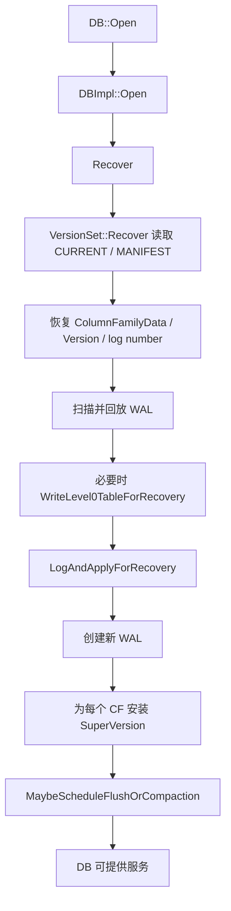
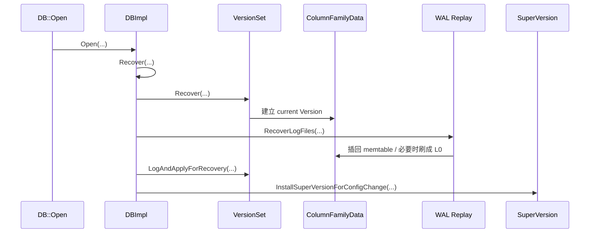

## 今日主题

- 主主题：`DB 打开流程与核心对象关系`
- 副主题：`MANIFEST / WAL 恢复如何落到运行时视图`

## 学习目标

- 讲清 `DB::Open()` 到“数据库可服务”为止的主流程。
- 讲清 `VersionSet`、`ColumnFamilyData`、`Version`、`MemTable`、`SuperVersion` 在打开阶段分别何时出现、谁连接谁。
- 理解为什么要先恢复 MANIFEST，再回放 WAL，再安装 `SuperVersion`。
- 给读者一条之后自己继续读 open / recover / manifest 相关源码时不容易迷路的路径。

## 前置回顾

- Day 001 已经建立了第一张总图：`DBImpl -> ColumnFamilyData -> SuperVersion -> MemTable / VersionSet`。
- Day 002 的任务，是把这张图真正接到启动流程上：
  - 打开时先恢复什么
  - 再恢复什么
  - 最后怎样发布成读路径可见的稳定视图

## 源码入口

- `D:\program\rocksdb\include\rocksdb\db.h`
- `D:\program\rocksdb\db\db_impl\db_impl_open.cc`
- `D:\program\rocksdb\db\version_set.h`
- `D:\program\rocksdb\db\version_set.cc`
- `D:\program\rocksdb\db\column_family.h`
- `D:\program\rocksdb\db\column_family.cc`
- `D:\program\rocksdb\db\db_impl\db_impl.cc`
- `D:\program\rocksdb\db\db_impl\db_impl_compaction_flush.cc`

## 它解决什么问题

`DB::Open()` 不是“打开几个文件句柄”。

它要解决的其实是 4 个恢复问题：

1. 当前数据库最近一次持久化的 LSM 视图是什么。
2. 当前有哪些 Column Family，它们各自的 `current Version` 是什么。
3. MANIFEST 之后还有哪些 WAL 更新没有落成 SST，需要补回。
4. 恢复完成后，前台读线程该拿什么稳定视图开始服务。

一句话概括：

把“磁盘上的历史状态 + WAL 中的增量更新”重建成“当前可服务的运行时对象图”。

## 它是怎么工作的

先看打开流程的主链：



再换成对象生长过程：



Day 002 最重要的句子是：

先恢复“磁盘版本视图”，再恢复“最近增量更新”，最后发布“前台读可见视图”。

## 关键数据结构与实现点

### `VersionSet`

- 管数据库级版本元数据。
- 通过 MANIFEST 回放恢复各列族当前 `Version`。
- 再通过 `LogAndApply(...)` 把恢复过程中形成的新 edit 正式登记进去。

### `ColumnFamilyData`

- 承接列族级运行时状态。
- 让 `current Version`、`mem`、`imm` 最终落到同一个运行时容器里。

### `SuperVersion`

- 把 `mem + imm + current` 打包成读路径稳定视图。
- 没有它，前台线程虽有版本元数据，但还没有统一的可消费对象。

## 源码细读

这次挑 5 个片段。每个片段都回答一个问题，并给出之后继续读源码的路径。

### 1. `DBImpl::Open()` 的骨架到底是什么

先不要被 `Open()` 里的大量目录、日志、选项细节淹没。先抓主骨架。

关键片段：

```cpp
// db/db_impl/db_impl_open.cc, DBImpl::Open(...)
RecoveryContext recovery_ctx;
impl->options_mutex_.Lock();
impl->mutex_.Lock();

uint64_t recovered_seq(kMaxSequenceNumber);
s = impl->Recover(column_families, false /* 只读模式 */, ...,
                  &recovered_seq, &recovery_ctx, can_retry);

if (s.ok()) {
  s = impl->CreateWAL(write_options, new_log_number, ... , &new_log);
}

if (s.ok()) {
  s = impl->LogAndApplyForRecovery(recovery_ctx);
}

...
SuperVersionContext sv_context(/* create_superversion */ true);
impl->InstallSuperVersionForConfigChange(cfd, &sv_context);
```

这一段说明了什么：

- `Open()` 主链并不复杂：
  - `Recover`
  - 创建新 WAL
  - `LogAndApplyForRecovery`
  - 安装 `SuperVersion`

为什么这里重要：

- 以后再回头读 `Open()` 全函数时，能先抓住骨架，不会被各种细枝末节带偏。

读者后续自己读源码时先看哪里：

- 先顺着这 4 个调用点往下读。
- 其他目录创建、统计、异常处理先放后面。

如果只看上面的骨架，还容易把 `CreateWAL()` 和“给各个列族安装 `SuperVersion`”当成收尾细节。实际上它们是 open 阶段从“恢复完成”走到“可对外服务”的关键两步。

先看恢复后为什么要立刻创建新的 WAL。

关键片段：

```cpp
// db/db_impl/db_impl_open.cc, DBImpl::Open(...) 中调用 CreateWAL(...) 后接管当前 WAL 状态的部分
s = impl->CreateWAL(write_options, new_log_number, 0 /* 复用的旧 WAL 编号 */,
                    preallocate_block_size,
                    PredecessorWALInfo() /* 前序 WAL 信息 */,
                    &new_log);
if (s.ok()) {
  impl->min_wal_number_to_recycle_ = new_log_number;
}
if (s.ok()) {
  InstrumentedMutexLock wl(&impl->wal_write_mutex_);
  impl->cur_wal_number_ = new_log_number;
  impl->logs_.emplace_back(new_log_number, new_log);
}
```

这一段说明了什么：

- `Recover()` 结束并不代表 open 流程结束，数据库还必须为“接下来的新写入”准备好当前 WAL。
- 恢复出来的是“过去的状态”；`CreateWAL()` 负责把系统接回“现在可以继续接收新写入”的状态。

为什么这里重要：

- 如果只记住“打开时会 recover”，会漏掉一个关键事实：`Open()` 不只是恢复旧世界，还要把新世界的写入入口立起来。
- 后面读写路径时看到 `cur_wal_number_`、`logs_`、`alive_wal_files_`，就知道这些状态在 open 阶段已经接好了。

### 2. `VersionSet::Recover()` 为什么是第一步

这里回答“为什么先恢复 MANIFEST”。

关键片段：

```cpp
// db/version_set.cc, VersionSet::Recover(...)
std::string manifest_path;
Status s = GetCurrentManifestPath(dbname_, fs_.get(), is_retry,
                                  &manifest_path, &manifest_file_number_);

...

log::Reader reader(nullptr, std::move(manifest_file_reader), &reporter,
                   true /* 校验 checksum */, 0 /* log 编号 */);
VersionEditHandler handler(
    read_only, column_families, const_cast<VersionSet*>(this),
    /* 是否跟踪找到和缺失的文件 */ false, no_error_if_files_missing,
    io_tracer_, read_options, /* 是否允许不完整但有效的 Version */ false,
    EpochNumberRequirement::kMightMissing);
handler.Iterate(reader, &log_read_status);
```

这一段说明了什么：

- 先通过 `CURRENT` 找到当前 MANIFEST。
- 再用 `VersionEditHandler` 顺序回放 MANIFEST 里的 edit。

为什么这里重要：

- RocksDB 先要知道“磁盘世界当前长什么样”，才能继续决定如何处理 WAL 增量。

本节先不展开什么：

- `VersionEditHandler` 内部每种 edit 怎么改状态，今天先不细拆。
- 这个放到 `MANIFEST / VersionEdit / VersionSet` 那天单独讲。

### 3. MANIFEST 回放的结果最终落到哪里

如果只说“恢复了 Version”，还是太抽象，要看到它怎么落到列族对象上。

关键片段 1：

```cpp
// db/version_set.cc, VersionSet::CreateColumnFamily(...)
ColumnFamilyData* VersionSet::CreateColumnFamily(...) {
  ...
  auto new_cfd = column_family_set_->CreateColumnFamily(
      edit->GetColumnFamilyName(), edit->GetColumnFamily(), dummy_versions,
      cf_options, read_only);

  Version* v = new Version(new_cfd, this, file_options_,
                           new_cfd->GetLatestMutableCFOptions(), io_tracer_,
                           current_version_number_++);
  ...
  AppendVersion(new_cfd, v);
```

关键片段 2：

```cpp
// db/version_set.cc, VersionSet::AppendVersion(...)
void VersionSet::AppendVersion(ColumnFamilyData* column_family_data,
                               Version* v) {
  ...
  Version* current = column_family_data->current();
  ...
  column_family_data->SetCurrent(v);
  v->Ref();
```

这一段说明了什么：

- MANIFEST 回放的结果最终不是停留在临时结构里。
- 它会变成某个 `ColumnFamilyData` 的 `current Version`。

为什么这里重要：

- 这一步把“版本元数据恢复”真正变成了“运行时对象状态恢复”。

读者后续自己读源码时先看哪里：

- 先看 `CreateColumnFamily(...)` 如何创建 `cfd`。
- 再看 `AppendVersion(...)` 如何把 `Version` 安到 `cfd->current()`。

### 4. WAL 回放时为什么可能直接刷成 L0

这是 Day 002 很容易漏掉但非常关键的一点。

关键片段：

```cpp
// db/db_impl/db_impl_open.cc, recovery 期间 flush 调度循环与 WriteLevel0TableForRecovery(...) 调用点
while ((cfd = flush_scheduler_.TakeNextColumnFamily()) != nullptr) {
  ...
  VersionEdit* edit = &iter->second;
  status = WriteLevel0TableForRecovery(job_id, cfd, cfd->mem(), edit);
  if (!status.ok()) {
    return status;
  }
  *flushed = true;

  cfd->CreateNewMemtable(*next_sequence - 1);
}
```

这一段说明了什么：

- recovery 期间，WAL 回放插入 memtable 后，如果满足 flush 条件，系统会直接把它刷成 L0 SST。

为什么这里重要：

- 它说明恢复过程不是纯内存重建，而是允许边恢复边整理 LSM 状态。

这段支持了哪个结论：

- WAL 回放恢复的是“增量更新”，而不是简单把所有更新都堆在一个大 memtable 里。

### 5. 为什么 `LogAndApplyForRecovery()` 之后还要装 `SuperVersion`

先看 recovery 结束时写回 MANIFEST 的动作：

```cpp
// db/db_impl/db_impl_open.cc, DBImpl::LogAndApplyForRecovery(...)
Status DBImpl::LogAndApplyForRecovery(const RecoveryContext& recovery_ctx) {
  ...
  Status s = versions_->LogAndApply(recovery_ctx.cfds_, read_options,
                                    write_options, recovery_ctx.edit_lists_,
                                    &mutex_, directories_.GetDbDir());
  return s;
}
```

再看安装稳定视图：

```cpp
// db/column_family.cc, ColumnFamilyData::InstallSuperVersion(...)
void ColumnFamilyData::InstallSuperVersion(...) {
  ...
  new_superversion->Init(this, mem_, imm_.current(), current_, ...);
  SuperVersion* old_superversion = super_version_;
  super_version_ = new_superversion;
  ...
  ResetThreadLocalSuperVersions();
  ...
  ++super_version_number_;
}
```

以及谁负责调用这件事：

```cpp
// db/db_impl/db_impl_compaction_flush.cc, DBImpl::InstallSuperVersionAndScheduleWork(...)
cfd->InstallSuperVersion(sv_context, &mutex_,
                         std::move(new_seqno_to_time_mapping));
...
EnqueuePendingCompaction(cfd);
MaybeScheduleFlushOrCompaction();
```

这一组片段说明了什么：

- `LogAndApplyForRecovery()` 只是把新版本正式登记到 `VersionSet` / MANIFEST。
- 真正让前台读线程开始消费新状态的，是 `InstallSuperVersion(...)`。

为什么这里重要：

- `VersionSet` 解决“版本元数据现在是什么”。
- `SuperVersion` 解决“读线程现在拿什么稳定地读”。

读者后续自己读源码时先看哪里：

- 先看 `LogAndApplyForRecovery()`，确认 recovery 最终如何落成版本状态。
- 再看 `InstallSuperVersion(...)`，确认前台视图是如何被发布的。

最后再补 open 阶段真正“把数据库变成可读态”的那一小段循环。

关键片段：

```cpp
// db/db_impl/db_impl_open.cc, DBImpl::Open(...) 中遍历各个 Column Family 安装 SuperVersion 的循环
for (auto cfd : *impl->versions_->GetColumnFamilySet()) {
  if (!cfd->IsDropped()) {
    SuperVersionContext sv_context(/* 创建新的 SuperVersion */ true);
    impl->InstallSuperVersionForConfigChange(cfd, &sv_context);
    sv_context.Clean();
  }
}
```

这一段说明了什么：

- `SuperVersion` 不是只给默认列族装一次，而是要对当前存活的每个 `ColumnFamilyData` 都装好。
- 到这一步，`mem + imm + current` 才真正被逐列族发布成前台读路径可消费的稳定视图。

为什么这里重要：

- 它把 Day 002 的对象关系彻底落到了 open 流程上：`VersionSet` 恢复的是版本元数据，`ColumnFamilyData` 承接的是列族运行时状态，`SuperVersion` 发布的是每个列族的读视图。
- 读者之后再回源码时，不容易把“恢复出版本状态”和“让前台线程真正能读”混成一件事。

## 今日问题与讨论

### 我的问题

#### 问题 1：为什么打开流程一定要先恢复 MANIFEST，再回放 WAL？

- 简答：
  - 因为 WAL 增量必须建立在一个已知版本视图之上，否则系统连“当前有哪些列族、每个列族当前版本是什么”都不知道。
- 源码依据：
  - `D:\program\rocksdb\db\version_set.cc`
  - `D:\program\rocksdb\db\db_impl\db_impl_open.cc`
- 当前结论：
  - MANIFEST 给出基线，WAL 补上基线之后的增量。
- 是否需要后续回看：
  - `是`

#### 问题 2：为什么 recovery 过程中也允许 flush 到 L0？

- 简答：
  - 因为 recovery 本质上是在重新执行写入，memtable 依然可能被写满，系统不能假定恢复期内存无限。
- 源码依据：
  - `D:\program\rocksdb\db\db_impl\db_impl_open.cc`
- 当前结论：
  - recovery 不只是“读日志”，也是“整理状态”。
- 是否需要后续回看：
  - `是`

#### 问题 3：为什么 `LogAndApplyForRecovery()` 后还要安装 `SuperVersion`？

- 简答：
  - 因为元数据切换完成，不等于前台读视图已经发布完成。
- 源码依据：
  - `D:\program\rocksdb\db\db_impl\db_impl_open.cc`
  - `D:\program\rocksdb\db\column_family.cc`
- 当前结论：
  - `VersionSet` 负责登记版本，`SuperVersion` 负责发布读视图。
- 是否需要后续回看：
  - `否`

### 外部高价值问题

- 今日未引入外部问题。
- 原因：
  - Day 002 先把本地源码里的启动骨架讲清楚，比补外部讨论更重要。

## 常见误区或易混点

- 误区 1：`DB::Open()` 只是文件打开动作
  - 它实际上是在重建运行时对象图。
- 误区 2：`VersionSet` 恢复完成就等于数据库已经可读
  - 前台读路径真正依赖的是 `SuperVersion`。
- 误区 3：WAL 回放只会恢复到 memtable，不会触发 flush
  - recovery 期间 memtable 也可能被刷成 L0。
- 误区 4：`SuperVersion` 只是方便封装
  - 它是读路径稳定视图、TLS 缓存和旧视图延迟回收的核心枢纽。

## 设计动机

### 为什么打开流程要分成“恢复版本视图”和“恢复增量更新”

如果把 MANIFEST 和 WAL 混在一起处理，会很难回答两个问题：

- 当前稳定版本边界在哪里。
- 哪些更新只是增量，哪些已经正式进入版本视图。

RocksDB 选择：

- 用 MANIFEST 管“版本真相”
- 用 WAL 管“最近增量”

这样恢复语义更清楚，后续 flush / compaction / snapshot 也更容易围绕同一套版本边界工作。

## 工程启发

- 启动恢复时，先划清“持久化基线”和“增量补丁”的边界，比把所有状态混在一起处理更可控。
- 对高并发读系统来说，重要的不只是“现在状态是什么”，还包括“怎样把稳定视图发布给读者”。
- 好的源码讲解不该替代读源码，而该给读者搭桥：先看哪里，为什么看这里，看完应该得到什么结论。

## 今日小结

今天最大的收获，是把打开流程压缩成了一条可复述、可回源码验证的主链：

1. `DBImpl::Open()` 负责总调度。
2. `VersionSet::Recover()` 先恢复 MANIFEST 里的版本视图。
3. WAL 回放再把增量更新补回 memtable / L0。
4. `LogAndApplyForRecovery()` 把恢复结果正式登记成新的版本状态。
5. `InstallSuperVersion(...)` 把 `mem + imm + current` 发布成前台可读视图。

如果你之后自己回源码，建议就按这 5 步顺着看。

## 明日衔接

下一天建议进入：`Write Path / WriteBatch / Sequence Number`

重点继续看：

- `D:\program\rocksdb\db\db_impl\db_impl_write.cc`
- `D:\program\rocksdb\db\write_thread.h`
- `D:\program\rocksdb\db\write_batch.cc`
- `D:\program\rocksdb\db\dbformat.h`

要带着这几个问题去读：

- 一次写请求如何被分组、分配 sequence、写 WAL、再插入 memtable？
- `WriteBatch` 和 `SequenceNumber` 如何把原子性与可见性串起来？
- recovery 阶段恢复出来的 `next_sequence`，如何接到实时写路径上？

## 复习题

1. `DBImpl::Open()` 为什么不能简单理解为“打开几个文件”？
2. `VersionSet::Recover()` 和 WAL 回放分别在恢复什么？
3. recovery 期间为什么可能调用 `WriteLevel0TableForRecovery()`？
4. `LogAndApplyForRecovery()` 和 `InstallSuperVersion(...)` 的职责边界是什么？
5. `SuperVersion` 为什么是数据库进入可读态的关键一步？
