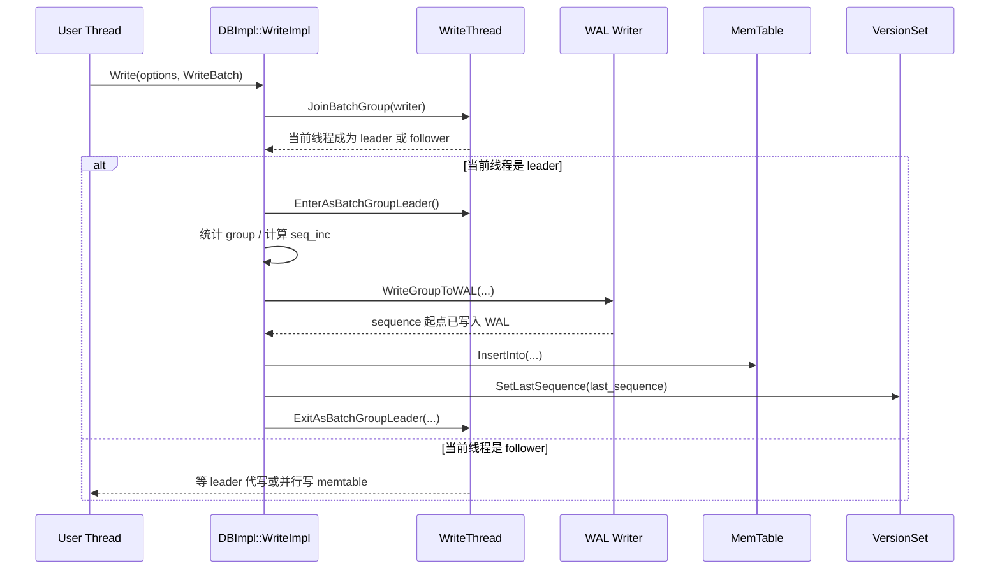

## 今日主题

- 主主题：`Write Path / WriteBatch / Sequence Number`
- 副主题：`WriteThread 如何把多个写请求折叠成一个 group`

## 学习目标

- 讲清用户一次 `Put/Write` 最终是如何走到 `DBImpl::WriteImpl()` 的。
- 讲清 `WriteBatch` 在写路径里到底扮演什么角色，它为什么要在 header 里保存 `sequence + count`。
- 讲清 sequence number 是什么时候分配的、分配给谁、又是怎么传进 memtable 的。
- 讲清 `WriteThread` 为什么要分 leader / follower，以及 batch group 的边界是怎么定的。
- 给后面学习 `WAL`、`MemTable`、`Snapshot / 可见性` 留出清晰的源码入口。

## 前置回顾

- Day 002 结束在 `DB::Open -> Recover -> CreateWAL -> LogAndApplyForRecovery -> InstallSuperVersion`。
- 那一章解决的是“数据库如何从磁盘和 WAL 恢复成可服务状态”。
- Day 003 要接着回答另一个问题：数据库已经 open 起来以后，新的写请求是如何被接进去的。

## 源码入口

- `D:\program\rocksdb\include\rocksdb\db.h`
- `D:\program\rocksdb\include\rocksdb\write_batch.h`
- `D:\program\rocksdb\db\db_impl\db_impl_write.cc`
- `D:\program\rocksdb\db\write_thread.h`
- `D:\program\rocksdb\db\write_thread.cc`
- `D:\program\rocksdb\db\write_batch_internal.h`
- `D:\program\rocksdb\db\write_batch.cc`
- `D:\program\rocksdb\db\dbformat.h`

## 它解决什么问题

写路径真正要同时满足 4 件事：

1. 给每次写入分配全局有序的 `sequence number`，后续读路径和 snapshot 都要靠它判断可见性。
2. 把这次更新可靠地落到 `WAL`，保证崩溃恢复时不会丢掉已经承诺成功的写。
3. 把更新写进 `memtable`，让前台读尽快看见它。
4. 在高并发写入下避免每个线程都单独抢锁、单独写 WAL、单独更新共享状态，于是需要 `WriteThread` 做 batching。

一句话概括：

`WriteImpl()` 要把“用户提交的一批逻辑更新”变成“带有有序 sequence 的 WAL 记录和 memtable 状态变化”。

## 它是怎么工作的

先看主流程图：



再换成更短的骨架：

1. 用户线程进入 `DBImpl::WriteImpl()`
2. 注册成一个 `WriteThread::Writer`
3. 进入 `JoinBatchGroup()` 排队
4. leader 决定这次 group 里要包含哪些 writer
5. leader 计算这组写一共要消耗多少 sequence
6. leader 把合并后的 batch 写进 WAL
7. 再把对应 batch 插进 memtable
8. 最后发布 `LastSequence`

这里最重要的顺序是：

`先拿到 sequence 范围 -> 写 WAL -> 写 memtable -> 发布 last_sequence`

## 关键数据结构与实现点

### `WriteBatch`

- 是一次逻辑写入的容器，不只是一个“操作列表”。
- 它的 header 直接带着：
  - `sequence`
  - `count`
- 写 WAL 时，这个 batch 会带着起始 sequence 一起落盘。
- 写 memtable 时，`Iterate(&inserter)` 会按顺序把每条记录展开，并随着 `inserter.sequence()` 递增。

### `WriteThread::Writer`

- 表示一个正在等待或执行的写请求。
- 它保存：
  - `batch`
  - `state`
  - `sequence`
  - `wal_used`
  - 各类 callback
- `sequence` 不是在用户线程创建 batch 时写好的，而是在真正执行写路径时才填进去。

### `WriteThread::WriteGroup`

- 一次由 leader 领衔的批量写分组。
- 关注三个字段：
  - `leader`
  - `last_writer`
  - `last_sequence`
- 它是“这一组请求共享一次 WAL 写入和一次顺序推进”的边界。

### `SequenceNumber`

- 在 `dbformat.h` 中是 RocksDB 内部 key 语义的核心组成部分。
- 它最终会和 `ValueType` 一起编码进 internal key。
- Day 003 先只抓住一点：
  - 写路径负责分配 sequence
  - 读路径和 snapshot 后面会消费它

## 源码细读

这次抓 8 个片段，分别回答 8 个问题。

### 1. 用户写请求最后收敛到哪里

```cpp
// db/db_impl/db_impl_write.cc, DBImpl::Write(...)
Status DBImpl::Write(const WriteOptions& write_options, WriteBatch* my_batch) {
  Status s;
  ...
  if (s.ok()) {
    s = WriteImpl(write_options, my_batch, /*callback=*/nullptr,
                  /*user_write_cb=*/nullptr,
                  /*wal_used=*/nullptr);
  }
  return s;
}
```

这一段的意义很简单，但值得明确记住：

- 对前台正常写入来说，真正的核心入口不是 `Put()`，而是 `WriteImpl()`。
- 后面看写路径时，应该优先顺着 `DBImpl::WriteImpl()` 读，而不是在各种 API overload 里绕。

### 2. `WriteBatch` 为什么能承载 sequence

`write_batch.cc` 开头已经把格式说得很直白了：

```cpp
// db/write_batch.cc, WriteBatch::rep_ 格式说明
// WriteBatch::rep_ :=
//    sequence: fixed64
//    count: fixed32
//    data: record[count]
// ...
```

再看真正读写 header 的代码：

```cpp
// db/write_batch.cc, WriteBatchInternal::{Count, Sequence, SetSequence}
uint32_t WriteBatchInternal::Count(const WriteBatch* b) {
  return DecodeFixed32(b->rep_.data() + 8);
}

...

SequenceNumber WriteBatchInternal::Sequence(const WriteBatch* b) {
  return SequenceNumber(DecodeFixed64(b->rep_.data()));
}

void WriteBatchInternal::SetSequence(WriteBatch* b, SequenceNumber seq) {
  EncodeFixed64(b->rep_.data(), seq);
}
```

这里要抓住两个点：

- `WriteBatch` 不是纯逻辑对象，它的二进制表示天然适合直接写 WAL。
- `SetSequence()` 说明 sequence 并不是每条记录单独先写好，而是先写 batch header，再在遍历 batch 时递增使用。

### 3. 写线程为什么先变成 `Writer`

先看 `Writer` 里最关键的几个字段：

```cpp
// db/write_thread.h, class WriteThread::Writer
struct Writer {
  WriteBatch* batch;
  ...
  std::atomic<uint8_t> state;
  WriteGroup* write_group;
  SequenceNumber sequence;  // 当前 writer 第一条 key 使用的 sequence
  Status status;
  ...
};
```

这段说明了一个容易忽略的事实：

- RocksDB 不是直接把“线程”排队，而是把“写请求描述符”排队。
- 这让 leader 可以代别的线程完成一部分工作，比如：
  - 合并 WAL 写入
  - 直接帮 follower 完成顺序 memtable 写
  - 或通知 follower 并行写 memtable

### 4. `JoinBatchGroup()` 到底做了什么

```cpp
// db/write_thread.cc, WriteThread::JoinBatchGroup(...)
void WriteThread::JoinBatchGroup(Writer* w) {
  ...
  bool linked_as_leader = LinkOne(w, &newest_writer_);

  w->CheckWriteEnqueuedCallback();

  if (linked_as_leader) {
    SetState(w, STATE_GROUP_LEADER);
  }

  ...

  if (!linked_as_leader) {
    ...
    AwaitState(w,
               STATE_GROUP_LEADER | STATE_MEMTABLE_WRITER_LEADER |
                   STATE_PARALLEL_MEMTABLE_CALLER |
                   STATE_PARALLEL_MEMTABLE_WRITER | STATE_COMPLETED,
               &jbg_ctx);
    ...
  }
}
```

这一段说明：

- 每个写请求先挂到 `newest_writer_` 链上。
- 如果自己是第一个，就直接变 leader。
- 如果不是，就等待 leader 分配角色。

也就是说，`JoinBatchGroup()` 不是“马上写”，而是“先进入一个写执行编排系统”。

### 5. leader 怎么决定哪些 writer 能并进来

```cpp
// db/write_thread.cc, WriteThread::EnterAsBatchGroupLeader(...)
size_t WriteThread::EnterAsBatchGroupLeader(Writer* leader,
                                            WriteGroup* write_group) {
  ...
  size_t size = WriteBatchInternal::ByteSize(leader->batch);
  size_t max_size = max_write_batch_group_size_bytes;
  const uint64_t min_batch_size_bytes = max_write_batch_group_size_bytes / 8;
  if (size <= min_batch_size_bytes) {
    max_size = size + min_batch_size_bytes;
  }
  ...
  while (w != newest_writer) {
    ...
    if ((w->sync && !leader->sync) ||
        (w->no_slowdown != leader->no_slowdown) ||
        (w->disable_wal != leader->disable_wal) ||
        (w->protection_bytes_per_key != leader->protection_bytes_per_key) ||
        (w->rate_limiter_priority != leader->rate_limiter_priority) ||
        (w->batch == nullptr) ||
        (w->callback != nullptr && !w->callback->AllowWriteBatching()) ||
        (size + WriteBatchInternal::ByteSize(w->batch) > max_size) ||
        (leader->ingest_wbwi || w->ingest_wbwi)) {
      ...
    } else {
      w->write_group = write_group;
      size += WriteBatchInternal::ByteSize(w->batch);
      write_group->last_writer = w;
      write_group->size++;
    }
  }
  ...
}
```

这一段是 Day 003 很关键的“去神秘化”片段。

它说明 batch group 并不是“谁排在后面就都并进来”，而是要满足兼容条件：

- sync 语义兼容
- slowdown 语义兼容
- `disableWAL` 兼容
- callback 愿意被 batching
- 总大小不能太大

所以 `WriteThread` 的 batching 不是粗暴拼单，而是“在语义兼容前提下做折叠”。

### 6. `WriteImpl()` 主流程里 sequence 是怎么被算出来的

先看主链里最关键的一段：

```cpp
// db/db_impl/db_impl_write.cc, DBImpl::WriteImpl(...)
write_thread_.JoinBatchGroup(&w);
...
last_batch_group_size_ =
    write_thread_.EnterAsBatchGroupLeader(&w, &write_group);
...
size_t total_count = 0;
size_t valid_batches = 0;
...
for (auto* writer : write_group) {
  ...
  if (writer->ShouldWriteToMemtable()) {
    total_count += WriteBatchInternal::Count(writer->batch);
    ...
  }
}
...
seq_inc = seq_per_batch_ ? valid_batches : total_count;
...
if (!two_write_queues_) {
  ...
  io_s = WriteGroupToWAL(write_group, wal_context.writer, wal_used,
                         wal_context.need_wal_sync,
                         wal_context.need_wal_dir_sync, last_sequence + 1,
                         *wal_context.wal_file_number_size);
} else {
  ...
  io_s = ConcurrentWriteGroupToWAL(write_group, wal_used, &last_sequence,
                                   seq_inc);
}
...
const SequenceNumber current_sequence = last_sequence + 1;
last_sequence += seq_inc;
// 当前 group 分配到的 sequence 区间是 [current_sequence, last_sequence]
```

这段代码回答了 Day 003 的核心问题：

- 不是一进 `WriteImpl()` 就立刻拿 sequence。
- leader 先知道这一组 group 总共要消耗多少 sequence。
- 然后把整个区间一次性划出来。

如果你以后读源码时只记一个结论，就记这个：

`sequence 是按 write group 统一预留的，不是每条 key 临时抢一个。`

### 7. sequence 为什么会先进 WAL

```cpp
// db/db_impl/db_impl_write.cc, DBImpl::WriteGroupToWAL(...)
io_s = status_to_io_status(MergeBatch(write_group, &tmp_batch_, &merged_batch,
                                      &write_with_wal, &to_be_cached_state));
...
WriteBatchInternal::SetSequence(merged_batch, sequence);
...
io_s = WriteToWAL(*merged_batch, write_options, log_writer, wal_used,
                  &log_size, wal_file_number_size, sequence);
```

再看 `WriteToWAL()`：

```cpp
// db/db_impl/db_impl_write.cc, DBImpl::WriteToWAL(...)
Slice log_entry = WriteBatchInternal::Contents(&merged_batch);
...
io_s = log_writer->AddRecord(write_options, log_entry, sequence);
...
if (wal_used != nullptr) {
  *wal_used = cur_wal_number_;
  ...
}
```

这里要看清两层含义：

- leader 可能会先把多个 writer 的 batch merge 成一个大 batch。
- 然后给这个 merged batch 写入起始 sequence，再整体落 WAL。

这就是为什么恢复时可以从 WAL replay 出相同顺序：

- WAL 里已经带着这批写的 sequence 起点
- replay 时再按相同 batch 顺序展开，就能复原出相同的 sequence 递增过程

### 8. WAL 写完后，sequence 又是怎么传给 memtable 的

先看 group 版本的 `InsertInto()`：

```cpp
// db/write_batch.cc, WriteBatchInternal::InsertInto(WriteGroup&, ...)
Status WriteBatchInternal::InsertInto(
    WriteThread::WriteGroup& write_group, SequenceNumber sequence,
    ColumnFamilyMemTables* memtables, FlushScheduler* flush_scheduler,
    TrimHistoryScheduler* trim_history_scheduler,
    bool ignore_missing_column_families, uint64_t recovery_log_number, DB* db,
    bool seq_per_batch, bool batch_per_txn) {
  MemTableInserter inserter(
      sequence, memtables, flush_scheduler, trim_history_scheduler,
      ignore_missing_column_families, recovery_log_number, db,
      /* 并发 memtable 写关闭 */ false, nullptr, nullptr, seq_per_batch,
      batch_per_txn);
  for (auto w : write_group) {
    ...
    w->sequence = inserter.sequence();
    ...
    SetSequence(w->batch, inserter.sequence());
    ...
    w->status = w->batch->Iterate(&inserter);
    ...
  }
  return Status::OK();
}
```

再对照 `WriteImpl()` 里真正调用它的地方：

```cpp
// db/db_impl/db_impl_write.cc, DBImpl::WriteImpl(...)
if (!parallel) {
  w.status = WriteBatchInternal::InsertInto(
      write_group, current_sequence, column_family_memtables_.get(),
      &flush_scheduler_, &trim_history_scheduler_,
      write_options.ignore_missing_column_families,
      0 /* recovery_log_number */, this, seq_per_batch_, batch_per_txn_);
} else {
  write_group.last_sequence = last_sequence;
  write_thread_.LaunchParallelMemTableWriters(&write_group);
  ...
  w.status = WriteBatchInternal::InsertInto(
      &w, w.sequence, &column_family_memtables, &flush_scheduler_,
      &trim_history_scheduler_,
      write_options.ignore_missing_column_families, 0 /* recovery_log_number */,
      this, true /* 并发 memtable 写 */, seq_per_batch_,
      w.batch_cnt, batch_per_txn_,
      write_options.memtable_insert_hint_per_batch);
}
```

这两段合起来说明：

- WAL 成功后，memtable 插入并不是重新分配 sequence。
- 它直接沿用刚才那段已经预留好的 sequence 区间。
- 顺序模式下，leader 串行推进 `MemTableInserter.sequence()`。
- 并行模式下，每个 writer 先拿到自己的起始 `w.sequence`，再各自并发插入。

### 9. 最后什么时候才正式“发布”这次写入

```cpp
// db/db_impl/db_impl_write.cc, DBImpl::WriteImpl(...)
if (should_exit_batch_group) {
  if (status.ok()) {
    ...
    if (w.status.ok()) {  // 不发布部分成功的 batch 写入
      versions_->SetLastSequence(last_sequence);
    }
  }
  ...
  write_thread_.ExitAsBatchGroupLeader(write_group, status);
}
```

这里和 Day 002 能连起来：

- Day 002 学的是 open 阶段如何恢复 `LastSequence`
- Day 003 学的是运行时如何推进 `LastSequence`

也就是说，`LastSequence` 既是恢复后的起点，也是实时写入持续向前推进的全局游标。

## 常见误区或易混点

### 误区 1：`WriteBatch` 一创建就自带 sequence

不对。  
`WriteBatch` 创建时只是“有一个预留好的 header 位置”，真正的 sequence 是在写路径执行时通过 `SetSequence()` 填进去的。

### 误区 2：每条 key 都单独去全局抢 sequence

不对。  
常见路径下是 leader 先为整个 write group 预留一个连续区间，再由 batch / memtable 插入逻辑顺序消耗。

### 误区 3：`JoinBatchGroup()` 之后 follower 就什么都不做

不一定。  
如果启用并发 memtable 写，follower 可能会被唤醒去做自己的 memtable 插入。

### 误区 4：`SetLastSequence()` 就等于已经写 WAL

不对。  
`SetLastSequence()` 是更靠后的“发布”动作，前面已经经历了 WAL 写入和 memtable 插入。

## 设计动机

这一章值得补一个 `设计动机`，因为这里有很明显的取舍。

RocksDB 不让每个写线程各自独立完成“分配 sequence + 写 WAL + 写 memtable”，主要是为了压缩共享状态上的竞争：

- sequence 分配希望保持连续有序
- WAL 追加希望尽量合并、减少小写
- 共享队列和统计更新希望集中处理

代价是：

- 写路径实现明显更复杂
- 需要维护 leader / follower / 并发 memtable writer 这些状态机
- 读源码时如果没有先抓骨架，很容易迷失在分支里

## 工程启发

- 把“请求排队”和“真正执行”拆开，是一种很强的并发控制套路。
- 先为一组请求统一预留逻辑顺序，再局部展开执行，能显著降低全局共享元数据的竞争。
- 如果系统既要吞吐又要顺序语义，`group + publish` 往往比“每条请求独立提交”更稳。
- RocksDB 的日志聚合是机会主义的，而不是时间窗口驱动的：
  - 它不主动等待更多请求来凑批，因此不会为了 batching 人为拉长单次写延迟。
  - 但一旦并发写自然形成排队，leader 又能立刻把兼容请求折叠进同一个 `write group`，把一次 WAL append 扩展成多请求共享。
  - 这种设计说明 RocksDB 更偏向“优先覆盖更宽的 workload 范围，再从自然形成的并发中提取聚合收益”，而不是“为了追求更大批次而主动攒批”。

## 今日问题与讨论

### 我的问题

#### 问题 1：为什么 sequence 不是在用户构造 `WriteBatch` 时就确定

- 简答：
  - 因为 sequence 必须反映“真正进入数据库的全局顺序”，而不是用户在线程本地创建 batch 的时间点。
- 源码依据：
  - `DBImpl::WriteImpl()` 中 leader 先统计 group，再在 `WriteGroupToWAL()` / `ConcurrentWriteGroupToWAL()` 中推进 sequence。
  - `WriteBatchInternal::SetSequence()` 在真正写路径执行时才被调用。
- 当前结论：
  - sequence 属于数据库运行时分配的提交顺序，不属于 API 层的提前编号。
- 是否需要后续回看：
  - `yes`，后面学 snapshot / 可见性时还要回来验证这件事。

#### 问题 2：为什么 WAL 写完后还要再把 batch 的 sequence 填给 memtable

- 简答：
  - 因为 memtable 和恢复路径都需要以相同顺序解释这批记录；WAL 和 memtable 不是两套独立编号。
- 源码依据：
  - `WriteGroupToWAL()` 先 `SetSequence(merged_batch, sequence)` 再写 WAL。
  - `WriteBatchInternal::InsertInto()` 再 `SetSequence(w->batch, inserter.sequence())` 后迭代插入 memtable。
- 当前结论：
  - 同一套 sequence 同时服务于持久化顺序和内存可见性顺序。
- 是否需要后续回看：
  - `yes`，读路径和 WAL 章节还要继续细化。

#### 问题 3：RocksDB 的一次前台写请求，是不是写入 memtable 后就算结束；`memtable -> imm -> SST -> L0` 是否都是后台进行

- 简答：
  - 对默认写路径来说，前台写请求通常在“`WAL` 已写入 + `memtable` 已更新 + `LastSequence` 已发布”时就算完成。
  - 从 `imm memtable` flush 成 `SST / L0` 通常是后台线程做的。
  - 但有一个细节不能说得过满：`mem -> imm` 的切换本身，有时会在前台写线程里触发；后台做的主要是 flush job 和后续 compaction。
- 源码依据：
  - `db/db_impl/db_impl_write.cc` 中 `DBImpl::WriteImpl(...)` 先 `WriteGroupToWAL(...)`，再 `WriteBatchInternal::InsertInto(...)`，最后 `versions_->SetLastSequence(last_sequence)`。
  - `db/db_impl/db_impl_write.cc` 中 `ScheduleFlushes(...) / HandleWriteBufferManagerFlush(...)` 会在前台写路径里调用 `SwitchMemtable(...)`，把当前 mutable memtable 挂到 `imm()` 上，并新建一个 memtable。
  - `db/db_impl/db_impl_write.cc` 中 `SwitchMemtable(...)` 的关键动作是：
    - `cfd->imm()->Add(cfd->mem(), ...)`
    - `cfd->SetMemtable(new_mem)`
    - `InstallSuperVersionAndScheduleWork(...)`
  - `db/db_impl/db_impl_compaction_flush.cc` 中 `MaybeScheduleFlushOrCompaction()` 通过 `env_->Schedule(&DBImpl::BGWorkFlush, ...)` 把 flush 任务调度到后台线程。
  - `db/db_impl/db_impl_compaction_flush.cc` 中 `BackgroundCallFlush(...)` / `BackgroundFlush(...)` / `FlushMemTablesToOutputFiles(...)` 才真正把 immutable memtable 刷成 SST。
- 当前结论：
  - 可以把“用户写请求成功”理解为前台先完成了可恢复性和可见性：
    - 默认情况下：`WAL + memtable`
    - 然后发布 `LastSequence`
  - 而 `imm -> SST -> L0` 以及更后面的 compaction，通常属于后台整理 LSM 的过程。
  - 但不要把“写请求结束”误解成“这次写一定还停留在 mutable memtable 里”；在写压、WAL 切换、write buffer manager 触发 flush 等情况下，前台线程可能顺手把旧 memtable 切成 immutable。
- 是否需要后续回看：
  - `yes`，等 Day 004 `WAL`、Day 005 `MemTable / SkipList / Arena`、Day 006 `Flush` 时继续压实这条边界。

#### 问题 4：RocksDB 里看到 `pipelined write`，它的大概逻辑是什么

- 简答：
  - `pipelined write` 不是改变“先 WAL、后 memtable”的基本语义，而是把这两个阶段拆成两段流水线。
  - 默认写路径里，一个 leader 往往要把“WAL 写入 + memtable 写入”整组做完才交棒。
  - `pipelined write` 里，前一组写请求在做 memtable 插入时，后一组请求已经可以开始做 WAL 阶段了，因此两个阶段能部分重叠。
- 源码依据：
  - `db/db_impl/db_impl_write.cc` 中 `DBImpl::WriteImpl(...)` 如果 `immutable_db_options_.enable_pipelined_write` 为真，会走 `PipelinedWriteImpl(...)`。
  - `db/db_impl/db_impl_write.cc` 中 `PipelinedWriteImpl(...)` 先组织 `wal_write_group`，完成：
    - `EnterAsBatchGroupLeader(...)`
    - sequence 计算
    - `WriteGroupToWAL(...)`
    - `ExitAsBatchGroupLeader(...)`
  - 然后再进入第二阶段的 `memtable_write_group`，由：
    - `STATE_MEMTABLE_WRITER_LEADER`
    - `EnterAsMemTableWriter(...)`
    - `WriteBatchInternal::InsertInto(...)`
    - `ExitAsMemTableWriter(...)`
    完成 memtable 插入。
  - `db/write_thread.cc` 中 `ExitAsBatchGroupLeader(...)` 在 pipelined 模式下会把还需要写 memtable 的 writer 链接到 `newest_memtable_writer_`，并唤醒 `STATE_MEMTABLE_WRITER_LEADER`，这正是“WAL 阶段”和“memtable 阶段”拆开的关键。
- 当前结论：
  - `pipelined write` 的目标主要是提高吞吐，让 WAL 阶段和 memtable 阶段形成重叠，而不是让一条写跳过 WAL 或颠倒顺序。
  - 对单条写的逻辑顺序来说，仍然是“先 WAL，后 memtable”。
  - 变化的是系统层面的执行方式：不同批次之间可以像流水线一样并行推进不同阶段。
- 是否需要后续回看：
  - `yes`，这条线和 `WAL`、`MemTable` 章节直接相关，但 Day 003 先只保留骨架理解，不展开状态机细节。

#### 问题 5：sequence 不是 logger 返回的，而是在 `WriteImpl()` 里先算好，这是否意味着写日志顺序是由 `WriteImpl / WriteThread` 保证的

- 简答：
  - 你的理解方向是对的。
  - 在 RocksDB 里，sequence 的分配权不在 logger 手里，而在 DB 写路径自己手里。
  - logger 更像“按给定顺序追加记录的执行器”，而不是“谁先写进去就给谁编号”的顺序裁判。
  - 但更精确地说，保证顺序的不是单独一个 `JoinBatchGroup()`，而是整套 `WriteThread leader 交接协议 + 某些模式下的 wal_write_mutex_`。
- 源码依据：
  - `db/db_impl/db_impl_write.cc` 中默认路径先在 `WriteImpl(...)` 里取 `last_sequence = versions_->LastSequence()`，再把 `last_sequence + 1` 传给 `WriteGroupToWAL(...)`。
  - 同文件里有明确注释：
    - `... &w is currently responsible for logging and protects against concurrent loggers ...`
  - `db/write_thread.h` 里也明确写了：
    - 正确性依赖于“同一时刻只有一个 leader”。
  - `db/write_thread.cc` 中 `JoinBatchGroup(...)` 会让第一个 writer 成为 `STATE_GROUP_LEADER`，`ExitAsBatchGroupLeader(...)` 再把领导权显式移交给下一个 leader。
  - 但在 `two_write_queues_` 分支里，`db/db_impl/db_impl_write.cc` 又明确写了：
    - `LastAllocatedSequence is increased inside WriteToWAL under wal_write_mutex_ to ensure ordered events in WAL`
    - 也就是该模式下不仅靠 leader，还额外靠 `wal_write_mutex_` 保证 WAL 顺序。
  - 在 `pipelined write` 分支里，sequence 也是先由写线程阶段算出，再传给 `WriteGroupToWAL(...)`，不是由 logger 回填。
- 当前结论：
  - 是的，RocksDB 的设计前提之一就是：
    - sequence 顺序由 DB 写路径先决定
    - WAL 追加顺序必须服从这个顺序
    - 不能反过来靠 logger 的“谁先 append 成功”来决定 sequence
  - 但如果要把这件事说完整，建议表述成：
    - 默认写路径下，`WriteThread` 的单 leader 机制基本保证了同一时刻只有一个 group 在推进 WAL
    - 在并发写队列等特殊模式下，还要结合 `wal_write_mutex_` 一起看
  - 所以你的原句可以稍微修正为：
    - “这段代码蕴含的不是 logger 决定顺序，而是 RocksDB 写路径先决定顺序；默认模式下主要靠 `WriteThread` 的 leader 串行化，某些并发模式下还要加上 `wal_write_mutex_`。”
- 是否需要后续回看：
  - `yes`，等 Day 004 `WAL` 时，可以专门把“顺序由谁决定”作为一个小节再压实一次。

#### 问题 6：RocksDB 是怎么做日志聚合的，终止条件是什么；如果长时间没有新写入，会不会靠时钟超时来结束聚合

- 简答：
  - RocksDB 的日志聚合不是“攒一会儿再发”的时间窗口模型，而是“当前 leader 看到队列里已有多少兼容 writer，就一次性把这批拿走”的队列模型。
  - 终止条件主要不是时钟超时，而是：
    - 已经走到当前队尾
    - 遇到不兼容 writer
    - 或者 batch 大小达到上限
  - 如果长时间没有新写入，那么当前 group 就按已经拿到的内容直接继续执行；源码里这里没有看到“等待额外若干微秒以便继续聚合”的时钟逻辑。
- 源码依据：
  - `db/write_thread.cc` 中 `EnterAsBatchGroupLeader(...)` 先取 `newest_writer = newest_writer_.load(...)`，然后只遍历从当前 leader 到“那一刻的 newest_writer”为止的 writer。
  - 同函数里的终止/切分条件主要是：
    - `sync / no_slowdown / disable_wal / protection_bytes_per_key / rate_limiter_priority` 不兼容
    - callback 不允许 batching
    - `size + ByteSize(w->batch) > max_size`
    - `ingest_wbwi` 需要独占 group
  - 整个函数里没有“等待更多 writer 到来再凑一批”的 timeout 分支。
- 当前结论：
  - RocksDB 的日志聚合更像“队列截断 + 兼容性过滤”，而不是“按时间窗口收集”。
  - 所以如果当前只有一个写请求，leader 通常就直接带着这个单元素 group 往下走，不会为了多聚合几个请求而额外等一个时钟。
- 是否需要后续回看：
  - `yes`，后面看性能调优时可以再回来看 batching 大小和吞吐关系。

#### 问题 7：当前 write group 还在经历 WAL、memtable 等阶段时，新来的前台写会怎么处理

- 简答：
  - 新来的前台写不会插进当前已经确定好的 write group 里。
  - 它会继续挂到 `newest_writer_` 队列尾部，等待当前 leader 完成这一轮并显式交棒给下一任 leader。
  - 在 pipelined write 模式下，情况更进一步：新来的写有机会在前一批做 memtable 时，先进入下一批的 WAL 阶段。
- 源码依据：
  - `db/write_thread.h` 明确写了正确性依赖于“同一时刻只有一个 leader”。
  - `db/write_thread.cc` 中 `EnterAsBatchGroupLeader(...)` 一开始就把本轮观察范围固定在当时的 `newest_writer_`；后面新到的 writer 不属于这轮 group。
  - 同文件 `ExitAsBatchGroupLeader(...)` 中，默认模式下会在当前 group 完成后把 `last_writer->link_newer` 设成下一任 leader，并 `SetState(..., STATE_GROUP_LEADER)`。
  - `db/db_impl/db_impl_write.cc` 里也有注释：
    - 当前 `&w` 正在负责 logging，并保护当前阶段不被并发 logger 干扰。
  - 在 `PipelinedWriteImpl(...)` 中，WAL group 完成后会调用 `ExitAsBatchGroupLeader(wal_write_group, ...)`，把后续还需写 memtable 的请求转移到 memtable writer 队列，同时新的 WAL leader 已经可以继续往前推进。
- 当前结论：
  - 默认写路径下：
    - 当前 group 做 `WAL + memtable` 时，新来的写在外面继续排队
    - 等当前 leader 完成后，再由下一任 leader 处理下一批
  - pipelined write 下：
    - 新来的写不一定要等前一批连 memtable 都做完
    - 前一批做 memtable 时，后一批已经可以启动 WAL 阶段
- 是否需要后续回看：
  - `yes`，这条线和 `pipelined write`、`WAL`、`MemTable` 三章都直接相关。

#### 问题 8：如何评价 RocksDB 这套日志聚合策略

- 简答：
  - 这套策略很有工程味道。
  - 它承认 WAL 天然更适合顺序写，因此先把顺序控制收回到 `WriteThread`。
  - 同时它又避免走“主动等待凑批”这条更激进的路线，而是只在并发自然形成时顺手拿 batching 收益。
- 源码依据：
  - `db/write_thread.cc` 中 `EnterAsBatchGroupLeader(...)` 只截取“当前已经在队列里的兼容 writer”，没有看到专门等待更多 writer 的超时窗口。
  - `db/write_thread.h` 与 `db/db_impl/db_impl_write.cc` 明确把“同一时刻单 leader 推进 WAL / memtable”作为基本执行模型。
- 当前结论：
  - RocksDB 的日志聚合是“保守但不浪费机会”的：
    - 低并发时，不为了聚合额外牺牲延迟
    - 高并发时，又能从自然排队里提取可观的 WAL batching 收益
  - 这也是它为什么能同时覆盖：
    - 单线程 / 低并发写入
    - 多线程 / 高并发写入
    这两类差异很大的 workload。
- 是否需要后续回看：
  - `yes`，后面学 WAL 和调优时，这条观察仍然有价值。

### 外部高价值问题

今天先不额外引入外部问题。  
这一章本地源码主线已经足够密集，先把 `WriteImpl / WriteThread / WriteBatchInternal` 这条线吃透更重要。

#### 复习问答回合（2026-04-12）

- 结论：
  - 本轮复习结果判定为 `pass`。
  - 当前已经没有关键误解，可以进入下一章。

1. `WriteThread::JoinBatchGroup()` 和 `EnterAsBatchGroupLeader()` 分别负责什么？
   - 用户回答摘要：
     - `JoinBatchGroup()` 负责把前台写线程组织成 leader / follower，形成日志聚合组。
     - `EnterAsBatchGroupLeader()` 负责在 leader 视角下筛选兼容 writer，形成真正执行的 `WriteGroup`。
   - 评价：
     - 回答正确。
     - 这一题已经抓住了“先排队，再由 leader 组批”的结构。

2. 为什么说 sequence 通常是“按 write group 预留”，而不是“每条 key 单独抢号”？
   - 用户回答摘要：
     - 因为写线程机制会把日志推进串起来，因此可以先按 group 计算 sequence，不需要每个 key 单独抢号。
   - 评价：
     - 大方向正确。
     - 后续还可以再补一句更精确的话：
       - sequence 不只是为了“谁先写日志”，也是为了让这组写在 `WAL` 和 `memtable` 中共享同一套顺序语义。

3. `WriteBatch` 的 header 为什么要保存 `sequence + count`？
   - 用户回答摘要：
     - `count` 便于序列化与解析，`sequence` 用于可见性与并发安全。
   - 评价：
     - 回答可接受，但还不够完整。
     - 这一题更完整的版本应强调：
       - `count` 让 batch 知道自己包含多少逻辑记录；
       - `sequence` 让同一个 batch 在写入 `WAL`、恢复 replay、插入 `memtable` 时都能用同一套起始顺序展开。

4. 为什么写路径通常是“先 WAL，后 memtable”，而不是反过来？
   - 用户回答摘要：
     - 先写 memtable 再写 WAL 会在崩溃时出现状态对不上的风险。
   - 评价：
     - 回答正确。
     - 这一题已经抓住“先保证可恢复性，再保证前台可见性”的顺序。

5. `versions_->SetLastSequence(last_sequence)` 为什么要放在更靠后的发布位置？
   - 用户回答摘要：
     - 因为如果在 batch 还没完全写入 memtable 时就发布，读线程可能看到中间状态。
   - 评价：
     - 回答正确。
     - 这一题已经抓住“不要发布部分成功写入”的核心。

#### 复习问答后的补充澄清（2026-04-12）

- 这轮问答里最值得继续压实的只有两点：
  - `WriteBatch header` 中的 `sequence` 不只是“发布可见性”用，它还直接服务于：
    - `WAL` 落盘
    - recovery replay
    - `memtable` 插入时的顺序展开
  - “按 `write group` 预留 sequence” 的原因，也不只是减少抢号，而是 RocksDB 先在 DB 写路径层面决定这一整组写的顺序，再要求 WAL 和 memtable 共同服从这个顺序。

#### 复习问答结果更新（2026-04-12）

- 当前判定：
  - `review_status: answered`
  - `review_result: pass`
  - `review_block_next: no`
- 本章掌握度更新：
  - 保持 `understanding_status: yellow`
  - `mastery_score` 从 `3/5` 上调到 `4/5`
  - `ready_for_next: yes`
- 保留的回看点：
  - `WriteBatch` header 在 WAL / replay / memtable 三处的统一作用
  - `pipelined write` 与默认写路径的边界

## 今日小结

- `WriteImpl()` 是普通写路径的真正核心入口。
- `WriteThread` 先把写请求组织成 group，再由 leader 统一推进。
- sequence 通常是按 group 预留一段连续区间，不是每条 key 临时抢一个。
- WAL 写入和 memtable 插入共享同一套 sequence 语义。
- `versions_->SetLastSequence(last_sequence)` 是这次写入真正完成发布的末尾动作。

## 明日衔接

Day 003 结束后，最自然的下一章是 `WAL`。

因为今天已经明确：

- sequence 会先写进 WAL
- recovery 依赖 WAL 重新展开 batch

所以下一章正好可以继续追：

- WAL record 物理格式
- `log::Writer::AddRecord()` 怎么分块写
- recovery 时怎么把 WAL record 重新还原成 `WriteBatch`

## 复习题

1. `WriteThread::JoinBatchGroup()` 和 `EnterAsBatchGroupLeader()` 分别负责什么？
2. 为什么说 sequence 通常是“按 write group 预留”，而不是“每条 key 单独抢号”？
3. `WriteBatch` 的 header 为什么要保存 `sequence + count`？
4. 为什么写路径通常是“先 WAL，后 memtable”，而不是反过来？
5. `versions_->SetLastSequence(last_sequence)` 为什么要放在更靠后的发布位置？
