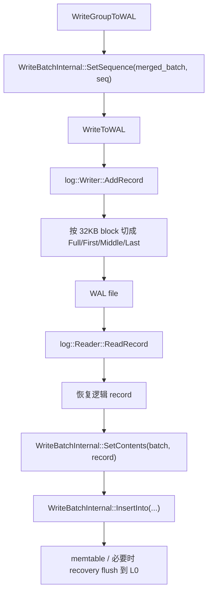
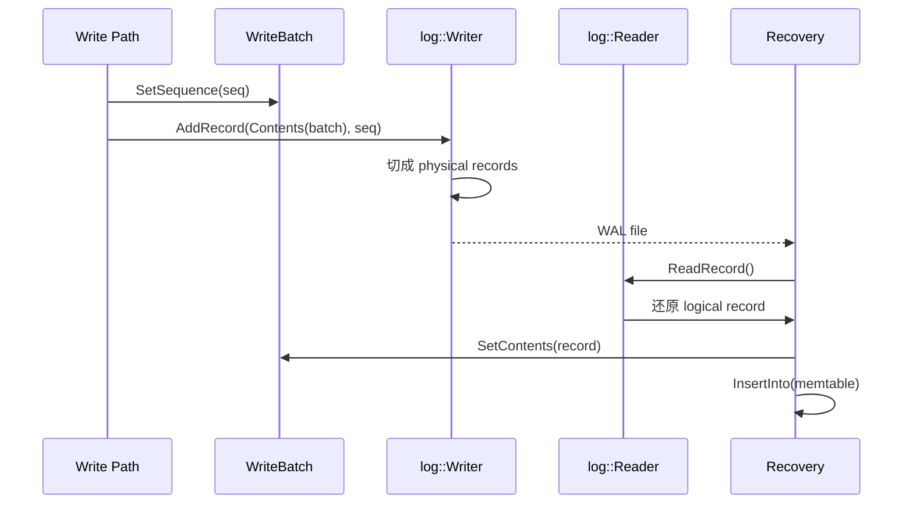

## 今日主题

- 主主题：`WAL`
- 副主题：`WAL 物理格式与 recovery replay 闭环`

## 学习目标

- 讲清 RocksDB 的 WAL 在写路径里到底承载什么，不承载什么。
- 讲清 `WriteBatch` 是怎么被直接变成 WAL record 的。
- 讲清 `log::Writer::AddRecord()` 如何按 block 切分 record。
- 讲清 `log::Reader::ReadRecord()` 如何把碎片重新组装回逻辑 record。
- 讲清 recovery 阶段是怎么把 WAL record 重新变成 `WriteBatch -> memtable` 更新的。

## 前置回顾

- Day 003 已经讲清：写路径先由 DB 层决定 sequence，再写 WAL，再写 memtable。
- 那一章还留下了两个悬而未决的问题：
  - `log::Writer::AddRecord()` 的物理格式是什么
  - recovery 时如何从 WAL 重新还原 `WriteBatch`
- Day 004 就把这两个点接上。

## 源码入口

- `D:\program\rocksdb\db\db_impl\db_impl_write.cc`
- `D:\program\rocksdb\db\log_format.h`
- `D:\program\rocksdb\db\log_writer.h`
- `D:\program\rocksdb\db\log_writer.cc`
- `D:\program\rocksdb\db\log_reader.h`
- `D:\program\rocksdb\db\log_reader.cc`
- `D:\program\rocksdb\db\db_impl\db_impl_open.cc`
- `D:\program\rocksdb\include\rocksdb\wal_filter.h`

## 它解决什么问题

WAL 要解决的不是“把数据永久存盘”这么简单，而是更具体的 3 件事：

1. 在 memtable 还没 flush 成 SST 之前，先把这批更新持久化下来。
2. 把一次逻辑写入的顺序信息一起保存下来，保证崩溃恢复后还能按同样顺序 replay。
3. 给 recovery 一个稳定的输入格式，使它能够把 record 重新变回 `WriteBatch`，再重新打回 memtable。

一句话概括：

WAL 是 RocksDB 写路径的“顺序载体”和“恢复输入”，而不是另起一套独立语义的日志系统。

## 它是怎么工作的

先看一张闭环图：



再把写入和恢复拆开看：



Day 004 最重要的一句话是：

`WAL 写进去的是带 header 的 WriteBatch 二进制内容；recovery 读出来的也是这份二进制内容。`

## 关键数据结构与实现点

### `log::RecordType`

- WAL 不是“一个逻辑 batch 对应一个固定物理 record”。
- 当逻辑 record 太大时，会被切成：
  - `kFullType`
  - `kFirstType`
  - `kMiddleType`
  - `kLastType`
- 这说明 WAL 有“逻辑 record”与“物理 fragment”两层概念。

### block 与 header

- block 大小固定为 `32768` 字节。
- 经典 header 大小为 `7` 字节：
  - checksum `4`
  - length `2`
  - type `1`
- recyclable WAL 还会在 header 里多带一个 log number，所以 header 变成 `11` 字节。

### `WriteBatch`

- 在 Day 003 里它是写路径的逻辑容器。
- 到 Day 004 里，它又多了一个身份：
  - WAL 的逻辑 payload
- 这也是为什么它的 header 里必须有 `sequence + count`。

## 几个关键字节布局图

这一节专门回答一个容易混淆的问题：

- WAL 外层有自己的 physical record header
- 但它的 payload 往往就是一整个 `WriteBatch::rep_`
- 如果多个 writer 被 merge，真正写进去的是一个新的 `merged_batch`

### 1. `WriteBatch::rep_` 的整体布局

```text
WriteBatch::rep_

+----------------------+----------------------+------------------------------+
| sequence (fixed64)   | count (fixed32)      | data: record[count]          |
| 8 bytes              | 4 bytes              | 变长                         |
+----------------------+----------------------+------------------------------+
```

可以把它理解成：

- 前 12 字节是统一 header
- 后面是一串连续的 entry 编码
- WAL 不会重新理解这里面的业务语义，只是把这段 bytes 当 payload 写出去

### 2. 默认列族 `Put(key, value)` 的 entry 布局

```text
record = kTypeValue + key(varstring) + value(varstring)

+----------+--------------------+--------------------+
| type     | key_len + key      | value_len + value  |
| 1 byte   | varint32 + bytes   | varint32 + bytes   |
+----------+--------------------+--------------------+
```

这里没有 column family id，因为默认列族直接用 `kTypeValue` 表示。

### 3. 非默认列族 `Put(cf, key, value)` 的 entry 布局

```text
record = kTypeColumnFamilyValue + cf_id(varint32) + key(varstring) + value(varstring)

+----------+----------------+--------------------+--------------------+
| type     | cf_id          | key_len + key      | value_len + value  |
| 1 byte   | varint32       | varint32 + bytes   | varint32 + bytes   |
+----------+----------------+--------------------+--------------------+
```

默认列族和非默认列族最重要的差别就是：

- 默认列族把“列族语义”编码进 type
- 非默认列族还要显式再带一个 `cf_id`

### 4. `Delete(key)` 的 entry 布局

```text
record = kTypeDeletion + key(varstring)

+----------+--------------------+
| type     | key_len + key      |
| 1 byte   | varint32 + bytes   |
+----------+--------------------+
```

删除没有 value，所以它天然比 put 更短。

### 5. `DeleteRange(begin_key, end_key)` 的 entry 布局

```text
record = kTypeRangeDeletion + begin_key(varstring) + end_key(varstring)

+----------+----------------------+--------------------+
| type     | begin_len + begin    | end_len + end      |
| 1 byte   | varint32 + bytes     | varint32 + bytes   |
+----------+----------------------+--------------------+
```

范围删除不是“很多个 delete 的集合”，它本身就是一种单独的操作类型。

### 6. 一个 WAL logical record 和 `WriteBatch` 的关系

```text
WAL logical record payload

+---------------------------------------------------------------+
| merged_batch.rep_                                              |
|  [sequence][count][entry1][entry2][entry3]...[entryN]         |
+---------------------------------------------------------------+
```

如果当前 write group 只有一个原始 batch，这里的 `merged_batch.rep_` 就等于那个 batch 的 `rep_`。  
如果当前 write group 有多个兼容 batch 被合并，那么这里仍然只有一份 header，而不是“多个完整 batch 首尾相接”。

### 7. 多个原始 batch merge 后的布局变化

```text
原始 batch A
+----------------------+----------------------+---------------+
| seqA                 | countA               | dataA         |
+----------------------+----------------------+---------------+

原始 batch B
+----------------------+----------------------+---------------+
| seqB                 | countB               | dataB         |
+----------------------+----------------------+---------------+

merged_batch
+----------------------+----------------------+-----------------------+
| merged_seq           | countA + countB      | dataA + dataB         |
+----------------------+----------------------+-----------------------+
```

关键点：

- 不是 `headerA + dataA + headerB + dataB`
- 而是保留目标 batch 的一个 header，然后把源 batch 的 data 区追加进去
- count 会被重算成总 entry 数
- sequence 会在写 WAL 前被统一改成这次 merged batch 的起始 sequence

## 源码细读

这次抓 9 个片段，把“写进去什么、怎么切、怎么读回来”一次讲完。

### 1. WAL 的物理记录类型是什么

```cpp
// db/log_format.h, namespace log::RecordType
enum RecordType : uint8_t {
  kZeroType = 0,
  kFullType = 1,
  ...
  kFirstType = 2,
  kMiddleType = 3,
  kLastType = 4,
  ...
};

constexpr unsigned int kBlockSize = 32768;

// Header 是 checksum(4) + length(2) + type(1)
constexpr int kHeaderSize = 4 + 2 + 1;

// Recyclable header 额外带 4 字节 log number
constexpr int kRecyclableHeaderSize = 4 + 2 + 1 + 4;
```

这一段直接定下了 WAL 的物理边界：

- WAL 按 `32KB block` 组织。
- 每个 physical record 先有 header，再有 payload。
- 一个逻辑 record 可能占一个 physical record，也可能被切成多个 fragment。

### 2. 写路径到底把什么交给 WAL

```cpp
// db/db_impl/db_impl_write.cc, DBImpl::WriteToWAL(...)
Slice log_entry = WriteBatchInternal::Contents(&merged_batch);
...
io_s = log_writer->AddRecord(write_options, log_entry, sequence);
```

这一段很关键，因为它把 Day 003 和 Day 004 直接连起来了：

- WAL payload 不是某种新编码格式。
- 它就是 `WriteBatchInternal::Contents(...)` 拿出来的那份 batch 二进制。
- logger 只是把这份 bytes 按 WAL 格式写出去。

### 3. 为什么说 sequence 先由 DB 层决定，再交给 WAL

```cpp
// db/db_impl/db_impl_write.cc, DBImpl::WriteGroupToWAL(...)
WriteBatchInternal::SetSequence(merged_batch, sequence);
...
io_s = WriteToWAL(*merged_batch, write_options, log_writer, wal_used,
                  &log_size, wal_file_number_size, sequence);
```

这里支撑了 Day 003 的那个核心判断：

- sequence 不是 logger 决定的。
- DB 写路径先把 sequence 写进 merged batch header。
- 然后 WAL 只是把“已经带序号的 batch”写出去。

所以 WAL 是顺序载体，不是顺序裁判。

### 4. `AddRecord()` 怎么切分大 record

```cpp
// db/log_writer.cc, log::Writer::AddRecord(...)
const char* ptr = slice.data();
size_t left = slice.size();
...
do {
  const int64_t leftover = kBlockSize - block_offset_;
  ...
  if (leftover < header_size_) {
    ...
    block_offset_ = 0;
  }

  const size_t avail = kBlockSize - block_offset_ - header_size_;
  const size_t fragment_length = (left < avail) ? left : avail;

  RecordType type;
  const bool end = (left == fragment_length && compress_remaining == 0);
  if (begin && end) {
    type = recycle_log_files_ ? kRecyclableFullType : kFullType;
  } else if (begin) {
    type = recycle_log_files_ ? kRecyclableFirstType : kFirstType;
  } else if (end) {
    type = recycle_log_files_ ? kRecyclableLastType : kLastType;
  } else {
    type = recycle_log_files_ ? kRecyclableMiddleType : kMiddleType;
  }

  s = EmitPhysicalRecord(write_options, type, ptr, fragment_length);
  ptr += fragment_length;
  left -= fragment_length;
  begin = false;
} while (s.ok() && (left > 0 || compress_remaining > 0));
```

这里可以直接看出 RocksDB WAL 的物理写法：

- 如果当前 block 剩余空间连 header 都放不下，就先补零到 block 末尾，切到下一个 block。
- 然后计算当前 fragment 最多能写多少字节。
- 再根据是不是开始片段、结束片段，决定 `Full / First / Middle / Last`。

所以一个大的 `WriteBatch` 逻辑 record，在磁盘上可能对应多条 physical records。

### 5. physical record 的 header 到底写了什么

```cpp
// db/log_writer.cc, log::Writer::EmitPhysicalRecord(...)
buf[4] = static_cast<char>(n & 0xff);
buf[5] = static_cast<char>(n >> 8);
buf[6] = static_cast<char>(t);
...
if (t < kRecyclableFullType || t == kSetCompressionType ||
    t == kPredecessorWALInfoType || t == kUserDefinedTimestampSizeType) {
  header_size = kHeaderSize;
} else {
  header_size = kRecyclableHeaderSize;
  EncodeFixed32(buf + 7, static_cast<uint32_t>(log_number_));
  crc = crc32c::Extend(crc, buf + 7, 4);
}
...
uint32_t payload_crc = crc32c::Value(ptr, n);
crc = crc32c::Crc32cCombine(crc, payload_crc, n);
crc = crc32c::Mask(crc);
EncodeFixed32(buf, crc);
...
s = dest_->Append(opts, Slice(buf, header_size), 0 /* crc32c_checksum */);
if (s.ok()) {
  s = dest_->Append(opts, Slice(ptr, n), payload_crc);
}
```

这一段回答“WAL header 里真正有什么”：

- length
- type
- checksum
- recyclable 模式下还有低 32 位 log number

这里也能看出：

- checksum 不是只校验 payload
- 它把 type，以及 recyclable 记录时的 log number，也一起卷进来了

### 6. `AddRecord()` 成功后更新了什么

```cpp
// db/log_writer.cc, log::Writer::AddRecord(...)
if (s.ok()) {
  if (!manual_flush_) {
    s = dest_->Flush(opts);
  }
}

if (s.ok()) {
  last_seqno_recorded_ = std::max(last_seqno_recorded_, seqno);
}
```

这段有两个细节：

- 默认不是“只 append 到 buffer 就算完”，还会 `Flush` 到 file writer。
- writer 会记住 `last_seqno_recorded_`，后面可以拿来做 predecessor WAL info 等校验。

### 7. recovery 怎么把 fragment 重新组装成逻辑 record

```cpp
// db/log_reader.cc, log::Reader::ReadRecord(...)
switch (record_type) {
  case kFullType:
  case kRecyclableFullType:
    ...
    *record = fragment;
    ...
    return true;

  case kFirstType:
  case kRecyclableFirstType:
    ...
    scratch->assign(fragment.data(), fragment.size());
    in_fragmented_record = true;
    break;

  case kMiddleType:
  case kRecyclableMiddleType:
    ...
    scratch->append(fragment.data(), fragment.size());
    break;

  case kLastType:
  case kRecyclableLastType:
    ...
    scratch->append(fragment.data(), fragment.size());
    *record = Slice(*scratch);
    ...
    return true;
}
```

这一段说明 recovery 看的不是 physical record，而是逻辑 record：

- `Full` 直接返回。
- `First/Middle/Last` 先拼到 `scratch`，最后在 `Last` 时一起返回。

所以 Day 004 必须区分两件事：

- 磁盘上存的是 physical fragments
- recovery 拿到的是 reassembled logical record

### 8. recovery 主循环怎么消费这些逻辑 record

```cpp
// db/db_impl/db_impl_open.cc, DBImpl::RecoverLogFiles(...)
while (true) {
  ...
  bool read_record = reader->ReadRecord(
      &record, &scratch, immutable_db_options_.wal_recovery_mode,
      &record_checksum);
  ...
  SequenceNumber prev_next_sequence = *next_sequence;
  Status process_status = ProcessLogRecord(
      record, reader, running_ts_sz, wal_number, fname, read_only, job_id,
      logFileDropped, &reporter, &record_checksum, &last_seqno_observed,
      next_sequence, stop_replay_for_corruption, &status,
      stop_replay_by_wal_filter, version_edits, flushed);
  ...
}
```

这段把 recovery 闭环真正接上了：

- `ReadRecord()` 先还原出一个逻辑 record
- 然后 `ProcessLogRecord(...)` 再把它解释成 batch 并打回 memtable

### 9. recovery 怎么从 WAL record 重新变回 `WriteBatch`

先看 batch 还原：

```cpp
// db/db_impl/db_impl_open.cc, DBImpl::InitializeWriteBatchForLogRecord(...)
Status status = WriteBatchInternal::SetContents(batch, record);
...
*last_seqno_observed = WriteBatchInternal::Sequence(batch_to_use);
```

再看真正插入 memtable：

```cpp
// db/db_impl/db_impl_open.cc, DBImpl::InsertLogRecordToMemtable(...)
Status status = WriteBatchInternal::InsertInto(
    batch_to_use, column_family_memtables_.get(), &flush_scheduler_,
    &trim_history_scheduler_, true, wal_number, this,
    false /* 并发 memtable 写关闭 */, next_sequence, has_valid_writes,
    seq_per_batch_, batch_per_txn_);
```

必要时 recovery 期间还会直接刷成 L0：

```cpp
// db/db_impl/db_impl_open.cc, DBImpl::MaybeWriteLevel0TableForRecovery(...)
while ((cfd = flush_scheduler_.TakeNextColumnFamily()) != nullptr) {
  ...
  status = WriteLevel0TableForRecovery(job_id, cfd, cfd->mem(), edit);
  ...
  cfd->CreateNewMemtable(*next_sequence - 1);
}
```

这三段合起来，正好闭环：

- `record` 本质上就是 `WriteBatch` bytes
- `SetContents(...)` 把它重新装进 `WriteBatch`
- `Sequence(batch_to_use)` 还能直接读回当初写进去的 sequence
- 再 `InsertInto(...)` 重放到 memtable

这也是为什么 Day 003 里一直强调：

`WriteBatch header 里的 sequence，不只是写路径临时字段，它还直接服务于 recovery。`

## 今日问题与讨论

### 我的问题

#### 问题 1：WAL 里存的是不是某种独立于 `WriteBatch` 的专门格式

- 问题：
  - 看起来 WAL 有自己的 header 和 record type，那 payload 还是不是原来的 `WriteBatch`？
- 简答：
  - 是。
  - WAL 有自己的“外层物理包装”，但逻辑 payload 仍然是 `WriteBatchInternal::Contents(...)`。
- 源码依据：
  - `db/db_impl/db_impl_write.cc` 中 `WriteToWAL(...)` 直接取 `WriteBatchInternal::Contents(&merged_batch)` 作为 `log_entry`。
  - recovery 里 `InitializeWriteBatchForLogRecord(...)` 又用 `WriteBatchInternal::SetContents(batch, record)` 反向装回 batch。
- 当前结论：
  - WAL 不是另一份独立编码的业务日志，而是“带物理 header 的 WriteBatch”。
- 是否需要后续回看：
  - `no`

#### 问题 2：为什么 WAL 要区分 `Full / First / Middle / Last`

- 简答：
  - 因为逻辑 record 可能比当前 block 剩余空间大，必须拆成多个 physical fragments。
- 源码依据：
  - `db/log_writer.cc` 中 `AddRecord(...)` 根据 `fragment_length` 和 `begin/end` 选择 `RecordType`。
  - `db/log_reader.cc` 中 `ReadRecord(...)` 再把这些 fragment 拼回逻辑 record。
- 当前结论：
  - `RecordType` 的本质不是业务类型，而是“物理切片位置”。
- 是否需要后续回看：
  - `no`

#### 问题 3：为什么说 WAL 是“顺序载体”，不是“顺序裁判”

- 简答：
  - 因为 sequence 在写入 WAL 之前就已经由 DB 写路径决定，并写进 `WriteBatch` header。
- 源码依据：
  - `db/db_impl/db_impl_write.cc` 中 `WriteGroupToWAL(...)` 先 `SetSequence(merged_batch, sequence)`，再 `WriteToWAL(...)`。
- 当前结论：
  - WAL 服从 DB 写路径决定的顺序，而不是反过来决定顺序。
- 是否需要后续回看：
  - `yes`，和 snapshot / 可见性有直接关系。

#### 问题 4：recovery 时是不是重新解析每条操作，再重新分配 sequence

- 简答：
  - 不是。
  - recovery 直接从 WAL record 里恢复出带原始 sequence 的 `WriteBatch`，再把它插入 memtable。
- 源码依据：
  - `db/db_impl/db_impl_open.cc` 中 `SetContents(...)` 之后直接读取 `WriteBatchInternal::Sequence(batch_to_use)`。
  - 后面再 `InsertInto(...)`。
- 当前结论：
  - recovery 不是重新编号，而是恢复原编号。
- 是否需要后续回看：
  - `yes`，后面读 snapshot 时还会再碰到。

#### 问题 5：`wal_filter` 在 recovery 里大概做什么

- 简答：
  - 它允许应用在 recovery 时检查、忽略、修改或停止回放某条 WAL record。
- 源码依据：
  - `include/rocksdb/wal_filter.h`
  - `db/db_impl/db_impl_open.cc` 中 `InvokeWalFilterIfNeededOnWalRecord(...)`
- 当前结论：
  - `wal_filter` 是 recovery 路径的扩展钩子，不属于默认主线，但值得知道它存在。
- 是否需要后续回看：
  - `yes`，放到高级特性时再深挖。

#### 问题 6：`log::Reader` / `LogReader` 是不是每次只能读取一个日志，因为它用 `Slice` 返回结果并复用 `string`

- 简答：
  - 如果这里的“一个日志”指的是“一个完整 WAL 文件”，那不是。
  - `ReadRecord()` 每次读取的是“一个逻辑 record”。
  - 这个逻辑 record 可能恰好对应一个 `kFullType` physical record，也可能是由 `First + Middle + ... + Last` 多个 fragment 组装出来的。
  - `Slice + scratch string` 的设计，说明它每次只把“当前这一个逻辑 record”的视图借给调用方，而不是把整个 WAL 文件一次性读进来。
- 源码依据：
  - `db/log_reader.h` 中 `ReadRecord(Slice* record, std::string* scratch, ...)` 的注释明确写了：
    - 每次把“next record” 读进 `*record`
    - `*record` 的有效期只持续到下一次 mutating operation 或 `*scratch` 再次被修改
  - `db/log_reader.cc` 中 `Reader::ReadRecord(...)`：
    - `kFullType` 直接 `*record = fragment; return true;`
    - `kFirst/Middle/Last` 则先拼到 `scratch`，最后 `*record = Slice(*scratch); return true;`
  - `db/db_impl/db_impl_open.cc` 中 `RecoverLogFiles(...)` 的主循环也是：
    - 一次 `reader->ReadRecord(...)`
    - 然后立刻 `ProcessLogRecord(...)`
    - 再进入下一轮
- 当前结论：
  - `log::Reader` 的抽象粒度是“流式读取下一个逻辑 WAL record”。
  - 它不是“每次读取整个 WAL 文件”，也不是“每次只读一个物理 fragment 给上层自己拼”。
  - `Slice + string` 只是为了减少拷贝和复用缓冲区：
    - 如果是 `kFullType`，可以直接把 `Slice` 指向当前 fragment
    - 如果是碎片化 record，就把组装结果放进 `scratch`，再让 `Slice` 指向 `scratch`
- 是否需要后续回看：
  - `no`

### 常见误区或易混点

#### 误区 1：一个 WAL record 一定对应一个完整 `WriteBatch`

不对。  
一个逻辑 `WriteBatch` 可能会被切成多个 physical fragments，但 recovery 看到的仍然是一个重新组装后的逻辑 record。

#### 误区 2：WAL 的 fragment type 是业务操作类型

不对。  
`Full / First / Middle / Last` 只表达物理切片位置，不表达 `Put/Delete/Merge` 之类的业务语义。

#### 误区 3：recovery 会给回放的数据重新分配 sequence

不对。  
recovery 直接从 WAL 里恢复原始 `WriteBatch` 内容和 sequence。

## 设计动机

WAL 这里很值得补一个 `设计动机`。

RocksDB 选择让 `WriteBatch` 同时承担两层角色：

- 写路径的逻辑容器
- WAL 的逻辑 payload

这样做的好处是：

- 写入路径不用再做一次业务层重新编码
- recovery 路径也不用再维护另一套业务反序列化语义
- `sequence + count` 的解释在写入和恢复两边保持一致

代价是：

- `WriteBatch` 会变成一个非常核心、影响面很广的结构
- 理解它时不能只把它当 API 层的小工具

## 工程启发

- 如果一个系统既要写前台状态，又要做崩溃恢复，最好尽量让“运行时逻辑对象”和“日志负载对象”共用同一份语义，而不是维护两套平行编码。
- 物理日志格式里把“大逻辑 record”切成 `Full / First / Middle / Last`，是非常经典但仍然实用的工程折中：
  - 写路径实现简单
  - 读路径恢复确定
  - 对大 record 友好
- RocksDB 的 WAL 设计延续了前几章的整体风格：
  - 先由上层决定顺序
  - 下层格式负责承载与恢复
  - 不把顺序决定权偷偷下放到 I/O 层

## 今日问题与讨论

### 我的问题

#### 问题 1：WAL 里的一个 `record` 到底对应一个 `WriteGroup`，还是一个 `WriteBatch`？

- 问题
  - `record` 是一个 `WriteGroup` 一个 record，还是一个 `WriteBatch` 一个 record？
- 简答
  - 更准确地说，WAL 里的一个逻辑 `record` 对应的是当次真正写入 WAL 的那个 `merged_batch`。
  - 如果当前 `WriteGroup` 里只有 leader 自己，或者虽然有多个 writer 但没有真的 merge，那么这个 `record` 就等于一个原始 `WriteBatch`。
  - 如果当前 `WriteGroup` 中有多个兼容 writer 被合并，那么一个 `record` 会承载多个原始 `WriteBatch` 拼出来的结果。
  - 所以它不是“抽象意义上的一个 `WriteGroup` 一个 record”，也不是“永远一个原始 `WriteBatch` 一个 record”，而是“一个真正写入 WAL 的 `merged_batch` 一个 record”。
- 源码依据

```cpp
// db/db_impl/db_impl_write.cc, DBImpl::WriteGroupToWAL(...)
WriteBatch* merged_batch;
io_s = status_to_io_status(MergeBatch(write_group, &tmp_batch_, &merged_batch,
                                      &write_with_wal, &to_be_cached_state));
...
WriteBatchInternal::SetSequence(merged_batch, sequence);
...
io_s = WriteToWAL(*merged_batch, write_options, log_writer, wal_used,
                  &log_size, wal_file_number_size, sequence);
```

```cpp
// db/db_impl/db_impl_write.cc, DBImpl::WriteToWAL(...)
Slice log_entry = WriteBatchInternal::Contents(&merged_batch);
...
io_s = log_writer->AddRecord(write_options, log_entry, sequence);
```

```cpp
// db/write_batch.cc, WriteBatchInternal::Append(...)
SetCount(dst, Count(dst) + src_count);
assert(src->rep_.size() >= WriteBatchInternal::kHeader);
dst->rep_.append(src->rep_.data() + WriteBatchInternal::kHeader, src_len);
...
```

- 当前结论
  - WAL 的逻辑 record 单位就是 `WriteBatchInternal::Contents(merged_batch)`。
  - `merged_batch` 有时等于一个原始 `WriteBatch`，有时是多个原始 `WriteBatch` 经过 `Append(...)` 后形成的新 batch。
  - record 里的 `sequence` 也不是“这一条 record 只有一个 sequence”，而是“这个 batch 的起始 sequence”；batch 里的多条 entry 会从这个起始值连续展开。
- 是否需要后续回看
  - 需要。后面学 snapshot / sequence visibility 时，还要再回看“batch 起始 sequence 如何展开成每条 entry 的 sequence”。

#### 问题 2：`WriteBatch` 是怎么序列化成二进制流的？

- 问题
  - `WriteBatch` 为什么能直接变成 WAL payload？它的二进制格式具体长什么样？
- 简答
  - `WriteBatch` 底层就是一个连续的字节串 `rep_`。
  - 开头固定是 12 字节 header：
    - `fixed64 sequence`
    - `fixed32 count`
  - 后面紧跟 `count` 条操作记录。每条操作记录先写一个 type byte，然后按操作类型再写：
    - 默认列族或非默认列族标识
    - key 的长度和内容
    - value 的长度和内容
    - 某些操作还会带 begin/end key、xid 等额外字段
  - 正因为 `WriteBatchInternal::Contents(...)` 直接返回整段 `rep_`，所以它可以原样拿去当 WAL payload。
- 源码依据

```cpp
// db/write_batch.cc, file-level format comment
// WriteBatch::rep_ :=
//    sequence: fixed64
//    count: fixed32
//    data: record[count]
// record :=
//    kTypeValue varstring varstring
//    kTypeDeletion varstring
//    kTypeSingleDeletion varstring
//    kTypeRangeDeletion varstring varstring
//    kTypeMerge varstring varstring
//    kTypeColumnFamilyValue varint32 varstring varstring
//    ...
// varstring :=
//    len: varint32
//    data: uint8[len]
```

```cpp
// db/write_batch.cc, WriteBatchInternal::Sequence / SetSequence / SetCount(...)
SequenceNumber WriteBatchInternal::Sequence(const WriteBatch* b) {
  return SequenceNumber(DecodeFixed64(b->rep_.data()));
}

void WriteBatchInternal::SetSequence(WriteBatch* b, SequenceNumber seq) {
  EncodeFixed64(b->rep_.data(), seq);
}

...

EncodeFixed32(&b->rep_[8], n);
```

```cpp
// db/write_batch.cc, WriteBatchInternal::Put(...)
WriteBatchInternal::SetCount(b, WriteBatchInternal::Count(b) + 1);
if (column_family_id == 0) {
  b->rep_.push_back(static_cast<char>(kTypeValue));
} else {
  b->rep_.push_back(static_cast<char>(kTypeColumnFamilyValue));
  PutVarint32(&b->rep_, column_family_id);
}
PutLengthPrefixedSlice(&b->rep_, key);
PutLengthPrefixedSlice(&b->rep_, value);
```

```cpp
// db/write_batch.cc, WriteBatchInternal::DeleteRange(...)
WriteBatchInternal::SetCount(b, WriteBatchInternal::Count(b) + 1);
if (column_family_id == 0) {
  b->rep_.push_back(static_cast<char>(kTypeRangeDeletion));
} else {
  b->rep_.push_back(static_cast<char>(kTypeColumnFamilyRangeDeletion));
  PutVarint32(&b->rep_, column_family_id);
}
PutLengthPrefixedSlice(&b->rep_, begin_key);
PutLengthPrefixedSlice(&b->rep_, end_key);
```

```cpp
// db/write_batch.cc, WriteBatchInternal::SetContents(...)
assert(contents.size() >= WriteBatchInternal::kHeader);
...
b->rep_.assign(contents.data(), contents.size());
...
```

- 当前结论
  - `WriteBatch` 的序列化不是“临时导出格式”，而就是它运行时的核心存储格式。
  - header 的 `sequence` 是这个 batch 的起始 sequence，`count` 是 entry 个数。
  - 每条 entry 通过 `type + 可选 cf_id + 若干个 length-prefixed slice` 编码。
  - WAL 只是再给这段字节流包上一层自己的物理外壳：`block + record header + fragment`。
- 是否需要后续回看
  - 需要。后面讲 memtable 插入和 recovery replay 时，可以再回看“同一份 batch bytes 是怎么被解释成多条内部 key 更新”的。

#### 问题 3：为什么会说“一个 record 对应一个 sequence”这句话不够准确？

- 问题
  - 既然写 WAL 前先 `SetSequence(merged_batch, sequence)`，是不是可以说“一个 record 对应一个 sequence”？
- 简答
  - 只能说“一个 WAL record header 里有一个起始 sequence”，不能说“这个 record 只代表一个 sequence”。
  - 因为一个 `WriteBatch` 可以有很多 entry，实际 sequence 会从这个起始值开始，按 entry 顺序连续分配。
- 源码依据

```cpp
// db/write_batch.cc, file-level format comment
// WriteBatch::rep_ :=
//    sequence: fixed64
//    count: fixed32
//    data: record[count]
```

- 当前结论
  - `sequence + count` 这一对 header 字段是连起来看的。
  - `sequence` 给出起点，`count` 给出这批里一共有多少条操作，真正的每条 entry sequence 要靠后续展开。
- 是否需要后续回看
  - 需要。后面 Day 009 讲 snapshot / visibility 时会正式闭环。

#### 问题 4：`merged_batch` 是不是把多个完整 `WriteBatch` 原封不动串起来？

- 问题
  - 如果一个 WAL record 对应一个 `merged_batch`，那是不是等于把多个完整 batch 连同各自 header 一起拼起来？
- 简答
  - 不是。
  - `WriteBatchInternal::Append(...)` 会跳过源 batch 的 header，只把源 batch 的 data 区追加到目标 batch 后面。
  - 所以 merge 后只有一个统一的 header，而不是很多个 batch header 串在一起。
- 源码依据

```cpp
// db/write_batch.cc, WriteBatchInternal::Append(...)
SetCount(dst, Count(dst) + src_count);
assert(src->rep_.size() >= WriteBatchInternal::kHeader);
dst->rep_.append(src->rep_.data() + WriteBatchInternal::kHeader, src_len);
...
```

- 当前结论
  - `merged_batch` 是“重新组织后的单个 batch”，不是“batch 列表的裸拼接”。
  - 这也是 recovery 能继续把它当一个标准 `WriteBatch` 解释的前提。
- 是否需要后续回看
  - `no`

#### 问题 5：`WriteBatch` 里是不是每个原始 batch 都有自己的 CRC？

- 问题
  - 既然 WAL record 只是把 `merged_batch` 当字节流写出去，那是不是每个原始 batch 自己还有独立 CRC / header 等校验信息？
- 简答
  - 就 `WriteBatch::rep_` 这个主格式来说，不是。
  - `WriteBatch` 的核心 header 只有 `sequence + count`，没有一个“每个 batch 内置 CRC 字段”的通用格式。
  - WAL 的 CRC 在更外层的 physical record header 里，由 `log::Writer::EmitPhysicalRecord(...)` 负责。
  - `merged_batch.VerifyChecksum()` 是另一层 batch 保护逻辑，不能简单理解成“每个 batch header 天生自带 CRC”。
- 源码依据

```cpp
// db/write_batch.cc, file-level format comment
// WriteBatch::rep_ :=
//    sequence: fixed64
//    count: fixed32
//    data: record[count]
```

```cpp
// db/db_impl/db_impl_write.cc, DBImpl::WriteToWAL(...)
auto s = merged_batch.VerifyChecksum();
...
io_s = log_writer->AddRecord(write_options, log_entry, sequence);
```

- 当前结论
  - 不能把 `WriteBatch` 想成“内部还有很多个小 WAL record”。
  - RocksDB 是把多个原始 batch 的 entry 展平成一个新的标准 batch，再交给 WAL 外层去做 fragment / header / crc。
- 是否需要后续回看
  - `yes`，后面如果专门看 protection info / checksum，可以再单独拆开。

#### 问题 6：为什么 RocksDB 不专门定义一个“batch 列表”的 WAL 容器，而是非要 merge 成一个 `merged_batch`？

- 问题
  - 看起来 `WriteBatch` 承载了很多职责。为什么不单独定义一个“WAL group payload”类型，专门保存多个 batch？
- 简答
  - 这是一个很明显的工程折中，不是绝对优雅，而是复用现有语义。
  - 当前实现里，WAL payload、recovery 输入、memtable replay 输入，三者都已经围绕 `WriteBatch` 闭环。
  - 如果再引入一个“batch 列表”新类型，就要额外解决：
    - WAL 怎么编码这个新容器
    - recovery 怎么解析这个新容器
    - sequence / count / replay 顺序怎么映射回现有 `InsertInto(...)`
  - 本地源码里开发者其实也明确承认了这不是零拷贝最优方案，而是一个务实实现。
- 源码依据

```cpp
// db/db_impl/db_impl_write.cc, DBImpl::MergeBatch(...)
// WAL needs all of the batches flattened into a single batch.
// We could avoid copying here with an iov-like AddRecord interface
*merged_batch = tmp_batch;
for (auto writer : write_group) {
  ...
  Status s = WriteBatchInternal::Append(*merged_batch, writer->batch,
                                        /*WAL_only*/ true);
  ...
}
```

- 当前结论
  - 你的直觉没错：从“职责纯度”看，`WriteBatch` 的确承载得偏多。
  - 但 RocksDB 这里更优先的是：
    - 统一 WAL payload 语义
    - 统一 recovery 输入语义
    - 避免再维护一套新的 group-level 编解码格式
  - 所以它选择了“在批量写时临时 flatten 成一个标准 `WriteBatch`”，用一些复制成本换更简单的整体闭环。
- 是否需要后续回看
  - `yes`，这其实已经触到 RocksDB 的工程设计风格：宁可让核心类型承担更多职责，也要减少系统内部并行语义格式的数量。

#### 问题 7：`WriteBatch` 一创建出来，`sequence + count` 这 12 字节 header 空间就会预留吗？

- 问题
  - `WriteBatch` 的 `rep_` 是不是只要一构造，就先把 `sequence` 和 `count` 这两个 header 空间占好？
- 简答
  - 对普通构造路径来说，是的。
  - `WriteBatch::WriteBatch(...)` 构造函数里会先 `reserve(...)`，然后直接 `resize(WriteBatchInternal::kHeader)`。
  - 也就是说，一个新建的空 `WriteBatch`，`rep_` 一开始就是至少 12 字节，专门留给 `sequence + count`。
  - 这也是后面 `SetSequence(...)`、`SetCount(...)` 能直接按固定偏移写 header 的前提。
- 源码依据

```cpp
// db/write_batch.cc, WriteBatch::WriteBatch(...)
rep_.reserve((reserved_bytes > WriteBatchInternal::kHeader)
                 ? reserved_bytes
                 : WriteBatchInternal::kHeader);
rep_.resize(WriteBatchInternal::kHeader);
```

```cpp
// db/write_batch.cc, WriteBatch::Clear()
rep_.clear();
rep_.resize(WriteBatchInternal::kHeader);
```

```cpp
// db/write_batch.cc, WriteBatchInternal::SetSequence / SetCount(...)
void WriteBatchInternal::SetSequence(WriteBatch* b, SequenceNumber seq) {
  EncodeFixed64(b->rep_.data(), seq);
}

...

EncodeFixed32(&b->rep_[8], n);
```

- 当前结论
  - 普通新建 `WriteBatch` 时，header 空间是立即预留好的。
  - 一个“空 batch”其实不是 `rep_.size() == 0`，而是“只有 12 字节 header、data 区为空”。
  - `Clear()` 之后也会回到这个状态，而不是彻底变成空字符串。
- 是否需要后续回看
  - `no`

#### 问题 8：既然多个原始 batch 会被 merge 成一个 `merged_batch`，那 RocksDB 把“原子操作对象”看成整个 `merged_batch` 吗？

- 问题
  - 用户提交的是自己的 `WriteBatch`，但写 WAL 时 RocksDB 可能把多个 batch flatten 成一个 `merged_batch`。这是不是意味着系统把整个 `merged_batch` 当成真正的原子对象，而不是用户原始的 batch？
- 简答
  - 不能简单这么说。
  - 更准确的理解是：
    - 在 WAL 侧，RocksDB 确实把一个 write group 扁平化成一个 `merged_batch` 去写，这样 WAL append 的物理单位更像 group 级别。
    - 但在 memtable 插入侧，RocksDB 仍然按原始 `writer->batch` 逐个处理，并给每个原始 batch 单独设置起始 sequence。
    - 最后可见性发布又是 group 级别的，`SetLastSequence(last_sequence)` 会等这一整组都插入成功后才执行。
  - 所以它不是“用户 batch 完全消失，只剩 merged_batch”，而是：
    - WAL 物理持久化用 `merged_batch`
    - memtable replay 和 sequence 边界仍然保留原始 batch
    - 前台发布点则是整个 write group
- 源码依据

```cpp
// db/db_impl/db_impl_write.cc, DBImpl::WriteGroupToWAL(...)
io_s = status_to_io_status(MergeBatch(write_group, &tmp_batch_, &merged_batch,
                                      &write_with_wal, &to_be_cached_state));
...
WriteBatchInternal::SetSequence(merged_batch, sequence);
...
io_s = WriteToWAL(*merged_batch, write_options, log_writer, wal_used,
                  &log_size, wal_file_number_size, sequence);
```

```cpp
// db/write_batch.cc, WriteBatchInternal::InsertInto(write_group, ...)
for (auto w : write_group) {
  ...
  w->sequence = inserter.sequence();
  ...
  SetSequence(w->batch, inserter.sequence());
  ...
  w->status = w->batch->Iterate(&inserter);
  ...
}
```

```cpp
// db/db_impl/db_impl_write.cc, DBImpl::WriteImpl(...)
if (w.status.ok()) {  // 不要发布部分 batch write
  versions_->SetLastSequence(last_sequence);
}
```

- 当前结论
  - 原子性要分三层看：
    - WAL 写入单位：更接近 `merged_batch`
    - memtable 应用单位：仍然保留每个原始 `WriteBatch`
    - 对读路径的可见性发布：更接近整个 write group
  - 从用户视角看，自己的 `WriteBatch` 仍然是一个语义边界；它没有因为 merge 就被拆散成“半个 batch 先可见、半个 batch 后可见”。
  - 但从实现视角看，RocksDB 确实把“整组一起落 WAL、整组一起发布”作为更大的提交边界。
- 是否需要后续回看
  - `yes`，这和后面的 snapshot / sequence visibility 直接相关。

#### 问题 9：恢复时原始 batch 边界会丢失，这不会和正常写入路径冲突吗？

- 问题
  - 正常前台写入时，memtable 是按原始 `writer->batch` 逐个插入的；但 recovery 从 WAL 读出来时，看到的却只是 `merged_batch`。原始 batch 边界既然丢了，为什么不会和正常路径冲突？
- 简答
  - 你的观察是对的：进入 WAL 之后，原始 write group 里的 batch 边界确实不再被完整保留。
  - 但 RocksDB 认为“真正需要恢复的不是原始组装边界本身”，而是：
    - entry 顺序
    - sequence 推进规则
    - batch 级还是 key 级的 sequence 语义
  - 只要 recovery 按和正常写入一致的 sequence 推进规则重新解释 `merged_batch`，语义就能对齐。
  - 也就是说，恢复不是在重放“当时的 write group 结构”，而是在重放“当时最终提交到 memtable 的 sequence 有序更新流”。
- 源码依据

```cpp
// db/db_impl/db_impl_write.cc, DBImpl::WriteImpl(...)
// 注意：这里的 sequence 推进逻辑必须和
// WriteBatchInternal::InsertInto(write_group...)
// 以及 recovery 里对 merged batch 调用的
// WriteBatchInternal::InsertInto(write_batch...) 保持一致。
for (auto* writer : write_group) {
  ...
  if (seq_per_batch_) {
    ...
    next_sequence += writer->batch_cnt;
  } else if (writer->ShouldWriteToMemtable()) {
    next_sequence += WriteBatchInternal::Count(writer->batch);
  }
}
```

```cpp
// db/write_batch.cc, MemTableInserter::MaybeAdvanceSeq(...)
// batch 的 seq 会定期重启；在 recovery 模式下，它来自 WAL 中带的 seq。
// 在一个可能由多个 batch merge 成的 sequenced batch 内，
// RocksDB 需要用边界标记来实现 seq_per_batch 语义。
void MaybeAdvanceSeq(bool batch_boundry = false) {
  if (batch_boundry == seq_per_batch_) {
    sequence_++;
  }
}
```

```cpp
// db/write_batch.cc, WriteBatchInternal::InsertInto(const WriteBatch* batch, ...)
MemTableInserter inserter(Sequence(batch), memtables, flush_scheduler,
                          trim_history_scheduler,
                          ignore_missing_column_families, log_number, db,
                          concurrent_memtable_writes, batch->prot_info_.get(),
                          has_valid_writes, seq_per_batch, batch_per_txn);
Status s = batch->Iterate(&inserter);
...
```

- 当前结论
  - 是的，recovery 看不到“当时队列里有几个原始 writer、每个 writer 的批次边界在哪里”这种完整前台结构。
  - 但 RocksDB 不要求恢复出这个结构本身，它只要求恢复出等价的 sequence-ordered 更新效果。
  - 所以这里看起来“怪”，本质上是因为：
    - 正常写路径保留了更多前台组织结构，便于 callback、并发调度和 group 管理
    - WAL / recovery 路径则只保留恢复所必需的那部分语义
  - 这是一个明显的工程折中，不是概念最纯的设计，但它让 WAL 格式更统一。
- 是否需要后续回看
  - `yes`，尤其是 `seq_per_batch_`、事务终止标记、`kTypeNoop` 边界这些细节，后面可以单独做一次专题。

#### 问题 10：RocksDB 的 checkpoint 是怎么做的？

- 问题
  - RocksDB 创建 checkpoint 时，具体是停库复制，还是基于当前 live files 构造一个可恢复快照？
- 简答
  - RocksDB 的 checkpoint 更接近“构造一个可打开的文件快照”，而不是停世界导出。
  - 主入口在 `utilities/checkpoint/checkpoint_impl.cc` 的 `CheckpointImpl::CreateCheckpoint(...)`。
  - 它的大体步骤是：
    - 创建临时目录
    - 调 `DisableFileDeletions()`，避免过程中 live files 被后台删掉
    - 调 `CreateCustomCheckpoint(...)`
    - 通过 `GetLiveFilesStorageInfo(...)` 取一组当下可恢复所需的 live files
    - 对 SST 等不可变文件优先 hard link，必要时 copy
    - 对 `CURRENT` 这种小元文件直接重建内容
    - 把结果目录 rename 成最终 checkpoint 目录
  - 这说明 checkpoint 不是重新编码数据库内容，而是复用现有文件集来构造一个新的可打开目录。
- 源码依据

```cpp
// utilities/checkpoint/checkpoint_impl.cc, CheckpointImpl::CreateCheckpoint(...)
s = db_->DisableFileDeletions();
...
s = CreateCustomCheckpoint(...);
...
s = db_->GetEnv()->RenameFile(full_private_path, checkpoint_dir);
```

```cpp
// utilities/checkpoint/checkpoint_impl.cc, CheckpointImpl::CreateCustomCheckpoint(...)
*sequence_number = db_->GetLatestSequenceNumber();
...
Status s = db_->GetLiveFilesStorageInfo(opts, &infos);
```

- 当前结论
  - checkpoint 的本质是“拿到一组在某个 sequence 上可恢复的文件视图”。
  - 它不是导出 KV 列表，也不是重新刷一套新 SST。
  - 它是文件级快照，但这个文件集是经过 RocksDB 自己挑选和修正过的。
- 是否需要后续回看
  - `yes`，后面讲 MANIFEST / VersionSet 时可以再从元数据角度补闭环。

#### 问题 11：RocksDB 是怎么做日志截断的？

- 问题
  - RocksDB 会不会像某些数据库那样对 WAL 做“截断到某个 LSN”这种操作？
- 简答
  - 通常不是“对现有 WAL 原地截断”，而是：
    - 通过 flush / manifest 中的 `min_log_number_to_keep`
    - 判断哪些旧 WAL 已经不再需要
    - 然后直接删除，或者先归档到 archive 再删除
  - 也就是说，它更像“基于 log number 的淘汰 / 回收”，不是传统意义上对一个日志文件做逻辑截断。
- 源码依据

```cpp
// include/rocksdb/options.h
// 当 WAL_ttl_seconds 和 WAL_size_limit_MB 都为 0 时，
// obsolete WAL 不归档，直接删除。
// 否则先归档，再按 TTL / size limit 删除。
uint64_t WAL_ttl_seconds = 0;
uint64_t WAL_size_limit_MB = 0;
```

```cpp
// db/version_set.cc
VersionEdit wal_deletions;
wal_deletions.DeleteWalsBefore(min_log_number_to_keep());
...
edit.SetMinLogNumberToKeep(min_log);
```

```cpp
// db/wal_manager.cc, WalManager::ArchiveWALFile(...)
Status s = env_->RenameFile(fname, archived_log_name);
```

```cpp
// db/wal_manager.cc, WalManager::PurgeObsoleteWALFiles(...)
if (!ttl_enabled && !size_limit_enabled) {
  return;
}
...
if (file_m_time <= now_seconds &&
    now_seconds - file_m_time > db_options_.WAL_ttl_seconds) {
  s = DeleteDBFile(...);
}
```

- 当前结论
  - RocksDB 的“日志截断”更准确地说是：
    - 决定最小需要保留的 WAL 编号
    - 旧于这个边界的 WAL 进入删除或归档流程
  - 它不是围绕一个全局 LSN 去原地 truncate 活跃 WAL 文件。
  - 唯一接近“裁剪文件尾部”的情况，更多出现在 checkpoint 复制活跃 WAL 时按已知 flushed size 去 copy 到目标文件，不是正常运行时的 WAL 回收主机制。
- 是否需要后续回看
  - `yes`，后面讲 MANIFEST / flush / recovery 可以再把 `min_log_number_to_keep` 的来源补全。

#### 问题 12：RocksDB 支持“模糊 checkpoint”吗？

- 问题
  - 如果所谓“模糊 checkpoint”是指：不要求先把所有 memtable 全部刷成 SST，而是允许借助 WAL 让 checkpoint 在打开时自行 recovery，RocksDB 支持吗？
- 简答
  - 支持，而且它的 checkpoint 本来就支持这种模式。
  - 核心开关在 `GetLiveFilesStorageInfo(opts, ...)` 的 `wal_size_for_flush`。
  - 当 outstanding WAL 很小，或者显式传 `UINT64_MAX` 表示“不 flush memtable”时，checkpoint 可以把必要 WAL 一起带走。
  - 这样生成的 checkpoint 目录在打开时，需要通过这些 WAL 完成 recovery，才能达到 checkpoint 对应的状态。
- 源码依据

```cpp
// db/db_filesnapshot.cc, DBImpl::GetLiveFilesStorageInfo(...)
bool flush_memtable = true;
if (!immutable_db_options_.allow_2pc) {
  if (opts.wal_size_for_flush == std::numeric_limits<uint64_t>::max()) {
    flush_memtable = false;
  } else if (opts.wal_size_for_flush > 0) {
    ...
    if (total_wal_size < opts.wal_size_for_flush) {
      flush_memtable = false;
    }
  }
}
```

```cpp
// db/db_filesnapshot.cc
// FlushWAL 是必须的，这样才能物理复制逻辑上已写入 WAL 的内容。
s = FlushWAL(/*sync=*/false);
...
// 对仍可能打开或未完全 sync 的 WAL，不 hard link，而是按已知 size copy
info.file_type = kWalFile;
...
info.trim_to_size = true;
```

- 当前结论
  - 如果你说的“模糊 checkpoint”是“不强制全量 flush，而是把一部分未落 SST 的状态留给 WAL recovery 去补”，那 RocksDB 是支持的。
  - 但它不是无边界地模糊：
    - 会先确定一个 `sequence_number`
    - 会选择足以恢复到该点的 live files + WAL
    - 对活跃 WAL 还会尽量只复制已知安全大小
  - 所以它更像“recoverable checkpoint”而不是“随便抓一把文件的 fuzzy copy”。
- 是否需要后续回看
  - `yes`，这个问题非常适合和后面的 flush / recovery / manifest 放在一起复盘。

#### 问题 13：当 memtable 刷盘后，RocksDB 是怎么删除旧 WAL 的？会立刻删当前日志并新建一个吗？

- 问题
  - 如果某个 memtable 已经 flush 成 SST，那它覆盖的更老 WAL 似乎就不再需要了。RocksDB 是不是会直接删除这些 WAL，然后立刻新建一个新的日志文件？
- 简答
  - 不是“每 flush 一个 memtable 就立刻删当前 WAL 并重建”。
  - 更准确的流程是：
    - flush / manifest 侧先计算新的 `min_log_number_to_keep`
    - 这个值表示“小于它的 WAL 可以认为不再是恢复必需品”
    - 之后这些旧 WAL 只有在变成 obsolete file 时，才进入 `DeleteObsoleteFiles()` 流程
    - 真正处理时：
      - 如果 `WAL_ttl_seconds == 0` 且 `WAL_size_limit_MB == 0`，通常直接删除
      - 否则先 rename 到 archive，再按 TTL / size limit 清理
  - 当前活跃 WAL 不会因为“有一部分数据已经刷盘”就立刻被删除；只有已经不再作为活跃 WAL 使用、且编号早于保留边界的旧 WAL，才会被清理。
- 源码依据

```cpp
// db/memtable_list.cc
VersionEdit wal_deletion;
wal_deletion.SetMinLogNumberToKeep(min_wal_number_to_keep);
if (vset->db_options()->track_and_verify_wals_in_manifest &&
    min_wal_number_to_keep > vset->GetWalSet().GetMinWalNumberToKeep()) {
  wal_deletion.DeleteWalsBefore(min_wal_number_to_keep);
}
```

```cpp
// db/db_impl/db_impl_files.cc
uint64_t DBImpl::MinLogNumberToKeep() {
  return versions_->min_log_number_to_keep();
}
```

```cpp
// db/db_impl/db_impl_files.cc, DBImpl::DeleteObsoleteFiles()
FindObsoleteFiles(&job_context, true);
...
PurgeObsoleteFiles(job_context, defer_purge);
```

```cpp
// db/db_impl/db_impl_files.cc
if (type == kWalFile && (immutable_db_options_.WAL_ttl_seconds > 0 ||
                         immutable_db_options_.WAL_size_limit_MB > 0)) {
  wal_manager_.ArchiveWALFile(fname, number);
}
```

```cpp
// db/wal_manager.cc, WalManager::ArchiveWALFile(...)
Status s = env_->RenameFile(fname, archived_log_name);
```

- 当前结论
  - RocksDB 删除旧 WAL 的主方式是“基于 WAL 文件编号做淘汰”，不是“把当前 WAL 截短一半再继续写”。
  - 也不是“每次 flush 都立刻切一个新 WAL 再删旧 WAL”。
  - WAL 切换和 WAL 删除是两件相关但不同的事：
    - 切换 WAL：更多是写入路径/总 WAL 大小/主动切换等条件触发
    - 删除旧 WAL：取决于 `min_log_number_to_keep` 和 obsolete file 清理流程
- 是否需要后续回看
  - `yes`，后面学 flush 和多 column family 时，还要再看“为什么某个 CF flush 了，但更老 WAL 仍未必能删”。

#### 问题 14：WAL 按 block 组织，但一次写完后会 `Flush`，那 block 尾端没用完的空间会怎样处理？
- 问题
  - `log::Writer::AddRecord()` 默认在成功追加当前逻辑 record 后会调用 `Flush()`。如果当前 `32KB block` 尾端还有一小段没用完，RocksDB 是直接浪费掉，还是继续复用？
- 简答
  - RocksDB 不会因为一次 `AddRecord()` 结束就直接废弃当前 block 的剩余空间。
  - 只要剩余空间还能放下一个 physical record 的 header，它就会继续在当前 block 里写下一段 fragment。
  - 只有当 block 尾端剩余空间连 header 都放不下时，RocksDB 才会用 `\0` 把这段尾巴补满，然后从下一个 block 重新开始。
  - 所以被“明确浪费”的，只是每个 block 最末尾那一小段 `< header_size` 的 trailer，而不是整个剩余空间。
  - 另外，这里的 `Flush()` 只是把已经 append 的内容刷到 `WritableFileWriter`；它不等于每次都做磁盘 `Sync()`，也不改变 block 内剩余空间的复用规则。
- 源码依据

```cpp
// db/log_writer.h, class log::Writer
// 文件按变长 record 组织。
// 数据按 kBlockSize 大小的块写出。
// 如果下一条 record 放不进当前块剩余空间，
// 剩余空间会用 \0 填充。
```

```cpp
// db/log_writer.cc, log::Writer::AddRecord(...)
const int64_t leftover = kBlockSize - block_offset_;
assert(leftover >= 0);
if (leftover < header_size_) {
  // 切到新 block。
  if (leftover > 0) {
    // 用 0 填充块尾 trailer。
    s = dest_->Append(opts,
                      Slice("\x00\x00\x00\x00\x00\x00\x00\x00\x00\x00",
                            static_cast<size_t>(leftover)),
                      0 /* crc32c_checksum */);
    ...
  }
  block_offset_ = 0;
}

// 只要还放得下 header，就继续使用当前 block 的剩余空间。
const size_t avail = kBlockSize - block_offset_ - header_size_;
const size_t fragment_length = (left < avail) ? left : avail;
...
if (!manual_flush_) {
  s = dest_->Flush(opts);
}
```

- 当前结论
  - RocksDB 的 WAL block 尾端不是“写完一条逻辑 record 就整段废弃”。
  - 它会尽量复用 block 的剩余 payload 空间；只有不足以容纳 header 的最后几个字节才会被补零浪费。
  - 这也是为什么 WAL 需要 `Full / First / Middle / Last` 这些 fragment 类型：一个逻辑 record 可以先吃掉当前 block 的剩余可用空间，再接着写到下一个 block。
- 是否需要后续回看
  - `yes`，后面讲 `WritableFileWriter`、文件系统缓冲和 `SyncWAL` 时，可以再把 `Flush` / `Append` / `Sync` 的边界补完整。

#### 问题 15：既然 WAL 要持久化，为什么 `Flush` 之后还可以继续利用同一个 block 的剩余空间？`Sync` 之后不是就不能再写了吗？
- 问题
  - `log::Writer::AddRecord()` 默认会在写完当前逻辑 record 后调用 `dest_->Flush(opts)`。如果 WAL 已经“刷出去了”，为什么还能继续在同一个 block 里追加后续 fragment？
  - 很多文件系统又强调顺序追加 / append-only，那 `Sync` 之后这段内容不是应该固定了吗？RocksDB 难道不是按整个 block 为单位写 WAL 吗？
- 简答
  - 这里最容易混淆的是：`Append`、`Flush`、`Sync`、`WAL block` 不是同一个层次的概念。
  - RocksDB 的 WAL `block` 首先是**日志格式层**的概念：它规定 record 在 `32KB` 边界上如何切 fragment、何时补零 trailer。
  - 真正的文件 I/O 层面，RocksDB 仍然是在**同一个打开着的 WAL 文件**上持续 `Append(...)`。`Flush()` 只是把当前 writer 缓冲推进到底层文件/OS 缓冲；`Sync()` 才是把已刷出的内容进一步做 `Sync/Fsync`。
  - 无论 `Flush` 还是 `Sync`，都不会把“当前 block 已经写到哪里”这个格式状态清零；`block_offset_` 会一直保留，后续写入继续从这个 offset 往后 append。
  - 所以 RocksDB **不是按整个 32KB block 作为物理写入原子单位**。它是按 record/fragment 追加写文件，只是用 `block_offset_` 保证逻辑格式满足 `32KB` block 边界约束。
  - `Sync` 之后也不是“这个文件就不能再写了”。它只是保证“截至这次 sync 之前已经 append 的那部分内容”被持久化；之后仍然可以继续 append 新内容。
- 源码依据

```cpp
// db/log_writer.cc, log::Writer::EmitPhysicalRecord(...)
// 每个 physical record 都是独立 append：先 header，再 payload。
s = dest_->Append(opts, Slice(buf, header_size), 0 /* crc32c_checksum */);
if (s.ok()) {
  s = dest_->Append(opts, Slice(ptr, n), payload_crc);
}
block_offset_ += header_size + n;
```

```cpp
// db/log_writer.cc, log::Writer::AddRecord(...)
// 默认情况下，写完当前逻辑 record 后会 Flush。
if (!manual_flush_) {
  s = dest_->Flush(opts);
}
```

```cpp
// file/writable_file_writer.cc, WritableFileWriter::Flush(...)
// Flush: 把 writer 缓冲写到底层文件 / OS cache。
// 它不会把 pending_sync_ 清掉，也不会改变 WAL 自己的 block_offset_。
s = writable_file_->Flush(io_options, nullptr);
```

```cpp
// file/writable_file_writer.cc, WritableFileWriter::Sync(...)
// Sync: 先 Flush，再调用真正的 Sync/Fsync。
IOStatus s = Flush(io_options);
...
if (!use_direct_io() && pending_sync_) {
  s = SyncInternal(io_options, use_fsync);
}
pending_sync_ = false;
```

```cpp
// db/db_impl/db_impl_write.cc, DBImpl::WriteImpl(...)
// 只有 write_options.sync=true 时，写路径才会进一步调用 SyncWAL。
if (status.ok() && write_options.sync) {
  if (manual_wal_flush_) {
    status = FlushWAL(true);
  } else {
    status = SyncWAL();
  }
}
```

- 当前结论
  - WAL 的 `32KB block` 是**格式单位**，不是“每次必须整块落盘”的 I/O 单位。
  - `Flush` 不会让 block 尾部失效；只要 `block_offset_` 还在，后续写仍可继续使用当前 block 剩余空间。
  - `Sync` 也不会封死这个文件；它只是为“已经写到当前 offset 之前的内容”建立持久化边界，之后可以继续 append。
  - 真正不能继续利用的，仍然只有那种“小于 header 大小”的 block 尾端 trailer。
- 是否需要后续回看
  - `yes`，后面讲 `Env::WritableFile`、`SyncWAL`、OS page cache 和磁盘持久化语义时，可以再把“进程崩溃 / OS 崩溃 / 掉电”这三种边界分别拆开。

#### 问题 16：既然 WAL 本质上是 append，为什么还要额外引入 `32KB block` 这层格式？
- 问题
  - 如果 WAL 最终只是往文件末尾不断 `Append(...)`，那为什么不直接做成“纯 length-prefixed record 流”？
  - RocksDB 额外定义 `32KB block + fragment type + trailer`，它到底解决了什么问题？
- 简答
  - 从 `log::Writer` 和 `log::Reader` 的源码看，`block` 的意义主要不在“写的时候更像磁盘块”，而在**日志格式的可切分、可跳过、可恢复**。
  - 第一，它给大 record 一个稳定的分片边界：一个逻辑 record 可以被切成 `Full / First / Middle / Last`，跨 block 继续写。
  - 第二，它给 reader 一个稳定的读取/重同步单位：reader 每次就是按 `kBlockSize` 读，遇到 block 尾部 trailer 会直接跳过；如果 EOF 落在半个 block 中间，还会专门把读指针补齐到“下一个 block 起点”。
  - 第三，它让损坏尾巴和局部坏记录的处理更简单：不是整个后续流都失去边界，而是还能依赖“下一个 block 起点 + 下一个合法 fragment header”继续解析。
  - 所以更准确地说：WAL 文件在 I/O 上是 append-only 的，但在**格式上**不是“无结构字节流”，而是“按 32KB block 划分的 record 流”。
- 源码依据

```cpp
// db/log_writer.h, class log::Writer
// 数据按 kBlockSize 大小写出。
// 如果下一条 record 放不进当前块剩余空间，剩余空间用 \0 填充。
// 同时支持 Full/First/Middle/Last 这些 fragment 类型。
```

```cpp
// db/log_reader.cc, Reader::ReadMore(...)
// reader 每次固定按 kBlockSize 读取；上一轮如果读满，下一轮会把当前 trailer 跳过。
Status status = file_->Read(kBlockSize, &buffer_, backing_store_,
                            Env::IO_TOTAL /* rate_limiter_priority */);
...
// Last read was a full read, so this is a trailer to skip
buffer_.clear();
```

```cpp
// db/log_reader.cc, Reader::UnmarkEOFInternal()
// ReadPhysicalRecord 只能按完整 block 工作，所以如果 EOF 落在半个 block 中间，
// 需要把文件位置重新补齐到下一个 block 起点。
// ... ReadPhysicalRecord can only read full blocks and expects
// the file position indicator to be aligned to the start of a block.
size_t remaining = kBlockSize - eof_offset_;
```

```cpp
// db/log_reader.cc, Reader::ReadRecord(...)
// 逻辑 record 的组装依赖 block 内 fragment 类型，而不是依赖“文件里只有一个长度前缀”。
case kFirstType:
...
case kMiddleType:
...
case kLastType:
```

- 当前结论
  - `block` 这层设计主要服务于：
    - 大 record 分片
    - reader 的顺序扫描和重同步
    - block 尾部 trailer 的显式处理
    - 尾部损坏 / 中间坏片段时的恢复边界控制
  - 所以 RocksDB 在 WAL 里使用 `block`，并不是为了把 `block` 当成底层 I/O 单位；WAL 在文件层面仍然是 append-only 的顺序追加写。
  - 更准确地说，`block` 是 WAL 的日志分帧 / 解析边界，而不是“每次必须整块写盘”的物理块。
  - 你可以把它理解成：RocksDB 用 append-only 文件承载 WAL，但又额外在文件内容里引入 `32KB block` 这层格式，以便支持分片、跳块、重同步和损坏后的继续恢复。
  - 所以 WAL 当然仍然是 append-only 文件，但它不是“毫无分段信息的 append 流”。
  - 引入 block 之后，writer 和 reader 才能共享一套稳定的 framing 规则。
- 是否需要后续回看
  - `yes`，后面讲 Day 009 的 read path 和更底层的文件 I/O 抽象时，可以再把“日志 framing”和“SST block”做一次横向对比。

## 今日小结

- WAL payload 本质上就是 `WriteBatch` 二进制内容。
- `log::Writer::AddRecord()` 会按 `32KB block` 把逻辑 record 切成 physical fragments。
- `log::Reader::ReadRecord()` 会把这些 fragments 重新组装成逻辑 record。
- recovery 再通过 `SetContents(...) -> Sequence(...) -> InsertInto(...)` 把它重新打回 memtable。
- 所以 WAL 的核心价值不只是“先落盘”，而是“把带顺序语义的 `WriteBatch` 完整保存并可恢复”。

## 明日衔接

Day 004 之后，最自然的下一章是 `Day 005：MemTable / SkipList / Arena`。

因为 WAL 现在已经讲清：

- 前台写先落什么
- recovery 怎么回放什么

下一步就该看：

- 这些回放出来的数据，具体是怎么落进 memtable 的
- memtable 为什么选这种内存结构
- `SkipList / Arena` 在写入、读取、内存管理上分别承担什么角色

## 复习题

1. RocksDB 的 WAL payload 和 `WriteBatch` 是什么关系？
2. 为什么 WAL 需要 `Full / First / Middle / Last` 这些 `RecordType`？
3. `WriteGroupToWAL(...)` 里为什么要先 `SetSequence(merged_batch, sequence)` 再写 WAL？
4. recovery 阶段是怎么把 WAL record 重新变成 `WriteBatch` 并插回 memtable 的？
5. 为什么说 WAL 是“顺序载体”，不是“顺序裁判”？

## 复习结果

- review_status：`answered`
- review_result：`partial`
- review_answered_at：`2026-04-13`
- review_notes：
  - 已经能回答 WAL 的主流程、`RecordType` 分片、`recovery replay`、以及 `sequence` 先由 DB 写路径决定再交给 WAL 承载这些主链。
  - 当前没有关键误解，可以继续推进到下一章。
  - 仍需压实的点：
    - `WAL payload` 和 `WAL 外层 physical record header` 的边界
    - `merged_batch` 与原始 `WriteBatch` 边界在 recovery 中为何可以只保留 sequence 语义而不保留完整前台组织结构
