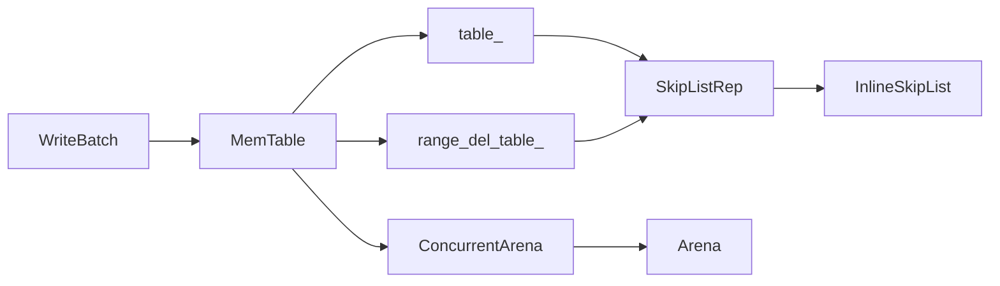
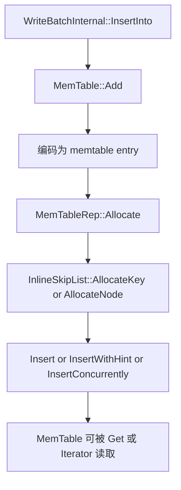

## 今日主题

- 主主题：`MemTable / SkipList / Arena`
- 副主题：`WAL replay 之后数据如何真正落进内存结构`

## 学习目标

- 讲清 `WriteBatch -> MemTable::Add()` 之后，内存中真正存的是什么字节格式
- 讲清默认 memtable 为什么是 `SkipListRep + InlineSkipList`
- 讲清 `Arena / ConcurrentArena` 在 RocksDB 中承担的内存生命周期角色
- 讲清读路径为什么能直接在 memtable 里按 internal key 语义查找

## 前置回顾

- Day 003 已经讲清前台写路径怎样把 `WriteBatch` 和 `SequenceNumber` 组织起来
- Day 004 已经讲清 WAL 如何承载 `WriteBatch`，以及 recovery 如何把 WAL record 重新变回 `WriteBatch`
- Day 005 要补上中间这一步：
  - `WriteBatchInternal::InsertInto(...)`
  - `MemTable::Add(...)`
  - `MemTableRep::Insert(...)`
  - `InlineSkipList`

## 源码入口

- `D:\program\rocksdb\db\memtable.h`
- `D:\program\rocksdb\db\memtable.cc`
- `D:\program\rocksdb\memtable\skiplistrep.cc`
- `D:\program\rocksdb\memtable\inlineskiplist.h`
- `D:\program\rocksdb\memory\arena.h`
- `D:\program\rocksdb\memory\arena.cc`
- `D:\program\rocksdb\memory\concurrent_arena.h`
- `D:\program\rocksdb\db\dbformat.h`

## 它解决什么问题

MemTable 不是“写入前的一个临时缓存”这么简单。

它至少同时解决 4 件事：

1. 把带 `sequence + type` 的更新先放进内存，使前台写不用等 SST 生成
2. 把这些更新组织成可按 internal key 检索的有序结构
3. 让同一批内存对象在 flush 前都稳定存活，不需要逐条 free
4. 让 recovery replay 出来的更新和正常前台写入走同一套内存表语义

一句话概括：

`MemTable 是 RocksDB 把“带版本语义的写入流”暂时变成“可查询的内存有序表”的地方。`

## 它是怎么工作的

先看一张对象关系图：



再看写入主链：



最重要的点有两个：

- WAL 里的 payload 是 `WriteBatch`
- MemTable 里的 entry 不是 `WriteBatch` 的原样复制，而是另一种更适合内存检索的编码

## 关键数据结构与实现点

### `MemTable`

- 持有真正的 `arena_`
- 持有点查/普通写入的 `table_`
- 额外持有范围删除用的 `range_del_table_`
- 维护 `first_seqno_ / earliest_seqno_ / creation_seq_`

### `SkipListRep`

- 是默认 memtable factory 的核心实现之一
- 本身很薄，主要是把 `MemTableRep` 接口转发给 `InlineSkipList`
- 它说明默认 memtable 不是 hash table，而是有序结构

### `InlineSkipList`

- 真的承担节点组织、层高、插入与查找
- 节点和 key bytes 一起分配，减少指针跳转与额外对象分配
- 支持普通插入、带 hint 插入、并发插入

### `Arena / ConcurrentArena`

- `Arena` 提供分块分配，不负责逐对象释放
- `ConcurrentArena` 在此基础上加并发友好分配
- 这让 MemTable 的生命周期变成：
  - 只增不删
  - flush 后整批回收

## 源码细读

这次抓 12 个关键片段，把“写进去的是什么、怎么排好序、删除与范围删除怎么生效、为什么内存能便宜回收”连起来。

### 1. `MemTable` 构造时就把 `table_`、`range_del_table_` 和 `arena_` 接好

```cpp
// db/memtable.cc, MemTable::MemTable(...)
: comparator_(cmp),
  moptions_(ioptions, mutable_cf_options),
  kArenaBlockSize(Arena::OptimizeBlockSize(moptions_.arena_block_size)),
  mem_tracker_(write_buffer_manager),
  arena_(moptions_.arena_block_size,
         (write_buffer_manager != nullptr &&
          (write_buffer_manager->enabled() ||
           write_buffer_manager->cost_to_cache()))
             ? &mem_tracker_
             : nullptr,
         mutable_cf_options.memtable_huge_page_size),
  table_(ioptions.memtable_factory->CreateMemTableRep(
      comparator_, &arena_, mutable_cf_options.prefix_extractor.get(),
      ioptions.logger, column_family_id)),
  range_del_table_(SkipListFactory().CreateMemTableRep(
      comparator_, &arena_, nullptr /* transform */, ioptions.logger,
      column_family_id)),
  ...
```

这一段先定下了 Day 005 的对象边界：

- `MemTable` 自己持有 `ConcurrentArena`
- 普通写入表 `table_` 由 memtable factory 创建
- 范围删除走独立的 `range_del_table_`

也就是说，memtable 不是一个裸跳表，而是：

- 一套内存分配器
- 一套点写入结构
- 一套范围删除结构

的组合体。

### 2. `MemTable::Add()` 里的 entry 编码格式

```cpp
// db/memtable.cc, MemTable::Add(...)
// entry 的格式是以下内容的拼接：
//  key_size     : internal_key.size() 的 varint32
//  key bytes    : char[internal_key.size()]
//  value_size   : value.size() 的 varint32
//  value bytes  : char[value.size()]
//  checksum     : char[moptions_.protection_bytes_per_key]
uint32_t internal_key_size = key_size + 8;
const uint32_t encoded_len = VarintLength(internal_key_size) +
                             internal_key_size + VarintLength(val_size) +
                             val_size + moptions_.protection_bytes_per_key;
...
uint64_t packed = PackSequenceAndType(s, type);
EncodeFixed64(p, packed);
...
```

这一段很关键，因为它解释了：

- WAL 里存的是 `WriteBatch`
- 但 memtable 里存的是 `internal_key + value` 风格的编码 entry

这里需要把顺序说得非常明确。单条 memtable entry 更接近：

- `varint32(internal_key_size)`
- `user key bytes`
- `packed sequence+type`
- `varint32(value_size)`
- `value bytes`
- `optional checksum`

其中：

- `internal_key_size = user_key_size + 8`
- 这额外的 `8` 字节就是 `packed sequence+type`
- 所以 `sequence + type` 不是追加在整个 entry 的最后面
- 而是 internal key 的尾部

这里最重要的 8 字节就是：

- `PackSequenceAndType(s, type)`

也就是把：

- `sequence`
- `value type`

一起塞进 internal key 尾部。这样 memtable 里的每条记录天然就是“带版本语义的内部键”。

### 3. `Add()` 真正把 bytes 写进 arena 并插入表

```cpp
// db/memtable.cc, MemTable::Add(...)
char* buf = nullptr;
std::unique_ptr<MemTableRep>& table =
    type == kTypeRangeDeletion ? range_del_table_ : table_;
KeyHandle handle = table->Allocate(encoded_len, &buf);

char* p = EncodeVarint32(buf, internal_key_size);
memcpy(p, key.data(), key_size);
...
EncodeFixed64(p, packed);
...
memcpy(p, value.data(), val_size);
...
bool res = table->InsertKey(handle);
...
```

这一段说明 memtable 写入其实分两步：

1. 先向 `MemTableRep` 申请一块可写内存
2. 再把编码后的 entry 原地写进去，然后把这个 handle 插入有序结构

也就是说，`MemTableRep` 不只是“索引”，它还参与 entry 存储地址的分配入口。

### 4. `Get()` 不是直接按 user key 查，而是按 `LookupKey/internal key` 语义查

```cpp
// db/memtable.cc, MemTable::Get(...)
std::unique_ptr<FragmentedRangeTombstoneIterator> range_del_iter(
    NewRangeTombstoneIterator(read_opts,
                              GetInternalKeySeqno(key.internal_key()),
                              immutable_memtable));
...
Slice user_key_without_ts = StripTimestampFromUserKey(key.user_key(), ts_sz_);
...
GetFromTable(key, *max_covering_tombstone_seq, do_merge, callback,
             is_blob_index, value, columns, timestamp, s, merge_context,
             seq, &found_final_value, &merge_in_progress);
```

这段提醒一个容易忽略的事实：

- 读 memtable 不是“拿 user key 在 map 里找”
- 而是拿 `LookupKey` 去做带 sequence 语义的检索

所以 memtable 从一开始就不是简单 KV cache，而是 MVCC/版本可见性语义的一部分。

### 5. `range_del_table_` 不是普通点查表，而是范围 tombstone 覆盖关系结构

```cpp
// db/memtable.cc, MemTable::Get(...)
std::unique_ptr<FragmentedRangeTombstoneIterator> range_del_iter(
    NewRangeTombstoneIterator(read_opts,
                              GetInternalKeySeqno(key.internal_key()),
                              immutable_memtable));
if (range_del_iter != nullptr) {
  SequenceNumber covering_seq =
      range_del_iter->MaxCoveringTombstoneSeqnum(key.user_key());
  if (covering_seq > *max_covering_tombstone_seq) {
    *max_covering_tombstone_seq = covering_seq;
    ...
  }
}
```

这里正好回答一个很容易卡住的问题：

- `MemTable` 里明明有 `range_del_table_`
- 为什么 `Get()` 没有像点查那样直接去它里面“拿一个值”

因为范围删除的语义不是“这个 key 对应一个 value”，而是：

- 某个 user key 区间在某个 sequence 上被 tombstone 覆盖

所以它在读路径里的作用是：

1. 先生成一个 range tombstone iterator
2. 计算当前 user key 有没有被某条 tombstone 覆盖
3. 再把这个覆盖信息和点键版本一起交给读路径判断

它的角色更接近“覆盖关系判定器”，而不是普通 KV 表。

### 6. 删除和 update 都不是原地改旧 entry，而是追加一个新版本

```cpp
// db/memtable.cc, MemTable::Add(...)
uint64_t packed = PackSequenceAndType(s, type);
EncodeFixed64(p, packed);
...
bool res = table->InsertKey(handle);
```

这段虽然短，但信息量很大：

- memtable 本质上是 append-only
- 删除通常不是把旧节点从 skiplist 里删掉
- update 也通常不是原地改旧节点

而是：

- 再插入一条新的 entry
- 它带着新的 `sequence + type`

所以 reader 是否会“读错”，取决于：

- user key 是否相同
- 哪个 sequence 对当前读可见
- 这个版本的 `type` 是 value、delete、merge 还是别的

这也解释了为什么 Day 005 必须把 memtable 和 sequence 放在一起看。

### 7. 范围删除 flush 到 SST 时不会丢，而是独立落成 range deletion block

```cpp
// table/block_based/block_based_table_builder.cc, BlockBasedTableBuilder::Add(...)
} else if (value_type == kTypeRangeDeletion) {
  ...
  r->range_del_block.Add(ikey, persisted_end);
  ...
}
```

```cpp
// table/block_based/block_based_table_builder.cc, BlockBasedTableBuilder::WriteRangeDelBlock(...)
meta_index_builder->Add(kRangeDelBlockName, range_del_block_handle);
```

这说明 `range_del_table_` 的内容不会在 flush 时被“展开成很多个点删除”。

它会沿着自己的语义链继续走下去：

- memtable 里是 `range_del_table_`
- flush 时进 `range_del_block`
- SST 里成为单独的 range deletion block
- 读 SST 时再由 range tombstone iterator / aggregator 使用

### 8. 默认 `SkipListRep` 很薄，真正复杂度在 `InlineSkipList`

```cpp
// memtable/skiplistrep.cc, class SkipListRep
class SkipListRep : public MemTableRep {
  InlineSkipList<const MemTableRep::KeyComparator&> skip_list_;
  ...

  KeyHandle Allocate(const size_t len, char** buf) override {
    *buf = skip_list_.AllocateKey(len);
    return static_cast<KeyHandle>(*buf);
  }

  bool InsertKey(KeyHandle handle) override {
    return skip_list_.Insert(static_cast<char*>(handle));
  }

  bool InsertKeyConcurrently(KeyHandle handle) override {
    return skip_list_.InsertConcurrently(static_cast<char*>(handle));
  }
  ...
};
```

这里可以看出 `SkipListRep` 的设计态度：

- 自己不重新发明一套 entry 存储格式
- 主要把 `MemTableRep` 接口适配到 `InlineSkipList`

所以 Day 005 真正该细看的不是 `SkipListRep` 本身，而是：

- `InlineSkipList::AllocateNode`
- `InlineSkipList::Insert`

### 9. `InlineSkipList` 把节点头和 key bytes 放在同一块内存里

```cpp
// memtable/inlineskiplist.h, InlineSkipList::AllocateNode(...)
auto prefix = sizeof(AcqRelAtomic<Node*>) * (height - 1);

// prefix 是存放额外层 next 指针的空间
// Node 从 raw + prefix 开始
// key bytes 紧跟在 Node 之后
char* raw = allocator_->AllocateAligned(prefix + sizeof(Node) + key_size);
Node* x = reinterpret_cast<Node*>(raw + prefix);

// 节点一旦链接进跳表后，其实不需要再显式保存高度
// 这里只是临时把高度塞进 next_[0] 的存储里，供 Insert 阶段使用
x->StashHeight(height);
return x;
```

这段很能体现 RocksDB 的工程风格：

- 不单独 new 一个 Node
- 不再单独 new 一段 key bytes
- 而是一次分配把：
  - 前缀层指针区
  - Node 头
  - key bytes

放到一起

这样做的好处是：

- 分配次数少
- 局部性更好
- flush 前不需要逐对象释放

### 10. `InlineSkipList` 同时支持普通插入和并发插入

```cpp
// memtable/inlineskiplist.h, InlineSkipList::Insert / InsertConcurrently(...)
bool InlineSkipList<Comparator>::Insert(const char* key) {
  return Insert<false>(key, seq_splice_, false);
}

bool InlineSkipList<Comparator>::InsertConcurrently(const char* key) {
  Node* prev[kMaxPossibleHeight];
  Node* next[kMaxPossibleHeight];
  Splice splice;
  splice.prev_ = prev;
  splice.next_ = next;
  return Insert<true>(key, &splice, false);
}
```

这段刚好和 Day 003 的并发写路径接上：

- 前台写路径可以允许并发 memtable writes
- 到 memtable 这一层时，底层结构自己也准备了并发插入分支

所以 RocksDB 的并发写不是只在 write thread 层面做排队，底下的数据结构也配合了这种模式。

### 11. `Arena` 的基本策略是“小对象走块，大对象单独分”

```cpp
// memory/arena.h, class Arena
// Arena 是 Allocator 的一个实现。对小请求，按预定义 block size 分块分配；
// 对大请求，直接按请求大小单独申请。
class Arena : public Allocator {
  ...
  static constexpr size_t kInlineSize = 2048;
  static constexpr size_t kMinBlockSize = 4096;
  ...
};
```

```cpp
// memory/arena.cc, Arena::AllocateFallback(...)
if (bytes > kBlockSize / 4) {
  ++irregular_block_num;
  // 如果对象超过一个 block 的四分之一，就单独分配，
  // 避免把当前块剩余空间浪费得太多
  return AllocateNewBlock(bytes);
}
...
if (!block_head) {
  size = kBlockSize;
  block_head = AllocateNewBlock(size);
}
```

这段解释了为什么 RocksDB 的 arena 不是“无脑固定块”：

- 小对象频繁分配，适合从当前块里切
- 太大的对象如果还强塞进普通块，会把尾部空间浪费掉

所以它用了一个实用规则：

- 超过 `kBlockSize / 4` 的对象单独分配

这里还有一个容易误会的边界：

- `AllocateFallback()` 里尝试 huge page 的对象，主要是 arena 的常规 block
- 超过 `kBlockSize / 4` 的 irregular block 反而直接单独分配，不走这条主块路径

这看起来有点反直觉，但 RocksDB 在这里更想优化的是：

- 大量中小 memtable entry 共享的 arena 主块

而不是：

- 某个偶发超大对象也一定要用 huge page

所以它优化的是“主路径的内存分配模式”，不是“所有大请求都 mmap/hugepage”。

### 12. `ConcurrentArena` 不是换掉 `Arena`，而是在上面加并发 shard

```cpp
// memory/concurrent_arena.h, class ConcurrentArena
// ConcurrentArena 包装了 Arena。
// 它用一个快速自旋锁保证线程安全，
// 并增加了小的 per-core allocation cache 来减少竞争。
class ConcurrentArena : public Allocator {
 public:
  explicit ConcurrentArena(size_t block_size = Arena::kMinBlockSize,
                           AllocTracker* tracker = nullptr,
                           size_t huge_page_size = 0);

  char* Allocate(size_t bytes) override {
    return AllocateImpl(bytes, false /*force_arena*/,
                        [this, bytes]() { return arena_.Allocate(bytes); });
  }
  ...
};
```

这里的重点不是“它也能分配内存”，而是：

- 并发写时，不想所有线程都去抢一个 `Arena` 锁
- 所以 `ConcurrentArena` 给小分配加了按核分片缓存

这也是为什么 Day 005 要把 `Arena` 和 `ConcurrentArena` 分开看：

- `Arena` 决定生命周期和块分配策略
- `ConcurrentArena` 决定并发分配时的争用形态

## 今日问题与讨论

### 我的问题

#### 问题 1：MemTable 里存的是不是 `WriteBatch` 原样字节流？

- 问题
  - WAL payload 是 `WriteBatch`，那 memtable 里是不是也直接存 `WriteBatch` 的片段？
- 简答
  - 不是。
  - memtable 里存的是另一种 entry 编码：`varint32(key_size) + internal_key + varint32(value_size) + value + optional checksum`。
- 源码依据
  - `D:\program\rocksdb\db\memtable.cc`
  - `MemTable::Add(...)`
- 当前结论
  - `WriteBatch` 负责写路径和 WAL 承载
  - `MemTable` 负责内存检索友好的 internal key entry 组织
- 是否需要后续回看
  - `no`

#### 问题 2：为什么默认 memtable 选跳表，而不是 hash table？

- 问题
  - RocksDB 已经有 sequence 语义了，为什么默认还要选有序结构？
- 简答
  - 因为 memtable 不只要支持点写入，还要支持：
    - 按 internal key 的有序迭代
    - flush 时按序输出
    - 读路径里和版本语义结合的查找
  - 跳表在这些需求下是很自然的折中。
- 源码依据
  - `D:\program\rocksdb\memtable\skiplistrep.cc`
  - `D:\program\rocksdb\memtable\inlineskiplist.h`
- 当前结论
  - 默认 memtable 更像“可并发写入的内存有序表”，不是纯点查优化结构
- 是否需要后续回看
  - `yes`，后面讲 iterator 和 flush 时会再次碰到

#### 问题 3：Arena 为什么适合 memtable 生命周期？

- 问题
  - 为什么 RocksDB 不直接逐条 `new/delete` memtable entry？
- 简答
  - 因为 memtable 的典型生命周期是：
    - 大量 append-only 写入
    - 几乎不做单条删除
    - flush 完后整批失效
  - 这种模式非常适合 arena：
    - 分配快
    - 局部性好
    - 最后整批释放
- 源码依据
  - `D:\program\rocksdb\memory\arena.h`
  - `D:\program\rocksdb\memory\arena.cc`
- 当前结论
  - arena 和 memtable 是强耦合设计，不是随手替换的实现细节
- 是否需要后续回看
  - `no`

#### 问题 4：`range_del_table_` 在读路径里是怎么起作用的？之后又怎么落到 SST 并参与 SST 读取？

- 问题
  - `MemTable` 里有 `range_del_table_`，但 `Get()` 没像普通点查那样直接去查它。它到底怎么起作用？flush 到 SST 后又怎么继续生效？
- 简答
  - `range_del_table_` 不是普通 KV 表，而是范围 tombstone 表。
  - 在 memtable 读路径里，它通过 `NewRangeTombstoneIterator(...)` 参与“覆盖关系判定”，判断某个 user key 是否被更高 sequence 的范围删除覆盖。
  - flush 时，这些范围删除不会被展开成很多个点删除，而是单独进入 SST 的 `range deletion block`。
  - 读 SST 时，再由 range tombstone iterator / aggregator 去参与覆盖判断。
- 源码依据
  - `D:\program\rocksdb\db\memtable.cc`
  - `D:\program\rocksdb\table\block_based\block_based_table_builder.cc`
  - `D:\program\rocksdb\db\range_del_aggregator.cc`
- 当前结论
  - `range_del_table_` 的角色更像“覆盖关系结构”，不是普通点查 map
  - 它的语义会从 memtable 一直延续到 SST 读取阶段
- 是否需要后续回看
  - `yes`，后面讲 `Read Path` 和 `SSTable / BlockBasedTable` 时要详细展开

#### 问题 5：`WriteBatch` 里多个 entry 插入 memtable 不是物理原子，那删除和 update 怎么保证 reader 不读错？

- 问题
  - memtable 不支持物理删除，又是 append-only。delete / update 怎么处理？reader 怎么知道 tombstone 是否真的生效？
- 简答
  - RocksDB 这里依赖的不是“memtable 物理插入原子”，而是“sequence 发布原子”。
  - delete / update 一般都不是原地修改旧 entry，而是插入一个新的、带更高 `sequence + type` 的版本。
  - reader 通过 `LookupKey/internal key` 语义，结合当前读的 sequence / snapshot，选出第一个可见版本。
  - tombstone 是否“真的删除了这个 key”，不是靠单独布尔字段，而是靠多版本和 sequence 可见性规则决定。
- 源码依据
  - `D:\program\rocksdb\db\memtable.cc`
  - `D:\program\rocksdb\db\write_batch.cc`
  - `D:\program\rocksdb\db\db_impl\db_impl_write.cc`
- 当前结论
  - memtable 的正确性来自“追加新版本 + sequence 可见性”，不是物理删除旧节点
  - 这也是为什么读 memtable 不能只按 user key 做普通 map 查询
- 是否需要后续回看
  - `yes`，后面讲 `Snapshot / Sequence Number / 可见性语义` 时会正式闭环

#### 问题 6：为什么 `Arena::AllocateFallback()` 里大对象单独分配，而 huge page 却主要服务常规 block？

- 问题
  - 看起来 `bytes > kBlockSize / 4` 时会单独分配，但 huge page 尝试主要在常规 block 路径里做。这不是有点反直觉吗？
- 简答
  - 这里 huge page 想优化的不是“每个大对象请求”，而是 arena 的主工作负载：
    - 大量中小 memtable entry 持续分配在少数 arena block 中
  - 对这类主块使用 huge page，更可能带来更好的 TLB/locality 收益。
  - 超大对象走 irregular block，是为了避免普通 block 剩余空间浪费；这条路径通常不是 arena 的主要优化对象。
- 源码依据
  - `D:\program\rocksdb\memory\arena.cc`
  - `D:\program\rocksdb\memory\arena.h`
- 当前结论
  - huge page 优化对象主要是 arena 常规 block，而不是所有大请求
  - 这体现的是“优化主路径分配模式”，不是“看到大对象就一定 mmap/hugepage”
- 是否需要后续回看
  - `yes`，如果后面要专门比较不同内存分配策略，可以再单独展开

## 常见误区或易混点

- 不要把 `WriteBatch` 和 memtable entry 当成同一种编码
- 不要把 `SkipListRep` 当成完整跳表实现，它更多是适配层
- 不要把 `Arena` 理解成“对象池”；它更接近“按生命周期批量回收的分块分配器”
- 不要把 memtable 当纯缓存；它本身就承载 internal key 和 sequence 语义
- 不要把范围删除理解成“很多个点删除的快捷写法”；它在 memtable 和 SST 里都有独立表示
- 不要把“delete 生效”理解成旧版本被物理移除；RocksDB 主要靠 tombstone + sequence 可见性

## 设计动机

这一章值得补一个 `设计动机`，因为设计取舍很明显。

RocksDB 这里明显在选：

- 前台持续写入友好
- flush 前只增不删
- 读路径仍能拿到有序结构

而不是：

- 点查极致最优
- 单条对象生命周期细粒度管理

这也解释了为什么默认组合是：

- `MemTable entry 编码`
- `SkipList`
- `Arena`

这三者是互相配套的，不是随便拼出来的。

## 工程启发

- 如果一块内存数据天然是“批量创建、整体销毁”，arena 往往比细粒度分配更合适
- 如果一个结构既要支持高频写入，又要支持有序读和顺序导出，跳表是很实用的折中
- RocksDB 的很多设计不是追求单点最优，而是让写路径、读路径、flush 路径共用一套足够一致的中间表示

## 今日小结

- `MemTable::Add()` 会把更新编码成 internal-key 风格的 entry，而不是保留 `WriteBatch` 原样格式
- 默认 `SkipListRep` 很薄，核心复杂度在 `InlineSkipList`
- `InlineSkipList` 把节点元信息和 key bytes 放到同一块 arena 内存里
- `Arena / ConcurrentArena` 让 memtable 的生命周期符合“只增不删、flush 后整批回收”的工作负载
- `range_del_table_` 不是普通点查表，而是范围 tombstone 的覆盖关系结构，并且会继续落入 SST 的 range deletion block
- memtable 里的删除和更新主要靠“追加新版本 + sequence 可见性”，不是物理删除旧 entry
- Day 005 的本质收获是：`WAL 解决持久化与恢复，MemTable 解决内存中的版本化有序组织`

## 明日衔接

Day 005 之后，最自然的下一章是 `Day 006：Flush`。

因为现在已经讲清：

- 数据如何进 WAL
- 数据如何进 memtable

下一步就该看：

- memtable 什么时候变成 immutable
- flush 任务如何调度
- `WriteLevel0Table` 如何把内存结构落成 L0 SST

## 复习题

1. `MemTable::Add()` 写入的 entry 字节布局是什么？为什么要把 `sequence + type` 塞进 internal key？
2. `SkipListRep` 和 `InlineSkipList` 的职责边界分别是什么？
3. 为什么 RocksDB 的 memtable 生命周期特别适合 arena？
4. `Get()` 为什么不能只按 user key 查，而要走 `LookupKey/internal key` 语义？
5. `ConcurrentArena` 相比 `Arena` 额外解决了什么问题？

## 复习结果

- review_status：`answered`
- review_result：`partial`
- review_answered_at：`2026-04-16`
- review_notes：
  - 已经能回答 memtable 的主要角色、`SkipListRep / InlineSkipList` 的职责边界、arena 生命周期适配性，以及为什么读路径必须带着 `LookupKey/internal key` 的 sequence 语义。
  - 当前没有关键误解，可以继续推进到下一章。
  - 仍需压实的点：
    - `MemTable::Add()` 里 entry 的精确字节布局顺序
    - `sequence + type` 在 internal key 中的具体位置，以及它和 `value_size/value` 的先后关系
