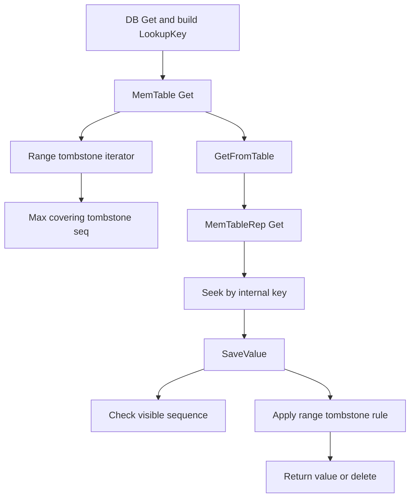

## 今日主题

- 主主题：`MemTable 深入：可见性、删除、范围删除与读语义`
- 副主题：`seq_per_batch 如何在 memtable 层保持语义边界`

## 学习目标

- 讲清 `LookupKey` 为什么不是单纯的 user key
- 讲清 memtable 里删除、更新、多版本为什么能同时成立
- 讲清 `range_del_table_` 在 `Get` 和后续落盘中的角色
- 讲清正常前台写入与 recovery replay 为什么能在 memtable 层得到等价语义

## 前置回顾

- Day 005 已经讲清 memtable entry 的基本编码、`SkipListRep + InlineSkipList` 组合，以及 `Arena / ConcurrentArena` 的内存生命周期
- 但 Day 005 还没有彻底回答这些问题：
  - 读路径为什么必须带 `LookupKey/internal key`
  - 删除和 update 为什么不需要物理删旧值
  - `range_del_table_` 在读和 flush 里到底怎么起作用
  - `merged_batch` 进入 memtable 后，原始 batch 边界为什么还能保持语义
- 所以 Day 006 不直接进入 `Flush`，先把 memtable 的读写语义补完整

## 源码入口

- `D:\program\rocksdb\db\lookup_key.h`
- `D:\program\rocksdb\db\dbformat.cc`
- `D:\program\rocksdb\db\dbformat.h`
- `D:\program\rocksdb\db\memtable.h`
- `D:\program\rocksdb\db\memtable.cc`
- `D:\program\rocksdb\db\write_batch.cc`
- `D:\program\rocksdb\table\block_based\block_based_table_builder.cc`

## 它解决什么问题

如果只把 memtable 看成“写入先落内存”的缓冲层，会遗漏它最关键的一层职责：

- 它其实先行实现了 RocksDB 的一部分可见性语义

更具体地说，memtable 至少要同时解决 5 件事：

1. 让读请求能够在“同一个 user key 的多个版本”里找到当前 snapshot 可见的那个版本
2. 让删除不是物理删节点，而是变成版本流中的一种类型
3. 让范围删除能覆盖点键，而不必把区间内所有 key 都逐条写 tombstone
4. 让正常前台写入和 recovery replay 最终都落成同一种 internal key 语义
5. 让 `seq_per_key` 和 `seq_per_batch` 这两套 sequence 语义都能在 memtable 中被消费

一句话概括：

`MemTable 不只是写入的暂存层，它已经是 RocksDB 多版本可见性规则的第一层执行现场。`

## 它是怎么工作的

先看点查路径里的关键关系：



再看 sequence 在写入到 memtable 时的展开方式：


这两张图连起来看，Day 006 的主线就是：

- 写的时候把 `sequence + type` 编进 internal key
- 读的时候再按 `LookupKey + comparator + tombstone` 把这些版本消费掉

## 关键数据结构与实现点

### `LookupKey`

- 一次点查不是只拿 user key 去 seek
- 它会构造：
  - `memtable_key = varint32(len) + user_key + tag`
  - `internal_key = user_key + tag`
- 其中 `tag = PackSequenceAndType(read_seq, kValueTypeForSeek)`

### `InternalKeyComparator`

- 对同一个 user key：
  - `sequence` 越大，排序越靠前
  - `type` 作为低 8 位一起参与比较
- 这让“最新可见版本优先被看到”变成数据结构天然属性

### `Saver`

- `MemTable::Get()` 最终不是直接返回字符串
- 而是把候选 entry 交给 `SaveValue()` 解释
- `SaveValue()` 负责：
  - 解析 entry
  - 检查 snapshot 可见性
  - 叠加 range tombstone 覆盖关系
  - 决定返回 value、merge、delete 还是 not found

### `range_del_table_`

- 它不是点查表
- 而是范围 tombstone 的单独 memtable
- 读的时候先求：
  - `MaxCoveringTombstoneSeqnum(user_key)`
- 然后再和点键版本一起比较

## 源码细读

这次抓 10 个关键片段，把“查找键怎么构造、删除怎么表达、范围删除怎么覆盖、batch 边界怎么保留下来”连起来。

### 1. `LookupKey` 不是 user key，而是专门为 memtable seek 构造的搜索键

```cpp
// db/lookup_key.h + db/dbformat.cc, LookupKey::LookupKey(...)
// 内存布局：
//   klength  varint32   <-- start_
//   userkey  char[]     <-- kstart_
//   tag      uint64
//                       <-- end_
LookupKey::LookupKey(const Slice& _user_key, SequenceNumber s,
                     const Slice* ts) {
  ...
  dst = EncodeVarint32(dst, static_cast<uint32_t>(usize + ts_sz + 8));
  kstart_ = dst;
  memcpy(dst, _user_key.data(), usize);
  ...
  EncodeFixed64(dst, PackSequenceAndType(s, kValueTypeForSeek));
  dst += 8;
  end_ = dst;
}
```

这里最重要的是最后那句：

- `PackSequenceAndType(s, kValueTypeForSeek)`

也就是说，点查不是拿“裸 user key”去搜，而是拿：

- `user_key + 目标 read_seq + 一个专门用于 seek 的 value type`

去搜。这样 memtable 就能直接从“某个 snapshot 能看到的最大版本”附近开始查。

### 2. `kValueTypeForSeek` 之所以特殊，是因为 internal key 排序里 sequence 是降序

```cpp
// db/dbformat.cc, kValueTypeForSeek 定义
// 由于 sequence 按降序排，而 value type 嵌在低 8 位里，
// seek 时需要使用编号最大的 ValueType，而不是最小的那个。
const ValueType kValueTypeForSeek = kTypeValuePreferredSeqno;
const ValueType kValueTypeForSeekForPrev = kTypeDeletion;
```

这段注释很值钱，因为它解释了一个容易忽略的点：

- internal key 的 footer 不是单独比较 sequence
- 而是比较 `packed sequence+type`

所以 lookup key 里的 type 不能随便填，它直接影响 seek 起点。

### 3. internal key 比较器保证“同 user key 下最新版本先出现”

```cpp
// db/dbformat.h, InternalKeyComparator::Compare(...)
// 排序规则：
//   先按 user key 升序
//   再按 sequence 降序
//   再按 type 降序
inline int InternalKeyComparator::Compare(const Slice& akey,
                                          const Slice& bkey) const {
  int r = user_comparator_.Compare(ExtractUserKey(akey), ExtractUserKey(bkey));
  if (r == 0) {
    const uint64_t anum =
        DecodeFixed64(akey.data() + akey.size() - kNumInternalBytes);
    const uint64_t bnum =
        DecodeFixed64(bkey.data() + bkey.size() - kNumInternalBytes);
    if (anum > bnum) {
      r = -1;
    } else if (anum < bnum) {
      r = +1;
    }
  }
  return r;
}
```

这就是为什么 memtable 不需要“先把所有版本取出来再排序”。

因为在 skiplist 里，同一个 user key 的版本天然已经按：

- 新版本在前
- 旧版本在后

排好了。

### 4. `MemTableRep::Get()` 实际上就是从 lookup key 所在位置开始向后扫

```cpp
// db/memtable.cc, MemTableRep::Get(...)
void MemTableRep::Get(const LookupKey& k, void* callback_args,
                      bool (*callback_func)(void* arg, const char* entry)) {
  auto iter = GetDynamicPrefixIterator();
  for (iter->Seek(k.internal_key(), k.memtable_key().data());
       iter->Valid() && callback_func(callback_args, iter->key());
       iter->Next()) {
  }
}
```

这段代码很短，但非常关键：

- `Seek()` 用的是 `k.internal_key()`
- 某些 memtable rep 还会用 `k.memtable_key().data()` 作为额外提示
- 之后就一直把候选 entry 交给回调 `SaveValue()`

所以点查不是“命中一个节点就结束”，而是：

1. 先定位到这个 user key 的最新候选版本附近
2. 再由 `SaveValue()` 决定是否继续往旧版本走

### 5. `SaveValue()` 先做的不是取 value，而是检查“这个版本对当前读是否可见”

```cpp
// db/memtable.cc, SaveValue(...)
// 先解析 entry，再检查它是不是当前 snapshot 可见的版本。
const uint64_t tag = DecodeFixed64(key_ptr + key_length - 8);
ValueType type;
SequenceNumber seq;
UnPackSequenceAndType(tag, &seq, &type);
if (!s->CheckCallback(seq)) {
  return true;  // 继续看下一个更旧版本
}

if (s->seq == kMaxSequenceNumber) {
  s->seq = seq;
  ...
}
```

这里的 `CheckCallback(seq)` 就把 snapshot / read seq 的可见性门槛带进来了。

所以 Day 006 可以先固定一个结论：

- memtable 里虽然存着很多版本
- 但读线程不会机械地取“第一个物理命中的 entry”
- 它只认“第一个对当前读可见的 entry”

### 6. 范围删除并不是点查之后才处理，而是先求覆盖关系，再改写点键含义

```cpp
// db/memtable.cc, MemTable::Get(...)
std::unique_ptr<FragmentedRangeTombstoneIterator> range_del_iter(
    NewRangeTombstoneIterator(read_opts,
                              GetInternalKeySeqno(key.internal_key()),
                              immutable_memtable));
if (range_del_iter != nullptr) {
  SequenceNumber covering_seq =
      range_del_iter->MaxCoveringTombstoneSeqnum(key.user_key());
  if (covering_seq > *max_covering_tombstone_seq) {
    *max_covering_tombstone_seq = covering_seq;
    ...
  }
}
...
GetFromTable(key, *max_covering_tombstone_seq, ...);
```

也就是说，`Get()` 的顺序是：

1. 先算这个 user key 有没有被范围 tombstone 覆盖
2. 再去点表里找 point key 版本

这就是你前面看到“`Get()` 没直接访问 `range_del_table_`”但它其实已经起作用的原因。

### 7. 如果 point key 的 seq 被更大的范围 tombstone 覆盖，`SaveValue()` 会把它当成删除处理

```cpp
// db/memtable.cc, SaveValue(...)
if ((type == kTypeValue || type == kTypeMerge || type == kTypeBlobIndex ||
     type == kTypeWideColumnEntity || type == kTypeDeletion ||
     type == kTypeSingleDeletion || type == kTypeDeletionWithTimestamp ||
     type == kTypeValuePreferredSeqno) &&
    max_covering_tombstone_seq > seq) {
  type = kTypeRangeDeletion;
}
...
case kTypeDeletion:
case kTypeDeletionWithTimestamp:
case kTypeSingleDeletion:
case kTypeRangeDeletion: {
  ReadOnlyMemTable::HandleTypeDeletion(...);
  *(s->found_final_value) = true;
  return false;
}
```

这段代码把范围删除和点删除在读语义上接起来了：

- point key 版本明明还在 skiplist 里
- 但如果它的 `seq` 比覆盖它的 range tombstone 还旧
- 这个 point key 在读语义上就等价于“被删除”

这也是 RocksDB 不需要物理删除旧节点的根本原因：

- 正确性来自 `type + sequence + 覆盖关系`
- 不是来自“把旧节点真的从内存里删掉”

### 8. delete 的真实语义不是删节点，而是把读结果变成 `NotFound`

```cpp
// db/memtable.h, ReadOnlyMemTable::HandleTypeDeletion(...)
static void HandleTypeDeletion(
    const Slice& lookup_user_key, bool merge_in_progress,
    MergeContext* merge_context, const MergeOperator* merge_operator,
    SystemClock* clock, Statistics* statistics, Logger* logger, Status* s,
    std::string* out_value, PinnableWideColumns* out_columns) {
  if (merge_in_progress) {
    ...
  } else {
    *s = Status::NotFound();
  }
}
```

所以对 memtable 来说：

- `kTypeDeletion`
- `kTypeSingleDeletion`
- `kTypeRangeDeletion`

本质上都不是“数据结构删节点操作”，而是“读取解释层告诉你这个 key 当前不可见”。

### 9. `seq_per_batch` 不是靠恢复原始 batch 对象实现的，而是靠 sequence 推进规则实现的

```cpp
// db/write_batch.cc, MemTableInserter::MaybeAdvanceSeq(...)
// 一个 sequenced batch 可能是多个 batch merge 的结果。
// 若要实现 seq_per_batch，需要显式标记各 batch 的边界。
void MaybeAdvanceSeq(bool batch_boundry = false) {
  if (batch_boundry == seq_per_batch_) {
    sequence_++;
  }
}
```

```cpp
// db/write_batch.cc, WriteBatchInternal::InsertInto(WriteGroup...)
for (auto w : write_group) {
  ...
  w->sequence = inserter.sequence();
  if (!w->ShouldWriteToMemtable()) {
    inserter.MaybeAdvanceSeq(true);
    continue;
  }
  SetSequence(w->batch, inserter.sequence());
  ...
  w->status = w->batch->Iterate(&inserter);
  ...
}
```

这两段合起来说明：

- 即使 WAL 里已经把多个 batch 扁平化成 `merged_batch`
- memtable 层仍然可以通过 `MaybeAdvanceSeq()` 的推进规则保住 `seq_per_batch` 语义

所以 RocksDB 恢复时并不需要还原“原始 write group 长什么样”，它真正要保住的是：

- sequence 的展开规则
- 可见性结果是否等价

### 10. 范围删除落 SST 时也不是普通 data block，而是独立的 range deletion block

```cpp
// table/block_based/block_based_table_builder.cc, BlockBasedTableBuilder::Add(...)
} else if (value_type == kTypeRangeDeletion) {
  Slice persisted_end = value;
  ...
  r->range_del_block.Add(ikey, persisted_end);
  ...
}
...
if (value_type == kTypeDeletion || value_type == kTypeSingleDeletion ||
    value_type == kTypeDeletionWithTimestamp) {
  r->props.num_deletions++;
} else if (value_type == kTypeRangeDeletion) {
  r->props.num_deletions++;
  r->props.num_range_deletions++;
}
```

这就是 `range_del_table_` 和后面 SST 章节的衔接点：

- memtable 里有独立的范围删除表
- flush 到 SST 时也有独立的 range deletion block

所以 `range tombstone` 从内存到磁盘，一直都不是“普通 point key 的特殊取值”，而是独立类型、独立通道。

## 今日问题与讨论

### 我的问题

#### 问题 1：`range_del_table_` 在点查里为什么看起来没被直接访问？

- `问题`
  - `Get()` 看起来主要在普通 `table_` 上做查找，`range_del_table_` 究竟什么时候起作用？
- `简答`
  - 它不是通过“像点表一样查一次 key”起作用，而是先构造 `FragmentedRangeTombstoneIterator`，再计算 `MaxCoveringTombstoneSeqnum(user_key)`，最后交给 `SaveValue()` 叠加解释。
- `源码依据`
  - `D:\program\rocksdb\db\memtable.cc` 的 `MemTable::Get()`、`NewRangeTombstoneIterator()`、`SaveValue()`
- `当前结论`
  - `range_del_table_` 是覆盖关系结构，不是点值查询结构。
- `是否需要后续回看`
  - `是`，等学到 `Read Path / SSTable` 时回看磁盘侧的 range deletion block。

#### 问题 2：删除和 update 为什么不会让 reader 读到错误数据？

- `问题`
  - memtable 里既没有物理删旧节点，又允许多版本并存，reader 怎么知道哪个版本该读？
- `简答`
  - reader 不是按“最后插入的物理节点”读，而是按 `LookupKey + InternalKeyComparator + SaveValue + sequence 可见性` 读。删除只是更高版本的 tombstone，update 通常是更高版本的新值；如果走 inplace update，也是只在满足条件时对最新值做受控改写。
- `源码依据`
  - `D:\program\rocksdb\db\memtable.cc` 的 `SaveValue()`、`MemTable::Update()`、`MemTable::UpdateCallback()`
- `当前结论`
  - memtable 的正确性来自版本流和读取解释逻辑，而不是来自物理删旧值。
- `是否需要后续回看`
  - `是`，等学到 `Snapshot / Sequence Number / 可见性语义` 时再压实。

#### 问题 3：在 `WAL/recovery replay` 路径里，只看到 `merged_batch`，为什么还能保持原先的 batch 语义？

- `问题`
  - 正常 `WriteImpl` 走的是原始 `WriteGroup`，这一点没有问题；但进入 WAL 之后，多个 batch 可能会被扁平化成一个 `merged_batch`。那么 recovery replay 到 memtable 时，为什么还能得到和正常路径等价的语义？
- `简答`
  - 正常 `WriteImpl` 路径本来就保留并使用原始 `WriteGroup` 边界；真正需要回答的是 recovery 路径。RocksDB 在 recovery 时真正要保住的不是“原始 writer 对象结构”，而是 sequence 的推进规则。`seq_per_batch` 通过 `MaybeAdvanceSeq()` 和边界标记继续成立，因此 memtable 中的 internal key 展开结果与正常路径保持等价。
- `源码依据`
  - `D:\program\rocksdb\db\db_impl\db_impl_write.cc` 的 `DBImpl::WriteGroupToWAL()`、`MergeBatch()`
  - `D:\program\rocksdb\db\write_batch.cc` 的 `MaybeAdvanceSeq()`、`WriteBatchInternal::InsertInto(...)`
- `当前结论`
  - 正常前台写路径依赖原始 `WriteGroup` 边界；recovery 路径虽然只看到 `merged_batch`，但会恢复等价的 sequence 语义。
- `是否需要后续回看`
  - `是`，等学到 `Snapshot / 事务` 时继续回看 `seq_per_batch`。

#### 问题 4：`max_covering_tombstone_seq` 为什么不会大于本次 lookup 的 `read_seq`？

- `问题`
  - `MemTable::Get()` 会把 `max_covering_tombstone_seq` 传进 `SaveValue()`。这个值为什么能保证不超过本次查找用的 `read_seq`？
- `简答`
  - 因为这个上界不是调用方“假设”出来的，而是 `FragmentedRangeTombstoneIterator` 构造时直接把 `read_seq` 存进 `upper_bound_`，之后 `SetMaxVisibleSeqAndTimestamp()` 只会挑出 `<= upper_bound_` 的 tombstone seq。所以 `MaxCoveringTombstoneSeqnum()` 返回的 seq 一定满足 `<= read_seq`。
- `源码依据`
  - `D:\program\rocksdb\db\memtable.cc` 的 `MemTable::Get()`
  - `D:\program\rocksdb\db\range_tombstone_fragmenter.h` 的 `FragmentedRangeTombstoneIterator::SetMaxVisibleSeqAndTimestamp()`
  - `D:\program\rocksdb\db\range_tombstone_fragmenter.cc` 的 `FragmentedRangeTombstoneIterator::MaxCoveringTombstoneSeqnum()`
- `当前结论`
  - `max_covering_tombstone_seq` 的真实约束是 `<= read_seq`，不是“恰好小于 `read_seq`”。而且 `SaveValue()` 判断覆盖时用的是严格大于：
    - `max_covering_tombstone_seq > seq`
  - 也就是“更高 sequence 的 range tombstone 覆盖更旧的 point version”；不是“`<=` 就一定失败”。
- `是否需要后续回看`
  - `是`，等学到 `Snapshot / Sequence Number / 可见性语义` 时回看“同 seq 的 point key 与 tombstone”边界。

### 外部高价值问题

这次没有额外引入外部问题。Day 006 先把前几天已经暴露出的 memtable 语义问题用本地源码补齐。

## 常见误区或易混点

- `误区 1`
  - 以为 memtable 点查只需要 user key。
  - 实际上必须带 `LookupKey`，否则无法正确定位 snapshot 之下的版本边界。

- `误区 2`
  - 以为 delete 就是从 skiplist 里删节点。
  - 实际上 delete 是更高版本的 tombstone，旧版本还在，只是读语义不再可见。

- `误区 3`
  - 以为 `range_del_table_` 只是 flush 时才有用。
  - 实际上它在 memtable 点查阶段就已经参与覆盖判定了。

- `误区 4`
  - 以为 recovery replay 一定要还原原始 batch 对象边界。
  - 实际上 RocksDB 更关心的是 sequence 展开后的等价可见性语义。

## 设计动机

`MemTable` 这一层的设计取舍很明显：

- 物理结构尽量简单
  - append-only
  - skiplist 有序
  - arena 整批回收
- 语义解释尽量推迟到读阶段
  - tombstone 不物理删除
  - range delete 不逐 key 展开
  - 多版本通过 `sequence + type` 统一消费

这是一种典型的存储引擎做法：

- 让写路径尽量少做破坏性操作
- 把复杂性集中到“有序版本流的解释规则”里

## 工程启发

Day 006 给我最大的工程启发是：

- 如果系统天然是追加式、多版本式，很多“更新”和“删除”都不应该建模成物理改写

更稳的做法往往是：

1. 写路径只负责追加新语义记录
2. 比较器和 lookup key 负责定义搜索起点
3. 读取解释器负责把“版本流”还原成用户看到的状态

这样虽然读路径会更复杂，但写路径更稳定，也更容易和恢复逻辑保持一致。

## 今日小结

Day 006 把 Day 005 里最容易产生误解的几条线补齐了：

- `LookupKey` 解释了为什么 memtable 点查不是裸 user key 查找
- `InternalKeyComparator + SaveValue` 解释了为什么旧版本、删除、merge 可以并存
- `range_del_table_` 解释了为什么范围删除既能在内存中生效，也能自然延续到 SST
- `MaybeAdvanceSeq()` 解释了为什么 recovery replay 虽然只看到 `merged_batch`，但仍能保住与正常路径等价的 sequence 语义

到这里，memtable 已经不再只是“内存里的一张表”，而是 RocksDB 版本语义真正开始发挥作用的第一层。

## 明日衔接

下一步建议进入 `Day 007：Flush`。

因为现在 memtable 的两个前提已经补齐了：

- 它内部到底存了什么
- 它读的时候怎么解释这些版本

接下来就可以顺着这个问题继续：

- 这些已经稳定存在内存中的版本，什么时候会变成 immutable memtable
- flush 线程又是怎样把它们落成 SST 的

## 复习题

1. `LookupKey` 和裸 `user key` 的区别是什么？为什么点查必须构造 `PackSequenceAndType(read_seq, kValueTypeForSeek)`？
2. 为什么 RocksDB 在 memtable 中不需要物理删除旧版本，也能保证读到正确结果？
3. `range_del_table_` 在 `Get()` 中的作用链路是什么？它为什么不是普通点查表？
4. `SaveValue()` 是如何把 point tombstone 和 range tombstone 统一到读语义里的？
5. 在 `WAL/recovery replay` 路径里，`seq_per_batch` 为什么不需要恢复原始 batch 对象边界，而是依赖 sequence 推进规则？
