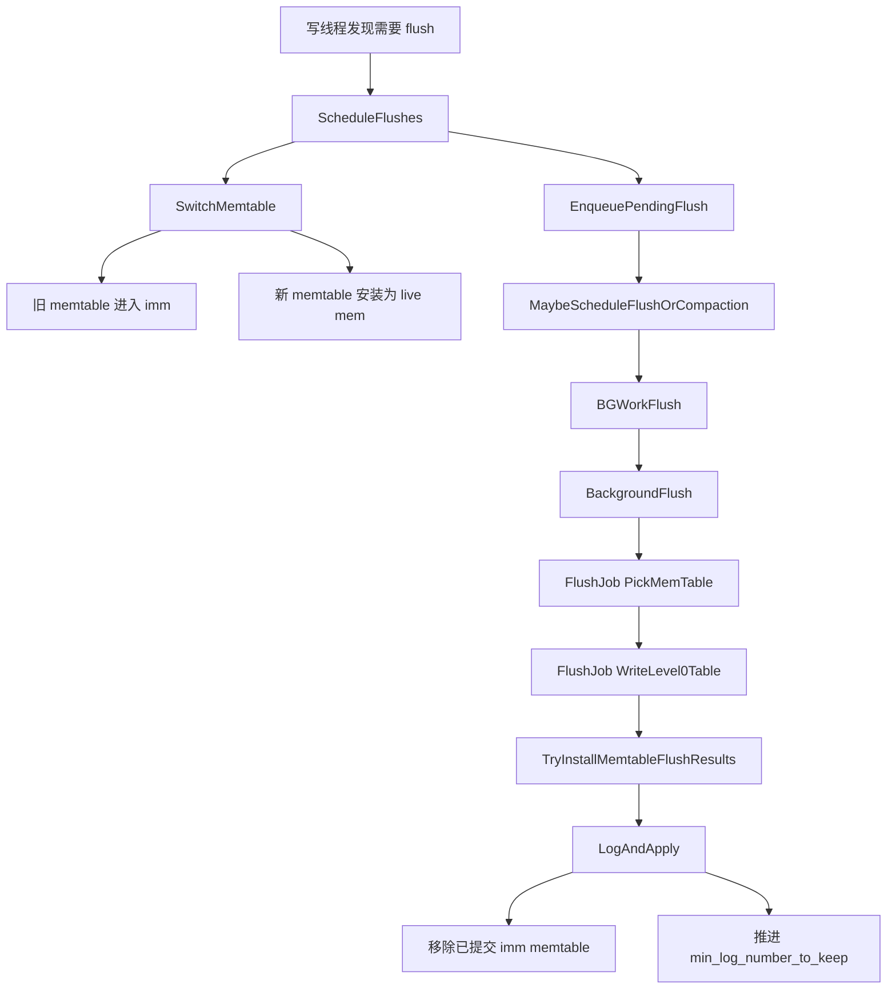
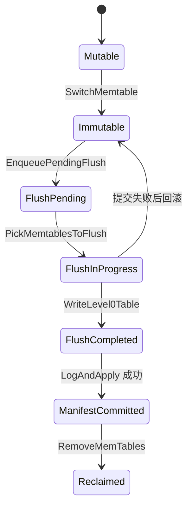

## 今日主题

- 主主题：`Flush`
- 副主题：`Flush 如何推进 WAL 保留边界`

## 学习目标

- 讲清 flush 不只是“把 memtable 写成 SST”
- 讲清前台线程和后台 flush 线程各自负责什么
- 讲清 immutable memtable 是怎么被挑选、刷盘、提交到 MANIFEST 的
- 讲清 flush 完成后为什么旧 WAL 只是“可以删除”，而不是立刻原地截断

## 前置回顾

- Day 005 讲清了 `MemTable / SkipList / Arena` 的基本结构
- Day 006 讲清了 memtable 中的可见性、删除、范围删除和 `seq_per_batch`
- 但前两天还没有把下面这条链闭环：
  - 写满的 mutable memtable 什么时候变 immutable
  - flush 请求怎么排进后台队列
  - immutable memtable 怎么变成 L0 SST
  - 哪一步才算真正对版本元数据生效
  - 哪一步会推进 `min_log_number_to_keep`
- 所以 Day 007 的核心不是 `BuildTable` 内部格式，而是 flush 的状态切换与提交边界

## 源码入口

- `D:\program\rocksdb\db\db_impl\db_impl_write.cc`
- `D:\program\rocksdb\db\db_impl\db_impl_compaction_flush.cc`
- `D:\program\rocksdb\db\flush_job.h`
- `D:\program\rocksdb\db\flush_job.cc`
- `D:\program\rocksdb\db\memtable_list.cc`
- `D:\program\rocksdb\db\db_impl\db_impl_files.cc`
- `D:\program\rocksdb\db\column_family.h`

## 它解决什么问题

如果 RocksDB 只有 mutable memtable，而没有 flush 机制，会立刻遇到 4 个问题：

1. 写请求会无限增长地占用内存
2. 即使 WAL 已经持久化，内存里的数据也永远无法稳定地进入 LSM 树
3. 旧 WAL 无法判断什么时候可以丢弃
4. 前台写线程会被“构建 SST + 更新版本元数据”这类重活长期阻塞

所以 flush 实际上要同时完成两件事：

- 把“当前正在接收写入的 memtable”切出去，让前台尽快恢复写入
- 把“已经冻结的 immutable memtable”在后台刷成 SST，并把结果提交进版本系统

一句话概括：

`Flush 是 RocksDB 把“内存中的有序多版本状态”转成“磁盘中的 L0 文件 + 新的 WAL 保留边界”的桥梁。`

## 它是怎么工作的

先看主链：



再看单个 memtable 的状态变化：



这两张图合起来，可以把 flush 分成 4 段：

1. `前台切换`
   - 旧 memtable 封口
   - 新 memtable 接管写流量
2. `后台调度`
   - flush 请求入队
   - 背景线程接手
3. `刷盘构建`
   - 把若干 immutable memtable merge 成一个 flush 输入流
   - 调 `BuildTable(...)` 生成 L0 SST
4. `元数据提交`
   - 把新文件和 WAL 保留边界写进 `VersionEdit`
   - `LogAndApply(...)`
   - 成功后才真正移除旧 immutable memtable

## 关键数据结构与实现点

### `FlushRequest`

- 它不是某个 memtable 对象本身
- 它记录的是：
  - 哪个 column family 要 flush
  - 最多持久化到哪个 `memtable_id`
  - flush 原因是什么
- 也就是说，后台线程拿到的是“一个 flush 工作单”，而不是“直接拿当前 memtable 指针就刷”

### `MemTableList`

- 它维护 immutable memtable 列表
- flush 时不是随便挑一个刷
- 而是从最老的开始，挑一段连续、可提交的 immutable memtable
- 这样 MANIFEST 提交和 WAL 边界推进才能保持顺序

### `FlushJob`

- 它负责真正的一次 flush 作业
- 关键职责有 3 个：
  - `PickMemTable()`：选输入、准备 `VersionEdit`
  - `WriteLevel0Table()`：把输入写成 SST
  - `Run()`：把刷盘结果提交回 `MemTableList`

### `VersionEdit`

- flush 不是只生成一个 SST 文件
- 它还会同时形成一份版本变更：
  - L0 新文件
  - 该 CF 新的 `LogNumber`
  - DB 级别新的 `MinLogNumberToKeep`
  - 可选的 `DeleteWalsBefore(...)`

### `SuperVersion`

- `SwitchMemtable()` 完成后就会安装新的 `SuperVersion`
- 这意味着：
  - 前台读写很快就能看到新的 live memtable 和新的 imm 列表
- 但这一步不等于 flush 已经完成
- 真正“磁盘状态 + 版本元数据”闭环，要等 `LogAndApply(...)`

## 源码细读

这次抓 9 个关键片段，把 flush 从前台切换一直串到 MANIFEST 提交。

### 1. `ScheduleFlushes()` 先做 memtable 切换，再排后台任务

```cpp
// db/db_impl/db_impl_write.cc, DBImpl::ScheduleFlushes(...)
for (auto& cfd : cfds) {
  if (status.ok() && !cfd->mem()->IsEmpty()) {
    status = SwitchMemtable(cfd, context);
  }
  ...
}

if (status.ok()) {
  ...
  GenerateFlushRequest({cfd}, FlushReason::kWriteBufferFull, &flush_req);
  EnqueuePendingFlush(flush_req);
  ...
  MaybeScheduleFlushOrCompaction();
}
```

这里说明 flush 的第一步不是后台线程，而是前台线程先把 live memtable 切掉。

也就是说：

- 前台负责制造“可刷”的 immutable memtable
- 后台负责真正刷盘

这正是 flush 延迟控制的关键：前台先快速切换，重活后移。

### 2. `SwitchMemtable()` 真正把旧 memtable 送进 `imm()`，并安装新 memtable

```cpp
// db/db_impl/db_impl_write.cc, DBImpl::SwitchMemtable(...)
...
new_mem = cfd->ConstructNewMemtable(mutable_cf_options_copy,
                                    /*earliest_seq=*/seq);
...
cfd->mem()->ConstructFragmentedRangeTombstones();
...
cfd->mem()->SetNextLogNumber(cur_wal_number_);
cfd->imm()->Add(cfd->mem(), &context->memtables_to_free_);
...
new_mem->Ref();
cfd->SetMemtable(new_mem);
InstallSuperVersionAndScheduleWork(cfd, &context->superversion_context);
```

这段是 Day 007 最核心的边界。

它说明 flush 切换时发生了 4 件事：

1. 先为新的 live memtable 分配对象
2. 把旧 memtable 的 range tombstone 片段化准备好
3. 把旧 memtable 挂进 `imm()`
4. 把新 memtable 安装成当前可写 memtable，并发布新的 `SuperVersion`

所以“mutable 变 immutable”的时刻，不是在后台线程里，而就在前台写路径触发 flush 时。

### 3. flush 调度只负责把任务扔到后台线程池

```cpp
// db/db_impl/db_impl_compaction_flush.cc, DBImpl::MaybeScheduleFlushOrCompaction(...)
while (!is_flush_pool_empty && unscheduled_flushes_ > 0 &&
       bg_flush_scheduled_ < bg_job_limits.max_flushes) {
  ...
  env_->Schedule(&DBImpl::BGWorkFlush, fta, Env::Priority::HIGH, this,
                 &DBImpl::UnscheduleFlushCallback);
  --unscheduled_flushes_;
}
```

这段说明 `MaybeScheduleFlushOrCompaction()` 不做真正的 flush 逻辑，它只是：

- 看当前还有多少未调度 flush
- 看后台 flush 线程池还有没有槽位
- 然后把 `BGWorkFlush` 排进线程池

所以 flush 调度层的责任非常克制：

- 不做 I/O
- 不碰 `BuildTable`
- 只做队列推进和并发配额控制

### 4. `BackgroundFlush()` 把一个 `FlushRequest` 变成真正的 flush 作业参数

```cpp
// db/db_impl/db_impl_compaction_flush.cc, DBImpl::BackgroundFlush(...)
while (!flush_queue_.empty()) {
  FlushRequest flush_req = PopFirstFromFlushQueue();
  ...
  for (const auto& [cfd, max_memtable_id] :
       flush_req.cfd_to_max_mem_id_to_persist) {
    ...
    bg_flush_args.emplace_back(cfd, max_memtable_id,
                               &(superversion_contexts.back()), flush_reason);
  }
  ...
  break;
}

if (!bg_flush_args.empty()) {
  status = FlushMemTablesToOutputFiles(bg_flush_args, made_progress,
                                       job_context, log_buffer, thread_pri);
}
```

这里有两个要点：

- 后台线程取的是 `FlushRequest`
- 然后再把它展开成具体的 `BGFlushArg`

所以 flush 队列里保存的不是“已经决定好的 SST 文件”，而只是“某个 CF 的 immutable memtable 可以开始刷了”。

### 5. `FlushJob::PickMemTable()` 选输入时，同时准备好 flush 对应的 `VersionEdit`

```cpp
// db/flush_job.cc, FlushJob::PickMemTable(...)
cfd_->imm()->PickMemtablesToFlush(max_memtable_id_, &mems_,
                                  &max_next_log_number);
if (mems_.empty()) {
  return;
}

ReadOnlyMemTable* m = mems_[0];
edit_ = m->GetEdits();
edit_->SetPrevLogNumber(0);
edit_->SetLogNumber(max_next_log_number);
edit_->SetColumnFamily(cfd_->GetID());

meta_.fd = FileDescriptor(versions_->NewFileNumber(), 0, 0);
```

这段很重要，因为它说明 flush 不是“先纯刷盘，之后再想元数据”。

在真正写 SST 之前，flush 作业已经决定了：

- 本次要刷哪些 immutable memtable
- 这批 memtable 对应的 `max_next_log_number` 是多少
- 输出文件号是什么
- 后续要修改哪个 CF 的版本元数据

换句话说，`FlushJob` 从一开始就在同时准备：

- 数据落盘结果
- 元数据提交结果

### 6. `WriteLevel0Table()` 不是刷单个 memtable，而是 merge 一组 immutable memtable 与范围删除流

```cpp
// db/flush_job.cc, FlushJob::WriteLevel0Table(...)
for (ReadOnlyMemTable* m : mems_) {
  ...
  memtables.push_back(
      m->NewIterator(ro, /*seqno_to_time_mapping=*/nullptr, &arena,
                     /*prefix_extractor=*/nullptr, /*for_flush=*/true));
  auto* range_del_iter =
      m->NewRangeTombstoneIterator(ro, kMaxSequenceNumber,
                                   true /* immutable_memtable */);
  if (range_del_iter != nullptr) {
    range_del_iters.emplace_back(range_del_iter);
  }
  ...
}

ScopedArenaPtr<InternalIterator> iter(
    NewMergingIterator(&cfd_->internal_comparator(), memtables.data(),
                       static_cast<int>(memtables.size()), &arena));
...
s = BuildTable(..., iter.get(), std::move(range_del_iters), &meta_, ...);
```

这里有三个容易漏掉的点：

1. flush 输入可以是一组 immutable memtable，不一定只有一个
2. 范围删除不是丢掉不管，而是和点键一起作为 flush 输入流的一部分
3. `BuildTable(...)` 吃到的是 merge 后的 internal iterator，而不是原始 memtable 容器

所以 flush 的输入形态更接近：

- 多个 immutable memtable 的有序并流
- 再外加范围 tombstone 流

### 7. flush 产出的 SST 先写进 `edit_`，目标层固定是 `L0`

```cpp
// db/flush_job.cc, FlushJob::WriteLevel0Table(...)
const bool has_output = meta_.fd.GetFileSize() > 0;

if (s.ok() && has_output) {
  edit_->AddFile(0 /* level */, meta_.fd.GetNumber(), meta_.fd.GetPathId(),
                 meta_.fd.GetFileSize(), meta_.smallest, meta_.largest,
                 meta_.fd.smallest_seqno, meta_.fd.largest_seqno,
                 meta_.marked_for_compaction, meta_.temperature,
                 meta_.oldest_blob_file_number, meta_.oldest_ancester_time,
                 meta_.file_creation_time, meta_.epoch_number,
                 meta_.file_checksum, meta_.file_checksum_func_name,
                 meta_.unique_id, meta_.compensated_range_deletion_size,
                 meta_.tail_size, meta_.user_defined_timestamps_persisted);
  edit_->SetBlobFileAdditions(std::move(blob_file_additions));
}

mems_[0]->SetFlushJobInfo(GetFlushJobInfo());
```

这段说明 flush 的“刷盘结果”并不是立即写进 `VersionSet`。

此时只是：

- SST 文件已经生成出来
- 相关文件元数据被塞进 `edit_`
- 还没真正提交给 MANIFEST

所以到这里为止，只能说：

- `BuildTable` 成功了

还不能说：

- flush 全流程完成了

### 8. `TryInstallMemtableFlushResults()` 先把 memtable 标成 `flush_completed_`，再尝试写 MANIFEST

```cpp
// db/memtable_list.cc, MemTableList::TryInstallMemtableFlushResults(...)
for (size_t i = 0; i < mems.size(); ++i) {
  ...
  mems[i]->flush_completed_ = true;
  mems[i]->file_number_ = file_number;
}
...
edit = GetDBRecoveryEditForObsoletingMemTables(
    vset, *cfd, edit_list, memtables_to_flush, prep_tracker);
edit_list.push_back(&edit);
...
s = vset->LogAndApply(cfd, read_options, write_options, edit_list, mu,
                      db_directory, /*new_descriptor_log=*/false,
                      /*column_family_options=*/nullptr,
                      manifest_write_cb);
```

这段就是 flush 的第二道边界：

- `WriteLevel0Table()` 成功，只说明 SST 文件造出来了
- `TryInstallMemtableFlushResults()` 成功，才说明：
  - 这批 immutable memtable 的刷盘结果被写进了 `VersionEdit`
  - 之后通过 `LogAndApply(...)` 正式提交给 MANIFEST / VersionSet

所以 flush 真正的“提交点”不是 `BuildTable(...)`，而是 `LogAndApply(...)`。

### 9. WAL 保留边界是在“提交 flush 结果”时一起推进的

```cpp
// db/db_impl/db_impl_files.cc, GetDBRecoveryEditForObsoletingMemTables(...)
...
min_wal_number_to_keep =
    PrecomputeMinLogNumberToKeepNon2PC(vset, cfd, edit_list);

wal_deletion_edit.SetMinLogNumberToKeep(min_wal_number_to_keep);
if (vset->db_options()->track_and_verify_wals_in_manifest) {
  if (min_wal_number_to_keep > vset->GetWalSet().GetMinWalNumberToKeep()) {
    wal_deletion_edit.DeleteWalsBefore(min_wal_number_to_keep);
  }
}
return wal_deletion_edit;
```

这段正好回答了一个容易误解的问题：

- flush 完成后，旧 WAL 不是靠“刷盘线程直接删文件”解决的

更准确地说：

1. flush 先算出新的 `min_wal_number_to_keep`
2. 把这个边界作为 `VersionEdit` 的一部分提交
3. 可选地附带 `DeleteWalsBefore(...)`
4. 后续 obsolete file 清理流程再真正去删或归档旧 WAL

所以 flush 推进的是：

- `哪些 WAL 现在已经不再是恢复所必需的`

而不是：

- 立刻对当前活跃 WAL 文件做原地截断

## 今日问题与讨论

### 我的问题

#### 问题 1：当一个 memtable flush 成功后，旧 WAL 会不会立刻被删掉？

- 简答：
  - 不会。flush 首先推进的是 `min_log_number_to_keep`，之后旧 WAL 才在 obsolete file 清理流程里被删除或归档。
- 源码依据：
  - `D:\program\rocksdb\db\db_impl\db_impl_files.cc`
  - `D:\program\rocksdb\db\memtable_list.cc`
  - `D:\program\rocksdb\db\db_impl\db_impl_compaction_flush.cc`
- 当前结论：
  - flush 负责推进“WAL 可以删除的边界”，真正删文件是后续清理流程的职责。
- 是否需要后续回看：
  - `yes`
  - 到 `MANIFEST / VersionEdit / VersionSet` 和磁盘管理章节时再把 “记录边界” 与 “删除文件” 的分工彻底压实。

#### 问题 2：为什么 flush 的完成点不是 `BuildTable(...)`，而是 `LogAndApply(...)`？

- 简答：
  - 因为 flush 不只是生成 SST 文件，还要把新文件、CF log number 和 DB 级 WAL 保留边界一起提交进版本系统。
- 源码依据：
  - `D:\program\rocksdb\db\flush_job.cc`
  - `D:\program\rocksdb\db\memtable_list.cc`
- 当前结论：
  - `BuildTable(...)` 解决的是“文件产物存在了”，`LogAndApply(...)` 解决的是“版本元数据承认它存在了”。
- 是否需要后续回看：
  - `yes`
  - 到 `VersionEdit / VersionSet` 章节时继续细看 manifest 写入队列。

#### 问题 3：SST 是不是也按 Column Family 划分？

- 简答：
  - 是。SST 也属于某个具体的 CF，不会把不同 CF 的数据混在同一个 SST 里。
- 源码依据：
  - `D:\program\rocksdb\db\flush_job.cc`
  - `D:\program\rocksdb\db\version_edit.h`
  - `D:\program\rocksdb\db\memtable_list.cc`
- 当前结论：
  - flush 作业始终围绕某个 `cfd` 展开，`VersionEdit` 里也会显式写入 `SetColumnFamily(cfd->GetID())`，因此新生成的 SST 从元数据归属上就是某个 CF 的文件。
- 是否需要后续回看：
  - `yes`
  - 到 `SSTable / BlockBasedTable` 章节时再细看 CF 归属如何体现在 file metadata 和 table reader 路径里。

#### 问题 4：memtable 和 SST 是不是一一对应？

- 简答：
  - 不是。一次 flush 可能把多个 immutable memtable merge 成一个 SST。
- 源码依据：
  - `D:\program\rocksdb\db\flush_job.cc`
  - `D:\program\rocksdb\db\memtable_list.cc`
- 当前结论：
  - `PickMemtablesToFlush(...)` 可以选出一段连续 immutable memtable，`WriteLevel0Table()` 再把这些 memtable 的 iterator 用 `NewMergingIterator(...)` 合成一个 flush 输入流，最后产出一个 `meta_.fd` 对应的 SST。
- 是否需要后续回看：
  - `yes`
  - Day 008 讲 `BuildTable(...)` 时再继续细看“多个 memtable 输入流如何落成一个 SST”。

#### 问题 5：`SwitchMemtable(...)` 的线程安全性是不是主要靠 `WriteGroup` 的单线程语义保证的？

- 简答：
  - 可以说“是核心前提之一”，但不能只说这一点。更准确地说，`SwitchMemtable(...)` 的安全性依赖于：
    - 当前线程在 writer queue 前端
    - `mutex_` 已持有
    - 在 `two_write_queues_` 模式下也位于第二写队列前端
    - 对 WAL 相关共享状态再额外用 `wal_write_mutex_` 保护
- 源码依据：
  - `D:\program\rocksdb\db\db_impl\db_impl.h`
  - `D:\program\rocksdb\db\db_impl\db_impl_write.cc`
  - `D:\program\rocksdb\db\write_thread.h`
- 当前结论：
  - `SwitchMemtable(...)` 头文件注释明确要求：
    - `mutex_ is held`
    - `this thread is currently at the front of the writer queue`
    - `this thread is currently at the front of the 2nd writer queue if two_write_queues_ is true`
  - 所以它不是“单纯靠一个普通锁”或者“单纯靠 WriteGroup”。
  - 更准确的表述是：
    - writer queue 前端资格，保证不会有别的写线程同时推进 memtable 切换这类写路径关键状态
    - `mutex_` 保护 DB/CF 的核心内存状态
    - `wal_write_mutex_` 保护 `logs_ / cur_wal_number_ / alive_wal_files_` 这些 WAL 共享状态
- 是否需要后续回看：
  - `yes`
  - 到事务与并发控制章节时，再把 `WriteThread`、`EnterUnbatched()`、`two_write_queues_` 和 pipelined write 的同步模型完整串起来。

#### 问题 6：`Env::Schedule(...)` 里的 `tag` 和 `unschedFunction` 是什么意思？用来做什么？

- 简答：
  - `tag` 是挂在后台任务上的“队列标识”，方便后面用 `Env::UnSchedule(tag, pri)` 把还没开始执行的任务从线程池队列里找出来并移除。
  - `unschedFunction` 是“取消回调”。如果任务还没开始跑、却被 `UnSchedule(...)` 从队列中拿掉，RocksDB 就会调用它，通常用来回收参数对象、修正计数器或补做清理。
  - 它们都只作用于“还在队列里、尚未真正执行”的任务，不作用于已经开始运行的后台任务。
- 源码依据：
  - `D:\program\rocksdb\include\rocksdb\env.h`
  - `D:\program\rocksdb\util\threadpool_imp.cc`
  - `D:\program\rocksdb\env\env_test.cc`
  - `D:\program\rocksdb\db\db_impl\db_impl_compaction_flush.cc`
  - `D:\program\rocksdb\db\db_impl\db_impl.h`
  - `D:\program\rocksdb\db\db_impl\db_impl.cc`
- 当前结论：
  - `env.h` 里的接口注释已经把取消路径说得很直接：
    - `Schedule(...)` 注册后台任务
    - 之后如果调用 `UnSchedule(...)`，就会触发当初传入的 `unschedFunction(arg)`
  - `threadpool_imp.cc` 里，线程池内部把每个后台任务包装成 `BGItem`，里面会保存：
    - `tag`
    - `function`
    - `unschedFunction`
  - 真正执行 `UnSchedule(...)` 时，线程池会遍历“尚未执行的队列”：
    - 找到 `item.tag == arg` 的任务
    - 把这些任务从队列中移除
    - 把对应的 `unschedFunction` 收集起来
    - 最后在锁外逐个执行这些 `unschedFunction`
  - `env_test.cc` 也验证了这一点：
    - 给任务传错 `tag`，`UnSchedule(...)` 返回 `0`
    - 传对 `tag`，`UnSchedule(...)` 才能把任务成功移出队列
  - 放到 Day 007 的 flush 场景里看，就更直观了：
    - `MaybeScheduleFlushOrCompaction()` 调用
      - `env_->Schedule(&DBImpl::BGWorkFlush, fta, Env::Priority::HIGH, this, &DBImpl::UnscheduleFlushCallback);`
    - 这里：
      - `tag = this`
      - `arg = fta`
      - `unschedFunction = DBImpl::UnscheduleFlushCallback`
    - 含义就是：
      - 这是一项属于“当前 DBImpl 实例”的 flush 后台任务
      - 如果它还没开始执行就被取消，那么就用 `UnscheduleFlushCallback(fta)` 释放 `FlushThreadArg`，并回滚 `bg_flush_scheduled_` 之类的调度状态
  - 所以可以把这两个参数简单记成：
    - `tag`：给后台任务分组/定位，便于取消
    - `unschedFunction`：任务被取消但尚未执行时的补偿清理逻辑
- 是否需要后续回看：
  - `yes`
  - 到后面的后台任务与并发控制章节，再把 `Schedule / UnSchedule / BGWorkFlush / BGWorkCompaction` 作为统一的线程池任务模型重新串一次。

#### 问题 7：`BackgroundFlush(...)` 里收集了多个 `bg_flush_args`，为什么 `FlushMemTablesToOutputFiles(...)` 看起来只用了 `bg_flush_args[0]`？

- 简答：
  - 因为这里不是“收集了多个 `FlushRequest`”，而是“把一个 `FlushRequest` 展开成多个 `BGFlushArg`”。
  - 在非 `atomic_flush` 模式下，一个 `FlushRequest` 天生只允许带一个 column family，所以 `bg_flush_args.size()` 必然是 `1`，后面取 `[0]` 是正确的，而且源码里直接有 `assert(bg_flush_args.size() == 1)`。
  - 只有在 `atomic_flush` 模式下，一个 `FlushRequest` 才可能同时带多个 column family；这时 `FlushMemTablesToOutputFiles(...)` 会立刻走 `AtomicFlushMemTablesToOutputFiles(...)` 分支，那里会遍历全部 `bg_flush_args`，并没有忽略后面的元素。
- 源码依据：
  - `D:\program\rocksdb\db\db_impl\db_impl_compaction_flush.cc`
- 当前结论：
  - `BackgroundFlush(...)` 的 `while (!flush_queue_.empty())` 容易让人误以为它在聚合多个 flush 任务，但实际上它的设计是：
    - 每次只处理一个 `FlushRequest`
    - 只是在这个 `FlushRequest` 内部，可能包含 1 个或多个 CF
    - 所以才会展开出一个 `autovector<BGFlushArg>`
  - 源码里甚至直接写了注释：
    - `MaybeScheduleFlushOrCompaction` 调度多少个 `BackgroundCallFlush`
    - 取决于 `flush_queue_` 里有多少个 `FlushRequest`
    - 所以“每个 `BackgroundFlush` 只处理一个 `FlushRequest`”就够了
  - 后面的分支边界是：
    - 如果 `immutable_db_options_.atomic_flush == false`
      - `EnqueuePendingFlush(...)` 会强制要求 `flush_req.cfd_to_max_mem_id_to_persist.size() == 1`
      - `FlushMemTablesToOutputFiles(...)` 也会 `assert(bg_flush_args.size() == 1)`
      - 然后只取 `bg_flush_args[0]`
    - 如果 `immutable_db_options_.atomic_flush == true`
      - `FlushMemTablesToOutputFiles(...)` 一进来就转到 `AtomicFlushMemTablesToOutputFiles(...)`
      - 那里会：
        - 先把每个 `bg_flush_arg.cfd_` 收集到 `cfds`
        - 为每个 CF 建一个 `FlushJob`
        - 逐个 `PickMemTable()` 和 `Run()`
      - 所以多 CF 情况下的其他元素都在 atomic flush 分支里被消费了
  - 所以更准确的理解应该是：
    - `bg_flush_args` 是“一个 flush request 内部的 CF 级展开结果”
    - 不是“多个互不相关的 flush request 的批量聚合”
    - 单 CF flush 用 `[0]`
    - 多 CF flush 走 atomic 分支处理全部元素
- 是否需要后续回看：
  - `yes`
  - Day 008/后续如果讲 `atomic_flush` 专题，可以再把“多 CF 一起 flush，但要等所有 CF 都成功后再统一提交 MANIFEST”这条链专门展开。

#### 问题 8：`WriteLevel0Table()` 是把一次 flush 任务里的所有 memtable 都写进同一个 SST 吗？那它怎么控制 SST 大小？

- 简答：
  - 是。对单个 `FlushJob` 来说，`WriteLevel0Table()` 会把这次选中的 `mems_` 全部转成 iterator，再用 `NewMergingIterator(...)` 合成一个统一输入流，最后调用一次 `BuildTable(...)` 写出一个 L0 SST。
  - 它在 flush 路径里并不会按“目标文件大小”主动切成多个 SST。也就是说，flush 生成的这个 SST 大小主要不是靠 `WriteLevel0Table()` 内部切文件控制的，而是靠：
    - 一次 flush 实际选中了多少个 memtable
    - 每个 memtable 本身多大
    - 写出时有多少键被过滤、折叠、压缩
- 源码依据：
  - `D:\program\rocksdb\db\flush_job.cc`
  - `D:\program\rocksdb\db\builder.cc`
  - `D:\program\rocksdb\db\memtable_list.cc`
  - `D:\program\rocksdb\include\rocksdb\options.h`
  - `D:\program\rocksdb\include\rocksdb\advanced_options.h`
- 当前结论：
  - “这次 flush 到底选中多少个 memtable”并不是模糊的“若干个”，而是有明确规则：
    - `GenerateFlushRequest(...)` 会先为这个 CF 记下一个 `max_memtable_id`
    - 普通非 `atomic_flush` 场景下，这个值就是当前 `imm()` 里最新 immutable memtable 的 ID
    - 到后台真正执行时，`PickMemtablesToFlush(max_memtable_id_, ...)` 会从最老的 immutable memtable 开始往新处扫描
    - 选出所有满足下面条件的连续 memtable：
      - `GetID() <= max_memtable_id`
      - `flush_in_progress_ == false`
    - 一旦遇到：
      - `GetID() > max_memtable_id`
      - 或中间夹了一个已经在 flush 的 memtable
      - 就停止，不会跨过去继续挑后面的
  - 所以普通情况下可以把它理解成：
    - “把这个 flush request 创建时已经属于这一批的、连续的 immutable memtable 一次性刷掉”
    - 如果系统没有 backlog，通常就只有 1 个 memtable
    - 如果后台落后、前台又继续把更多 memtable 封口成 immutable，那么等这个 flush job 真正开始时，就可能一次带上多个连续 memtable
  - 还有一个特例：
    - 错误恢复的非 `atomic_flush` 路径里，会把 `max_memtable_id` 直接设成 `uint64_t::max()`
    - 含义是“不设上界，能刷的都刷”
  - `FlushJob::PickMemTable()` 会先从 `imm()` 里挑出一段连续的 immutable memtable，放进 `mems_`
  - `WriteLevel0Table()` 随后会：
    - 为 `mems_` 里的每个 memtable 建 iterator
    - 用 `NewMergingIterator(...)` 把这些 iterator 合成一个统一有序流
    - 调用一次 `BuildTable(...)`
  - 整个 `FlushJob` 只维护一个 `meta_.fd`
    - `BuildTable(...)` 也只创建一个 `TableBuilder`
    - 一路 `builder->Add(...)` 到输入流结束，再 `builder->Finish()`
  - 所以从实现上看：
    - 一次 `FlushJob`
    - 一次 `BuildTable(...)`
    - 一个输出文件
  - flush 路径这里有个很关键的细节：
    - `TableBuilderOptions` 在构造时把 `target_file_size` 直接传成了 `0`
    - 这说明 flush 本身不是按 `target_file_size_base` 这样的目标文件大小去切分输出的
  - 因此 flush 生成 SST 的大小主要是“间接被控制”的：
    - `write_buffer_size`
      - 控制单个 memtable 大小上限
    - `max_memtable_id + PickMemtablesToFlush(...)`
      - 控制这次到底会把多少个连续 immutable memtable 合并进同一个 flush job
    - `PickMemtablesToFlush(...)`
      - 还会在遇到“已经在 flush 的 memtable”时停止，避免跨越不连续的边界
    - `BuildTable(...)` 过程中
      - 某些旧版本、删除标记、range tombstone 会影响最终写出的实际字节数
      - 压缩也会进一步改变最终文件大小
  - 所以更准确的说法是：
    - flush 不主动把一个大输入拆成多个 SST
    - 它通常把“本次 flush 选中的整批 memtable”落成一个 L0 文件
    - 真正更强地按目标文件大小去塑造 SST 形状，主要发生在后续 compaction 阶段
- 是否需要后续回看：
  - `yes`
  - Day 008 讲 SSTable、Day 012 讲 Compaction 时，再把“flush 产物为什么可能偏大、compaction 又如何重新按文件大小整形”连起来看会更完整。

#### 问题 9：那是不是意味着 L0 里的 SST 大小会参差不齐？

- 简答：
  - 是，方向上可以这么理解。
  - 如果当时没有 backlog，这次 flush 往往只带 1 个 memtable，生成的 L0 文件通常会相对小一些。
  - 如果后台落后、积压了多个连续 immutable memtable，这次 flush 可能一次吃进多个 memtable，生成的 L0 文件就会更大。
  - 但这不等于“完全随机”：
    - 单个 memtable 的上限仍然受 `write_buffer_size` 约束
    - flush 选中多少个 memtable 也受 `max_memtable_id` 和连续性规则约束
    - 最终文件大小还会受到压缩、删除标记、旧版本折叠、range tombstone、blob 分流等因素影响
- 源码依据：
  - `D:\program\rocksdb\db\flush_job.cc`
  - `D:\program\rocksdb\db\memtable_list.cc`
  - `D:\program\rocksdb\db\db_impl\db_impl_compaction_flush.cc`
  - `D:\program\rocksdb\include\rocksdb\options.h`
- 当前结论：
  - L0 文件在 flush 阶段本来就不追求“严格整齐划一的目标大小”
  - flush 的首要目标是：
    - 尽快把 immutable memtable 持久化
    - 推进 WAL 保留边界
    - 把内存中的有序状态安全提交到版本系统
  - 因此 L0 的文件大小更像是“当前内存状态的一次快照结果”，而不是“精细整形后的最终形状”
  - 真正更强调按目标文件大小、按层级容量去塑造文件形状，主要是后续 compaction 的职责
  - 所以可以把它记成：
    - flush 负责“尽快安全落盘”
    - compaction 负责“重新整形文件分布”
- 是否需要后续回看：
  - `yes`
  - Day 012 讲 Compaction 时，再把“为什么 L0 常常乱、而后续层级逐步规整”完整串起来。

#### 问题 10：`DeleteWalsBefore(...)` 只是打标记，那真正删除 WAL 是在哪里触发的？

- 简答：
  - 真正删除 WAL 不是在 `DeleteWalsBefore(...)` 当场完成的，而是在后面的 obsolete file 清理流程里完成。
  - 对 Day 007 这条 flush 主线来说，最直接的触发点就是：
    - flush 后台任务结束时
    - `BackgroundCallFlush(...)` 调用 `FindObsoleteFiles(...)`
    - 然后再调用 `PurgeObsoleteFiles(...)`
  - `FindObsoleteFiles(...)` 负责把“小于当前保留边界的旧 WAL”塞进 `job_context.log_delete_files`
  - `PurgeObsoleteFiles(...)` 才真正把这些 WAL 删除或归档
- 源码依据：
  - `D:\program\rocksdb\db\db_impl\db_impl_compaction_flush.cc`
  - `D:\program\rocksdb\db\db_impl\db_impl_files.cc`
  - `D:\program\rocksdb\db\wal_manager.cc`
- 当前结论：
  - `DeleteWalsBefore(...)` 本质上只是把“WAL 删除边界”写进版本元数据
  - 真正落到文件系统时，要经过两步：
    1. `FindObsoleteFiles(...)`
       - 先读取当前的 `MinLogNumberToKeep()`
       - 再扫描 `alive_wal_files_`
       - 把 `number < min_log_number` 的旧 WAL 挪进 `job_context.log_delete_files`
       - 同时把对应 writer 从 `logs_` / `alive_wal_files_` 中摘掉，放进 `wals_to_free`
    2. `PurgeObsoleteFiles(...)`
       - 把 `job_context.log_delete_files` 里的 WAL 变成 candidate file
       - 如果配置了 `WAL_ttl_seconds` 或 `WAL_size_limit_MB`
         - 就走 `wal_manager_.ArchiveWALFile(...)`
       - 否则就直接 `DeleteObsoleteFileImpl(...)` 删除文件
  - 放回 flush 主线里看，触发点就在 `BackgroundCallFlush(...)` 尾部：
    - `FindObsoleteFiles(&job_context, ...)`
    - `PurgeObsoleteFiles(job_context)`
  - 所以 Day 007 可以把这条线压成一句：
    - `LogAndApply(...)` 推进可删边界
    - `FindObsoleteFiles(...)` 识别哪些 WAL 真正 obsolete
    - `PurgeObsoleteFiles(...)` 才真正删文件或归档
  - 另外要补一个边界：
    - 这个清理流程不只会在 flush 后触发
    - compaction 完成、DB open/recovery、DB close、iterator cleanup 等场景也可能调用 `FindObsoleteFiles()/PurgeObsoleteFiles()`
    - 但就 Day 007 讨论的 flush 语境来说，最关键的触发点就是 `BackgroundCallFlush(...)` 收尾阶段
- 是否需要后续回看：
  - `yes`
  - 到 `MANIFEST / VersionSet / Disk IO` 章节时，再把 `MinLogNumberToKeep`、`alive_wal_files_`、`logs_`、archive TTL 这几条线完整合并成一张图。

#### 问题 11：`FlushJob::PickMemTable()` 里的 `max_memtable_id` 和 `max_next_log_number` 分别负责什么？

- 简答：
  - 决定“这次 flush 要刷哪些 memtable”的，是 `max_memtable_id`。
  - `max_next_log_number` 不是用来挑 memtable 的；它是在已经挑出 `mems_` 之后，从这些 memtable 里汇总出来，随后写进 `VersionEdit` 的 `LogNumber`，表示这个 CF flush 提交后的日志边界。
- 源码依据：
  - `D:\program\rocksdb\db\db_impl\db_impl_compaction_flush.cc`
  - `D:\program\rocksdb\db\flush_job.cc`
  - `D:\program\rocksdb\db\memtable_list.cc`
- 当前结论：
  - `GenerateFlushRequest(...)` 创建 flush request 时，会先记录每个 CF 的 `max_memtable_id`
  - 到后台执行时，`PickMemtablesToFlush(max_memtable_id_, &mems_, &max_next_log_number)` 才真正开始挑 memtable：
    - 只挑 `ID <= max_memtable_id` 的连续 immutable memtable
  - 同一个 `PickMemtablesToFlush(...)` 过程中，`max_next_log_number` 会被更新成：
    - 这批已选中 memtable 的 `GetNextLogNumber()` 最大值
  - 后面 `FlushJob::PickMemTable()` 会把它写进：
    - `edit_->SetLogNumber(max_next_log_number)`
  - 所以这两个字段的职责边界是：
    - `max_memtable_id`
      - 决定 flush 输入范围
    - `max_next_log_number`
      - 决定 flush 提交到版本元数据时，这个 CF 的 log number 应推进到哪里
  - 如果压成一句话：
    - 前者管“选哪些 memtable”
    - 后者管“flush 成功后元数据记到哪个 log 边界”
- 是否需要后续回看：
  - `yes`
  - 到 `MANIFEST / VersionEdit / VersionSet` 章节时，再把 `SetLogNumber(...)` 和 `DeleteWalsBefore(...)` 如何共同影响 WAL 保留边界重新串起来。

### 外部高价值问题

- 本节今天不额外引入外部问题
- 原因：
  - Day 007 的主链已经主要由本地源码闭环，当前更适合继续顺着本地代码读完 `SSTable / VersionEdit`

## 常见误区或易混点

### 误区 1：flush 就是后台把 memtable 写成 SST

不对。

flush 至少分成两段：

- 前台把 live memtable 切成 immutable
- 后台把 immutable memtable 写成 SST 并提交元数据

前一段是写路径边界，后一段才是后台作业。

### 误区 2：immutable memtable 一定是一张 memtable 对一张 SST

不对。

`PickMemtablesToFlush(...)` 可以挑一段连续 immutable memtable，最后一起 merge 成一个 flush 输入流。

### 误区 3：SST 文件写出来就说明 flush 结束了

不对。

SST 文件只是“产物已经生成”；真正完成还要等：

- `TryInstallMemtableFlushResults(...)`
- `LogAndApply(...)`
- 已提交 immutable memtable 被移出 `MemTableList`

### 误区 4：flush 后旧 WAL 立刻原地截断

不对。

flush 推进的是：

- `min_log_number_to_keep`
- 可选的 `DeleteWalsBefore(...)`

真正文件删除要靠后续 obsolete file 清理。

## 设计动机

RocksDB 这里的设计很克制，核心取舍是：

- 前台线程只做“切换”和“发布新内存视图”
- 后台线程负责重 I/O
- 版本系统负责最终承认 flush 结果

这样做有三个好处：

1. 写入延迟更稳定
   - 因为前台不必等待整个 SST 构建完成
2. 失败回滚边界更清楚
   - 即使 SST 已经写出，只要 `LogAndApply(...)` 没成功，旧 immutable memtable 仍可保留并重试
3. WAL 生命周期更可控
   - flush 和 WAL 删除边界推进被统一到同一次版本提交中

## 工程启发

如果把 flush 看成一个工程模式，它其实在做三段拆分：

1. `accept new writes`
2. `materialize old state`
3. `publish metadata`

这三段如果混在一起，系统会很难同时兼顾：

- 低写延迟
- 后台 I/O 吞吐
- 失败恢复
- 日志回收

RocksDB 的做法很值得借鉴：

- 先快速切换 live state
- 再在后台慢慢做重活
- 最后用一次元数据提交把磁盘状态、恢复边界和版本可见性一起对齐

## 今日小结

Day 007 最重要的不是记住每个 flush 函数名，而是记住 flush 的两个边界：

1. `SwitchMemtable()`
   - 把旧 memtable 变成 immutable
   - 让新 memtable 立刻接管写入
2. `LogAndApply()`
   - 把 flush 结果正式提交给版本系统
   - 同时推进 `min_log_number_to_keep`

中间的 `FlushJob` 则负责把这两头接起来：

- 选 immutable 输入
- 写出 L0 SST
- 把结果封装进 `VersionEdit`

## 明日衔接

接下来最自然的衔接是 `Day 008：SSTable / BlockBasedTable / 各类 Block`。

因为 Day 007 已经把 flush 的“输入从哪里来、输出去哪里、哪一步提交”讲清了，下一步就该深入：

- `BuildTable(...)` 具体是怎么把 internal iterator 写成 SST 的
- `BlockBasedTable` 里的 data block、index block、meta block 分别是什么
- 范围删除和普通 point key 是怎么一起落入 SST 的

## 复习题

1. `ScheduleFlushes()`、`SwitchMemtable()` 和 `BackgroundFlush()` 的职责边界分别是什么？
2. 为什么说 flush 的第一步发生在前台写路径，而不是后台线程？
3. `FlushJob::PickMemTable()` 为什么要同时记录 `max_next_log_number` 和新的输出文件号？
4. 为什么 flush 的真正完成点更接近 `LogAndApply(...)`，而不是 `BuildTable(...)`？
5. flush 是怎么推进旧 WAL 可删除边界的？为什么这不等于“立刻删除当前 WAL 文件”？
