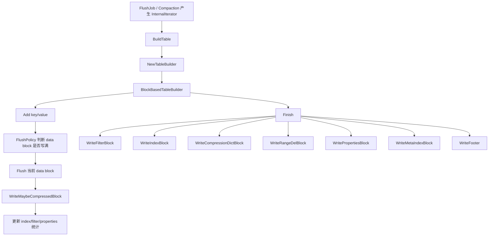
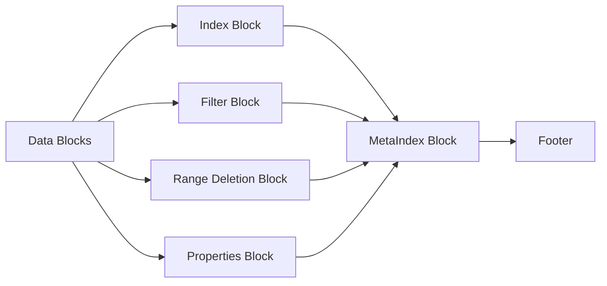

## 今日主题

- 主主题：`SSTable / BlockBasedTable / 各类 Block`
- 副主题：`BuildTable 到 BlockBasedTableBuilder::Finish 的写侧主链`

## 学习目标

- 讲清 `BuildTable(...)` 和 `BlockBasedTableBuilder` 的职责边界
- 讲清一个 block-based SST 文件里到底有哪些 block
- 讲清 data block 的 entry 编码、restart array 和 block trailer
- 讲清 footer / metaindex / index 是如何把整个文件串起来的
- 讲清 `block_size` 控制的是什么，以及它为什么不等于整个 SST 文件大小

## 前置回顾

- Day 007 已经把 flush 主链补齐到了：
  - `ScheduleFlushes -> SwitchMemtable -> BackgroundFlush -> FlushJob -> WriteLevel0Table -> LogAndApply`
- 但当时刻意停在了 `BuildTable(...)` 外层，没有继续进入：
  - internal iterator 如何被逐条写成 SST
  - 一个 SST 文件里有哪些 block
  - data/index/filter/properties/metaindex/footer 的物理关系是什么
- 所以 Day 008 的任务，是把 “flush 生成了一个 SST” 这句话继续拆开，落到真正的文件布局和 builder 代码上

## 源码入口

- `D:\program\rocksdb\db\builder.h`
- `D:\program\rocksdb\db\builder.cc`
- `D:\program\rocksdb\table\table_builder.h`
- `D:\program\rocksdb\table\format.h`
- `D:\program\rocksdb\table\format.cc`
- `D:\program\rocksdb\table\block_based\block_based_table_builder.h`
- `D:\program\rocksdb\table\block_based\block_based_table_builder.cc`
- `D:\program\rocksdb\table\block_based\block_builder.h`
- `D:\program\rocksdb\table\block_based\block_builder.cc`
- `D:\program\rocksdb\table\block_based\block_based_table_reader.h`
- `D:\program\rocksdb\include\rocksdb\table.h`

## 它解决什么问题

当 flush 或 compaction 已经把输入整理成“按 internal key 有序”的 iterator 后，RocksDB 还需要解决 4 个问题：

1. 如何把大量有序 KV 编码成适合磁盘顺序写入、块级缓存和压缩的文件格式
2. 如何让读路径不用扫描整个文件，而是先通过 index / filter 快速缩小范围
3. 如何为每个块提供独立的校验、压缩和定位信息
4. 如何在文件尾部保留一个稳定入口，让 reader 打开文件时能先找到元数据，再逐步找到真正的数据块

所以 `SSTable` 不是“一个大排序数组文件”，而是：

- 一串数据块和元数据块
- 再加一个很小但很关键的 footer

一句话概括：

`BlockBasedTable 把“有序 KV 流”拆成“可独立压缩、校验、缓存、定位”的多个 block，再用 index/metaindex/footer 把这些 block 重新串成一个可读文件。`

## 它是怎么工作的

先看写侧主链：



再看一个 block-based SST 的逻辑布局：



这两张图合起来，可以把 Day 008 压成 5 步：

1. `BuildTable(...)` 先把 flush/compaction 输入流标准化，并选出具体 `TableBuilder`
2. `BlockBasedTableBuilder::Add(...)` 一边接收有序 KV，一边往当前 data block 里塞数据
3. 当前 data block 达到阈值后，`Flush(...)` 把它刷成一个真正的 block，并交给 index/filter 继续记账
4. 所有数据块写完后，`Finish()` 再把 filter/index/range-del/properties/metaindex 这些尾部 block 依次写出
5. 最后 `Footer` 把“文件尾部的元数据入口”钉死，reader 以后就是从 footer 倒着找到整个文件结构

## 关键数据结构与实现点

### `TableBuilderOptions`

- 它是“本次建 SST 的构建上下文”
- 里面放的是：
  - `ImmutableOptions / MutableCFOptions`
  - comparator
  - compression 选项
  - CF id / name
  - file creation reason
  - `target_file_size`
- 重要边界：
  - `BuildTable(...)` 不直接决定底层格式
  - 它只是把这些上下文打包后，交给真正的 `TableBuilder`

### `TableBuilder`

- 它是一个抽象接口
- 对上游来说，只要知道：
  - `Add(key, value)`
  - `Finish()`
  - `Abandon()`
- 也就是说：
  - `BuildTable(...)` 只依赖统一接口
  - 真正选择 block-based、plain table 或其他格式，是 table factory 的职责

### `BlockBasedTableBuilder`

- 它是 Day 008 的主角
- 它真正负责：
  - data block 的聚合
  - index/filter/properties/range-del/metaindex/footer 的写出
  - 块级压缩、checksum、offset 推进
- 重要边界：
  - `BuildTable(...)` 决定“把谁写入 builder”
  - `BlockBasedTableBuilder` 决定“最终 SST 长什么样”

### `BlockBuilder`

- 它不是整个 SST 的 builder
- 它只负责“单个 block 如何编码”
- 默认 data block 使用：
  - key prefix compression
  - restart array
  - 一个块内的局部编码
- 所以 block 是 SST 的最小编码单元之一，而不是整个 SST 的全局视图

### `BlockHandle`

- 它本质上就是：
  - `offset`
  - `size`
- 用来描述“某个 block 在文件里的位置和长度”
- 重要边界：
  - `size` 不包含 block trailer
  - block trailer 是写块时追加的 5 个字节，不属于 `BlockHandle::size()`

### `Footer`

- 它是 reader 打开 SST 的入口锚点
- 它不会把每个 data block 都列出来
- 它只保存最关键的尾部定位信息：
  - `metaindex_handle`
  - 某些格式版本下的 `index_handle`
  - `checksum_type`
  - `format_version`
  - magic number
- 所以 footer 的角色不是“大索引”，而是“尾部入口”

### `BlockBasedTableOptions`

- Day 008 要先抓住 4 个最重要的参数：
  - `block_size`
  - `block_restart_interval`
  - `index_type`
  - `partition_filters`
- 这里最容易混的是：
  - `block_size` 控制的是 data block 的近似大小
  - 不是整个 SST 文件大小

## 源码细读

这次选 8 个关键片段，把写侧主链和文件布局真正落到代码上。

### 1. `BuildTable(...)` 先选具体 `TableBuilder`

```cpp
// db/builder.cc, NewTableBuilder(...)
return tboptions.moptions.table_factory->NewTableBuilder(tboptions, file);
```

这里先把职责边界钉住：

- `BuildTable(...)` 不知道 block-based table 的内部细节
- 真正决定使用哪种 table 格式的，是 `table_factory`

在 RocksDB 默认配置下，这里通常会落到 `BlockBasedTableBuilder`。

### 2. `BuildTable(...)` 负责把 iterator 中的有序记录交给 builder

```cpp
// db/builder.cc, BuildTable(...)
...
builder = NewTableBuilder(tboptions, file_writer.get());
...
for (; c_iter.Valid(); c_iter.Next()) {
  const Slice& key = c_iter.key();
  const Slice& value = c_iter.value();
  ...
  builder->Add(key_after_flush, value_after_flush);
  ...
}
...
auto range_del_it = range_del_agg->NewIterator();
for (range_del_it->SeekToFirst(); range_del_it->Valid();
     range_del_it->Next()) {
  auto tombstone = range_del_it->Tombstone();
  std::pair<InternalKey, Slice> kv = tombstone.Serialize();
  builder->Add(kv.first.Encode(), kv.second);
  ...
}
...
s = builder->Finish();
...
```

这一段说明了三件事：

1. `BuildTable(...)` 的输入已经不是 memtable，而是统一的 internal iterator
2. point key 和 range tombstone 最终都通过 `builder->Add(...)` 进入 SST
3. `BuildTable(...)` 自己不编码 block，它只是把有序数据流输送给 builder

所以 Day 007 和 Day 008 的边界就是：

- Day 007：flush/compaction 如何准备出有序输入流
- Day 008：这个有序输入流怎样被真正编码成 SST

### 3. `BlockBasedTableBuilder::Add(...)` 一边收数据，一边决定何时刷块

```cpp
// table/block_based/block_based_table_builder.cc, BlockBasedTableBuilder::Add(...)
...
auto should_flush = r->flush_block_policy->Update(ikey, value);
if (should_flush) {
  assert(!r->data_block.empty());
  Flush(/*first_key_in_next_block=*/&ikey);
}
...
r->data_block.AddWithLastKey(ikey, value, r->last_ikey);
r->last_ikey.assign(ikey.data(), ikey.size());
...
r->index_builder->OnKeyAdded(ikey, value);
...
} else if (value_type == kTypeRangeDeletion) {
  ...
  r->range_del_block.Add(ikey, persisted_end);
  ...
}
...
```

这里可以看出 `BlockBasedTableBuilder` 的主循环不是“先把整个 SST 凑完再统一编码”，而是：

- 持续往当前 data block 里追加记录
- 由 `flush_block_policy` 判断 data block 是否该结束
- 结束后立即刷成一个真正的 block
- 同时把范围删除单独积累到 `range_del_block`

重要边界：

- point key 进入 `data_block`
- range tombstone 不和 point key 混在同一个 data block 里，而是进单独的 `range_del_block`

### 4. `Flush(...)` 处理的是“当前 data block”，不是整个 SST

```cpp
// table/block_based/block_based_table_builder.cc, BlockBasedTableBuilder::Flush(...)
...
if (r->data_block.empty()) {
  return;
}
Slice uncompressed_block_data = r->data_block.Finish();
...
```

这一步的含义很关键：

- `Flush(...)` 不是 Day 007 那个“memtable flush”
- 它只是 `BlockBasedTableBuilder` 内部把“当前 data block 写出去”

也就是说：

- Day 007 的 flush 是“内存表 -> SST 文件”
- Day 008 这里的 flush 是“SST 文件内部，一个 data block -> 文件字节”

如果把这两个概念混在一起，后面很容易看乱。

### 5. `BlockBuilder` 决定单个 data block 的编码格式

```cpp
// table/block_based/block_builder.cc, BlockBuilder::Finish()
...
// 追加 restart 数组
for (size_t i = 0; i < restarts_.size(); i++) {
  PutFixed32(&buffer_, restarts_[i]);
}
...
// footer 是 data_block_index_type 与 num_restarts 的打包格式
uint32_t block_footer = PackIndexTypeAndNumRestarts(index_type, num_restarts);
PutFixed32(&buffer_, block_footer);
...
```

结合 `block_builder.cc` 文件头注释，可以把一个 data block 的内部布局压成：

```text
entry1
entry2
...
restart array
packed block footer
```

而单条 entry 的编码则是：

```text
shared_bytes: varint32
unshared_bytes: varint32
value_length: varint32
key_delta: char[unshared_bytes]
value: char[value_length]
```

这里的关键思想是：

- 在同一个 block 内，key 之间高度有序，所以可以做 prefix compression
- 但不能把所有 key 都完全依赖前一个 key，否则随机定位太慢
- 所以 RocksDB 每隔 `block_restart_interval` 个 entry 放一个 restart point
- 这样 reader 可以在 block 内先做 restart 级别的二分，再做局部线性扫描

### 6. 写块时，真正落盘的是 `block_data + trailer`

```cpp
// table/block_based/block_based_table_builder.cc, BlockBasedTableBuilder::WriteMaybeCompressedBlockImpl(...)
...
// 文件格式由一串 block 组成，每个 block 具有：
//   block_data: uint8[n]
//   compression_type: uint8
//   checksum: uint32
...
handle->set_offset(offset);
handle->set_size(block_contents.size());
...
trailer[0] = comp_type;
uint32_t checksum = ComputeBuiltinChecksumWithLastByte(
    r->table_options.checksum, block_contents.data(), block_contents.size(),
    /*last_byte=*/ comp_type);
...
EncodeFixed32(trailer.data() + 1, checksum);
...
r->file->Append(io_options, block_contents);
r->file->Append(io_options, Slice(trailer.data(), trailer.size()));
...
```

这里需要明确两个边界：

1. `BlockHandle::size()` 记录的是 `block_data` 大小
2. 真正文件里还会再跟一个 5 字节 trailer

也就是：

```text
block_data
+ 1 byte compression_type
+ 4 bytes checksum
```

所以在 block-based table 里，一个 block 不是“只有 payload”，它天然还带：

- 压缩类型
- checksum

这也是为什么 block 能成为一个很好的独立 I/O / cache / verify 单元。

### 7. `Finish()` 里真正决定了 SST 尾部 block 的写出顺序

```cpp
// table/block_based/block_based_table_builder.cc, BlockBasedTableBuilder::Finish()
...
// 以如下顺序写出 meta block、metaindex block 和 footer：
//   1. [meta block: filter]
//   2. [meta block: index]
//   3. [meta block: compression dictionary]
//   4. [meta block: range deletion tombstone]
//   5. [meta block: properties]
//   6. [metaindex block]
//   7. Footer
BlockHandle metaindex_block_handle, index_block_handle;
MetaIndexBuilder meta_index_builder;
WriteFilterBlock(&meta_index_builder);
WriteIndexBlock(&meta_index_builder, &index_block_handle);
WriteCompressionDictBlock(&meta_index_builder);
WriteRangeDelBlock(&meta_index_builder);
WritePropertiesBlock(&meta_index_builder);
...
WriteMaybeCompressedBlock(meta_index_builder.Finish(), kNoCompression,
                          &metaindex_block_handle, BlockType::kMetaIndex);
...
WriteFooter(metaindex_block_handle, index_block_handle);
...
```

这段代码等于直接给了我们 Day 008 最重要的“文件尾部生成顺序”。

要注意：

- data blocks 是在 `Add/Flush` 过程中逐步写出的
- 上面这段 `Finish()` 主要负责写“尾部块”

所以一个 block-based SST 的思路不是：

- “先把整文件拼好再一次性落盘”

而是：

- data block 边写边产出
- 最后再统一补尾部元数据块和 footer

### 8. `BlockHandle` 和 `Footer` 是 reader 找到整个文件结构的入口

```cpp
// table/format.cc, BlockHandle::EncodeTo(...)
PutVarint64Varint64(dst, offset_, size_);

// table/format.cc, FooterBuilder::Build(...)
...
*(cur++) = checksum_type;
...
cur = metaindex_handle.EncodeTo(cur);
cur = index_handle.EncodeTo(cur);
...
EncodeFixed32(cur, format_version);
cur += 4;
EncodeFixed64(cur, magic_number);
...
```

这里的重点不是记住 footer 每个字节的精确位置，而是记住它的职责：

- `BlockHandle`
  - 描述某个 block 在文件中的 `offset + size`
- `Footer`
  - 描述“我去哪里找 metaindex”
  - 同时告诉 reader 当前文件是什么格式、用什么 checksum

所以 reader 打开 SST 的典型入口思路是：

1. 先读文件尾部 footer
2. 从 footer 拿到 metaindex handle
3. 读 metaindex block
4. 从 metaindex 里再找到 index/filter/properties/range-del 等 block
5. 最后再通过 index block 去找真正的数据块

也就是说：

- footer 不直接管理所有 data block
- footer 只是文件尾部的“总入口”

## 今日问题与讨论

### 我的问题

#### 问题 1：`block_size` 控制的到底是什么？

- 简答：
  - 它主要控制 data block 的目标大小，不是整个 SST 文件大小。
- 源码依据：
  - `D:\program\rocksdb\include\rocksdb\table.h`
  - `D:\program\rocksdb\table\block_based\flush_block_policy.cc`
  - `D:\program\rocksdb\table\block_based\block_based_table_builder.cc`
- 当前结论：
  - data block 会根据 `flush_block_policy` 接近 `block_size` 时切块，但 SST 尾部还有 index/filter/properties/metaindex/footer，所以整个 SST 一定大于单个 block。
- 是否需要后续回看：
  - `yes`
  - 到 compaction 和读路径章节时，再结合 L0/Ln 文件大小策略回看。

#### 问题 2：为什么 footer 不直接保存所有 data block 的位置？

- 简答：
  - 因为真正的数据块定位工作交给 index block；footer 只保留一个稳定、紧凑的入口。
- 源码依据：
  - `D:\program\rocksdb\table\format.h`
  - `D:\program\rocksdb\table\format.cc`
  - `D:\program\rocksdb\table\block_based\block_based_table_builder.cc`
- 当前结论：
  - 这是一个明显的分层设计：
    - footer：尾部入口
    - metaindex：尾部元数据目录
    - index：数据块目录
- 是否需要后续回看：
  - `yes`
  - 到 Day 009 读路径时回看，reader 正是按这个层次倒着打开文件。

#### 问题 3：为什么 range tombstone 要单独写 `range deletion block`？

- 简答：
  - 因为它不是普通点键 KV，读语义和扫描方式都不同，混进 data block 反而会让点查与范围删除处理耦合得更乱。
- 源码依据：
  - `D:\program\rocksdb\table\block_based\block_based_table_builder.cc`
  - `D:\program\rocksdb\db\builder.cc`
- 当前结论：
  - point key 和 range tombstone 在写 SST 时已经开始分流：
    - point key 进入 data block
    - range tombstone 进入 range deletion block
- 是否需要后续回看：
  - `yes`
  - 到 Day 009 / Day 010 的读路径与 table reader 章节再继续展开。

#### 问题 4：`BlockBuilder::Add()` 为什么不检查 key 顺序？它是在信任上层吗？

- 简答：
  - 是的，`BlockBuilder` 基本是在信任上层给它的 key 已经有序。
  - 它在接口注释里明确写了前置条件：除 range tombstone block 外，新 key 必须大于之前加入的 key。
  - 但实现里没有做昂贵的运行时排序检查，主要靠上游调用链保证这个前提成立。
- 源码依据：
  - `D:\program\rocksdb\table\block_based\block_builder.h`
  - `D:\program\rocksdb\table\block_based\block_builder.cc`
  - `D:\program\rocksdb\db\builder.cc`
  - `D:\program\rocksdb\table\block_based\block_based_table_builder.cc`

```cpp
// table/block_based/block_builder.h, BlockBuilder::Add(...)
// REQUIRES: Unless a range tombstone block, key is larger than any previously
//           added key
void Add(const Slice& key, const Slice& value, ...);
```

```cpp
// table/block_based/block_builder.cc, BlockBuilder::AddWithLastKeyImpl(...)
if (counter_ >= block_restart_interval_) {
  restarts_.push_back(static_cast<uint32_t>(buffer_size));
  ...
} else if (use_delta_encoding_ && !skip_delta_encoding) {
  shared = key_to_persist.difference_offset(last_key_persisted);
}
```

  - 这段代码直接基于“当前 key 不小于上一个 key”来做 prefix compression 和 restart 切分。
  - 如果上层传入乱序 key：
    - delta encoding 的共享前缀假设会被破坏
    - restart array 对应的有序查找语义会失效
    - binary search / hash shortcut 的正确性也会一起受影响
- 当前结论：
  - `BlockBuilder` 不是排序器，它是编码器。
  - 排序保证来自更上层的 flush / compaction 输入流，也就是 `BuildTable(...) -> BlockBasedTableBuilder::Add(...)` 这条链路提供的有序 internal iterator。
  - 如果这个前提不成立，block 不一定会当场报错，但后续 reader 的查找语义就可能出问题。
- 是否需要后续回看：
  - `yes`
  - 到 Day 009 读路径时，可以再反过来看 reader 为什么敢对 restart array 做 binary search。

#### 问题 5：`BlockBuilder` 里的 hash index 有什么必要？它和 binary search 是什么关系，什么时候才值得开？

- 简答：
  - 这里先要澄清一个容易混淆的点：
    - `BlockBasedTableOptions::IndexType` 是 table/index block 层的索引类型，里面有 `kBinarySearch`、`kHashSearch` 等。
    - `BlockBuilder` 构造函数里用的是 `BlockBasedTableOptions::DataBlockIndexType`，它只有：
      - `kDataBlockBinarySearch`
      - `kDataBlockBinaryAndHash`
  - 所以 data block 这里根本不是“纯 hash 替代 binary search”，而是“binary search 基础上额外加一层 hash shortcut”。
  - 这层 hash 的目标很明确：降低 **point lookup 在 data block 内部的 CPU 开销**。
  - 它不是拿 hash 直接定位到 entry offset，而是先把 `user_key -> restart interval` 大致映射出来，再在这个 restart interval 内顺序扫。
  - 发生 hash 冲突时，它直接标成 `kCollision`，然后回退到正常查找路径，不做复杂冲突处理。
- 源码依据：
  - `D:\program\rocksdb\include\rocksdb\table.h`
  - `D:\program\rocksdb\table\block_based\data_block_hash_index.h`
  - `D:\program\rocksdb\table\block_based\data_block_hash_index.cc`
  - `D:\program\rocksdb\table\block_based\block.cc`
  - `D:\program\rocksdb\table\block_based\block_builder.cc`

```cpp
// include/rocksdb/table.h, BlockBasedTableOptions::DataBlockIndexType
enum DataBlockIndexType : char {
  kDataBlockBinarySearch = 0,
  kDataBlockBinaryAndHash = 1,
};
```

```cpp
// table/block_based/block_builder.cc, BlockBuilder::BlockBuilder(...)
switch (index_type) {
  case BlockBasedTableOptions::kDataBlockBinarySearch:
    break;
  case BlockBasedTableOptions::kDataBlockBinaryAndHash:
    data_block_hash_index_builder_.Initialize(
        data_block_hash_table_util_ratio);
    break;
}
```

```cpp
// table/block_based/data_block_hash_index.h
// It is only used in data blocks ...
// It only used to support BlockBasedTable::Get().
// ...
// bucket stores restart index instead of exact entry offset.
// collision uses a special marker and falls back.
const uint8_t kNoEntry = 255;
const uint8_t kCollision = 254;
```

```cpp
// table/block_based/block.cc, DataBlockIter::SeekForGet(...)
if (!data_block_hash_index_) {
  SeekImpl(target);
  UpdateKey();
  return true;
}
bool res = SeekForGetImpl(target);
UpdateKey();
return res;
```

```cpp
// table/block_based/block.cc, DataBlockIter::SeekForGetImpl(...)
uint8_t entry =
    data_block_hash_index_->Lookup(data_, map_offset, target_user_key);

if (entry == kCollision) {
  // HashSeek not effective, falling back
  SeekImpl(target);
  return true;
}
...
// Here we only linear seek the target key inside the restart interval.
```

- 当前结论：
  - 对 data block 来说，hash 不是 binary search 的替代品，而是 **只服务 point get 的附加加速器**。
  - 它之所以只指向 restart interval，而不精确指向 entry offset，是因为：
    - data block 内部是 delta encoded 的
    - restart point 才是天然的解码锚点
    - 如果想直接指向每个 entry，就要额外维护更细的偏移索引，空间开销会更大
  - 它之所以不认真做冲突处理，是因为它走的是“冲突就回退”的保守路线，目标是：
    - 命中时省 CPU
    - 冲突时不影响正确性
- 一般什么时候需要：
  - 更适合：
    - `Get()` 很多、point lookup 很重
    - CPU 开销已经明显落在 data block 内部查找上
    - 读多写少、并且对额外 block 元数据开销不太敏感
  - 不太适合：
    - range scan / iterator 为主
    - block 很大、restart 很多、hash index 容易失效
    - 通用场景下还没观察到 data block 内查找是热点
  - 也就是说，它更像一个“按 workload 选择的微优化”，不是默认必开的主路径设计。
- 是否需要后续回看：
  - `yes`
  - 到 Day 009 讲 `Get()` 时，可以再把 `SeekForGet()` 和普通 `SeekImpl()` 的调用差异对上。

#### 问题 6：`first_key_in_next_block` 是干什么的？它解决了什么问题？

- 简答：
  - 它表示“下一个 data block 的第一条 key”。
  - 这个参数不是拿来构建当前 block 内容本身的，而是拿来给 **当前 block 生成更好的 index entry 边界键**。
  - 更具体地说，当前 block flush 时，RocksDB 希望给 index block 写入一个尽量短、但仍然能正确分隔“当前块”和“下一块”的 separator key。
  - 只知道当前块最后一个 key 还不够；如果再知道下一块第一个 key，就能求出一个更短的 separator，而不必把当前块最后一个完整 internal key 原样塞进 index。

- 源码依据：
  - `D:\program\rocksdb\table\block_based\block_based_table_builder.cc`
  - `D:\program\rocksdb\table\block_based\index_builder.h`

```cpp
// table/block_based/block_based_table_builder.cc, BlockBasedTableBuilder::Add(...)
auto should_flush = r->flush_block_policy->Update(ikey, value);
if (should_flush) {
  assert(!r->data_block.empty());
  Flush(/*first_key_in_next_block=*/&ikey);
}
```

```cpp
// table/block_based/block_based_table_builder.cc, BlockBasedTableBuilder::EmitBlock(...)
// We do not emit the index entry for a block until we have seen the
// first key for the next data block. This allows us to use shorter
// keys in the index block.
r->index_builder->AddIndexEntry(
    last_key_in_current_block, first_key_in_next_block, r->pending_handle,
    &r->index_separator_scratch, skip_delta_encoding);
```

```cpp
// table/block_based/index_builder.h, IndexBuilder::AddIndexEntry(...)
// To allow further optimization, we provide `last_key_in_current_block` and
// `first_key_in_next_block`, based on which the specific implementation can
// determine the best index key to be used for the index block.
// ...
// @first_key_in_next_block: it will be nullptr if the entry being added is
//                           the last one in the table
```

```cpp
// table/block_based/index_builder.h, ShortenedIndexBuilder::GetSeparatorWithSeq(...)
if (first_key_in_next_block != nullptr) {
  separator_with_seq = FindShortestInternalKeySeparator(
      *comparator_->user_comparator(), last_key_in_current_block,
      *first_key_in_next_block, separator_scratch);
} else {
  separator_with_seq = FindShortInternalKeySuccessor(
      *comparator_->user_comparator(), last_key_in_current_block,
      separator_scratch);
}
```

- 它的实际意义：
  - 假设：
    - 当前 block 最后一个 key 是 `the quick brown fox`
    - 下一个 block 第一个 key 是 `the who`
  - 那 index key 不需要老老实实存完整的 `the quick brown fox`
  - 只要找到一个满足：
    - `>= 当前块所有 key`
    - `< 下一块第一条 key`
  - 的最短 separator 就够了，比如源码注释里举的 `the r`
  - 这样 index block 更小，binary search 的 key 比较也更省

- 为什么 `BlockBasedTableBuilder` 也要传它：
  - 因为 flush 当前块的时候，“下一个块的第一条 key”刚好就是这次触发 flush 的 `ikey`
  - 当前块还没把这个 `ikey` 写进去，所以：
    - 它属于下一个块
    - 但当前块生成 index entry 时已经需要知道它
  - 所以 `Flush(&ikey)` 这个调用时机很关键

- 为什么 `MaybeEnterUnbuffered(first_key_in_next_block)` 也需要它：
  - 当 builder 还处于 `kBuffered` 状态时，前面几个 data block 只是先缓存在内存里
  - 真正进入 `kUnbuffered` 后，会把这些已缓冲 block 重新逐个 emit 出去
  - 对最后一个“缓冲块”来说，它后面的那个块可能还没真正落盘，此时就要靠外面传进来的 `first_key_in_next_block` 作为它的右边界参考
  - 否则最后一个缓冲块没法正确生成 separator

- 还有一个隐藏作用：
  - 它不只是帮助“缩短 index key”
  - 还帮助判断能不能只用 user key，而不必保留完整 `key + seq`
  - 如果当前块最后 key 和下一块第一 key 的 user key 相同，只是 sequence/type 不同，那 separator 不能只看 user key，必须保留 internal key 语义

- 当前结论：
  - `first_key_in_next_block` 本质上是“当前 data block 的右边界参考 key”
  - 它的主要用途不是写当前块，而是给当前块生成更准确、更短的 index entry
  - `nullptr` 表示“当前块已经是整张表的最后一个块”，这时就没有 separator，只能退化为对最后 key 求一个 successor，或者直接用最后 key
  - 这个参数所在的核心链路其实是：
    - `BlockBasedTableBuilder::Flush(...)`
    - `IndexBuilder::AddIndexEntry(...)`
    - `ShortenedIndexBuilder::GetSeparatorWithSeq(...)`

- 是否需要后续回看：
  - `yes`
  - 到 Day 009 读路径时，可以再反过来看 reader 为什么只需要比较这个 separator，就能知道该去哪个 data block。

#### 问题 7：SST/WAL 的 block 既然不天然 page 对齐，会不会带来明显效率问题？RocksDB 是怎么处理的？

- 简答：
  - 要先把“逻辑 block”和“物理 I/O 单位”分开。
  - `WAL` 的 `32KB block` 主要是日志分帧单位，不是 page 对齐写入单位。
  - `SST` 的 `data block` 主要是编码、压缩、校验、cache 单位，也不是天然要求和 page 完全对齐。
  - 默认 buffered I/O 路径里，RocksDB 并不是“每生成一个逻辑 block，就立刻按 page 对齐写一次磁盘”；更关键的角色其实是 `WritableFileWriter + OS page cache`。
  - 真正需要严格对齐的是 direct I/O 路径；这时 RocksDB 会显式保证：
    - buffer alignment
    - write offset alignment
    - 必要时的 padding
  - 对 `SST` 来说，如果 workload 确实在意“避免 data block 跨 page / super block 边界”，RocksDB 也提供了显式选项：
    - `block_align`
    - `super_block_alignment_size`

- 源码依据：
  - `D:\program\rocksdb\file\writable_file_writer.h`
  - `D:\program\rocksdb\file\writable_file_writer.cc`
  - `D:\program\rocksdb\table\block_based\block_based_table_builder.cc`
  - `D:\program\rocksdb\include\rocksdb\table.h`
  - `D:\program\rocksdb\include\rocksdb\options.h`

```cpp
// file/writable_file_writer.h, WritableFileWriter::WritableFileWriter(...)
buf_.Alignment(writable_file_->GetRequiredBufferAlignment());
buf_.AllocateNewBuffer(std::min((size_t)65536, max_buffer_size_));
```

```cpp
// file/writable_file_writer.cc, WritableFileWriter::Append(...)
// Flush only when buffered I/O
if (!use_direct_io() && (buf_.Capacity() - buf_.CurrentSize()) < left) {
  if (buf_.CurrentSize() > 0) {
    if (!buffered_data_with_checksum_) {
      // If we're not calculating checksum of buffered data, fill the
      // buffer before flushing so that the writes are aligned. This will
      // benefit file system performance.
      size_t appended = buf_.Append(src, left);
      ...
    }
    s = Flush(io_options);
    ...
  }
}
...
// We never write directly to disk with direct I/O on.
// ... use it for its original purpose to accumulate many small chunks
if (use_direct_io() || (buf_.Capacity() >= left)) {
  while (left > 0) {
    size_t appended = buf_.Append(src, left);
    ...
```

```cpp
// file/writable_file_writer.cc, direct-I/O write path
assert((next_write_offset_ % alignment) == 0);
...
s = writable_file_->PositionedAppend(Slice(src, size), write_offset, opts,
                                     nullptr);
```

```cpp
// include/rocksdb/options.h
// Use O_DIRECT for writes in background flush and compactions.
bool use_direct_io_for_flush_and_compaction = false;

// With direct IO, we need to maintain an aligned buffer for writes.
size_t writable_file_max_buffer_size = 1024 * 1024;
```

```cpp
// include/rocksdb/table.h
// Align data blocks on lesser of page size and block size
bool block_align = false;

// Align data blocks on super block alignment. Avoid a data block split across
// super block boundaries.
size_t super_block_alignment_size = 0;
```

```cpp
// table/block_based/block_based_table_builder.cc
io_s = r->file->Append(io_options, block_contents);
...
io_s = r->file->Append(io_options, Slice(trailer.data(), trailer.size()));
...
if (r->table_options.block_align && is_data_block) {
  ...
  io_s = r->file->Pad(io_options, pad_bytes, kDefaultPageSize);
}
```

- 可以怎么理解这个取舍：
  - 默认模式下，RocksDB 不把“每个逻辑 block 都 page 对齐”当成硬约束。
  - 原因是：
    - 这会让压缩后的 block、trailer、meta block 写入路径变得很僵硬
    - 而 buffered I/O 下，page cache 本来就在吸收这类不规则 append
  - 所以默认策略更像：
    - 逻辑 block 负责格式和语义
    - `WritableFileWriter` 负责缓冲和更友好的写出粒度
    - page cache / filesystem 负责底层页粒度落盘
  - 如果用户明确开启 direct I/O 或更强对齐需求，RocksDB 才切换到：
    - 对齐 buffer
    - 对齐 offset
    - 可选 padding

- 顺手把 `WAL` 也放到同一个框架里看：
  - `WAL` 的 `32KB block` 不是 page 对齐 I/O 单位，而是日志分帧单位。
  - 它主要解决的是：
    - record 分片
    - trailer 跳过
    - 尾部截断/损坏后的重同步
  - 写入层面同样还是顺序 append，只是更多依赖：
    - `Flush()`
    - `Sync()`
    - `wal_bytes_per_sync`
    - 而不是依赖“逻辑 block 恰好等于 page”

- 当前结论：
  - 你的担心在原理上是成立的：逻辑 block 不天然和 page 对齐，确实可能带来额外页缓存管理或某些设备上的放大。
  - 但 RocksDB 的处理方式不是“强迫所有 block 天然对齐”，而是分层处理：
    - 默认 buffered I/O：交给 `WritableFileWriter + OS page cache`
    - direct I/O：显式保证 buffer 和 offset 对齐
    - SST 特殊优化：按需开启 `block_align` / `super_block_alignment_size`
  - 也就是说，RocksDB 默认接受“逻辑格式单位”和“底层页/扇区单位”不完全一致，再在需要时提供更强的对齐控制。

- 是否需要后续回看：
  - `yes`
  - 到后面的“磁盘管理 / 文件读写抽象 / OS Page Cache”章节时，可以把：
    - page cache
    - buffered I/O
    - direct I/O
    - bytes_per_sync / wal_bytes_per_sync
    - SST block alignment
    统一串成一章再看一遍。

#### 问题 8：`WriteFilterBlock / WriteIndexBlock / WriteCompressionDictBlock / WriteRangeDelBlock / WritePropertiesBlock` 分别在什么时候记录了什么？`metaindex` 和 `footer` 又分别存了什么？

- 先纠正一个前提：
  - 不是所有尾部 block 都是在每次 `Add(key, value)` 时“以同一种方式”被记录。
  - 更准确地说，它们分成三类：
    - `filter / index / range-del`：和数据流关系最紧，构建过程中持续累积
    - `properties`：构建过程中持续累积统计信息，但真正的 property block 到 `Finish()` 才统一序列化
    - `compression dict`：不是逐 key 记录，而是数据块压缩器在压缩/采样过程中逐步训练出来的附加产物

- 可以先用一张总表记：

| block | 何时记录 | 记录什么 | 最终格式 | 作用 | 何时存在 |
| --- | --- | --- | --- | --- | --- |
| `FilterBlock` | `Add()` 过程中逐 key；data block finalized 时补充分区边界 | user key / prefix 的过滤信息 | full filter 或 partitioned filter | 快速否定点查/前缀查 | 开了 `filter_policy` 且未跳过 |
| `IndexBlock` | data block flush 时加一条 index entry；平时也会在 `OnKeyAdded()` 里收集辅助信息 | separator key -> block handle（以及可选 first key） | 一个主 index block，外加可选 index meta blocks | 从 key 定位到 data block | 总是存在 |
| `CompressionDictBlock` | 不是逐 key；由 data block compressor 在训练/采样后生成 | 压缩字典字节流 | compressor-specific raw bytes | 提升压缩率 | 只有压缩器真的产出字典时 |
| `RangeDelBlock` | `Add()` 遇到 range tombstone 时 | start internal key -> persisted end key | 普通 block builder 编码块 | 持久化范围删除语义 | 有 range tombstone 时 |
| `PropertiesBlock` | `Add()` / block flush / finish 全程累计，最后统一写出 | 各种 table properties 和 user collected props | key/value 属性块 | 统计、诊断、读路径判断 | 基本总是存在 |
| `MetaIndexBlock` | 各个 meta block 真正写完、拿到 `BlockHandle` 之后 | metablock name -> block handle | 普通 block builder 编码块 | 像目录一样定位 meta blocks | 总是存在 |
| `Footer` | 全部 block 都落盘后最后写 | 固定尾部入口信息 | 固定格式尾部 | reader 打开 SST 的入口 | 总是存在 |

- 逐个看：

```cpp
// table/block_based/block_based_table_builder.cc, BlockBasedTableBuilder::Add(...)
...
if (r->filter_builder != nullptr) {
  r->filter_builder->AddWithPrevKey(
      ExtractUserKeyAndStripTimestamp(ikey, r->ts_sz),
      r->last_ikey.empty()
          ? Slice{}
          : ExtractUserKeyAndStripTimestamp(r->last_ikey, r->ts_sz));
}
...
r->data_block.AddWithLastKey(ikey, value, r->last_ikey);
...
r->index_builder->OnKeyAdded(ikey, value);
...
} else if (value_type == kTypeRangeDeletion) {
  ...
  r->range_del_block.Add(ikey, persisted_end);
  ...
}
```

- `FilterBlock`
  - 什么时候记录：
    - 点 key 写入过程中，`filter_builder->AddWithPrevKey(...)`
    - 当前 data block finalize 时，`filter_builder->OnDataBlockFinalized(...)`
  - 记录什么：
    - 不是 internal key 全量信息，而是给 filter policy 用的 user key / prefix 集合
  - 最终格式：
    - 取决于 filter builder 类型
    - full filter：一个覆盖整个 SST 的过滤块
    - partitioned filter：多个过滤分区，外加自己的 partition index
  - 作用：
    - 在读路径里先做 `KeyMayMatch / PrefixMayMatch`
    - 帮助跳过不必要的 data block 读取
  - 什么时候不存在：
    - `filter_policy == nullptr`
    - `skip_filters`
    - `optimize_filters_for_hits && bottommost`

```cpp
// table/block_based/block_based_table_builder.cc, BlockBasedTableBuilder::WriteFilterBlock(...)
if (rep_->filter_builder == nullptr || rep_->filter_builder->IsEmpty()) {
  return;
}
...
s = rep_->filter_builder->Finish(filter_block_handle, &filter_content,
                                 &filter_owner);
...
key = is_partitioned_filter ? BlockBasedTable::kPartitionedFilterBlockPrefix
                            : BlockBasedTable::kFullFilterBlockPrefix;
key.append(rep_->table_options.filter_policy->CompatibilityName());
meta_index_builder->Add(key, filter_block_handle);
```

- `IndexBlock`
  - 什么时候记录：
    - 平时 `OnKeyAdded()` 收集当前 block 的首 key 等辅助状态
    - 真正加 index entry 的时机是 data block flush 时的 `AddIndexEntry(...)`
  - 记录什么：
    - 一条 index entry 对应一个 data block
    - 本质是：
      - separator / shortened key
      - `IndexValue(handle, [first_internal_key])`
  - 最终格式：
    - 一个主 index block
    - 如果用了 partitioned index / user-defined index，还可能再产出额外的 index meta blocks
  - 作用：
    - 从“查找 key”定位到“该读哪个 data block”
  - 什么时候不存在：
    - 不存在这种情况。SST 一定要有 index。

```cpp
// table/block_based/block_based_table_builder.cc, BlockBasedTableBuilder::EmitBlock(...)
r->index_builder->AddIndexEntry(
    last_key_in_current_block, first_key_in_next_block, r->pending_handle,
    &r->index_separator_scratch, skip_delta_encoding);
```

```cpp
// table/block_based/block_based_table_builder.cc, BlockBasedTableBuilder::WriteIndexBlock(...)
auto index_builder_status = rep_->index_builder->Finish(&index_blocks);
...
for (const auto& item : index_blocks.meta_blocks) {
  ...
  meta_index_builder->Add(item.first, block_handle);
}
...
if (!FormatVersionUsesIndexHandleInFooter(rep_->table_options.format_version)) {
  meta_index_builder->Add(kIndexBlockName, *index_block_handle);
}
```

- `CompressionDictBlock`
  - 什么时候记录：
    - 不是在每次 `Add()` 里逐 key 记录
    - 而是在 data block compressor 训练/采样数据块后，由 `GetSerializedDict()` 在 `Finish()` 时取出
  - 记录什么：
    - 压缩器专用的“序列化字典字节流”
  - 最终格式：
    - 原始字节流，作为一个单独 block 写出，不再额外解释内部格式
  - 作用：
    - 提升数据块压缩率
    - 让 reader 在解压相应 block 时可以用同一份字典
  - 什么时候不存在：
    - 没开相关字典训练能力
    - 压缩器没产出字典

```cpp
// table/block_based/block_based_table_builder.cc, BlockBasedTableBuilder::WriteCompressionDictBlock(...)
Slice compression_dict;
if (rep_->data_block_compressor) {
  compression_dict = rep_->data_block_compressor->GetSerializedDict();
}
if (!compression_dict.empty()) {
  ...
  meta_index_builder->Add(kCompressionDictBlockName,
                          compression_dict_block_handle);
}
```

- `RangeDelBlock`
  - 什么时候记录：
    - `Add()` 遇到 `kTypeRangeDeletion` 时直接进 `range_del_block`
  - 记录什么：
    - start internal key -> persisted end key
  - 最终格式：
    - 本质上还是 `BlockBuilder` 编码出来的一块，只是语义上是 range tombstone 集合
  - 作用：
    - 持久化范围删除
    - 后面读路径和 compaction 会专门消费它
  - 什么时候不存在：
    - 当前 SST 没有 range tombstone

```cpp
// table/block_based/block_based_table_builder.cc, BlockBasedTableBuilder::WriteRangeDelBlock(...)
if (LIKELY(ok()) && !rep_->range_del_block.empty()) {
  ...
  WriteMaybeCompressedBlock(rep_->range_del_block.Finish(), kNoCompression,
                            &range_del_block_handle,
                            BlockType::kRangeDeletion);
  meta_index_builder->Add(kRangeDelBlockName, range_del_block_handle);
}
```

- `PropertiesBlock`
  - 什么时候记录：
    - 不是一开始就往 `PropertyBlockBuilder` 里塞
    - 而是整个构建过程中持续更新：
      - `rep_->props` 里的内建统计
      - `NotifyCollectTableCollectorsOnAdd(...)` 的用户/内部收集器
      - block flush / finish 阶段补齐的统计项
    - 到 `WritePropertiesBlock()` 才统一序列化成 property block
  - 记录什么：
    - `num_entries / num_data_blocks / filter_size / index_size / format_version`
    - comparator/filter/merge/prefix extractor 名字
    - CF id / name
    - compression 相关信息
    - user collected properties
  - 最终格式：
    - 一个有序 key/value 属性块
    - key 是属性名字符串
    - value 是 varint 或原始字符串
  - 作用：
    - 给 reader、工具、运维诊断提供元数据
  - 什么时候不存在：
    - 对正常 block-based SST 来说，基本总是存在

```cpp
// table/meta_blocks.cc, MetaIndexBuilder::Add(...)
std::string handle_encoding;
handle.EncodeTo(&handle_encoding);
meta_block_handles_.insert({key, handle_encoding});
```

```cpp
// table/meta_blocks.cc, PropertyBlockBuilder::AddTableProperty(...)
Add(TablePropertiesNames::kRawKeySize, props.raw_key_size);
Add(TablePropertiesNames::kDataSize, props.data_size);
Add(TablePropertiesNames::kIndexSize, props.index_size);
Add(TablePropertiesNames::kNumEntries, props.num_entries);
...
```

- `MetaIndexBlock`
  - 它存什么：
    - metablock name -> encoded `BlockHandle`
  - 它不存什么：
    - 不存 filter bits 本身
    - 不存 properties 内容本身
    - 不存 range tombstone 内容本身
    - 它只像“目录”一样指向这些块
  - 最终格式：
    - `MetaIndexBuilder` 先把 `<name, handle_encoding>` 放进有序 map
    - `Finish()` 时再用 `BlockBuilder(1)` 编码成一个 block
  - 常见 key：
    - `fullfilter.<CompatibilityName>`
    - `partitionedfilter.<CompatibilityName>`
    - `rocksdb.index`
    - `rocksdb.properties`
    - `rocksdb.compression_dict`
    - `rocksdb.range_del`
    - 以及 partitioned index / user-defined index 产生的额外 meta blocks
  - 作用：
    - reader 先从 footer 找到 metaindex
    - 再通过 metaindex 按名字找各类可选 meta block

```cpp
// table/meta_blocks.cc, MetaIndexBuilder::Finish()
for (const auto& metablock : meta_block_handles_) {
  meta_index_block_->Add(metablock.first, metablock.second);
}
return meta_index_block_->Finish();
```

- `Footer`
  - 它存什么：
    - 这是 SST 的固定尾部入口
    - 在较新格式里，核心是：
      - checksum type
      - footer checksum
      - base context checksum
      - metaindex 的定位信息
      - format version
      - magic number
    - 在旧格式里，还直接存：
      - metaindex handle
      - index handle
  - 它不负责什么：
    - 不直接枚举所有 data block
    - 不直接存 filter / properties / range-del 的内容
  - 作用：
    - reader 打开 SST 时，先从文件尾读取 footer
    - 再由 footer 找到 metaindex
    - 再由 metaindex 找到 index / filter / properties 等块
  - 为什么需要它：
    - 给整个 SST 提供一个极小、稳定、固定位置的入口

```cpp
// table/block_based/block_based_table_builder.cc, BlockBasedTableBuilder::WriteFooter(...)
Status s = footer.Build(kBlockBasedTableMagicNumber,
                        r->table_options.format_version, r->get_offset(),
                        r->table_options.checksum, metaindex_block_handle,
                        index_block_handle, r->base_context_checksum);
...
ios = r->file->Append(io_options, footer.GetSlice());
```

```cpp
// table/format.h, Footer
// Footer encapsulates the fixed information stored at the tail end of every
// SST file.
// ...
// Block handle for metaindex block.
const BlockHandle& metaindex_handle() const { return metaindex_handle_; }
// Block handle for (top-level) index block.
const BlockHandle& index_handle() const { return index_handle_; }
// Checksum type used in the file
ChecksumType checksum_type() const { ... }
```

- 一句话收束这组关系：
  - `filter / index / range-del / properties / compression-dict` 是“真正的内容块”
  - `metaindex` 是“这些内容块的目录块”
  - `footer` 是“整个 SST 的固定尾部入口”

- 是否需要后续回看：
  - `yes`
  - Day 009 读路径时，可以把这条链完整反过来再看一遍：
    - `footer -> metaindex -> index/filter/properties/range-del -> data block`

#### 问题 9：`first_key_in_next_block` 的本质是不是为了让块之间形成左闭右开的 `[)` 区间？

- 简答：
  - 这个理解抓到了一半，但还不够准。
  - 对的部分是：
    - `first_key_in_next_block` 确实是在表达“当前块”和“下一块”的边界关系
    - 而且它确实不是给 `BlockBuilder` 用的，而是给 `IndexBuilder` 用的
  - 不够准确的部分是：
    - 它的核心目的不是“让 SST 严格遵守 `[)` 区间”
    - 更准确地说，它的核心目的是：
      - 为当前块生成一个 **尽量短、但仍然能正确路由查找** 的 separator key

- 为什么说它不是给 `BlockBuilder` 用的：

```cpp
// table/block_based/block_based_table_builder.cc, BlockBasedTableBuilder::Add(...)
if (should_flush) {
  assert(!r->data_block.empty());
  Flush(/*first_key_in_next_block=*/&ikey);
}
...
r->data_block.AddWithLastKey(ikey, value, r->last_ikey);
```

  - 这里可以直接看出来：
    - `first_key_in_next_block` 是传给 `Flush(...)` 的
    - 而 `data_block.AddWithLastKey(...)` 根本不看它
  - 所以你的观察是对的：
    - `BlockBuilder::AddWithLastKey()` 只管块内 prefix compression
    - `BlockBuilder::Finish()` 只管把当前块编码收尾
    - 它们不负责“当前块和下一块之间如何在 index 里表达边界”

- 真正用它的是 `IndexBuilder`：

```cpp
// table/block_based/block_based_table_builder.cc, BlockBasedTableBuilder::EmitBlock(...)
r->index_builder->AddIndexEntry(
    last_key_in_current_block, first_key_in_next_block, r->pending_handle,
    &r->index_separator_scratch, skip_delta_encoding);
```

```cpp
// table/format.h
// The index entry for block n is: y -> h, [x],
// where: y is some key between the last key of block n (inclusive) and the
// first key of block n+1 (exclusive); h is BlockHandle pointing to block n;
```

  - 这段注释很关键：
    - index entry 的 key `y` 不要求等于“下一块左边界”
    - 它只要求落在：
      - `last_key_current <= y < first_key_next`
  - 所以 separator 的职责是：
    - 给当前 block 选一个正确的“右边界代表”
    - 让 reader 在 `Seek(target)` 时能路由到正确的 block

- 为什么这和“严格的 `[)` 区间”不是一回事：
  - 如果真的是严格区间，你会期待：
    - 当前块覆盖 `[first_key_current, first_key_next)`
    - 上一块右边界正好等于下一块左边界
    - 中间没有 slack
  - 但 RocksDB 这里并不要求这么紧：
    - separator 可以是一个被缩短过的 key
    - 也可以落在 `last_key_current` 和 `first_key_next` 之间本来就不存在真实 key 的 gap 里
  - 也就是说：
    - **路由区间** 可以比真实数据覆盖范围更宽
    - 只要不会把真实 key 路由错块，就完全合法

- 读路径上可以怎么理解：
  - index lookup 的典型语义是：
    - 找到第一个 `index_key >= target`
    - 然后取它对应的 block handle
  - 这样一来，对 block `n` 来说，index 更像给它分配了一个：
    - `(separator_{n-1}, separator_n]`
    的**路由区间**
  - 这个区间未必和 block 里真实存在的 key 范围完全重合：
    - 真实 key 范围是 `[first_key_in_block, last_key_in_block]`
    - 路由区间可能更宽
  - 如果 target 落在两个 block 真实 key 之间的 gap 里，reader 也可能先被路由到前一个块，再在块内查不到，返回 miss
  - 这是允许的，因为：
    - 正确性没问题
    - 代价只是某些 miss 会多看一个 block

- 所以更准确的总结是：
  - `first_key_in_next_block` 的本质不是“把 block 严格塑造成 `[)` 区间”
  - 而是：
    - 帮助 `IndexBuilder` 找到一个满足
      `last_key_current <= separator < first_key_next`
      的 separator
    - 从而在保证查找正确路由的同时，尽量缩短 index key
  - 也就是说，它关心的是：
    - **正确路由**
    - **缩小 index block**
    - 而不是“区间拼接得绝对无缝”

- 当前结论：
  - 你的理解里，“它和块间边界表达有关”这个方向是对的
  - 但如果把它理解成“主要为了 `[)` 区间、避免考虑 gap、方便 merge”，就有点偏了
  - 更稳的记法应该是：
    - `BlockBuilder` 负责块内编码
    - `IndexBuilder` 负责块间边界表达
    - `first_key_in_next_block` 是给后者算 separator 用的

- 是否需要后续回看：
  - `yes`
  - 到 Day 009 讲 `index_iter->Seek(target)` 时，可以把“路由区间”和“真实 key 覆盖范围”再对照看一遍。

### 外部高价值问题

- 本节今天不额外引入外部问题
- 原因：
  - Day 008 目前先建立 block-based SST 的本地源码骨架，更适合在读路径、cache、filter 章节再引入外部讨论

## 常见误区或易混点

### 误区 1：SST 就是一个大排序数组文件

不对。

更准确地说，SST 是：

- 多个 data block
- 多个 meta block
- 再加一个 footer

所以它是“分块的有序文件”，不是“一个无结构大数组”。

### 误区 2：`block_size` 控制整个 SST 文件大小

不对。

`block_size` 主要影响：

- 单个 data block 多大
- 一个 block 内会装多少 key/value

但整个 SST 还要再加：

- index
- filter
- properties
- metaindex
- footer

### 误区 3：footer 直接告诉 reader 去哪里找每个 data block

不对。

footer 更像：

- “文件尾部入口”

真正从 user key 到 data block 的定位，还要经过：

- metaindex
- index

### 误区 4：`BuildTable(...)` 就是在自己拼 block

不对。

`BuildTable(...)` 更像：

- 上层写文件总控

真正的 block 编码和文件布局，是 `BlockBasedTableBuilder` 和 `BlockBuilder` 在做。

## 设计动机

这一章背后最重要的设计取舍有两个。

第一，为什么要“分块”，而不是把整个 SST 直接顺序铺开？

- 分块后，每个 block 都可以独立：
  - 压缩
  - 校验
  - 读入 cache
  - 作为 I/O 单元定位
- 这让读路径不需要把整文件搬进内存，也更适合 block cache

第二，为什么 footer 这么小？

- 因为 footer 是打开文件时最先读的一小段
- 它越稳定、越紧凑，reader 的入口成本就越低
- 真正可扩展的元数据则放到 metaindex block，避免每次加一种新元数据都去膨胀 footer

## 横向对比

从整体轮廓上看，RocksDB 的 `BlockBasedTable` 仍然延续了 LevelDB 经典 SSTable 的大框架：

- data block
- index
- footer

但 RocksDB 在这个基础上明显做了更多工程增强：

- filter block
- partitioned index / partitioned filter
- properties block
- compression dictionary block
- range deletion block
- 更多 format version / checksum / context checksum 处理

也就是说：

- LevelDB 的 table format 更像基础骨架
- RocksDB 的 block-based table 则是在这个骨架上长出了更多工程化元数据层

## 工程启发

这一章最值得借鉴的工程点有两个。

第一，`BuildTable` 和 `TableBuilder` 的分层非常干净。

- 上层只负责“把有序记录交给 builder”
- 下层才负责“我具体编码成什么格式”

这是一种很典型的“逻辑数据流”和“物理落盘格式”解耦。

第二，`footer -> metaindex -> index -> data block` 这种分层定位很值得记。

- 不把所有信息塞到一个结构里
- 而是保留一个很小但稳定的入口，然后逐层展开

这种思路在很多文件格式、日志格式、对象存储元数据设计里都很常见。

## 今日小结

Day 008 先把 SST 的写侧骨架钉住了：

- `BuildTable(...)` 负责把 flush/compaction 输入流交给统一 `TableBuilder`
- 默认 table factory 会落到 `BlockBasedTableBuilder`
- `BlockBasedTableBuilder::Add(...)` 负责持续往当前 data block 里塞数据
- `BlockBuilder` 决定单个 block 的 prefix-compressed 编码、restart array 和块内 footer
- 真正落盘时，一个 block 会写成：
  - `block_data + 1 byte compression_type + 4 bytes checksum`
- `Finish()` 决定 SST 尾部 block 的生成顺序：
  - filter
  - index
  - compression dictionary
  - range deletion
  - properties
  - metaindex
  - footer
- footer 不是“大索引”，而是整个文件的尾部入口

如果只记一句话：

`SSTable 的本质不是“一个大排序文件”，而是“一串可独立压缩和校验的 block，再用 index/metaindex/footer 串起来的分层文件”。`

## 明日衔接

- Day 009 建议进入：`Read Path / Get / MultiGet / Iterator`
- 最自然的承接点是：
  - reader 打开 SST 时为什么先读 footer
  - index block 怎样把查找引到 data block
  - filter block 又在哪一步帮助跳过不必要 I/O

## 复习题

1. `BuildTable(...)` 和 `BlockBasedTableBuilder` 的职责边界分别是什么？
2. 一个 block-based SST 文件尾部的写出顺序是什么？
3. data block 的 entry 编码为什么要有 restart point？
4. `BlockHandle::size()` 为什么不包含 block trailer？
5. 为什么说 `block_size` 控制的是 data block，而不是整个 SST 文件大小？
