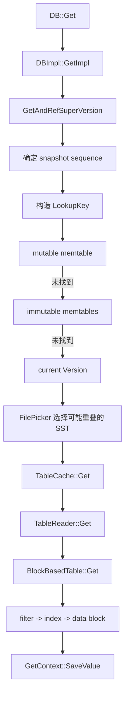
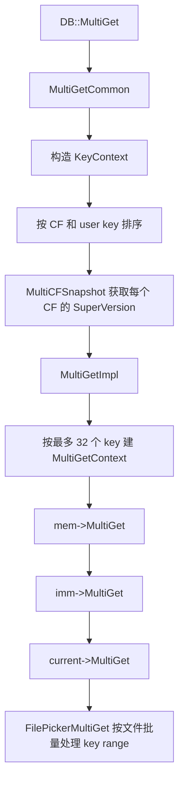
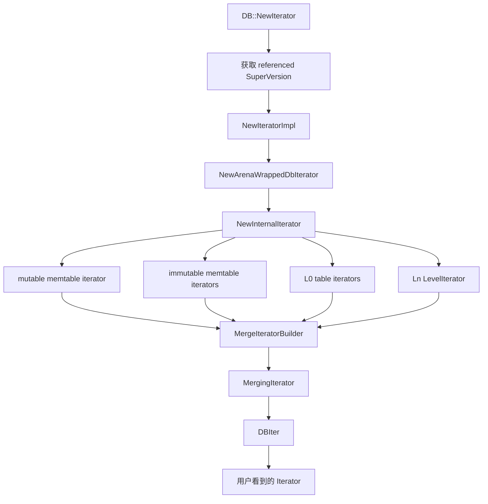
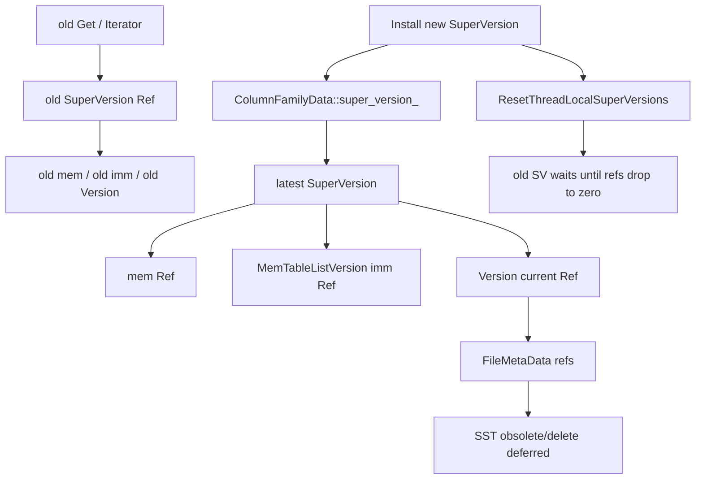

## 今日主题

- 主主题：`Read Path / Get / MultiGet / Iterator`
- 副主题：`SuperVersion 读视图、点查路径、批量点查路径、迭代器树`

## 学习目标

- 讲清一次 `Get()` 为什么不是直接去 SST 里找 key
- 讲清 `SuperVersion` 在读路径里稳定了哪些对象
- 讲清 `LookupKey`、`GetContext`、`FilePicker`、`TableCache` 各自负责什么
- 讲清 `Get`、`MultiGet`、`Iterator` 三条读 API 的共同骨架与差异
- 明确哪些内容留到后续章节继续深挖：
  - snapshot 与 sequence number 可见性
  - block cache / filter / table reader 打开过程
  - `MergingIterator` 与 `DBIter` 的完整扫描细节

## 前置回顾

Day 008 已经从写侧看清了 block-based SST 的生成过程：

- `BuildTable(...)` 把 flush/compaction 的有序输入流交给 `TableBuilder`
- `BlockBasedTableBuilder` 把输入拆成 data block、index block、filter block、properties block、metaindex block 和 footer
- footer 只是 SST 的尾部入口，真正从 key 定位 data block 还要依赖 index/filter/table reader

所以 Day 009 反过来看读侧：

- `Get()` 怎么先经过 memtable 和 immutable memtable
- SST 层如何从 `Version` 走到 `TableCache`，再走到具体 `TableReader`
- `Iterator` 为什么要构造一棵内部迭代器树，而不是反复调用 `Get()`

## 源码入口

- `D:\program\rocksdb\include\rocksdb\db.h`
- `D:\program\rocksdb\db\db_impl\db_impl.cc`
- `D:\program\rocksdb\db\db_impl\db_impl.h`
- `D:\program\rocksdb\db\column_family.h`
- `D:\program\rocksdb\db\column_family.cc`
- `D:\program\rocksdb\db\job_context.h`
- `D:\program\rocksdb\db\dbformat.cc`
- `D:\program\rocksdb\db\lookup_key.h`
- `D:\program\rocksdb\db\memtable.cc`
- `D:\program\rocksdb\db\memtable_list.cc`
- `D:\program\rocksdb\db\version_set.cc`
- `D:\program\rocksdb\db\version_set.h`
- `D:\program\rocksdb\db\table_cache.cc`
- `D:\program\rocksdb\table\table_reader.h`
- `D:\program\rocksdb\table\get_context.h`
- `D:\program\rocksdb\table\get_context.cc`
- `D:\program\rocksdb\table\multiget_context.h`
- `D:\program\rocksdb\table\block_based\block_based_table_reader.cc`
- `D:\program\rocksdb\db\arena_wrapped_db_iter.cc`
- `D:\program\rocksdb\db\db_iter.cc`
- `D:\program\rocksdb\table\merging_iterator.cc`

## 它解决什么问题

读路径要解决的不是“从一个地方找到 key”这么简单。RocksDB 的数据可能同时存在于：

1. 当前 mutable memtable
2. 多个 immutable memtable
3. L0 中可能重叠的 SST
4. L1 及以后通常不重叠、按 key range 排列的 SST

同时，同一个 user key 还可能有多个 internal key 版本：

- put
- delete
- single delete
- merge operand
- range tombstone 覆盖
- blob index
- wide column entity

所以读路径的核心问题是：

`在一个稳定的读视图上，按照从新到旧的顺序，找到对当前 snapshot 可见的第一个决定性结果。`

这里的“稳定读视图”很关键。读线程不能直接看一堆正在变化的成员变量，否则 flush、compaction、manifest 安装新版本时，读线程可能看到一半旧状态、一半新状态。RocksDB 用 `SuperVersion` 把当前列族的读视图打包起来：

- `mem`
- `imm`
- `current Version`
- `mutable_cf_options`

也就是说，读路径不是直接读 `ColumnFamilyData` 当前散落状态，而是先拿住一个 `SuperVersion`，再在这个视图上执行查找。

## 它是怎么工作的

### `Get()` 主链



主流程可以压成一句话：

`GetImpl 在 SuperVersion 上构造 LookupKey，然后依次查 mem、imm、current Version；真正进入 SST 后，由 Version 选文件、TableCache 找 table reader、BlockBasedTableReader 再用 filter/index/data block 查具体 key。`

### `MultiGet()` 主链



`MultiGet()` 不是简单循环调用 `Get()`。它会先把 key 按 column family 和 key 顺序整理，再在 memtable、SST、filter、block cache 层尽量批处理。

### `Iterator()` 主链



`Iterator` 的关键差异是：

- 它不只找一个 key
- 它要把 mem、imm、L0、Ln 这些有序来源合并成一个 internal key 流
- 再由 `DBIter` 过滤不可见版本、删除标记、merge operand，最终暴露用户可见的 key/value

## 关键数据结构与实现点

### `SuperVersion`

`SuperVersion` 是读路径的稳定视图。

它不是 snapshot 本身。snapshot 解决“读到哪个 sequence number”；`SuperVersion` 解决“这次读看到哪一组 memtable / immutable memtable / Version 对象”。

### `LookupKey`

`LookupKey` 是把 user key 和 snapshot sequence 拼成 internal seek key 的工具。

它同时提供：

- `memtable_key()`
- `internal_key()`
- `user_key()`

这让同一个查找目标可以在 memtable、SST index、data block 中复用。

### `GetContext`

`GetContext` 是点查状态机。

它记录：

- 当前查找的 user key
- 结果状态：`kNotFound / kFound / kDeleted / kMerge / kCorrupt ...`
- range tombstone 最大覆盖 sequence
- merge operands
- 返回 value 或 wide columns 的 pin/copy 方式

`TableReader::Get()`、`MemTable::Get()` 最终都会通过 `GetContext::SaveValue()` 把候选 internal key 交给同一套状态机处理。

### `FilePicker`

`FilePicker` 是 `Version::Get()` 在 SST 层找候选文件的工具。

它的行为和 LSM 层级有关：

- L0 文件可能互相重叠，需要检查多个文件
- L1+ 文件通常不重叠，可以通过 key range 和二分缩小候选范围
- 如果当前文件没有命中，还要继续往下一层找

### `TableCache`

`TableCache` 把 `FileMetaData` 里的文件描述和实际 `TableReader` 连接起来。

它不是 block cache。它负责：

- 找到或打开 table reader
- 在 `read_tier == kBlockCacheTier` 时遵守 no-IO 语义
- 把请求转交给具体 `TableReader`

### `BlockBasedTableReader`

`BlockBasedTable::Get()` 是 day008 的反向消费方。

它会按大致顺序做：

1. full filter 判断 key 是否可能存在
2. index iterator 定位候选 data block
3. data block iterator 在块内 `SeekForGet`
4. 调用 `GetContext::SaveValue()` 处理 internal key

### `MultiGetContext`

`MultiGetContext` 是批量点查的工作集。

它把一组 key 变成：

- `LookupKey`
- internal key
- user key without timestamp
- 每个 key 的 `GetContext`
- 一个 range / mask，用于标记哪些 key 已经完成、哪些 key 还要继续往更老层级查

当前本地源码里 `MAX_BATCH_SIZE` 是 `32`。

### `MergeIteratorBuilder / MergingIterator / DBIter`

Iterator 路径分两层：

- `MergingIterator` 合并多个 internal iterator
- `DBIter` 把 internal key 流变成用户可见 key/value 流

这就是为什么范围扫描不能简单理解成“从每个 SST 读一点再返回”。它需要处理多路合并、sequence 可见性、删除遮蔽、merge operand 和 range tombstone。

## 源码细读

这次选 11 个关键片段，把读路径从 API 入口串到 memtable、SST 和 iterator。

### 1. `SuperVersion` 把读路径需要的对象固定下来

```cpp
// db/column_family.h, SuperVersion
struct SuperVersion {
  ColumnFamilyData* cfd;
  ReadOnlyMemTable* mem;
  MemTableListVersion* imm;
  Version* current;
  MutableCFOptions mutable_cf_options;
  uint64_t version_number;
  ...
};
```

这段结构定义直接说明：

- 前台读看到的不是单个对象
- 而是一组绑定在一起的对象

`mem`、`imm`、`current` 是读路径最核心的三段：

1. 最新可写 memtable
2. 等待 flush 的 immutable memtable 列表
3. 当前 Version 中的 SST 文件集合

所以 `SuperVersion` 是 Day 002 提到的“稳定读视图”的具体落点。

### 2. `GetImpl()` 先拿 `SuperVersion`，再确定 snapshot

```cpp
// db/db_impl/db_impl.cc, DBImpl::GetImpl(...)
SuperVersion* sv = GetAndRefSuperVersion(cfd);
...
SequenceNumber snapshot;
if (read_options.snapshot != nullptr) {
  snapshot = static_cast<const SnapshotImpl*>(read_options.snapshot)->number_;
} else {
  // 先引用 SuperVersion，再取 last published sequence，避免 flush/compaction
  // 在中间让读线程看到不自洽的状态。
  snapshot = GetLastPublishedSequence();
}
...
LookupKey lkey(key, snapshot, read_options.timestamp);
```

这里有一个非常重要的顺序：

`先拿 SuperVersion，再确定本次读的 sequence。`

源码注释解释了原因：如果先取 snapshot，再拿 `SuperVersion`，中间发生 flush/compaction，就可能让读线程既看不到旧数据，也看不到新数据。

这也是读路径里“稳定视图”和“可见性边界”分开的地方：

- `SuperVersion` 固定对象集合
- `snapshot sequence` 固定可见版本上界
- `LookupKey` 把 user key 和 sequence 打包成 internal lookup key

### 3. `GetImpl()` 的查找顺序是 mem -> imm -> current Version

```cpp
// db/db_impl/db_impl.cc, DBImpl::GetImpl(...)
if (!skip_memtable) {
  if (sv->mem->Get(lkey, value, columns, timestamp, &s, &merge_context,
                   &max_covering_tombstone_seq, read_options,
                   false /* immutable_memtable */, callback, is_blob_index)) {
    done = true;
  } else if ((s.ok() || s.IsMergeInProgress()) &&
             sv->imm->Get(lkey, value, columns, timestamp, &s, &merge_context,
                          &max_covering_tombstone_seq, read_options, callback,
                          is_blob_index)) {
    done = true;
  }
}

if (!done) {
  sv->current->Get(read_options, lkey, value, columns, timestamp, &s,
                   &merge_context, &max_covering_tombstone_seq,
                   &pinned_iters_mgr, value_found, nullptr, nullptr, callback,
                   is_blob_index, get_value);
}
```

这段就是点查主链的骨架。

注意这里不是“先 SST 后 memtable”，而是：

1. mutable memtable
2. immutable memtables
3. current Version 里的 SST

原因很直观：

- memtable 中的数据更新
- SST 中的数据更旧
- 同一个 user key 的新版本应该优先遮蔽旧版本

如果 mem/imm 已经找到决定性结果，就不进入 SST；如果遇到 merge operand 或未完成状态，可能还要继续往更老层找 base value。

### 4. `LookupKey` 同时服务 memtable 和 internal iterator

```cpp
// db/lookup_key.h, LookupKey
class LookupKey {
 public:
  Slice memtable_key() const {
    return Slice(start_, static_cast<size_t>(end_ - start_));
  }

  Slice internal_key() const {
    return Slice(kstart_, static_cast<size_t>(end_ - kstart_));
  }

  Slice user_key() const {
    return Slice(kstart_, static_cast<size_t>(end_ - kstart_ - 8));
  }
};
```

```cpp
// db/dbformat.cc, LookupKey::LookupKey(...)
dst = EncodeVarint32(dst, static_cast<uint32_t>(usize + ts_sz + 8));
kstart_ = dst;
memcpy(dst, _user_key.data(), usize);
...
EncodeFixed64(dst, PackSequenceAndType(s, kValueTypeForSeek));
```

这里可以看到三层 key 视角：

- memtable key：带长度前缀，适合 memtable 内部查找
- internal key：`user key + sequence/type`
- user key：对用户暴露的逻辑 key

这解释了为什么读路径一开始要构造 `LookupKey`，而不是一直拿原始 user key 往下传。

### 5. `MemTable::Get()` 先处理 range tombstone 和 bloom，再进表内查找

```cpp
// db/memtable.cc, MemTable::Get(...)
auto range_del_iter = NewRangeTombstoneIterator(
    read_opts, GetInternalKeySeqno(key.internal_key()), immutable_memtable);
if (range_del_iter != nullptr) {
  SequenceNumber covering_seq =
      range_del_iter->MaxCoveringTombstoneSeqnum(key.user_key());
  if (covering_seq > *max_covering_tombstone_seq) {
    *max_covering_tombstone_seq = covering_seq;
  }
}

if (bloom_filter_ && !may_contain) {
  *seq = kMaxSequenceNumber;
} else {
  GetFromTable(key, *max_covering_tombstone_seq, do_merge, callback,
               is_blob_index, value, columns, timestamp, s, merge_context,
               seq, &found_final_value, &merge_in_progress);
}
```

memtable 读路径不是只做 skiplist 查找。

它先看 range tombstone：

- 如果有覆盖当前 key 的范围删除，要记录最高覆盖 sequence
- 后续点 key 如果比 tombstone 更旧，会被 tombstone 遮蔽

然后再看 memtable bloom：

- 如果 bloom 明确不可能存在，就不用进底层 `MemTableRep`
- 如果可能存在，再进入 `GetFromTable(...)`

这也解释了 Day 006 中的一个遗留点：range tombstone 会让 memtable bloom 优化变复杂，因为即使点 key 不存在，范围删除也可能决定最终结果。

### 6. `Version::Get()` 用 `FilePicker` 在 SST 层逐层找候选文件

```cpp
// db/version_set.cc, Version::Get(...)
FilePicker fp(user_key, ikey, &storage_info_.level_files_brief_,
              storage_info_.num_non_empty_levels_,
              &storage_info_.file_indexer_, user_comparator(),
              internal_comparator());
FdWithKeyRange* f = fp.GetNextFile();

while (f != nullptr) {
  *status = table_cache_->Get(
      read_options, *internal_comparator(), *f->file_metadata, ikey,
      &get_context, mutable_cf_options_,
      cfd_->internal_stats()->GetFileReadHist(fp.GetHitFileLevel()),
      IsFilterSkipped(static_cast<int>(fp.GetHitFileLevel()),
                      fp.IsHitFileLastInLevel()),
      fp.GetHitFileLevel(), max_file_size_for_l0_meta_pin_);

  switch (get_context.State()) {
    case GetContext::kNotFound:
    case GetContext::kMerge:
      break;       // 继续查更老的文件
    case GetContext::kFound:
      return;      // 找到最终值
    case GetContext::kDeleted:
      *status = Status::NotFound();
      return;
    ...
  }
  f = fp.GetNextFile();
}
```

这段把 SST 层点查讲清楚了：

- `Version` 不直接读文件
- 它先用 `FilePicker` 找“当前 key 可能落在哪些 SST”
- 每个候选文件交给 `TableCache::Get(...)`
- 查找状态由 `GetContext` 控制

`kNotFound` 和 `kMerge` 都不一定能立刻结束：

- `kNotFound`：当前文件没有，继续找更老层
- `kMerge`：已经收集到 merge operand，但还需要更老 base value

`kFound` 和 `kDeleted` 才是更明确的终止状态。

### 7. `FilePicker` 区分 L0 与 L1+ 的文件选择方式

```cpp
// db/version_set.cc, FilePicker::PrepareNextLevel()
if (curr_level_ == 0) {
  // L0 文件可能重叠，要从头检查
  start_index = 0;
} else {
  // L1+ 文件按范围排序，用二分和上一层结果缩小范围
  start_index = FindFileInRange(*internal_comparator_, *curr_file_level_,
                                ikey_, search_left_bound_,
                                search_right_bound_ + 1);
  if (start_index == search_right_bound_ + 1) {
    // 当前 level 不可能包含这个 key，跳到下一层
    search_left_bound_ = 0;
    search_right_bound_ = FileIndexer::kLevelMaxIndex;
    curr_level_++;
    continue;
  }
}
```

这是读放大的第一层来源：

- L0 文件可能重叠，点查可能要看多个 L0 文件
- L1+ 文件通常不重叠，点查可以更快缩小到一个候选范围

这也是后面学习 compaction 时必须回来的点：

- compaction 不只是“整理磁盘空间”
- 它还会改变读路径要检查的文件数量

### 8. `TableCache::Get()` 负责找到 table reader，再交给 reader

```cpp
// db/table_cache.cc, TableCache::Get(...)
TableReader* t = fd.table_reader;
TypedHandle* handle = nullptr;
if (s.ok() && !done) {
  if (t == nullptr) {
    s = FindTable(options, file_options_, internal_comparator, file_meta,
                  &handle, mutable_cf_options,
                  options.read_tier == kBlockCacheTier /* no_io */,
                  file_read_hist, skip_filters, level,
                  true /* prefetch_index_and_filter_in_cache */,
                  max_file_size_for_l0_meta_pin, file_meta.temperature);
    if (s.ok()) {
      t = cache_.Value(handle);
    }
  }
  ...
  if (s.ok()) {
    s = t->Get(options, k, get_context,
               mutable_cf_options.prefix_extractor.get(), skip_filters);
  } else if (options.read_tier == kBlockCacheTier && s.IsIncomplete()) {
    get_context->MarkKeyMayExist();
    done = true;
  }
}
```

这里有两个边界：

第一，`TableCache` 不是 `BlockBasedTable` 自己。

- `TableCache` 管理 table reader 的打开、缓存和 no-IO 行为
- 具体 table 格式的查找交给 `TableReader::Get`

第二，`kBlockCacheTier` 这种 no-IO 读不是“确认不存在”。

- 如果 table/index/data 不在 cache 中，可能返回 `Incomplete`
- 此时只能标记 `KeyMayExist`

所以 `KeyMayExist()` 之类 API 的语义要比 `Get()` 弱。

### 9. `BlockBasedTable::Get()` 反向消费 day008 的 SST 结构

```cpp
// table/block_based/block_based_table_reader.cc, BlockBasedTable::Get(...)
const bool may_match =
    FullFilterKeyMayMatch(filter, key, prefix_extractor, get_context,
                          &lookup_context, read_options);

if (may_match) {
  auto iiter = NewIndexIterator(read_options, need_upper_bound_check,
                                &iiter_on_stack, get_context,
                                &lookup_context);

  for (iiter->Seek(key); iiter->Valid() && !done; iiter->Next()) {
    IndexValue v = iiter->value();
    DataBlockIter biter;
    NewDataBlockIterator(read_options, v.handle, &biter, BlockType::kData,
                         get_context, &lookup_data_block_context, nullptr,
                         false, false, tmp_status, true);

    bool may_exist = biter.SeekForGet(key);
    if (!may_exist && ts_sz == 0) {
      done = true;
    } else {
      for (; biter.Valid(); biter.Next()) {
        ParsedInternalKey parsed_key;
        Status pik_status = ParseInternalKey(biter.key(), &parsed_key, false);
        bool ret = get_context->SaveValue(
            parsed_key, biter.value(), &matched, &read_status,
            biter.IsValuePinned() ? &biter : nullptr);
        if (!ret) {
          done = true;
          break;
        }
      }
    }
  }
}
```

这段正好把 Day 008 的结构反向串起来：

1. 先用 full filter 做快速否定
2. 再用 index block 找候选 data block
3. 读出 data block 后做块内 seek
4. 逐条 internal key 交给 `GetContext::SaveValue()`

这里也能解释一个常见误区：

- index/filter 不是最终结果
- 它们只是减少要读的 data block
- 最终 value/delete/merge 语义仍然要交给 `GetContext`

### 10. `GetContext::SaveValue()` 是点查状态机

```cpp
// table/get_context.cc, GetContext::SaveValue(...)
if (ucmp_->EqualWithoutTimestamp(parsed_key.user_key, user_key_)) {
  *matched = true;
  if (!CheckCallback(parsed_key.sequence)) {
    return true;  // 当前版本不可见，继续看更老版本
  }

  auto type = parsed_key.type;
  if (max_covering_tombstone_seq_ != nullptr &&
      *max_covering_tombstone_seq_ > parsed_key.sequence) {
    type = kTypeRangeDeletion;
  }

  switch (type) {
    case kTypeValue:
    case kTypeValuePreferredSeqno:
    case kTypeBlobIndex:
    case kTypeWideColumnEntity:
      state_ = kFound;
      ...
      return false;
    case kTypeDeletion:
    case kTypeDeletionWithTimestamp:
    case kTypeSingleDeletion:
    case kTypeRangeDeletion:
      state_ = kDeleted;
      return false;
    case kTypeMerge:
      state_ = kMerge;
      ...
      return true;
  }
}
```

这段代码是读路径语义的中心。

它回答了几个关键问题：

- 为什么同一个 user key 可能要继续往后读？
  - 因为当前看到的可能是不可见版本，或者是 merge operand
- 为什么范围删除可以盖过点 key？
  - 因为 `max_covering_tombstone_seq` 比点 key sequence 更新时，会把类型改成 `kTypeRangeDeletion`
- 为什么 `Get()` 能区分 NotFound 和 Deleted？
  - `GetContext` 内部有状态机，但最终对用户通常都转成 `Status::NotFound()`

本节先不把 merge operator 完整展开。这里只需要记住：merge 会让点查不能在第一个 operand 处停下，必须继续往更老版本找 base value。

### 11. `Iterator` 先构造内部迭代器树，再由 `DBIter` 做用户可见过滤

```cpp
// db/db_impl/db_impl.cc, DBImpl::NewInternalIterator(...)
MergeIteratorBuilder merge_iter_builder(&cfd->internal_comparator(), arena,
    !read_options.total_order_seek && prefix_extractor != nullptr,
    read_options.iterate_upper_bound);

auto mem_iter = super_version->mem->NewIterator(
    read_options, super_version->GetSeqnoToTimeMapping(), arena,
    super_version->mutable_cf_options.prefix_extractor.get(),
    false /* for_flush */);
merge_iter_builder.AddPointAndTombstoneIterator(mem_iter, ...);

super_version->imm->AddIterators(read_options,
    super_version->GetSeqnoToTimeMapping(),
    super_version->mutable_cf_options.prefix_extractor.get(),
    &merge_iter_builder, !read_options.ignore_range_deletions);

if (read_options.read_tier != kMemtableTier) {
  super_version->current->AddIterators(read_options, file_options_,
                                      &merge_iter_builder,
                                      allow_unprepared_value);
}

internal_iter = merge_iter_builder.Finish(...);
```

`NewInternalIterator()` 的工作就是把所有读来源都挂到同一个合并器上：

- mutable memtable iterator
- immutable memtable iterators
- L0 table iterators
- L1+ level iterators

然后 `DBIter` 再包住这个 internal iterator：

```cpp
// db/arena_wrapped_db_iter.cc, NewArenaWrappedDbIterator(...)
db_iter->Init(env, read_options, cfh->cfd()->ioptions(),
              sv->mutable_cf_options, sv->current, sequence,
              sv->version_number, read_callback, cfh, expose_blob_index,
              allow_refresh, allow_mark_memtable_for_flush ? sv->mem : nullptr);

InternalIterator* internal_iter = db_impl->NewInternalIterator(
    db_iter->GetReadOptions(), cfh->cfd(), sv, db_iter->GetArena(), sequence,
    true /* allow_unprepared_value */, db_iter);
db_iter->SetIterUnderDBIter(internal_iter);
```

所以 iterator 路径有两层职责：

- `MergingIterator`：合并多路 internal key
- `DBIter`：按 snapshot / timestamp / delete / merge 语义整理成用户可见结果

这和 `Get()` 很不一样。`Get()` 是围绕一个 key 做短路查找；`Iterator` 是围绕一个有序流做持续过滤。

## 今日问题与讨论

### 我的问题

#### 问题 1：`Get()` 为什么要先查 memtable，再查 SST？

- 简答：
  - 因为 memtable 中的数据更新，SST 中的数据更旧；同一个 user key 的新版本应该先决定结果。
- 源码依据：
  - `D:\program\rocksdb\db\db_impl\db_impl.cc` 的 `DBImpl::GetImpl(...)`
- 当前结论：
  - `GetImpl` 的顺序明确是 `sv->mem->Get(...) -> sv->imm->Get(...) -> sv->current->Get(...)`。
  - 如果 mem/imm 已经找到最终值或删除标记，就不需要继续查 SST。
- 是否需要后续回看：
  - `yes`
  - 学 snapshot / sequence number 时回看这个顺序为什么能保证可见性。

#### 问题 2：`SuperVersion` 和 snapshot 是一回事吗？

- 简答：
  - 不是。
  - `SuperVersion` 固定读路径要看的对象集合；snapshot 固定可见的 sequence 上界。
- 源码依据：
  - `D:\program\rocksdb\db\column_family.h` 的 `SuperVersion`
  - `D:\program\rocksdb\db\db_impl\db_impl.cc` 的 `DBImpl::GetImpl(...)`
- 当前结论：
  - 没有 snapshot 时，`GetImpl` 会先引用 `SuperVersion`，再取 `GetLastPublishedSequence()`。
  - 这个顺序是为了避免 flush/compaction 夹在中间造成读视图不自洽。
- 是否需要后续回看：
  - `yes`
  - Day 010 建议专门讲 snapshot / sequence number 可见性。

#### 问题 3：`GetContext` 为什么是状态机，而不是直接返回 value？

- 简答：
  - 因为点查可能遇到 value、delete、merge operand、range tombstone、blob index、wide column 和不可见版本。
- 源码依据：
  - `D:\program\rocksdb\table\get_context.h`
  - `D:\program\rocksdb\table\get_context.cc`
- 当前结论：
  - `GetContext::SaveValue()` 的返回值控制“是否继续往更老版本查”。
  - `kFound / kDeleted / kCorrupt` 等是终止状态；`kNotFound / kMerge` 常常需要继续搜索。
- 是否需要后续回看：
  - `yes`
  - merge operator 与 blob index 后面可以单独展开。

#### 问题 4：`MultiGet()` 是否只是循环调用 `Get()`？

- 简答：
  - 不是。
  - 它复用了 Get 的语义，但会按 CF/key 排序、分批构造 `MultiGetContext`，并在 memtable 和 SST 层做批处理。
- 源码依据：
  - `D:\program\rocksdb\db\db_impl\db_impl.cc` 的 `MultiGetCommon(...)`、`MultiGetImpl(...)`
  - `D:\program\rocksdb\table\multiget_context.h`
  - `D:\program\rocksdb\db\version_set.cc` 的 `Version::MultiGet(...)`
- 当前结论：
  - 当前本地源码中 `MultiGetContext::MAX_BATCH_SIZE` 是 `32`。
  - `Version::MultiGet()` 会使用 `FilePickerMultiGet`，按文件和 key range 批量查。
- 是否需要后续回看：
  - `yes`
  - block cache / async I/O / filter 章节再看 MultiGet 的 I/O 优化。

#### 问题 5：Iterator 为什么不直接复用 `Get()`？

- 简答：
  - 因为 Iterator 要产生连续有序结果，它需要合并多个有序来源，并过滤 internal key 版本。
- 源码依据：
  - `D:\program\rocksdb\db\db_impl\db_impl.cc` 的 `NewInternalIterator(...)`
  - `D:\program\rocksdb\table\merging_iterator.cc`
  - `D:\program\rocksdb\db\db_iter.cc`
- 当前结论：
  - Iterator 的底层是 `mem/imm/SST iterators -> MergingIterator -> DBIter`。
  - `Get()` 是单 key 短路查找；Iterator 是多路有序流合并与可见性过滤。
- 是否需要后续回看：
  - `yes`
  - 范围扫描、`MergingIterator`、`DBIter` 的 reverse/merge 细节后续可以继续拆。

#### 问题 6：memtable `Get()` 中 bloom 策略是怎样的？

- 简答：
  - memtable bloom 是一个可选的动态 bloom，只有配置打开后才存在。
  - 写入 memtable 时，RocksDB 可以把 prefix 和 whole key 都加入同一个 `bloom_filter_`。
  - 点查 `Get()` 时，如果 whole-key bloom 开启，优先按 whole key 查；否则在 key 落入 prefix extractor domain 时按 prefix 查。
  - 如果 bloom 返回“不可能存在”，本 memtable 的点 key 查找可以直接跳过；如果 bloom 返回“可能存在”，还必须进入 memtable 底层表查找。
  - bloom 本身不区分 value、delete、merge、blob index、wide column 等 value type，也不判断 sequence 可见性。它只保存过滤用的 key 或 prefix；真正的类型语义由 `SaveValue()` 解析 internal key 后处理。
- 源码依据：
  - `D:\program\rocksdb\include\rocksdb\advanced_options.h`
  - `D:\program\rocksdb\db\memtable.cc` 的 `MemTable::MemTable(...)`、`MemTable::Add(...)`、`MemTable::Get(...)`、`MemTable::MultiGet(...)`
- 关键源码片段：

```cpp
// db/memtable.cc, MemTable::MemTable(...)
// use bloom_filter_ for both whole key and prefix bloom filter
if ((prefix_extractor_ || moptions_.memtable_whole_key_filtering) &&
    moptions_.memtable_prefix_bloom_bits > 0) {
  bloom_filter_.reset(
      new DynamicBloom(&arena_, moptions_.memtable_prefix_bloom_bits,
                       6 /* hard coded 6 probes */,
                       moptions_.memtable_huge_page_size, ioptions.logger));
}
```

```cpp
// db/memtable.cc, MemTable::Add(...)
if (bloom_filter_ && prefix_extractor_ &&
    prefix_extractor_->InDomain(key_without_ts)) {
  bloom_filter_->Add(prefix_extractor_->Transform(key_without_ts));
}
if (bloom_filter_ && moptions_.memtable_whole_key_filtering) {
  bloom_filter_->Add(key_without_ts);
}
```

这段发生在 entry 已经写入 `table_` 或 `range_del_table_` 之后，并没有按 `ValueType` 排除 delete/merge。也就是说，点删除 `kTypeDeletion`、`kTypeSingleDeletion`、`kTypeDeletionWithTimestamp` 也会让对应 key 加入 memtable bloom。范围删除 `kTypeRangeDeletion` 存在单独的 `range_del_table_`，当前 `Get()` 会先看 range tombstone，再看 bloom；`MultiGet()` 在存在 range tombstone 且没有忽略范围删除时会基本禁用 bloom 跳过逻辑。

```cpp
// db/memtable.cc, MemTable::Get(...)
if (bloom_filter_) {
  // 同时有 whole key 与 prefix 时，点查优先 whole key，节省 CPU。
  if (moptions_.memtable_whole_key_filtering) {
    may_contain = bloom_filter_->MayContain(user_key_without_ts);
    bloom_checked = true;
  } else {
    assert(prefix_extractor_);
    if (prefix_extractor_->InDomain(user_key_without_ts)) {
      may_contain = bloom_filter_->MayContain(
          prefix_extractor_->Transform(user_key_without_ts));
      bloom_checked = true;
    }
  }
}

if (bloom_filter_ && !may_contain) {
  PERF_COUNTER_ADD(bloom_memtable_miss_count, 1);
  *seq = kMaxSequenceNumber;
} else {
  GetFromTable(...);
}
```

这段是读侧关键：`!may_contain` 可以跳过 memtable rep；`may_contain == true` 只是“可能有”，仍然要进 `GetFromTable()`。所以 memtable bloom 不是用来确认 memtable 中到底有这个 key，而是用来快速确认“这个 memtable 不值得查”。

```cpp
// include/rocksdb/advanced_options.h, ColumnFamilyOptions
// * If prefix_extractor is set, the filter includes prefixes.
// * If memtable_whole_key_filtering, the filter includes whole keys.
// * If both, the filter includes both.
// * If neither, the feature is disabled.
double memtable_prefix_bloom_size_ratio = 0.0;

// Enable whole key bloom filter in memtable.
// ... can potentially reduce CPU usage for point-look-ups.
bool memtable_whole_key_filtering = false;
```

prefix bloom 和 whole-key bloom 的区别是过滤粒度不同：

- prefix bloom 存的是 `prefix_extractor->Transform(user_key_without_ts)`。
  - 它回答的是“这个 memtable 里是否可能有某个 key 带这个 prefix”。
  - 对 prefix seek / prefix iterator 有用。
  - 对点查不够精确：如果 memtable 里有 `user:1`，查询 `user:999`，只要 prefix 都是 `user:`，prefix bloom 仍可能放行。
- whole-key bloom 存的是完整 `user_key_without_ts`。
  - 它回答的是“这个 memtable 里是否可能有这个完整 user key 的某个 internal entry”。
  - 对点查更精确，源码里 `Get()` 在 prefix 与 whole-key 都启用时优先 whole-key，以减少无意义查找。
  - 它仍然不说明这个 entry 是 value 还是 delete，也不说明它对当前 snapshot 是否可见。

prefix 的原理来自 `SliceTransform`，也就是用户配置的“从 key 提取过滤键”的函数：

```cpp
// include/rocksdb/slice_transform.h, SliceTransform
class SliceTransform : public Customizable {
 public:
  // 从 key 中提取 prefix。只有 InDomain(key) 为 true 的 key
  // 才应该被加入或查询 prefix bloom。
  virtual Slice Transform(const Slice& key) const = 0;
  virtual bool InDomain(const Slice& key) const = 0;
};
```

常见内置实现有两个：

```cpp
// util/slice.cc, FixedPrefixTransform
Slice Transform(const Slice& src) const override {
  assert(InDomain(src));
  return Slice(src.data(), prefix_len_);
}

bool InDomain(const Slice& src) const override {
  return (src.size() >= prefix_len_);
}
```

```cpp
// util/slice.cc, CappedPrefixTransform
Slice Transform(const Slice& src) const override {
  assert(InDomain(src));
  return Slice(src.data(), std::min(cap_len_, src.size()));
}

bool InDomain(const Slice& /*src*/) const override { return true; }
```

举例说，如果 key 设计为 `tenant_id + ":" + object_id`，并配置一个能把 `tenant_id + ":"` 提出来的 extractor，那么：

- 写入 `tenantA:001`、`tenantA:002` 时，prefix bloom 里加入的是 `tenantA:`，而不是两个完整 key。
- 查询 `tenantA:999` 时，prefix bloom 会说“这个 memtable 可能有 `tenantA:` 这个 prefix”，所以不能跳过。
- 查询 `tenantB:001` 时，如果 Bloom 判断 `tenantB:` 不存在，就可以跳过这个 memtable。

所以 prefix bloom 的收益来自“按业务前缀成组过滤”：它不能精确判断某个点 key 是否存在，但能快速判断“这个 memtable 是否可能包含某一组前缀的 key”。

这里还有一个重要约束：`prefix_extractor` 必须和 comparator 配合，保证同一 prefix 的 key 在排序上是连续的一组。`include/rocksdb/options.h` 对 `ColumnFamilyOptions::prefix_extractor` 的注释要求：如果 `k1 <= k2 <= k3` 且 `k1`、`k3` 有同一个 prefix，那么中间的 `k2` 也必须在 domain 内且有同一个 prefix。否则 prefix seek / prefix filter 可能把本该看到的 key 错误过滤掉。

- 当前结论：
  - bloom 在 memtable 层只能做“快速否定”，不能做“确认存在”。
  - delete 也会加入 bloom，因为 bloom 只按 user key / prefix 过滤，不承载 value type 语义；delete 的最终语义由 `SaveValue()` 里的 `kTypeDeletion / kTypeSingleDeletion / kTypeDeletionWithTimestamp` 分支处理。
  - `Get()` 的 whole-key bloom 比 prefix bloom 更精准；源码里当二者都存在时，点查优先 whole-key。
  - prefix bloom 的优势不在精确点查，而在 prefix seek / prefix iterator 这类按前缀访问的场景。
  - `MultiGet()` 还有一个重要限制：只要存在 range tombstone 且没有忽略 range deletion，就基本禁用 memtable bloom 跳过逻辑，避免漏掉“点 key 不存在但被范围删除覆盖”的语义。

```cpp
// db/memtable.cc, MemTable::MultiGet(...)
// 当前只要存在 range tombstone，memtable Bloom 基本禁用。
bool no_range_del = read_options.ignore_range_deletions ||
                    is_range_del_table_empty_.LoadRelaxed();
if (bloom_filter_ && no_range_del) {
  ...
  bloom_filter_->MayContain(num_keys, bloom_keys.data(), may_match.data());
  ...
}
```

- 是否需要后续回看：
  - `yes`
  - 到 Bloom filter / prefix seek 章节时，需要把 memtable bloom 与 SST filter 对比。

#### 问题 7：如果一个 key 不存在，最坏情况下是否要查 L0 所有文件 + L1 到 Ln 各层 SST？

- 简答：
  - 更准确的说法是：最坏情况下会先查 mem/imm，然后在 SST 层查所有可能覆盖该 key 的候选文件。
  - 对 L0 来说，由于文件可能重叠，确实可能检查多个甚至所有 L0 文件。
  - 对 L1+ 来说，leveled compaction 正常情况下同一层文件 key range 不重叠，所以通常每层最多命中一个候选文件；不是扫描该层所有 SST。
  - 但如果存在 merge operand、range tombstone、异常重叠文件或特殊 compaction/ingestion 场景，源码注释也承认“重叠可能出现在任意 level”，只是非 L0 的常规点查会用二分和文件索引缩小范围。
- 源码依据：
  - `D:\program\rocksdb\db\version_set.cc` 的 `FilePicker::GetNextFile()`、`FilePicker::PrepareNextLevel()`
- 关键源码片段：

```cpp
// db/version_set.cc, FilePicker::PrepareNextLevel()
// 有些文件可能互相重叠。找出所有与 user_key 重叠的文件，并按从新到旧处理。
// 在 merge operator 场景，这可能发生在任意 level。
// 否则通常只发生在 Level-0。
if (curr_level_ == 0) {
  // L0 需要遍历检查重叠文件。
  start_index = 0;
} else {
  // Ln(n>=1) 文件有序，用二分找到 largest key >= ikey 的最早文件。
  start_index =
      FindFileInRange(*internal_comparator_, *curr_file_level_, ikey_,
                      static_cast<uint32_t>(search_left_bound_),
                      static_cast<uint32_t>(search_right_bound_) + 1);
  if (start_index == search_right_bound_ + 1) {
    // 当前层不可能包含这个 key，跳过该层。
    search_left_bound_ = 0;
    search_right_bound_ = FileIndexer::kLevelMaxIndex;
    curr_level_++;
    continue;
  }
}
```

- 当前结论：
  - 不存在 key 的“最坏”不是简单等于“扫全库所有 SST”。
  - 更贴近源码的模型是：
    - memtable：按当前 mem/imm 查
    - L0：可能检查多个候选文件，最坏接近全部 L0 文件
    - L1+：每层通过范围判断与二分定位候选文件，常规 leveled 情况下每层最多查一个候选文件
    - 每个候选 SST 内部还会再经过 filter / index / data block；filter 能快速否定时不会读 data block
  - 所以不存在 key 的成本大致受这些因素影响：
    - L0 文件数量
    - 各层是否有重叠
    - Bloom filter 是否可用且命中快速否定
    - table reader / index / filter / data block 是否在 cache
- 是否需要后续回看：
  - `yes`
  - 到 Compaction 与 Bloom filter 章节时回看：compaction 降低重叠，filter 降低无效 I/O。

#### 问题 8：`TableCache`、`BlockBasedTable`、`ReadTier` 和 `kBlockCacheTier` 分别是什么意思？

- 简答：
  - `TableCache` 是 RocksDB 管理 SST table reader 的缓存/打开层。
  - `BlockBasedTable` 是一种具体 table reader / table format，实现 block-based SST 的读写逻辑。
  - `ReadTier` 表示一次读允许访问哪些层级的数据。
  - `kBlockCacheTier` 是一种 no-IO 读模式：只读 memtable 和 block cache 中已有的数据，不从 OS cache 或磁盘把数据读进来。
- 源码依据：
  - `D:\program\rocksdb\include\rocksdb\options.h`
  - `D:\program\rocksdb\table\table_reader.h`
  - `D:\program\rocksdb\db\table_cache.cc`
  - `D:\program\rocksdb\table\block_based\block_based_table_reader.h`
- 关键源码片段：

```cpp
// include/rocksdb/options.h, ReadTier
enum ReadTier {
  kReadAllTier = 0x0,     // memtable、block cache、OS cache 或 storage
  kBlockCacheTier = 0x1,  // memtable 或 block cache
  kPersistedTier = 0x2,   // 持久化数据；WAL disabled 时会跳过 memtable
  kMemtableTier = 0x3     // memtable；用于 memtable-only iterators
};
```

```cpp
// table/table_reader.h, TableReader
// Table readers are used for reading various types of table formats supported
// by rocksdb including BlockBasedTable, PlainTable and CuckooTable format.
class TableReader {
 public:
  virtual InternalIterator* NewIterator(...) = 0;
  virtual Status Get(const ReadOptions& readOptions, const Slice& key,
                     GetContext* get_context,
                     const SliceTransform* prefix_extractor,
                     bool skip_filters = false) = 0;
};
```

```cpp
// db/table_cache.cc, TableCache::FindTable(...)
*handle = cache_.Lookup(key);
if (*handle == nullptr) {
  if (no_io) {
    return Status::Incomplete("Table not found in table_cache, no_io is set");
  }
  ...
  Status s = GetTableReader(..., &table_reader, ...);
  ...
  s = cache_.Insert(key, table_reader.get(), 1, handle);
}
```

```cpp
// db/table_cache.cc, TableCache::Get(...)
if (t == nullptr) {
  s = FindTable(...,
                options.read_tier == kBlockCacheTier /* no_io */,
                ...);
}
...
if (s.ok()) {
  s = t->Get(options, k, get_context, prefix_extractor, skip_filters);
} else if (options.read_tier == kBlockCacheTier && s.IsIncomplete()) {
  get_context->MarkKeyMayExist();
  done = true;
}
```

- 当前结论：
  - “`TableCache` 不是 `BlockBasedTable` 自己”意思是：
    - `TableCache` 负责用 file number 找/开 `TableReader`，并缓存这个 reader 对象
    - `BlockBasedTable` 是 `TableReader` 的一种具体实现，负责 filter/index/data block 的格式语义
    - 两者是“缓存/分发层”和“具体表格式实现层”的关系
  - “`kBlockCacheTier` 不是确认不存在”意思是：
    - 如果 table reader、index、filter 或 data block 不在 cache，no-IO 模式不会去磁盘补读
    - 此时返回 `Incomplete` 并调用 `MarkKeyMayExist()`
    - 所以它只能回答“cache 中能确认的结果”，不能把 cache miss 解释成 key 不存在
  - `Tier` 在这里就是“读允许触达的数据层级”，不是 LSM 的 level。
- 是否需要后续回看：
  - `yes`
  - 到 Block Cache / OS Page Cache / Disk I/O 章节时，把 table cache、block cache、row cache 和 OS page cache 分开画图。

#### 问题 9：`SuperVersion` 是怎么 pin 住 SST / imm / mem 的？多个 `SuperVersion` 又如何维护这些元数据？

- 简答：
  - `SuperVersion` 不是把 SST、immutable memtable、mutable memtable 复制一份，而是用引用计数把一组读路径对象的生命周期 pin 住。
  - 它直接持有并 `Ref()`：
    - `mem`：当前 mutable memtable 的只读视图指针
    - `imm`：当前 immutable memtable list version
    - `current`：当前 `Version`，也就是当前 SST 文件元数据集合
    - `cfd`：对应的 column family 元数据对象
  - SST 的 pin 是间接发生的：`SuperVersion -> Version -> FileMetaData refs`。只要旧 `Version` 还被旧 `SuperVersion` 引用，相关 SST 元数据不会被释放，物理文件也不会被当成可安全删除文件清掉。
  - 多个 `SuperVersion` 可以同时存在：`ColumnFamilyData::super_version_` 指向最新的；旧的被正在执行的 Get、Iterator、thread-local cache 或 cleanup handle 引用，引用数归零后才 cleanup/delete。
- 源码依据：
  - `D:\program\rocksdb\db\column_family.h` 的 `SuperVersion`
  - `D:\program\rocksdb\db\column_family.cc` 的 `SuperVersion::Init(...)`、`SuperVersion::Cleanup()`、`ColumnFamilyData::InstallSuperVersion(...)`
  - `D:\program\rocksdb\db\db_impl\db_impl.cc` 的 `GetAndRefSuperVersion(...)`、`ReturnAndCleanupSuperVersion(...)`、`DBImpl::NewInternalIterator(...)`
  - `D:\program\rocksdb\db\version_set.cc` 的 `Version::Ref()`、`Version::Unref()`、`Version::~Version()`、`VersionStorageInfo::AddFile(...)`
  - `D:\program\rocksdb\db\memtable_list.cc` 的 `MemTableListVersion::Ref()`、`MemTableListVersion::Unref(...)`
  - `D:\program\rocksdb\db\memtable.h` 的 `MemTable::Ref()`、`MemTable::Unref()`
- 关键源码片段：

```cpp
// db/column_family.h, SuperVersion
// holds references to memtable, all immutable memtables and version
struct SuperVersion {
  ColumnFamilyData* cfd;
  ReadOnlyMemTable* mem;
  MemTableListVersion* imm;
  Version* current;
  MutableCFOptions mutable_cf_options;
  uint64_t version_number;
  ...
};
```

这段定义先把语义说死了：`SuperVersion` pin 的核心对象就是 `mem / imm / current Version`。它是读路径对象集合的稳定入口，不是 snapshot 本身，也不是 SST 文件内容的拷贝。

```cpp
// db/column_family.cc, SuperVersion::Init(...)
cfd = new_cfd;
mem = new_mem;
imm = new_imm;
current = new_current;
...
cfd->Ref();
mem->Ref();
imm->Ref();
current->Ref();
refs.store(1, std::memory_order_relaxed);
```

```cpp
// db/column_family.cc, SuperVersion::Cleanup()
assert(refs.load(std::memory_order_relaxed) == 0);
imm->Unref(&to_delete);
ReadOnlyMemTable* m = mem->Unref();
if (m != nullptr) {
  ...
  to_delete.push_back(m);
}
current->Unref();
cfd->UnrefAndTryDelete();
```

`Init()` 是 pin 的入口，`Cleanup()` 是 release 的出口。注意这里不是只 pin 一个 `Version`，而是把当前 memtable、immutable memtable list version、SST metadata version、column family 都绑在同一个引用生命周期里。

```cpp
// db/version_set.cc, VersionStorageInfo::AddFile(...)
void VersionStorageInfo::AddFile(int level, FileMetaData* f) {
  auto& level_files = files_[level];
  level_files.push_back(f);

  f->refs++;
}
```

```cpp
// db/version_set.cc, Version::~Version()
for (int level = 0; level < storage_info_.num_levels_; level++) {
  for (size_t i = 0; i < storage_info_.files_[level].size(); i++) {
    FileMetaData* f = storage_info_.files_[level][i];
    assert(f->refs > 0);
    f->refs--;
    if (f->refs <= 0) {
      vset_->obsolete_files_.emplace_back(...);
    }
  }
}
```

这两段说明 SST 侧不是由 `SuperVersion` 直接 pin 物理文件句柄，而是通过 `Version` 维护 `FileMetaData` 引用。旧 `Version` 未析构时，相关文件元数据仍然被视为 live；等最后一个引用释放，才进入 obsolete file 后续清理流程。

```cpp
// db/column_family.cc, ColumnFamilyData::InstallSuperVersion(...)
new_superversion->Init(this, mem_, imm_.current(), current_, ...);
SuperVersion* old_superversion = super_version_;
super_version_ = new_superversion;
...
if (old_superversion != nullptr) {
  ResetThreadLocalSuperVersions();
  ...
  if (old_superversion->Unref()) {
    old_superversion->Cleanup();
    sv_context->superversions_to_free.push_back(old_superversion);
  }
}
++super_version_number_;
super_version_->version_number = super_version_number_;
```

安装新 `SuperVersion` 时，`ColumnFamilyData` 只把当前指针切到新的对象。旧对象不会被强行破坏：先清理 thread-local 里的缓存指针，再对旧对象 `Unref()`；如果还有读者或 iterator 拿着它，引用数不会归零，它就继续活着。

```cpp
// db/column_family.cc, ColumnFamilyData::GetThreadLocalSuperVersion(...)
void* ptr = local_sv_->Swap(SuperVersion::kSVInUse);
SuperVersion* sv = static_cast<SuperVersion*>(ptr);
if (sv == SuperVersion::kSVObsolete) {
  db->mutex()->Lock();
  sv = super_version_->Ref();
  db->mutex()->Unlock();
}
```

```cpp
// db/column_family.cc, ColumnFamilyData::ReturnThreadLocalSuperVersion(...)
void* expected = SuperVersion::kSVInUse;
if (local_sv_->CompareAndSwap(static_cast<void*>(sv), expected)) {
  return true;
}
return false;
```

普通读路径会优先复用 thread-local 的 `SuperVersion`，避免每次 Get 都抢 DB mutex。新 `SuperVersion` 安装后，后台会把 TLS 中的旧指针 scrape 成 `kSVObsolete`；读者归还时如果发现已经过期，就走 cleanup，而不是继续放回 TLS。

```cpp
// db/db_impl/db_impl.cc, DBImpl::NewInternalIterator(...)
SuperVersionHandle* cleanup = new SuperVersionHandle(
    this, &mutex_, super_version,
    read_options.background_purge_on_iterator_cleanup ||
        immutable_db_options_.avoid_unnecessary_blocking_io);
internal_iter->RegisterCleanup(CleanupSuperVersionHandle, cleanup, nullptr);
```

Iterator 的生命周期比一次 `Get()` 长，所以它把 `SuperVersion` 引用交给 `SuperVersionHandle`，注册到 internal iterator cleanup 里。用户 iterator 还活着时，旧 `mem/imm/current Version` 就不能被释放。



- 当前结论：
  - `SuperVersion` 的 pin 是生命周期 pin，不是内容冻结。
  - 对 mutable memtable 来说，`SuperVersion` 固定的是“这次读使用哪个 memtable 对象”；这个 memtable 仍可能并发接受更新，最终可见性还要靠 snapshot sequence / read sequence 判断。
  - 对 immutable memtable 来说，`MemTableListVersion` 把当时那组 imm memtable 固定住，旧 list version 被读者引用时不会释放。
  - 对 SST 来说，`Version` 固定的是当时的 SST 元数据集合，`FileMetaData::refs` 进一步推迟元数据释放和物理文件删除。
  - `version_number` 是每次安装新 `SuperVersion` 递增的序号，主要用于判断 iterator refresh 时当前视图是否变了；它不是 `VersionSet` 的 MANIFEST 版本号，也不是 sequence number。
- 是否需要后续回看：
  - `yes`
  - 到 MANIFEST / VersionSet 章节时，需要把 `VersionEdit -> VersionSet::LogAndApply -> current Version -> SuperVersion` 这条元数据发布链路完整接上。
  - 到 Snapshot / Sequence Number 章节时，需要再把“对象生命周期稳定”和“读可见性稳定”严格区分开。

### 外部高价值问题

- 本节不额外引入外部问题。
- 原因：
  - Day 009 的目标是先从当前本地源码建立读路径主骨架。
  - block cache、Bloom filter、prefix seek、partitioned index/filter 的外部讨论更适合在后续读优化章节引入。

## 常见误区或易混点

### 误区 1：`Get()` 就是直接查 SST

不对。

`Get()` 先走：

1. memtable
2. immutable memtable
3. current Version 中的 SST

SST 是未在内存层找到决定性结果之后才进入的路径。

### 误区 2：`SuperVersion` 就是 snapshot

不对。

- `SuperVersion` 固定对象集合
- snapshot 固定 sequence 可见上界

它们一起构成一次读的稳定语义，但职责不同。

### 误区 3：filter 命中就表示 key 存在

不对。

filter 只能做快速否定：

- 不匹配：通常可以跳过
- 匹配：只表示“可能存在”

最终仍然要进入 index/data block，并让 `GetContext` 判断结果。

### 误区 4：`MultiGet()` 等于 for 循环调用 `Get()`

不对。

`MultiGet()` 会建立批量上下文：

- 排序 key
- 按 CF 分组
- 共享 snapshot / SuperVersion 获取
- memtable 和 SST 层批处理
- 在 table reader 层复用 filter / cache / I/O 优化机会

### 误区 5：Iterator 只是在 SST 文件上移动

不对。

Iterator 的内部来源包括：

- mutable memtable
- immutable memtables
- L0 SST
- L1+ SST

真正返回给用户前，还要经过 `DBIter` 的可见性和删除/merge 语义处理。

## 设计动机

读路径的设计核心是“把稳定性、层级查找和格式细节分层”。

第一层，`DBImpl` 负责 API 语义：

- 确定 read options
- 获取 `SuperVersion`
- 确定 snapshot sequence
- 选择 Get / MultiGet / Iterator 对应主链

第二层，`Version` 负责 LSM 文件集合：

- 当前有哪些 SST
- 哪些文件可能包含 key
- L0 与 L1+ 的查找方式有什么不同

第三层，`TableCache / TableReader` 负责物理表读取：

- table reader 如何打开和缓存
- filter/index/data block 如何协同
- block cache / no-IO / prefetch 如何参与

这种分层让 RocksDB 能把读路径优化拆到不同层次，而不用让 `DBImpl::Get()` 直接理解所有 SST 内部细节。

## 横向对比

和传统 B+Tree 存储引擎相比，RocksDB 的读路径有一个明显差异：

- B+Tree 通常沿着一棵树从 root page 查到 leaf page
- LSM/RocksDB 则是在多个有序层级中查找，并靠 sequence number 和层级顺序决定可见结果

这带来两个直接后果：

1. RocksDB 的点查可能需要查多个位置，尤其是 L0 文件较多或 cache/filter 效果不好时
2. RocksDB 的范围扫描必须合并多个来源，所以 `MergingIterator + DBIter` 是核心结构

这也是为什么 RocksDB 后续有大量读优化主题：

- block cache
- Bloom filter
- prefix seek
- partitioned index/filter
- compaction 降低重叠范围

## 工程启发

Day 009 最值得记的工程点有三个。

第一，稳定视图显式建模。

`SuperVersion` 把读线程需要的对象集合打包起来，而不是让读线程到处追当前指针。这种方式能让读路径和后台状态切换解耦。

第二，点查状态机集中在 `GetContext`。

memtable、SST、row cache 都可以把候选 internal key 交给同一个状态机处理，避免每一层都重新实现 value/delete/merge/range tombstone 语义。

第三，Iterator 路径明确分成 internal stream 和 user-visible stream。

`MergingIterator` 只负责合并 internal key；`DBIter` 再负责转换成用户结果。这种边界非常清楚，也解释了为什么范围扫描是单独一套机制，而不是点查的重复调用。

## 今日小结

Day 009 把读路径的第一层骨架串起来了：

- `Get()`：
  - 获取 `SuperVersion`
  - 确定 snapshot sequence
  - 构造 `LookupKey`
  - 按 `mem -> imm -> current Version` 查找
  - 进入 SST 后走 `Version -> TableCache -> TableReader -> BlockBasedTable`
- `MultiGet()`：
  - 不是循环 `Get`
  - 它会排序、分组、分批，用 `MultiGetContext` 和 `FilePickerMultiGet` 批量推进
- `Iterator()`：
  - 构造 internal iterator tree
  - 用 `MergingIterator` 合并多个来源
  - 用 `DBIter` 输出用户可见 key/value

如果只记一句话：

`RocksDB 读路径的本质，是在一个 SuperVersion 稳定视图上，把 memtable、immutable memtable 和 Version 中的 SST 按新旧顺序接起来，再由 GetContext 或 DBIter 处理可见性与删除/merge 语义。`

## 明日衔接

Day 010 建议进入：`Snapshot / Sequence Number / 可见性语义`。

自然衔接点是：

- `GetImpl()` 为什么先拿 `SuperVersion` 再取 sequence
- `LookupKey` 里的 `kValueTypeForSeek` 如何影响 internal key 查找
- `GetContext::CheckCallback()` 与 `DBIter::IsVisible()` 如何过滤不可见版本
- snapshot 与 flush/compaction 并发时，为什么还能保持读一致性

## 复习题

1. `SuperVersion` 和 snapshot 在读路径里的职责分别是什么？
2. `DBImpl::GetImpl()` 为什么按 `mem -> imm -> current Version` 的顺序查？
3. `Version::Get()` 中 `FilePicker` 为什么要区分 L0 和 L1+？
4. `GetContext::SaveValue()` 为什么可能返回“继续查更老版本”？
5. `MultiGet()` 和循环调用 `Get()` 的主要区别是什么？
6. `Iterator` 路径里 `MergingIterator` 和 `DBIter` 的职责边界是什么？
