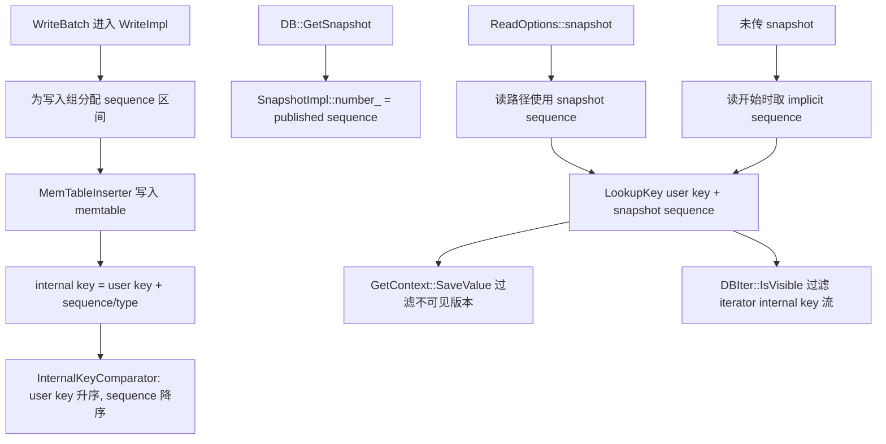

## 今日主题

- 主主题：`Snapshot / Sequence Number / 可见性语义`
- 副主题：`InternalKey 排序、Get/Iterator 可见性过滤、ReadCallback、snapshot 与 compaction 边界`

## 学习目标

- 讲清 `SequenceNumber` 在写入、internal key 和读取中的统一作用
- 讲清 snapshot 不是对象 pin，而是一个 sequence 可见性上界
- 讲清 `Get()` 如何用 `LookupKey + GetContext` 跳过不可见版本
- 讲清 `Iterator` 如何用 `DBIter::IsVisible()` 把 internal key 流变成用户可见结果
- 区分普通 snapshot 语义与事务路径中的 `ReadCallback`
- 说明释放 snapshot 为什么会影响旧版本、range tombstone 和 compaction 判断

## 前置回顾

Day 009 已经建立了读路径骨架：

- `SuperVersion` 固定一次读要使用的对象集合：`mem / imm / current Version`
- 点查顺序是 `mem -> imm -> current Version`
- SST 层由 `Version -> TableCache -> TableReader -> BlockBasedTableReader` 继续查
- `GetContext` 和 `DBIter` 才是处理 value/delete/merge/visibility 语义的核心位置

Day 010 继续补上一个关键问题：

`当同一个 user key 有多个版本时，RocksDB 怎么判断这次读应该看到哪一个？`

答案的核心是：

`SequenceNumber 表示全局写入顺序；snapshot sequence 表示本次读允许看到的最大 sequence；internal key 排序让同一个 user key 的新版本排在旧版本前面。`

## 源码入口

- `D:\program\rocksdb\include\rocksdb\db.h`
- `D:\program\rocksdb\include\rocksdb\options.h`
- `D:\program\rocksdb\include\rocksdb\snapshot.h`
- `D:\program\rocksdb\db\snapshot_impl.h`
- `D:\program\rocksdb\db\db_impl\db_impl.cc`
- `D:\program\rocksdb\db\db_impl\db_impl.h`
- `D:\program\rocksdb\db\db_impl\db_impl_write.cc`
- `D:\program\rocksdb\db\write_batch.cc`
- `D:\program\rocksdb\db\write_batch_internal.h`
- `D:\program\rocksdb\db\version_set.h`
- `D:\program\rocksdb\db\dbformat.h`
- `D:\program\rocksdb\db\dbformat.cc`
- `D:\program\rocksdb\db\lookup_key.h`
- `D:\program\rocksdb\table\get_context.h`
- `D:\program\rocksdb\table\get_context.cc`
- `D:\program\rocksdb\db\db_iter.h`
- `D:\program\rocksdb\db\db_iter.cc`
- `D:\program\rocksdb\db\read_callback.h`
- `D:\program\rocksdb\utilities\transactions\write_prepared_txn_db.h`
- `D:\program\rocksdb\utilities\transactions\write_unprepared_txn.h`
- `D:\program\rocksdb\db\db_impl\db_impl_compaction_flush.cc`
- `D:\program\rocksdb\db\compaction\compaction_iterator.cc`

## 它解决什么问题

LSM 里同一个 user key 可能同时存在多个 internal key：

- `Put(k, v3)`，sequence 更大
- `Put(k, v2)`，sequence 较小
- `Delete(k)`，sequence 夹在中间
- `Merge(k, operand)`，可能需要继续找 base value
- `RangeDelete([a, z))`，可能覆盖点 key

如果没有 snapshot，当前读通常应该看到读开始时已经发布的最新写入。如果用户显式传入 snapshot，读应该稳定地看到 snapshot 创建时的状态，而不是随着后台 flush/compaction 或新写入而改变。

所以 RocksDB 要同时解决两个问题：

1. 多版本顺序：同一个 user key 的版本应该从新到旧处理。
2. 可见性边界：sequence 大于本次 snapshot 的版本不能被读到。

`SequenceNumber + InternalKeyComparator + SnapshotImpl + GetContext/DBIter` 共同完成这件事。

## 它是怎么工作的

### 总体流程



这张图里要把两个边界分清：

- 写路径负责给每条写入一个递增的 sequence。
- 读路径只允许看到 `sequence <= snapshot sequence` 的版本。

`SuperVersion` 仍然重要，但它解决的是“这次读使用哪一组 mem/imm/SST 对象”；snapshot 解决的是“这次读在这些对象里能看到哪些版本”。

### 一个例子

假设同一个 key `k1` 有这些版本：

| sequence | type | value |
| --- | --- | --- |
| 105 | Put | `v3` |
| 101 | Delete | - |
| 98 | Put | `v2` |
| 90 | Put | `v1` |

如果 snapshot sequence 是 `103`：

- `105` 不可见，因为它晚于 snapshot
- `101` 可见，而且是删除标记
- 读结果是 `NotFound`
- `98` 和 `90` 虽然可见，但被 `101` 的删除遮蔽

如果 snapshot sequence 是 `99`：

- `105`、`101` 都不可见
- `98` 是第一个可见 value
- 读结果是 `v2`

这就是 snapshot 可见性的直觉模型：它不是复制一份数据，而是记住一个 sequence 上界。

## 关键数据结构与实现点

### `SequenceNumber`

`SequenceNumber` 是 RocksDB 的全局逻辑版本号。

写路径会为写入组预留连续 sequence 区间，写入 memtable 时把 sequence 写进 internal key。后续 flush 到 SST 后，internal key 仍然带着这个 sequence。

### `InternalKey`

RocksDB 内部排序的 key 不是裸 user key，而是：

`user key + 8 字节 tag`

tag 里打包了：

- 高 56 位：sequence
- 低 8 位：value type

同一个 user key 下，比较器按 sequence 降序排列，所以新版本排在旧版本前面。

### `SnapshotImpl`

`SnapshotImpl` 是 snapshot 的具体实现。

它的关键字段是：

- `number_`：snapshot 对应的 sequence
- `min_uncommitted_`：事务路径中辅助判断未提交写入
- `unix_time_ / timestamp_`：记录创建时间或 timestamped snapshot 信息

普通读路径主要用 `number_`。

### `SnapshotList`

DB 中活跃 snapshot 保存在 `SnapshotList` 里。这是一个按创建顺序维护的双向循环链表。

它的价值不只是给读路径找 sequence，也会被 flush/compaction 用来判断哪些旧版本仍然可能被某个 snapshot 看见。

### `ReadCallback`

普通 snapshot 可见性可以理解成：

`sequence <= snapshot_sequence`

但事务场景更复杂，例如 write-prepared / write-unprepared 可能存在“sequence 已分配但提交状态还要额外判断”的情况。`ReadCallback` 就是为这种高级可见性留出的扩展点：

- `seq < min_uncommitted_`：快速认为可见
- `seq > max_visible_seq_`：快速认为不可见
- 中间区间：调用 `IsVisibleFullCheck(seq)`

普通 DB 的大部分读没有 `ReadCallback`；事务 DB 会覆写读路径并传入 callback。

## 源码细读

这次选 11 个关键片段，把 sequence 从写路径串到读路径。

### 1. `WriteImpl` 为写入组分配 sequence 区间

```cpp
// db/db_impl/db_impl_write.cc, DBImpl::WriteImpl(...)
seq_inc = seq_per_batch_ ? valid_batches : total_count;
...
io_s = WriteGroupToWAL(..., last_sequence + 1, ...);
...
const SequenceNumber current_sequence = last_sequence + 1;
last_sequence += seq_inc;
// 分配给本次写入的 sequence 区间是 [current_sequence, last_sequence]
```

这段说明 sequence 是写路径的统一版本来源。

普通模式下，sequence 通常按写入的 key 数推进；`seq_per_batch_` 打开时，也可能按 batch 推进，这主要服务事务语义。Day 010 先抓主线：写入组进入 memtable 前，会拿到一个连续 sequence 区间。

### 2. `WriteBatchInternal::InsertInto` 把 sequence 写进 batch 并插入 memtable

```cpp
// db/write_batch.cc, WriteBatchInternal::InsertInto(...)
MemTableInserter inserter(sequence, memtables, flush_scheduler,
                          trim_history_scheduler, ...);
for (auto w : write_group) {
  ...
  w->sequence = inserter.sequence();
  ...
  SetSequence(w->batch, inserter.sequence());
  w->status = w->batch->Iterate(&inserter);
  ...
}
```

`WriteBatch` 的 header 里也会记录 sequence。这样同一批写在 WAL、recovery 和 memtable 插入时有一致的版本起点。

### 3. `MemTableInserter` 把当前 sequence 写进 memtable entry

```cpp
// db/write_batch.cc, MemTableInserter::PutCFImpl(...)
ret_status =
    mem->Add(sequence_, value_type, key, value, kv_prot_info,
             concurrent_memtable_writes_, get_post_process_info(mem),
             hint_per_batch_ ? &GetHintMap()[mem] : nullptr);
...
if (ret_status.ok()) {
  MaybeAdvanceSeq();
  CheckMemtableFull();
}
```

这段把 sequence 真正落到 memtable 里。delete、merge 也走类似模式：写入的不是“特殊外部状态”，而是带着 type 和 sequence 的 internal entry。

### 4. internal key 的 tag 是 `sequence + type`

```cpp
// db/dbformat.h, PackSequenceAndType(...)
static const SequenceNumber kMaxSequenceNumber = ((0x1ull << 56) - 1);

inline uint64_t PackSequenceAndType(uint64_t seq, ValueType t) {
  assert(seq <= kMaxSequenceNumber);
  return (seq << 8) | t;
}
```

RocksDB 把 sequence 和 type 打进同一个 64-bit tag：

- sequence 最多 56 bit
- type 占低 8 bit

所以 internal key 的最后 8 字节不是 value，而是版本与操作类型。

### 5. internal key 比较器让新版本排在旧版本前面

```cpp
// db/dbformat.cc, InternalKeyComparator::Compare(...)
// 排序规则：
// 1. user key 按用户 comparator 升序
// 2. sequence number 降序
// 3. type 降序
int r = user_comparator_.Compare(a.user_key, b.user_key);
if (r == 0) {
  if (a.sequence > b.sequence) {
    r = -1;
  } else if (a.sequence < b.sequence) {
    r = +1;
  } else if (a.type > b.type) {
    r = -1;
  } else if (a.type < b.type) {
    r = +1;
  }
}
```

这个比较器是读路径可见性处理的基础。

同一个 user key 下，越新的 sequence 排得越靠前。点查或迭代时，只要从前往后扫，就天然是从新版本到旧版本处理。

### 6. `SnapshotImpl` 的核心就是 sequence number

```cpp
// db/snapshot_impl.h, SnapshotImpl
class SnapshotImpl : public Snapshot {
 public:
  SequenceNumber number_;  // 创建后不变
  SequenceNumber min_uncommitted_ = kMinUnCommittedSeq;

  SequenceNumber GetSequenceNumber() const override { return number_; }
  int64_t GetUnixTime() const override { return unix_time_; }
  uint64_t GetTimestamp() const override { return timestamp_; }
  ...
};
```

这段直接说明 snapshot 的核心语义：它对应一个特定 sequence number。

`SnapshotImpl` 自己不 pin 某个 memtable 或 SST；对象生命周期由 `SuperVersion / Version / FileMetaData refs` 那条线处理。snapshot 主要提供读可见性的上界，并让 compaction 知道哪些旧版本还不能随便丢。

### 7. 创建 snapshot 时取 last published sequence

```cpp
// db/db_impl/db_impl.cc, DBImpl::GetSnapshotImpl(...)
auto snapshot_seq = GetLastPublishedSequence();
SnapshotImpl* snapshot =
    snapshots_.New(s, snapshot_seq, unix_time, is_write_conflict_boundary);
```

用户调用 `DB::GetSnapshot()` 时，RocksDB 创建一个 `SnapshotImpl`，把当前已经发布给读者的 sequence 存进去。

这里的 `published` 很重要：读者不能看到只分配了 sequence、但还没对读路径安全发布的写入。

### 8. `GetImpl` 先拿 `SuperVersion`，再决定 snapshot sequence

```cpp
// db/db_impl/db_impl.cc, DBImpl::GetImpl(...)
SuperVersion* sv = GetAndRefSuperVersion(cfd);
...
SequenceNumber snapshot;
if (read_options.snapshot != nullptr) {
  snapshot =
      static_cast<const SnapshotImpl*>(read_options.snapshot)->number_;
} else {
  // 先引用 SuperVersion，再取 sequence。否则中间发生 flush/compaction，
  // 读线程可能既看不到旧数据，也看不到新数据。
  snapshot = GetLastPublishedSequence();
}
...
LookupKey lkey(key, snapshot, read_options.timestamp);
```

这是 Day 009 已经看到但还没完全展开的关键顺序：

1. 先固定对象集合：`SuperVersion`
2. 再固定可见性上界：`snapshot`
3. 再构造 internal lookup key：`LookupKey`

如果用户传入 snapshot，就用 snapshot 自己的 `number_`。如果没传，`ReadOptions` 语义要求使用“这次读开始时”的隐式 snapshot，于是这里取 `GetLastPublishedSequence()`。

### 9. `LookupKey` 用 snapshot sequence 构造 seek key

```cpp
// db/dbformat.cc, LookupKey::LookupKey(...)
dst = EncodeVarint32(dst, static_cast<uint32_t>(usize + ts_sz + 8));
kstart_ = dst;
memcpy(dst, _user_key.data(), usize);
...
EncodeFixed64(dst, PackSequenceAndType(s, kValueTypeForSeek));
```

`LookupKey` 把 user key 和 snapshot sequence 拼成 internal key。

`kValueTypeForSeek` 的选择也有意义：因为同一个 user key 下 sequence 降序排列，seek key 要落到“不超过 snapshot sequence 的最新候选版本”附近。

所以 snapshot 不只是在 `SaveValue()` 里被动检查，它也参与了 memtable/SST 中 seek 起点的构造。

### 10. `GetContext::SaveValue` 跳过不可见版本

```cpp
// table/get_context.cc, GetContext::SaveValue(...)
if (ucmp_->EqualWithoutTimestamp(parsed_key.user_key, user_key_)) {
  *matched = true;
  // 如果这个版本对当前读不可见，继续找下一个 sequence。
  if (!CheckCallback(parsed_key.sequence)) {
    return true;
  }
  ...
  switch (type) {
    case kTypeValue:
    case kTypeValuePreferredSeqno:
    case kTypeBlobIndex:
    case kTypeWideColumnEntity:
      state_ = kFound;
      ...
      return false;

    case kTypeDeletion:
    case kTypeDeletionWithTimestamp:
    case kTypeSingleDeletion:
    case kTypeRangeDeletion:
      state_ = kDeleted;
      return false;

    case kTypeMerge:
      state_ = kMerge;
      ...
      return true;
  }
}
```

`SaveValue()` 是点查语义集中处理的地方：

- user key 不匹配：当前候选不属于目标 key
- sequence 不可见：继续找更老版本
- value：可以返回
- delete：可以终止为 NotFound
- merge：可能要继续找 base value
- range tombstone：可能把当前点 key 转成删除语义

这里要注意：普通 `Get()` 不一定需要 `ReadCallback`，因为 `LookupKey` 已经用 snapshot sequence 定位到不超过上界的区域；但当存在 timestamp 或事务高级可见性时，callback 会参与进一步过滤。

### 11. `DBIter::IsVisible` 是 Iterator 路径的可见性入口

```cpp
// db/db_iter.cc, DBIter::IsVisible(...)
bool visible_by_seq = (read_callback_ == nullptr)
                          ? sequence <= sequence_
                          : read_callback_->IsVisible(sequence);

bool visible_by_ts =
    (timestamp_ub_ == nullptr ||
     user_comparator_.CompareTimestamp(ts, *timestamp_ub_) <= 0) &&
    (timestamp_lb_ == nullptr ||
     user_comparator_.CompareTimestamp(ts, *timestamp_lb_) >= 0);

return visible_by_seq && visible_by_ts;
```

Iterator 路径不是每个 key 调一次 `Get()`。它先用 internal iterator tree 产出 internal key 流，再由 `DBIter` 判断哪些版本能暴露给用户。

没有 `ReadCallback` 时，核心判断就是：

`internal_key.sequence <= DBIter.sequence_`

这和点查的 snapshot 上界语义一致，只是消费位置不同：

- `Get()`：`LookupKey + GetContext`
- `Iterator`：`MergingIterator + DBIter`

### 12. `ReadCallback` 负责事务等高级可见性

```cpp
// db/read_callback.h, ReadCallback::IsVisible(...)
if (seq < min_uncommitted_) {
  return true;
} else if (max_visible_seq_ < seq) {
  return false;
} else {
  return IsVisibleFullCheck(seq);
}
```

```cpp
// utilities/transactions/write_prepared_txn_db.h, WritePreparedTxnReadCallback
inline bool IsVisibleFullCheck(SequenceNumber seq) override {
  auto snapshot = max_visible_seq_;
  bool snap_released = false;
  auto ret =
      db_->IsInSnapshot(seq, snapshot, min_uncommitted_, &snap_released);
  ...
  return ret;
}
```

`ReadCallback` 不是普通 snapshot 语义的替代品，而是扩展点。

在 write-prepared / write-unprepared 事务中，单纯 `seq <= snapshot` 不足以判断可见性，因为还要知道某个 sequence 对应的事务是否已经提交、是否属于当前事务自己的未提交写入等。

所以 callback 的职责是：在基础 sequence 上界之外，补充事务可见性判断。

### 13. 释放 snapshot 会推进 compaction 能力

```cpp
// db/db_impl/db_impl.cc, DBImpl::ReleaseSnapshot(...)
snapshots_.Delete(casted_s);
uint64_t oldest_snapshot;
if (snapshots_.empty()) {
  oldest_snapshot = GetLastPublishedSequence();
} else {
  oldest_snapshot = snapshots_.oldest()->number_;
}
...
cfd->current()->storage_info()->UpdateOldestSnapshot(
    oldest_snapshot, /*allow_ingest_behind=*/false);
...
delete casted_s;
```

释放 snapshot 后，RocksDB 会重新计算最老 snapshot。这个值会影响旧版本、bottommost 文件、range tombstone 文件是否还能被保留或需要触发 compaction。

换句话说，snapshot 虽然不 pin 对象生命周期，但它会 pin 住“历史版本的语义必要性”。

### 14. flush/compaction 会拿到当前 snapshot 列表

```cpp
// db/db_impl/db_impl_compaction_flush.cc, DBImpl::InitSnapshotContext(...)
SequenceNumber earliest_write_conflict_snapshot = kMaxSequenceNumber;
std::vector<SequenceNumber> snapshot_seqs =
    snapshots_.GetAll(&earliest_write_conflict_snapshot);
job_context->InitSnapshotContext(
    snapshot_checker, std::move(managed_snapshot),
    earliest_write_conflict_snapshot, std::move(snapshot_seqs));
```

```cpp
// db/compaction/compaction_iterator.cc, CompactionIterator::findEarliestVisibleSnapshot(...)
auto snapshots_iter =
    std::lower_bound(snapshots_->begin(), snapshots_->end(), in);
...
return snapshots_iter != snapshots_->end() ? *snapshots_iter
                                           : kMaxSequenceNumber;
```

Compaction 不能只保留“当前最新值”。如果某个旧 snapshot 仍然存在，那么比它更新的删除标记、merge operand 或 value 可能不能简单消掉旧版本。

所以 compaction 会拿到活跃 snapshot sequence 列表，并据此判断某个 internal key 对哪些 snapshot 仍然可见。

## 今日问题与讨论

### 我的问题

#### 问题 1：Snapshot 和 SuperVersion 到底谁负责一致性？

- 简答：
  - 两者都参与一致性，但职责不同。
  - `SuperVersion` 稳定对象集合：这次读使用哪一个 mem、哪一组 imm、哪一个 current Version。
  - snapshot 稳定可见性上界：这次读最多看到哪个 sequence。
- 源码依据：
  - `DBImpl::GetImpl()` 先 `GetAndRefSuperVersion(cfd)`，再取 explicit/implicit snapshot sequence。
  - `SnapshotImpl::number_` 存储 sequence。
- 当前结论：
  - 不要把 snapshot 理解成“pin 住 SST 的对象”。对象生命周期 pin 是 `SuperVersion / Version` 的职责；snapshot 是 sequence 语义边界。
- 是否需要后续回看：
  - `yes`
  - 到 MANIFEST / VersionSet 章节时，把 `Version` 的对象生命周期和 snapshot 的历史语义保留再接一次。

#### 问题 2：普通 Get 是不是只要 `sequence <= snapshot` 就够？

- 简答：
  - 基本模型是这样，但源码实现更分层。
  - `LookupKey(user_key, snapshot)` 先让 seek 落到 snapshot 上界附近。
  - `GetContext::SaveValue()` 再处理 callback、timestamp、delete、merge、range tombstone 等语义。
- 源码依据：
  - `LookupKey::LookupKey(...)`
  - `GetContext::SaveValue(...)`
  - `ReadCallback::IsVisible(...)`
- 当前结论：
  - 对非事务、无 timestamp 的普通读，可以先记成 `sequence <= snapshot`。
  - 但源码里可见性并不只是一行 if，它还和 seek key、type 状态机、range tombstone、merge 组合在一起。
- 是否需要后续回看：
  - `yes`
  - 到事务章节时补充 write-prepared / write-unprepared 的 commit visibility。

#### 问题 3：snapshot 会不会阻止 compaction？

- 简答：
  - snapshot 不会简单“阻止所有 compaction”，但会限制 compaction 丢弃历史版本的自由度。
  - 活跃 snapshot 越老，越多旧版本可能仍然对某个读可见，compaction 就越不能把它们合并掉。
- 源码依据：
  - `SnapshotList::GetAll(...)`
  - `DBImpl::InitSnapshotContext(...)`
  - `CompactionIterator::findEarliestVisibleSnapshot(...)`
  - `DBImpl::ReleaseSnapshot(...)`
- 当前结论：
  - 长时间不释放 snapshot 可能增加空间放大，因为旧版本和 tombstone 的清理会受限。
- 是否需要后续回看：
  - `yes`
  - 到 Compaction 章节时用实际 compaction iterator 状态机展开。

#### 问题 4：snapshot 是什么时候产生的？为什么会有多个 snapshot？

- 简答：
  - 显式 snapshot 由用户或上层组件调用 `DB::GetSnapshot()` 产生。
  - `ReadOptions::snapshot == nullptr` 时，单次 `Get()` / `Iterator` 也会使用一个隐式读时间点，但它通常只是本次读路径中的 sequence number，不会插入 `SnapshotList`。
  - 多个 snapshot 来自多个长期读者、多个 iterator、事务读、备份/checkpoint/BlobDB 等上层工具，或者 timestamped snapshot。
- 源码依据：
  - `include/rocksdb/db.h` 说明 `GetSnapshot()` 返回当前 DB 状态句柄，调用者必须 `ReleaseSnapshot(...)`。
  - `DBImpl::GetSnapshotImpl(...)` 调用 `GetLastPublishedSequence()`，再通过 `snapshots_.New(...)` 插入链表。
  - `SnapshotList::New(...)` 把新 snapshot 插到双向循环链表尾部。
- 关键源码片段：

```cpp
// db/db_impl/db_impl.cc, DBImpl::GetSnapshotImpl(...)
auto snapshot_seq = GetLastPublishedSequence();
SnapshotImpl* snapshot =
    snapshots_.New(s, snapshot_seq, unix_time, is_write_conflict_boundary);
```

```cpp
// db/snapshot_impl.h, SnapshotList::New(...)
s->number_ = seq;
s->unix_time_ = unix_time;
s->timestamp_ = ts;
s->next_ = &list_;
s->prev_ = list_.prev_;
s->prev_->next_ = s;
s->next_->prev_ = s;
count_++;
```

- 当前结论：
  - snapshot list 存的是所有仍活跃的显式 snapshot。
  - 需要链表是因为 DB 不能只记一个“当前 snapshot”：多个读者可以在不同时间拿到不同 sequence 的 snapshot，它们都可能影响 compaction 的历史保留边界。
  - 链表按创建顺序维护，因此 `oldest()` 和 `newest()` 可以快速取得最老/最新 snapshot。
- 是否需要后续回看：
  - `yes`
  - 到事务章节时再看事务如何创建和管理 snapshot。

#### 问题 5：snapshot 是什么时候释放的？

- 简答：
  - 普通显式 snapshot 由调用者调用 `DB::ReleaseSnapshot(snapshot)` 释放。
  - RAII 包装 `ManagedSnapshot` 析构时自动调用 `ReleaseSnapshot(...)`。
  - 一些内部路径会临时创建 snapshot，例如带 `snapshot_checker` 的 flush/compaction job，会用 `ManagedSnapshot` 托管生命周期。
- 源码依据：
  - `DBImpl::ReleaseSnapshot(...)` 调用 `snapshots_.Delete(casted_s)`，重新计算 `oldest_snapshot`，必要时更新 compaction 相关阈值并调度 compaction。
  - `ManagedSnapshot::~ManagedSnapshot()` 自动释放持有的 snapshot。
- 关键源码片段：

```cpp
// db/db_impl/db_impl.cc, DBImpl::ReleaseSnapshot(...)
snapshots_.Delete(casted_s);
uint64_t oldest_snapshot;
if (snapshots_.empty()) {
  oldest_snapshot = GetLastPublishedSequence();
} else {
  oldest_snapshot = snapshots_.oldest()->number_;
}
...
delete casted_s;
```

```cpp
// db/snapshot_impl.cc, ManagedSnapshot::~ManagedSnapshot()
ManagedSnapshot::~ManagedSnapshot() {
  if (snapshot_) {
    db_->ReleaseSnapshot(snapshot_);
  }
}
```

- 当前结论：
  - snapshot 的释放是调用者责任。
  - 长时间不释放 snapshot 不会阻止新写入，但可能让旧版本、range tombstone 或 bottommost 文件更久不能被清理，增加空间放大。
- 是否需要后续回看：
  - `yes`
  - 到 compaction 和 backup/checkpoint 章节时回看长期 snapshot 的代价。

#### 问题 6：snapshot 对 flush 有没有影响？

- 简答：
  - 如果只说“flush 把 memtable 内容落成 SST，不改变用户语义”，这个方向是对的。
  - 但当前源码里 flush job 仍会拿到 `snapshot_seqs`，并用 `CompactionIterator`、`CompactionRangeDelAggregator`、`MergeHelper` 等组件处理 flush 输入。
  - 所以不能说 snapshot 对 flush 完全没影响；更准确地说：flush 通常不是为了按 snapshot 清理历史，但 flush 的内部整理、range tombstone、merge、compaction filter 等逻辑仍要知道活跃 snapshot 边界，避免破坏历史可见性。
- 源码依据：
  - `DBImpl::InitSnapshotContext(...)` 会把 `snapshots_.GetAll(...)` 写入 `JobContext`。
  - `FlushJob` 构造 `CompactionRangeDelAggregator` 和 `CompactionIterator` 时传入 `job_context_->snapshot_seqs`。
- 关键源码片段：

```cpp
// db/db_impl/db_impl_compaction_flush.cc, DBImpl::InitSnapshotContext(...)
std::vector<SequenceNumber> snapshot_seqs =
    snapshots_.GetAll(&earliest_write_conflict_snapshot);
job_context->InitSnapshotContext(
    snapshot_checker, std::move(managed_snapshot),
    earliest_write_conflict_snapshot, std::move(snapshot_seqs));
```

```cpp
// db/flush_job.cc, FlushJob::MemPurge(...)
std::unique_ptr<CompactionRangeDelAggregator> range_del_agg(
    new CompactionRangeDelAggregator(&(cfd_->internal_comparator()),
                                     job_context_->snapshot_seqs,
                                     full_history_ts_low));
...
CompactionIterator c_iter(
    iter.get(), ..., kMaxSequenceNumber, &job_context_->snapshot_seqs,
    earliest_snapshot_, job_context_->earliest_write_conflict_snapshot,
    job_context_->GetJobSnapshotSequence(), job_context_->snapshot_checker,
    ...);
```

- 当前结论：
  - flush 的主职责不是“删除旧数据”，但 flush 实现复用了 compaction iterator 这套处理 internal key 的工具，因此仍需要 snapshot 上下文。
  - 这是实现层面的边界：概念上 flush 是落盘；实现上 flush 也可能做有限整理，不能无视 snapshot。
- 是否需要后续回看：
  - `yes`
  - 到 Day 011/Compaction 时再细看 `FlushJob` 的 mempurge、range tombstone 和 merge 行为。

#### 问题 7：如果用户给的 sequence number 对应的数据已经被 compaction 了怎么办？

- 简答：
  - 普通 RocksDB API 不是让用户随便给一个 sequence number 读历史，而是让用户传 `Snapshot*`。
  - 只要这个 `Snapshot*` 仍然有效，RocksDB 的 compaction 就必须保留该 snapshot 可能需要看到的历史版本，不能把它们随意丢掉。
  - 如果 snapshot 已经释放，或者只是拿一个旧 sequence number 想读历史，RocksDB 不保证还能读到当时的数据。
- 源码依据：
  - `ReadOptions::snapshot` 类型是 `const Snapshot*`，不是裸 `SequenceNumber`。
  - `SnapshotList::GetAll(...)` 把活跃 snapshot 传给 flush/compaction。
  - `CompactionIterator::findEarliestVisibleSnapshot(...)` 根据 snapshot 序列判断某个 internal key 对哪个 snapshot 仍可见。
- 当前结论：
  - “数据已经被 compaction 了”分两种：
    - snapshot 仍活跃：compaction 可以改写文件布局，但不能破坏该 snapshot 的读结果；需要的历史版本会保留在新 SST 或仍被引用的旧 SST 中。
    - snapshot 不活跃：旧版本可以被 compaction 清掉；这时再想按旧 sequence 读，语义上没有保证。
  - 这也解释了为什么 `ReleaseSnapshot()` 是重要边界：释放之后，RocksDB 才能逐步回收不再被任何活跃 snapshot 需要的历史版本。
- 是否需要后续回看：
  - `yes`
  - 到 Compaction 章节时，用具体 key 序列看 `CompactionIterator` 如何决定 drop / keep。

#### 问题 8：没有显式 snapshot 时，implicit snapshot 不进 `SnapshotList`，compaction 怎么不会删掉正在读的数据？

- 简答：
  - 隐式 snapshot 不靠 `SnapshotList` 保护。
  - 单次读先引用 `SuperVersion`，`SuperVersion` 再引用住 `mem / imm / current Version`。
  - `current Version` 引用住 `FileMetaData`，旧 Version 没释放前，对应 SST 不会被当成可安全删除文件清掉。
  - 因此隐式读的保护是“对象生命周期保护”，不是“把 sequence 插入 snapshot list 后保护历史语义”。
- 源码依据：
  - `DBImpl::GetImpl()` 先 `GetAndRefSuperVersion(cfd)`，再取 implicit snapshot sequence。
  - `SuperVersion::Init(...)` 对 `mem / imm / current` 调用 `Ref()`。
  - `VersionStorageInfo::AddFile(...)` 增加 `FileMetaData::refs`。
  - `Version::~Version()` 只有在 version ref 归零后才减少文件引用，并把无引用文件加入 obsolete 列表。
- 关键源码片段：

```cpp
// db/db_impl/db_impl.cc, DBImpl::GetImpl(...)
SuperVersion* sv = GetAndRefSuperVersion(cfd);
...
if (read_options.snapshot != nullptr) {
  snapshot =
      static_cast<const SnapshotImpl*>(read_options.snapshot)->number_;
} else {
  // 先引用 SuperVersion，再取 sequence，避免 flush/compaction 夹在中间
  // 造成读线程既看不到旧数据，也看不到新数据。
  snapshot = GetLastPublishedSequence();
}
```

```cpp
// db/column_family.cc, SuperVersion::Init(...)
cfd->Ref();
mem->Ref();
imm->Ref();
current->Ref();
refs.store(1, std::memory_order_relaxed);
```

```cpp
// db/version_set.cc, VersionStorageInfo::AddFile(...)
void VersionStorageInfo::AddFile(int level, FileMetaData* f) {
  files_[level].push_back(f);
  f->refs++;
}
```

```cpp
// db/version_set.cc, Version::~Version()
for (...) {
  FileMetaData* f = storage_info_.files_[level][i];
  f->refs--;
  if (f->refs <= 0) {
    vset_->obsolete_files_.emplace_back(...);
  }
}
```

- 当前结论：
  - 如果读已经开始并拿到了旧 `SuperVersion`，后台 compaction 可以产生新 SST、安装新 `Version`，但旧 `Version` 仍被这个读引用，旧 SST 不会在读结束前被物理删除。
  - 如果 compaction 已经完成并安装了新 `Version`，之后才开始的无 snapshot 读会拿到新的 `SuperVersion`，它读的是 compaction 后的最新一致状态；它没有权利要求读取已被清理的旧历史版本。
  - 这就是为什么显式 snapshot 才需要进 `SnapshotList`：它要跨越多个读操作、多个后台 job 保留历史语义；隐式 snapshot 只需要保护当前这次读的对象集合。
- 是否需要后续回看：
  - `yes`
  - 到 VersionSet / obsolete file 删除路径时，把 `Version refs -> FileMetaData refs -> obsolete_files_ -> DeleteObsoleteFiles` 串完整。

### 外部高价值问题

- 本节不额外引入外部资料。
- 原因：
  - Day 010 的主线问题可以直接从本地源码闭环。
  - 事务隔离级别、长 snapshot 造成空间放大等外部讨论，更适合放到事务与 compaction 专题中补充。

## 常见误区或易混点

### 误区 1：snapshot 是一份数据拷贝

不对。

snapshot 主要保存一个 sequence number。RocksDB 不会因为 `GetSnapshot()` 就复制 memtable 或 SST。

### 误区 2：snapshot 负责 pin 住 SST 文件

不准确。

SST 文件生命周期主要通过 `Version / FileMetaData refs / SuperVersion` 等引用关系保护。snapshot 影响的是旧版本是否仍有语义价值，进而影响 compaction 是否能丢弃历史版本。

### 误区 3：sequence number 只在写路径有用

不对。

sequence 从写路径进入 internal key，随后在读路径、iterator、snapshot、compaction 中持续使用。它是 RocksDB MVCC 语义的主轴。

### 误区 4：`ReadCallback` 就是普通 snapshot

不对。

普通 snapshot 的核心是 sequence 上界。`ReadCallback` 是事务、timestamp 等场景下的扩展判断，解决 `seq <= snapshot` 还不足以表达的可见性问题。

### 误区 5：delete 找到后一定可以忽略更老版本

对普通点查来说，当前 snapshot 下可见 delete 是一个终止结果；但 compaction 中是否能丢掉更老版本，要看是否还有更老 snapshot 需要这些历史版本。

## 设计动机

RocksDB 没有把“版本”设计成一个独立的大对象，而是把 sequence number 压进 internal key。这样有几个直接好处：

1. memtable 和 SST 都能用同一套 internal key 排序规则。
2. 同一个 user key 的新版本天然排在旧版本之前，点查和迭代都能从新到旧处理。
3. snapshot 只需要保存一个 sequence number，就可以表达一致读上界。
4. compaction 可以根据 snapshot sequence 列表判断哪些历史版本还必须保留。

代价是：很多模块都必须理解 internal key，而不能只看 user key。这也是为什么 Day 009 和 Day 010 里反复出现 `ParsedInternalKey`、`LookupKey`、`InternalKeyComparator`、`DBIter`。

## 横向对比

传统 MVCC 数据库经常会有更显式的版本链、事务 ID、undo record 或 page-level 版本管理。

RocksDB 的基础模型更贴近 LSM：

- 写入被追加成新的 internal key
- 旧版本自然留在 memtable/SST 或旧 SST 中
- snapshot 用 sequence number 截断可见性
- compaction 再根据 snapshot 和 tombstone 逐步清理历史

所以 RocksDB 的 MVCC 不像“每行维护一个链表”，而更像“所有版本都在同一个全局有序 key 空间里，读路径按 sequence 截断，compaction 后台清历史”。

## 工程启发

Day 010 最值得记的工程点是：把可见性边界做成一个简单、可传递、可排序的标量。

`SequenceNumber` 很小，但贯穿了：

- WAL / WriteBatch
- MemTable
- SST internal key
- Get
- Iterator
- Snapshot
- Compaction
- Transaction callback

这种设计让系统不同层级都能围绕同一个版本维度协作。复杂性没有消失，但被集中到了少数边界清晰的位置：`InternalKeyComparator`、`GetContext`、`DBIter`、`CompactionIterator` 和事务 `ReadCallback`。

## 今日小结

Day 010 把 RocksDB 的读可见性主线补起来了：

- 写入时分配递增 sequence，并把 sequence/type 写入 internal key
- internal key 按 user key 升序、sequence 降序排列
- snapshot 的核心是 `SnapshotImpl::number_`
- `GetImpl()` 先拿 `SuperVersion`，再确定 explicit/implicit snapshot sequence
- `LookupKey` 用 snapshot sequence 构造 seek key
- 点查由 `GetContext::SaveValue()` 处理可见版本、删除、merge、range tombstone
- Iterator 由 `DBIter::IsVisible()` 把 internal key 流过滤成用户可见结果
- `ReadCallback` 是事务等高级可见性的扩展点
- 活跃 snapshot 会影响 compaction 清理旧版本的边界

如果只记一句话：

`RocksDB 的 snapshot 不是数据副本，也不是对象 pin；它是一个 sequence number 上界，读路径用它过滤 internal key，compaction 用活跃 snapshot 列表决定哪些历史版本还不能丢。`

## 明日衔接

Day 011 建议进入：`磁盘管理 / 文件读写抽象 / Table Reader / Block 读取 / OS Page Cache`。

自然衔接点是：

- Day 009 已经看到 `TableCache -> TableReader -> BlockBasedTableReader`
- Day 010 已经讲清读路径的可见性过滤
- 下一步可以把“读一个 SST block 到底经过哪些文件系统抽象、cache、buffer、checksum、compression”系统拆开

## 复习题

1. `SequenceNumber` 是在写路径哪里分配的？又是怎样进入 memtable / SST internal key 的？
2. `SnapshotImpl::number_` 表示什么？为什么说 snapshot 不是一份数据拷贝？
3. `InternalKeyComparator` 为什么要让同一个 user key 下的 sequence 降序排列？
4. `DBImpl::GetImpl()` 为什么要先拿 `SuperVersion`，再确定 implicit snapshot sequence？
5. `GetContext::SaveValue()` 和 `DBIter::IsVisible()` 在可见性处理上的职责分别是什么？
6. `ReadCallback` 主要服务什么场景？它和普通 `sequence <= snapshot` 判断有什么关系？
7. 长时间持有 snapshot 会对 compaction 和空间放大产生什么影响？
