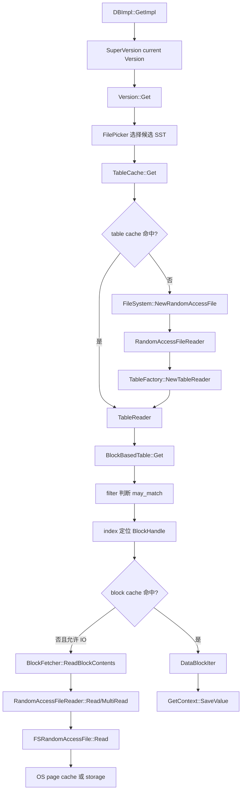
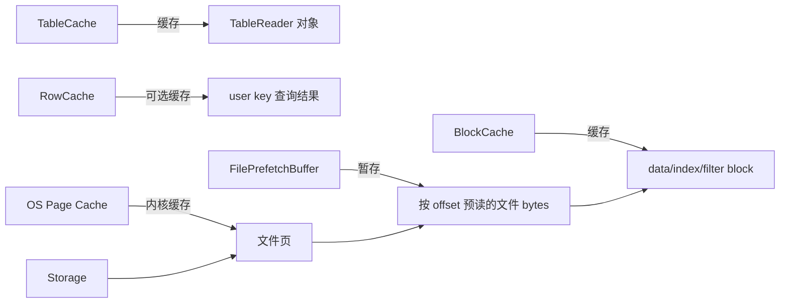

## 今日主题

- 主主题：`磁盘管理 / 文件读写抽象 / Table Reader / Block 读取 / OS Page Cache`
- 副主题：`TableCache、BlockBasedTableReader、BlockFetcher、RandomAccessFileReader、ReadTier、direct I/O`

Day 009 已经讲过点查路径：`mem -> imm -> current Version`。Day 011 专门补上当查询落到 SST 后，RocksDB 如何把“查某个 key”转换成“读某个文件 offset 上的一段 block 数据”。

## 学习目标

- 区分 `Env` 与 `FileSystem` 文件抽象，以及顺序读、随机读、追加写的职责差异
- 讲清 `TableCache`、`TableReader`、`BlockBasedTable` 的边界
- 讲清 SST 点查时从 `Version::Get()` 到 `FSRandomAccessFile::Read()` 的主流程
- 区分 `table cache / row cache / block cache / FilePrefetchBuffer / OS page cache`
- 理解 `ReadOptions::read_tier = kBlockCacheTier` 为什么不是“确认不存在”
- 理解 mmap、direct I/O、普通 buffered I/O 对 OS page cache 的影响

## 前置回顾

前面几天已经建立了这些结论：

- `SuperVersion` pin 住一次读需要的 `mem / imm / current Version`
- `Version::Get()` 负责根据 level 和 file metadata 挑选候选 SST
- `TableCache::Get()` 是 SST 文件读路径的入口
- `BlockBasedTable::Get()` 负责表格式内部的 filter、index、data block 查找
- `GetContext` 负责 value/delete/merge/range tombstone 与可见性语义

今天只展开物理读路径，不深入 block cache 的淘汰算法，也不展开 partitioned index/filter 的细节。

## 源码入口

- `D:\program\rocksdb\include\rocksdb\env.h`
- `D:\program\rocksdb\include\rocksdb\file_system.h`
- `D:\program\rocksdb\include\rocksdb\options.h`
- `D:\program\rocksdb\file\random_access_file_reader.h`
- `D:\program\rocksdb\file\random_access_file_reader.cc`
- `D:\program\rocksdb\file\file_prefetch_buffer.h`
- `D:\program\rocksdb\file\file_prefetch_buffer.cc`
- `D:\program\rocksdb\db\version_set.cc`
- `D:\program\rocksdb\db\table_cache.h`
- `D:\program\rocksdb\db\table_cache.cc`
- `D:\program\rocksdb\table\table_reader.h`
- `D:\program\rocksdb\table\format.h`
- `D:\program\rocksdb\table\format.cc`
- `D:\program\rocksdb\table\block_fetcher.h`
- `D:\program\rocksdb\table\block_fetcher.cc`
- `D:\program\rocksdb\table\block_based\block_based_table_reader.h`
- `D:\program\rocksdb\table\block_based\block_based_table_reader.cc`

## 它解决什么问题

SST 是磁盘上的不可变文件。读一个 key 时，RocksDB 不能每次都把整个 SST 读进内存，它需要：

- 先用 file metadata 判断这个 key 可能在哪些 SST 里
- 打开或复用对应 SST 的 table reader
- 用 filter 排除明显不可能命中的文件或 block
- 用 index 找到 data block 的 `BlockHandle`
- 读 data block 的物理 bytes
- 校验 checksum、解压缩、解析 block
- 在 block 内部 seek internal key
- 把读到的 internal key/value 交给 `GetContext`

所以 SST 读路径本质上是三层转换：

1. `user key -> 候选 SST 文件`
2. `SST 文件 -> 候选 data block`
3. `data block bytes -> internal key/value`

## 主流程总览



这张图里最容易混的是缓存层：

- `TableCache` 缓存的是 `TableReader`
- `BlockCache` 缓存的是 block
- `FilePrefetchBuffer` 是 RocksDB 自己的一段顺序/预读 buffer
- OS page cache 是内核文件系统缓存，不归 RocksDB 的 cache key 管理

## 文件读写抽象

RocksDB 历史上有 `Env` 抽象，现在更核心的文件系统接口在 `FileSystem`。读写 SST、WAL、MANIFEST 时，上层不直接调用平台 API，而是通过文件抽象。

核心接口可以按访问模式理解：

- `SequentialFile / FSSequentialFile`：顺序读，例如日志回放
- `RandomAccessFile / FSRandomAccessFile`：按 offset 随机读，例如 SST 点查读 block
- `WritableFile / FSWritableFile`：追加写或定位追加写，例如 WAL、MANIFEST、flush/compaction 输出 SST

源码里 `FSRandomAccessFile` 明确表达了 SST 读需要的能力：给定 `offset + length`，返回一段 bytes，并且并发读是安全的。

```cpp
// include/rocksdb/file_system.h + FSRandomAccessFile
class FSRandomAccessFile {
 public:
  virtual IOStatus Read(uint64_t offset, size_t n,
                        const IOOptions& options,
                        Slice* result, char* scratch,
                        IODebugContext* dbg) const = 0;

  virtual IOStatus Prefetch(uint64_t offset, size_t n,
                            const IOOptions& options,
                            IODebugContext* dbg);
};
```

这说明 SST 点查不是“从当前位置往后读”，而是围绕 `BlockHandle` 做随机定位读。

## TableCache 不是 BlockBasedTable 自己

`TableCache` 是 DB 层的缓存和打开入口。它不理解 block-based table 的所有格式细节，它主要做三件事：

- 用 file number 查 `TableReader` cache
- cache miss 时打开 SST 文件并创建 `TableReader`
- 把点查请求转发给 `TableReader::Get()`

`TableReader` 是抽象基类，具体实现可以是 `BlockBasedTable`、`PlainTable`、`CuckooTable` 等。当前默认常见路径是 block-based table，所以最终会进入 `BlockBasedTable::Get()`。

```cpp
// table/table_reader.h + TableReader
class TableReader {
 public:
  virtual InternalIterator* NewIterator(...) = 0;

  virtual Status Get(const ReadOptions& readOptions,
                     const Slice& key,
                     GetContext* get_context,
                     const SliceTransform* prefix_extractor,
                     bool skip_filters = false) = 0;
};
```

`TableCache` 打开文件时用的是 `FileSystem`，再包一层 `RandomAccessFileReader`，最后交给 table factory 创建具体 `TableReader`。

```cpp
// db/table_cache.cc + TableCache::GetTableReader
std::unique_ptr<FSRandomAccessFile> file;
s = ioptions_.fs->NewRandomAccessFile(fname, fopts, &file, nullptr);

std::unique_ptr<RandomAccessFileReader> file_reader(
    new RandomAccessFileReader(std::move(file), fname, ...));

s = mutable_cf_options.table_factory->NewTableReader(
    ro, TableReaderOptions(...), std::move(file_reader),
    file_meta.fd.GetFileSize(), table_reader,
    prefetch_index_and_filter_in_cache);
```

因此“TableCache 不是 BlockBasedTable 自己”的意思是：`TableCache` 管生命周期和缓存入口，`BlockBasedTable` 管 SST 格式内部如何读 footer、index、filter、data block。

## Version 到 TableCache

`Version::Get()` 先用 `FilePicker` 挑候选文件，再对每个候选 SST 调 `table_cache_->Get()`。

```cpp
// db/version_set.cc + Version::Get
FilePicker fp(user_key, ikey, &storage_info_.level_files_brief_, ...);
FdWithKeyRange* f = fp.GetNextFile();

while (f != nullptr) {
  *status = table_cache_->Get(
      read_options, *internal_comparator(), *f->file_metadata,
      ikey, &get_context, mutable_cf_options_, ...);
  ...
}
```

这一步仍然是“逻辑文件选择”。它知道 key 可能在哪些 SST，但还不知道需要读哪个 data block。后者是 `BlockBasedTable::Get()` 的职责。

## TableCache 的 no-IO 行为

`TableCache::FindTable()` 先查 table cache。没命中时，如果调用方要求 no-IO，就不打开文件，直接返回 `Incomplete`。

```cpp
// db/table_cache.cc + TableCache::FindTable
*handle = cache_.Lookup(key);

if (*handle == nullptr) {
  if (no_io) {
    return Status::Incomplete(
        "Table not found in table_cache, no_io is set");
  }
  ...
  Status s = GetTableReader(..., &table_reader, ...);
  s = cache_.Insert(key, table_reader.get(), 1, handle);
}
```

`TableCache::Get()` 里这个 `no_io` 来自：

```cpp
// db/table_cache.cc + TableCache::Get
s = FindTable(...,
              options.read_tier == kBlockCacheTier /* no_io */,
              ...);

if (s.ok()) {
  s = t->Get(options, k, get_context,
             mutable_cf_options.prefix_extractor.get(), skip_filters);
} else if (options.read_tier == kBlockCacheTier && s.IsIncomplete()) {
  get_context->MarkKeyMayExist();
}
```

这就是为什么 `kBlockCacheTier` 不是“确认不存在”：它只是说这次读不允许为了打开 table 或读取 block 而发起 I/O。如果 table reader 或 block 不在缓存中，RocksDB 只能说“可能存在，但我没有读磁盘确认”。

## BlockBasedTable 打开 SST

创建 `BlockBasedTable` 时，不是立刻读完整个 SST。打开阶段主要读取尾部和元数据：

- tail prefetch
- footer
- metaindex block
- properties
- range deletion tombstone
- compression dictionary
- index
- filter

但这里要避免一个常见误解：`Open()` 读到 index/filter，不等于“把一个 SST 的 index/filter 全量常驻到内存里”。

- `data block` 不会在 open 时全量加载，它们仍然按需读取
- 如果是非 partitioned 的 index/filter，通常会在 open 时把对应 block 读出来，但它最终是放在 `TableReader` 自己持有的内存里，还是放到 block cache 并按需 pin，取决于 `cache_index_and_filter_blocks` 及 pin 相关选项
- 如果是 partitioned index/filter，open 时更像是先建立“顶层索引”；各个 partition block 后续仍然可以按需读入，而不是一次性把所有 partition 全装进内存

源码里 `PrefetchIndexAndFilterBlocks()` 也能看到这个分流：

- `use_cache = table_options.cache_index_and_filter_blocks`
- `kTwoLevelIndexSearch` 时先处理 top-level index，再视情况 `CacheDependencies()` 去预取或 pin partitions
- `partition_filters = true` 时 filter partitions 也走类似路径

```cpp
// table/block_based/block_based_table_reader.cc + BlockBasedTable::Open
if (!ioptions.allow_mmap_reads && !env_options.use_mmap_reads) {
  s = PrefetchTail(ro, ioptions, file.get(), file_size, ...,
                   &prefetch_buffer, ...);
} else {
  prefetch_buffer.reset(new FilePrefetchBuffer(
      ReadaheadParams(), false, true));
}

s = ReadFooterFromFile(opts, file.get(), *ioptions.fs,
                       prefetch_buffer.get(), file_size, &footer,
                       kBlockBasedTableMagicNumber, ioptions.stats);
```

这里的关键点是：footer 在 SST 尾部，RocksDB 通过 footer 找到 metaindex，再从 metaindex 找 index/filter/properties 等元数据 block。

## BlockBasedTable 点查

`BlockBasedTable::Get()` 的主干是：

1. timestamp 范围判断
2. full filter 判断
3. index seek
4. 按 index value 里的 `BlockHandle` 读取 data block
5. 在 data block 里 `SeekForGet`
6. 把结果交给 `GetContext`

```cpp
// table/block_based/block_based_table_reader.cc + BlockBasedTable::Get
const bool may_match =
    FullFilterKeyMayMatch(filter, key, prefix_extractor,
                          get_context, &lookup_context, read_options);

if (may_match) {
  auto iiter = NewIndexIterator(read_options, ...);

  for (iiter->Seek(key); iiter->Valid() && !done; iiter->Next()) {
    IndexValue v = iiter->value();

    DataBlockIter biter;
    NewDataBlockIterator(read_options, v.handle, &biter,
                         BlockType::kData, get_context, ...);

    bool may_exist = biter.SeekForGet(key);
    ...
  }
}
```

注意这里的 filter 和 index 只是帮助定位。真正的 value/delete/merge 语义仍然要由 block 里的 internal key 流和 `GetContext` 处理。

## 读取 data block

`NewDataBlockIterator()` 最终会走到 `RetrieveBlock()` 或 `MaybeReadBlockAndLoadToCache()`。这层开始进入 block cache 与物理 I/O 的边界。

```cpp
// table/block_based/block_based_table_reader.cc + BlockBasedTable::MaybeReadBlockAndLoadToCache
const bool no_io = (ro.read_tier == kBlockCacheTier);
BlockCacheInterface<TBlocklike> block_cache{
    rep_->table_options.block_cache.get()};

if (block_cache) {
  s = GetDataBlockFromCache(key, block_cache,
                            out_parsed_block, get_context, decomp);
}

if (out_parsed_block->GetValue() == nullptr &&
    out_parsed_block->GetCacheHandle() == nullptr &&
    !no_io && ro.fill_cache) {
  // read from file, then load to block cache
  ...
}
```

这里有两个重要边界：

- `fill_cache = false` 通常用于大扫描，避免污染 block cache
- `read_tier = kBlockCacheTier` 表示不允许阻塞式 I/O；cache miss 不能当作 key 不存在

如果不使用 block cache，或 block cache 没命中且允许 I/O，就会继续由 `BlockFetcher` 读取文件。

```cpp
// table/block_based/block_based_table_reader.cc + BlockBasedTable::RetrieveBlock
if (use_cache) {
  s = MaybeReadBlockAndLoadToCache(...);
  if (out_parsed_block->GetValue() != nullptr ||
      out_parsed_block->GetCacheHandle() != nullptr) {
    return s;
  }
}

const bool no_io = ro.read_tier == kBlockCacheTier;
if (no_io) {
  return Status::Incomplete("no blocking io");
}
```

## BlockFetcher 做什么

`BlockFetcher` 是“按 `BlockHandle` 取回 block bytes，并把 bytes 变成可解析 block”的执行器。它的顺序大致是：

1. 尝试 persistent cache 中的 uncompressed block
2. 尝试 `FilePrefetchBuffer`
3. 尝试 persistent cache 中的 serialized block
4. 发起文件读
5. 校验 checksum
6. 必要时解压缩
7. 必要时写回 persistent cache

```cpp
// table/block_fetcher.cc + BlockFetcher::ReadBlockContents
if (TryGetUncompressBlockFromPersistentCache()) {
  compression_type() = kNoCompression;
  return IOStatus::OK();
}

if (TryGetFromPrefetchBuffer()) {
  ...
} else if (!TryGetSerializedBlockFromPersistentCache()) {
  ReadBlock(false);
  ...
}

if (do_uncompress_ && compression_type() != kNoCompression) {
  io_status_ = status_to_io_status(
      DecompressSerializedBlock(...));
} else {
  GetBlockContents();
}
```

真正读文件的位置在 `BlockFetcher::ReadBlock()`：

```cpp
// table/block_fetcher.cc + BlockFetcher::ReadBlock
io_status_ = file_->PrepareIOOptions(read_options_, opts, &dbg);

if (file_->use_direct_io()) {
  io_status_ = file_->Read(opts, handle_.offset(),
                           block_size_with_trailer_,
                           &slice_, nullptr, &direct_io_buf_, &dbg);
} else {
  io_status_ = file_->Read(opts, handle_.offset(),
                           block_size_with_trailer_,
                           &slice_, used_buf_, nullptr, &dbg);
}
```

读完的并不只是 block payload，还包括 block trailer。Day 008 已经纠正过：trailer 是 `compression type + checksum`，block 大小来自 `BlockHandle`，不是 trailer 记录 block 大小。

## RandomAccessFileReader 的位置

`RandomAccessFileReader` 是 RocksDB 在 `FSRandomAccessFile` 外面包的一层读封装。它处理统计、限速、I/O debug、direct I/O 对齐、MultiRead 合并等工程逻辑，然后才调用底层文件系统。

```cpp
// file/random_access_file_reader.cc + RandomAccessFileReader::Read
size_t alignment = file_->GetRequiredBufferAlignment();
bool is_aligned = /* offset、length、buffer 都满足 alignment */ false;

if (use_direct_io() && is_aligned == false) {
  size_t aligned_offset = TruncateToPageBoundary(...);
  size_t read_size = Roundup(offset + n, alignment) - aligned_offset;
  AlignedBuffer buf;
  ...
}
```

对于 direct I/O，offset、长度、buffer 往往需要按页或设备要求对齐。RocksDB 会在 reader 层做补齐读，然后再把用户真正需要的那段切出来。

## 缓存与缓冲层的边界



几个层次要分开：

- `TableCache`：缓存打开后的 `TableReader`，避免反复 open SST、读 footer/meta/index/filter
- `RowCache`：可选，缓存点查的行级结果
- `BlockCache`：缓存 block，后续 block cache 专题会展开 LRU/Clock、charge、high priority 等
- `FilePrefetchBuffer`：RocksDB 管理的一段预读 buffer，常用于 table open tail prefetch、iterator sequential read、compaction prefetch
- `OS Page Cache`：普通 buffered I/O 下由内核维护的文件页缓存；RocksDB 的 block cache miss 后，实际 read 仍可能被 OS page cache 命中
- `Storage`：page cache 也没有命中时才真的需要设备 I/O

`FilePrefetchBuffer` 的源码注释也说明它不是通用 block cache，而是围绕文件 offset 的预读 buffer，并且 mmap 读路径通常不使用它。

```cpp
// file/file_prefetch_buffer.h + FilePrefetchBuffer
// enable controls whether reading from the buffer is enabled.
// A user can construct a FilePrefetchBuffer without any arguments,
// but use Prefetch to load data into the buffer.
// FilePrefetchBuffer is incompatible with prefetching from mmap reads.
```

## OS Page Cache、direct I/O 与 mmap

`DBOptions` 里有三个容易混的选项：

- `allow_mmap_reads`
- `use_direct_reads`
- `use_direct_io_for_flush_and_compaction`

源码注释里对 direct I/O 的描述很直接：文件会用 direct I/O 模式打开，读写数据不会被 OS cache 或 buffer 缓存，但设备硬件 buffer 仍可能存在。

```cpp
// include/rocksdb/options.h + DBOptions
bool allow_mmap_reads = false;

// Use O_DIRECT for user and compaction reads.
bool use_direct_reads = false;

// Use O_DIRECT for writes in background flush and compactions.
bool use_direct_io_for_flush_and_compaction = false;
```

普通情况下，SST 读走 buffered I/O：

- RocksDB block cache miss
- 调用 `read/pread`
- 内核可能从 OS page cache 返回
- 如果 OS page cache miss，才访问存储设备
- 返回后 RocksDB 还会做 checksum、解压、解析，并可能放入 block cache

direct I/O 情况下：

- 尽量绕过 OS page cache
- 减少双重缓存
- 需要处理对齐
- 不代表没有任何缓存，因为设备、控制器或文件系统仍可能有自己的行为

mmap 情况下：

- 文件映射到进程地址空间
- 读取表现为访问内存映射区域
- `allow_mmap_reads` 注释说明，在 compression disabled 时 block 可以直接从 mmap memory 区域读取，且不会插入 block cache
- mmap 与 `FilePrefetchBuffer` 预读路径不兼容，所以打开 table 时会禁用 prefetch buffer

## Tier 是什么

这里的 `Tier` 指 `ReadOptions::read_tier`，也就是一次读允许访问哪些层级的数据。源码里定义了：

```cpp
// include/rocksdb/options.h + ReadTier
enum ReadTier {
  kReadAllTier = 0x0,
  kBlockCacheTier = 0x1,
  kPersistedTier = 0x2,
  kMemtableTier = 0x3
};
```

对今天最关键的是：

- `kReadAllTier`：可以读 memtable、block cache、OS cache 或 storage
- `kBlockCacheTier`：只允许 memtable 或 block cache，不会为了 SST miss 去读 OS cache 或 storage

因此 no-IO 读的语义是“不要触发阻塞式 I/O”。如果需要的 table reader 或 block 不在 RocksDB cache 里，返回 `Incomplete` 或 `MarkKeyMayExist()` 是合理的。它不是“查过磁盘后确认没有”，而是“这次没有权限继续查磁盘”。

## 今日问题与讨论

### 我的问题

**问题：TableCache 是不是 BlockBasedTable？**

- 简答：不是。
- 源码依据：`db/table_cache.cc::TableCache::GetTableReader()` 先通过 `FileSystem` 打开 SST，再通过 table factory 创建 `TableReader`；`table/table_reader.h` 是抽象接口；`table/block_based/block_based_table_reader.cc` 是 block-based 格式实现。
- 当前结论：`TableCache` 管打开和缓存 `TableReader`，`BlockBasedTable` 管 table 格式内部读取。
- 是否需要后续回看：需要。学习 block cache 时还要回看 table reader 与 block cache key 的关系。

**问题：`kBlockCacheTier` 这种 no-IO 读能不能说明 key 不存在？**

- 简答：不能。
- 源码依据：`TableCache::FindTable()` 在 no-IO 且 table cache miss 时返回 `Incomplete`；`BlockBasedTable::Get()` 在 block cache miss 且 `kBlockCacheTier` 时会 `MarkKeyMayExist()`。
- 当前结论：no-IO 读只能在缓存信息足够时返回确定结果；缓存信息不足时只能说“可能存在”。
- 是否需要后续回看：需要。学习 Block Cache / Bloom Filter 时继续压实。

**问题：`kBlockCacheTier` 的 no-IO 到底是什么意思，什么时候有用？**

- 简答：它的意思不是“如果内存里没有就当不存在”，而是“这次读只允许消费已经在 RocksDB 内存层里准备好的信息，不允许再去打开 SST、读 OS page cache 或读存储设备”。
- 源码依据：`include/rocksdb/options.h` 把 `kBlockCacheTier` 定义为“data in memtable or block cache”；`table/table_reader.h` 要求在 memory-only 且 block cache 无法确认时调用 `MarkKeyMayExist()`；`db/db_impl/db_impl.cc::KeyMayExist()` 内部直接把 `read_tier` 设成 `kBlockCacheTier`。
- 当前结论：它主要服务“低延迟、不可阻塞、只做内存命中判断”的场景，最典型就是 `KeyMayExist()` 这类 may-exist 探测。普通 `Get()` 不应该靠它表达“不存在”，而应该用默认的 `kReadAllTier`。
- 是否需要后续回看：需要。学 `KeyMayExist`、`Block Cache`、`Partitioned Filter` 时再回看它的命中路径。

**问题：为什么要缓存 `TableReader`，它和其他 cache 是怎么共享的？**

- 简答：因为打开一个 SST 不只是拿一个文件句柄，还要创建 `RandomAccessFileReader`、读 footer、读 metaindex、建立 index/filter 等 reader 状态；反复重建这套对象会有明显开销。
- 源码依据：`db/table_cache.h` 注释直接写明 TableCache 的主要目的就是避免“不必要的 file opens and object allocation and instantiation”；`db/column_family.cc` 为每个 `ColumnFamilyData` 创建一个 `TableCache` 包装器；`db/db_impl/db_impl.cc` 在 DB 级创建底层 LRU cache，并把它传给各个 `TableCache`。
- 当前结论：外层 `TableCache` 是 CF 级包装，底层 cache 是 DB 级共享池，不是每个 SST 各搞一套独立缓存。通常可以把它理解成“一个 SST 文件对应一个 table-reader cache entry”，但 compaction 路径允许临时创建不缓存的 `TableReader`。
- 是否需要后续回看：需要。学 `max_open_files=-1`、table reader 预加载和 compaction 专题时继续压实。

**问题：`FileMetaData` 是什么，存在哪里，怎么更新？**

- 简答：它是 RocksDB 对一个 SST 文件的内存元数据记录，至少包含 file number、path id、file size、`smallest/largest internal key`、`smallest/largest seqno`，以及可选的 checksum、temperature、tail size 等。`Version::Get()` 在 SST 还没打开前，就是靠这些元数据做候选文件筛选。
- 源码依据：`db/version_edit.h::FileMetaData` 定义了这些字段；`db/flush_job.cc` 和 `db/builder.cc` 在 flush/建表时调用 `meta->UpdateBoundaries(...)` 填 smallest/largest，并在完成后 `edit_->AddFile(...)`；`db/version_set.cc::WriteCurrentStateToManifest()` 会把各层文件转成 `VersionEdit::AddFile(...)` 写进 MANIFEST；`VersionBuilder::Apply/SaveTo` 再把这些记录落到内存里的 `VersionStorageInfo::files_ / level_files_brief_`。
- 当前结论：`FileMetaData` 有两层存在形式：
  1. 持久化形式：MANIFEST 里的 `VersionEdit` 记录。
  2. 运行时形式：当前 `Version/VersionStorageInfo` 里的 `FileMetaData*`、`LevelFilesBrief`、`FileIndexer`。
  它的更新入口主要是 flush、compaction、ingest/import 和恢复时重放 MANIFEST。
- 是否需要后续回看：需要。Day 012 进入 `MANIFEST / VersionEdit / VersionSet` 时会把这条元数据链完整展开。

**问题：一个 SST 里的 filter、index 等内容会全量加载到内存吗？**

- 简答：不一定。`data block` 明确不是；`index/filter` 是否“全量进内存”，取决于它们是不是 partitioned，以及 `cache_index_and_filter_blocks`、pin、prefetch 等选项。
- 源码依据：`BlockBasedTable::Open()` 会调用 `PrefetchIndexAndFilterBlocks()`；`include/rocksdb/table.h` 里写明 `partition_filters` 使用 block cache，即使 `cache_index_and_filter_blocks=false`；`partitioned_index_reader.cc` 里 top-level index 和 index partitions 是分开的，partitions 可以后续 `CacheDependencies()` 或按需读。
- 当前结论：
  - 普通 `data block`：按需读，默认不会全量加载。
  - 非 partitioned index/filter：通常会在 open 时读出对应 block，但它们可能常驻 `TableReader`，也可能放进 block cache，不等于“所有元数据都统一塞进一块常驻内存”。
  - partitioned index/filter：通常先拿 top-level，partition block 后续再按需加载或预取/pin。
  - 所以更准确的说法是：RocksDB 会尽早把“定位后续 block 所必需的元数据入口”建立起来，但不会无条件把一个 SST 的所有 metadata/data 全量装入内存。
- 是否需要后续回看：需要。学 `Block Cache / Partitioned Index / Partitioned Filter` 时再把不同选项下的内存归属和命中路径拆细。

### 外部高价值问题

本章没有引入外部资料。结论均以本地源码为准。

## 常见误区或易混点

1. `TableCache` 不是 block cache。前者缓存 `TableReader`，后者缓存 block。
2. block cache miss 不等于一定发生磁盘 I/O。普通 buffered I/O 下，后续文件读可能被 OS page cache 命中。
3. OS page cache 命中不等于 RocksDB block cache 命中。OS 只知道文件页，RocksDB block cache 知道 block key、压缩/解压状态和 cache charge。
4. `kBlockCacheTier` 不是“只查 cache，cache 没有就不存在”。它是“只查允许的内存层，信息不够就返回可能存在或 Incomplete”。
5. direct I/O 绕过 OS page cache，但不等于绕过 RocksDB block cache。RocksDB 仍可以在用户态缓存 block。
6. mmap 不是 block cache。它改变的是文件 bytes 如何进入进程地址空间，不是 RocksDB 按 block key 管理缓存。
7. 读出 block bytes 后还没结束。还要校验 checksum、处理 compression、解析 restart array/internal key。
8. `TableCache` 虽然挂在 `ColumnFamilyData` 上，但底层 table-reader cache 不是“每个 CF 完全隔离”。同一个 DB 里的 file number 由 `VersionSet` 全局分配，所以可以安全地共享底层 cache。
9. `FileMetaData` 不是“打开 SST 之后才知道”。范围键、文件大小、seqno 边界等核心筛选信息在 flush/compaction 产出 SST 时就已经写入 MANIFEST，并在恢复时重建到内存。

## 设计动机

这套设计的核心取舍是把“逻辑查找”和“物理 I/O”拆开：

- `Version / FilePicker` 只关心哪些文件可能包含 key
- `TableCache` 只关心 table reader 的复用和打开
- `TableReader / BlockBasedTable` 只关心 SST 格式内部导航
- `BlockFetcher / RandomAccessFileReader` 只关心按 offset 读 bytes，以及 I/O 工程细节
- `GetContext` 只关心读语义

这样做的好处是可替换性强：表格式可以换，文件系统可以换，cache 策略可以换，点查语义仍然由同一套上层状态机收口。

`kBlockCacheTier` 也体现了这种分层：它不是在业务层发明一个奇怪的“不存在”语义，而是在 I/O 层明确告诉系统“这次读的预算只到 memtable / block cache 为止”。预算不够时返回 `Incomplete`，比伪装成 `NotFound` 更正确。

## 工程启发

RocksDB 的读路径体现了一个很实用的分层原则：不要让“缓存命中”这个词跨层复用而不加限定。

一个请求可能同时经历：

- table cache hit/miss
- row cache hit/miss
- block cache hit/miss
- prefetch buffer hit/miss
- OS page cache hit/miss
- storage device hit/miss

这些 hit/miss 的含义、代价和可观测性完全不同。调优时必须先问清楚：命中的是哪一层？

## 今日小结

- SST 点查从 `Version::Get()` 进入 `TableCache::Get()`，再进入具体 `TableReader::Get()`
- 默认 block-based 路径由 `BlockBasedTable::Get()` 负责 filter、index、data block 定位
- 真正物理读 block 的链路是 `BlockFetcher -> RandomAccessFileReader -> FSRandomAccessFile`
- `TableCache` 缓存 reader，不缓存 data block；`BlockCache` 才缓存 block
- `TableCache` 的价值不只是缓存文件句柄，还包括复用已经打开并初始化过的 `TableReader`
- 每个 CF 都有一个 `TableCache` 包装器，但底层 table-reader cache 是 DB 级共享池，key 依赖 DB 全局唯一的 SST file number
- `FilePrefetchBuffer` 是 RocksDB 的文件 offset 预读 buffer，不是全局 block cache
- OS page cache 是内核缓存；普通 buffered I/O 会受它影响，direct I/O 尽量绕过它，mmap 又是另一种文件访问方式
- `kBlockCacheTier` 是 no-IO read tier；它的用途是“只用内存层做非阻塞判断”，典型场景是 `KeyMayExist()`，cache miss 时返回 `Incomplete/MayExist` 而不是 `NotFound`
- `FileMetaData` 是 SST 的元数据锚点：持久化在 MANIFEST，运行时驻留在 `Version/VersionStorageInfo`，`Version::Get()` 先用它做文件级筛选，再决定是否打开 SST

## 明日衔接

下一章建议进入：

`MANIFEST / VersionEdit / VersionSet`

原因是 Day 011 已经把“读一个已有 SST 文件”的物理路径补齐了；接下来需要回到元数据主线，理解这些 SST 文件的集合、层级和变更历史是如何被 MANIFEST 与 VersionSet 管住的。

## 复习题

1. `TableCache`、`TableReader`、`BlockBasedTable` 三者的职责分别是什么？
2. SST 点查从 `Version::Get()` 到 `FSRandomAccessFile::Read()` 的主链路是什么？
3. 为什么 `kBlockCacheTier` 下 cache miss 不能被解释为 key 不存在？
4. `BlockCache`、`FilePrefetchBuffer`、OS page cache 三者分别缓存或缓冲的是什么？
5. `use_direct_reads` 和 `allow_mmap_reads` 分别改变了哪一层的读行为？
6. `BlockFetcher` 在读到 block bytes 后还需要做哪些处理，为什么不能直接把 bytes 当成最终 value？

## 复习题回答与纠偏

时间：`2026-05-03`

当前判定：`partial`

1. `TableCache / TableReader / BlockBasedTable`

- 你的主线方向是对的：`TableCache` 负责缓存和复用 `TableReader`，`BlockBasedTable` 是默认 SST 表格式实现。
- 需要纠偏两点：
  - `TableReader` 不是“文件句柄”，它是表格式读接口抽象，不负责写请求。
  - `BlockBasedTable` 也不是“实际文件句柄”，它是 `TableReader` 的一种实现，底下真正持有并使用文件读接口的是 `RandomAccessFileReader / FSRandomAccessFile`。

2. `Version::Get()` 到 `FSRandomAccessFile::Read()` 主链

- 你的回答已经抓到主骨架。
- 更完整的链路是：
  `Version::Get() -> TableCache::Get() -> FindTable/GetTableReader -> TableFactory::NewTableReader -> BlockBasedTable::Get() -> filter -> index -> data block cache lookup -> BlockFetcher -> RandomAccessFileReader::Read/MultiRead -> FSRandomAccessFile::Read()`
- 这里最好补上 `BlockFetcher` 和 `RandomAccessFileReader`，因为它们正是“逻辑读”落到“物理 I/O”的两个关键层。

3. `kBlockCacheTier` 为什么不能推出 key 不存在

- 这题回答正确。
- 核心语义就是：这次读只允许使用 memtable / block cache 中已经准备好的信息，不能继续发起 SST I/O。

4. `BlockCache / FilePrefetchBuffer / OS page cache`

- 这题方向对，但还需要纠偏。
- `BlockCache` 不只缓存 data block，也可能缓存 index/filter block，取决于配置。
- `FilePrefetchBuffer` 不是只给 footer 用的，它是通用的“按文件 offset 管理的预读/缓冲区”，可用于 table open tail prefetch、iterator 顺序读、compaction prefetch 等。
- `OS page cache` 也不是“所有文件读写内容”都缓存；普通 buffered I/O 会经过它，但 direct I/O 会尽量绕过它。

5. `use_direct_reads / allow_mmap_reads`

- `use_direct_reads` 这一半回答基本正确：它改变的是文件读取是否尽量绕过 OS page cache。
- `allow_mmap_reads` 这一半需要纠偏：它不只是影响 SST 末尾读取，也不只是“某个 block 是否插入 block cache”。
- 更准确地说，它改变的是 SST table file 的整体读取方式之一：允许把文件映射到进程地址空间；在某些场景下，未压缩 block 可直接从 mmap 区域读取，并且不走通常的 block cache 装载路径。

6. `BlockFetcher` 读完 bytes 后为什么还不能直接当最终 value

- 这题回答正确。
- 还可以再补一句：读出来的是“一个 block 的原始字节”，不是某个 key 的最终 value。后面还要处理 block trailer、checksum、压缩、restart array、internal key 解析，再在 block 内部 seek 到目标 entry。
