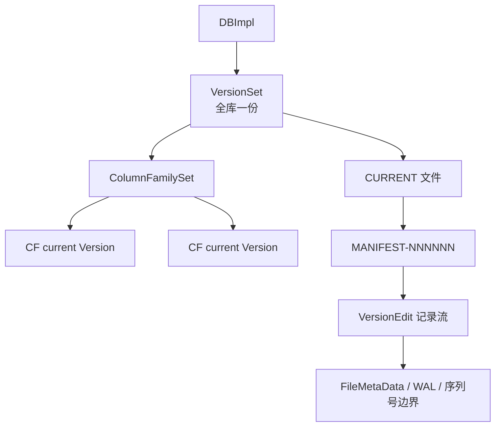
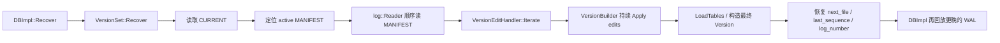

## 今日主题

- 主主题：`MANIFEST / VersionEdit / VersionSet`
- 副主题：`CURRENT / VersionBuilder / VersionEditHandler`

## 学习目标

- 讲清 `CURRENT -> MANIFEST` 这条元数据入口链。
- 讲清 `VersionEdit` 记录的到底是“快照”还是“增量”。
- 讲清 `VersionSet::LogAndApply()` 如何把 flush/compaction 产生的元数据提交到运行时和磁盘。
- 讲清 `VersionSet::Recover()` 如何在 DB 打开时把 MANIFEST 回放回内存。
- 把 Day 001、Day 007、Day 011 里还没闭环的 `VersionSet / MANIFEST / FileMetaData` 主线接上。

## 前置回顾

- Day 001 已经把 `VersionSet` 标成全库级元数据管理器，但当时还没有展开它如何和 `MANIFEST` 配合。
- Day 007 已经说明 flush 的真正完成点更接近 `LogAndApply(...)`，但还没有讲清 `LogAndApply(...)` 内部到底做了什么。
- Day 011 已经说明 `FileMetaData` 会持久化在 `MANIFEST`，恢复后驻留在 `Version / VersionStorageInfo`，但还没有讲清“谁写进去、谁读出来、谁变成 current Version”。

所以 Day 012 的任务就是把这条元数据主线闭环：

`SST / WAL 变化 -> VersionEdit -> MANIFEST -> VersionSet / Version -> 打开恢复`

## 源码入口

- `D:\program\rocksdb\db\version_set.h`
- `D:\program\rocksdb\db\version_set.cc`
- `D:\program\rocksdb\db\version_edit.h`
- `D:\program\rocksdb\db\version_edit.cc`
- `D:\program\rocksdb\db\version_builder.h`
- `D:\program\rocksdb\db\version_builder.cc`
- `D:\program\rocksdb\db\version_edit_handler.h`
- `D:\program\rocksdb\db\version_edit_handler.cc`
- `D:\program\rocksdb\db\manifest_ops.cc`
- `D:\program\rocksdb\file\filename.cc`
- `D:\program\rocksdb\db\db_impl\db_impl_open.cc`

## 它解决什么问题

只要 RocksDB 开始 flush、compaction、创建/删除 column family，就会不断产生新的元数据变化：

- 新增了哪些 SST
- 删除了哪些旧文件
- 某个 CF 当前的 `log_number` 推进到了哪里
- `min_log_number_to_keep` 推进到了哪里
- `next_file_number`、`last_sequence`、`max_column_family` 的全局边界是什么

如果没有一套专门的元数据系统，就会立刻遇到 4 个问题：

1. flush/compaction 产出的 SST 文件不知道是否已经“被版本系统承认”
2. 重启后不知道当前每个 CF 应该看到哪些 SST
3. 不知道哪些 WAL 仍然是恢复所必需的
4. 每次元数据变化都去重写整份文件集合，代价太高

所以 RocksDB 采用的是一条很典型的设计：

- `VersionEdit`
  - 记录一次“增量变化”
- `MANIFEST`
  - 追加写这些变化
- `VersionSet`
  - 维护全库运行时元数据，并负责把变化写入/读回
- `Version`
  - 表示某个 CF 在某个时刻的一份文件集合视图

一句话记忆：

`VersionEdit 是一次变更，MANIFEST 是变更日志，VersionSet 是运行时元数据管理器，Version 是某个 CF 的具体文件集合快照。`

## 它是怎么工作的

先看对象关系：



再看提交链：


最后看恢复链：



这三张图对应了 Day 012 的三个核心结论：

1. `CURRENT` 不是版本本身，它只是“当前 active MANIFEST 的指针文件”。
2. `MANIFEST` 通常不是一份完整快照，而是一串 `VersionEdit` 增量记录；只有切换到新的 MANIFEST 时，才会先写一份“当前完整状态”作为基线。
3. `VersionSet` 不只是持有几个字段，它同时负责：
   - 运行时版本对象管理
   - MANIFEST 写入串行化
   - MANIFEST 回放恢复

## 关键数据结构与实现点

### `VersionEdit`

它不是固定布局的结构体 dump，而是一条 tag-based 的变更记录。常见内容包括：

- `SetLogNumber(...)`
- `SetPrevLogNumber(...)`
- `SetNextFile(...)`
- `SetMinLogNumberToKeep(...)`
- `SetLastSequence(...)`
- `DeleteFile(level, file_number)`
- `AddFile(level, FileMetaData...)`
- `AddColumnFamily(...) / DropColumnFamily()`
- `AddWal(...) / DeleteWalsBefore(...)`

它表达的是：

- “这次变化增加了什么”
- “这次变化删除了什么”
- “哪些全局边界被推进了”

而不是：

- “现在全库完整状态是什么”

### `VersionBuilder`

它是 `VersionEdit -> Version` 之间的中间层。

它的职责不是持久化，也不是 I/O，而是：

- 以某个 base version 为起点
- 高效应用一串 `VersionEdit`
- 最后 `SaveTo(...)` 产出新的 `VersionStorageInfo`

所以它更像“内存里的元数据增量应用器”。

### `VersionSet`

它是全库唯一的版本管理器。除了每个 CF 的 current version 之外，它还集中管理：

- `manifest_writers_`
- `descriptor_log_`
- `manifest_file_number_`
- `next_file_number_`
- `descriptor_last_sequence_`
- `min_log_number_to_keep_`
- `wals_`

也就是说，它既管：

- “某个 CF 当前有哪些 SST”

也管：

- “当前 active MANIFEST 是哪个”
- “下一个 file number 用多少”
- “哪些 WAL 仍然要保留”

### `VersionEditHandler`

它是 `Recover()` 路径里的 MANIFEST 回放器。

职责拆成 4 步：

1. 从 `log::Reader` 中一条条读出 record
2. `VersionEdit::DecodeFrom(...)`
3. 分发给 CF add/drop、WAL add/delete、普通文件变更等路径
4. 用 `VersionBuilder` 持续积累，最后生成最终 `Version`

注意这个边界很重要：

- `VersionEdit::DecodeFrom(...)` 只负责把字节变成一条 edit
- “这条 edit 应该作用到哪个 CF、如何生成最终 Version” 是 `VersionEditHandler / VersionBuilder` 的职责

## 源码细读

下面抓 8 个关键片段，把 Day 012 的主线闭起来。

### 1. `VersionSet` 是全库对象，`LogAndApply` 是它的核心提交入口

```cpp
// db/version_set.h + class VersionSet
// VersionSet is the collection of versions of all the column families of the
// database. Each database owns one VersionSet.
class VersionSet {
 public:
  // Apply *edit to the current version to form a new descriptor that
  // is both saved to persistent state and installed as the new
  // current version. Will release *mu while actually writing to the file.
  Status LogAndApply(...);
  Status Recover(...);
};
```

这一段先把 Day 001 里没展开的边界讲清楚了：

- 一个 DB 只有一个 `VersionSet`
- `LogAndApply(...)` 同时负责：
  - 持久化到 MANIFEST
  - 安装新的 current version
- `Recover(...)` 负责把 MANIFEST 读回内存

所以 `VersionSet` 不是“某个 CF 当前版本列表”本身，而是“全库版本系统的总控制器”。

### 2. `VersionEdit` 真的是“增量记录”，而不是“整份快照”

```cpp
// db/version_edit.h + class VersionEdit
void SetLogNumber(uint64_t num);
void SetNextFile(uint64_t num);
void SetMinLogNumberToKeep(uint64_t num);
void SetLastSequence(SequenceNumber seq);
void DeleteFile(int level, uint64_t file);
void AddFile(int level, uint64_t file, uint32_t file_path_id,
             uint64_t file_size, const InternalKey& smallest,
             const InternalKey& largest, ...);
void AddWal(WalNumber number, WalMetadata metadata = WalMetadata());
void DeleteWalsBefore(WalNumber number);
void SetColumnFamily(uint32_t column_family_id);
void AddColumnFamily(const std::string& name);
void DropColumnFamily();
```

这里直接告诉我们：

- `VersionEdit` 能表达文件增删
- 能表达 WAL 集合变化
- 能表达全局 file number / sequence / log boundary 推进
- 能表达 CF add/drop

它的设计粒度是“一次元数据变化”，不是“一份完整的 LSM 状态快照”。

顺着 `AddFile(...)` 再看一个细节：

```cpp
// db/version_edit.h + VersionEdit::AddFile(...)
new_files_.emplace_back(level, FileMetaData(...));
files_to_quarantine_.push_back(file);
if (!HasLastSequence() || largest_seqno > GetLastSequence()) {
  SetLastSequence(largest_seqno);
}
```

这说明 `VersionEdit` 在添加新 SST 时，会顺手推进 `last_sequence_`。也就是说，`last_sequence` 不只是写路径概念，它也会作为 MANIFEST 元数据的一部分持续推进。

### 3. `CURRENT` 文件只保存“当前 MANIFEST 文件名”

```cpp
// db/manifest_ops.cc + GetCurrentManifestPath(...)
Status s = ReadFileToString(fs, CurrentFileName(dbname), opts, &fname);
if (fname.empty() || fname.back() != '\n') {
  return Status::Corruption("CURRENT file does not end with newline");
}
fname.resize(fname.size() - 1);
bool parse_ok = ParseFileName(fname, manifest_file_number, &type);
...
manifest_path->append(fname);
```

```cpp
// file/filename.cc + SetCurrentFile(...)
std::string manifest = DescriptorFileName(dbname, descriptor_number);
Slice contents = manifest;
contents.remove_prefix(dbname.size() + 1);
...
s = WriteStringToFile(fs, contents.ToString() + "\n", tmp, true, opts, file_opts);
s = fs->RenameFile(tmp, CurrentFileName(dbname), opts, nullptr);
```

更细一点看，`SetCurrentFile(...)` 不是先删掉旧 `CURRENT`，再新建 `CURRENT` 写内容，而是：

```cpp
// file/filename.cc + SetCurrentFile(...)
std::string tmp = TempFileName(dbname, descriptor_number);
s = WriteStringToFile(fs, contents.ToString() + "\n", tmp, true, opts, file_opts);
...
s = fs->RenameFile(tmp, CurrentFileName(dbname), opts, nullptr);
...
if (dir_contains_current_file != nullptr) {
  s = dir_contains_current_file->FsyncWithDirOptions(
      opts, nullptr, DirFsyncOptions(CurrentFileName(dbname)));
}
```

其中 `WriteStringToFile(..., should_sync=true, ...)` 会先写临时文件并 `Sync()`，然后才执行 rename。默认 POSIX 文件系统实现里，`RenameFile(...)` 对应的是系统调用 `rename(src, target)`；如果目标 `CURRENT` 已经存在，rename 负责把目标替换掉，而不是由 RocksDB 先显式删除旧 `CURRENT`。

这个“覆盖已有目标”的语义在 RocksDB 里不是只靠口头假设。`env_basic_test.cc` 有 `Renaming overwriting works` 测试；Windows 文件系统实现也因为 C runtime `rename()` 不能像 Linux 那样替换已有文件，所以改用 `MoveFileEx(..., MOVEFILE_REPLACE_EXISTING)`。

这两段正好把 `CURRENT` 的语义钉死：

- `CURRENT` 不是版本内容
- `CURRENT` 也不是绝对路径
- 它只是一个很小的指针文件，内容类似：
  - `MANIFEST-000123\n`

这样做的好处是：

- MANIFEST 可以滚动切换
- 切换时只需要原子地改一下 `CURRENT`

所以 `CURRENT -> MANIFEST` 是一层间接寻址，而不是把元数据直接写在 `CURRENT` 里。

这里依赖的是“同目录内 rename 替换目标文件”的原子切换语义。RocksDB 先保证新的 MANIFEST 已经写好，再把一个已经写入并 sync 过的临时 `CURRENT` rename 成正式 `CURRENT`。如果旧 `CURRENT` 已经存在，它会被这次 rename 替换；这样崩溃时通常只会看到旧 `CURRENT` 或新 `CURRENT`，不会依赖“删除后再新建”或“原地改写旧文件内容”的中间状态。

### 4. `VersionBuilder` 是把一串 edits 应用到某个 base state 上的中间层

```cpp
// db/version_builder.h + class VersionBuilder
// A helper class so we can efficiently apply a whole sequence
// of edits to a particular state without creating intermediate
// Versions that contain full copies of the intermediate state.
class VersionBuilder {
 public:
  Status Apply(const VersionEdit* edit);
  Status SaveTo(VersionStorageInfo* vstorage) const;
};
```

这个注释的价值很高，因为它直接回答了一个常见误区：

- RocksDB 回放 MANIFEST 时，不是“每读一条 edit 就创建一个完整 Version”

而是：

1. 先用 `VersionBuilder` 持续 `Apply(...)`
2. 最后需要 materialize 的时候，才 `SaveTo(...)`

这既降低了恢复成本，也降低了 `LogAndApply(...)` 时的中间对象开销。

### 5. `LogAndApply()` 先串行化 manifest writer，再批量处理 edits

```cpp
// db/version_set.cc + VersionSet::LogAndApply(...)
for (int i = 0; i < num_cfds; ++i) {
  writers.emplace_back(mu, column_family_datas[i], edit_lists[i], wcb);
  manifest_writers_.push_back(&writers[i]);
}
...
while (!first_writer.done && &first_writer != manifest_writers_.front()) {
  first_writer.cv.Wait();
}
...
return ProcessManifestWrites(writers, mu, dir_contains_current_file,
                             new_descriptor_log, new_cf_options,
                             read_options, write_options);
```

这里说明两件事：

1. `LogAndApply()` 不是随便谁来都能直接写 MANIFEST
   - 它先进入 `manifest_writers_` 队列
   - 只有排到队头的 writer 才能真正写
2. `LogAndApply()` 支持 group commit
   - 队头 writer 可以把后面同类请求一起批处理

所以 Day 007 里“flush 的真正完成点是 `LogAndApply(...)`”这句话，到了 Day 012 应该补成：

- `LogAndApply(...)` 不是单纯 append 一条日志
- 它是一个“串行化 + 批处理 + 构造新 Version + 持久化 + 安装 current Version”的完整提交流程

### 6. `ProcessManifestWrites()` 里真正做了“应用 edits -> 写 MANIFEST -> 安装 Version”

先看 edit 应用和新 Version 构造：

```cpp
// db/version_set.cc + VersionSet::ProcessManifestWrites(...)
version = new Version(last_writer->cfd, this, file_options_, ...);
builder_guards.emplace_back(new BaseReferencedVersionBuilder(last_writer->cfd));
builder = builder_guards.back()->version_builder();
...
Status s = LogAndApplyHelper(last_writer->cfd, builder, e,
                             &max_last_sequence, mu);
...
Status s = builder->SaveTo(versions[i]->storage_info());
```

再看持久化到 MANIFEST：

```cpp
// db/version_set.cc + VersionSet::ProcessManifestWrites(...)
if (!e->EncodeTo(&record, batch_edits_ts_sz[bidx])) {
  s = Status::Corruption("Unable to encode VersionEdit:" + e->DebugString(true));
  break;
}
io_s = raw_desc_log_ptr->AddRecord(write_options, record);
...
io_s = SyncManifest(db_options_, write_options, raw_desc_log_ptr->file());
```

最后看成功后的安装：

```cpp
// db/version_set.cc + VersionSet::ProcessManifestWrites(...)
if (e->HasLogNumber() && e->GetLogNumber() > cfd->GetLogNumber()) {
  cfd->SetLogNumber(e->GetLogNumber());
}
...
if (last_min_log_number_to_keep != 0) {
  MarkMinLogNumberToKeep(last_min_log_number_to_keep);
}
...
AppendVersion(cfd, versions[i]);
```

这三段连起来，正是 Day 012 最核心的一条链：

1. `VersionBuilder::Apply(...)`
   - 先在内存里把 edits 应用到 base state
2. `EncodeTo + AddRecord + SyncManifest`
   - 把这批变化持久化到 active MANIFEST
3. `AppendVersion(...)`
   - 成功后再把新的 `Version` 安装成某个 CF 的 `current`

所以 `VersionEdit` 能不能算“生效”，要看两层：

- MANIFEST 是否写成功
- 新 `Version` 是否被 `AppendVersion(...)`

### 7. 新 MANIFEST 不是只继续写增量，而是先写一份“当前完整状态”

```cpp
// db/version_set.cc + VersionSet::ProcessManifestWrites(...)
if (!skip_manifest_write &&
    (!descriptor_log_ || prev_manifest_file_size >= tuned_max_manifest_file_size_)) {
  new_descriptor_log = true;
}
...
if (s.ok() && new_descriptor_log) {
  ...
  s = WriteCurrentStateToManifest(write_options, curr_state,
                                  wal_additions, raw_desc_log_ptr, io_s);
}
...
if (s.ok() && new_descriptor_log) {
  io_s = SetCurrentFile(write_options, fs_.get(), dbname_,
                        pending_manifest_file_number_,
                        file_options_.temperature, dir_contains_current_file);
}
```

再看 `WriteCurrentStateToManifest(...)` 写了什么：

```cpp
// db/version_set.cc + VersionSet::WriteCurrentStateToManifest(...)
if (db_options_->write_dbid_to_manifest) {
  edit_for_db_id.SetDBId(db_id_);
  ...
}
...
wal_deletions.DeleteWalsBefore(min_log_number_to_keep());
...
for (auto cfd : *column_family_set_) {
  ...
  edit.SetComparatorName(...);
  ...
  for (const auto& f : level_files) {
    edit.AddFile(level, f->fd.GetNumber(), f->fd.GetPathId(),
                 f->fd.GetFileSize(), f->smallest, f->largest, ...);
  }
  ...
  edit.SetLogNumber(log_number);
  ...
  edit.SetLastSequence(descriptor_last_sequence_);
  ...
  io_s = log->AddRecord(write_options, record);
}
```

这说明 MANIFEST rollover 不是：

- “新建空 MANIFEST，以后继续追加增量”

而是：

1. 创建新的 `MANIFEST-N`
2. 把当前完整状态写进去
   - DB ID
   - WAL additions / deletion boundary
   - 每个 CF 的 comparator / log_number
   - 当前所有 SST 的 `AddFile(...)`
   - `last_sequence`
3. 再 `SetCurrentFile(...)` 让 `CURRENT` 指向它

所以新 MANIFEST 的开头更像“一份元数据 checkpoint”，后面再继续追加新的 `VersionEdit` 增量。

### 8. `Recover()` 不是直接构造最终 Version，而是“读 CURRENT -> 回放 MANIFEST -> 最后 materialize”

先看入口：

```cpp
// db/version_set.cc + VersionSet::Recover(...)
Status s = GetCurrentManifestPath(dbname_, fs_.get(), is_retry,
                                  &manifest_path, &manifest_file_number_);
...
log::Reader reader(nullptr, std::move(manifest_file_reader), &reporter,
                   true /* checksum */, 0 /* log_number */);
VersionEditHandler handler(
    read_only, column_families, const_cast<VersionSet*>(this),
    /*track_found_and_missing_files=*/false, no_error_if_files_missing,
    io_tracer_, read_options, /*allow_incomplete_valid_version=*/false,
    EpochNumberRequirement::kMightMissing);
handler.Iterate(reader, &log_read_status);
```

再看 `VersionEditHandler::Iterate(...)`：

```cpp
// db/version_edit_handler.cc + VersionEditHandlerBase::Iterate(...)
while (... reader.ReadRecord(&record, &scratch) && log_read_status->ok()) {
  VersionEdit edit;
  s = edit.DecodeFrom(record);
  ...
  s = ApplyVersionEdit(edit, &cfd);
}
...
CheckIterationResult(reader, &s);
```

最后看它如何在结束时生成最终 Version：

```cpp
// db/version_edit_handler.cc + VersionEditHandler::CheckIterationResult(...)
for (auto* cfd : *(version_set_->column_family_set_)) {
  ...
  VersionEdit edit;
  *s = MaybeCreateVersionBeforeApplyEdit(edit, cfd,
                                         /*force_create_version=*/true);
}
```

```cpp
// db/version_edit_handler.cc + VersionEditHandler::MaybeCreateVersionBeforeApplyEdit(...)
if (force_create_version) {
  auto* v = new Version(cfd, version_set_, version_set_->file_options_, ...);
  s = builder->SaveTo(v->storage_info());
  if (s.ok()) {
    v->PrepareAppend(read_options_, ...);
    version_set_->AppendVersion(cfd, v);
  }
}
s = builder->Apply(&edit);
```

这几段合在一起，正好说明恢复的真实结构：

1. `CURRENT` 只用来找到 active MANIFEST
2. `VersionEditHandler` 一条条 decode and apply edits
3. `VersionBuilder` 在内存中持续积累
4. 全部回放完成后，才为每个 CF materialize 最终 `Version`

这也是为什么前面说：

- 恢复并不是“每个 MANIFEST record 都形成一个 Version”
- 它真正恢复的是“最终可用的 end version”

## 今日问题与讨论

### 我的问题

**问题：为什么 Day 007 里说 flush 的完成点更接近 `LogAndApply(...)`？**

- 简答：
  - 因为 `BuildTable(...)` 只把 SST 文件造出来，而 `LogAndApply(...)` 才会把：
    - `AddFile(...)`
    - `SetLogNumber(...)`
    - `SetMinLogNumberToKeep(...)`
    - 新的 `current Version`
    一起提交到元数据系统。
- 源码依据：
  - `D:\program\rocksdb\db\flush_job.cc`
  - `D:\program\rocksdb\db\version_set.cc`
- 当前结论：
  - SST 文件存在，不等于版本系统已经承认它存在。
- 是否需要后续回看：
  - `需要`
  - 到 `Compaction` 章节再把 compaction 输出如何走同一条 `LogAndApply(...)` 主线压实。

**问题：`VersionSet` 更新了 `current Version`，是不是就等于读路径已经可见？**

- 简答：
  - 不能完全画等号。`VersionSet` 的职责是更新某个 CF 的 `current Version`；真正给读路径发布稳定可读视图，还要靠 `SuperVersion` 安装。
- 源码依据：
  - `D:\program\rocksdb\db\version_set.cc::AppendVersion(...)`
  - `D:\program\rocksdb\db\db_impl\db_impl_compaction_flush.cc::InstallSuperVersionAndScheduleWork(...)`
- 当前结论：
  - `VersionSet` 负责“版本元数据 current 指针”，`SuperVersion` 负责“前台读视图发布”。
- 是否需要后续回看：
  - `需要`
  - 后面回看 `Compaction`、`Column Family` 或读路径时再把这条边界重新压一遍。

**问题：为什么切换新 MANIFEST 时要先 `WriteCurrentStateToManifest(...)`？**

- 简答：
  - 因为新的 MANIFEST 必须能够单独作为恢复起点使用，不能只依赖旧 MANIFEST 里的历史增量。
- 源码依据：
  - `D:\program\rocksdb\db\version_set.cc`
- 当前结论：
  - MANIFEST rollover 本质上是在做一次“元数据 checkpoint + 之后继续写增量”。
- 是否需要后续回看：
  - `需要`
  - 到 `DB 打开/恢复` 或 `best-efforts recovery` 主题时再继续压实。

**问题：Day 011 里说 `FileMetaData` 会持久化在 MANIFEST，这里到底是怎么进去、怎么出来的？**

- 简答：
  - 进入：
    - flush/compaction 构造 `VersionEdit::AddFile(...)`
    - `VersionSet::LogAndApply(...)` 把 edit 编码写入 MANIFEST
  - 出来：
    - `VersionSet::Recover()` 顺序读 MANIFEST
    - `VersionEditHandler` 解码出 `AddFile(...)`
    - `VersionBuilder` 应用到 `VersionStorageInfo`
    - 最后变成某个 CF 的 `current Version`
- 源码依据：
  - `D:\program\rocksdb\db\version_edit.h`
  - `D:\program\rocksdb\db\version_set.cc`
  - `D:\program\rocksdb\db\version_edit_handler.cc`
- 当前结论：
  - `FileMetaData` 不是某个边角附属结构，而是被 `VersionEdit` 和 `MANIFEST` 主线直接承载的核心元数据。
- 是否需要后续回看：
  - `需要`
  - 到 `Compaction` 和 `Block Cache / Bloom` 时继续回看它如何影响文件选择和打开路径。

**问题：`CURRENT` 切换是不是依赖 rename 原子性？`SetCurrentFile(...)` 是不是先删旧文件、再新建写入？**

- 简答：
  - 是的，正常路径依赖文件系统对同目录 rename/replace 的原子切换语义。
  - 但不是“先删旧 `CURRENT` -> 新建 `CURRENT` -> 写内容”。RocksDB 是先写临时文件并 sync，再 rename 成 `CURRENT`，成功后还会在可用时 fsync 所在目录。
  - 如果旧 `CURRENT` 已经存在，`RenameFile(tmp, CURRENT)` 会覆盖它；RocksDB 不在这条正常路径里先删除旧 `CURRENT`。
- 源码依据：
  - `D:\program\rocksdb\file\filename.cc::SetCurrentFile(...)`
  - `D:\program\rocksdb\env\file_system.cc::WriteStringToFile(...)`
  - `D:\program\rocksdb\env\fs_posix.cc::PosixFileSystem::RenameFile(...)`
  - `D:\program\rocksdb\port\win\env_win.cc::WinFileSystem::RenameFile(...)`
  - `D:\program\rocksdb\env\env_basic_test.cc`
- 当前结论：
  - 小的是 `CURRENT` 文件，不是 `MANIFEST`。`CURRENT` 只存 `MANIFEST-xxxxx\n` 这种文件名；`MANIFEST` 本身是 `VersionEdit` 日志，可能随着元数据变更持续增长。
  - `CURRENT` 的更新协议是 `tmp CURRENT 内容 -> sync tmp -> rename 覆盖 CURRENT -> 尽量 fsync 目录`。
- 是否需要后续回看：
  - `需要`
  - 到 `DB 打开/恢复` 或 `MANIFEST rollover` 异常路径时，再看 `SetCurrentFile` 失败后旧 MANIFEST quarantine 和恢复选择逻辑。

**问题：RocksDB 是否保证 `SetCurrentFile(...)` 不会被多线程并发调用？**

- 简答：
  - 正常版本提交路径里，RocksDB 不靠 `SetCurrentFile(...)` 自己处理并发，而是在更上层的 `VersionSet::LogAndApply(...)` 串行化 MANIFEST 提交。
  - `LogAndApply(...)` 入口要求持有 DB mutex；调用者进入后会把自己的 `ManifestWriter` 放进 `manifest_writers_` 队列，只有队头 writer 才能进入 `ProcessManifestWrites(...)`。
  - `ProcessManifestWrites(...)` 写 MANIFEST 时会释放 DB mutex 做 I/O，但当前 writer 仍然占着 `manifest_writers_` 队头；后续线程即使趁 mutex 释放进入 `LogAndApply(...)`，也只会排队等待，不会同时执行另一轮 `SetCurrentFile(...)`。
- 源码依据：
  - `D:\program\rocksdb\db\version_set.h::VersionSet::LogAndApply(...)`
  - `D:\program\rocksdb\db\version_set.cc::VersionSet::LogAndApply(...)`
  - `D:\program\rocksdb\db\version_set.cc::VersionSet::ProcessManifestWrites(...)`
  - `D:\program\rocksdb\db\db_impl\db_impl_open.cc::DBImpl::Recover(...)`
- 当前结论：
  - 同一个 DB 实例内，`SetCurrentFile(...)` 的正常调用被 `DB mutex + manifest_writers_` 保护。
  - 跨进程或多个 writable DB 实例同时打开同一路径，不是靠 `SetCurrentFile(...)` 解决，而是打开 DB 时先拿 DB 目录下的 `LOCK` 文件。
- 是否需要后续回看：
  - `需要`
  - 到 `Compaction` 和 `Column Family` 时再回看 `manifest_writers_ / atomic group / multi-CF group commit` 的细节。

**问题：RocksDB 的架构是不是可以理解成 `SST + MANIFEST`，也就是 `VersionSet`？所有元数据是否都聚集到 `VersionSet`？**

- 简答：
  - 不能这样简化。`SST + MANIFEST` 只覆盖了“已经落盘的数据文件 + 描述这些文件如何组成版本的元数据日志”这条主线。
  - `VersionSet` 也不等于 RocksDB 架构本身。它是运行时的版本元数据管理器，负责把 MANIFEST 中的 `VersionEdit` 回放成各个 CF 的 `Version / VersionStorageInfo`，并在 flush/compaction 后提交新的版本变化。
  - RocksDB 还至少包含 WAL、MemTable/Immutable MemTable、ColumnFamilyData、SuperVersion、TableCache、BlockCache、WriteThread、Compaction/Flush 调度、Options 文件、LOCK 文件等组成部分。
- 源码依据：
  - `D:\program\rocksdb\db\version_set.h`
  - `D:\program\rocksdb\db\column_family.h`
  - `D:\program\rocksdb\db\db_impl\db_impl.h`
  - `D:\program\rocksdb\db\memtable.h`
  - `D:\program\rocksdb\db\table_cache.h`
  - `D:\program\rocksdb\table\block_based\block_based_table_reader.h`
- 当前结论：
  - `VersionSet` 聚集的是“版本相关元数据”：当前 active MANIFEST、file number、sequence 边界、WAL 跟踪、ColumnFamilySet、每个 CF 的 current Version 等。
  - 它不聚集所有 RocksDB 元数据。比如 SST 内部的 index/filter/properties 属于 table 文件格式；block cache/table cache 有自己的缓存元数据；memtable 的 skiplist 内容在内存中；options 有单独的 options file；DB 互斥打开靠 `LOCK` 文件。
  - 更准确的分层是：
    - 数据面：`WAL + MemTable + Immutable MemTable + SST`
    - 版本元数据面：`CURRENT + MANIFEST + VersionEdit + VersionSet + Version`
    - 读优化面：`TableCache + BlockCache + Filter/Index`
    - 调度与控制面：`DBImpl + ColumnFamilyData + Flush/Compaction + WriteThread`
- 是否需要后续回看：
  - `需要`
  - 到 `Compaction`、`Block Cache`、`Column Family` 时继续把这些模块边界压实。

**问题：如果只看持久化状态，核心是不是就是 SST 和 MANIFEST 内容？还有其他内容吗？**

- 简答：
  - 如果说“恢复用户数据所需的核心持久状态”，更准确是：`CURRENT + MANIFEST + SST + WAL`。
  - `SST` 保存已经落盘的数据；`MANIFEST` 保存这些 SST 如何组成版本，以及部分 WAL/sequence/file number 边界；`CURRENT` 指向当前 active MANIFEST；`WAL` 保存还没有 flush 成 SST 的最近写入。
  - `VersionSet` 不是持久化文件。磁盘上持久化的是 MANIFEST 里的 `VersionEdit` 记录；DB 打开时再用这些记录重建内存里的 `VersionSet / Version`。
- 源码依据：
  - `D:\program\rocksdb\file\filename.h`
  - `D:\program\rocksdb\file\filename.cc`
  - `D:\program\rocksdb\db\version_set.cc::VersionSet::Recover(...)`
  - `D:\program\rocksdb\db\db_impl\db_impl_open.cc::DBImpl::Recover(...)`
- 当前结论：
  - 对崩溃恢复来说，只靠 `SST + MANIFEST` 不够，因为 memtable 中尚未 flush 的数据要靠 WAL replay 恢复。
  - 对定位 active MANIFEST 来说，只靠 MANIFEST 文件本身也不够，正常恢复入口会先读 `CURRENT`，再打开它指向的 MANIFEST。
  - DB 目录里还会有其他持久文件，但它们不都属于“LSM 数据版本核心”：
    - `OPTIONS-*`：保存 options，方便后续按已持久化配置打开或校验。
    - `LOCK`：防止多个 writable 实例同时打开同一路径，不承载用户数据。
    - `IDENTITY`：DB identity。
    - `LOG / LOG.old.*`：运行日志。
    - `*.blob`：启用 BlobDB / integrated blob 场景下的数据文件。
    - `*.dbtmp`、旧 MANIFEST、归档 WAL、compaction progress 等：临时、过渡或辅助状态。
- 是否需要后续回看：
  - `需要`
  - 到 `WAL recovery`、`Blob`、`Options` 或 `DB open` 时再分别展开这些文件的地位。

**问题：如果把 WAL、SST、OPTIONS、blob、log 都当作状态文件而不算元数据，那么 RocksDB 所有需要持久化的元数据是否都聚集在 `VersionSet`，并存储在 MANIFEST 中？**

- 简答：
  - 如果限定为“LSM 版本元数据”，基本可以这样理解：它主要由 `VersionSet / Version / VersionStorageInfo / FileMetaData` 在内存中管理，并通过 `VersionEdit` 持久化到 MANIFEST。
  - 但如果说“所有需要持久化的元数据”，仍然不能这么说。RocksDB 还有一些持久化元数据不属于 `VersionSet -> MANIFEST` 这条线。
- `VersionSet -> MANIFEST` 主要覆盖：
  - DB ID、comparator name、max column family
  - column family add/drop
  - log number、next file number、last sequence
  - SST 的 `FileMetaData`
  - file add/delete
  - WAL tracking 的 add/delete boundary
  - integrated BlobDB 的 blob file metadata / garbage metadata
  - full history timestamp low 等 CF 版本相关边界
- 不属于或不完全属于 `VersionSet -> MANIFEST` 的持久化元数据例子：
  - `CURRENT`：active MANIFEST 指针，独立小文件。
  - `IDENTITY`：DB identity 文件；DB ID 也可能写入 MANIFEST，但不能把 IDENTITY 说成 VersionSet 状态。
  - `LOCK`：打开互斥用，不是版本元数据。
  - SST 内部元数据：index、filter、properties、footer、metaindex 等在 SST 文件内部，不进入 MANIFEST。
  - Blob 文件内部元数据：blob header/footer/record 结构在 blob 文件内；MANIFEST 只跟踪 blob file 级别元信息。
  - `COMPACTION_PROGRESS-*`：secondary/remote compaction 相关的进度持久化，不属于主 VersionSet/MANIFEST 版本链。
- 源码依据：
  - `D:\program\rocksdb\db\version_edit.h`
  - `D:\program\rocksdb\db\version_set.cc`
  - `D:\program\rocksdb\file\filename.cc`
  - `D:\program\rocksdb\table\block_based\block_based_table_builder.cc`
  - `D:\program\rocksdb\db\db_impl\db_impl_secondary.cc`
- 当前结论：
  - 最稳的表述是：`VersionSet/MANIFEST 是 RocksDB 的版本元数据中心`。
  - 不要说：`所有持久化元数据都在 VersionSet/MANIFEST`。
  - 这个差异很重要，因为 MANIFEST 描述的是“有哪些外部文件构成当前版本”，而很多文件内部为了自描述、校验、查找、恢复辅助，还会保存自己的局部元数据。
- 是否需要后续回看：
  - `需要`
  - 到 `SST 内部格式`、`Blob`、`secondary instance / remote compaction` 时再把非 MANIFEST 元数据单独展开。

**问题：MANIFEST 每次只追加少量元数据，却都要 sync，会不会影响性能？**

- 简答：
  - 会有成本，而且这是 RocksDB 有意付出的元数据持久化成本。
  - 但它不是每次用户 `Put` 都发生，而是在版本提交点发生，例如 flush 完成、compaction 完成、CF 操作、WAL tracking 元数据变更等。
  - 通常这个成本相对可控，因为一次 flush/compaction 已经产生了较重的 I/O 工作；MANIFEST sync 是为了保证“新 SST 文件被版本系统承认”这个事实崩溃后仍可恢复。
- 源码依据：
  - `D:\program\rocksdb\db\version_set.cc::VersionSet::ProcessManifestWrites(...)`
  - `D:\program\rocksdb\file\filename.cc::SyncManifest(...)`
  - `D:\program\rocksdb\include\rocksdb\options.h`
- 具体机制：
  - `ProcessManifestWrites(...)` 会把一批 `VersionEdit` 编码后逐条 `AddRecord(...)` 到 MANIFEST。
  - 这批 record 写完后调用一次 `SyncManifest(...)`，而不是每条 edit 都单独 sync。
  - `LogAndApply(...)` 通过 `manifest_writers_` 支持把多个非 CF manipulation 的 manifest writer 合并成一批提交，从而摊薄 sync 成本。
  - `SyncManifest(...)` 底层调用 `WritableFileWriter::Sync(...)`，并受 `use_fsync` 等文件系统 sync 策略影响。
  - `manifest_preallocation_size` 用来预分配 MANIFEST 文件空间，减少随机 I/O 和分配开销。
  - `max_manifest_file_size / max_manifest_space_amp_pct` 控制 MANIFEST 何时 rollover/compact，避免 MANIFEST 无限增长，同时也避免过于频繁地重写完整状态。
- 当前结论：
  - MANIFEST sync 是一个真实开销，但它保护的是版本元数据的崩溃一致性。
  - 它的频率跟“版本变化”相关，不跟“用户写入次数”直接等价。
  - 如果 flush/compaction 特别频繁，或者存储设备 sync latency 很高，MANIFEST sync 可能成为抖动来源；但正常情况下 RocksDB 通过批量提交、顺序追加、预分配和 rollover 控制来降低影响。
- 是否需要后续回看：
  - `需要`
  - 到 `Compaction` 和 `Write Stall` 时回看：大量小 SST、频繁 flush/compaction 会如何间接放大 MANIFEST 提交频率。

**问题：MANIFEST 文件的创建、切换和删除逻辑是什么？`CURRENT` 是否保证磁盘上只有一个 MANIFEST？如果文件系统不支持原子 rename/remove 怎么办？**

- 简答：
  - `CURRENT` 不保证磁盘上只有一个 MANIFEST。它只保证正常恢复入口只认一个 active MANIFEST。
  - 创建新 MANIFEST 的时机主要是：当前没有 `descriptor_log_`，或者当前 MANIFEST 大小超过 `tuned_max_manifest_file_size_`，或者调用方显式要求 `new_descriptor_log`。
  - 新 MANIFEST 创建后，RocksDB 会先写当前完整版本状态，再追加本批 `VersionEdit`，sync 成功后用 `SetCurrentFile(...)` 让 `CURRENT` 指向新 MANIFEST。
  - 旧 MANIFEST 不会立刻在切换点同步删除，而是加入 `obsolete_manifests_`，后续由 `PurgeObsoleteFiles(...)` 删除。
- 源码依据：
  - `D:\program\rocksdb\db\version_set.cc::VersionSet::ProcessManifestWrites(...)`
  - `D:\program\rocksdb\db\version_set.cc::VersionSet::GetObsoleteFiles(...)`
  - `D:\program\rocksdb\db\db_impl\db_impl_files.cc::DBImpl::PurgeObsoleteFiles(...)`
  - `D:\program\rocksdb\file\filename.cc::SetCurrentFile(...)`
  - `D:\program\rocksdb\include\rocksdb\options.h`
- 主流程：
  - 正常情况下，MANIFEST 只是持续 append `VersionEdit`。
  - 当 `!descriptor_log_ || prev_manifest_file_size >= tuned_max_manifest_file_size_` 时，`ProcessManifestWrites(...)` 触发 `new_descriptor_log = true`。
  - 新 MANIFEST 先通过 `WriteCurrentStateToManifest(...)` 写一份 compacted current state。
  - 再把本次 `batch_edits` 追加进去，并 `SyncManifest(...)`。
  - 如果是新 MANIFEST，成功后调用 `SetCurrentFile(...)` 切换 `CURRENT`。
  - 成功安装后，`manifest_file_number_ = pending_manifest_file_number_`，旧 MANIFEST 进入 `obsolete_manifests_`。
  - 后续 `GetObsoleteFiles(...) -> PurgeObsoleteFiles(...)` 才实际删除旧 MANIFEST。
- 关于文件系统原子性：
  - `rename` 是 `CURRENT` 切换的提交点；RocksDB 正常路径依赖文件系统提供同目录 rename/replace 的原子语义。
  - `remove/delete` 不是提交点，主要是清理 obsolete 文件；删除失败通常可以保留文件，后续再清理，所以它对一致性的要求低于 `rename`。
  - 如果文件系统不能提供 RocksDB 需要的 rename 语义，就不能保证正常崩溃一致性；这种文件系统实现应在 RocksDB 的 `FileSystem/Env` 层提供等价语义，否则可能出现 `CURRENT` 缺失、损坏或指向不可用 MANIFEST 的问题。
  - 源码还特别处理了非本地 FS 的“rename 可能在服务端成功但客户端返回失败”场景：如果 MANIFEST 写入已成功，就倾向保留新 MANIFEST，避免 `CURRENT` 可能已经指向新 MANIFEST 但文件被删除，导致 DB 无法重新打开。
- 当前结论：
  - `CURRENT` 是 active MANIFEST 指针，不是“全目录只允许一个 MANIFEST”的约束。
  - 新 MANIFEST 的创建是为了 compact/rollover 元数据日志，控制恢复成本、备份体积和 MANIFEST 空间放大。
  - 删除旧 MANIFEST 是后置清理，不参与新版本提交的原子性。
- 是否需要后续回看：
  - `需要`
  - 到 `DB open / Recover` 和 `PurgeObsoleteFiles` 主题时继续看异常路径。

**问题：RocksDB 适合支持远程文件系统，例如 S3 之类的对象存储。那么这些系统是否能够原子 rename？**

- 简答：
  - 不能把“远程文件系统”统一理解成“有 POSIX 原子 rename”。
  - RocksDB 的 `FileSystem` 抽象允许接入 remote filesystem，但 `CURRENT` 切换这类路径仍然要求底层 `RenameFile(...)` 提供 RocksDB 需要的同目录原子替换语义。
  - 对普通 S3 general purpose bucket 来说，传统“rename/move”语义通常是先 copy 新对象，再 delete 原对象，不是 POSIX 风格的原子 rename。
  - 但截至当前 AWS 文档，S3 Express One Zone 的 directory bucket 提供 `RenameObject`，文档明确把它描述为目录桶内对象的原子 rename，且不移动对象数据。这是对象存储里的特例，不能直接推广到所有 S3 bucket 或所有 S3 兼容系统。
- 源码依据：
  - `D:\program\rocksdb\include\rocksdb\file_system.h::FileSystem`
  - `D:\program\rocksdb\file\filename.cc::SetCurrentFile(...)`
  - `D:\program\rocksdb\env\fs_posix.cc::RenameFile(...)`
  - `D:\program\rocksdb\port\win\env_win.cc::WinFileSystem::RenameFile(...)`
  - `D:\program\rocksdb\db\version_set.cc::VersionSet::ProcessManifestWrites(...)`
- 外部依据：
  - AWS S3 User Guide：`Copying, moving, and renaming objects`，`https://docs.aws.amazon.com/AmazonS3/latest/userguide/copy-object.html`
  - AWS S3 User Guide：`Renaming objects in directory buckets`，`https://docs.aws.amazon.com/AmazonS3/latest/userguide/directory-buckets-objects-rename.html`
- 当前本地源码看到的 RocksDB 语义：
  - `FileSystem` 明确是 RocksDB 和 POSIX/remote filesystem 等存储系统之间的接口。
  - `SetCurrentFile(...)` 的提交动作是：写并 sync 临时 `CURRENT` 文件，然后调用 `fs->RenameFile(tmp, CurrentFileName(dbname), ...)` 覆盖正式 `CURRENT`。
  - POSIX 实现直接调用 `rename(src, target)`。
  - Windows 实现因为 C runtime `rename()` 不能像 Linux 那样替换已有文件，所以显式使用 `MoveFileEx(..., MOVEFILE_REPLACE_EXISTING)`。
  - 这说明 RocksDB 要的不是“有一个名为 rename 的 API”这么简单，而是“替换已存在目标时也具备合适的原子切换语义”。
- 和 S3 的关系：
  - 普通 S3 object rename/copy/move 更接近对象级别的 copy + delete 流程。这个语义不适合直接承担 `CURRENT` 的提交点，因为中间可能出现新旧对象并存、目标未出现、源已删除、客户端超时但服务端状态不确定等情况。
  - S3 Express One Zone directory bucket 的 `RenameObject` 是特殊能力，可以原子重命名同一个 directory bucket 内的对象；但 RocksDB 能不能直接安全使用，仍取决于具体 `FileSystem` 插件是否把它映射成 RocksDB 所需的 `RenameFile(src, target)` 语义，包括覆盖目标、条件失败、错误重试和 sync/持久化边界。
  - 当前本地 RocksDB 仓库没有看到内置 S3 `FileSystem` 实现；它只是提供 `FileSystem` 抽象和一些 remote/on-demand 相关工具。
- 为什么源码里还要处理“非本地 FS 返回不确定状态”：
  - `version_set.cc` 的异常路径专门说明：对 non-local FS，可能出现服务端 rename 已成功、客户端却返回 non-ok 的情况。
  - 如果 MANIFEST 已经写成功，RocksDB 会倾向保留新 MANIFEST，避免 `CURRENT` 实际已经指向新 MANIFEST，但新 MANIFEST 被本地错误处理删掉，导致 DB 之后无法打开。
  - 这不是在降低对原子性的要求，而是在承认 remote FS 可能有“不确定成功”的错误返回模型，并在删除新 MANIFEST 时更保守。
- 当前结论：
  - RocksDB 可以通过 `FileSystem/Env` 接入远程存储，但 DB 主目录如果直接放在 S3 类对象存储上，不能只靠“对象存储能 copy/delete”就认为满足 RocksDB 的崩溃一致性要求。
  - `CURRENT` 切换必须有等价的原子 rename/replace 提交语义；没有这个语义的对象存储层，需要在插件层额外设计提交协议，或者只把 S3 用在备份、checkpoint、SST 外部存储、remote compaction 等不要求直接承担 `CURRENT` 原子切换的路径上。
  - `remove/delete` 的原子性要求比 rename 低，因为旧 MANIFEST/SST/WAL 删除多是后置清理；失败时留下垃圾文件通常可接受，提交点不能这样处理。
- 是否需要后续回看：
  - `需要`
  - 到 `FileSystem/Env`、`remote compaction`、`backup/checkpoint` 或云对象存储部署模型时再展开。

### 外部高价值问题

- 本章没有单独收录外部问题源。
- 原因：
  - Day 012 的核心链路主要由本地源码闭环；本次只在用户提出 S3 rename 语义时，用 AWS 官方文档补充对象存储背景。

## 常见误区或易混点

1. `MANIFEST` 不是“当前版本快照文件”
   - 更准确地说，它通常是 `VersionEdit` 增量日志；只有切换到新 MANIFEST 时，才会先写一份当前完整状态。

2. `VersionSet` 不等于 `Version`
   - `VersionSet` 是全库管理器；`Version` 是某个 CF 在某个时刻的一份文件集合。

3. `AddFile(...)` 出现在某个 `VersionEdit` 里，不等于文件已经对外可见
   - 还要经过 `LogAndApply(...)` 成功写 MANIFEST，并 `AppendVersion(...)` 安装为 current。

4. 恢复时不是“每条 MANIFEST record 生成一个 Version”
   - 正常 `Recover()` 是用 `VersionBuilder` 累积到最后，再 materialize 最终 version。

5. `VersionSet` 更新 current version，不等于 `SuperVersion` 已经对读路径发布
   - 元数据 current 指针和前台读视图发布是两层职责。

6. `SetCurrentFile(...)` 不是原地改写旧 `CURRENT`
   - 它先写并 sync 临时文件，再通过 rename 替换正式 `CURRENT`；小文件是 `CURRENT`，不是 `MANIFEST`。

7. `SetCurrentFile(...)` 本身不是并发控制层
   - 正常路径由 `VersionSet::LogAndApply(...)` 的 DB mutex 和 `manifest_writers_` 队列保证 MANIFEST/CURRENT 提交串行化。

8. RocksDB 不是 `SST + MANIFEST + VersionSet` 三件东西
   - `VersionSet` 只覆盖版本元数据主线；WAL、MemTable、ColumnFamilyData、SuperVersion、Cache、Options、Flush/Compaction 调度都有各自职责。

9. `VersionSet/MANIFEST` 是版本元数据中心，不是所有持久化元数据的唯一归宿
   - `CURRENT`、`IDENTITY`、SST 内部 index/filter/properties、blob 文件内部元数据、compaction progress 等都有自己的持久化位置。

10. `CURRENT` 不保证磁盘上只有一个 MANIFEST
   - 它只指向 active MANIFEST；旧 MANIFEST 会先进入 obsolete 列表，再由 purge 路径后续删除。

11. 远程文件系统不天然等于支持 RocksDB 需要的原子 rename
   - 普通 S3 rename/move 通常是 copy + delete；S3 Express One Zone directory bucket 的 `RenameObject` 是特例，但仍需要具体 `FileSystem` 插件把它正确映射到 RocksDB 的 `RenameFile` 语义。

## 设计动机

RocksDB 在这里用的是一个很典型、也很实用的组合：

- `增量日志`
  - `VersionEdit`
- `定期 checkpoint`
  - `WriteCurrentStateToManifest(...)`
- `运行时状态机`
  - `VersionSet + VersionBuilder + VersionEditHandler`

这样设计的好处有三个：

1. 平时变更便宜
   - flush/compaction 只需要追加少量 metadata delta
2. 恢复入口稳定
   - 通过 `CURRENT` 始终能找到一个可恢复的 active MANIFEST
3. 不需要每次元数据变化都重写整份文件集合
   - 只有 MANIFEST 过大或需要切换时，才重写一份当前完整状态

这其实就是把“数据面”的 LSM 思想在“元数据面”上也做了一次轻量化：

- 常态靠 append
- 适时做 compact/checkpoint

## 工程启发

### 1. “增量日志 + 周期性快照”是很稳的元数据模式

它不只适用于 RocksDB。只要系统需要：

- 高频小变更
- 可恢复
- 不想每次全量重写

这套模式都很值得借鉴。

### 2. 把“字节解码”和“状态应用”分层开

`VersionEdit::DecodeFrom(...)` 和 `VersionEditHandler / VersionBuilder` 的分层很干净：

- 解码器只负责把 bytes 变成 edit
- handler / builder 负责把 edit 变成系统状态

这让恢复路径更容易扩展，也更容易局部验证。

### 3. “持久化提交点”和“前台可见发布点”可以不是同一个层次

在 RocksDB 里：

- `LogAndApply(...)` 是元数据持久化提交点
- `SuperVersion` 安装是读路径稳定视图发布点

这两个点拆开之后，系统边界反而更清楚。

## 今日小结

Day 012 最重要的不是记住所有 MANIFEST 字段，而是把下面四句话真正串起来：

1. `CURRENT` 只负责指向 active MANIFEST。
2. `MANIFEST` 主要保存的是一串 `VersionEdit` 增量记录。
3. `VersionSet::LogAndApply(...)` 负责把这些变化持久化并安装新的 `current Version`。
4. `VersionSet::Recover()` 则负责在 DB 打开时把这些记录回放回内存。

这样 Day 001、Day 007、Day 011 里还悬着的三条线就都接上了：

- `VersionSet / MANIFEST` 的全库角色
- flush 为何以 `LogAndApply(...)` 为真正提交点
- `FileMetaData` 如何在 MANIFEST 中进出

## 明日衔接

下一章建议进入：

`Compaction 及其策略与三大放大权衡`

原因是 Day 012 已经把“元数据如何承接 SST 变化”闭环了，接下来最自然的问题就是：

- 谁决定哪些 SST 要被 compact
- compaction 输出的新文件和旧文件删除，又是如何继续走 `VersionEdit -> LogAndApply -> current Version` 这条主线

## 复习题

1. `CURRENT`、`MANIFEST`、`VersionEdit` 三者分别负责什么？它们之间是什么关系？
2. 为什么说 `VersionEdit` 是“增量记录”，而不是“完整快照”？
3. `VersionSet::LogAndApply()` 为什么不只是“往 MANIFEST 里 append 一条日志”？
4. `VersionBuilder` 在 `LogAndApply()` 和 `Recover()` 里分别起什么作用？
5. `Recover()` 为什么不是“每读一条 MANIFEST record 就创建一个 Version”？
6. `VersionSet` 更新 `current Version` 和 `SuperVersion` 发布读视图，这两件事的职责边界是什么？

## 复习题回答与纠偏

时间：`2026-05-04T17:20:52+08:00`

当前判定：`partial`

1. `CURRENT / MANIFEST / VersionEdit`

- 你的主线正确：`CURRENT` 指向 active MANIFEST，`MANIFEST` 由 `VersionEdit` 记录组成，`VersionEdit` 表示一次版本元数据变化。
- 需要更精确一点：新 MANIFEST rollover 时会先写入当前完整状态作为基线，但这份“完整状态”仍然是用一组 `VersionEdit` 编码出来的，不是把内存里的 `VersionSet` 对象直接 dump 成快照。

2. 为什么 `VersionEdit` 是增量记录

- 这题回答正确。
- 关键就是：单条 `VersionEdit` 只描述本次变化，例如 add/delete file、WAL boundary、sequence/file number 边界推进，而不描述整个 DB 的完整版本状态。

3. `LogAndApply()` 为什么不只是 append MANIFEST

- 你的方向对，但有一处需要纠偏。
- `LogAndApply()` 不只是 append record；它还要把 edit 应用到 builder，生成并安装新的 `current Version`，同步更新 `descriptor_last_sequence_`、`wals_`、CF log number 等版本相关内存状态。
- 但它不负责更新 CF 的 `SuperVersion`。`SuperVersion` 的安装/发布在更外层，例如 flush/compaction 完成后由 `InstallSuperVersionAndScheduleWork(...)` 等路径处理。
- “实施 WAL 操作”也要收窄理解：这里是应用 MANIFEST 中的 WAL tracking 元数据变化，不是写入或 replay WAL 数据本身。

4. `VersionBuilder` 在 `LogAndApply()` 和 `Recover()` 中的作用

- 你的回答抓到了“避免重复创建临时 Version”的核心。
- 更准确地说：
  - 在 `LogAndApply()` 中，`VersionBuilder` 基于当前 base version 应用本次 edit，最后 `SaveTo(...)` 生成新 `VersionStorageInfo`。
  - 在 `Recover()` 中，`VersionBuilder` 持续累积 MANIFEST 中的 edit 流，最后才 materialize 出最终 `Version`。
- 它不是简单“缓存 VersionEdit 流”，而是“增量应用器”。

5. 为什么 `Recover()` 不为每条 record 创建一个 Version

- 这题回答方向正确：每条 record 都 materialize 一个完整 `Version` 成本太高。
- 还可以补一句语义原因：恢复只需要最终可用的 end version，中间历史 version 不需要对读路径发布。

6. `VersionSet current Version` 与 `SuperVersion` 的边界

- 这里需要纠偏。
- `VersionSet` 更新的是某个 CF 的 `current Version`，也就是版本元数据层面的文件集合。
- `VersionSet` 不会“给出一个新的 SuperVersion”。`SuperVersion` 是由 `ColumnFamilyData / DBImpl` 层安装出来的读视图，组合并 pin 住 memtable、immutable memtable 和 current Version。
- 所以边界是：
  - `VersionSet / Version`：决定当前版本包含哪些 SST。
  - `SuperVersion`：把 mem、imm、current Version 组合成前台读可以安全持有的稳定视图。
