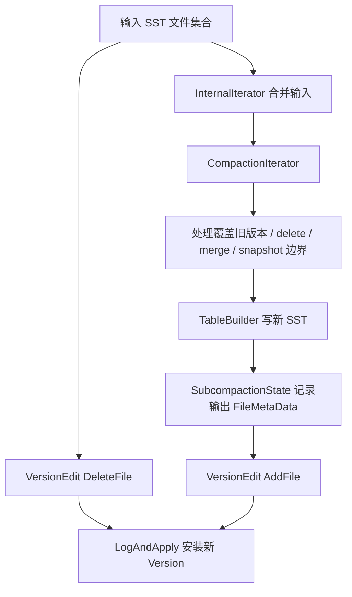

## 今日主题

- 主主题：`Compaction 基础机制`
- 副主题：`调度 / picker / CompactionJob / VersionEdit 提交`

## 学习目标

- 讲清 RocksDB 为什么需要 compaction。
- 讲清一个自动 compaction 从“被判定需要”到“后台执行”的主流程。
- 讲清 `CompactionPicker`、`Compaction`、`CompactionJob` 三者的职责边界。
- 讲清 compaction 输出的新 SST 如何通过 `VersionEdit -> LogAndApply` 进入新的 current `Version`。
- 把 Day 012 的 `MANIFEST / VersionEdit / VersionSet` 和后续 compaction 主线接起来。

## 前置回顾

Day 007 学过 flush：mutable memtable 切成 immutable memtable，后台 flush 生成 L0 SST，然后通过 `VersionEdit` 把新 SST 加入版本系统。

Day 012 学过 MANIFEST 和 VersionSet：文件集合变化不会直接“改 current Version 对象”，而是先写成 `VersionEdit`，再由 `VersionSet::LogAndApply(...)` 持久化并安装新的 current `Version`。

Compaction 正好站在这两条线之后：

`Flush 只负责把内存变成 SST；Compaction 负责持续整理这些 SST，让 LSM 不至于失控。`

## 源码入口

- `D:\program\rocksdb\db\db_impl\db_impl_compaction_flush.cc`
- `D:\program\rocksdb\db\column_family.h`
- `D:\program\rocksdb\db\column_family.cc`
- `D:\program\rocksdb\db\version_set.h`
- `D:\program\rocksdb\db\version_set.cc`
- `D:\program\rocksdb\db\compaction\compaction.h`
- `D:\program\rocksdb\db\compaction\compaction.cc`
- `D:\program\rocksdb\db\compaction\compaction_picker.h`
- `D:\program\rocksdb\db\compaction\compaction_picker.cc`
- `D:\program\rocksdb\db\compaction\compaction_picker_level.cc`
- `D:\program\rocksdb\db\compaction\compaction_picker_universal.cc`
- `D:\program\rocksdb\db\compaction\compaction_picker_fifo.cc`
- `D:\program\rocksdb\db\compaction\compaction_job.h`
- `D:\program\rocksdb\db\compaction\compaction_job.cc`
- `D:\program\rocksdb\db\compaction\subcompaction_state.h`
- `D:\program\rocksdb\db\compaction\clipping_iterator.h`
- `D:\program\rocksdb\db\compaction\compaction_outputs.cc`
- `D:\program\rocksdb\include\rocksdb\advanced_options.h`

## 它解决什么问题

LSM 的写入很便宜：数据先进入 memtable，再 flush 成 SST。代价是磁盘上会不断积累很多文件、很多层级、很多同一个 user key 的旧版本。

如果没有 compaction，会出现几个问题：

1. 读放大变大
   - L0 文件可能互相重叠，点查可能要看多个 SST。
   - 层级越多、文件越散，查找路径越长。
2. 空间放大变大
   - 老版本、delete tombstone、被覆盖 value 会长期留在 SST 中。
3. 写放大不可避免但需要受控
   - compaction 会重写数据，但它换来更低读放大和空间放大。
4. 文件元数据会失控
   - 每次 flush 只加文件，不删旧文件，MANIFEST 和 VersionStorageInfo 都会越来越重。

所以 compaction 的核心职责是：

- 选择一批输入 SST
- 合并、过滤、重写成新的输出 SST
- 删除旧输入文件的版本引用
- 把新输出文件加入版本系统
- 通过持续整理控制读放大、写放大、空间放大之间的平衡

一句话记忆：

`Compaction 是 LSM 的后台整理器：它用额外写入换取更可控的读路径和空间占用。`

## 它是怎么工作的

先看自动 compaction 的主链：


这张图里有三个关键切分点：

1. `VersionStorageInfo::ComputeCompactionScore(...)`
   - 判断每层是否超过阈值，或者是否存在 TTL、periodic、marked-for-compaction 等特殊触发。
2. `CompactionPicker`
   - 决定“这次具体 compact 哪些文件、输出到哪一层”。
3. `CompactionJob`
   - 真正读输入 SST，跑 iterator/merge/filter，写输出 SST，最后提交 `VersionEdit`。

再看数据面：



注意：compaction 不是原地修改 SST。SST 是不可变文件，compaction 的结果是“新文件集合替换旧文件集合”。

## 关键数据结构与实现点

### `VersionStorageInfo`

它保存某个 `Version` 的每层 SST 文件集合，也保存 compaction score。

`ComputeCompactionScore(...)` 会根据当前文件分布、配置和特殊触发条件，计算每层的 compaction 优先级。

### `CompactionPicker`

这是文件选择策略的抽象基类。不同 compaction style 有不同实现：

- `LevelCompactionPicker`
  - leveled compaction，围绕层级大小目标和重叠范围选择文件。
- `UniversalCompactionPicker`
  - universal compaction，围绕 sorted runs 和 size amplification 等目标选择文件。
- `FIFOCompactionPicker`
  - FIFO compaction，更多面向 TTL、总文件大小上限、温度变化等场景。

### `Compaction`

它是一次 compaction 的“计划对象”，包含：

- 输入 level 和输入文件
- 输出 level
- 输出文件大小目标
- compaction reason
- snapshot / bottommost / compression / blob GC 等上下文
- 用来提交版本变化的 `VersionEdit`

### `CompactionJob`

它是执行器，负责：

- 读取输入文件
- 创建输入 iterator
- 创建 `CompactionIterator`
- 写输出 SST
- 校验、同步、统计
- 通过 `InstallCompactionResults(...)` 提交结果

### `VersionEdit`

compaction 最终仍然回到 Day 012 的版本元数据主线：

- 对输入文件：`DeleteFile(level, file_number)`
- 对输出文件：`AddFile(level, FileMetaData)`
- 提交：`VersionSet::LogAndApply(...)`

## 源码细读

### 1. compaction score 是自动 compaction 的基础信号

```cpp
// db/version_set.cc + VersionStorageInfo::ComputeCompactionScore(...)
// 历史上，score 定义为某层实际字节数除以该层目标大小；
// 1.0 是触发 compaction 的阈值。score 越高，优先级越高。
for (int level = 0; level <= MaxInputLevel(); level++) {
  double score;
  if (level == 0) {
    int num_sorted_runs = 0;
    uint64_t total_size = 0;
    for (auto* f : files_[level]) {
      if (!f->being_compacted) {
        total_size += f->compensated_file_size;
        num_sorted_runs++;
      }
    }
    score = static_cast<double>(num_sorted_runs) /
            mutable_cf_options.level0_file_num_compaction_trigger;
    ...
  } else {
    uint64_t level_bytes_no_compacting = 0;
    for (auto f : files_[level]) {
      if (!f->being_compacted) {
        level_bytes_no_compacting += f->compensated_file_size;
      }
    }
    score = static_cast<double>(level_bytes_no_compacting) /
            MaxBytesForLevel(level);
  }
  compaction_level_[level] = level;
  compaction_score_[level] = score;
}
```

这里有一个很重要的边界：

- L0 主要看 sorted runs / file count，因为 L0 文件可以互相重叠，读放大会直接受文件数影响。
- L1+ 主要看该层大小和目标大小的比值，因为 leveled compaction 下同层文件通常不重叠，容量控制更关键。

这就是为什么很多调参会盯住：

- `level0_file_num_compaction_trigger`
- `max_bytes_for_level_base`
- `max_bytes_for_level_multiplier`
- `target_file_size_base`

### 2. `NeedsCompaction()` 把 score 和特殊触发统一成布尔判断

```cpp
// db/compaction/compaction_picker_level.cc + LevelCompactionPicker::NeedsCompaction(...)
if (!vstorage->ExpiredTtlFiles().empty()) {
  return true;
}
if (!vstorage->FilesMarkedForPeriodicCompaction().empty()) {
  return true;
}
if (!vstorage->FilesMarkedForCompaction().empty()) {
  return true;
}
for (int i = 0; i <= vstorage->MaxInputLevel(); i++) {
  if (vstorage->CompactionScore(i) >= 1) {
    return true;
  }
}
return false;
```

自动 compaction 不只是“层大小超了”。

它还可能来自：

- TTL 文件过期
- periodic compaction
- 文件被显式 marked for compaction
- blob garbage collection
- 底层文件因 snapshot 释放后可以继续清理

但主线仍是：`score >= 1` 表示这个 `VersionStorageInfo` 已经有 compaction debt。

### 3. 安装新 SuperVersion 后，会重新入队 compaction

```cpp
// db/db_impl/db_impl_compaction_flush.cc + DBImpl::InstallSuperVersionAndScheduleWork(...)
cfd->InstallSuperVersion(sv_context, &mutex_,
                         std::move(new_seqno_to_time_mapping));

...
// 每次安装新的 SuperVersion 后，都可能需要触发新的 flush 或 compaction。
EnqueuePendingCompaction(cfd);
MaybeScheduleFlushOrCompaction();
```

Day 012 里纠偏过一个点：`VersionSet::LogAndApply(...)` 只安装 current `Version`，不发布 `SuperVersion`。

这里正好补上另一半：

- compaction/flush 成功提交新 `Version`
- 外层 `DBImpl / ColumnFamilyData` 再安装新 `SuperVersion`
- 安装后重新判断是否还有 compaction 需要继续做

所以 compaction 是链式推进的：一次 compaction 结束后，可能让下一层超出目标大小，于是继续触发下一次 compaction。

### 4. pending compaction 先进入 CF 队列，再由后台线程调度

```cpp
// db/db_impl/db_impl_compaction_flush.cc + DBImpl::EnqueuePendingCompaction(...)
if (!cfd->queued_for_compaction() && cfd->NeedsCompaction()) {
  AddToCompactionQueue(cfd);
}
```

```cpp
// db/db_impl/db_impl_compaction_flush.cc + DBImpl::MaybeScheduleFlushOrCompaction(...)
while (bg_compaction_scheduled_ + bg_bottom_compaction_scheduled_ <
           bg_job_limits.max_compactions &&
       unscheduled_compactions_ > 0) {
  CompactionArg* ca = new CompactionArg;
  ca->db = this;
  ca->compaction_pri_ = Env::Priority::LOW;
  bg_compaction_scheduled_++;
  unscheduled_compactions_--;
  env_->Schedule(&DBImpl::BGWorkCompaction, ca, Env::Priority::LOW, this,
                 &DBImpl::UnscheduleCompactionCallback);
}
```

这里能看到两层调度：

- `EnqueuePendingCompaction(...)`
  - 把某个 CF 放进 `compaction_queue_`
- `MaybeScheduleFlushOrCompaction(...)`
  - 根据后台线程额度，把 compaction job 投递到 Env 的 LOW priority 线程池

这也说明 compaction 是 CF 粒度排队，但后台线程数量由 DB 级配置控制。

### 5. `ColumnFamilyData::PickCompaction()` 把选择工作交给 picker

```cpp
// db/column_family.cc + ColumnFamilyData::PickCompaction(...)
auto* result = compaction_picker_->PickCompaction(
    GetName(), mutable_options, mutable_db_options, existing_snapshots,
    snapshot_checker, current_->storage_info(), log_buffer,
    require_max_output_level);
if (result != nullptr) {
  result->FinalizeInputInfo(current_);
}
return result;
```

`ColumnFamilyData` 自己不决定选哪些文件。

它只提供：

- 当前 `VersionStorageInfo`
- mutable CF options
- snapshot context
- picker 实例

真正的选择策略由具体 `CompactionPicker` 实现。

### 6. `CompactionPicker` 是不同策略的统一抽象

```cpp
// db/compaction/compaction_picker.h + class CompactionPicker
// 每种 compaction style 都继承这个类，实现自动 compaction 的选择逻辑。
// 如果 NeedCompaction() 为 true，就调用 PickCompaction() 找出需要 compact
// 的文件，以及输出文件应该放到哪里。
class CompactionPicker {
 public:
  virtual Compaction* PickCompaction(
      const std::string& cf_name,
      const MutableCFOptions& mutable_cf_options,
      const MutableDBOptions& mutable_db_options,
      const std::vector<SequenceNumber>& existing_snapshots,
      const SnapshotChecker* snapshot_checker,
      VersionStorageInfo* vstorage,
      LogBuffer* log_buffer,
      bool require_max_output_level) = 0;

  virtual bool NeedsCompaction(const VersionStorageInfo* vstorage) const = 0;
};
```

这段注释给出了最清楚的职责边界：

- `NeedsCompaction()`
  - 判断有没有必要做
- `PickCompaction()`
  - 决定这次具体怎么做

对应到三个常见实现：

- `LevelCompactionPicker`
- `UniversalCompactionPicker`
- `FIFOCompactionPicker`

### 7. Level picker 的主流程：先选起点，再扩展输入

```cpp
// db/compaction/compaction_picker_level.cc + LevelCompactionBuilder::PickCompaction()
SetupInitialFiles();
if (start_level_inputs_.empty()) {
  return nullptr;
}

if (!SetupOtherL0FilesIfNeeded()) {
  return nullptr;
}

if (!SetupOtherInputsIfNeeded()) {
  return nullptr;
}

Compaction* c = GetCompaction();
return c;
```

Leveled compaction 不是随便拿一个文件就写到下一层。

它要处理几个问题：

- L0 文件可能互相重叠，所以 L0 compaction 可能要拉入更多 L0 文件。
- 输出层可能有重叠文件，所以要把 output level 的 overlapping inputs 也加入。
- 为了保持 clean cut，还可能继续扩展输入文件范围。

所以 picker 输出的 `Compaction` 已经是一个“可执行计划”，不是简单的单文件移动请求。

### 8. `Compaction` 是计划对象，里面自带待提交的 `VersionEdit`

```cpp
// db/compaction/compaction.h + class Compaction
class Compaction {
 public:
  int output_level() const { return output_level_; }

  VersionEdit* edit() { return &edit_; }

  Version* input_version() const { return input_version_; }

  FileMetaData* input(size_t compaction_input_level, size_t i) const {
    return inputs_[compaction_input_level][i];
  }

  void AddInputDeletions(VersionEdit* edit);
};
```

`Compaction` 不是执行线程，也不是输出文件本身。

它记录的是：

- 哪些文件作为输入
- 输出要去哪个 level
- 这次提交时要用哪个 `VersionEdit`

这和 Day 012 的结论能接上：所有版本变化最后仍然要落到 `VersionEdit` 上。

### 9. 普通 compaction 会创建 `CompactionJob`，解锁后跑真正 I/O

```cpp
// db/db_impl/db_impl_compaction_flush.cc + DBImpl::BackgroundCompaction(...)
CompactionJob compaction_job(
    job_context->job_id, c.get(), immutable_db_options_,
    mutable_db_options_, file_options_for_compaction_, versions_.get(),
    &shutting_down_, log_buffer, directories_.GetDbDir(),
    GetDataDir(c->column_family_data(), c->output_path_id()),
    GetDataDir(c->column_family_data(), 0), stats_, &mutex_,
    &error_handler_, job_context, table_cache_, &event_logger_, ...);
compaction_job.Prepare(std::nullopt);

mutex_.Unlock();
compaction_job.Run().PermitUncheckedError();
mutex_.Lock();

status = compaction_job.Install(&compaction_released);
```

这里非常关键：

- `PickCompaction()` 发生在 DB mutex 保护下。
- 真正读 SST、写 SST 的 `Run()` 会释放 DB mutex。
- 写完后重新拿锁，调用 `Install()` 提交版本变化。

这就是后台任务常见边界：

- 选计划和提交结果要持锁
- 重 I/O 执行不能长时间持 DB mutex

### 10. `CompactionJob::Run()` 负责生成和校验输出 SST

```cpp
// db/compaction/compaction_job.cc + CompactionJob::Run()
InitializeCompactionRun();

RunSubcompactions();

Status status = CollectSubcompactionErrors();
if (status.ok()) {
  status = SyncOutputDirectories();
}
if (status.ok()) {
  status = VerifyOutputFiles();
}
if (status.ok()) {
  SetOutputTableProperties();
}

AggregateSubcompactionOutputAndJobStats();
FinalizeCompactionRun(status, stats_built_from_input_table_prop,
                      num_input_range_del);
return status;
```

这一段说明 `Run()` 是数据面工作：

- 跑 subcompaction
- 写输出文件
- sync 输出目录
- 校验输出文件
- 收集 table properties 和统计

但它还没有把新文件加入 current `Version`。真正提交在 `Install()`。

### 11. `ProcessKeyValueCompaction()` 是 key/value 重写主循环入口

```cpp
// db/compaction/compaction_job.cc + CompactionJob::ProcessKeyValueCompaction(...)
InternalIterator* input_iter = CreateInputIterator(
    sub_compact, cfd, iterators, boundaries, read_options);

MergeHelper merge(
    env_, cfd->user_comparator(), cfd->ioptions().merge_operator.get(),
    compaction_filter, db_options_.info_log.get(),
    false /* internal key corruption is expected */,
    job_context_->GetLatestSnapshotSequence(), job_context_->snapshot_checker,
    compact_->compaction->level(), db_options_.stats);

auto c_iter =
    CreateCompactionIterator(sub_compact, cfd, input_iter, compaction_filter,
                             merge, blob_resources, write_options);
```

这里先不展开 `CompactionIterator` 的全部细节，但要先建立边界：

- `input_iter`
  - 把多个输入 SST 形成一个 internal key 流。
- `CompactionIterator`
  - 根据 snapshot、delete、merge、compaction filter、range tombstone 等规则决定哪些 key/value 应该输出。
- `TableBuilder`
  - 把保留下来的 key/value 写成新的 SST。

这也解释了为什么 Day 010 的 snapshot 会影响 compaction：compaction 不能随便删除仍可能被旧 snapshot 读到的旧版本。

### 12. 输出文件先变成 `FileMetaData`，再进入 `VersionEdit`

```cpp
// db/compaction/subcompaction_state.h + SubcompactionState::AddOutputsEdit(...)
void AddOutputsEdit(VersionEdit* out_edit) const {
  for (const auto& file : proximal_level_outputs_.outputs_) {
    out_edit->AddFile(compaction->GetProximalLevel(), file.meta);
  }
  for (const auto& file : compaction_outputs_.outputs_) {
    out_edit->AddFile(compaction->output_level(), file.meta);
  }
}
```

compaction 输出 SST 后，不是直接把文件塞进 current version。

它先把输出文件的 `FileMetaData` 加到 `VersionEdit` 中。

这和 flush 的完成方式一致：SST 文件本体先存在于磁盘上，真正让它进入可见版本的是 MANIFEST 里的元数据提交。

### 13. 安装结果时，DeleteFile 和 AddFile 一起提交

```cpp
// db/compaction/compaction_job.cc + CompactionJob::InstallCompactionResults(...)
VersionEdit* const edit = compaction->edit();

// Add compaction inputs
compaction->AddInputDeletions(edit);

for (const auto& sub_compact : compact_->sub_compact_states) {
  sub_compact.AddOutputsEdit(edit);
}

return versions_->LogAndApply(compaction->column_family_data(), read_options,
                              write_options, edit, db_mutex_, db_directory_,
                              /*new_descriptor_log=*/false,
                              /*column_family_options=*/nullptr,
                              manifest_wcb);
```

这就是 compaction 和 Day 012 的最终接口：

- 输入旧文件：`DeleteFile`
- 输出新文件：`AddFile`
- 原子提交：`LogAndApply`

如果这一步没有成功，那么输出 SST 即使已经写出来，也不能算进入了 RocksDB 的 current version。

### 14. trivial move 是 metadata-only compaction

```cpp
// db/db_impl/db_impl_compaction_flush.cc + DBImpl::PerformTrivialMove(...)
for (unsigned int l = 0; l < c.num_input_levels(); l++) {
  if (c.level(l) == c.output_level()) {
    continue;
  }
  for (size_t i = 0; i < c.num_input_files(l); i++) {
    FileMetaData* f = c.input(l, i);
    c.edit()->DeleteFile(c.level(l), f->fd.GetNumber());
    c.edit()->AddFile(c.output_level(), f->fd.GetNumber(), f->fd.GetPathId(),
                      f->fd.GetFileSize(), f->smallest, f->largest, ...);
  }
}

Status status = versions_->LogAndApply(
    c.column_family_data(), read_options, write_options, c.edit(), &mutex_,
    directories_.GetDbDir(), /*new_descriptor_log=*/false, ...);
```

不是所有 compaction 都重写 SST。

如果某个文件可以安全地从一层移动到另一层，且不需要和其他文件合并，RocksDB 可以做 trivial move：

- 不读写 SST data
- 只通过 `VersionEdit` 把文件从旧 level 删除、在新 level 添加

这是 compaction 中很重要的优化：能不重写数据时，就只改元数据。

## 今日问题与讨论

### 我的问题

**问题：`VersionStorageInfo::ComputeCompactionScore(...)` 计算是否需要 compaction 的主要逻辑是什么？为什么？compaction 作为后台任务，触发逻辑、后台任务入口和生命周期在哪里？**

- 简答：
  - `ComputeCompactionScore(...)` 本身不调度后台任务，也不选择具体文件；它给当前 `VersionStorageInfo` 计算“每层 compaction debt / 优先级”。
  - 核心阈值仍然是 `score >= 1`：高于 1 表示该层或该 compaction style 下已经有自动 compaction 债务。
  - L0 特殊：主要按 sorted runs / 文件数除以 `level0_file_num_compaction_trigger`，因为 L0 文件范围可能重叠，读放大更直接受文件数影响。
  - L1+ 主要按“未处于 compaction 中的层大小”除以该层目标大小 `MaxBytesForLevel(level)`，因为 leveled compaction 下 L1+ 的主要约束是层级容量形状。
  - 计算完 score 后，还会更新 TTL、periodic compaction、marked-for-compaction、bottommost marked、forced blob GC 等特殊触发集合。
  - 后台生命周期是：新 `Version` 计算 score -> 安装 `SuperVersion` 后入队 pending compaction -> `MaybeScheduleFlushOrCompaction()` 投递后台线程 -> `BackgroundCompaction()` pick 计划 -> `CompactionJob::Run()` 执行重 I/O -> `Install()` 用 `VersionEdit / LogAndApply` 提交 -> 再安装新 `SuperVersion` 并继续检查下一轮。
- 源码依据：
  - `D:\program\rocksdb\db\version_set.cc`
    - `VersionSet::AppendVersion(...)`：新 `Version` append 前调用 `ComputeCompactionScore(...)`。
    - `VersionStorageInfo::ComputeCompactionScore(...)`：计算 L0、L1+、dynamic level、FIFO/universal 相关 score，并维护特殊触发集合。
  - `D:\program\rocksdb\db\column_family.cc`
    - `ColumnFamilyData::NeedsCompaction()`：先检查 `disable_auto_compactions`，再委托 `compaction_picker_->NeedsCompaction(current_->storage_info())`。
    - `ColumnFamilyData::PickCompaction(...)`：委托 picker 选择具体 compaction 计划。
  - `D:\program\rocksdb\db\compaction\compaction_picker_level.cc`
    - `LevelCompactionPicker::NeedsCompaction(...)`：TTL、periodic、marked、forced blob GC、以及各层 `CompactionScore(i) >= 1` 都能触发。
    - `LevelCompactionBuilder::PickCompaction(...)`：先选起点，再处理 L0 其他文件、output level overlapping inputs 和 clean cut。
  - `D:\program\rocksdb\db\db_impl\db_impl_compaction_flush.cc`
    - `InstallSuperVersionAndScheduleWork(...)`：安装新 `SuperVersion` 后调用 `EnqueuePendingCompaction(cfd)` 和 `MaybeScheduleFlushOrCompaction()`。
    - `EnqueuePendingCompaction(...)`：若 CF 未入队且 `cfd->NeedsCompaction()` 为真，则放进 compaction queue。
    - `MaybeScheduleFlushOrCompaction(...)`：在后台 job 额度允许时，把 `DBImpl::BGWorkCompaction` 投递到 `Env::Priority::LOW`。
    - `BackgroundCompaction(...)`：从队列取 CF、调用 `PickCompaction(...)`、构造 `CompactionJob`、释放 DB mutex 跑 `Run()`、重新拿锁后 `Install()`。
  - `D:\program\rocksdb\db\compaction\compaction_job.cc`
    - `CompactionJob::Run()`：执行 subcompaction、写输出 SST、sync、verify、统计。
    - `CompactionJob::InstallCompactionResults(...)`：把输入文件删除和输出文件添加写入 `VersionEdit`，再调用 `VersionSet::LogAndApply(...)`。
- 当前结论：
  - 这条链路要分四层理解：
    - `ComputeCompactionScore`：当前版本有没有债务、哪层更急。
    - `NeedsCompaction`：这个 CF 是否应该入队。
    - `PickCompaction`：这一次具体 compact 哪些文件、输出到哪层。
    - `CompactionJob`：真正读旧 SST、写新 SST、提交版本元数据。
  - RocksDB 这样拆，是为了把“判断压力”“策略选择”“后台 I/O 执行”“MANIFEST 原子提交”隔离开。判断和提交需要短时间持 DB mutex；重 I/O 不能长期持锁。
- 是否需要后续回看：
  - `需要`
  - Day 014 学 `Leveled Compaction` 时重点回看：L0 score、base level、L0 -> LBase、overlap expansion、clean cut 这些策略细节。

**问题：compaction 和 flush 在版本提交上有什么共同点？**

- 简答：
  - 两者都先生成 SST 文件，再通过 `VersionEdit -> LogAndApply` 提交元数据。
  - flush 的 `VersionEdit` 主要是 `AddFile(L0, new_sst)`，并推进 log number/WAL 边界。
  - compaction 的 `VersionEdit` 同时包含 `DeleteFile(old_inputs)` 和 `AddFile(new_outputs)`。
- 源码依据：
  - `D:\program\rocksdb\db\memtable_list.cc`
  - `D:\program\rocksdb\db\compaction\compaction_job.cc`
  - `D:\program\rocksdb\db\version_set.cc`
- 当前结论：
  - flush 是“内存态变 SST”；compaction 是“SST 集合重写成新的 SST 集合”。
  - 但两者进入 current `Version` 的方式是一致的：都走 MANIFEST 版本提交。
- 是否需要后续回看：
  - `需要`
  - 到 `CompactionIterator` 时继续看 compaction 如何决定丢弃旧版本和 tombstone。

**问题：一次 compaction 的触发时机是什么？是否任何导致 Version 变更的时机都会触发？常见优化有哪些？如果 L0 文件过多且存在重叠，RocksDB 如何尽量减少写放大？**

- 简答：
  - “触发 compaction”要分成两层：
    - 触发一次检查 / 调度机会：新 `Version` append 时会重新计算 compaction score；安装新 `SuperVersion` 后会尝试 `EnqueuePendingCompaction(...)` 和 `MaybeScheduleFlushOrCompaction()`。
    - 真正入队执行：必须满足 `ColumnFamilyData::NeedsCompaction()`，也就是没有禁用自动 compaction，并且 picker 认为当前 `VersionStorageInfo` 真的有 compaction debt 或特殊触发。
  - 所以不是“任何 Version 变更都一定会 compact”。Flush、compaction 完成、ingest external file、删除范围元数据变化、周期任务、snapshot 释放后标记 bottommost 文件等路径，可能带来新 `Version / SuperVersion` 或重新计算 score，于是会检查 compaction；但如果 `NeedsCompaction()` 为假、后台 compaction 暂停、DB 正在 shutdown、后台 job 额度不够、或者有 exclusive manual compaction 冲突，就不会立刻调度普通自动 compaction。
  - 新增 CF 或一次很小的版本变化本身不等于 compaction。它最多提供一次“重新看当前形状”的机会；真正触发仍取决于 score、TTL、periodic、marked-for-compaction、blob GC、bottommost marked 等条件。
  - 常见优化可以分几类：
    - `trivial move`：如果文件可以安全从一层移动到另一层，RocksDB 只改 `VersionEdit` 元数据，不重写 SST data。
    - `subcompaction`：把一次大的 compaction 按 user key range 切成多个并行分片，降低墙钟时间；它主要优化耗时，不直接减少总写放大。
    - `clean cut / overlap expansion`：把同一个 user key 边界相关的文件一起拉入，保证不会把同一 user key 的 internal key 版本切散到不一致的 compaction 中。
    - `compaction_pri`：默认 `kMinOverlappingRatio` 倾向选择与下一层重叠代价较小的文件，减少未来写放大压力。
    - `intra-L0 compaction`：当 L0 文件太多，或者 L0 相对 LBase 很小而 LBase 很大，直接 L0 -> LBase 会产生很高写放大时，RocksDB 可以先做 L0 -> L0，把多个 L0 文件合并成更少的 L0 文件，降低读放大，并避免立刻把巨大的 LBase 重写一遍。
  - 对“subcompaction 要求 range 不重合，如果 level + 1 指向同一个 SST 怎么办”的理解要修正：
    - subcompaction 要求的是各子任务的输出 key range 不重叠，不要求它们读到的输入文件集合完全不相交。
    - 如果多个 subcompaction 都需要读同一个不可变 SST，可以各自通过边界和 `ClippingIterator` 只消费自己的 `[start, end)` 范围。这样可能有重复打开或重复扫描的成本，但不会破坏正确性；最终所有子任务的输出仍由同一个 `VersionEdit` 一次性提交。
  - L0 过多且重叠时，不能幻想完全无写放大。RocksDB 的策略更像是分层止损：
    - 能 trivial move 的先 metadata-only move。
    - 能做低成本 L0 -> LBase 的做正常 leveled compaction。
    - L0 -> LBase 代价太高或 L0 compaction 被阻塞时，做 intra-L0，先把 L0 文件数压下来。
    - 如果后台追不上，`level0_slowdown_writes_trigger` 和 `level0_stop_writes_trigger` 会通过写降速 / 写停止保护系统，给后台整理让路。
- 源码依据：
  - `D:\program\rocksdb\db\version_set.cc`
    - `VersionSet::AppendVersion(...)`：新 `Version` append 前计算 compaction score。
    - `VersionStorageInfo::ComputeCompactionScore(...)`：L0 按 sorted runs / 文件数和部分 size 因子计算；L1+ 按层大小与目标大小计算；最后维护 TTL、periodic、marked、forced blob GC 等集合。
  - `D:\program\rocksdb\db\column_family.cc`
    - `ColumnFamilyData::NeedsCompaction()`：`!disable_auto_compactions && compaction_picker_->NeedsCompaction(...)`。
  - `D:\program\rocksdb\db\db_impl\db_impl_compaction_flush.cc`
    - `InstallSuperVersionAndScheduleWork(...)`：每次安装新 `SuperVersion` 后尝试入队和调度。
    - `EnqueuePendingCompaction(...)`：只有 CF 未入队且 `NeedsCompaction()` 为真才 `AddToCompactionQueue(...)`。
    - `MaybeScheduleFlushOrCompaction(...)`：根据后台 job 限额、暂停状态、错误状态、shutdown、manual compaction 冲突等条件决定是否投递 `BGWorkCompaction`。
    - `BackgroundCompaction(...)`：`IsTrivialMove()` 时走 `PerformTrivialMove(...)`，否则构造并运行 `CompactionJob`。
  - `D:\program\rocksdb\db\compaction\compaction.cc`
    - `Compaction::IsTrivialMove()`：检查 L0 重叠、manual compaction filter、同层移动、temperature change、compression/path、grandparent overlap 等约束。
  - `D:\program\rocksdb\db\compaction\compaction_picker_level.cc`
    - `TryPickL0TrivialMove()`：从较老 L0 文件开始尝试无重叠的 L0 trivial move。
    - `SetupOtherL0FilesIfNeeded()`：L0 -> base level 时，必要时拉入重叠 L0 文件。
    - `PickFileToCompact()`：如果已有 L0 compaction 在跑，普通 L0 compaction 不能并发选择，但仍可能尝试 size-based intra-L0。
    - `PickIntraL0Compaction()`：L0 文件数明显超过触发阈值时，选择 L0 -> L0。
    - `PickSizeBasedIntraL0Compaction()`：显式注释为避免低效高写放大的 L0 -> LBase compaction。
  - `D:\program\rocksdb\db\compaction\compaction_picker.cc`
    - `FindIntraL0Compaction(...)`：选择从较新的 L0 文件开始的一段文件，要求 work-per-deleted-file 不继续变差，并受 `max_compaction_bytes` 约束。
  - `D:\program\rocksdb\db\compaction\compaction_job.cc`
    - `GenSubcompactionBoundaries()`：基于 TableReader anchor 估算 key range，并生成 subcompaction 边界。
    - `Prepare(...)`：根据边界创建多个 `SubcompactionState`。
    - `CreateInputIterator(...)`：对带边界的 subcompaction 包一层 `ClippingIterator`。
    - `RunSubcompactions()`：多个 subcompaction 并行执行，最后 join。
  - `D:\program\rocksdb\db\compaction\clipping_iterator.h`
    - `ClippingIterator` 保证底层 iterator 返回的 key 严格落在 `[start, end)`。
  - `D:\program\rocksdb\include\rocksdb\options.h`
    - `level0_file_num_compaction_trigger` 默认 4。
    - `max_background_jobs` 控制 flush / compaction 后台 job 数。
    - `max_subcompactions` 默认 1，表示默认不拆 subcompaction。
  - `D:\program\rocksdb\include\rocksdb\advanced_options.h`
    - `level0_slowdown_writes_trigger` 默认 20。
    - `level0_stop_writes_trigger` 默认 36。
    - `compaction_pri` 默认 `kMinOverlappingRatio`。
- 当前结论：
  - compaction 的触发不是一个点，而是一条链：`Version 形状变化 / 周期或特殊标记 -> ComputeCompactionScore -> NeedsCompaction -> 入 CF compaction_queue_ -> 后台线程额度允许 -> PickCompaction -> CompactionJob / trivial move`。
  - L0 是 leveled compaction 里最特殊的一层：它的文件可以重叠，所以普通 L0 -> LBase 往往要拉入更多 L0 文件和下一层重叠文件。RocksDB 用 trivial move、intra-L0、选择低重叠文件、subcompaction 并行、以及必要时写降速，来控制读放大、写放大和后台耗时的平衡。
- 是否需要后续回看：
  - `需要`
  - Day 014 进入 `Leveled Compaction` 时继续细拆 base level、L0 -> LBase、clean cut、grandparent overlap、`kMinOverlappingRatio` 的文件选择细节。

**问题：compaction 的触发或者说检查时机都在哪些？同一个 CF 上多个 compaction 可以并发时，如何保证安全？**

- 简答：
  - 当前源码里要把“检查”和“调度”分开看：
    - `ComputeCompactionScore(...)`：重新计算当前 `VersionStorageInfo` 的 compaction debt。
    - `EnqueuePendingCompaction(cfd)`：如果 `cfd->NeedsCompaction()` 为真，把 CF 放入 `compaction_queue_`。
    - `MaybeScheduleFlushOrCompaction()`：如果已有 unscheduled compaction，并且后台额度、暂停状态、错误状态都允许，就投递 `BGWorkCompaction`。
  - 主要检查 / 入队时机可以分成这些类：
    - 新 `Version` 形成时：`VersionSet::AppendVersion(...)` 会对新 `Version` 调 `ComputeCompactionScore(...)`。所有走 `LogAndApply` 安装新版本的路径都会受这个影响。
    - 新 `SuperVersion` 安装后：`InstallSuperVersionAndScheduleWork(...)` 会调用 `EnqueuePendingCompaction(cfd)` 和 `MaybeScheduleFlushOrCompaction()`。flush 成功、compaction 成功、trivial move 成功、manual compaction / CompactFiles 成功、external SST ingestion、`DeleteFilesInRange`、`PromoteL0`、dummy edit 保护 file number、配置变化安装新 SV、memtable switch 等都会走到这里的一部分路径。
    - pick 出一次 compaction 后：`BackgroundCompaction(...)` 里会再次 `EnqueuePendingCompaction(cfd)`。原因是刚 pick 的输入文件已经被标成 `being_compacted`，score 会跳过这些文件；如果剩余文件仍然有 compaction debt，就可以继续排同一个 CF 的另一次 compaction。
    - 空间不足导致 compaction 计划放弃时：`EnoughRoomForCompaction(...)` 失败后会释放本次 compaction、重新算 score、再次 `EnqueuePendingCompaction(cfd)`。
    - snapshot 释放时：`ReleaseSnapshot(...)` 会更新 oldest snapshot。如果一些 bottommost 文件或 standalone range tombstone 文件因为最老 snapshot 前移而可以继续整理，就会把对应 CF 入队。
    - periodic compaction 定时任务：`TriggerPeriodicCompaction()` 会对开启 `periodic_compaction_seconds` 的 CF 重新算 score 并尝试入队。
    - 用户显式建议 compact：`SuggestCompactRange(...)` 会把重叠文件 `marked_for_compaction = true`，重新算 score，然后入队。
    - 错误恢复 / 后台恢复后：`RecoverFromBackgroundError(...)` 成功后会遍历所有 CF，重新 `EnqueuePendingCompaction(cfd)` 并调度。
    - DB open 后和后台工作恢复后：`DBImpl::Open(...)`、`ContinueBackgroundWork()`、manual compaction 解除阻塞、后台 compaction 结束、后台 job 数量或 offpeak 配置变化等路径会调用 `MaybeScheduleFlushOrCompaction()`。这些调用不一定重新检查某个 CF，但会把已经存在的 `unscheduled_compactions_` 继续投递出去。
    - 写路径触发 flush request 后：WAL 满、write buffer 满、WriteBufferManager 触发、用户 Flush、外部 memtable ingestion 等会 `MaybeScheduleFlushOrCompaction()`。这类调用主要是调度 flush；但如果之前已有 pending compaction，也会一起尝试调度。
  - 同一个 CF 不是全局串行 compaction。RocksDB 允许同一 CF 上多个 compaction 并发，前提是 picker 认为它们不冲突。安全性主要靠下面几层：
    - DB mutex 保护 pick 和 install：选择 compaction 计划、修改 `being_compacted`、注册 running compaction、提交 `VersionEdit` 都在 DB mutex 保护下；真正重 I/O 的 `CompactionJob::Run()` 会释放 DB mutex。
    - 输入文件互斥：`Compaction` 构造时调用 `MarkFilesBeingCompacted(true)`，后续 picker 通过 `AreFilesInCompaction(...)` 跳过这些文件，避免两个 compaction 重写同一个输入 SST。
    - L0 特殊限制：普通 L0 compaction 因为范围可能重叠，通常不能并发；`PickFileToCompact()` 和 picker 里的 `level0_compactions_in_progress_` 会限制它。但某些 intra-L0 或已证明范围安全的情况仍可能被特殊处理。
    - 输出范围互斥：`FilesRangeOverlapWithCompaction(...)` 会检查新 compaction 的输出 level / proximal level key range 是否和正在运行的 compaction 输出范围重叠。如果重叠，就不能 pick。
    - clean cut 扩展：`ExpandInputsToCleanCut(...)` 会把同一个 user key 边界相关文件一起拉入；如果扩展后碰到正在 compaction 的文件，就放弃本次计划。
    - `Version` / CF 生命周期 pin：`Compaction::FinalizeInputInfo(...)` 会 `Ref()` input `Version` 和 `ColumnFamilyData`；compaction 执行期间，即使前台读写安装了新版本，旧输入版本和文件元数据也不会被释放。
    - SST 不可变：并发 compaction 只读旧 SST、写新 SST，不会原地修改同一个 SST。
    - 统一版本提交：完成后用 `VersionEdit` 表达输入 `DeleteFile(...)` 和输出 `AddFile(...)`，再通过 `VersionSet::LogAndApply(...)` 串行安装新 `Version`。
- 源码依据：
  - `D:\program\rocksdb\db\version_set.cc`
    - `VersionSet::AppendVersion(...)`
    - `VersionStorageInfo::ComputeCompactionScore(...)`
  - `D:\program\rocksdb\db\db_impl\db_impl_compaction_flush.cc`
    - `InstallSuperVersionAndScheduleWork(...)`
    - `EnqueuePendingCompaction(...)`
    - `MaybeScheduleFlushOrCompaction(...)`
    - `BackgroundCompaction(...)`
  - `D:\program\rocksdb\db\db_impl\db_impl.cc`
    - `ReleaseSnapshot(...)`
    - `TriggerPeriodicCompaction(...)`
    - `DeleteFilesInRange(...)`
    - external SST ingestion / config change / recovery 相关路径
  - `D:\program\rocksdb\db\db_impl\db_impl_write.cc`
    - write buffer / WAL / memtable switch 触发 flush 与 SV 安装的路径
  - `D:\program\rocksdb\db\db_impl\db_impl_experimental.cc`
    - `SuggestCompactRange(...)`
    - `PromoteL0(...)`
  - `D:\program\rocksdb\db\compaction\compaction.cc`
    - `Compaction::FinalizeInputInfo(...)`
    - `Compaction::MarkFilesBeingCompacted(...)`
    - `Compaction::ReleaseCompactionFiles(...)`
  - `D:\program\rocksdb\db\compaction\compaction_picker.cc`
    - `RegisterCompaction(...)`
    - `UnregisterCompaction(...)`
    - `AreFilesInCompaction(...)`
    - `FilesRangeOverlapWithCompaction(...)`
  - `D:\program\rocksdb\db\compaction\compaction_picker_level.cc`
    - L0 并发限制、clean cut、L0 / L1+ 文件选择逻辑。
- 当前结论：
  - RocksDB 的并发 compaction 模型不是“一个 CF 一个 compaction”，而是“一个 CF 内允许多个互不冲突的 compaction”。冲突定义主要围绕两件事：不能共享输入文件，不能在同一输出层 / proximal level 写重叠 key range。
  - pick 和 install 串行，重 I/O 并行；SST 不可变，输入版本被 pin；这几件事组合起来保证同 CF 并发 compaction 的安全。
- 是否需要后续回看：
  - `需要`
  - Day 014 继续看 `FilesRangeOverlapWithCompaction(...)`、`ExpandInputsToCleanCut(...)`、L0 compaction 并发限制和 `kMinOverlappingRatio` 如何减少未来写放大。

**问题：sorted runs 是什么？**

- 简答：
  - `sorted run` 可以理解为“一个内部已经按 key 排好序、但和其他 run 之间还没有完全归并的有序数据段”。
  - 在 LSM 里，每次 flush 出来的 SST 内部都是有序的，所以它本身就是一个 sorted run。但 L0 的多个 SST key range 可能互相重叠，因此读的时候往往要把多个 L0 文件一起 merge，这些文件就表现为多个 sorted runs。
  - 在 leveled compaction 的 L0 score 里，源码用 `num_sorted_runs++` 统计 L0 中未在 compaction 的文件数。这里可以近似记成：`L0 sorted runs 数量 ~= L0 文件数`。
  - L1+ 在 leveled compaction 下同层文件通常不重叠，所以点查不会像 L0 那样必须把同层多个文件都当成独立 run 去 merge；因此 L1+ 的 score 主要看层大小，而不是 sorted run 数。
  - 在 universal compaction 里，`sorted run` 是更核心的概念：L0 的每个文件是一个 sorted run；每个非空的非 L0 level 也会整体作为一个 sorted run 参与 universal picker 的判断。`level0_file_num_compaction_trigger` 在 universal 下也被解释为控制 sorted runs 数量的触发阈值。
- 源码依据：
  - `D:\program\rocksdb\db\version_set.cc`
    - `VersionStorageInfo::ComputeCompactionScore(...)`：L0 中每个未处于 compaction 的文件都会让 `num_sorted_runs++`。
    - universal style 下，会把非空的 L1+ level 也“像 L0 文件一样”加入 `num_sorted_runs`。
    - `GenerateLevel0NonOverlapping()`：专门检查 L0 文件 key range 是否互不重叠，说明 L0 默认不能假设同层无重叠。
  - `D:\program\rocksdb\db\compaction\compaction_picker_universal.cc`
    - `UniversalCompactionBuilder::CalculateSortedRuns(...)`：L0 每个文件 `emplace_back` 一个 sorted run；非 L0 每个非空 level 聚合成一个 sorted run。
  - `D:\program\rocksdb\include\rocksdb\options.h`
    - `level0_file_num_compaction_trigger` 的注释说明 universal compaction 会尝试把 sorted runs 数量控制在这个阈值附近。
- 当前结论：
  - `sorted run` 不是 RocksDB 独有的新文件类型，而是 compaction / read amplification 视角下的逻辑单位。
  - 对 Day 013 当前主线，先记住两句话就够：
    - leveled 下看 L0：一个 L0 SST 基本就是一个 sorted run。
    - universal 下看全局：每个 L0 SST 和每个非空 L1+ level 都可能作为一个 sorted run。
- 是否需要后续回看：
  - `需要`
  - Day 014 讲 L0 特殊性和 Day 015 讲 Universal Compaction 时继续回看。

**问题：subcompaction 是什么？和 compaction 有什么区别？它是不是 compaction 真正实际操作的部分？**

- 简答：
  - `Compaction` 是一次 compaction 的全局计划：选中了哪些输入文件、从哪个 level 到哪个 output level、使用什么 compression、reason、snapshot context 等。
  - `CompactionJob` 是执行这次计划的 job，通常走 `Prepare() -> Run() -> Install()`。
  - `SubcompactionState` 是 `CompactionJob` 在执行阶段把同一个 compaction 按 user key range 切出来的子任务状态。多个 subcompaction 的 key range 互不重叠，可以并行跑。
  - 所以 subcompaction 不是另一次独立 compaction。它没有独立的 `VersionEdit` 提交，也不会独立安装 `Version`。它只是同一个 `CompactionJob` 内部的并行执行分片。
  - 你的直觉基本正确：真正扫描输入 iterator、跑 `CompactionIterator`、写输出 SST 的主循环，是在 `ProcessKeyValueCompaction(SubcompactionState*)` 里按 subcompaction 执行的。但最终结果仍由外层 `CompactionJob::InstallCompactionResults(...)` 统一聚合和提交。
- 源码依据：
  - `D:\program\rocksdb\db\compaction\compaction_job.h`
    - 文件注释直接说明：每个自动或手动 compaction 对应一个 `CompactionJob`，必要时会把 compaction 分成多个 subcompactions 并并行执行。
  - `D:\program\rocksdb\db\compaction\compaction.cc`
    - `Compaction::ShouldFormSubcompactions()` 决定当前 compaction 是否应该拆成 subcompaction。默认 `max_subcompactions = 1` 时不会拆；leveled 下常见是 L0 或 manual compaction 输出到非 L0 时才拆；universal 也有自己的条件。
  - `D:\program\rocksdb\db\compaction\compaction_job.cc`
    - `CompactionJob::Prepare(...)`：如果允许拆分，先 `GenSubcompactionBoundaries()` 生成边界，再为每个 `[start, end)` user key range 创建一个 `SubcompactionState`。如果没有边界，就创建一个覆盖全范围的单个 subcompaction。
    - `CompactionJob::GenSubcompactionBoundaries()`：通过 TableReader 估算 input file 的 anchor points，按近似数据量把输入 key space 切成若干段。
    - `CompactionJob::RunSubcompactions()`：为第 2 个到最后一个 subcompaction 起线程，第 1 个 subcompaction 在当前线程跑，然后 join 等待全部结束。
    - `CompactionJob::ProcessKeyValueCompaction(...)`：每个 subcompaction 创建自己的 input iterator、range tombstone aggregator、`CompactionIterator`、输出文件 handler，然后进入 key/value 重写主循环。
    - `CompactionJob::ProcessKeyValue(...)`：循环读取 `CompactionIterator` 的输出，并调用 `sub_compact->AddToOutput(...)` 写入对应输出文件。
    - `CompactionJob::InstallCompactionResults(...)`：先对整个 compaction 的输入文件 `AddInputDeletions(edit)`，再遍历所有 `sub_compact_states`，把每个 subcompaction 的输出文件加入同一个 `VersionEdit`。
  - `D:\program\rocksdb\db\compaction\subcompaction_state.h`
    - `SubcompactionState` 持有 `start/end` 边界、status、sub job id、该子范围的输出文件集合和统计信息。
    - `AddOutputsEdit(...)` 把该 subcompaction 产生的输出文件加入外层 `VersionEdit`。
  - `D:\program\rocksdb\db\compaction\compaction_state.h`
    - `CompactionState` 是整个 compaction job 的运行状态，内部保存有序的 `std::vector<SubcompactionState>`，并负责聚合统计。
  - `D:\program\rocksdb\db\compaction\compaction_outputs.cc`
    - `CompactionOutputs::AddToOutput(...)` 才真正把 `CompactionIterator` 当前 key/value 写进 `TableBuilder`，必要时切换输出 SST。
- 当前结论：
  - 可以把它们记成四层：
    - `Compaction`：一次整理的计划。
    - `CompactionJob`：执行计划的后台 job。
    - `SubcompactionState`：同一个 job 里的 key range 分片执行状态。
    - `CompactionIterator + CompactionOutputs`：每个分片内部真正决定输出什么、写到哪些 SST。
  - subcompaction 主要是并行化手段：把一次大的 compaction 按 key range 切开，让多个线程同时处理不同范围，降低单次 compaction 的墙钟时间。
  - 但最终版本语义仍然是 compaction 级别的：所有 subcompaction 输出一起形成这次 compaction 的 `AddFile(...)` 集合，再和输入文件的 `DeleteFile(...)` 一起通过一个 `VersionEdit -> LogAndApply` 提交。
- 是否需要后续回看：
  - `需要`
  - Day 014 讲 `Leveled Compaction` 时回看它如何决定可拆分范围；后续讲 `CompactionIterator` 时再看每个 subcompaction 内部如何按 snapshot、delete、merge、range tombstone 产生输出。

### 外部高价值问题

- 本章没有引入外部问题。
- 原因：
  - Day 013 的目标是先建立本地源码主链。策略细节、调参经验和三大放大权衡后续更适合结合官方 wiki/issue 再展开。

## 常见误区或易混点

1. compaction 不是“删除旧文件”这么简单
   - 它通常要读旧 SST、合并 key、应用 snapshot/delete/merge/filter 语义，再写新 SST。

2. compaction 不是原地修改 SST
   - SST 是不可变文件；compaction 是新文件替换旧文件的版本元数据更新。

3. `CompactionPicker` 不执行 I/O
   - picker 只选文件和输出层；真正读写由 `CompactionJob` 完成。

4. `CompactionJob::Run()` 不等于 compaction 已对读路径可见
   - `Run()` 写完输出 SST；`Install()` 通过 `LogAndApply` 成功后，新的 `Version` 才安装。

5. `score >= 1` 是重要触发信号，但不是唯一触发原因
   - TTL、periodic、marked-for-compaction、forced blob GC 等也可能触发。

6. L0 的 compaction score 和 L1+ 不一样
   - L0 更关注 sorted runs / 文件数；L1+ 更关注层大小与目标大小。

7. trivial move 不是普通 compaction job
   - 它可以只改 MANIFEST 元数据，不重写 SST data。

## 设计动机

LSM 的本质取舍是：

- 写入路径尽量顺序化、批量化、追加化
- 读路径和空间占用靠后台整理来偿还

Compaction 就是这笔“后台偿还机制”。

RocksDB 没有把 compaction 写成一个简单后台循环，而是拆成几层：

- `VersionStorageInfo`
  - 负责判断当前版本的形状和 score。
- `CompactionPicker`
  - 负责策略选择。
- `Compaction`
  - 负责承载一次计划。
- `CompactionJob`
  - 负责实际执行。
- `VersionSet::LogAndApply`
  - 负责把结果提交为新的版本。

这种拆法的好处是：策略、执行、提交互相解耦。Leveled、Universal、FIFO 可以共享大部分执行和提交路径，只替换 picker 逻辑。

## 横向对比

如果和 B+Tree 类存储引擎对比：

- B+Tree 更偏向原地更新或页级分裂/合并。
- LSM/RocksDB 更偏向追加写入，再通过 compaction 异步整理。

所以它们的代价分布不同：

- B+Tree 写入可能更随机，但读路径更稳定。
- LSM 写入更顺序，但读放大和空间放大需要 compaction 控制。

这也是为什么 RocksDB 的 compaction 参数非常重要。它不是一个后台优化选项，而是 LSM 能否长期稳定运行的核心机制。

## 工程启发

Compaction 的实现有一个很值得借鉴的模式：

`计划对象 + 后台执行器 + 元数据原子提交`

对应到 RocksDB：

- `Compaction`
  - 计划对象
- `CompactionJob`
  - 后台执行器
- `VersionEdit / LogAndApply`
  - 元数据提交协议

这个模式适合很多系统里的后台整理任务：

- 先在锁内构造一份稳定计划
- 解锁执行重 I/O
- 执行完成后再用小而明确的元数据事务提交结果

这样既减少锁持有时间，又保证崩溃恢复能看懂后台任务到底完成到哪一步。

## 今日小结

Day 013 先建立 compaction 的主流程：

1. `VersionStorageInfo` 计算 compaction score。
2. `ColumnFamilyData::NeedsCompaction()` 判断是否需要整理。
3. `DBImpl` 把需要 compaction 的 CF 入队并调度后台线程。
4. `CompactionPicker` 选择输入文件和输出层，生成 `Compaction` 计划。
5. `CompactionJob::Run()` 读取输入 SST 并写出新 SST。
6. `CompactionJob::Install()` 生成 `DeleteFile + AddFile` 的 `VersionEdit`。
7. `VersionSet::LogAndApply()` 把结果写入 MANIFEST 并安装新的 current `Version`。
8. 外层再安装 `SuperVersion`，让读路径看到新的稳定视图，并继续检查是否需要后续 compaction。

这一章先不追求吃透所有策略细节。今天真正要掌握的是：compaction 不是单个函数，而是一条跨越版本判断、后台调度、文件选择、SST 重写、元数据提交的完整链路。

## 明日衔接

下一步建议继续沿着 compaction 主线推进：

`Leveled Compaction：层级目标、L0 特殊性、文件选择与重叠扩展`

原因是默认 `compaction_style` 是 `kCompactionStyleLevel`。理解 leveled compaction 后，再看 Universal/FIFO 和三大放大权衡会更稳。

## 复习题

1. RocksDB 为什么需要 compaction？它主要控制哪三类放大？
2. `VersionStorageInfo::ComputeCompactionScore()` 里，L0 和 L1+ 的 score 为什么不一样？
3. `CompactionPicker`、`Compaction`、`CompactionJob` 三者分别负责什么？
4. 为什么 `CompactionJob::Run()` 写完输出 SST 后，还不能说 compaction 已经对读路径生效？
5. compaction 的结果是如何通过 `VersionEdit` 表达的？
6. trivial move 和普通 compaction 的核心区别是什么？
