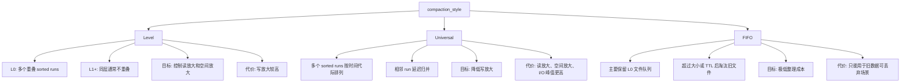
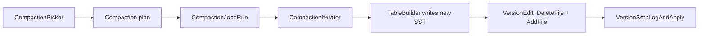
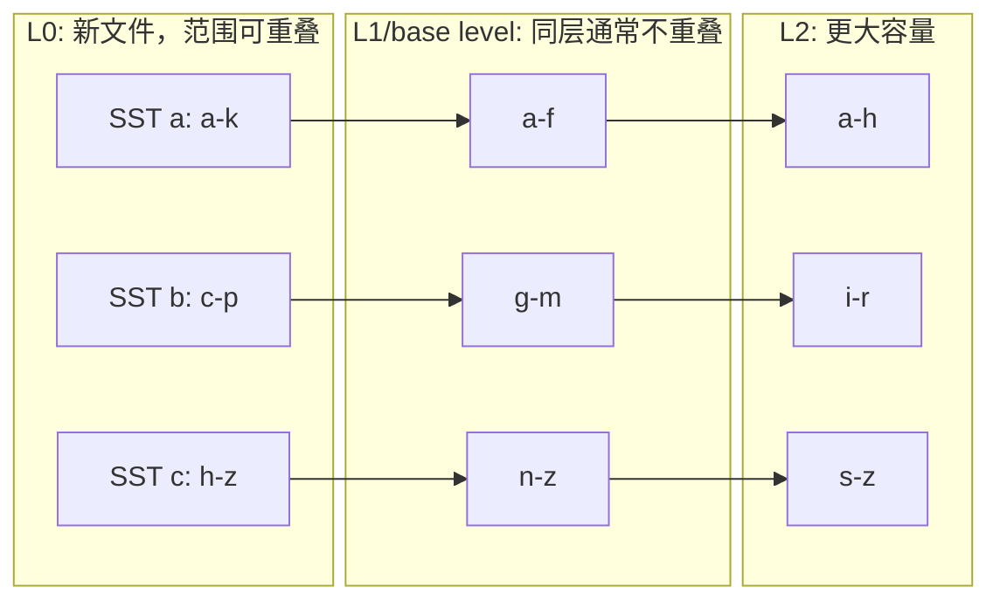
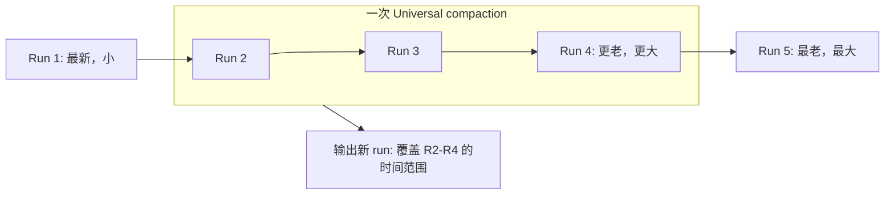
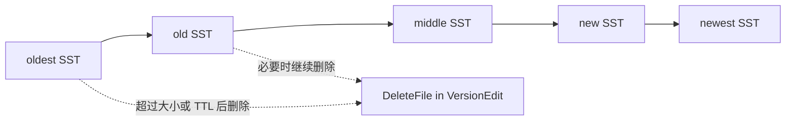
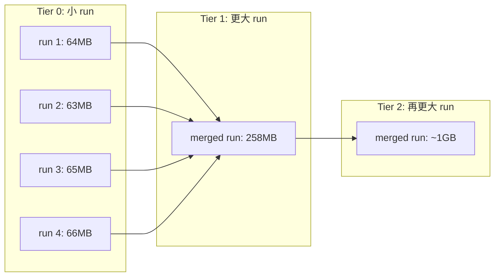
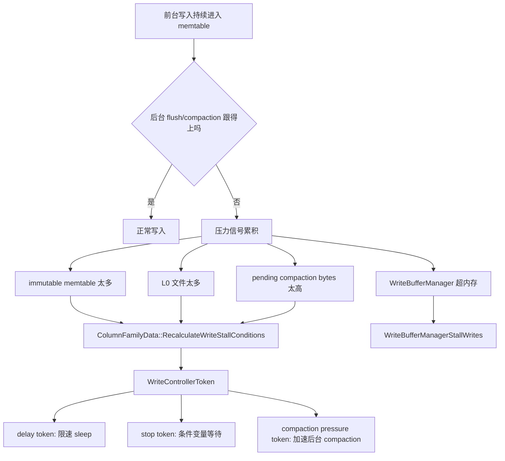

## 今日主题

- 主主题：`Compaction 策略`
- 副主题：`Tiering Compaction / Write Stall / Rate Limiter`

Day 013 已经建立了 compaction 的主链路：

`ComputeCompactionScore -> NeedsCompaction -> PickCompaction -> CompactionJob::Run -> VersionEdit -> LogAndApply`

Day 014 继续沿着这条线往下看：不同 compaction style 到底在 `PickCompaction()` 阶段怎么做选择；当后台整理跟不上前台写入时，RocksDB 又如何通过 write stall 把写入速度降下来。

## 学习目标

- 讲清 `Level`、`Universal`、`FIFO` 三种 compaction style 的布局、触发逻辑、实现入口和适用场景。
- 讲清 `Tiering Compaction / Size-Tiered Compaction` 作为一类 LSM 策略本身是什么，并区分 RocksDB `Universal` 只是最接近这个家族的实现风格。
- 讲清 L0 为什么是 leveled compaction 里最特殊的一层。
- 讲清 RocksDB 如何用 write stall 处理 memtable、L0 文件、pending compaction bytes、WriteBufferManager 压力。
- 区分 `write stall` 和 `RateLimiter`：一个主要管前台写入背压，一个主要管 I/O 速率。

## 前置回顾

Day 013 里已经看过：

- `CompactionPicker` 只负责选择，不执行 I/O。
- `Compaction` 是一次计划对象。
- `CompactionJob` 是执行器。
- compaction 结果最终通过 `VersionEdit` 表达为旧文件 `DeleteFile` 和新文件 `AddFile`。

今天只关注 picker 策略与写入背压，不展开 `CompactionIterator` 如何处理 snapshot、delete、merge、range tombstone。那部分后续单独看。

## 源码入口

- `D:\program\rocksdb\include\rocksdb\advanced_options.h`
- `D:\program\rocksdb\include\rocksdb\universal_compaction.h`
- `D:\program\rocksdb\include\rocksdb\options.h`
- `D:\program\rocksdb\db\version_set.cc`
- `D:\program\rocksdb\db\version_set.h`
- `D:\program\rocksdb\db\compaction\compaction_picker_level.cc`
- `D:\program\rocksdb\db\compaction\compaction_picker_universal.cc`
- `D:\program\rocksdb\db\compaction\compaction_picker_fifo.cc`
- `D:\program\rocksdb\db\compaction\compaction_picker.cc`
- `D:\program\rocksdb\db\column_family.cc`
- `D:\program\rocksdb\db\write_controller.h`
- `D:\program\rocksdb\db\write_controller.cc`
- `D:\program\rocksdb\db\db_impl\db_impl_write.cc`
- `D:\program\rocksdb\include\rocksdb\write_buffer_manager.h`
- `D:\program\rocksdb\include\rocksdb\rate_limiter.h`
- `D:\program\rocksdb\file\writable_file_writer.cc`
- `D:\program\rocksdb\file\random_access_file_reader.cc`
- `D:\program\rocksdb\db\compaction\compaction_job.cc`
- `D:\program\rocksdb\db\flush_job.cc`
- `D:\program\rocksdb\include\rocksdb\env.h`
- `D:\program\rocksdb\env\env_posix.cc`
- `D:\program\rocksdb\util\threadpool_imp.cc`
- `D:\program\rocksdb\db\db_impl\db_impl_open.cc`
- `D:\program\rocksdb\db\db_impl\db_impl_compaction_flush.cc`
- `D:\program\rocksdb\db\db_impl\db_impl.cc`
- `D:\program\rocksdb\db\periodic_task_scheduler.h`
- `D:\program\rocksdb\db\periodic_task_scheduler.cc`
- `D:\program\rocksdb\util\timer.h`
- `D:\program\rocksdb\db\error_handler.cc`
- `D:\program\rocksdb\db\db_impl\db_impl_follower.cc`
- `D:\program\rocksdb\file\delete_scheduler.cc`
- `D:\program\rocksdb\file\sst_file_manager_impl.cc`

外部补充资料：

- [RocksDB Wiki: Compaction](https://github.com/facebook/rocksdb/wiki/Compaction)
- [RocksDB Wiki: Universal Compaction](https://github.com/facebook/rocksdb/wiki/Universal-Compaction)
- [RocksDB Wiki: Write Stalls](https://github.com/facebook/rocksdb/wiki/Write-Stalls)
- [RocksDB Blog: Auto-tuned Rate Limiter](https://rocksdb.org/blog/2017/12/18/17-auto-tuned-rate-limiter.html)
- [Apache Cassandra: Size Tiered Compaction Strategy](https://cassandra.apache.org/doc/stable/cassandra/managing/operating/compaction/stcs.html)

外部资料只用来补充术语和动机。具体实现以本地 `D:\program\rocksdb` 源码为准。

## 总览图



## 职责边界：picker 决定计划，执行框架复用

不同 compaction style 的核心差异主要在 picker。也就是说，`Level`、`Universal`、`FIFO` 首先区别在于：**如何判断需要整理、如何挑选输入文件或 sorted runs、输出到哪里、是否可以走 trivial move 或特殊淘汰路径。**

RocksDB 本地源码里，这个差异集中在三个 picker：

- `LevelCompactionPicker`
  - 按 level score 和 key range overlap 选文件。
- `UniversalCompactionPicker`
  - 按 sorted runs、size ratio、read amplification、size amplification 选 run。
- `FIFOCompactionPicker`
  - 按 TTL、总大小、温度变化或可选的 L0 内部合并选文件。

但 picker 选出的结果不只是“输入文件列表”。更准确地说，picker 会构造一份 `Compaction` 计划，里面包含：

- 输入 level 和输入文件。
- 输出 level。
- compaction reason。
- 是否涉及 bottommost level。
- 输出文件大小目标。
- 压缩、路径、温度等执行参数。
- 与 overlap、grandparent、subcompaction 边界相关的上下文。

只要进入普通重写型 compaction，后面的执行框架大体是复用的：



这条链路说明：不同 style 不是各自有一套完全不同的执行器。普通重写路径通常都会复用 `CompactionJob`、`SubcompactionState`、`CompactionIterator`、`TableBuilder`、`VersionEdit` 这套主框架。

需要注意几个例外：

- `trivial move`
  - 主要是 metadata-only，不真正读写 SST data。
- FIFO 删除旧文件
  - 更像文件淘汰，不是典型 merge-rewrite。
- subcompaction
  - 不是新的 compaction style，而是同一个 `CompactionJob` 内按 key range 切分的并行执行分片。
- manual compaction
  - 触发来源不同，但进入普通重写后仍复用 compaction planning / execution 框架。

所以本文后面看三种策略时，要带着这个边界：**picker 决定 compaction 计划；普通重写型 compaction 的执行框架基本复用。**

## 输入文件选择总览

先把“到底哪些 SST 会被选入一次 compaction”放在一张表里：

| 策略 | 起始选择 | 会额外拉入哪些文件 | 主要原因 |
| --- | --- | --- | --- |
| Level | score 最高且达到阈值的 level；或 marked / TTL / periodic / forced blob GC 文件 | L0 -> base level 会补充重叠 L0；普通输出到非 0 层时会拉入 output level 的 key range 重叠文件；必要时扩展成 clean cut | 保证同一 key range 的新旧数据一起归并，避免破坏层级不重叠和读语义 |
| Universal | 先把 L0 每个文件、L1+ 每个非空 level 计算成 sorted run；再按 periodic、size amp、size ratio、sorted-run count、delete-triggered 顺序选连续 run | 被选中的 L0 run 对应单个 L0 SST；被选中的非 L0 run 会拉入该 level 的全部 SST | Universal 的策略单位是 sorted run，不是单个 level 文件 |
| FIFO | TTL、总大小、温度变化依次尝试 | TTL/size 通常选择最老文件；迁移期存在非 L0 文件时可能从最后一个非空 level 选文件；`allow_compaction=true` 时可选一组 L0 文件做 intra-L0 | FIFO 的主目标是淘汰旧文件或控制文件数，不是构造低读放大的层级 |

这个表可以作为后面三段源码的阅读索引。

## 配置入口

```cpp
// include/rocksdb/advanced_options.h + enum CompactionStyle
enum CompactionStyle : char {
  kCompactionStyleLevel = 0x0,
  kCompactionStyleUniversal = 0x1,
  kCompactionStyleFIFO = 0x2,
  kCompactionStyleNone = 0x3,
};
```

默认是 `kCompactionStyleLevel`。另外两个常见策略分别是 `Universal` 和 `FIFO`。

```cpp
// include/rocksdb/advanced_options.h + AdvancedColumnFamilyOptions
CompactionStyle compaction_style = kCompactionStyleLevel;
CompactionPri compaction_pri = kMinOverlappingRatio;
CompactionOptionsUniversal compaction_options_universal;
CompactionOptionsFIFO compaction_options_fifo;
```

这里也能看到两个重要事实：

- compaction style 是 Column Family 级别的选项。
- leveled 下还会用 `compaction_pri` 决定同一层里优先选哪个文件。

默认的 `kMinOverlappingRatio` 会优先选“与下一层重叠比例小”的文件，目标是减少未来重写的数据量，从而降低写放大。

## Level Compaction

### 它解决什么问题

Level compaction 的目标是把 LSM 整理成稳定的层级结构：

- L0 可以有多个重叠文件。
- L1+ 同层文件通常按 key range 切分，不互相重叠。
- 每一层有目标大小，越往下层容量越大。
- 当某层超过目标，就把一部分文件 compact 到下一层。

图示：



Level compaction 的优势是：

- 点查路径更稳定。
- 空间放大通常较低。
- 范围扫描更容易受益于有序层级。

它的代价是：

- 更新同一 key range 时，下层重叠文件会被反复重写。
- 写放大通常高于 tiered/universal。

### L0 为什么特殊

```cpp
// db/version_set.cc + VersionStorageInfo::ComputeCompactionScore(...)
if (level == 0) {
  int num_sorted_runs = 0;
  uint64_t total_size = 0;
  for (auto* f : files_[level]) {
    if (!f->being_compacted) {
      total_size += f->compensated_file_size;
      num_sorted_runs++;
    }
  }
  score = static_cast<double>(num_sorted_runs) /
          mutable_cf_options.level0_file_num_compaction_trigger;
} else {
  uint64_t level_bytes_no_compacting = 0;
  for (auto f : files_[level]) {
    if (!f->being_compacted) {
      level_bytes_no_compacting += f->compensated_file_size;
    }
  }
  score = static_cast<double>(level_bytes_no_compacting) /
          MaxBytesForLevel(level);
}
```

L0 的 score 主要看 sorted runs / 文件数；L1+ 的 score 主要看层大小。

原因是：

- L0 文件可能互相重叠，一个 key 可能落在多个 L0 文件里。
- L0 的每个文件都可能是一个独立 sorted run。
- L0 文件数直接影响点查和 iterator merge 成本。

L1+ 在 leveled 布局下通常同层不重叠，所以容量是否超过目标更关键。

### 输入 SST 如何选择

Leveled compaction 的输入文件选择可以拆成三步：

1. 先选起始输入
   - `SetupInitialFiles()` 按 compaction score 从高到低尝试。
   - 如果是 L0，输出层通常是 base level。
   - 如果是 L1+，输出层通常是 `start_level + 1`。
   - 如果没有 size-based compaction，还会尝试 marked file、bottommost tombstone、TTL、periodic、forced blob GC 等触发源。
2. 再扩展同层输入
   - L0 -> base level 时，不能只看单个 L0 文件。因为 L0 文件 key range 可以互相重叠，所以需要把相关重叠 L0 文件也加入。
   - L1+ 如果使用 round-robin priority，可能会扩展连续文件，但要受 `max_compaction_bytes`、trivial move 可能性和并发冲突限制。
3. 最后拉入输出层重叠文件
   - 只要输出层不是 L0，就要找 output level 中与起始输入 key range 重叠的 SST。
   - 这些文件必须一起作为输入，否则同一 key range 的新旧版本会被错误地分散在两个层级中。

所以 Level compaction 里常见的输入组合是：

- `L0 若干个互相重叠或相关的 SST + LBase 中 key range 重叠的 SST`
- `Lk 中一个或多个连续 SST + L(k+1) 中 key range 重叠的 SST`
- `marked / TTL / periodic / forced blob GC 文件 + 它在输出层的重叠文件`
- `trivial move` 特例：如果输出层没有重叠文件，输入可能只有一个或几个可直接移动的 SST
- `intra-L0` 特例：输出层仍是 L0，输入是一组未被 compacting 的 L0 文件

### Level picker 主链

```cpp
// db/compaction/compaction_picker_level.cc + LevelCompactionBuilder::PickCompaction()
SetupInitialFiles();
if (start_level_inputs_.empty()) {
  return nullptr;
}

if (!SetupOtherL0FilesIfNeeded()) {
  return nullptr;
}

if (!SetupOtherInputsIfNeeded()) {
  return nullptr;
}

Compaction* c = GetCompaction();
return c;
```

这段代码是 leveled picker 的骨架。

它先根据 score 或 marked file 选起点，再做两类扩展：

- 如果是 L0 -> base level，可能需要补充其他重叠 L0 文件。
- 如果输出层有重叠文件，需要把 output level 的 overlapping inputs 也拉进来。

### L0 -> LBase 的扩展

```cpp
// db/compaction/compaction_picker_level.cc + LevelCompactionBuilder::SetupOtherL0FilesIfNeeded()
if (start_level_ == 0 && output_level_ != 0 && !is_l0_trivial_move_) {
  return compaction_picker_->GetOverlappingL0Files(
      vstorage_, &start_level_inputs_, output_level_, &parent_index_);
}
return true;
```

如果 L0 的文件范围互相重叠，只 compact 其中一个文件可能打破 key 的新旧顺序处理。因此 L0 -> LBase 可能会拉入更多 L0 文件。

```cpp
// db/compaction/compaction_picker_level.cc + LevelCompactionBuilder::SetupOtherInputsIfNeeded()
if (output_level_ != 0) {
  output_level_inputs_.level = output_level_;
  if (!is_l0_trivial_move_ &&
      !compaction_picker_->SetupOtherInputs(
          cf_name_, mutable_cf_options_, vstorage_, &start_level_inputs_,
          &output_level_inputs_, &parent_index_, base_index_,
          round_robin_expanding)) {
    return false;
  }

  compaction_inputs_.push_back(start_level_inputs_);
  if (!output_level_inputs_.empty()) {
    compaction_inputs_.push_back(output_level_inputs_);
  }
}
```

输出层重叠文件也必须参与 compaction，否则同一个 key range 的新旧数据会分散在不该同时存在的层级范围里。

所以 leveled compaction 的一次选择通常不是：

`拿一个文件，写到下一层`

而是：

`拿起始输入 -> 扩展 L0 重叠 -> 扩展输出层重叠 -> clean cut -> 检查并发冲突 -> 形成 Compaction`

### Trivial Move

```cpp
// db/compaction/compaction_picker_level.cc + LevelCompactionBuilder::TryPickL0TrivialMove()
vstorage_->GetOverlappingInputs(output_level_, &my_smallest, &my_largest,
                                &output_level_inputs.files);
if (output_level_inputs.empty()) {
  start_level_inputs_.files.push_back(file);
} else {
  break;
}
...
is_l0_trivial_move_ = true;
```

trivial move 的核心条件是：待移动文件在输出层没有重叠文件，而且不需要因为压缩、路径、温度等原因重写 SST。

它的收益很直接：

- 不读旧 SST data。
- 不写新 SST data。
- 只通过 `VersionEdit` 把文件从一个 level 移到另一个 level。

这属于 metadata-only compaction，是降低写放大的重要优化。

### Intra-L0 Compaction

当 L0 文件太多，但 L0 -> LBase 代价太高或被正在运行的 compaction 阻塞时，RocksDB 可以先做 L0 内部合并。

```cpp
// db/compaction/compaction_picker_level.cc + LevelCompactionBuilder::PickIntraL0Compaction()
if (level_files.size() <
        static_cast<size_t>(
            mutable_cf_options_.level0_file_num_compaction_trigger + 2) ||
    level_files[0]->being_compacted) {
  return false;
}
return FindIntraL0Compaction(level_files, kMinFilesForIntraL0Compaction,
                             std::numeric_limits<uint64_t>::max(),
                             mutable_cf_options_.max_compaction_bytes,
                             &start_level_inputs_);
```

### Size-Based Intra-L0 Compaction

这里的 `size-based compaction` 指 `LevelCompactionBuilder::PickSizeBasedIntraL0Compaction()`，不是一个新的 compaction style。它仍然属于 leveled compaction picker 内部的一个特殊分支。

它解决的问题是：**L0 文件数已经很多，需要减少读放大和 stall 风险，但直接 L0 -> LBase 会把很大的 LBase 重叠数据也拖进来，导致很差的写放大。**

普通 L0 -> LBase 的输入可能是：

`一批 L0 文件 + LBase 中与这些 key range 重叠的大量 SST`

如果 LBase 已经很大，而 L0 总量相对小，这次 compaction 可能为了处理一点 L0 数据，重写大量 LBase 数据。这样可以减少 L0 文件数，但代价太高。

size-based intra-L0 的选择是：

`一批 L0 文件 -> 输出仍然放回 L0`

它不尝试把数据推入 base level，而是先把多个 L0 sorted runs 合成更少的 L0 run。这样能：

- 减少 L0 文件数。
- 降低点查和 iterator 需要检查/merge 的 L0 run 数量。
- 缓解 `level0_slowdown_writes_trigger` / `level0_stop_writes_trigger` 带来的写停顿风险。
- 避免一次性重写巨大的 LBase overlap，降低当下写放大。

它的核心判断不是“L0 是否超过文件数阈值”这么简单，而是比较 L0 总大小和 LBase 大小：

```cpp
// db/compaction/compaction_picker_level.cc + LevelCompactionBuilder::PickSizeBasedIntraL0Compaction()
size_t min_num_file =
    std::max(2, mutable_cf_options_.level0_file_num_compaction_trigger);
if (l0_files.size() < min_num_file) {
  return false;
}

uint64_t l0_size = 0;
for (const auto& file : l0_files) {
  l0_size += file->compensated_file_size;
}

const double kMultiplier =
    std::max(10.0, mutable_cf_options_.max_bytes_for_level_multiplier) * 2;
const uint64_t min_lbase_size = MultiplyCheckOverflow(l0_size, kMultiplier);

uint64_t lbase_size = 0;
for (const auto& file : lbase_files) {
  lbase_size += file->fd.GetFileSize();
  if (lbase_size > min_lbase_size) {
    break;
  }
}
if (lbase_size <= min_lbase_size) {
  return false;
}

for (const auto& file : l0_files) {
  if (file->being_compacted) {
    break;
  }
  start_level_inputs_.files.push_back(file);
}
...
output_level_ = 0;
return true;
```

这段逻辑可以拆成几步：

1. L0 文件数必须足够多
   - 至少达到 `max(2, level0_file_num_compaction_trigger)`。
2. 计算 L0 总大小
   - 使用 `compensated_file_size`，让删除较多的文件在大小估算中更容易被 compact。
3. 计算 LBase 是否“过大”
   - 阈值大致是 `L0 size * max(10, max_bytes_for_level_multiplier) * 2`。
   - 只有当 LBase 大到超过这个阈值时，才认为 L0 -> LBase 写放大可能太差。
   - 因此 `if (lbase_size <= min_lbase_size) return false;` 表示“不做 size-based intra-L0”，不是“需要做 intra-L0”。L0 文件数多只是前置条件，真正让这个优化成立的是 LBase 相对 L0 已经太大。
4. 选择一段未在 compacting 的 L0 文件
   - 遇到 `being_compacted` 就停止，避免和正在运行的 compaction 冲突。
   - 如果当前没有 L0 文件处于 compacting，这段前缀经常会等于“当前全部 L0 文件”；但这不是普通 L0 -> LBase 的全选，而是 `output_level_ = 0` 的 L0 内部合并。
5. 输出层设置为 L0
   - `output_level_ = 0`，这说明它是 L0 内部合并，不是往 base level 下推。

所以它的本质是一个“先减小 L0 run 数量、推迟昂贵 L0->LBase”的优化。它不能替代真正的 L0 -> base level compaction，因为数据最终还是要进入 leveled 层级；但它可以避免在 LBase 太大时用很高写放大去解决 L0 文件数压力。

这回答了之前的问题：L0 过多且重叠时，RocksDB 不只有“硬 compact 到下一层”这一种办法。它会尝试：

- trivial move
- intra-L0 compaction
- 按 overlap ratio 选择更低写放大的输入
- subcompaction 并行化
- 必要时触发 write stall，给后台整理争取时间

## Universal Compaction

### 它是什么

官方 Wiki 把 Universal Compaction 放在 tiered compaction 家族里。它的基本思想是：

- 数据按生成时间形成多个 sorted runs。
- 新 run 通常更小、更新；旧 run 通常更大、更老。
- compaction 延迟发生，只在 run 数量、大小比例或空间放大达到条件时合并若干相邻 run。

图示：



Universal 的目标是降低写放大：

- 不像 leveled 那样频繁把上层数据和下一层重叠数据做 some-to-some 归并。
- 更倾向于让多个 run 先堆积，再按条件批量合并。

代价也明显：

- 同一个 user key 可能存在于更多 sorted runs，读放大更高。
- 老 run 和新 run 同时保留，空间放大更高。
- 大 compaction 会带来更尖峰的 I/O。

### sorted runs 如何计算

```cpp
// db/compaction/compaction_picker_universal.cc + UniversalCompactionBuilder::CalculateSortedRuns(...)
for (FileMetaData* f : vstorage.LevelFiles(0)) {
  ret.emplace_back(
      0, f, f->fd.GetFileSize(), f->compensated_file_size, f->being_compacted,
      f->marked_for_compaction && f->FileIsStandAloneRangeTombstone());
}
for (int level = 1; level <= last_level; level++) {
  uint64_t total_compensated_size = 0U;
  uint64_t total_size = 0U;
  bool being_compacted = false;
  for (FileMetaData* f : vstorage.LevelFiles(level)) {
    total_compensated_size += f->compensated_file_size;
    total_size += f->fd.GetFileSize();
    if (f->being_compacted) {
      being_compacted = f->being_compacted;
    }
  }
  if (total_compensated_size > 0) {
    ret.emplace_back(level, nullptr, total_size, total_compensated_size,
                     being_compacted, level_has_marked_standalone_rangedel);
  }
}
```

Universal 下：

- L0 每个文件是一个 sorted run。
- L1+ 每个非空 level 整体也会被视为一个 sorted run。

这和 leveled 的 mental model 很不一样。Universal 的 level 更多是实现上的放置位置；真正的策略单位是 sorted run。

### Universal picker 主链

```cpp
// db/compaction/compaction_picker_universal.cc + UniversalCompactionBuilder::PickCompaction()
sorted_runs_ =
    CalculateSortedRuns(*vstorage_, max_output_level, &max_run_size_);

if (sorted_runs_.size() == 0 ||
    (vstorage_->FilesMarkedForPeriodicCompaction().empty() &&
     vstorage_->FilesMarkedForCompaction().empty() &&
     sorted_runs_.size() < (unsigned int)file_num_compaction_trigger)) {
  return nullptr;
}

Compaction* c = nullptr;
c = MaybePickPeriodicCompaction(c);
c = MaybePickSizeAmpCompaction(c, file_num_compaction_trigger);
c = MaybePickCompactionToReduceSortedRunsBasedFileRatio(
    c, file_num_compaction_trigger, ratio);
c = MaybePickCompactionToReduceSortedRuns(c, file_num_compaction_trigger,
                                          ratio);
c = MaybePickDeleteTriggeredCompaction(c);
```

选择顺序大致是：

1. 周期性 compaction。
2. size amplification 过高时做 size-amp compaction。
3. 根据文件比例减少 sorted runs。
4. 根据 run 数量减少 sorted runs。
5. delete-triggered compaction。

这说明 Universal 不是简单“文件数到了就全合并”。它会在多个目标之间权衡：

- read amplification：sorted runs 太多。
- size amplification：旧 run 和新 run 同时存在太多。
- write amplification：避免过早重写大 run。

### Universal 会挑哪些 SST

Universal 的输入选择不是“从某一层挑一个文件，再找下一层 overlap”。它先把现有文件抽象成 sorted runs：

- L0：每个 SST 是一个 sorted run。
- L1+：每个非空 level 整体是一个 sorted run。

然后 picker 在 sorted run 序列里选择一段连续 run。不同触发原因对应不同选择方式：

- periodic compaction
  - 通常倾向于做覆盖面更大的合并，用来周期性刷新旧 run。
- size amplification compaction
  - 选择一段可用 sorted runs，目标是把“新 run 总大小 / 最老 base run 大小”的空间放大压下去。
  - 会跳过正在 compacting 的 run，以及带 standalone range tombstone marked compaction 的 run。
- size ratio compaction
  - 从较新的 run 开始，检查后续 run 是否满足大小比例条件。
  - 如果连续候选 run 数量达到 `min_merge_width`，且不超过 `max_merge_width`，就组成一次 compaction。
- sorted-run count compaction
  - 当 sorted runs 太多导致读放大过高时，放宽大小比例，优先减少 run 数量。
- delete-triggered compaction
  - 由删除相关信号触发，选择能帮助清理删除负担的 run。

被选中的 sorted run 如何转成 SST 输入：

```cpp
// db/compaction/compaction_picker_universal.cc + UniversalCompactionBuilder::PickCompactionToReduceSortedRuns(...)
for (size_t i = start_index; i < first_index_after; i++) {
  auto& picking_sr = sorted_runs_[i];
  if (picking_sr.level == 0) {
    inputs[0].files.push_back(picking_sr.file);
  } else {
    auto& files = inputs[picking_sr.level - start_level].files;
    for (auto* f : vstorage_->LevelFiles(picking_sr.level)) {
      files.push_back(f);
    }
  }
}
```

这段说明了一个关键点：**Universal 选的是 run，但最终进入 `Compaction` 的仍然是 SST 文件集合。**

- 如果 run 来自 L0，就加入对应的那个 L0 SST。
- 如果 run 来自 L1+，就加入该 level 的所有 SST。

因此 Universal compaction 的输入可能是：

- 几个连续的 L0 SST。
- 若干 L0 SST + 某个非空 level 的全部 SST。
- 多个非空 level 的全部 SST。
- incremental universal compaction 下，可能只取较大 level 中一段范围内的文件，以减少一次 full-level 合并的代价。

### Universal 关键选项

```cpp
// include/rocksdb/universal_compaction.h + CompactionOptionsUniversal
unsigned int size_ratio;
unsigned int min_merge_width;
unsigned int max_merge_width;
unsigned int max_size_amplification_percent;
int max_read_amp;
CompactionStopStyle stop_style;
bool allow_trivial_move;
bool incremental;
```

这些选项对应几类问题：

- `size_ratio`
  - 决定相邻 run 的大小接近到什么程度时可以一起合并。
- `min_merge_width / max_merge_width`
  - 限制一次 compaction 至少/至多合并多少个 run。
- `max_size_amplification_percent`
  - 控制空间放大。
- `max_read_amp`
  - 控制最多保留多少 sorted runs。
- `allow_trivial_move`
  - 对不重叠文件尽量做 metadata-only 移动。

Universal 适合：

- 写入吞吐优先。
- 能接受更高读放大或有缓存/Bloom 帮忙。
- 数据有较强批量写入、追加写入、bulk load 特征。

不适合：

- 点查极多且尾延迟敏感。
- 磁盘空间紧张，无法承受较高临时空间放大。
- 无法接受偶发大 compaction 峰值。

## FIFO Compaction

### 它是什么

FIFO compaction 更像“文件队列淘汰”：

- 新数据 flush 成 L0 SST。
- 当总 SST 文件大小超过 `max_table_files_size`，删除最老文件。
- 如果配置了 TTL，也可以优先删除过期文件。
- 默认不做普通意义上的全量 merge。

图示：



### FIFO picker 主链

```cpp
// db/compaction/compaction_picker_fifo.cc + FIFOCompactionPicker::PickCompaction(...)
Compaction* c = nullptr;
if (mutable_cf_options.ttl > 0) {
  c = PickTTLCompaction(cf_name, mutable_cf_options, mutable_db_options,
                        vstorage, log_buffer);
}
if (c == nullptr) {
  c = PickSizeCompaction(cf_name, mutable_cf_options, mutable_db_options,
                         vstorage, log_buffer);
}
if (c == nullptr) {
  c = PickTemperatureChangeCompaction(
      cf_name, mutable_cf_options, mutable_db_options, vstorage, log_buffer);
}
RegisterCompaction(c);
return c;
```

FIFO 的自动选择顺序是：

1. TTL 删除。
2. 总大小超限删除。
3. 文件温度变化 compaction。

### FIFO 会挑哪些 SST

FIFO 的输入选择要按触发原因分开看。

TTL 触发时：

- 只看 L0 文件。
- 从最老文件开始检查。
- 如果文件估算的 newest key time 已经过期，就加入输入。
- 但如果删掉这些过期文件后总大小仍然超过 `max_table_files_size`，TTL picker 会放弃，让后面的 size-based picker 接手。

size 触发时：

- 先计算所有 level 的总大小，并找到最后一个非空 level。
- 常规 FIFO 只有 L0 文件时，从 L0 最老文件开始加入输入，直到删除后总大小低于 `max_table_files_size`。
- 如果是从 level/universal 迁移到 FIFO，可能存在非 L0 文件。此时会先从最后一个非空 level 选文件。
- 如果最后一个非空 level 不是 L0，RocksDB 并不知道哪个文件逻辑上最老，因此按 key 顺序从左侧文件开始删。这适合“较小 key 往往更老”的 FIFO 使用场景。

temperature 触发时：

- 只适用于单层 FIFO。
- 从较老的 L0 文件里找需要切换 temperature 的文件。
- 一次只选一个文件，输出目标 temperature 变化后的 SST。

可选 L0 内合并时：

- 只有 `compaction_options_fifo.allow_compaction = true` 才会发生。
- 如果总大小还没超过上限，RocksDB 可以尝试选一组 L0 文件做 intra-L0 compaction，目的不是清理旧数据，而是减少 L0 文件数。
- 为了避免反复合并出永远不过期的大文件，源码会限制候选文件大小，例如不选择明显大于 memtable 写出规模的文件。

### FIFO 按大小淘汰

```cpp
// db/compaction/compaction_picker_fifo.cc + FIFOCompactionPicker::PickSizeCompaction(...)
if (last_level == 0) {
  // L0 中右侧文件是最老文件。
  for (auto ritr = last_level_files.rbegin(); ritr != last_level_files.rend();
       ++ritr) {
    auto f = *ritr;
    total_size -= f->fd.file_size;
    inputs[0].files.push_back(f);
    if (total_size <=
        mutable_cf_options.compaction_options_fifo.max_table_files_size) {
      break;
    }
  }
}
```

FIFO 的结果仍然会通过 `Compaction` 和 `VersionEdit` 表达，但这类 compaction 的核心动作通常是删除旧 SST 的版本引用，而不是把它们和新文件归并。

这里的 `PickSizeCompaction()` 和 Level 里的 `PickSizeBasedIntraL0Compaction()` 名字相近，但语义不同：

- FIFO 的 size-based compaction
  - 目标是让总 SST 大小回到 `max_table_files_size` 以下。
  - 常见动作是删除最老 SST。
- Level 的 size-based intra-L0 compaction
  - 目标是在 LBase 太大时避免昂贵的 L0->LBase。
  - 常见动作是把一批 L0 SST 合并成更少的 L0 SST。

### FIFO 的可选 L0 内合并

```cpp
// include/rocksdb/advanced_options.h + CompactionOptionsFIFO
uint64_t max_table_files_size;
bool allow_compaction = false;
```

默认 `allow_compaction = false`。如果开启，RocksDB 可以尝试把多个小 L0 文件 compact 成更大文件，减少文件数。

但 FIFO 的主要价值不是“整理出低读放大结构”，而是：

- 用低写放大换固定空间上限。
- 适用于 cache-like、日志型、时间窗口型数据。

如果业务要求旧数据不能丢，FIFO 就不是合适选择。

## Tiering Compaction 是什么

这里需要分清两个层次：

- `Tiering Compaction / Size-Tiered Compaction`
  - 是 LSM-tree 里的通用 compaction 策略概念。
  - 它也常被叫做 `tier compaction`、`size-tiered compaction`。
  - 典型实现可以看 Cassandra 的 `SizeTieredCompactionStrategy`。
- RocksDB 本地源码
  - 没有 `kCompactionStyleTiered`。
  - 也没有独立的 `TieredCompactionPicker`。
  - 最接近这个策略家族的是 `Universal Compaction`，但二者不能直接划等号。

Size-tiered 的核心思想是：**不要每次都把一个小 run 立即合入一个大 run，而是等到积累出若干个大小相近的 run，再把它们一起合并成一个更大的 run。**

这和 leveled 的差异很关键：

- leveled 更像“每层有目标容量，超了就把某个 key range 推到下一层，并和下一层重叠文件合并”。
- tiered 更像“同一 size class 里攒够 N 个相近大小的 sorted runs，再归并成一个更大 run，进入下一个 size class”。

图示：



一个简化算法可以这样理解：

1. Flush 不断产生小 SST / sorted run。
2. 按文件大小把 run 放入不同 bucket / tier。
3. 如果某个 tier 里相近大小的 run 数量达到阈值，例如 4 个，就触发一次 compaction。
4. 这次 compaction 只合并这些大小相近的 run，输出一个约等于它们总和的大 run。
5. 输出的大 run 进入更高 size tier，等待未来和其他相近大小的大 run 再合并。

所以 `tier` 在这里指的是**大小层级 / size class**，不是冷热存储介质的 tier，也不是 RocksDB `ReadOptions::read_tier` 里的 cache-only / no-IO 语义。

这种策略的收益是写放大低。原因是每条数据通常只在“从小 run 变成更大 run”的阶段被重写，每次重写都会让它进入指数级更大的 run，离最终大 run 更近。相比之下，leveled 可能把一个小 run 合入一个已经很大的 level，导致大范围旧数据被反复重写。

代价也很明确：

- 读放大更高
  - 因为同一个 key 的不同版本可能散落在多个 tier / 多个 run 中。
- 空间放大可能更高
  - 因为旧版本、tombstone、被覆盖的数据，只有等相关 run 被选中一起 compaction 时才更容易清掉。
- 删除数据回收不稳定
  - size-tiered 的触发依据主要是大小和 run 数量，不是“某个 key range 里是否有大量可丢弃旧版本”。
- 大 compaction 的临时空间压力可能很高
  - 合并大 run 时，新输出和旧输入会同时存在一段时间。

更严格地说：

- `Universal Compaction`
  - 是 RocksDB 中最接近 size-tiered/tiered compaction 的策略。
  - 它的单位是 sorted run，并且会延迟归并来降低写放大。
  - 但它不是 Cassandra STCS 那种“纯按相近大小 bucket 攒够阈值就合并”的直接实现。
  - RocksDB Universal 还会考虑 size amplification、read amplification、size ratio、sorted run 顺序、level 放置等条件。
- `Level Compaction`
  - 可以理解为 L0 带有 tiered 味道，L1+ 更偏 leveled。
  - 但它的主目标仍然是通过层级容量和 key range overlap 控制读放大与空间放大。
- `FIFO Compaction`
  - 更像文件队列淘汰，不是 size-tiered 的归并模型。

可以用一句话记：

`Size-tiered / tier compaction 用更少重写换低写放大，但接受更多 sorted runs；leveled compaction 用更积极重写换低读放大和低空间放大。`

## 三种策略的横向对比

| 策略 | 核心单位 | 主要目标 | 读放大 | 写放大 | 空间放大 | 典型场景 |
| --- | --- | --- | --- | --- | --- | --- |
| Level | level + overlapping files | 稳定读路径和空间 | 低 | 较高 | 低 | 通用默认、点查多 |
| Universal | sorted runs | 降低写放大 | 较高 | 低 | 较高 | 写密集、bulk load |
| FIFO | 文件队列 | 固定空间/TTL 淘汰 | 取决于文件数 | 很低 | 受上限控制 | cache、日志、时间窗口 |

这里的“高低”不是绝对值，而是相对策略倾向。最终效果仍受 key 分布、压缩、Bloom、block cache、write buffer、后台线程和磁盘带宽影响。

## Write Stall

### 它解决什么问题

Compaction 和 flush 是后台还债机制。如果前台写入长期快于后台处理能力，会出现：

- immutable memtable 越积越多。
- L0 文件越来越多。
- pending compaction bytes 越来越高。
- 读放大、空间放大迅速恶化。
- 最后可能磁盘爆掉或读延迟失控。

Write stall 就是 RocksDB 的前台写入背压机制：



### 触发条件

```cpp
// db/column_family.cc + ColumnFamilyData::GetWriteStallConditionAndCause(...)
if (num_unflushed_memtables >= mutable_cf_options.max_write_buffer_number) {
  return {WriteStallCondition::kStopped, WriteStallCause::kMemtableLimit};
} else if (!mutable_cf_options.disable_auto_compactions &&
           num_l0_files >= mutable_cf_options.level0_stop_writes_trigger) {
  return {WriteStallCondition::kStopped, WriteStallCause::kL0FileCountLimit};
} else if (!mutable_cf_options.disable_auto_compactions &&
           mutable_cf_options.hard_pending_compaction_bytes_limit > 0 &&
           num_compaction_needed_bytes >=
               mutable_cf_options.hard_pending_compaction_bytes_limit) {
  return {WriteStallCondition::kStopped,
          WriteStallCause::kPendingCompactionBytes};
} else if (mutable_cf_options.max_write_buffer_number > 3 &&
           num_unflushed_memtables >=
               mutable_cf_options.max_write_buffer_number - 1) {
  return {WriteStallCondition::kDelayed, WriteStallCause::kMemtableLimit};
} else if (!mutable_cf_options.disable_auto_compactions &&
           mutable_cf_options.level0_slowdown_writes_trigger >= 0 &&
           num_l0_files >=
               mutable_cf_options.level0_slowdown_writes_trigger) {
  return {WriteStallCondition::kDelayed, WriteStallCause::kL0FileCountLimit};
} else if (!mutable_cf_options.disable_auto_compactions &&
           mutable_cf_options.soft_pending_compaction_bytes_limit > 0 &&
           num_compaction_needed_bytes >=
               mutable_cf_options.soft_pending_compaction_bytes_limit) {
  return {WriteStallCondition::kDelayed,
          WriteStallCause::kPendingCompactionBytes};
}
```

分两级：

- `kDelayed`
  - 还能写，但每次写入会 sleep 一段时间。
- `kStopped`
  - 暂停写入，直到后台 flush/compaction 缓解压力。

触发源有三类：

- memtable 压力
  - unflushed memtables 到达 `max_write_buffer_number`。
- L0 压力
  - L0 文件数到达 `level0_slowdown_writes_trigger` 或 `level0_stop_writes_trigger`。
- compaction debt 压力
  - estimated pending compaction bytes 到达 soft/hard limit。

### RecalculateWriteStallConditions 做了什么

```cpp
// db/column_family.cc + ColumnFamilyData::RecalculateWriteStallConditions(...)
auto write_stall_condition_and_cause = GetWriteStallConditionAndCause(
    imm()->NumNotFlushed(), vstorage->l0_delay_trigger_count(),
    vstorage->estimated_compaction_needed_bytes(), mutable_cf_options,
    ioptions());

if (write_stall_condition == WriteStallCondition::kStopped) {
  write_controller_token_ = write_controller->GetStopToken();
} else if (write_stall_condition == WriteStallCondition::kDelayed) {
  write_controller_token_ =
      SetupDelay(write_controller, compaction_needed_bytes,
                 prev_compaction_needed_bytes_, was_stopped || near_stop,
                 mutable_cf_options.disable_auto_compactions);
} else {
  write_controller_token_.reset();
}
```

这里的关键是 `write_controller_token_`：

- 某个 CF 进入 stop 条件，就向 DB 级 `WriteController` 申请 stop token。
- 某个 CF 进入 delay 条件，就申请 delay token。
- token 不释放，DB 级写入状态就一直受影响。

官方文档里提到一个容易忽略的点：触发阈值是 per-CF 的，但 write stall 会作用到整个 DB。源码结构也能解释这一点：CF 持有 token，但 token 修改的是 DB 级 `WriteController`。

### WriteController 如何表达状态

```cpp
// db/write_controller.h + class WriteController
std::unique_ptr<WriteControllerToken> GetStopToken();
std::unique_ptr<WriteControllerToken> GetDelayToken(
    uint64_t delayed_write_rate);
std::unique_ptr<WriteControllerToken> GetCompactionPressureToken();

bool IsStopped() const;
bool NeedsDelay() const { return total_delayed_.load() > 0; }
bool NeedSpeedupCompaction() const {
  return IsStopped() || NeedsDelay() || total_compaction_pressure_.load() > 0;
}

uint64_t GetDelay(SystemClock* clock, uint64_t num_bytes);
```

`WriteController` 不知道哪个 key 正在写，也不决定哪个 memtable flush。它只维护 DB 级背压状态：

- stop token 计数
- delay token 计数
- compaction pressure token 计数
- 当前 delayed write rate
- 低优先级写入 limiter

### delay 是怎么限速的

```cpp
// db/write_controller.cc + WriteController::GetDelay(...)
if (credit_in_bytes_ >= num_bytes) {
  credit_in_bytes_ -= num_bytes;
  return 0;
}

// 每 1ms 按 delayed_write_rate_ 补充可写 credit。
if (next_refill_time_ <= time_now) {
  uint64_t elapsed = time_now - next_refill_time_ + kMicrosPerRefill;
  credit_in_bytes_ += static_cast<uint64_t>(
      1.0 * elapsed / kMicrosPerSecond * delayed_write_rate_ + 0.999999);
  next_refill_time_ = time_now + kMicrosPerRefill;
}

uint64_t bytes_over_budget = num_bytes - credit_in_bytes_;
uint64_t needed_delay = static_cast<uint64_t>(
    1.0 * bytes_over_budget / delayed_write_rate_ * kMicrosPerSecond);

return std::max(next_refill_time_ - time_now, kMicrosPerRefill);
```

这是一个 credit-based 限速器：

- 按时间补充可写字节额度。
- 如果本次写入额度足够，不 sleep。
- 如果额度不够，返回需要 sleep 的微秒数。
- 最小 sleep 粒度约 1ms。

### 写路径如何执行 stall

```cpp
// db/db_impl/db_impl_write.cc + DBImpl::PreprocessWrite(...)
if (UNLIKELY(status.ok() && (write_controller_.IsStopped() ||
                             write_controller_.NeedsDelay()))) {
  InstrumentedMutexLock l(&mutex_);
  status = DelayWrite(last_batch_group_size_, write_thread_, write_options);
}

if (UNLIKELY(status.ok() && write_buffer_manager_->ShouldStall())) {
  if (write_options.no_slowdown) {
    status = Status::Incomplete("Write stall");
  } else {
    WriteBufferManagerStallWrites();
  }
}
```

写入真正进 WAL/memtable 之前，会先检查：

- `write_controller_.IsStopped()`
- `write_controller_.NeedsDelay()`
- `write_buffer_manager_->ShouldStall()`

如果用户设置了 `WriteOptions::no_slowdown`，在需要 stall 时会返回 `Status::Incomplete`，而不是阻塞等待。

```cpp
// db/db_impl/db_impl_write.cc + DBImpl::DelayWrite(...)
uint64_t delay =
    write_controller_.GetDelay(immutable_db_options_.clock, num_bytes);

if (delay > 0) {
  write_thread.BeginWriteStall();
  mutex_.Unlock();
  while (write_controller_.NeedsDelay()) {
    if (immutable_db_options_.clock->NowMicros() >= stall_end) {
      break;
    }
    immutable_db_options_.clock->SleepForMicroseconds(kDelayInterval);
  }
  mutex_.Lock();
  write_thread.EndWriteStall();
}

while (write_controller_.IsStopped() &&
       !shutting_down_.load(std::memory_order_relaxed)) {
  write_thread.BeginWriteStall();
  bg_cv_.Wait();
  write_thread.EndWriteStall();
}
```

delay 和 stop 的差异很清楚：

- delay
  - 算出 sleep 时间，释放 DB mutex，睡一段时间后继续。
- stop
  - 等待后台条件变量唤醒，直到 stop token 释放。

### WriteBufferManager 的 stall

```cpp
// include/rocksdb/write_buffer_manager.h + WriteBufferManager::ShouldStall()
bool ShouldStall() const {
  if (!allow_stall_.load(std::memory_order_relaxed) || !enabled()) {
    return false;
  }

  return IsStallActive() || IsStallThresholdExceeded();
}
```

WriteBufferManager 是另一路压力源。它不只看某个 CF，而是可以跨多个 CF / DB 控制 memtable 总内存。

如果 `allow_stall = true`，总内存超过限制后，所有共享该 WriteBufferManager 的写入都会被阻塞，直到 flush 释放内存。

## RateLimiter 和 Write Stall 的区别

这两个概念很容易混：

- `Write Stall`
  - 主要是前台写入背压。
  - 由 memtable、L0 文件数、pending compaction bytes、WBM 内存压力触发。
  - 通过 sleep、条件变量等待、low-pri write 限速来减缓写入。
- `RateLimiter`
  - 主要是 I/O 速率控制。
  - 常用于平滑 flush/compaction 读写文件造成的后台 I/O 峰值。
  - 通过 token request 控制文件读写速度。

RateLimiter API：

```cpp
// include/rocksdb/rate_limiter.h + class RateLimiter
enum class OpType {
  kRead,
  kWrite,
};

enum class Mode {
  kReadsOnly = 0,
  kWritesOnly = 1,
  kAllIo = 2,
};

virtual size_t RequestToken(size_t bytes, size_t alignment,
                            Env::IOPriority io_priority, Statistics* stats,
                            RateLimiter::OpType op_type);
```

文件写入会通过 `WritableFileWriter` 申请 token；文件读取也可以在配置模式下通过 `RandomAccessFileReader` 申请 token。

Flush 和 compaction 会设置不同优先级：

```cpp
// db/flush_job.cc + FlushJob::GetRateLimiterPriority()
if (write_controller->IsStopped() || write_controller->NeedsDelay()) {
  return Env::IO_USER;
}
return Env::IO_HIGH;
```

```cpp
// db/compaction/compaction_job.cc + CompactionJob::GetRateLimiterPriority()
if (write_controller->NeedsDelay() || write_controller->IsStopped()) {
  return Env::IO_USER;
}
return Env::IO_LOW;
```

当写入已经被 delay/stop，flush/compaction I/O 的优先级会提高，目的是尽快缓解 stall 条件。

### 低优先级写入的额外限速

```cpp
// db/db_impl/db_impl_write.cc + DBImpl::ThrottleLowPriWritesIfNeeded(...)
if (write_controller_.NeedSpeedupCompaction()) {
  if (write_options.no_slowdown) {
    return Status::Incomplete("Low priority write stall");
  } else {
    auto data_size = my_batch->GetDataSize();
    while (data_size > 0) {
      size_t allowed = write_controller_.low_pri_rate_limiter()->RequestToken(
          data_size, 0, Env::IO_HIGH, nullptr, RateLimiter::OpType::kWrite);
      data_size -= allowed;
    }
  }
}
```

这是一条很实用的工程线：

- 如果 compaction 已经落后，低优先级写入会被额外限速。
- 高优先级写入可以更少受影响。
- 后台整理得到更多机会追上来。

## 今日问题与讨论

### 我的问题

**问题：Level、Universal、FIFO 的具体区别是什么？**

- 简答：
  - `Level` 默认通用：L0 是重叠 sorted runs，L1+ 追求同层不重叠；通过更积极整理换取低读放大和低空间放大。
  - `Universal` 是 RocksDB 的 tiered 风格：多个 sorted runs 延迟归并；写放大低，但读放大、空间放大和 I/O 峰值更高。
  - `FIFO` 是旧文件淘汰：超过大小或 TTL 后删除旧 SST；非常适合 cache/log/time-window 数据，不适合必须保留全量历史的业务。
- 源码依据：
  - `CompactionStyle` 枚举在 `advanced_options.h`。
  - 三个 picker 分别在 `compaction_picker_level.cc`、`compaction_picker_universal.cc`、`compaction_picker_fifo.cc`。
- 当前结论：
  - 三者主要差异在 picker 选择策略，不在 `CompactionJob` 主执行框架。

**问题：Tiering Compaction 是什么？**

- 简答：
  - Tiering 是 LSM compaction 策略概念，不是 RocksDB 单独的枚举值。
  - 在 RocksDB 中，`Universal` 最接近 tiered；`Level` 可以理解为 L0 tiered + L1+ leveled 的混合。
- 源码依据：
  - 本地源码只有 `kCompactionStyleUniversal`，没有 `kCompactionStyleTiered`。
  - `UniversalCompactionBuilder::CalculateSortedRuns(...)` 以 sorted runs 为策略单位。
- 当前结论：
  - 讲 RocksDB 时最好说“Universal 是 tiered family”，避免误以为有独立 `TieredCompactionPicker`。

**问题：Write Stall 是什么？RocksDB 怎么限流和减缓写入？**

- 简答：
  - Write stall 是当前台写入超过后台 flush/compaction 能力时的背压机制。
  - 触发源包括 memtable 数量、L0 文件数、pending compaction bytes、WriteBufferManager 内存。
  - delayed 状态通过 `WriteController::GetDelay(...)` 计算 sleep 时间；stopped 状态通过条件变量等待后台工作释放压力。
  - 低优先级写入还会走 `low_pri_rate_limiter`，让 compaction/flush 更容易追上。
- 源码依据：
  - `ColumnFamilyData::GetWriteStallConditionAndCause(...)`
  - `ColumnFamilyData::RecalculateWriteStallConditions(...)`
  - `WriteController::GetDelay(...)`
  - `DBImpl::DelayWrite(...)`
  - `DBImpl::ThrottleLowPriWritesIfNeeded(...)`
- 当前结论：
  - write stall 不是 bug，而是 LSM 防止后台债务失控的保护阀。

**问题：RocksDB 都有哪些后台线程？flush、compaction 之外还有什么？**

- 简答：
  - 核心 DB 路径不是为每类任务固定创建一个专属线程，而是主要通过 `Env::Schedule(...)` 投递到 Env 的优先级线程池。
  - DB open 时会根据 `max_background_jobs` 补足 `HIGH` / `LOW` 线程池。默认 `max_background_jobs = 2`，通常得到 1 个 flush 额度和 1 个 compaction 额度。
  - `HIGH` 池通常跑 flush；如果 high-priority pool 配置为 0，flush 会降级投递到 `LOW` 池。
  - `LOW` 池跑普通 compaction；`BOTTOM` 池跑 bottom-priority compaction，但 bottom pool 只有配置了线程时才会被使用。
  - purge 也是后台任务，会投递到 `HIGH` 池，用来释放旧 WAL writer、旧 `SuperVersion`，以及删除 obsolete files。
  - 除线程池外，还有 `PeriodicTaskScheduler` 使用全局单线程 `Timer` 跑周期任务：dump stats、persist stats、flush info log、record seqno-time、trigger periodic compaction。
  - 少数功能会直接创建 `port::Thread`：subcompaction worker、后台 I/O 错误自动恢复、Follower DB 追 MANIFEST、delete scheduler、SstFileManager 错误恢复，以及 persistent cache / backup engine 等可选工具线程。
- 源码依据：
  - `Env::Priority` 定义了 `BOTTOM / LOW / HIGH / USER / TOTAL`，`Env::Schedule(...)` 明确同一 Env 中的任务可并发执行。
  - `DBImpl::GetBGJobLimits(...)` 会把 `max_background_jobs` 划分为 flush / compaction 额度，`DBImpl::Open()` 的选项整理阶段会调用 `IncBackgroundThreadsIfNeeded(...)`。
  - `DBImpl::MaybeScheduleFlushOrCompaction()` 把 flush 投递到 `HIGH` 或 fallback 到 `LOW`，把普通 compaction 投递到 `LOW`。
  - `DBImpl::BGWorkBottomCompaction()` 走 `BOTTOM`，`DBImpl::SchedulePurge()` 把 purge 投递到 `HIGH`。
  - `PeriodicTaskScheduler` 的任务类型包括 `kDumpStats / kPersistStats / kFlushInfoLog / kRecordSeqnoTime / kTriggerCompaction`，内部依赖全局单线程 `Timer`。
  - `CompactionJob::RunSubcompactions()` 会在一次 compaction job 内部额外创建 subcompaction 线程。
  - `ErrorHandler::StartRecoverFromRetryableBGIOError()`、`DBImplFollower::Open()`、`DeleteScheduler::MaybeCreateBackgroundThread()` 等路径会按功能直接创建线程。
- 当前结论：
  - 对普通 DB 实例，最核心的后台执行模型是 `Env` 优先级线程池：flush / compaction / purge 都在这里排队。
  - 周期任务和功能型线程是补充机制；它们不是代替 flush/compaction 线程池，而是负责定时检查、日志/统计维护、错误恢复或特定 utility 的异步工作。
  - `WriteThread` 不是 RocksDB 自己的后台线程，它主要是在前台写入调用者线程之间做 group leader / follower 协调。
  - MANIFEST 写入也通常不是单独的后台线程，而是由执行 flush/compaction/manual 操作的那条线程在 `LogAndApply` 路径里完成。

**问题：base level 是什么？什么时候会变化，如何变化？**

- 简答：
  - `base_level` 是 leveled compaction 中 L0 数据应该 compact 到的第一个非空层级。
  - 它不是 L1 的别名。静态 leveled 下通常是 `1`；默认动态 leveled 下可能是 `L5 / L4 / L3 ... L1`。
  - 非 level compaction 中这个概念不适用，`base_level_` 会是 `-1`。
- 源码依据：
  - `VersionStorageInfo::base_level_` 注释写明：它是 L0 数据应该 compact 到的 level；`base_level_` 之前的层应该为空；非 level compaction 时为 `-1`。
  - `VersionStorageInfo::PrepareForVersionAppend(...)` 会调用 `CalculateBaseBytes(...)`，所以每次构造/安装新 `VersionStorageInfo` 时都会重新计算。
  - `CalculateBaseBytes(...)` 中，如果 `level_compaction_dynamic_level_bytes=false`，则 level compaction 设为 `1`，非 level compaction 设为 `-1`。
  - 如果 `level_compaction_dynamic_level_bytes=true`，源码要求 compaction style 必须是 level，并根据当前非 L0 层的数据量重新选择 base level。
- 什么时候变化：
  - DB open / recovery 构造版本时会计算一次。
  - flush 或 compaction 通过 `VersionEdit -> LogAndApply` 安装新版本时，新 `VersionStorageInfo` 会重新准备并重新计算。
  - 只要非 L0 层文件分布和大小发生变化，下一次新版本安装时 `base_level` 就可能变化。
- 如何变化：
  - 空 DB 或没有 L1+ 数据时，动态 leveled 会把最后一层作为 base level，也就是 L0 直接 compact 到最后一层。
  - 随着最后几层数据增长，如果继续把 base 留在很低的层会破坏 `max_bytes_for_level_multiplier` 的层级比例，RocksDB 会把 base level 往上移：例如 `L5 -> L4 -> L3 -> L2 -> L1`。
  - 如果数据被大量删除、迁移到动态 level 模式，或某些中间层变得不再必要，`CalculateBaseBytes(...)` 会标记 unnecessary levels，后续 compaction 会自动把这些层 drain 掉；重新计算后 base level 也可能向更深层移动。
- 当前结论：
  - `base_level` 是当前 `VersionStorageInfo` 的派生元数据，不是固定配置项。
  - 它服务于动态 leveled LSM 的形状控制：让 L0 直接进入合适的第一层，并让 `base_level..last_level` 尽量维持合理的大小倍数关系。

**问题：size-based compaction 是什么？为什么要这么做？**

- 简答：
  - `size-based compaction` 不是一个独立 compaction style，而是不同 picker 里按大小阈值触发或选择输入的逻辑。
  - 在本章最重要的是 `LevelCompactionBuilder::PickSizeBasedIntraL0Compaction()`：当 L0 文件多、但 LBase 相对 L0 过大时，RocksDB 先做 L0->L0，避免直接 L0->LBase 带来很高写放大。
  - FIFO 里也有 `PickSizeCompaction()`，但它的语义是总大小超过 `max_table_files_size` 后删除旧 SST，不是 L0 内合并优化。
- 源码依据：
  - `PickSizeBasedIntraL0Compaction()` 会先要求 L0 文件数达到 `max(2, level0_file_num_compaction_trigger)`。
  - 它计算 L0 总大小，再用 `l0_size * max(10, max_bytes_for_level_multiplier) * 2` 估算 LBase 是否过大。
  - 只有 LBase 超过这个阈值时，才选择一段未在 compacting 的 L0 文件，并把 `output_level_` 设为 `0`。
  - `FIFOCompactionPicker::PickSizeCompaction()` 则计算 CF 总 SST 大小，并选择旧文件删除到总大小低于上限。
- 当前结论：
  - Level 的 size-based intra-L0 是“先降低 L0 run 数量，推迟昂贵下推”的写放大优化。
  - FIFO 的 size-based 是“总空间超限后删除旧文件”的容量控制。
  - 看到 size-based 这个词时，要先看它在哪个 picker 里，不能把所有 size-based compaction 混成一种机制。

**问题：为什么 L0 compaction 不每次把全部 L0 文件都作为输入？**

- 简答：
  - 因为普通 L0 -> LBase 的写放大往往不只来自 L0 文件本身，而是来自 LBase 中被 key range 拖进来的 overlap SST。
  - 全选 L0 会扩大本次 compaction 的 user key range，可能拉入更多 LBase 文件，导致重写更多已经在下层的旧数据。
  - 正确性只要求把与起始 L0 key range 重叠的 L0 文件拉齐；不重叠的 L0 文件可以留给后续 compaction，或者走 trivial move / intra-L0 等更便宜路径。
- 源码依据：
  - 普通 L0 compaction 会通过 `CompactionPicker::GetOverlappingL0Files(...)` 把与起始文件 key range 重叠的 L0 文件扩展进来，而不是无条件拿全部 L0。
  - 这个函数会先用起始输入算 range，再调用 `VersionStorageInfo::GetOverlappingInputs(0, ..., expand_range=true)` 得到重叠 L0 集合；如果重叠关系链式扩张，它可以选到很多甚至全部 L0，但前提是这些 L0 与本次 range 相关。
  - 之后还要检查输出层范围是否与正在运行的 compaction 冲突。
- 当前结论：
  - RocksDB 不是“害怕 L0 多所以总是全选”，而是尽量只选这次必须处理或收益足够高的 L0。
  - 当 L0 之间大量重叠时，普通 L0 compaction 自然会扩展到更多 L0；当 L0 范围不重叠时，强行全选通常只会扩大 overlap、增加写放大和并发冲突。

**问题：`PickSizeBasedIntraL0Compaction()` 的 `lbase_size <= min_lbase_size` 怎么理解？它会全选 L0 吗？`PickFileToCompact()` 会把 L1+ 满足条件的文件都选进来吗？**

- 简答：
  - `lbase_size <= min_lbase_size` 是放弃 size-based intra-L0 的条件。只有 `lbase_size > min_lbase_size` 时，源码才认为 LBase 相对 L0 太大，直接 L0 -> LBase 的写放大可能不划算，于是继续选择 L0 -> L0。
  - L0 文件数多由前面的 `l0_files.size() >= max(2, level0_file_num_compaction_trigger)` 判断；`lbase_size` 判断表达的是“下推是否太贵”，不是“L0 是否太多”。
  - 满足条件后，它会从 L0 文件列表开头选择一段连续的、未 `being_compacted` 的 L0 文件；如果没有 L0 文件正在 compacting，这一段经常就是当前全部 L0 文件。它仍不是普通下推，因为 `output_level_ = 0`，不会拉入 LBase overlap。
  - L1+ 的 `PickFileToCompact()` 通常不是“把所有满足条件的文件都选进来”。它先按 `FilesByCompactionPri(start_level_)` 选一个优先级最高且未 compacting 的文件，再通过 clean-cut 和输出层 overlap 扩展必要文件。
- 源码依据：
  - `PickSizeBasedIntraL0Compaction()` 中先检查 base level、L0 文件数、L0 总大小和 LBase 大小；只有 LBase 超过阈值才进入 L0 文件选择，并设置 `output_level_ = 0`。
  - `PickFileToCompact()` 的普通路径在 `for` 循环中遇到第一个可用文件后，会 `start_level_inputs_.files.push_back(f)`，随后 `ExpandInputsToCleanCut(...)`，再查输出层 overlap；成功后 `break`。
  - `ExpandInputsToCleanCut(...)` 只为了保证同一个 user key 不被切断，并在扩展后发现已有文件 `being_compacted` 时取消本次选择。
  - `kRoundRobin` priority 下的 `SetupOtherFilesWithRoundRobinExpansion()` 可能额外扩展连续的 start-level 文件，但它也受 `being_compacted`、`max_compaction_bytes`、trivial move 和“只选连续文件”等条件约束，不是无条件全选。
- 当前结论：
  - size-based intra-L0 是一个特殊 L0 内部合并分支，确实偏向在条件满足后拿较多 L0 文件来快速减少 run 数。
  - 普通 L1+ level compaction 的输入选择更保守：起点通常是一个文件，随后只做 correctness 和收益约束下的必要扩展。

### 外部高价值问题

**问题：为什么官方文档说 Universal 适合 leveled 跟不上写入速率的场景？**

- 来源类型：
  - RocksDB 官方 Wiki。
- 为什么重要：
  - 它解释了 Universal 的工程定位：不是“更高级的默认策略”，而是写放大敏感时的取舍。
- 源码依据：
  - `UniversalCompactionPicker` 的核心是延迟合并 sorted runs，而不是按每层目标持续整理。
- 当前结论：
  - Universal 能减少重写，但会让读和空间更难受；是否使用取决于业务瓶颈是写放大还是读/空间放大。
- 是否与本地源码一致：
  - 一致。

**问题：write stall 是 CF 级还是 DB 级？**

- 来源类型：
  - RocksDB 官方 Write Stalls Wiki。
- 为什么重要：
  - 多 CF 场景下，一个 CF 的 L0 或 memtable 压力可能拖慢整个 DB。
- 源码依据：
  - `ColumnFamilyData` 计算 per-CF stall 条件。
  - `WriteController` 是 DB/ColumnFamilySet 级共享控制器。
- 当前结论：
  - 条件来自 CF，效果作用到 DB 写路径。
- 是否与本地源码一致：
  - 一致。

## 常见误区或易混点

1. `Universal` 不是“所有文件都放 L0”
   - 当 `num_levels > 1` 时，Universal 也会利用更高 level 放置较老、较大的 sorted run。

2. `Level` 不是纯 leveled
   - L0 天然是 tiered 风格，L1+ 才是更典型的 leveled 布局。

3. `FIFO` 不是通用删除优化
   - FIFO 会丢弃旧文件，只适用于旧数据可以丢的业务。

4. `trivial move` 不是普通 compaction
   - 它是 metadata-only，核心收益是不重写 SST data。

5. `write stall` 不是 `RateLimiter`
   - stall 管前台写入压力；RateLimiter 管 I/O token。

6. `kDelayed` 和 `kStopped` 不一样
   - delayed 是睡眠限速；stopped 是等待后台条件解除。

7. `no_slowdown` 不会让 RocksDB 绕过所有限制
   - 它会在需要 stall 时返回 `Status::Incomplete`，把是否重试交给应用。

## 设计动机

Compaction style 和 write stall 是同一个问题的两面：

- compaction style 决定后台怎么还债。
- write stall 决定前台什么时候不能继续借债。

Level、Universal、FIFO 代表三种取舍：

- Level：积极还债，读和空间更稳，写入付出更多重写成本。
- Universal：延迟还债，写入更轻，但读、空间和 I/O 峰值更难控制。
- FIFO：到期/超额就丢债，只适合可丢弃数据。

Write stall 则是在所有策略之上的保护机制。无论哪种策略，只要后台债务超过系统可承受范围，RocksDB 都必须让前台写入变慢，否则 LSM 会失控。

## 工程启发

RocksDB 的设计里有一个很值得借鉴的分层：

- 策略层
  - `CompactionPicker` 决定整理方式。
- 执行层
  - `CompactionJob` 负责重 I/O。
- 提交层
  - `VersionEdit / LogAndApply` 负责元数据原子切换。
- 保护层
  - `WriteController / WriteBufferManager / RateLimiter` 控制压力。

这说明后台任务系统不能只考虑“如何执行任务”。还必须考虑：

- 任务积压如何量化。
- 前台何时降速。
- 后台 I/O 如何避免冲击读延迟。
- 多个 CF/DB 共享资源时，压力如何传导。

## 今日小结

Day 014 建立了 compaction 策略和写入背压的整体图景：

1. `Level` 是默认策略，L0 特殊，L1+ 追求同层不重叠。
2. `Universal` 是 RocksDB 的 tiered 风格，以 sorted run 为核心单位，优先降低写放大。
3. `FIFO` 主要通过 TTL/空间上限删除旧文件，适合可丢弃旧数据。
4. `Tiering Compaction` 在 RocksDB 语境中主要对应 Universal；Level 可以理解为 tiered+leveled。
5. `Write Stall` 由 memtable、L0 文件数、pending compaction bytes、WriteBufferManager 压力触发。
6. `WriteController` 用 token 表示 stop、delay、compaction pressure。
7. delayed write 用 credit-based rate control 计算 sleep 时间；stop write 等待后台条件解除。
8. `RateLimiter` 主要控制文件 I/O，和 write stall 的前台背压不是同一层机制。

## 明日衔接

下一步建议继续看：

`Block Cache / Bloom Filter / Prefix Bloom / Partitioned Index`

原因是前面已经看过 `TableCache / TableReader / BlockBasedTable` 的点查主链，也在 compaction 章节看到了后台整理如何控制 LSM 形状。下一步适合回到读路径优化层：block cache 决定 data/index/filter block 的内存命中，bloom filter 和 prefix bloom 决定能否跳过不必要的 SST/block 访问，partitioned index/filter 则决定大索引和大过滤器如何分片加载。

## 复习题

1. `Level`、`Universal`、`FIFO` 三种 compaction style 的核心取舍分别是什么？
2. 为什么说 RocksDB 的 `Universal Compaction` 更接近 tiered compaction？
3. 在 leveled compaction 中，为什么 L0 的 score 主要看 sorted runs / 文件数，而 L1+ 主要看层大小？
4. trivial move 和 intra-L0 compaction 分别在解决什么问题？
5. Write stall 的三个主要 CF 级触发源是什么？哪些是 delayed，哪些会 stopped？
6. `WriteController` 的 stop token、delay token、compaction pressure token 分别有什么作用？
7. `RateLimiter` 和 write stall 的职责边界是什么？
