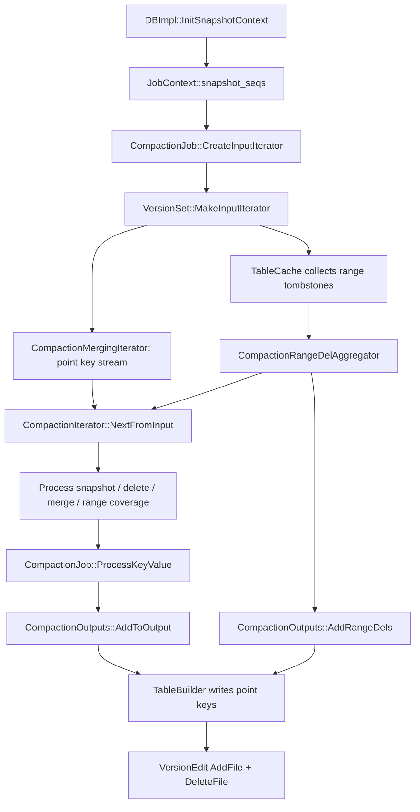

## 今日主题

- 主主题：`CompactionIterator`
- 副主题：`snapshot / internal key / delete tombstone / merge / range tombstone / CompactionJob`

Day 015 不继续推进 `Block Cache / Bloom Filter` 主线，而是做一次 revisit。

原因是 `CompactionIterator` 正好卡在前面几章的交叉点：

- Day 006：delete、range tombstone 与读语义
- Day 009：iterator / merging iterator 输出 internal key 流
- Day 010：snapshot 与 sequence 可见性
- Day 013：CompactionJob 的执行主链
- Day 014：picker 只负责选文件，不负责真正的数据语义

今天要补上的核心问题是：

`picker 选完文件以后，RocksDB 到底如何决定哪些 internal key 被写入新 SST，哪些旧版本、delete、merge operand、range tombstone 可以被丢弃或改写？`

## 学习目标

- 讲清 `CompactionIterator` 在 `CompactionJob` 里的位置。
- 讲清它输入的是 internal key 流，输出的是准备写入新 SST 的 internal key/value。
- 讲清 snapshot stripe 如何决定“同一个 user key 的哪些版本仍然必须保留”。
- 讲清 point delete、single delete、bottommost delete 的主要清理条件。
- 讲清 merge operand 如何借助 `MergeHelper` 尽量合并，但不能跨过 snapshot 边界。
- 讲清 range tombstone 为什么既参与 point key 过滤，又以单独路径写入输出 SST。
- 修正一个容易混淆点：`CompactionIterator` 不是用户 API iterator，也不是 picker，它是 compaction 数据语义的执行状态机。

## 前置回顾

前面章节已经建立了三条线：

1. `InternalKeyComparator`
   - 同一个 user key 下按 sequence 降序排列，新版本先出现。
2. `Snapshot`
   - snapshot sequence 是读可见性边界；活跃 snapshot 会限制 compaction 丢弃旧版本。
3. `CompactionJob`
   - picker 选择输入文件，`CompactionJob` 创建输入 iterator，`CompactionIterator` 处理语义，`TableBuilder` 写新 SST，最后通过 `VersionEdit` 提交。

今天只看普通 compaction 的数据面，不展开 picker 如何选文件，也不展开 blob GC、user-defined timestamp、per-key placement 的全部细节。

## 源码入口

- `D:\program\rocksdb\db\db_impl\db_impl_compaction_flush.cc`
- `D:\program\rocksdb\db\job_context.h`
- `D:\program\rocksdb\db\version_set.cc`
- `D:\program\rocksdb\db\table_cache.cc`
- `D:\program\rocksdb\db\dbformat.h`
- `D:\program\rocksdb\db\dbformat.cc`
- `D:\program\rocksdb\db\compaction\compaction_job.cc`
- `D:\program\rocksdb\db\compaction\compaction_iterator.h`
- `D:\program\rocksdb\db\compaction\compaction_iterator.cc`
- `D:\program\rocksdb\db\compaction\compaction_outputs.cc`
- `D:\program\rocksdb\db\range_del_aggregator.h`
- `D:\program\rocksdb\db\range_del_aggregator.cc`
- `D:\program\rocksdb\db\merge_helper.h`
- `D:\program\rocksdb\db\merge_helper.cc`

## 它解决什么问题

Compaction 的输入不是一组简单的 key/value，而是一组已经按 internal key 排好序的多版本记录：

| internal key 类型 | 在 compaction 中的问题 |
| --- | --- |
| `kTypeValue` / `kTypeBlobIndex` / `kTypeWideColumnEntity` | 可能被更新版本覆盖，也可能仍被某个 snapshot 需要 |
| `kTypeDeletion` | 可能还要遮蔽更老版本，也可能已经没有保留价值 |
| `kTypeSingleDeletion` | 需要匹配对应 put，且受 snapshot / write-conflict 边界影响 |
| `kTypeMerge` | 可以尝试和 operand/base value 合并，但不能破坏 snapshot 语义 |
| `kTypeRangeDeletion` | 覆盖一个 user key 区间，既影响 point key 是否输出，又需要作为 range tombstone 写入输出文件 |

所以 `CompactionIterator` 要做的不是“遍历所有输入然后原样写出”，而是：

- 按 user key 分组处理 internal key。
- 按 snapshot sequence 把同一个 user key 的历史切成可见性区间。
- 丢弃被更新版本完全遮蔽的旧版本。
- 在安全时丢弃 delete tombstone 或把 sequence 归零。
- 对 merge operand 调用 `MergeHelper`。
- 用 `CompactionRangeDelAggregator` 判断 point key 是否被 range tombstone 覆盖。
- 把最终仍需保留的记录交给 `CompactionOutputs / TableBuilder`。

一句话记忆：

`CompactionIterator 是 compaction 的语义状态机：它把“内部多版本历史”压缩成“下一版 SST 仍然需要保存的历史”。`

## 它是怎么工作的

先看整体链路：



这里有两个并行通道：

- point key 通道
  - 输入 iterator 输出 point internal key。
  - `CompactionIterator` 决定 point key 是否保留、合并、改写或丢弃。
- range tombstone 通道
  - `TableCache::NewIterator(...)` 把输入 SST 的 range tombstone 收集到 `CompactionRangeDelAggregator`。
  - `CompactionIterator` 用它判断 point key 是否被覆盖。
  - 输出文件关闭时，`CompactionOutputs::AddRangeDels(...)` 再把仍需保留的 range tombstone 写入输出 SST。

这点很重要：range tombstone 不只是 point key 流里的普通 value。它有自己的收集、覆盖判断和输出路径。

## 关键数据结构与实现点

### `CompactionIterator`

主状态机。它包装输入 `InternalIterator`，每次 `Next()` 产生一个可以写入输出 SST 的 internal key/value，或者跳过若干输入记录。

关键字段：

- `snapshots_`
  - 当前 job 看到的活跃 snapshot sequence 列表。
- `earliest_snapshot_`
  - 最老 snapshot；比它还早且不会被事务冲突检查需要的记录更容易清理。
- `earliest_write_conflict_snapshot_`
  - 事务写冲突检查仍可能需要的最早边界。
- `current_user_key_sequence_ / current_user_key_snapshot_`
  - 当前 user key 最近处理过的 sequence 和它落入的 snapshot stripe。
- `range_del_agg_`
  - point key 覆盖判断和 range tombstone 输出的共享聚合器。
- `merge_helper_`
  - merge operand 合并逻辑。

### `CompactionRangeDelAggregator`

它把输入 SST 中的 range tombstone 按 snapshot 分段管理。它有两个角色：

1. compaction 过程中回答 point key 是否被 range tombstone 覆盖。
2. 输出 SST 关闭时生成需要写入当前输出文件的 range tombstone 片段。

### `MergeHelper`

它负责把连续 merge operand 和后面的 base value 合并。它不能随意跨 snapshot 边界，也不能在不确定已经看到 key 的完整历史时强行 full merge。

### `CompactionOutputs`

它接收 `CompactionIterator` 的输出，负责打开/切换/关闭输出 SST，并在关闭文件时把 range tombstone 写进去。

## 源码细读

### 1. CompactionJob 开始前会固定 snapshot 上下文

```cpp
// db/db_impl/db_impl_compaction_flush.cc + DBImpl::InitSnapshotContext(...)
SnapshotChecker* snapshot_checker = snapshot_checker_.get();
std::unique_ptr<ManagedSnapshot> managed_snapshot = nullptr;
if (snapshot_checker) {
  const Snapshot* snapshot =
      GetSnapshotImpl(/*不是写冲突边界*/ false, /*不加锁*/ false);
  managed_snapshot.reset(new ManagedSnapshot(this, snapshot));
}
SequenceNumber earliest_write_conflict_snapshot = kMaxSequenceNumber;
std::vector<SequenceNumber> snapshot_seqs =
    snapshots_.GetAll(&earliest_write_conflict_snapshot);
job_context->InitSnapshotContext(
    snapshot_checker, std::move(managed_snapshot),
    earliest_write_conflict_snapshot, std::move(snapshot_seqs));
```

这段是 Day 010 的延伸：compaction job 启动时会拿到当前活跃 snapshot 列表。

如果存在 `SnapshotChecker`，RocksDB 还会创建一个 `ManagedSnapshot`，让 job 内部也有一个稳定边界。这样 `CompactionIterator` 后面判断旧版本能不能清理时，不是凭“当前最新 sequence”拍脑袋，而是基于 job 启动时固定下来的 snapshot context。

### 2. CreateInputIterator 同时创建 point key 输入流和 range tombstone 聚合器

```cpp
// db/compaction/compaction_job.cc + CompactionJob::CreateInputIterator(...)
sub_compact->AssignRangeDelAggregator(
    std::make_unique<CompactionRangeDelAggregator>(
        &cfd->internal_comparator(), job_context_->snapshot_seqs,
        &full_history_ts_low_, &trim_ts_));

iterators.raw_input =
    std::unique_ptr<InternalIterator>(versions_->MakeInputIterator(
        read_options, sub_compact->compaction, sub_compact->RangeDelAgg(),
        file_options_for_read_, boundaries.start, boundaries.end));
InternalIterator* input = iterators.raw_input.get();
...
return input;
```

这里把两个上下文接起来了：

- `MakeInputIterator(...)` 负责把多个输入文件变成一个 internal key 流。
- `CompactionRangeDelAggregator` 作为参数传进去，用于收集输入文件中的 range tombstone。

也就是说，`CompactionIterator` 之后拿到的不只是 point key iterator，还能通过 `RangeDelAgg()` 查询 range tombstone 覆盖关系。

### 3. TableCache 读文件时会把 range tombstone 交给 aggregator

```cpp
// db/table_cache.cc + TableCache::NewIterator(...)
if (range_del_agg != nullptr) {
  if (range_del_agg->AddFile(fd.GetNumber())) {
    std::unique_ptr<FragmentedRangeTombstoneIterator> new_range_del_iter(
        static_cast<FragmentedRangeTombstoneIterator*>(
            table_reader->NewRangeTombstoneIterator(options)));
    ...
    range_del_agg->AddTombstones(std::move(new_range_del_iter), smallest,
                                 largest);
  }
}
```

这段解释了 range tombstone 的来源：不是 `CompactionIterator` 在 point key 流里临时发现的，而是 `TableReader` 从 SST 的 range deletion block 中读出来，再交给 aggregator。

`AddFile(...)` 防止同一个文件的 tombstone 重复加入。`smallest / largest` 用来把 tombstone 截到输入文件边界。

### 4. CompactionIterator 的构造参数集中表达了它的职责

```cpp
// db/compaction/compaction_job.cc + CompactionJob::CreateCompactionIterator(...)
return std::make_unique<CompactionIterator>(
    input, cfd->user_comparator(), &merge, versions_->LastSequence(),
    &(job_context_->snapshot_seqs), earliest_snapshot_,
    job_context_->earliest_write_conflict_snapshot,
    job_context_->GetJobSnapshotSequence(), job_context_->snapshot_checker,
    env_, ShouldReportDetailedTime(env_, stats_), sub_compact->RangeDelAgg(),
    blob_resources.blob_file_builder.get(), db_options_.allow_data_in_errors,
    db_options_.enforce_single_del_contracts, manual_compaction_canceled_,
    sub_compact->compaction
        ->DoesInputReferenceBlobFiles() /*是否必须统计输入条目数*/,
    sub_compact->compaction, compaction_filter, shutting_down_,
    db_options_.info_log, full_history_ts_low, preserve_seqno_after_);
```

这段把 `CompactionIterator` 的输入依赖一口气列出来：

- `input`
  - 多个 SST 合并后的 internal key 流。
- `merge`
  - merge operand 的处理器。
- `snapshot_seqs / earliest_snapshot / earliest_write_conflict_snapshot`
  - snapshot 与事务冲突边界。
- `RangeDelAgg()`
  - range tombstone 覆盖判断。
- `compaction`
  - 判断 bottommost、输出层之后是否还存在某个 key、blob GC 等上下文。
- `compaction_filter`
  - 用户自定义 compaction filter。

这也说明 `CompactionIterator` 是一个“规则汇合点”，不是普通迭代器封装。

### 5. NextFromInput 先按 internal key 流解析当前记录

```cpp
// db/compaction/compaction_iterator.cc + CompactionIterator::NextFromInput()
while (!Valid() && input_.Valid() && !IsPausingManualCompaction() &&
       !IsShuttingDown()) {
  key_ = input_.key();
  value_ = input_.value();
  iter_stats_.num_input_records++;
  is_range_del_ = input_.IsDeleteRangeSentinelKey();

  Status pik_status = ParseInternalKey(key_, &ikey_, allow_data_in_errors_);
  if (!pik_status.ok()) {
    status_ = pik_status;
    return;
  }
  if (is_range_del_) {
    validity_info_.SetValid(kRangeDeletion);
    break;
  }
  ...
}
```

这段是状态机入口。每次循环都拿一个 internal key，解析出：

- `user_key`
- `sequence`
- `ValueType`

如果当前 key 是 range deletion sentinel，它会作为特殊输出返回，让输出切分边界能感知 range tombstone。但 point key 是否被 range tombstone 覆盖，主要还是通过 `range_del_agg_->ShouldDelete(...)` 判断。

### 6. snapshot stripe 是丢弃旧版本的核心依据

```cpp
// db/compaction/compaction_iterator.cc + CompactionIterator::NextFromInput()
// 如果没有 snapshot，这个 kv 影响 tip 的可见性。
// 否则，在现存 snapshot 中查找第一个会被这个 kv 影响的 snapshot。
SequenceNumber last_sequence = current_user_key_sequence_;
current_user_key_sequence_ = ikey_.sequence;
SequenceNumber last_snapshot = current_user_key_snapshot_;
SequenceNumber prev_snapshot = 0;  // 0 表示没有前一个 snapshot
current_user_key_snapshot_ =
    visible_at_tip_
        ? earliest_snapshot_
        : findEarliestVisibleSnapshot(ikey_.sequence, &prev_snapshot);

if (last_sequence != kMaxSequenceNumber &&
    (last_snapshot == current_user_key_snapshot_ ||
     last_snapshot < current_user_key_snapshot_)) {
  // rule (A):
  // 如果当前 key 最早可见的 snapshot，和同一 user key 的前一个版本相同，
  // 那么当前 kv 不会被任何 snapshot 单独看见。
  // 它已经被同一 user key 的更新记录遮蔽。
  //
  // 删除这个 key 不会影响 TransactionDB 写冲突检查：
  // 这个 snapshot stripe 里已经有一条同 user key 的记录被保留/返回。
  ++iter_stats_.num_record_drop_hidden;
  AdvanceInputIter();
}
```

这就是代码里注释所说的 rule (A)。上面代码块里的中文注释，是对源码英文注释的翻译和压缩。

同一个 user key 的 internal key 从新到旧出现。如果当前旧版本和前面已经处理过的新版本落在同一个 snapshot stripe，那么这个旧版本不会被任何活跃 snapshot 单独看见，已经被新版本遮蔽，可以丢弃。

这里的关键不是“只保留最新值”这么简单，而是“每个 snapshot 可见区间至少保留能解释该区间读结果的记录”。有旧 snapshot 时，同一个 user key 可能需要保留多个版本。

### 7. 普通 delete tombstone 只有在不会再遮蔽任何需要保留的数据时才能丢

```cpp
// db/compaction/compaction_iterator.cc + CompactionIterator::NextFromInput()
if (compaction_ != nullptr &&
    (ikey_.type == kTypeDeletion ||
     (ikey_.type == kTypeDeletionWithTimestamp &&
      cmp_with_history_ts_low_ < 0)) &&
    !compaction_->allow_ingest_behind() &&
    DefinitelyInSnapshot(ikey_.sequence, earliest_snapshot_) &&
    compaction_->KeyNotExistsBeyondOutputLevel(ikey_.user_key,
                                               &level_ptrs_)) {
  // 对这个 user key：
  // 1. 更高层没有数据；
  // 2. 更低层数据会有更大的 sequence；
  // 3. 当前 compaction 输入中 sequence 更小的记录，会在后续循环中
  //    被上面的 rule (A) 丢掉。
  // 因此这个删除标记已经过时，可以丢弃。
  //
  // 丢弃这个删除记录不会影响 TransactionDB 写冲突检查：
  // 它不新于任何活跃 snapshot，即 delete_seq <= earliest_snapshot_。
  //
  // 源码注释还提到：比 earliest_snapshot_ 更新的删除记录未来也许能在
  // 更强条件下丢弃，但需要同时保证写冲突边界和旧值遮蔽语义。
  ++iter_stats_.num_record_drop_obsolete;
  if (!bottommost_level_) {
    ++iter_stats_.num_optimized_del_drop_obsolete;
  }
  AdvanceInputIter();
}
```

这段回答了 delete tombstone 的核心问题：删除标记不是到 compaction 就一定删除。

这里我之前写成“它已经早于最老 snapshot，不再需要为旧 snapshot 提供删除语义”，这句话不够准确。更准确的拆法是：

- `DefinitelyInSnapshot(delete_seq, earliest_snapshot_)` 表示 `delete_seq <= earliest_snapshot_`，也就是这个 delete 不新于最老活跃 snapshot。
- 这只是必要条件，不是充分条件。若 snapshot 是 `100`，`seq <= 100` 的 delete 仍可能被这个 snapshot 看见，通常仍然承担删除语义。
- 本分支能丢它，是因为同时证明它不再遮蔽任何会被读出的旧值：输出层之后没有同 user key 的数据，当前 compaction 输入里更旧版本会被 rule (A) 消掉，并且不是 ingest behind 这种会改变历史放置假设的模式。

`KeyNotExistsBeyondOutputLevel(...)` 是这里的关键：如果更底层还可能有同一个 user key 的旧 value，delete tombstone 就不能随便丢，否则旧 value 会“复活”。

### 8. bottommost delete 可以进一步清理同一 snapshot 可见性区间内的旧版本

```cpp
// db/compaction/compaction_iterator.cc + CompactionIterator::NextFromInput()
// 处理 bottommost level 的 delete key。
// 只有当这个 key 后面没有仍需输出的 put/历史版本时，才能不输出 delete。
if ((ikey_.type == kTypeDeletion ||
     (ikey_.type == kTypeDeletionWithTimestamp &&
      cmp_with_history_ts_low_ < 0)) &&
    bottommost_level_) {
  ParsedInternalKey next_ikey;
  AdvanceInputIter();
  // 跳过与这个 delete 处在同一 snapshot range（可见性区间）的所有旧版本。
  // 这里的 range 指 snapshot 边界切出的 sequence 区间。
  // 带 timestamp 的删除标记可能被视为不同 user key。
  // range tombstone 的 sentinel key 不是普通 point key，也一起跳过。
  while (input_.Valid() &&
         ParseInternalKey(input_.key(), &next_ikey, allow_data_in_errors_).ok() &&
         cmp_->EqualWithoutTimestamp(ikey_.user_key, next_ikey.user_key) &&
         (prev_snapshot == 0 || input_.IsDeleteRangeSentinelKey() ||
           DefinitelyNotInSnapshot(next_ikey.sequence, prev_snapshot))) {
    AdvanceInputIter();
  }
  // 如果后面仍然有同 user key 的记录需要输出，那么 delete 也必须输出，
  // 否则更旧 value 可能重新可见。
  if (input_.Valid() &&
      ParseInternalKey(input_.key(), &next_ikey, allow_data_in_errors_).ok() &&
      cmp_->EqualWithoutTimestamp(ikey_.user_key, next_ikey.user_key)) {
    validity_info_.SetValid(ValidContext::kKeepDel);
    at_next_ = true;
  }
}
```

bottommost 的含义是：逻辑上已经没有更低层文件会保存这个 key 的更老历史。

因此，如果一个 delete 在 bottommost level 上，并且它后面的旧版本都处在同一个不再需要单独保留的 snapshot 可见性区间内，这些旧版本可以被跳过。这里源码里的 `snapshot range` 不是说 snapshot 本身是范围，而是说多个 snapshot sequence 边界切出来的区间。只有当后面还有同 user key 的记录可能属于更早 snapshot 区间时，delete 本身才必须输出。

这也是 compaction 降低空间放大的关键来源：旧 value 和已经完成使命的 tombstone 都可以被消掉。

### 9. merge 不能随便跨 snapshot，交给 MergeHelper 做局部合并

```cpp
// db/compaction/compaction_iterator.cc + CompactionIterator::NextFromInput()
if (ikey_.type == kTypeMerge) {
  if (!merge_helper_->HasOperator()) {
    status_ = Status::InvalidArgument(
        "merge_operator is not properly initialized.");
    return;
  }

  pinned_iters_mgr_.StartPinning();
  // 这里能走到 merge 分支，说明这个 merge 记录没有被 rule (A) 遮蔽。
  // RocksDB 把 merge 相关状态机封装到 MergeHelper 里，
  // 避免把主流程改得过于复杂。
  merge_until_status_ = merge_helper_->MergeUntil(
      &input_, range_del_agg_, prev_snapshot, bottommost_level_,
      allow_data_in_errors_, blob_fetcher_.get(), full_history_ts_low_,
      prefetch_buffers_.get(), &iter_stats_);
  merge_out_iter_.SeekToFirst();
  ...
}
```

`MergeHelper::MergeUntil(...)` 会从当前 merge operand 开始往后看，直到遇到：

- 不同 user key
- put/delete/single delete/base value
- snapshot 边界
- range tombstone 覆盖
- compaction filter 要求跳过
- 输入结束或错误

如果能安全 full merge，就输出合并后的 value；如果不能确定已经看到完整历史，就可能只做 partial merge，或者把 operand 保留下推到下一层。

这解释了 merge 的边界：compaction 会尽量减少 merge operand 数量，但不能为了“合并干净”破坏旧 snapshot 可能看到的结果。

### 10. range tombstone 会遮蔽 point key

```cpp
// db/compaction/compaction_iterator.cc + CompactionIterator::NextFromInput()
// 新 user key，或者同 user key 进入了不同 snapshot stripe。
// 若启用 user-defined timestamp，则只在低于 history_ts_low_ 时考虑 GC；
// range tombstone 也必须满足相同的历史时间边界，才会覆盖这里的 point key。
bool should_delete = false;
if (!timestamp_size_ || cmp_with_history_ts_low_ < 0) {
  should_delete = range_del_agg_->ShouldDelete(
      key_, RangeDelPositioningMode::kForwardTraversal);
}
if (should_delete) {
  ++iter_stats_.num_record_drop_hidden;
  ++iter_stats_.num_record_drop_range_del;
  AdvanceInputIter();
} else {
  validity_info_.SetValid(ValidContext::kNewUserKey);
}
```

这是 point key 侧的 range tombstone 语义。

如果当前 internal key 被一个更高 sequence 的 range tombstone 覆盖，那么这个 point key 对后续读已经不可见，可以在 compaction 中丢弃。

这里和 Day 006 的读路径语义是同一套逻辑的后台版本：

- 前台读：看到 point key 时检查是否被 range tombstone 覆盖。
- 后台 compaction：如果确认覆盖关系已经足够安全，就直接不把这个 point key 写入新 SST。

### 11. range tombstone 输出发生在输出文件关闭时

```cpp
// db/compaction/compaction_job.cc + CompactionJob::FinishCompactionOutputFile(...)
if (sub_compact->HasRangeDel()) {
  s = outputs.AddRangeDels(*sub_compact->RangeDelAgg(), comp_start_user_key,
                           comp_end_user_key, range_del_out_stats,
                           bottommost_level_, cfd->internal_comparator(),
                           earliest_snapshot_, keep_seqno_range,
                           next_table_min_key, full_history_ts_low_);
}
```

这段说明 range tombstone 的输出不是每次 point key 输出时立即写。

RocksDB 会在一个输出 SST 即将完成时，根据当前文件边界从 `CompactionRangeDelAggregator` 里取出与该输出文件重叠的 tombstone，并做：

- 按输出文件边界裁剪。
- 按 snapshot / bottommost 判断是否可以丢弃。
- 更新输出文件的 smallest/largest 边界。
- 写入 SST 的 range deletion block。

这样做的原因是 range tombstone 语义是区间级别的，它天然需要知道当前输出文件覆盖的 key range。

### 12. PrepareOutput 会在 bottommost 安全条件下把 sequence 归零

```cpp
// db/compaction/compaction_iterator.cc + CompactionIterator::PrepareOutput()
// 在安全条件下把 sequence 改成 0，以提升压缩效果。
// 条件包括：bottommost、该 key 不新于最老活跃 snapshot、
// 不是 merge、已提交、没有超过 preserve_seqno_after_，且不是 range delete。
if (Valid() && bottommost_level_ &&
    DefinitelyInSnapshot(ikey_.sequence, earliest_snapshot_) &&
    ikey_.type != kTypeMerge && current_key_committed_ &&
    ikey_.sequence <= preserve_seqno_after_ && !is_range_del_) {
  assert(compaction_ != nullptr && !compaction_->allow_ingest_behind());
  ikey_.sequence = 0;
  last_key_seq_zeroed_ = true;
  current_key_.UpdateInternalKey(0, ikey_.type);
}
```

sequence 归零不是改变用户语义，而是一个压缩优化。

当 key 已经在 bottommost，并且 `sequence <= earliest_snapshot_` 时，它已经不新于任何活跃 snapshot。再叠加“不是 merge、已提交、没有事务/ingest-behind 等保留要求”这些条件后，后续不再需要用它的真实 sequence 区分读可见性。把 sequence 改成 0 可以让 internal key 后缀更统一，提升压缩效果。

这也反过来说明：sequence 不是永远都必须保留原值。只要 RocksDB 能证明真实 sequence 不再参与任何可见性判断，就可以在输出 SST 中把它归零。

## 六个可见性例子

下面的例子都只看同一个 column family 内的 sequence 可见性。为了突出规则，先忽略事务 `SnapshotChecker`、user-defined timestamp、blob、manual compaction pause 等额外因素。

先记住五条读法：

1. snapshot `S` 只能看见 `seq <= S` 的记录。
2. 同一个 user key 下，能看见的最大 sequence 决定读结果。
3. point delete 被看见时，表示这个 key 在该 snapshot 下是 `NotFound`。
4. range tombstone 只覆盖它的 key 范围，并且只覆盖 sequence 更小的 point key。
5. compaction 不一定保留原始记录形式，只要输出后仍能解释所有活跃 snapshot 和 tip 的读结果。

### 例子 1：没有 snapshot，只需要解释最新视图

活跃 snapshot：无。

| user key | sequence | type | value |
| --- | ---: | --- | --- |
| `k` | 120 | Put | `v3` |
| `k` | 100 | Put | `v2` |
| `k` | 80 | Put | `v1` |

可见性：

| 读视图 | 结果 |
| --- | --- |
| tip | `v3` |

compaction 可以做什么：

- `seq=120` 是最新结果，需要保留。
- `seq=100` 和 `seq=80` 都被 `seq=120` 遮蔽，没有活跃 snapshot 需要它们。
- 如果已经到 bottommost 且没有其他保留约束，`seq=120` 还可能被归零成 `seq=0`，因为真实 sequence 不再参与可见性判断。

这个例子体现最简单的 rule (A)：同一 user key 的旧版本如果和新版本落在同一个可见性区间，就可以被新版本遮蔽。

### 例子 2：一个 snapshot 会让 compaction 保留旧世界

活跃 snapshot sequence 列表：`{90}`。

| user key | sequence | type | value |
| --- | ---: | --- | --- |
| `k` | 120 | Put | `v3` |
| `k` | 100 | Delete | - |
| `k` | 80 | Put | `v2` |
| `k` | 60 | Put | `v1` |

可见性：

| 读视图 | 能看见的候选 | 结果 |
| --- | --- | --- |
| snapshot `90` | `80 Put`, `60 Put` | `v2` |
| tip | `120 Put`, `100 Delete`, `80 Put`, `60 Put` | `v3` |

compaction 可以做什么：

- `seq=120 Put` 要保留，用来解释 tip。
- `seq=80 Put` 要保留，用来解释 snapshot `90`。
- `seq=60 Put` 被 `seq=80 Put` 遮蔽，可以丢。
- `seq=100 Delete` 对 snapshot `90` 不可见，又被 `seq=120 Put` 覆盖了 tip 结果；如果没有其他 snapshot 落在 `(100, 120)`，它通常没有独立可见性。

如果没有任何活跃 snapshot，并且这是 bottommost compaction：

- `120 Put` 是最新结果。
- `100 Delete`、`80 Put`、`60 Put` 都不再影响任何读。
- 更旧版本可能被清理，`120` 的 sequence 也可能被归零。

这个例子说明：snapshot 不直接 pin 文件对象，但会 pin 住历史语义。compaction 不能只保留最新版本，否则 snapshot `90` 会读不到 `v2`。

### 例子 3：多个 snapshot 把历史切成多个 stripe

活跃 snapshot sequence 列表：`{90, 110}`。

| user key | sequence | type | value |
| --- | ---: | --- | --- |
| `k` | 130 | Put | `v4` |
| `k` | 108 | Put | `v3` |
| `k` | 95 | Put | `v2` |
| `k` | 70 | Put | `v1` |

stripe 划分：

| sequence 范围 | 最早可能影响的视图 |
| --- | --- |
| `seq > 110` | tip |
| `90 < seq <= 110` | snapshot `110` |
| `seq <= 90` | snapshot `90` |

可见性：

| 读视图 | 结果 |
| --- | --- |
| snapshot `90` | `v1` |
| snapshot `110` | `v3` |
| tip | `v4` |

compaction 可以做什么：

- `seq=130 Put` 解释 tip。
- `seq=108 Put` 解释 snapshot `110`。
- `seq=70 Put` 解释 snapshot `90`。
- `seq=95 Put` 和 `seq=108 Put` 都落在 `(90, 110]` 这个 stripe；对 snapshot `110` 来说，`108` 更新，所以 `95` 可以被 rule (A) 丢掉。

这个例子是 snapshot stripe 最直观的含义：snapshot 不是范围，但多个 snapshot 数字会把 sequence 轴切成多个可见性区间。

### 例子 4：point delete 不能只看新旧，还要看它是否仍在遮蔽旧值

活跃 snapshot sequence 列表：`{100}`。

| user key | sequence | type | value |
| --- | ---: | --- | --- |
| `k` | 120 | Put | `v3` |
| `k` | 95 | Delete | - |
| `k` | 80 | Put | `v2` |
| `k` | 60 | Put | `v1` |

可见性：

| 读视图 | 能看见的最大相关记录 | 结果 |
| --- | --- | --- |
| snapshot `100` | `95 Delete` | `NotFound` |
| tip | `120 Put` | `v3` |

compaction 可以做什么，取决于是否还能证明旧值不会复活：

- 如果更低层或输出层之后还可能有同 user key 的旧 value，`seq=95 Delete` 必须保留；否则 snapshot `100` 可能从旧 value 读出 `v2` 或 `v1`。
- 如果这是 bottommost，并且 RocksDB 能把 `seq=80`、`seq=60` 这些旧 value 一起清掉，那么 `seq=95 Delete` 也可能不再需要输出。因为没有旧 value 留下时，snapshot `100` 仍然会得到 `NotFound`。
- `delete_seq <= snapshot_seq` 并不等于“delete 可以丢”。它只是说明 delete 对这个 snapshot 可见；真正能不能丢，要看它是否还承担遮蔽旧 value 的职责。

这个例子对应 `CompactionIterator` 中普通 delete tombstone 的核心判断：`KeyNotExistsBeyondOutputLevel(...)` 和 bottommost 条件比“sequence 早晚”更关键。

### 例子 5：SingleDelete 只有在匹配唯一 Put 时才适合激进清理

活跃 snapshot sequence 列表：`{90}`。

| user key | sequence | type | value |
| --- | ---: | --- | --- |
| `k` | 120 | SingleDelete | - |
| `k` | 80 | Put | `v1` |

可见性：

| 读视图 | 能看见的候选 | 结果 |
| --- | --- | --- |
| snapshot `90` | `80 Put` | `v1` |
| tip | `120 SingleDelete`, `80 Put` | `NotFound` |

compaction 可以做什么：

- 这对记录不能直接一起丢，因为 snapshot `90` 仍然需要 `seq=80 Put`。
- 如果 snapshot `90` 释放，且 RocksDB 能确认这个 `SingleDelete` 只匹配这一个 Put，就可以把 `SingleDelete` 和 `Put` 一起清掉。
- 如果同一个 key 中间有多个 Put、Merge，或者混用了普通 Delete，这个 SingleDelete 契约就不成立，行为会变成未定义或需要更保守处理。

这个例子说明：`SingleDelete` 不是普通 delete 的替代品，而是给“唯一 Put + 唯一删除”场景准备的 compaction 优化。

### 例子 6：range tombstone 同时受 key 范围和 snapshot 控制

活跃 snapshot sequence 列表：`{100, 110}`。

| 记录 | sequence | type | key/value |
| --- | ---: | --- | --- |
| `r1` | 105 | DeleteRange | `[a, d)` |
| `p1` | 108 | Put | `c = vc2` |
| `p2` | 90 | Put | `b = vb1` |
| `p3` | 80 | Put | `e = ve1` |

注意：

- `b` 和 `c` 在 `[a, d)` 内。
- `e` 不在 `[a, d)` 内。
- `p1` 的 sequence `108` 比 range tombstone `105` 更新。

可见性：

| 读视图 | `b` | `c` | `e` |
| --- | --- | --- | --- |
| snapshot `100` | `vb1` | `NotFound` | `ve1` |
| snapshot `110` | `NotFound` | `vc2` | `ve1` |
| tip | `NotFound` | `vc2` | `ve1` |

为什么：

- snapshot `100` 看不见 `seq=105` 的 range tombstone，所以 `b@90` 仍可见。
- snapshot `110` 能看见 range tombstone，因此 `b@90` 被 `[a, d)@105` 覆盖。
- `c@108` 比 range tombstone 更新，所以即使在 `[a, d)` 内，也不会被 `105` 的 tombstone 覆盖。
- `e@80` 不在 `[a, d)` 范围内，range tombstone 对它没有影响。

compaction 可以做什么：

- `b@90` 不能因为 range tombstone 存在就直接丢，因为 snapshot `100` 仍然需要看到它。
- 如果 snapshot `100` 释放后，`b@90` 就可能被 range tombstone 清掉。
- range tombstone 不走普通 point key 的输出路径，它会通过 `CompactionRangeDelAggregator` 在输出文件关闭时按文件 key range 裁剪后写入 range deletion block。

这个例子把两个维度放在一起看：point key 只按 user key 比较还不够，range tombstone 还要同时满足“key 落在范围内”和“tombstone 对该 snapshot 可见”。

## 今日问题与讨论

### 我的问题

#### 问题 1：snapshot stripe 是什么？

- 简答：
  - `snapshot stripe` 不是 RocksDB 对外 API 里的正式概念，而是 `CompactionIterator` 源码注释里的内部说法。它指的是：用当前活跃 snapshot sequence 把同一个 user key 的多版本历史切成若干“可见性区间”。如果两个版本落在同一个区间，较旧版本不会被任何活跃 snapshot 单独看到，通常可以被较新版本遮蔽并在 compaction 中丢弃。
- 例子：
  - 假设活跃 snapshot sequence 列表是 `{90, 110}`。这是两个 snapshot 数字，不是一个闭区间。
  - `findEarliestVisibleSnapshot(seq)` 会找第一个 `>= seq` 的 active snapshot；找不到时落入 tip stripe。
  - `seq > 110` 属于 tip stripe：它们不被这两个旧 snapshot 看见，只影响最新视图。
  - `90 < seq <= 110` 属于 snapshot `110` 这个 stripe：它们最早可能被 snapshot `110` 看见。
  - `seq <= 90` 属于 snapshot `90` 这个 stripe：它们最早可能被 snapshot `90` 看见。
  - 对同一个 user key，如果 `seq=105` 的 value 已经保留，那么同一 stripe 里的 `seq=100` 旧 value 会被 `105` 遮蔽，因此可以丢；但 `seq=80` 落在 snapshot `90` 的 stripe，不能因为 `105` 存在就直接丢，否则 snapshot `90` 可能读不到正确旧值。
- 源码依据：
  - `D:\program\rocksdb\db\compaction\compaction_iterator.cc::CompactionIterator::NextFromInput()`
  - `D:\program\rocksdb\db\compaction\compaction_iterator.cc::CompactionIterator::findEarliestVisibleSnapshot(...)`
- 当前结论：
  - `current_user_key_snapshot_` 记录当前 internal key 落入哪个 snapshot stripe；rule (A) 判断“当前旧版本和前一个版本是否落在同一个 stripe”。如果是同一个 stripe，旧版本对任何活跃 snapshot 都没有独立可见性，就可以作为 hidden old version 丢弃。
- 是否需要后续回看：
  - 是。事务章节要回看 `SnapshotChecker` 如何让“是否在某个 snapshot 中可见”不再只是简单的 `seq <= snapshot_seq`。

#### 问题 2：为什么说 CompactionIterator 是 revisit 的好入口？

- 简答：
  - 因为它同时消费 snapshot、internal key 排序、delete/merge/range tombstone、CompactionJob 输出链路，是前面多章知识第一次真正汇合的位置。
- 源码依据：
  - `D:\program\rocksdb\db\compaction\compaction_job.cc::CreateCompactionIterator(...)`
  - `D:\program\rocksdb\db\compaction\compaction_iterator.cc::NextFromInput()`
  - `D:\program\rocksdb\db\merge_helper.cc::MergeHelper::MergeUntil(...)`
  - `D:\program\rocksdb\db\range_del_aggregator.cc::CompactionRangeDelAggregator::ShouldDelete(...)`
- 当前结论：
  - Day 013/014 的 picker 只解释“为什么选这些文件”；Day 015 的 `CompactionIterator` 才解释“这些文件里的数据最终怎么被保留或清理”。
- 是否需要后续回看：
  - 是。事务章节需要回看 `SnapshotChecker / earliest_write_conflict_snapshot_`。

#### 问题 3：CompactionIterator 和 DBIter 是不是一回事？

- 简答：
  - 不是。`DBIter` 把 internal key 流转换成用户可见 iterator 结果；`CompactionIterator` 把 internal key 流转换成新 SST 仍需保存的 internal key/value。
- 源码依据：
  - `D:\program\rocksdb\db\db_iter.cc`
  - `D:\program\rocksdb\db\compaction\compaction_iterator.cc`
- 当前结论：
  - 两者都要处理 snapshot、delete、merge、range tombstone，但目标不同：一个面向读结果，一个面向持久化重写。
- 是否需要后续回看：
  - 否。当前边界已清楚。

#### 问题 4：delete tombstone 什么时候能被丢？

- 简答：
  - 当 tombstone 不再承担遮蔽任何仍可能被读取的旧 value 的职责时，才能丢。`delete_seq <= earliest_snapshot_` 只是当前优化分支的前置条件之一，不能单独推出“可以丢”。
- 源码依据：
  - `D:\program\rocksdb\db\compaction\compaction_iterator.cc::NextFromInput()`
  - `D:\program\rocksdb\db\compaction\compaction.h::KeyNotExistsBeyondOutputLevel(...)`
- 当前结论：
  - tombstone 不是“越早删越好”，它本身是防止旧值复活的语义记录。例如 snapshot 是 `100` 时，`seq <= 100` 的 delete 仍可能服务这个 snapshot；`seq > 100` 的 delete 不被这个 snapshot 看见，但仍可能服务 tip，也不能仅凭这一点丢弃。
- 是否需要后续回看：
  - 是。`DeleteRange` 高级特性章节可再回看 range tombstone 与 point delete 的区别。

## 常见误区或易混点

1. 误区：compaction 就是把每个 key 的最新值留下。
   - 更准确：compaction 要为所有活跃 snapshot 保留必要历史，不是只看 tip 最新值。
2. 误区：delete tombstone 只要遇到 compaction 就会删除。
   - 更准确：如果底层仍可能存在旧 value，tombstone 不能丢，否则旧 value 会复活。
3. 误区：merge operand 总能在 compaction 中合并成一个 value。
   - 更准确：如果没有看到 base value，或者不能确定已经看到完整历史，只能 partial merge 或继续保留 operand。
4. 误区：range tombstone 是 point key 的一种特殊 value。
   - 更准确：range tombstone 存在独立 block、独立 iterator 和独立输出路径，只是在语义上覆盖 point key。
5. 误区：snapshot 会阻止所有 compaction。
   - 更准确：snapshot 不阻止文件重写，但会限制旧版本和 tombstone 被清理的程度。
6. 误区：sequence number 永远原样保留。
   - 更准确：在 bottommost 且不再需要参与可见性判断时，sequence 可以被归零以改善压缩。

## 设计动机

`CompactionIterator` 的设计体现了 RocksDB 的一个核心取舍：

- 前台写入尽量简单，只追加带 sequence/type 的 internal key。
- 后台 compaction 再集中消化这些历史。

这让写路径可以保持高吞吐，但代价是 compaction 语义非常复杂。它必须在后台同时处理：

- 多版本可见性
- tombstone 生命周期
- merge operator
- range tombstone 区间覆盖
- compaction filter
- bottommost 清理机会
- 事务写冲突检查边界

换句话说，RocksDB 把“更新/删除/合并的复杂语义”推迟到读路径和 compaction 路径。读路径负责即时正确性，compaction 负责长期空间与读放大的收敛。

## 工程启发

`CompactionIterator` 值得借鉴的地方不是它的代码简单，而是它的边界划分清楚：

- picker 只做计划，不做数据语义。
- `VersionSet::MakeInputIterator(...)` 只负责提供有序 internal key 流。
- `CompactionIterator` 只负责决定输出什么。
- `CompactionOutputs` 只负责文件切分、写入和边界更新。
- `VersionEdit` 只记录文件集合变化。

这种分层让每一部分都复杂，但复杂得有边界。对任何 LSM 或多版本存储系统来说，这比把“选文件、读文件、清理版本、写文件、提交元数据”混在一个函数里更可维护。

## 今日小结

Day 015 把 compaction 的数据语义补上了：

1. `CompactionIterator` 是 compaction 的语义状态机。
2. 它输入 internal key 流，输出新 SST 应保留的 internal key/value。
3. snapshot stripe 决定旧版本是否仍可能被某个读看到。
4. delete tombstone 只有在不再承担遮蔽旧值职责时才能清理。
5. single delete 需要额外处理匹配 put 和 write-conflict snapshot 边界。
6. merge operand 通过 `MergeHelper` 尝试合并，但不能跨越 snapshot 语义边界。
7. range tombstone 同时参与 point key 过滤和输出 SST 的 range deletion block 写入。
8. bottommost compaction 可以释放最多历史，并在安全时把 sequence 归零。

这次 revisit 后，Day 013 的 CompactionJob 主链和 Day 010 的 snapshot-compaction 边界已经接得更完整。剩余薄弱点主要转向两个更细方向：

- `SnapshotChecker / write-prepared / write-unprepared` 的事务可见性细节。
- `user-defined timestamp / full_history_ts_low / trim_ts` 与历史 GC 的组合语义。

## 明日衔接

下一步建议回到主线，进入：

`Block Cache / Bloom Filter / Prefix Bloom / Partitioned Index`

原因是：

- Day 011 已经建立了 TableReader / Block 读取骨架。
- Day 015 已经补上 compaction 如何减少旧版本和 tombstone。
- 接下来适合看读路径优化：哪些 SST/block 可以不读，哪些 block 可以从 cache 命中，prefix bloom 和 partitioned index/filter 如何减少读放大。

## 复习题

1. `CompactionIterator` 和 `CompactionPicker` 的职责边界是什么？
2. 为什么有活跃 snapshot 时，compaction 不能只保留同一个 user key 的最新版本？
3. 普通 delete tombstone 能被丢弃需要满足哪些关键条件？
4. `MergeHelper::MergeUntil(...)` 为什么不能无条件把所有 merge operand 合成一个 value？
5. range tombstone 在 compaction 中为什么既要参与 point key 过滤，又要在输出文件关闭时单独写入？
6. 在六个可见性例子里，哪个例子最能说明“snapshot 不是范围，但多个 snapshot 会切出多个可见性区间”？
