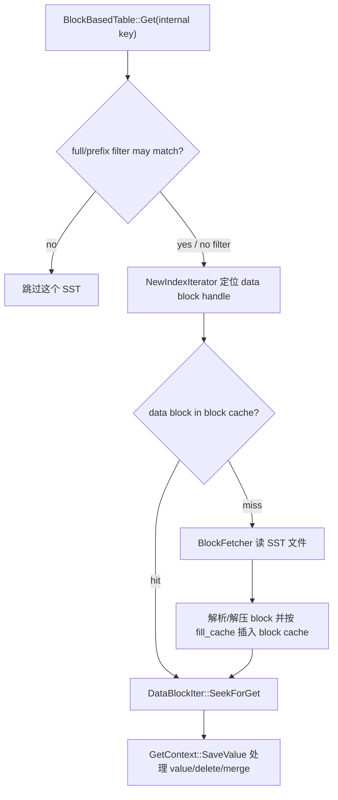
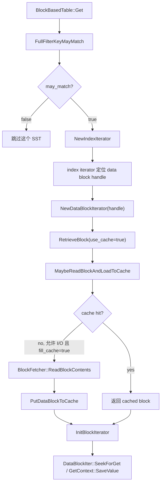
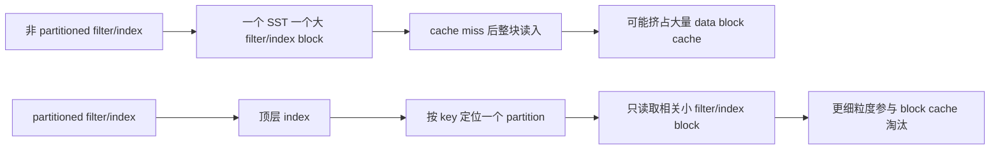

## 今日主题

- 主主题：`Block Cache / Bloom Filter`
- 副主题：`Prefix Bloom / Partitioned Index / Partitioned Filter`

Day 011 已经看过 `TableReader -> BlockBasedTable -> BlockFetcher -> FilePrefetchBuffer` 这一层磁盘读取骨架。Day 016 接着回答一个更贴近读性能的问题：

`一次 Get 或 Seek 进入某个 SST 后，RocksDB 如何尽量少读 block，读过的 block 又如何留在内存里复用？`

今天的主线不是重新讲读路径整体，而是把读路径里的四个优化点串起来：

1. `Bloom Filter`：先判断这个 SST 很可能没有目标 key/prefix，能跳过就跳过。
2. `Index`：如果不能跳过，定位目标 key 可能落在哪个 data block。
3. `Block Cache`：data/index/filter block 能命中内存就不读盘。
4. `Partitioned Index/Filter`：当 index/filter 自己太大时，把元数据也拆成小块按需缓存。

## 学习目标

- 讲清 block cache 缓存的对象是什么，不把它和 OS page cache、table cache 混在一起。
- 讲清 point lookup 中 filter、index、data block 的实际调用顺序。
- 讲清 `whole_key_filtering` 与 prefix bloom 的差异。
- 讲清 `partition_filters` 在当前源码中为什么会被要求配合 two-level index，以及这个要求的实现与历史边界。
- 从写入 SST 的构建端和读取 SST 的读取端同时看 filter/index 的形成与使用。

## 前置回顾

前面几天已经有三个基础：

- Day 008：SST 的 block-based table 由 data block、index block、filter block、properties 等组成。
- Day 009：`Version::Get()` 会找到可能重叠的 SST，再调用 `TableReader::Get()`。
- Day 011：`BlockBasedTable` 负责从 SST 文件读取 block，`BlockFetcher` 和 `FilePrefetchBuffer` 负责具体 I/O。

今天只看“进入一个 SST 以后怎样少读”。这和 compaction 的职责不同：compaction 是后台减少未来读放大的物理整理；block cache 和 filter/index 是前台读路径上的即时优化。

## 源码入口

本章主要读这些文件：

- `D:\program\rocksdb\include\rocksdb\table.h`
  - `BlockBasedTableOptions`
- `D:\program\rocksdb\include\rocksdb\options.h`
  - `ColumnFamilyOptions::prefix_extractor`
- `D:\program\rocksdb\include\rocksdb\filter_policy.h`
  - `FilterPolicy`
  - `NewBloomFilterPolicy(...)`
- `D:\program\rocksdb\include\rocksdb\cache.h`
  - `CacheEntryRole`
  - `LRUCacheOptions`
  - `HyperClockCacheOptions`
- `D:\program\rocksdb\table\block_based\block_based_table_reader.cc`
  - `BlockBasedTable::Get(...)`
  - `BlockBasedTable::FullFilterKeyMayMatch(...)`
  - `BlockBasedTable::PrefixRangeMayMatch(...)`
  - `BlockBasedTable::MaybeReadBlockAndLoadToCache(...)`
  - `BlockBasedTable::GetDataBlockFromCache(...)`
  - `BlockBasedTable::PutDataBlockToCache(...)`
  - `BlockBasedTable::CreateIndexReader(...)`
- `D:\program\rocksdb\table\block_based\full_filter_block.cc`
  - `FullFilterBlockReader::MayMatch(...)`
- `D:\program\rocksdb\table\block_based\partitioned_filter_block.cc`
  - `PartitionedFilterBlockBuilder`
  - `PartitionedFilterBlockReader`
- `D:\program\rocksdb\table\block_based\partitioned_index_reader.cc`
  - `PartitionIndexReader`
- `D:\program\rocksdb\table\block_based\block_based_table_builder.cc`
  - `CreateFilterBlockBuilder(...)`
  - `BlockBasedTableBuilder::Add(...)`
  - `BlockBasedTableBuilder::WriteFilterBlock(...)`
- `D:\program\rocksdb\table\block_based\filter_policy.cc`
  - `BloomFilterPolicy`
  - `BloomLikeFilterPolicy`

## 它解决什么问题

LSM 的读放大来自两个层面：

1. 一个 key 可能要查多个 level / 多个 SST。
2. 对每个 SST，如果没有任何剪枝，可能还要读 index/filter/data block。

Bloom filter 和 block cache 解决的是第二层问题：

- filter 的目标是“少进入 data block”：如果 filter 说一定不存在，就不用读 index 之后的 data block。
- index 的目标是“只读相关 data block”：把 key 映射到一个 block handle。
- cache 的目标是“读过的 block 不重复读盘”：命中 cache 时直接拿解析后的 block。
- partitioned index/filter 的目标是“元数据本身也别太大”：不要为了查一个 key 把几 MB 的 filter/index 整块读进 cache。

可以把一个 point lookup 的 SST 内路径简化为：



这里有一个很重要的边界：Bloom filter 只能回答“可能存在 / 一定不存在”。它不能返回 value，也不能证明“存在”。真正判断用户可见结果的仍然是 data block 里的 internal key/value 以及 `GetContext`。

## 它是怎么工作的

### 1. 配置层决定有哪些优化可用

`BlockBasedTableOptions` 把本章涉及的开关集中在一起：block cache、filter policy、whole-key filter、partition filter/index、metadata cache 等都在这里。

```cpp
// include/rocksdb/table.h::BlockBasedTableOptions
bool cache_index_and_filter_blocks = false;
bool cache_index_and_filter_blocks_with_high_priority = true;
bool pin_l0_filter_and_index_blocks_in_cache = false;
MetadataCacheOptions metadata_cache_options;

IndexType index_type = kBinarySearch;
bool no_block_cache = false;
std::shared_ptr<Cache> block_cache = nullptr;

bool partition_filters = false;
std::shared_ptr<const FilterPolicy> filter_policy = nullptr;
bool whole_key_filtering = true;
```

这几个字段对应的语义是：

- `block_cache`：缓存 block-based table 的 block，默认未显式设置时会创建内部 cache。
- `no_block_cache`：彻底禁用 block cache。
- `filter_policy`：不为空时才会构建/读取 filter，常见入口是 `NewBloomFilterPolicy(...)`。
- `whole_key_filtering`：filter 里放完整 user key；对 `Get` 很关键。
- `prefix_extractor`：如果配置了，就能把 key 映射为 prefix，支持 prefix bloom / prefix seek。
- `cache_index_and_filter_blocks`：控制 index/filter 这类元数据是否也走 block cache；否则 table reader 打开时会预加载并持有。
- `partition_filters`：把 full filter 拆成多个 filter partition；源码里要求配合 `kTwoLevelIndexSearch`。

`prefix_extractor` 不在 `BlockBasedTableOptions` 里，而在 CF options 里：

```cpp
// include/rocksdb/options.h::ColumnFamilyOptions::prefix_extractor
// 如果非空，把 key 分成连续的 prefix 组。
// 同一 prefix 的 key 必须在 comparator 顺序下连续，不能被其他 prefix 打断。
std::shared_ptr<const SliceTransform> prefix_extractor = nullptr;
```

这条“同 prefix 的 key 在排序上连续”是 prefix bloom 正确性的核心。如果 prefix 提取器和 comparator 不满足这个性质，filter 可能错误地跳过本该读取的数据。

### 2. Get 路径先查 filter，再查 index，最后查 data block

`BlockBasedTable::Get()` 是今天最重要的入口。它先拿 filter，再判断 `may_match`，只有 filter 没剪掉时才进入 index/data block。

```cpp
// table/block_based/block_based_table_reader.cc::BlockBasedTable::Get
FilterBlockReader* const filter =
    !skip_filters ? rep_->filter.get() : nullptr;

const bool may_match =
    FullFilterKeyMayMatch(filter, key, prefix_extractor, get_context,
                          &lookup_context, read_options);

if (may_match) {
  auto iiter = NewIndexIterator(read_options, need_upper_bound_check,
                                &iiter_on_stack, get_context,
                                &lookup_context);

  for (iiter->Seek(key); iiter->Valid() && !done; iiter->Next()) {
    IndexValue v = iiter->value();
    DataBlockIter biter;
    NewDataBlockIterator<DataBlockIter>(
        read_options, v.handle, &biter, BlockType::kData, get_context,
        &lookup_data_block_context, nullptr, false, false, tmp_status,
        true);

    bool may_exist = biter.SeekForGet(key);
    ...
    get_context->SaveValue(parsed_key, biter.value(), &matched,
                           &read_status, ...);
  }
}
```

这段代码支撑三个结论：

- filter 是 SST 级剪枝入口，不是 data block 内搜索。
- index iterator 返回的是 `IndexValue`，里面有 data block 的 `BlockHandle`。
- block cache 真正参与的是 `NewDataBlockIterator(...)` 下面的 `RetrieveBlock / MaybeReadBlockAndLoadToCache` 路径。

### 3. whole-key bloom 与 prefix bloom 是同一个 filter reader 的不同查询方式

`FullFilterKeyMayMatch()` 里可以看到：如果 `whole_key_filtering` 为 true，按完整 user key 查；否则在 prefix extractor 没变且 key 在 prefix domain 内时，按 prefix 查。

```cpp
// table/block_based/block_based_table_reader.cc::BlockBasedTable::FullFilterKeyMayMatch
if (rep_->whole_key_filtering) {
  may_match = filter->KeyMayMatch(user_key_without_ts, const_ikey_ptr,
                                  get_context, lookup_context, read_options);
  ...
} else if (!PrefixExtractorChanged(prefix_extractor) &&
           prefix_extractor->InDomain(user_key_without_ts)) {
  may_match = filter->PrefixMayMatch(
      prefix_extractor->Transform(user_key_without_ts), const_ikey_ptr,
      get_context, lookup_context, read_options);
  ...
}
```

这里容易误解：prefix bloom 不是“更高级的 Get bloom”。它牺牲了粒度，只能说“这个 prefix 里可能有东西”。它对 prefix seek / prefix range 很有价值，但对单点 Get 来说，如果整个 prefix 下很多 key 共用一个 filter entry，误判概率和读取范围都可能变大。

### 4. filter 读不到时默认保守放行

`FullFilterBlockReader::MayMatch()` 是实际查 filter bits 的地方。它的失败策略很关键：读 filter block 出错或没有 reader 时，返回 true，也就是不剪枝。

```cpp
// table/block_based/full_filter_block.cc::FullFilterBlockReader::MayMatch
CachableEntry<ParsedFullFilterBlock> filter_block;

const Status s = GetOrReadFilterBlock(get_context, lookup_context,
                                      &filter_block, read_options);
if (!s.ok()) {
  IGNORE_STATUS_IF_ERROR(s);
  return true;
}

FilterBitsReader* const filter_bits_reader =
    filter_block.GetValue()->filter_bits_reader();

if (filter_bits_reader) {
  if (filter_bits_reader->MayMatch(entry)) {
    return true;
  } else {
    return false;
  }
}
return true;
```

这说明 filter 是性能结构，不是正确性结构：

- `false`：可以安全跳过，因为 Bloom filter 设计保证已加入的 key 不应被判断为不存在。
- `true`：只是可能存在，还要读 index/data block。
- filter 坏了、缺了、读不到：不能因为性能结构不可用就返回 not found，只能保守继续查。

### 5. block cache 缓存的是解析后的 block，并按文件标识和 block offset 生成 key

data/index/filter 这些 block 最终都走类似的 cache 访问路径。`MaybeReadBlockAndLoadToCache()` 先用 `rep_->base_cache_key` 和 block handle 里的 offset 生成 cache key，再查 block cache；miss 且允许 I/O 时再读文件。

```cpp
// table/block_based/block_based_table_reader.cc::BlockBasedTable::MaybeReadBlockAndLoadToCache
const bool no_io = (ro.read_tier == kBlockCacheTier);
BlockCacheInterface<TBlocklike> block_cache{
    rep_->table_options.block_cache.get()};

if (block_cache) {
  key_data = GetCacheKey(rep_->base_cache_key, handle);
  key = key_data.AsSlice();

  if (!contents && use_block_cache_for_lookup) {
    s = GetDataBlockFromCache(key, block_cache, out_parsed_block,
                              get_context, decomp);
    if (out_parsed_block->GetValue() ||
        out_parsed_block->GetCacheHandle()) {
      is_cache_hit = true;
    }
  }

  if (out_parsed_block->GetValue() == nullptr &&
      out_parsed_block->GetCacheHandle() == nullptr &&
      !no_io && ro.fill_cache) {
    BlockFetcher block_fetcher(...);
    s = block_fetcher.ReadBlockContents();
    ...
    s = PutDataBlockToCache(key, block_cache, out_parsed_block,
                            std::move(uncomp_contents),
                            std::move(comp_contents), contents_comp_type,
                            decomp, ...);
  }
}
```

`GetCacheKey()` 的实现更精确地说明了 cache key 的组成：`rep_->base_cache_key` 是 SST 级文件标识，`BlockHandle` 中真正参与的是 `offset()`，而不是完整 handle。

```cpp
// table/block_based/block_based_table_reader.cc::BlockBasedTable::GetCacheKey
CacheKey BlockBasedTable::GetCacheKey(const OffsetableCacheKey& base_cache_key,
                                      const BlockHandle& handle) {
  return base_cache_key.WithOffset(handle.offset() >> 2);
}
```

`MaybeReadBlockAndLoadToCache()` 本身不是 `Get` 的入口，而是 table reader 层的“按一个 block handle 取 block”的 cache 分支。常见 point Get 链路可以简化成：



对应源码点：

- `BlockBasedTable::Get()` 先查 filter，随后用 `NewIndexIterator()` 找到候选 data block 的 `BlockHandle`。
- `BlockBasedTable::Get()` 对每个候选 handle 调 `NewDataBlockIterator(..., v.handle, BlockType::kData, ...)`。
- `NewDataBlockIterator()` 先处理压缩字典，再调用 `RetrieveBlock(..., use_cache=true, ...)`，拿到 `CachableEntry<Block>` 后用 `InitBlockIterator()` 初始化真正的 data block iterator。
- `RetrieveBlock()` 是更稳的外层封装：它先尝试 `MaybeReadBlockAndLoadToCache()`；如果 cache 没有返回 block，并且 `read_tier` 允许 I/O，就直接 `ReadAndParseBlockFromFile()`，得到一个不一定进入 cache 的 owned block。

所以两者的分工是：

- `RetrieveBlock()`：保证“我要拿到这个 block”，必要时绕过 cache 直接读文件。
- `MaybeReadBlockAndLoadToCache()`：只负责“如果能通过 block cache 路径拿到或填入这个 block，就处理 cache lookup / file read / cache insert”。

`MaybeReadBlockAndLoadToCache()` 内部可以按输入状态分成几种情况：

1. `contents == nullptr` 且允许查 cache：用 `GetCacheKey(rep_->base_cache_key, handle)` 生成 cache key，先调 `GetDataBlockFromCache()`。
2. cache miss、`read_tier != kBlockCacheTier` 且 `ro.fill_cache=true`：用 `BlockFetcher::ReadBlockContents()` 读文件，再 `PutDataBlockToCache()` 插入 cache。
3. `contents != nullptr`：说明调用者已经读到了原始 block contents，此函数跳过 cache lookup 和文件读，只在允许填充 cache 时把 contents 解析后放入 cache。
4. `read_tier == kBlockCacheTier`：不允许阻塞 I/O。cache miss 时这个函数不会读文件；外层 `RetrieveBlock()` 会返回 `Status::Incomplete("no blocking io")`，point Get 会把结果标成 may exist，而不是错误返回 not found。
5. `ro.fill_cache=false`：miss 后不在这个函数里读并插入 cache；外层可以直接读文件并把 block 作为 owned value 交给 iterator，常见于大扫描避免污染 cache。
6. `use_block_cache_for_lookup=false`：跳过本次 cache lookup，但如果后续读了文件且 `fill_cache=true`，仍然可以插入 cache。异步或预取路径会用这个开关避免重复 lookup。

它也不只服务 data block。index/filter 这些 metadata block 最终也走同一套“handle -> cache key -> cache / file -> CachableEntry”的模式：

- index block：`IndexReaderCommon::ReadIndexBlock()` 调 `RetrieveBlock()`。
- full filter block：`FilterBlockReaderCommon::ReadFilterBlock()` 调 `RetrieveBlock()`。
- partitioned filter：`PartitionedFilterBlockReader::GetFilterPartitionBlock()` 调 `RetrieveBlock()`；预取多个 filter partition 时也会直接调 `MaybeReadBlockAndLoadToCache()`。
- partitioned index：预取二级 index partition 时会直接调 `MaybeReadBlockAndLoadToCache()`。

这里有几个关键点：

- cache key 不是 user key，而是“这个 SST 的 base cache key + block offset”；具体是 `rep_->base_cache_key.WithOffset(handle.offset() >> 2)`。
- `BlockHandle` 里的 `size` 不参与 cache key；它用于读 block contents，而不是区分 cache entry。
- `read_tier == kBlockCacheTier` 时不做阻塞 I/O；cache miss 会返回 incomplete 或保守处理。
- `fill_cache` 会影响 miss 后是否插入 cache。长扫描常用 `fill_cache=false` 避免污染缓存。
- cache 里存的是解析后的 block-like 对象，例如 data block、index block、filter block，而不是 DB API 层面的 key/value。

`GetDataBlockFromCache()` 与 `PutDataBlockToCache()` 分别负责 hit/miss 后的取出和插入：

```cpp
// table/block_based/block_based_table_reader.cc::BlockBasedTable::GetDataBlockFromCache / PutDataBlockToCache
cache_handle = block_cache.LookupFull(cache_key, &rep_->create_context,
                                      GetCachePriority<TBlocklike>(),
                                      statistics,
                                      rep_->ioptions.lowest_used_cache_tier);
if (cache_handle) {
  TBlocklike* value = block_cache.Value(cache_handle);
  out_parsed_block->SetCachedValue(value, block_cache.get(), cache_handle);
  return s;
}

...

rep_->create_context.Create(&block_holder,
                            std::move(uncompressed_block_contents));
size_t charge = block_holder->ApproximateMemoryUsage();
s = block_cache.InsertFull(cache_key, block_holder.get(), charge,
                           &cache_handle, GetCachePriority<TBlocklike>(),
                           rep_->ioptions.lowest_used_cache_tier,
                           compressed_block_contents.data, block_comp_type);
```

`charge` 是 cache 淘汰和容量控制里的核心概念：插入 cache 不是按“一个对象”计数，而是按近似内存占用计费。

### 6. 构建 SST 时，filter 跟着 key 一起生成

读路径上看到的 filter 不是运行时临时扫 SST 得来的，而是在 table builder 写 SST 时构建并写成 meta block。

```cpp
// table/block_based/block_based_table_builder.cc::CreateFilterBlockBuilder
FilterBitsBuilder* filter_bits_builder =
    BloomFilterPolicy::GetBuilderFromContext(context);
if (filter_bits_builder == nullptr) {
  return nullptr;
} else {
  if (table_opt.partition_filters) {
    return new PartitionedFilterBlockBuilder(
        mopt.prefix_extractor.get(), table_opt.whole_key_filtering,
        filter_bits_builder, ..., p_index_builder, partition_size, ...);
  } else {
    return new FullFilterBlockBuilder(mopt.prefix_extractor.get(),
                                      table_opt.whole_key_filtering,
                                      filter_bits_builder);
  }
}
```

每加入一个普通 point key，builder 会把去掉 timestamp 的 user key 加进 filter builder：

```cpp
// table/block_based/block_based_table_builder.cc::BlockBasedTableBuilder::Add
if (r->filter_builder != nullptr) {
  r->filter_builder->AddWithPrevKey(
      ExtractUserKeyAndStripTimestamp(ikey, r->ts_sz),
      r->last_ikey.empty()
          ? Slice{}
          : ExtractUserKeyAndStripTimestamp(r->last_ikey, r->ts_sz));
}

r->data_block.AddWithLastKey(ikey, value, r->last_ikey);
r->last_ikey.assign(ikey.data(), ikey.size());
```

最后 `WriteFilterBlock()` 会把 filter 写入 SST 的 meta block，并在 meta index 里登记名字到 handle 的映射：

```cpp
// table/block_based/block_based_table_builder.cc::BlockBasedTableBuilder::WriteFilterBlock
while (LIKELY(ok()) && s.IsIncomplete()) {
  Slice filter_content;
  s = rep_->filter_builder->Finish(filter_block_handle, &filter_content,
                                   &filter_owner);

  BlockType btype = is_partitioned_filter && s.ok()
                        ? BlockType::kFilterPartitionIndex
                        : BlockType::kFilter;
  WriteMaybeCompressedBlock(filter_content, kNoCompression,
                            &filter_block_handle, btype);
}

std::string key =
    is_partitioned_filter ? BlockBasedTable::kPartitionedFilterBlockPrefix
                          : BlockBasedTable::kFullFilterBlockPrefix;
key.append(rep_->table_options.filter_policy->CompatibilityName());
meta_index_builder->Add(key, filter_block_handle);
```

所以 filter 的生命周期是：

`Flush/Compaction 写新 SST -> TableBuilder 收集 key -> 写 filter meta block -> Reader 打开 SST 找到 filter_handle -> Get/Iterator 查询 filter`。

### 7. partitioned filter 是先查顶层 filter index，再按需读一个 filter partition

partitioned filter 的读取端很直观：先从顶层 filter partition index 找到对应 partition 的 `BlockHandle`，再把这个 partition 读出来，用 full filter 的逻辑查它。

```cpp
// table/block_based/partitioned_filter_block.cc::PartitionedFilterBlockReader::MayMatch
CachableEntry<Block_kFilterPartitionIndex> filter_block;
Status s = GetOrReadFilterBlock(get_context, lookup_context,
                                &filter_block, read_options);
if (!s.ok()) {
  return true;
}

auto filter_handle = GetFilterPartitionHandle(filter_block, *const_ikey_ptr);
if (filter_handle.size() == 0) {
  return false;
}

CachableEntry<ParsedFullFilterBlock> filter_partition_block;
s = GetFilterPartitionBlock(nullptr, filter_handle, get_context,
                            lookup_context, read_options,
                            &filter_partition_block);
if (!s.ok()) {
  return true;
}

FullFilterBlockReader filter_partition(table(),
                                       std::move(filter_partition_block));
return (filter_partition.*filter_function)(slice, const_ikey_ptr,
                                           get_context, lookup_context,
                                           read_options);
```

这段代码说明：

- partitioned filter 顶层也是一个 block，角色是 `kFilterPartitionIndex`。
- 真正的 Bloom/Ribbon bits 在每个 filter partition 里。
- 查询只需要读取命中的那个 partition，而不是整块大 filter。
- 读不到 partition 时仍然保守返回 true。

构建端也能看到它如何按目标大小切分：

```cpp
// table/block_based/partitioned_filter_block.cc::PartitionedFilterBlockBuilder::AddImpl
bool cut = DecideCutAFilterBlock();
if (prefix_extractor() && prefix_extractor()->InDomain(key_without_ts)) {
  Slice prefix = prefix_extractor()->Transform(key_without_ts);
  if (cut) {
    CutAFilterBlock(&key_without_ts, &prefix, prev_key_without_ts);
  }
  if (whole_key_filtering()) {
    filter_bits_builder_->AddKeyAndAlt(key_without_ts, prefix);
  } else {
    filter_bits_builder_->AddKey(prefix);
  }
} else {
  if (cut) {
    CutAFilterBlock(&key_without_ts, nullptr, prev_key_without_ts);
  }
  if (whole_key_filtering()) {
    filter_bits_builder_->AddKey(key_without_ts);
  }
}
```

`AddKeyAndAlt(key, prefix)` 说明在某些配置下一个 filter 同时需要支持 whole-key 与 prefix 语义。不是所有 prefix bloom 都是单独的一套结构，具体取决于 builder 和 table options。

### 8. partitioned index 是 two-level index

普通 index 是一个 index block；partitioned index 是顶层 index 指向多个二级 index partition。reader 创建 index reader 时由 `index_type` 决定走哪种实现。

```cpp
// table/block_based/block_based_table_reader.cc::BlockBasedTable::CreateIndexReader
switch (rep_->index_type) {
  case BlockBasedTableOptions::kTwoLevelIndexSearch: {
    return PartitionIndexReader::Create(this, ro, prefetch_buffer, use_cache,
                                        prefetch, pin, lookup_context,
                                        index_reader);
  }
  case BlockBasedTableOptions::kBinarySearch:
  case BlockBasedTableOptions::kBinarySearchWithFirstKey: {
    return BinarySearchIndexReader::Create(this, ro, prefetch_buffer,
                                           use_cache, prefetch, pin,
                                           lookup_context, index_reader);
  }
  case BlockBasedTableOptions::kHashSearch: {
    ...
  }
}
```

`PartitionIndexReader::NewIterator()` 再把顶层 index 包成 two-level iterator：

```cpp
// table/block_based/partitioned_index_reader.cc::PartitionIndexReader::NewIterator
CachableEntry<Block> index_block;
const Status s = GetOrReadIndexBlock(get_context, lookup_context,
                                     &index_block, read_options);
...

it = new PartitionedIndexIterator(
    table(), ro, *internal_comparator(), std::move(index_iter),
    lookup_context ? lookup_context->caller
                   : TableReaderCaller::kUncategorized);

index_block.TransferTo(it);
return it;
```

`BlockBasedTableFactory::InitializeOptions()` 里还有一个配置约束：

```cpp
// table/block_based/block_based_table_factory.cc::BlockBasedTableFactory::InitializeOptions
if (table_options_.partition_filters &&
    table_options_.index_type !=
        BlockBasedTableOptions::kTwoLevelIndexSearch) {
  table_options_.partition_filters = false;
}
```

这解释了当前源码为什么没有把 `partition_filters` 做成完全孤立的开关。partitioned filter 自己需要一个顶层 filter partition index 来定位 filter partition；但这并不天然要求 table-level index 也必须分区。RocksDB 当前要求它和 `kTwoLevelIndexSearch` 一起使用，更多是构建端和历史耦合带来的实现限制，而不是 filter 语义上的必然条件。

## 关键数据结构与实现点

### Block Cache

block cache 的 key 不是用户 key，而是 SST 级 `rep_->base_cache_key` 加上 block offset。cache entry 按 `CacheEntryRole` 区分角色：

- `kDataBlock`
- `kFilterBlock`
- `kFilterMetaBlock`
- `kIndexBlock`
- `kOtherBlock`
- `kBlockBasedTableReader`

`table/block_based/block_cache.h` 又把同一个 `Block` 包装成不同“block-like”类型，例如 `Block_kData`、`Block_kIndex`、`Block_kFilterPartitionIndex`，这样 typed cache 能知道不同 block 的角色、优先级和解析方式。

### Bloom Filter / FilterPolicy

`FilterPolicy` 负责构建和读取 filter bits。`NewBloomFilterPolicy(bits_per_key)` 是常用入口。当前源码里 `use_block_based_builder` 参数已经被忽略，public API 不再暴露旧的 block-based filter；`format_version >= 5` 时会用 fast local Bloom builder。

这意味着今天文章里的 “full filter” 不是“把每个 data block 各建一个小 filter”的旧格式，而是 SST 级 full filter，或者它的 partitioned 形式。

### Prefix Extractor

prefix bloom 的正确性依赖 `prefix_extractor` 与 comparator 的一致性。源码注释要求同一 prefix 的 key 在 comparator 顺序下必须连续。对 iterator 来说，`auto_prefix_mode`、`prefix_same_as_start`、`iterate_upper_bound` 还会影响是否能安全使用 prefix filter。

### Partitioned Index / Filter

partitioned index/filter 的核心思路是：

- 顶层小 index 常驻或可缓存；
- 二级 index/filter partition 按需读；
- 读一个 key 只加载相关 partition；
- 减少大元数据块挤占 data block cache 的概率。

RocksDB 自带的 `docs/_posts/2017-05-12-partitioned-index-filter.markdown` 也把问题讲得很直接：大 SST 的 index/filter 可能达到 MB 级，而 data block 常见只有 KB 级；如果每次 miss 都把几 MB 元数据塞进 block cache，会伤害 data block 的命中率。

## 源码细读

### 读路径顺序：filter 是第一道剪枝，不是最终答案

从 `BlockBasedTable::Get()` 的调用顺序看，filter 在 index/data block 之前。只有 `may_match` 为 true 才继续定位 block。这个顺序对 LSM 很重要：如果一个 key 要探测多个 SST，filter 能让大量“不含这个 key 的 SST”不进入 data block。

但 filter 的 `true` 不能解释为“key 存在”。Bloom filter 有 false positive；prefix filter 的 `true` 更只是“这个 prefix 可能存在”。最终还是要 `DataBlockIter::SeekForGet()` 和 `GetContext::SaveValue()` 处理 internal key、sequence、delete、merge。

### cache 命中的是 block，不是 key

`BlockBasedTable::MaybeReadBlockAndLoadToCache()` 的核心是按 block handle 查 cache。对一个热点 key 来说，cache 命中通常表现为“它所在 data block 已经在 cache 中”，同一个 block 里的邻近 key 会一起受益。

这也是为什么 block size、压缩、hash index、prefix seek、scan 模式会影响缓存效果：

- block 太大：一次 miss 读入更多无关数据，占 cache 也更大。
- block 太小：index 更大，随机读次数可能增加。
- `fill_cache=false`：适合大扫描，避免把一次性数据挤掉热点 block。
- `cache_index_and_filter_blocks=true`：元数据也参与 cache 竞争，因此需要 high priority / pin / partitioned metadata 这些配套策略。

### filter 构建要看 key，也要看 table options

`CreateFilterBlockBuilder()` 同时接收 `table_options` 和 `moptions.prefix_extractor`。这说明 filter 的格式和内容不是只由 `FilterPolicy` 决定：

- `filter_policy` 决定用 Bloom/Ribbon 等具体 bits builder。
- `whole_key_filtering` 决定是否加入完整 key。
- `prefix_extractor` 决定是否加入 prefix。
- `partition_filters` 决定输出一个 full filter block，还是多个 filter partition 加一个顶层 filter index。
- `format_version` 会影响 Bloom filter builder 的实现选择。

### partitioned metadata 解决的是内存局部性

partitioned index/filter 的目的不是减少 Bloom false positive，也不是改变 key 的语义。它解决的是元数据太大时的缓存局部性：



这也解释了为什么它适合大 DB / 大 SST / 内存相对紧张的场景。

## 今日问题与讨论

### 我的问题

#### 问题 1：Block Cache 和 OS Page Cache 是不是一回事？

- 简答：
  - 不是。OS page cache 缓存的是文件页，RocksDB block cache 缓存的是 block-based table 解析后的 block-like 对象，带有 block type、charge、cache priority、secondary cache helper 等 RocksDB 自己的语义。
- 源码依据：
  - `D:\program\rocksdb\table\block_based\block_based_table_reader.cc::MaybeReadBlockAndLoadToCache(...)`
  - `D:\program\rocksdb\table\block_based\block_cache.h`
  - `D:\program\rocksdb\include\rocksdb\cache.h`
- 当前结论：
  - direct I/O、mmap、OS page cache 会影响文件读路径；block cache 是 RocksDB 内部的逻辑 block 缓存。两者可以同时存在，也可以通过 direct I/O 等配置减少 OS page cache 的参与。
- 是否需要后续回看：
  - 是。参数调优章节需要回看 direct I/O、readahead、block cache size 的组合。

#### 问题 2：Bloom filter 返回 true 时能不能直接认为 key 存在？

- 简答：
  - 不能。Bloom filter 的 true 只是 may match。只有 false 才能用于跳过 SST 或跳过 key。
- 源码依据：
  - `D:\program\rocksdb\table\block_based\full_filter_block.cc::FullFilterBlockReader::MayMatch(...)`
  - `D:\program\rocksdb\table\block_based\block_based_table_reader.cc::BlockBasedTable::Get(...)`
- 当前结论：
  - filter 是剪枝结构，不是查询结果结构。返回 true 后还要走 index/data block 和 `GetContext`。
- 是否需要后续回看：
  - 否。当前边界清楚。

#### 问题 3：prefix bloom 为什么要求同 prefix 的 key 连续？

- 简答：
  - 因为 iterator / range 语义要能根据 prefix 判断一个范围内是否可能存在 key。如果相同 prefix 的 key 在排序中不连续，filter 说某个 prefix 不存在就可能错误跳过中间被打断的真实数据。
- 源码依据：
  - `D:\program\rocksdb\include\rocksdb\options.h::ColumnFamilyOptions::prefix_extractor`
  - `D:\program\rocksdb\table\block_based\filter_block_reader_common.cc::RangeMayExist(...)`
  - `D:\program\rocksdb\table\block_based\block_based_table_reader.cc::PrefixRangeMayMatch(...)`
- 当前结论：
  - prefix bloom 是 comparator / prefix_extractor / iterator bounds 三者共同成立时的优化，不是单独设置一个 extractor 就永远安全。
- 是否需要后续回看：
  - 是。Iterator 与 `auto_prefix_mode` 的细节还可以在高级读路径里回看。

#### 问题 4：partitioned filter 和普通 full filter 的差别是什么？

- 简答：
  - 普通 full filter 是一个 SST 一个大 filter block；partitioned filter 把 filter bits 切成多个小 partition，并用一个顶层 filter partition index 找到对应 partition。
- 源码依据：
  - `D:\program\rocksdb\table\block_based\partitioned_filter_block.cc::PartitionedFilterBlockBuilder::Finish(...)`
  - `D:\program\rocksdb\table\block_based\partitioned_filter_block.cc::PartitionedFilterBlockReader::MayMatch(...)`
  - `D:\program\rocksdb\table\block_based\block_based_table_builder.cc::WriteFilterBlock(...)`
- 当前结论：
  - partitioned filter 的核心收益是缓存粒度变小，不是改变 Bloom filter 的真假语义。
- 是否需要后续回看：
  - 是。后续参数调优时可以结合 `metadata_block_size` 和 block cache entry stats 回看。

#### 问题 5：`FullFilterKeyMayMatch()` 为什么不能总是用 prefix filter？

- 简答：
  - 不能无条件用“当前 `prefix_extractor`”去查 prefix filter。filter 是构建 SST 时按当时的 `prefix_extractor` 写进去的；如果读时 extractor 变了，`Transform()` 得到的 prefix 语义可能不同，Bloom 返回 false 就可能造成错误的 NotFound。源码里的 FIXME 不是说“总是用 prefix 过滤”，而是说 `Get()` 不应该依赖当前 options 里的 extractor，应该使用 SST 记录或恢复出的 `table_prefix_extractor`。
- 源码依据：
  - `D:\program\rocksdb\table\block_based\block_based_table_reader.cc::BlockBasedTable::FullFilterKeyMayMatch(...)`
  - `D:\program\rocksdb\table\block_based\block_based_table_reader.cc::BlockBasedTable::PrefixExtractorChanged(...)`
  - `D:\program\rocksdb\table\block_based\block_based_table_reader.cc::PrefixExtractorChangedHelper(...)`
  - `D:\program\rocksdb\table\block_based\full_filter_block.cc::FullFilterBlockBuilder::Add(...)`
  - `D:\program\rocksdb\table\block_based\block_based_table_builder.cc::CreateFilterBlockBuilder(...)`
- 当前结论：
  - 构建端 `FullFilterBlockBuilder::Add()` 会按 table options 写入不同内容：`whole_key_filtering=true` 时可以加入完整 key，也可能把 prefix 作为 alt 加进去；`whole_key_filtering=false` 时只加入 prefix，且 out-of-domain 的 key 不会加入 prefix filter。
  - 读取端 `FullFilterKeyMayMatch()` 先判断 `rep_->whole_key_filtering`，能用完整 key filter 时优先用 `KeyMayMatch()`，这对 point Get 更精确。
  - 只有在 `whole_key_filtering=false`、`!PrefixExtractorChanged(prefix_extractor)` 且 `prefix_extractor->InDomain(user_key_without_ts)` 同时成立时，才安全使用 `PrefixMayMatch()`。
  - 如果 extractor 已变、key 不在 extractor domain 内，或者旧表缺少可验证的 prefix extractor 信息，代码必须保守保留 `may_match=true`，继续读 index/data block，不能让 Bloom false 变成错误剪枝。
- 是否需要后续回看：
  - 是。Iterator / `auto_prefix_mode` 章节可以回看 `PrefixRangeMayMatch()`，它已经更接近 FIXME 的方向：优先使用 `rep_->table_prefix_extractor`，而不是盲目依赖当前 mutable options。

#### 问题 6：flush 构建 SST 时崩溃，已经写了一半的 data/filter/index 元数据怎么办？

- 简答：
  - 你的判断基本正确：flush 生成的 SST 只有在写完、sync/close、校验可读，并且对应 `VersionEdit` 成功写入 MANIFEST 之后，才算进入 DB 的当前版本。崩溃发生在 MANIFEST 提交之前时，写了一半或写完但没提交的 SST 都不是 live file；恢复时不会相信它里面的 data block、filter、index 元数据，而是按 MANIFEST 里的版本和仍需保留的 WAL 重建状态，这些孤儿 SST 后续会被 obsolete-file 清理逻辑删除。
- 源码依据：
  - `D:\program\rocksdb\db\flush_job.cc::FlushJob::PickMemTable()`：`edit_->SetLogNumber(max_next_log_number)` 记录 flush 成功后哪些 WAL 可以不再用于 recovery，但这只是准备 edit。
  - `D:\program\rocksdb\db\flush_job.cc::FlushJob::WriteLevel0Table()`：先调用 `BuildTable(...)` 生成 SST；只有 `s.ok()` 且 `meta_.fd.GetFileSize() > 0` 时才 `edit_->AddFile(...)`。
  - `D:\program\rocksdb\db\builder.cc::BuildTable(...)`：table builder 写 data/index/filter/meta block，随后 `builder->Finish()`、`file_writer->Sync()`、`file_writer->Close()`，并用 table cache 打开新表做可读性校验；失败或空表时会删除输出文件。
  - `D:\program\rocksdb\db\memtable_list.cc::MemTableList::TryInstallMemtableFlushResults(...)`：flush 完成后才把 memtable 的 `VersionEdit` 交给 `VersionSet::LogAndApply(...)`。
  - `D:\program\rocksdb\db\version_set.cc::VersionSet::LogAndApply(...)`：把 `VersionEdit` 写入 MANIFEST 并 sync，成功后才安装新 Version、推进 column family 的 log number / min log number。
  - `D:\program\rocksdb\db\db_impl\db_impl_open.cc::DBImpl::ProcessLogFiles(...)`：恢复时根据 MANIFEST 中的 log number / min WAL number 选择需要重放的 WAL。
- 当前结论：
  - 崩溃点 1：SST 写到一半。文件可能存在，但没有完整 footer / metaindex / properties / filter / index，也没有进入 MANIFEST。恢复时它不是 live file，不能参与读；对应写入仍在 WAL 覆盖范围内，需要通过 WAL replay 回到 memtable，再重新 flush。
  - 崩溃点 2：SST 已经写完并 sync/close，但还没 `LogAndApply()` 成功。这个 SST 物理上可能是完整的，但逻辑上仍未提交。恢复仍以 MANIFEST 为准，忽略这个孤儿 SST；WAL 仍不能被当作 obsolete，因为 column family 的 log number / DB 的 min log number 还没有被持久推进。
  - 崩溃点 3：`LogAndApply()` 已成功写入并 sync MANIFEST。这个 SST 已经是当前版本的一部分；恢复时从 MANIFEST 找到它，直接使用 SST 内持久化的 index/filter/properties，不需要根据 WAL 重建这些 filter 元数据。
  - 所以 filter/index 元数据不是单独恢复的。它们要么跟完整 SST 一起提交，要么跟半成品 SST 一起被抛弃。
  - 这个结论依赖 WAL 持久性边界：如果写入时 `disableWAL=true`，或者系统断电时 WAL 本身没有被同步到持久介质，那么对应写入本来就不在可恢复保证内；这不是 filter 元数据丢失的问题，而是 WAL durability 配置问题。
- 是否需要后续回看：
  - 是。恢复章节可以专门看 `VersionSet::Recover()`、`DBImpl::ProcessLogFiles()`、`WriteLevel0TableForRecovery()`，把 MANIFEST、WAL replay、obsolete file 清理连起来。

#### 问题 7：未提交或半写入的 SST 垃圾文件如何被识别和清理？

- 简答：
  - 清理不是靠打开每个 SST 检查它是否完整，而是靠“文件编号是否属于 live set”来判断。MANIFEST 恢复出的当前 Version 会给出所有 live SST 文件号；目录 full scan 会列出 DB 目录里的所有 table 文件。凡是不在 live set、也不在当前 pending output 保护范围内的 table file，都会被视为 obsolete，交给 `PurgeObsoleteFiles()` 删除或调度删除。
- 源码依据：
  - `D:\program\rocksdb\db\builder.cc::BuildTable(...)`：进程没崩溃但构建失败时，会在失败分支直接 `DeleteFile(fname, ...)`，并释放 table cache 中可能残留的 entry。
  - `D:\program\rocksdb\db\db_impl\db_impl_open.cc::DBImpl::Open(...)`：恢复完成后调用 `DeleteObsoleteFiles()`，这会做一次 full scan。
  - `D:\program\rocksdb\db\db_impl\db_impl_files.cc::DBImpl::FindObsoleteFiles(...)`：full scan 时先用 `versions_->AddLiveFiles(...)` 收集 MANIFEST 当前版本引用的 live SST，再用 `GetChildren(...)` 枚举目录中的候选文件。
  - `D:\program\rocksdb\db\db_impl\db_impl_files.cc::DBImpl::PurgeObsoleteFiles(...)`：对 `kTableFile`，保留条件是 `sst_live_set.find(number) != sst_live_set.end() || number >= state.min_pending_output`；否则会 evict table cache 并删除文件。
  - `D:\program\rocksdb\db\db_impl\db_impl.cc::DBImpl::CaptureCurrentFileNumberInPendingOutputs()`：正在运行的 flush/compaction 会把当前 next file number 放进 `pending_outputs_`，让 obsolete-file full scan 不误删正在生成的输出。
  - `D:\program\rocksdb\db\db_impl\db_impl_files.cc::DBImpl::MinObsoleteSstNumberToKeep()`：如果存在 pending output，返回最小 pending file number；否则返回 `uint64_t::max()`。
- 当前结论：
  - 进程没崩溃、只是 `BuildTable()` 返回失败：`BuildTable()` 会尽量删除刚创建的 SST / blob 文件，不等到恢复流程。
  - 进程崩溃在 SST 半写阶段：重启后内存里的 `pending_outputs_` 已经不存在，MANIFEST 里也没有这个 file number。`DeleteObsoleteFiles()` full scan 会看到这个文件名，但它不在 `sst_live_set` 中，因此会被当作 obsolete table file 删除。它是否有完整 footer 并不重要，因为根本不会作为 live SST 打开。
  - 进程崩溃在 SST 写完但 MANIFEST 未提交阶段：处理方式相同。这个文件物理上可能完整，但不在 MANIFEST live set 中，所以逻辑上不是 DB 状态的一部分，也会被清理。
  - 正常运行时为什么不会误删正在写的 SST：flush/compaction 创建输出前会把当前 file number 放入 `pending_outputs_`。full scan 删除 table file 时会保留 `number >= state.min_pending_output` 的文件，直到任务释放 pending output 保护。
  - 如果 MANIFEST 写入状态不明确但进程没有崩溃，RocksDB 还有 quarantine 机制：`JobContext::files_to_quarantine` 中的文件号会被 `PurgeObsoleteFiles()` 跳过，避免过早删除 commit 状态不清的 SST / blob / manifest。
- 是否需要后续回看：
  - 是。恢复章节可以把 `pending_outputs_`、`files_to_quarantine`、`DeleteScheduler` 和 `SstFileManager` 一起看；它们分别对应“别误删正在写的文件”“别误删状态不明的文件”“怎么实际删除或限速删除”。

#### 问题 8：partitioned filter 是在普通 filter block 之外额外写一份吗？

- 简答：
  - 不是。`partition_filters=true` 时，RocksDB 不会再额外写一份普通 full filter。它会把 filter 的组织方式从“一个 SST 一个 full filter block”换成“多个 filter partition block + 一个顶层 filter partition index block”。metaindex 里记录的是 partitioned filter 的顶层 index handle，读的时候先读顶层 index，再定位并读取目标 filter partition。
- 源码依据：
  - `D:\program\rocksdb\table\block_based\block_based_table_builder.cc::CreateFilterBlockBuilder(...)`：`partition_filters=true` 时创建 `PartitionedFilterBlockBuilder`，否则创建 `FullFilterBlockBuilder`。
  - `D:\program\rocksdb\table\block_based\partitioned_filter_block.cc::PartitionedFilterBlockBuilder::DecideCutAFilterBlock(...)`：根据 `keys_per_partition_` 决定是否切 filter partition；未 decouple 时还会向 `PartitionedIndexBuilder` 请求 partition cut。
  - `D:\program\rocksdb\table\block_based\partitioned_filter_block.cc::PartitionedFilterBlockBuilder::CutAFilterBlock(...)`：把当前 filter bits `Finish()` 成一个 partition payload，并放进 `filters_` 队列。
  - `D:\program\rocksdb\table\block_based\partitioned_filter_block.cc::PartitionedFilterBlockBuilder::Finish(...)`：多次返回 partition payload；最后一次返回 index-on-filter-partitions。
  - `D:\program\rocksdb\table\block_based\block_based_table_builder.cc::BlockBasedTableBuilder::WriteFilterBlock(...)`：循环调用 `filter_builder->Finish(...)`；partitioned filter 的中间结果按 `BlockType::kFilter` 写，最后的顶层 index 按 `BlockType::kFilterPartitionIndex` 写。
  - `D:\program\rocksdb\include\rocksdb\table.h::BlockBasedTableOptions::metadata_block_size`：这是 partitioned metadata 的目标 block 大小，partitioned filters 会参考这个目标。
- 当前结论：
  - 普通 full filter 路径：`FullFilterBlockBuilder::Finish()` 一次返回整块 filter bits，`WriteFilterBlock()` 写一个 filter meta block。
  - partitioned filter 路径：构建过程中仍然随着 key 调 `Add()` / `AddWithPrevKey()` 累积 filter bits；达到目标大小附近时 `CutAFilterBlock()` 切出一个 partition，但这个 partition 先存在内存队列里，不是立刻写入 SST 文件。
  - 到 `BlockBasedTableBuilder::Finish()` 写 meta blocks 时，`WriteFilterBlock()` 才把 filter partitions 一个个写到 SST tail；每写完一个 partition，下一轮 `PartitionedFilterBlockBuilder::Finish(last_partition_block_handle, ...)` 会把上一个 partition 的 handle 加到顶层 filter index 里。
  - 当所有 filter partition 都写完后，最后一次 `Finish()` 返回顶层 filter partition index；`WriteFilterBlock()` 把它写成 `kFilterPartitionIndex`，并把 metaindex key 写成 `kPartitionedFilterBlockPrefix + filter_policy_name`。
  - 所以磁盘上不是“普通 filter block + partitioned filter block”两套，而是“filter partition blocks + filter partition index block”这一套。它的收益是大 filter 不必整块进入 block cache，查询某个 key/prefix 时只读相关 partition。
  - 这些 filter partition block 都是 SST tail 里的 metadata/filter block，不会出现在前面的 data block 区域里。更准确地说，顶层 filter partition index 指向的是多个独立的 filter partition block，而不是指向 data block，也不是指向某个“data block 内嵌 filter”。
- 是否需要后续回看：
  - 是。可以结合 `PartitionedFilterBlockReader::MayMatch()` 再看读取端：先通过顶层 index 找到 partition handle，再读取那个 partition 执行 Bloom/Ribbon may-match。

#### 问题 9：`kTwoLevelIndexSearch`、`kHashSearch` 和 data block hash 有什么区别？

- 简答：
  - `kHashSearch` 只有用户显式把 `BlockBasedTableOptions::index_type` 设为 `kHashSearch` 时才会启用，不是 RocksDB 自动打开的默认选项；它还要求 column family 配置了 `prefix_extractor`。它的用途是给 table-level index 加一层 prefix -> data block id 的辅助 hash 索引，让 prefix seek / point lookup 在 index block 中少做一些无关范围查找。`kTwoLevelIndexSearch` 不是 partition filter block 的别名；它是 table-level partitioned index。`partition_filters=true` 当前依赖 `kTwoLevelIndexSearch`，但 `kTwoLevelIndexSearch` 本身可以只用于 partitioned index，不等同于 partitioned filter。
- 源码依据：
  - `D:\program\rocksdb\include\rocksdb\table.h::BlockBasedTableOptions::IndexType`：`kBinarySearch`、`kHashSearch`、`kTwoLevelIndexSearch`、`kBinarySearchWithFirstKey` 都属于 table-level index 类型。
  - `D:\program\rocksdb\include\rocksdb\table.h::BlockBasedTableOptions::DataBlockIndexType`：`kDataBlockBinarySearch` / `kDataBlockBinaryAndHash` 才是 data block 内部索引类型。
  - `D:\program\rocksdb\table\block_based\index_builder.cc::IndexBuilder::CreateIndexBuilder(...)`：`kTwoLevelIndexSearch` 创建 `PartitionedIndexBuilder`，`kHashSearch` 创建 `HashIndexBuilder`。
  - `D:\program\rocksdb\table\block_based\block_based_table_factory.cc::BlockBasedTableFactory::ValidateOptions(...)`：`index_type == kHashSearch` 但 `cf_opts.prefix_extractor == nullptr` 时返回 `InvalidArgument`。
  - `D:\program\rocksdb\table\block_based\block_based_table_factory.cc::BlockBasedTableFactory::InitializeOptions(...)`：`kHashSearch` 会把 `index_block_restart_interval` 调整为 1；`partition_filters=true` 但 `index_type != kTwoLevelIndexSearch` 时会关闭 `partition_filters`。
  - `D:\program\rocksdb\table\block_based\index_builder.h::HashIndexBuilder`：primary index 仍由 `ShortenedIndexBuilder` 生成，同时额外写出 prefixes block 和 prefixes metadata block。
  - `D:\program\rocksdb\table\block_based\hash_index_reader.cc::HashIndexReader::Create(...)`：读取 `kHashIndexPrefixesBlock` 和 `kHashIndexPrefixesMetadataBlock`，用 `BlockPrefixIndex::Create(...)` 构建 prefix -> block id 的辅助索引。
  - `D:\program\rocksdb\table\block_based\block_prefix_index.cc::BlockPrefixIndex::GetBlocks(...)`：对 prefix 做 hash，返回可能包含这个 prefix 的 block id 列表。
  - `D:\program\rocksdb\table\block_based\block.cc::IndexBlockIter::SeekImpl(...)`：如果有 `prefix_index_`，走 `PrefixSeek(...)`；否则走普通 binary seek。
  - `D:\program\rocksdb\table\block_based\block_builder.cc::BlockBuilder::Finish(...)`：只有 data block hash builder 有效时，才把 `kDataBlockBinaryAndHash` 写进 data block footer。
  - `D:\program\rocksdb\table\block_based\block.cc::DataBlockIter::SeekForGetImpl(...)`：在已经拿到某个 data block 后，用 data block hash index 查 `target_user_key` 对应的 restart interval。
- 当前结论：
  - `kBinarySearch`：一个 table-level index block，通过二分定位 data block handle。
  - `kTwoLevelIndexSearch`：table-level index 被拆成顶层 index + 二级 index partitions；两级本质上仍是 binary-search index。它主要解决大 index block 的缓存粒度问题，也正是 `partition_filters=true` 当前要求的 index 类型。
  - `kTwoLevelIndexSearch` 和 `partition_filters` 的关系是不对称的：开启 `partition_filters` 需要 `kTwoLevelIndexSearch`，否则初始化 options 时会把 `partition_filters` 关掉；但开启 `kTwoLevelIndexSearch` 不代表一定开启 partitioned filter，它可以只让 index 分区。
  - `kHashSearch`：table-level prefix hash index。它依赖 `prefix_extractor`，通过额外的 prefix metadata 把 prefix 映射到可能的 data block id，再配合普通 index iterator 查找。它不是给每个 data block 内部的 key 建 hash。
  - `kHashSearch` 的开启条件：用户显式设置 `table_options.index_type = kHashSearch`，同时 column family 必须有 `prefix_extractor`。此外它只在非 total-order seek 且 prefix extractor 没有变化时真正使用 prefix hash；`ReadOptions.total_order_seek=true`、`disable_prefix_seek=true` 或 prefix extractor 与 SST 记录不匹配时，会退回普通 index seek。
  - `kHashSearch` 的收益：当 key 按 prefix 聚集、查询也经常按同一 prefix 做 Get/Seek 时，prefix hash 可以快速跳到少数候选 data block 对应的 index entry，减少在大 index block 内的查找范围。代价是额外的 hash index metadata，以及对 prefix_extractor / comparator 连续性更敏感。
  - `kBinarySearchWithFirstKey`：仍是 binary-search index，但 index entry 额外包含每个 data block 的 first key，帮助 iterator 延迟读取 data block，降低短 range scan 的读放大。
  - `kDataBlockBinaryAndHash`：这是 data block 内部的 hash 辅助索引。它发生在 table-level index 已经定位到某个 data block 之后，用来让 `DataBlockIter::SeekForGetImpl()` 更快找到 block 内的 user key / restart interval。
  - 因此要分清两层：`index_type` 决定“如何从 SST 的 index 找到 data block handle”；`data_block_index_type` 决定“进入 data block 后如何在 block 内定位 key”。
- 是否需要后续回看：
  - 是。后续读路径调优可以把 `IndexType`、`DataBlockIndexType`、prefix extractor、prefix bloom 分开比较，避免把所有带 hash 的结构都归到同一层。

#### 问题 10：为什么 `partition_filters` 当前要求 `kTwoLevelIndexSearch`，但二者仍是两个选项？

- 简答：
  - 因为它们控制的是两个不同的元数据对象：`kTwoLevelIndexSearch` 控制 table-level index 是否分区；`partition_filters` 控制 full filter 是否分区。二者目标相近，都是避免一个 SST 里巨大的 metadata block 挤占 block cache，但语义不是同一个开关。`partition_filters=true` 当前依赖 `kTwoLevelIndexSearch`，更准确地说是当前实现限制和历史耦合，不是 filter 语义上的必然条件。
- 源码依据：
  - `D:\program\rocksdb\include\rocksdb\table.h::BlockBasedTableOptions::IndexType`：`kTwoLevelIndexSearch` 的注释写的是 two-level index，两个层级都是 binary-search index，二级 index partition 即使 `cache_index_and_filter_blocks=false` 也走 block cache。
  - `D:\program\rocksdb\include\rocksdb\table.h::BlockBasedTableOptions::partition_filters`：注释明确说当前要求同时设置 `kTwoLevelIndexSearch`，旁边还有 TODO 表示希望未来移除这个限制；filter partition block 即使 `cache_index_and_filter_blocks=false` 也走 block cache。
  - `D:\program\rocksdb\table\block_based\block_based_table_factory.cc::BlockBasedTableFactory::InitializeOptions(...)`：如果 `partition_filters=true` 但 `index_type != kTwoLevelIndexSearch`，初始化时会直接把 `partition_filters` 关掉。
  - `D:\program\rocksdb\table\block_based\block_based_table_builder.cc::CreateFilterBlockBuilder(...)`：创建 `PartitionedFilterBlockBuilder` 时会 `assert(p_index_builder != nullptr)`，说明当前构建端需要已经存在 `PartitionedIndexBuilder`。
  - `D:\program\rocksdb\table\block_based\partitioned_filter_block.cc::PartitionedFilterBlockBuilder::DecideCutAFilterBlock(...)`：旧的 coupled 路径会向 `p_index_builder_` 请求 partition cut；新的 `decouple_partitioned_filters=true` 路径允许 filter partition 按自己的 `keys_per_partition_` 切分。
  - `D:\program\rocksdb\HISTORY.md`：RocksDB 5.2 先引入 two-level indexing；5.4 再引入 partitioning filters，并说明当时 partitioned filters 需要 two-level indexing，partition 数量和 index partition 相同；10.6 开始 `decouple_partitioned_filters=true` 成为默认值。
- 当前结论：
  - 不能简单合成一个开关。用户可能只想 partition index，而不想 partition filter：比如没有 `filter_policy`、filter 很小、或者想先只降低 index block 的缓存压力。
  - 反过来，partitioned filter 本身仍然需要“顶层 filter partition index -> filter partition handle”的结构，但这只是 filter 自己的顶层索引，不等价于 table-level `kTwoLevelIndexSearch`。当前源码要求 `kTwoLevelIndexSearch`，是因为构建路径里 `PartitionedFilterBlockBuilder` 依赖已有的 `PartitionedIndexBuilder`，旧路径还把 filter partition 的切分边界交给 index builder。
  - 这两个选项的关系可以记成：`partition_filters=true` 蕴含 `index_type=kTwoLevelIndexSearch`；但 `index_type=kTwoLevelIndexSearch` 不蕴含 `partition_filters=true`。
  - 里面确实有历史耦合：早期 partitioned filter 的切分边界跟 index partition 绑定。现在 `decouple_partitioned_filters=true` 已经把 filter partition 的边界和 index partition 的边界拆开，因为 index block 和 filter block 的大小分布通常不同，共用边界会让某一边很难贴近 `metadata_block_size`。但这个解耦解的是“边界是否相同”，不是取消 `partition_filters` 对 `kTwoLevelIndexSearch` 的当前实现依赖。
- 是否需要后续回看：
  - 是。调优章节可以单独比较四种组合：普通 index + full filter、partitioned index + full filter、partitioned index + coupled partitioned filter、partitioned index + decoupled partitioned filter。

### 外部高价值问题

#### 问题：为什么大 index/filter block 会伤害 block cache？

- 来源平台：
  - RocksDB 仓库内官方博客：`docs/_posts/2017-05-12-partitioned-index-filter.markdown`
- 为什么值得记录：
  - 它把 partitioned index/filter 的设计动机说清楚了：不是 data block 读得慢，而是大元数据块在内存紧张时会和 data block 竞争 cache。
- 源码依据：
  - `D:\program\rocksdb\table\block_based\partitioned_index_reader.cc::PartitionIndexReader::NewIterator(...)`
  - `D:\program\rocksdb\table\block_based\partitioned_filter_block.cc::PartitionedFilterBlockReader::MayMatch(...)`
  - `D:\program\rocksdb\include\rocksdb\table.h::BlockBasedTableOptions::partition_filters`
- 当前结论：
  - partitioning 把“一个 SST 一个大元数据块”变成“顶层索引 + 多个小分区”，从而让 block cache 的淘汰粒度和实际访问范围更匹配。
- 是否需要后续回看：
  - 是。调优章节适合结合 cache hit/miss 统计继续看。

## 常见误区或易混点

1. 误区：block cache 缓存的是用户 key/value。
   - 更准确：block cache 缓存的是 data/index/filter 等 block-like 对象；key/value 仍要在 data block 内解析。
2. 误区：Bloom filter 命中说明 key 存在。
   - 更准确：Bloom filter 命中只说明可能存在；不命中才是有价值的剪枝信号。
3. 误区：prefix bloom 只是把 key 截短，没别的限制。
   - 更准确：prefix extractor 必须和 comparator 顺序兼容，同 prefix key 要连续。
4. 误区：`cache_index_and_filter_blocks=true` 总是更好。
   - 更准确：它能按 cache 策略管理元数据，但也让 index/filter 与 data block 竞争容量；大 SST 下通常需要 partitioned index/filter 或 pin/high priority 配合。
5. 误区：partitioned filter 会降低 Bloom false positive。
   - 更准确：它主要改变读取和缓存粒度；false positive 仍由 filter bits/key、格式和 key 分布等决定。
6. 误区：table cache、block cache、OS page cache 是同一层缓存。
   - 更准确：table cache 管 table reader / file reader 生命周期，block cache 管 RocksDB block，OS page cache 管文件页。

## 设计动机

RocksDB 的读优化体现了一个典型 LSM 取舍：数据文件不可变，后台整理只能逐步减少读放大；前台读路径必须靠元数据和缓存快速判断“哪些东西不用读”。

因此它没有把优化押在单点上，而是分层做：

- LSM 层：Version / FilePicker 缩小候选 SST。
- SST 层：filter 决定是否跳过整个 SST 或 prefix 范围。
- block 层：index 定位 data block。
- memory 层：block cache 复用解析后的 block。
- metadata 层：partitioned index/filter 让元数据也具备局部性。

这种设计的代价是参数多、边界多，但好处是每一层都能独立改善一部分读放大。

## 横向对比

传统数据库的 buffer pool 通常以 page 为中心，索引和数据页都在统一缓存体系里，由数据库自己管理替换策略。RocksDB 的 block cache 更贴近“面向 SST block 的对象缓存”：

- RocksDB 的 data block 是不可变 SST 的一段，天然适合按 block handle 缓存。
- Bloom filter 是 LSM 特别重要的结构，因为一个 key 可能要探测多个 sorted run / SST。
- partitioned index/filter 是 LSM 大量 SST 元数据带来的进一步优化，目标是避免元数据块本身成为缓存污染源。

因此不能直接把 RocksDB block cache 等同于 B+Tree 数据库的 buffer pool。它们都缓解 I/O，但缓存对象、上层访问模式和元数据压力不同。

## 工程启发

本章最值得借鉴的是“先剪枝，再定位，再缓存”的顺序：

1. 先用便宜但可能误判的结构排除不可能项。
2. 再用精确索引定位真正需要读取的对象。
3. 对读出的对象建立统一 cache key 和 charge。
4. 当元数据本身变大时，继续拆分元数据，而不是只增大 cache。

这套思路不只适用于 LSM。任何需要在大量不可变文件、segment、chunk 里查找数据的系统，都可以参考这个层次：全局候选裁剪、文件内 filter、块索引、块缓存、元数据分区。

## 今日小结

Day 016 把读路径优化主线补上了：

1. `BlockBasedTable::Get()` 先查 filter，再查 index，最后读 data block。
2. Bloom filter 的 false 才是强信号；true 只是 may match。
3. `whole_key_filtering` 适合 point Get，prefix bloom 依赖 `prefix_extractor` 和 comparator 的连续性约束。
4. block cache 缓存的是 block-like 对象，cache key 来自 SST base cache key 与 block offset。
5. `fill_cache`、`read_tier`、`cache_index_and_filter_blocks` 会改变 cache 参与方式。
6. filter 在 SST 构建阶段生成，读取阶段通过 meta index 找到 filter block。
7. partitioned index/filter 用顶层 index + 小 partition 减少大元数据块对 block cache 的冲击。
8. 当前主链已经能把 Day 008 的 SST block、Day 009 的 Get、Day 011 的 block read 连起来。

本章仍然有三个后续值得回看的点：

- HyperClockCache / SecondaryCache / shard / priority 的内部淘汰细节。
- `auto_prefix_mode`、`prefix_same_as_start` 与 iterator bounds 的更细规则。
- partitioned index/filter 的 pin/cache dependency 和实际调参经验。

## 明日衔接

下一步建议进入：

`Column Family`

原因是：

- 前面已经看过 DBImpl、VersionSet、SuperVersion、MemTable、Flush、Compaction、TableReader 和 block cache。
- Column Family 会把这些组件按“一个 DB 多套逻辑 key space / 多套 LSM 状态”的方式重新组织起来。
- 读写路径、flush/compaction、block cache 和 table options 都会在 Column Family 维度上出现新的边界。

## 复习题

1. `BlockBasedTable::Get()` 中 filter、index、data block 的调用顺序是什么？
2. 为什么 Bloom filter 返回 true 不能直接说明 key 存在？
3. block cache 的 cache key 为什么不是用户 key？
4. `whole_key_filtering` 和 prefix bloom 的差异是什么？
5. prefix bloom 为什么要求 `prefix_extractor` 与 comparator 满足同 prefix 连续性？
6. `cache_index_and_filter_blocks=true` 可能带来什么收益和什么风险？
7. partitioned index/filter 解决的是 false positive 问题，还是缓存粒度问题？
8. `partition_filters` 当前为什么会被源码要求配合 `kTwoLevelIndexSearch`？这个要求是语义必然，还是实现/历史耦合？

## 复习结果

- 复习时间：`2026-05-19T14:32:01+08:00`
- 结果：`pass`
- 判定：
  - 已能说清 `BlockBasedTable::Get()` 的 filter -> index -> data block 主顺序。
  - 已能区分 Bloom filter 的 false/true 语义、block cache 的 block-level cache key、whole-key filter 与 prefix bloom 的输入差异。
  - 已能说明 prefix bloom 依赖 prefix 连续性的原因，以及 `cache_index_and_filter_blocks` 的收益和缓存挤占风险。
  - 已能把 partitioned index/filter 的收益归到缓存粒度，而不是 false positive。
  - 对 `partition_filters` 与 `kTwoLevelIndexSearch` 的关系已纠正为：当前源码实现要求配合，主要来自实现与历史耦合，不是 filter 语义上的必然条件。
- 后续保留：
  - HyperClockCache / SecondaryCache / shard / priority 的内部淘汰细节。
  - `auto_prefix_mode`、`prefix_same_as_start` 与 iterator bounds 的更细规则。
  - partitioned index/filter 的 pin/cache dependency 与实际调参经验。
