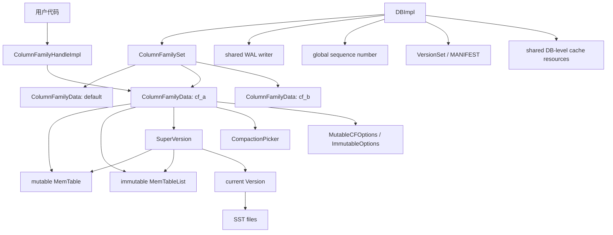
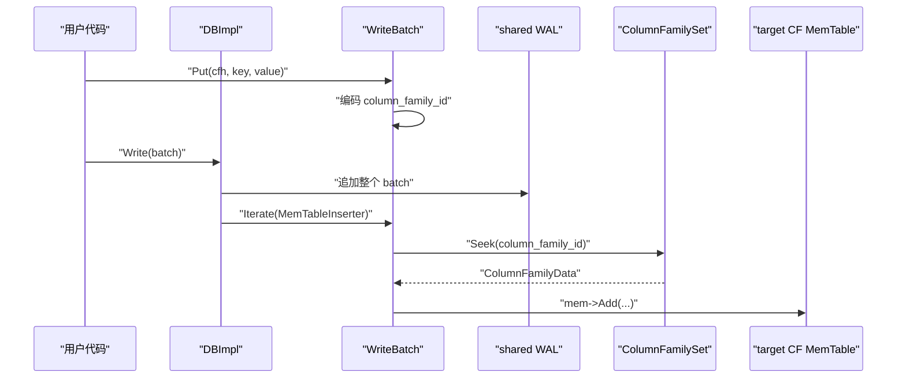

## 今日主题

- 主主题：`Column Family`
- 副主题：`多 Column Family 下的读写路由、资源隔离与共享边界`

Day 016 刚看完 `BlockBasedTable` 内部的 filter、index、data block 和 block cache。Day 017 回到更上层的问题：

`如果一个 RocksDB 实例里有多个逻辑 key space，同一个 DBImpl 如何把写入、读取、flush、compaction 分发到对应的那一套 LSM 状态？`

RocksDB 的答案就是 `Column Family`。

## 学习目标

今天要建立四个判断：

1. `ColumnFamilyHandle` 是用户 API 层的入口，真正承载状态的是 `ColumnFamilyData`。
2. 每个 Column Family 有自己的 memtable、immutable memtable list、current `Version`、`SuperVersion`、options 和 compaction picker。
3. 多个 Column Family 仍共享一个 `DBImpl`、一套 WAL 写入链路、全局 sequence number、`VersionSet / MANIFEST` 机制，以及一些 DB 级资源。
4. 读写路径都不是靠用户 key 自动判断 CF，而是显式通过 handle 或 batch record 里的 `column_family_id` 路由。

## 前置回顾

前面已经分别看过：

- Day 003：`WriteBatch`、sequence number、写线程组。
- Day 005/006：`MemTable` 和读写语义。
- Day 007：flush 将 immutable memtable 写成 SST。
- Day 009：`Get` 会读 memtable、immutable memtable 和 SST。
- Day 012：`VersionEdit / VersionSet / MANIFEST` 管理文件集合和元数据演进。
- Day 013/014：compaction 以 `ColumnFamilyData` 的 current `Version` 为输入，生成新的 LSM 版本。

Column Family 不是新引入一套独立存储引擎，而是把这些已经学过的组件在一个 DB 内按 CF 维度重新组织。

## 源码入口

本章主要阅读这些文件：

- `D:\program\rocksdb\include\rocksdb\db.h`
  - `DB::Open(...)`
  - `DB::CreateColumnFamily(...)`
  - `DB::DropColumnFamily(...)`
  - `DB::Put/Get/Flush` 的 ColumnFamilyHandle 版本
- `D:\program\rocksdb\db\column_family.h`
  - `ColumnFamilyHandleImpl`
  - `ColumnFamilyData`
  - `ColumnFamilySet`
  - `ColumnFamilyMemTablesImpl`
  - `SuperVersion`
- `D:\program\rocksdb\db\column_family.cc`
  - handle 引用计数
  - `ColumnFamilySet::CreateColumnFamily(...)`
  - `ColumnFamilyMemTablesImpl::Seek(...)`
- `D:\program\rocksdb\db\db_impl\db_impl.cc`
  - `DBImpl::GetImpl(...)`
  - `DBImpl::CreateColumnFamilyImpl(...)`
  - `DBImpl::DropColumnFamilyImpl(...)`
- `D:\program\rocksdb\db\db_impl\db_impl_write.cc`
  - `DBImpl::WriteImpl(...)`
  - `DBImpl::WriteToWAL(...)`
- `D:\program\rocksdb\db\write_batch.cc`
  - `WriteBatch::Put(ColumnFamilyHandle*, ...)`
  - `WriteBatchInternal::Put(...)`
  - `MemTableInserter`
- `D:\program\rocksdb\db\version_edit.h`
  - `VersionEdit::SetColumnFamily(...)`
  - `VersionEdit::AddColumnFamily(...)`
  - `VersionEdit::DropColumnFamily(...)`
- `D:\program\rocksdb\db\version_set.cc`
  - `VersionSet::LogAndApply(...)`
  - `VersionSet::CreateColumnFamily(...)`
- `D:\program\rocksdb\db\db_impl\db_impl_compaction_flush.cc`
  - `DBImpl::Flush(...)`
  - `DBImpl::FlushMemTable(...)`
  - `DBImpl::AtomicFlushMemTables(...)`
  - background compaction pick

## 它解决什么问题

Column Family 解决的是“一个 RocksDB DB 里管理多个逻辑 key space”的问题。

它的使用场景通常是：

- 不同业务数据希望共用一个 DB 目录和 WAL，但拥有不同的 compaction 策略。
- 一些 key space 写多读少，另一些 key space 读多写少，需要不同参数。
- 希望把元数据、索引、主数据拆到不同 CF，但仍用同一个 RocksDB 实例管理生命周期。
- 希望一个 `WriteBatch` 可以跨多个逻辑空间原子写入。

它不是 SQL table。RocksDB 不理解列、schema、join 或 SQL 约束。Column Family 更接近“同一个 DB 内的命名 key-value 空间”，每个空间有自己的 LSM 树状态。

## 它是怎么工作的

先看对象关系：



可以把边界理解成两层：

1. `DBImpl` 负责全局调度、WAL、sequence number、后台线程、MANIFEST 写入和目录级资源。
2. `ColumnFamilyData` 负责这一列族自己的 LSM 状态，包括 memtable、immutable memtable、current `Version`、`SuperVersion`、options 和 compaction picker。

读写请求进入 API 时带 `ColumnFamilyHandle`。handle 指向具体的 `ColumnFamilyData`，于是请求可以直接找到对应 CF 的 memtable 和 version。写入被编码进 `WriteBatch` 后，batch record 会携带 `column_family_id`，memtable 插入阶段再按 id 查回目标 CF。

## 关键数据结构与实现点

### ColumnFamilyHandleImpl

`ColumnFamilyHandleImpl` 是用户持有的句柄。它不保存 LSM 树本体，只保存一个 `ColumnFamilyData*`。

```cpp
// db/column_family.h::ColumnFamilyHandleImpl
class ColumnFamilyHandleImpl : public ColumnFamilyHandle {
 public:
  ColumnFamilyHandleImpl(ColumnFamilyData* cfd, DBImpl* db,
                         InstrumentedMutex* mutex);
  virtual ~ColumnFamilyHandleImpl();
  virtual ColumnFamilyData* cfd() const { return cfd_; }

  uint32_t GetID() const override;
  const std::string& GetName() const override;

 private:
  ColumnFamilyData* cfd_;
  DBImpl* db_;
  InstrumentedMutex* mutex_;
};
```

`column_family.cc` 里可以看到构造函数会 `cfd_->Ref()`，析构时会 `UnrefAndTryDelete()`。这解释了为什么 `DropColumnFamily()` 不是立即删内存和文件：只要用户还持有 handle，`ColumnFamilyData` 仍可能被读路径使用。

### ColumnFamilyData

`ColumnFamilyData` 才是 CF 的状态主体：

```cpp
// db/column_family.h::ColumnFamilyData
class ColumnFamilyData {
 public:
  uint32_t GetID() const { return id_; }
  const std::string& GetName() const { return name_; }

  MemTableList* imm() { return &imm_; }
  MemTable* mem() { return mem_; }
  SuperVersion* GetSuperVersion() { return super_version_; }

 private:
  uint32_t id_;
  const std::string name_;
  Version* dummy_versions_;
  Version* current_;

  const ImmutableOptions ioptions_;
  MutableCFOptions mutable_cf_options_;

  MemTable* mem_;
  MemTableList imm_;
  SuperVersion* super_version_;

  uint64_t log_number_;
  std::unique_ptr<CompactionPicker> compaction_picker_;
  bool queued_for_flush_;
  bool queued_for_compaction_;
  ...
};
```

这段字段说明了 CF 的“独立”到底独立在哪里：

- 独立的 `id_ / name_`。
- 独立的 comparator、prefix extractor、merge operator、table factory 等 CF options。
- 独立的 mutable memtable 和 immutable memtable list。
- 独立的 current `Version`，也就是这套 CF 当前可见的 SST 文件集合。
- 独立的 `SuperVersion`，给前台读提供稳定视图。
- 独立的 compaction picker 和 flush/compaction 队列标记。

### ColumnFamilySet

`ColumnFamilySet` 是 DB 内所有 CF 的注册表：

```cpp
// db/column_family.h::ColumnFamilySet
class ColumnFamilySet {
 public:
  ColumnFamilyData* GetDefault() const;
  ColumnFamilyData* GetColumnFamily(uint32_t id) const;
  ColumnFamilyData* GetColumnFamily(const std::string& name) const;

  ColumnFamilyData* CreateColumnFamily(
      const std::string& name, uint32_t id, Version* dummy_version,
      const ColumnFamilyOptions& options, bool read_only);

 private:
  UnorderedMap<std::string, uint32_t> column_families_;
  UnorderedMap<uint32_t, ColumnFamilyData*> column_family_data_;
  uint32_t max_column_family_;
  ColumnFamilyData* default_cfd_cache_;

  Cache* table_cache_;
  WriteBufferManager* write_buffer_manager_;
  WriteController* write_controller_;
};
```

它保存两类映射：

- name -> id
- id -> `ColumnFamilyData*`

读写路径一般不会每次从 name 查起。用户 API 传进来的是 handle，batch 内部传的是 id。

### SuperVersion

`SuperVersion` 在 Column Family 章节尤其重要，因为它把“这个 CF 当前可读视图”固定下来：

```cpp
// db/column_family.h::SuperVersion
struct SuperVersion {
  ColumnFamilyData* cfd;
  ReadOnlyMemTable* mem;
  MemTableListVersion* imm;
  Version* current;
  MutableCFOptions mutable_cf_options;
  uint64_t version_number;
  WriteStallCondition write_stall_condition;
  ...
};
```

一个前台读拿到某个 CF 的 `SuperVersion` 后，它看到的是：

- 该 CF 的当前 mutable memtable；
- 该 CF 的 immutable memtable list 视图；
- 该 CF 的 current `Version`，也就是 SST 文件集合。

这样即使后台 flush 或 compaction 正在给同一个 CF 安装新版本，旧读也能继续使用它已经 pin 住的旧视图。

## 源码细读

### 1. 打开 DB 时必须打开所有 Column Family

public API 里直接写明：打开一个已有多 CF 的 DB 时，调用者要提供所有 CF 的 descriptor；不知道有哪些 CF 时，先用 `ListColumnFamilies()`。

```cpp
// include/rocksdb/db.h::DB::Open
static Status Open(const DBOptions& db_options, const std::string& name,
                   const std::vector<ColumnFamilyDescriptor>& column_families,
                   std::vector<ColumnFamilyHandle*>* handles,
                   std::unique_ptr<DB>* dbptr);
```

`db_impl_open.cc` 里恢复完成后，会按用户传入的 descriptor 查 `ColumnFamilySet`，给每个存在的 CF 创建 handle，并安装 `SuperVersion`。

```cpp
// db/db_impl/db_impl_open.cc::DBImpl::Open
for (const auto& cf : column_families) {
  auto cfd =
      impl->versions_->GetColumnFamilySet()->GetColumnFamily(cf.name);
  if (cfd != nullptr) {
    handles->push_back(
        new ColumnFamilyHandleImpl(cfd, impl.get(), &impl->mutex_));
    impl->NewThreadStatusCfInfo(cfd);
    SuperVersionContext sv_context(/* create_superversion */ true);
    impl->InstallSuperVersionForConfigChange(cfd, &sv_context);
    sv_context.Clean();
  } else {
    ...
  }
}
```

这也是为什么 Column Family 是持久化元数据的一部分：DB open 时要从 MANIFEST 恢复有哪些 CF、各自的 id、文件集合和 options，再返回 handle。

### 2. Create / Drop 通过 VersionEdit 持久化

创建 CF 时，`DBImpl::CreateColumnFamilyImpl(...)` 会构造一个 `VersionEdit`：

```cpp
// db/db_impl/db_impl.cc::DBImpl::CreateColumnFamilyImpl
VersionEdit edit;
edit.AddColumnFamily(column_family_name);
uint32_t new_id = versions_->GetColumnFamilySet()->GetNextColumnFamilyID();
edit.SetColumnFamily(new_id);
edit.SetLogNumber(cur_wal_number_);
edit.SetComparatorName(cf_options.comparator->Name());

s = versions_->LogAndApply(nullptr, read_options, write_options, &edit,
                           &mutex_, directories_.GetDbDir(), false,
                           &cf_options);
...
*handle = new ColumnFamilyHandleImpl(cfd, this, &mutex_);
```

`LogAndApply` 的职责包括把创建记录写入 MANIFEST，并创建 `ColumnFamilyData`。`version_set.cc` 里接着会创建新 `Version`、append 到该 CF 的 version 链、创建新 memtable，并设置该 CF 的 log number。

删除 CF 也是一个 `VersionEdit`：

```cpp
// db/db_impl/db_impl.cc::DBImpl::DropColumnFamilyImpl
auto cfh = static_cast_with_check<ColumnFamilyHandleImpl>(column_family);
auto cfd = cfh->cfd();
if (cfd->GetID() == 0) {
  return Status::InvalidArgument("Can't drop default column family");
}

VersionEdit edit;
edit.DropColumnFamily();
edit.SetColumnFamily(cfd->GetID());

s = versions_->LogAndApply(cfd, read_options, write_options, &edit,
                           &mutex_, directories_.GetDbDir());
```

注意两个边界：

- default CF 不能 drop。
- drop 不是立刻删除所有文件。`ColumnFamilyData::SetDropped()` 的注释明确说明：drop 后不再执行 flush/compaction；已有 handle 仍可读；写入会失败，除非写选项允许忽略缺失 CF；等所有引用释放后才从 `ColumnFamilySet` 移除并清理内存/文件。

### 3. Get 用 handle 找到目标 CF 的 SuperVersion

`Get` 路径最能体现 handle 的作用。`DBImpl::GetImpl(...)` 先把用户传入的 `ColumnFamilyHandle*` cast 成 `ColumnFamilyHandleImpl*`，然后拿到 `cfd`。

```cpp
// db/db_impl/db_impl.cc::DBImpl::GetImpl
auto cfh = static_cast_with_check<ColumnFamilyHandleImpl>(
    get_impl_options.column_family);
auto cfd = cfh->cfd();

SuperVersion* sv = GetAndRefSuperVersion(cfd);
...
LookupKey lkey(key, snapshot, read_options.timestamp);
```

随后点查顺序还是我们在 Day 009 学过的主线，只是这次所有对象都来自这个 CF 的 `SuperVersion`：

```cpp
// db/db_impl/db_impl.cc::DBImpl::GetImpl
if (!skip_memtable) {
  if (sv->mem->Get(lkey, ..., false /* immutable_memtable */, ...)) {
    done = true;
  } else if (sv->imm->Get(lkey, ..., read_options, ...)) {
    done = true;
  }
}

if (!done) {
  sv->current->Get(read_options, lkey, ..., get_impl_options.get_value);
}

ReturnAndCleanupSuperVersion(cfd, sv);
```

所以同一个 user key 在不同 CF 中是完全独立的。RocksDB 不会拿 key 去猜 CF，CF 是 API 参数和内部 id 明确指定的。

### 4. Put 把 ColumnFamilyHandle 编码成 column_family_id

`DBImpl::Put(...)` 最终走到 `DB::Put(...)` 的便捷层，写入 `WriteBatch`。`WriteBatch::Put(ColumnFamilyHandle*, ...)` 会从 handle 中取出 CF id。

```cpp
// db/write_batch.cc::WriteBatch::Put
uint32_t cf_id = 0;
std::tie(s, cf_id, ts_sz) =
    WriteBatchInternal::GetColumnFamilyIdAndTimestampSize(this,
                                                          column_family);

if (0 == ts_sz) {
  s = WriteBatchInternal::Put(this, cf_id, key, value);
} else {
  ...
}
```

`WriteBatchInternal::Put(...)` 会把非 default CF 写成 `kTypeColumnFamilyValue + column_family_id + key + value`。

```cpp
// db/write_batch.cc::WriteBatchInternal::Put
if (column_family_id == 0) {
  b->rep_.push_back(static_cast<char>(kTypeValue));
} else {
  b->rep_.push_back(static_cast<char>(kTypeColumnFamilyValue));
  PutVarint32(&b->rep_, column_family_id);
}
PutLengthPrefixedSlice(&b->rep_, key);
PutLengthPrefixedSlice(&b->rep_, value);
```

这说明一个关键事实：WAL 里的 batch 不是只存 user key/value，也会记录非 default CF 的 id。恢复时才能把不同 record 回放到正确的 CF memtable。

### 5. WAL 共享，MemTable 插入按 CF id 路由

`DBImpl::WriteImpl(...)` 先通过写线程组组织写入，正常情况下会把合并后的 batch 写到当前 WAL：

```cpp
// db/db_impl/db_impl_write.cc::DBImpl::WriteImpl
if (status.ok() && !write_options.disableWAL) {
  io_s = WriteGroupToWAL(write_group, wal_context.writer, wal_used,
                         wal_context.need_wal_sync,
                         wal_context.need_wal_dir_sync,
                         last_sequence + 1,
                         *wal_context.wal_file_number_size);
}
```

真正写 WAL 的地方只是把整个 `WriteBatch` 的内容作为 log entry 追加：

```cpp
// db/db_impl/db_impl_write.cc::DBImpl::WriteToWAL
Slice log_entry = WriteBatchInternal::Contents(&merged_batch);
io_s = log_writer->AddRecord(write_options, log_entry, sequence);
```

但是写入 memtable 时，就要按 batch record 里的 `column_family_id` 分发：

```cpp
// db/db_impl/db_impl_write.cc::DBImpl::WriteImpl
ColumnFamilyMemTablesImpl column_family_memtables(
    versions_->GetColumnFamilySet());
w.status = WriteBatchInternal::InsertInto(
    &w, w.sequence, &column_family_memtables, &flush_scheduler_,
    &trim_history_scheduler_,
    write_options.ignore_missing_column_families, 0 /* log_number */, this,
    true /* concurrent_memtable_writes */, seq_per_batch_, w.batch_cnt,
    batch_per_txn_, write_options.memtable_insert_hint_per_batch);
```

`ColumnFamilyMemTablesImpl::Seek(...)` 用 id 找到当前 record 的目标 `ColumnFamilyData`：

```cpp
// db/column_family.cc::ColumnFamilyMemTablesImpl::Seek
if (column_family_id == 0) {
  current_ = column_family_set_->GetDefault();
} else {
  current_ = column_family_set_->GetColumnFamily(column_family_id);
}
handle_.SetCFD(current_);
return current_ != nullptr;
```

`MemTableInserter::PutCFImpl(...)` 再从当前 CF 取 memtable，并把 key/value 加进去：

```cpp
// db/write_batch.cc::MemTableInserter::PutCFImpl
if (!SeekToColumnFamily(column_family_id, &ret_status)) {
  ...
  return ret_status;
}

MemTable* mem = cf_mems_->GetMemTable();
ret_status =
    mem->Add(sequence_, value_type, key, value, kv_prot_info,
             concurrent_memtable_writes_, get_post_process_info(mem),
             hint_per_batch_ ? &GetHintMap()[mem] : nullptr);
```

这条链路可以压缩成：



所以：

- WAL 是 DB 级共享的。
- sequence number 是全局分配的。
- memtable 是按 CF 隔离的。
- 一个 `WriteBatch` 可以包含多个 CF 的 record。

### 6. Flush / Compaction 以 ColumnFamilyData 为单位

手动 flush 的 API 直接接收 `ColumnFamilyHandle*`：

```cpp
// db/db_impl/db_impl_compaction_flush.cc::DBImpl::Flush
auto cfh = static_cast_with_check<ColumnFamilyHandleImpl>(column_family);
if (immutable_db_options_.atomic_flush) {
  s = AtomicFlushMemTables(flush_options, FlushReason::kManualFlush,
                           {cfh->cfd()});
} else {
  s = FlushMemTable(cfh->cfd(), flush_options, FlushReason::kManualFlush);
}
```

普通 flush 对单个 `ColumnFamilyData` 做 memtable switch，并生成 `FlushRequest`：

```cpp
// db/db_impl/db_impl_compaction_flush.cc::DBImpl::FlushMemTable
if (!cfd->mem()->IsEmpty() || !cached_recoverable_state_empty_.load() ||
    IsRecoveryFlush(flush_reason)) {
  s = SwitchMemtable(cfd, &context);
}

if (s.ok()) {
  FlushRequest req{flush_reason, {{cfd, flush_memtable_id}}};
  flush_reqs.emplace_back(std::move(req));
}
```

`atomic_flush` 则会选择多个 CF，一起切 memtable、分配 atomic flush sequence，并把多个 CF 放进一个 flush request：

```cpp
// db/db_impl/db_impl_compaction_flush.cc::DBImpl::AtomicFlushMemTables
SelectColumnFamiliesForAtomicFlush(&cfds, candidate_cfds, flush_reason);

for (auto cfd : cfds) {
  s = SwitchMemtable(cfd, &context);
  ...
}
if (s.ok()) {
  AssignAtomicFlushSeq(cfds);
  for (auto cfd : cfds) {
    cfd->imm()->FlushRequested();
  }
  GenerateFlushRequest(cfds, flush_reason, &flush_req);
  EnqueuePendingFlush(flush_req);
}
```

Compaction 也是从 `ColumnFamilyData` 出发。后台 compaction 会对目标 CF 取最新 mutable CF options，并调用该 CF 的 `PickCompaction(...)`：

```cpp
// db/db_impl/db_impl_compaction_flush.cc::DBImpl::BackgroundCompaction
const auto& mutable_cf_options = cfd->GetLatestMutableCFOptions();
if (!mutable_cf_options.disable_auto_compactions && !cfd->IsDropped()) {
  c.reset(cfd->PickCompaction(
      mutable_cf_options, mutable_db_options_, job_context->snapshot_seqs,
      job_context->snapshot_checker, log_buffer,
      thread_pri == Env::Priority::BOTTOM));
}
```

这说明 compaction 策略、level 状态、文件选择都在 CF 维度上独立推进，但后台线程、调度队列和 MANIFEST 提交仍属于 DB 级协作。

## 今日问题与讨论

### 我的问题

#### 问题 1：Column Family 是不是一个独立 DB？

- 简答：
  - 不是。它是同一个 `DBImpl` 内的一个逻辑 key space，有独立 LSM 状态，但共享 DB 级资源。
- 源码依据：
  - `D:\program\rocksdb\db\column_family.h::ColumnFamilyData`
  - `D:\program\rocksdb\db\column_family.h::ColumnFamilySet`
  - `D:\program\rocksdb\db\db_impl\db_impl_write.cc::DBImpl::WriteImpl`
- 当前结论：
  - “独立”主要指 memtable、Version/SST、SuperVersion、options、compaction picker 独立；不是 WAL、DBImpl、sequence number、MANIFEST 机制全部独立。
- 是否需要后续回看：
  - 是。事务章节需要回看跨 CF WriteBatch 的原子性和可见性。

#### 问题 2：为什么打开 DB 时要提供所有 Column Family？

- 简答：
  - 因为 DB open 需要恢复每个 CF 的 options、comparator、文件集合和读视图；遗漏 CF 会让 DB 无法完整解释 MANIFEST 中的状态。
- 源码依据：
  - `D:\program\rocksdb\include\rocksdb\db.h::DB::Open`
  - `D:\program\rocksdb\db\db_impl\db_impl_open.cc::DBImpl::Open`
- 当前结论：
  - 如果不知道已有 CF 列表，应先调用 `ListColumnFamilies()`。open 成功后返回的 handles 才是后续读写入口。
- 是否需要后续回看：
  - 后续 DB open/recovery 异常路径可以继续补。

#### 问题 3：共享 WAL 会不会破坏各 CF 的隔离？

- 简答：
  - 不会。WAL record 内的 `WriteBatch` 会编码 `column_family_id`；memtable replay 或正常插入时通过 `ColumnFamilyMemTablesImpl` 找到目标 CF。
- 源码依据：
  - `D:\program\rocksdb\db\write_batch.cc::WriteBatchInternal::Put`
  - `D:\program\rocksdb\db\column_family.cc::ColumnFamilyMemTablesImpl::Seek`
  - `D:\program\rocksdb\db\write_batch.cc::MemTableInserter::PutCFImpl`
- 当前结论：
  - 共享 WAL 是物理日志共享；逻辑落点仍由 CF id 决定。
- 是否需要后续回看：
  - 是。WAL replay 和 multi-CF group commit 可以在事务/恢复章节再拆。

#### 问题 4：既然共享 WAL 已经能恢复跨 CF 写入，atomic flush memtable 的作用是什么？

- 简答：
  - atomic flush 解决的是“多个 CF 的 flush 结果是否一起进入持久化版本”的问题，尤其对 `disableWAL` 或其他未被 WAL 保护的写入有意义。正常 WAL 始终开启时，跨 CF 写入的崩溃恢复可以依赖 WAL replay，因此 `atomic_flush` 不是必需项。
- 源码依据：
  - `D:\program\rocksdb\include\rocksdb\options.h::DBOptions::atomic_flush`
  - `D:\program\rocksdb\include\rocksdb\db.h::DB::Flush(const FlushOptions&, const std::vector<ColumnFamilyHandle*>&)`
  - `D:\program\rocksdb\db\db_impl\db_impl_compaction_flush.cc::DBImpl::AtomicFlushMemTables(...)`
  - `D:\program\rocksdb\db\db_impl\db_impl_compaction_flush.cc::DBImpl::AtomicFlushMemTablesToOutputFiles(...)`
  - `D:\program\rocksdb\db\memtable_list.cc::InstallMemtableAtomicFlushResults(...)`
- 当前结论：
  - atomic flush 不是把多个 CF 的 memtable 合并成一个 memtable，也不是先合成一个 `VersionSet`。更准确的顺序是：
    1. 前台在 `AtomicFlushMemTables(...)` 里选中多个 CF。
    2. 对每个 CF 先 `SwitchMemtable(cfd, ...)`，把 mutable memtable 切到 immutable，并创建新的 mutable memtable。
    3. `AssignAtomicFlushSeq(cfds)` 给这一组 flush 建立共同边界。
    4. `GenerateFlushRequest(cfds, ...)` 生成一个包含多个 CF 的 flush request 并入队。
    5. 后台 `AtomicFlushMemTablesToOutputFiles(...)` 为每个 CF 创建自己的 `FlushJob`，各自写出 SST。
    6. 全部 flush job 成功后，`InstallMemtableAtomicFlushResults(...)` 收集各 CF 的 `VersionEdit`，在多 edit 时 `MarkAtomicGroup(...)`，再调用 `VersionSet::LogAndApply(cfds, ..., edit_lists, ...)` 统一提交到 MANIFEST。
    7. 提交成功后，各 CF 再安装新版本、移除已 flush 的 immutable memtable，并安装新的 `SuperVersion`。
  - 所以，“多个 CF 原子 flush”保护的是 flush 结果的持久化可见性：崩溃后不能只看到 CF A 的 SST 已进入 MANIFEST，而 CF B 的对应 flush 结果丢失。
- 为什么有意义：
  - 如果 WAL 开启，跨 CF `WriteBatch` 已经在共享 WAL 中作为一个 batch 记录，崩溃后可以 replay 回来。
  - 如果 WAL 被关闭，写入只在 memtable 中，flush 就成了这些写入进入持久化状态的关键动作。没有 atomic flush 时，CF A 可能 flush 成功并提交 MANIFEST，CF B 还没提交就崩溃，恢复后跨 CF 原子性被破坏。
  - atomic flush 让这一组 CF 的 flush 输出以 atomic group 进入 MANIFEST，从而补上“无 WAL 保护写入”的崩溃一致性缺口。
- 是否需要后续回看：
  - 是。后续可以在 Flush / MANIFEST revisit 中继续看 atomic group 在 MANIFEST record 层的恢复处理。

#### 问题 5：CF 共享 WAL 对跨 CF WriteBatch 有什么好处？

- 简答：
  - 这是 Column Family 相比多个独立 DB 的关键优势之一：多个 CF 是逻辑隔离，但共享同一个 WAL 和全局 sequence 分配，因此一个 `WriteBatch` 可以同时写多个 CF，并以一个 batch 进入 WAL，从而获得跨 CF 的原子写入语义。
- 源码依据：
  - `D:\program\rocksdb\db\write_batch.cc::WriteBatchInternal::Put(...)`
  - `D:\program\rocksdb\db\db_impl\db_impl_write.cc::DBImpl::WriteToWAL(...)`
  - `D:\program\rocksdb\db\write_batch.cc::MemTableInserter::PutCFImpl(...)`
- 当前结论：
  - `WriteBatchInternal::Put(...)` 会把非 default CF 的 record 编码为 `kTypeColumnFamilyValue + column_family_id + key + value`。
  - `DBImpl::WriteToWAL(...)` 追加的是整个 `WriteBatch` 的内容，而不是按 CF 拆成多个独立 WAL。
  - memtable 插入阶段再根据 `column_family_id` 找到目标 CF。
  - 因此，多个 CF 既能逻辑隔离，又能共享日志实现跨 CF 原子写。多个独立 DB 通常没有这条天然路径：它们各自有 WAL、sequence 和恢复边界，跨 DB 原子提交需要额外事务协调协议。
- 是否需要后续回看：
  - 是。事务章节继续看这条跨 CF 原子写如何和 snapshot、锁、WritePrepared / WriteUnprepared 结合。

### 外部高价值问题

今天没有引入新的外部资料，先以本地源码为准。后续如果看 Column Family 调优实践，可以再补官方 Wiki 或 Issue 中关于多 CF 内存预算和写停顿的讨论。

## 常见误区或易混点

1. 误区：Column Family 就是独立 RocksDB 实例。
   - 更准确：它是同一个 DB 内的一套独立 LSM 状态，仍共享 DB 级 WAL、sequence、后台线程和部分缓存/调度资源。
2. 误区：用户 key 能决定写到哪个 CF。
   - 更准确：CF 由 `ColumnFamilyHandle` 或 batch record 中的 `column_family_id` 决定，同一个 user key 可以在多个 CF 中分别存在。
3. 误区：drop CF 会马上删除所有数据文件。
   - 更准确：drop 先写 MANIFEST 并标记 dropped；只要 handle 或旧读视图还引用它，内存和文件仍要保留。
4. 误区：每个 CF 都有自己的 WAL。
   - 更准确：常规 DB 内 WAL 是共享的，record 里带 CF id；每个 CF 有自己的 log number 边界，用于恢复时判断哪些 WAL 对该 CF 仍有意义。
5. 误区：不同 CF 的 block cache 一定完全隔离。
   - 更准确：CF 可以有不同 table options，但 block cache 通常通过 `BlockBasedTableOptions::block_cache` 或 DB 级 cache 资源共享；是否隔离取决于配置。
6. 误区：`ColumnFamilyOptions::write_buffer_size` 是整个 DB 的总 memtable 预算。
   - 更准确：源码注释说明它是 per CF 的限制；跨 CF 总预算需要看 `db_write_buffer_size` 或 `WriteBufferManager`。

## 设计动机

Column Family 的设计动机是把“隔离配置和 LSM 状态”与“共享底层引擎”组合起来。

如果每个逻辑 key space 都开一个独立 DB：

- 优点是隔离彻底。
- 代价是 WAL、后台线程、cache、manifest、文件管理、统计和生命周期全部重复，跨 key space 原子写也更麻烦。

如果只用 key prefix 在一个 CF 里区分业务：

- 优点是结构简单。
- 代价是所有 prefix 共享同一套 memtable、compaction、level 参数、Bloom/filter/table options，冷热数据和不同写入模式会互相影响。

Column Family 取中间路线：

- 用 `ColumnFamilyData` 隔离 LSM 状态和 CF options。
- 用 `DBImpl / VersionSet / WAL / WriteThread` 共享全局引擎。
- 用 `ColumnFamilyHandle` 和 `column_family_id` 做明确路由。

这个设计接受的代价是：多 CF 下资源预算更复杂，尤其是 memtable 内存、flush/compaction 并发、block cache 竞争和 write stall 的触发关系。

## 横向对比

可以把 Column Family 和三种常见做法区分开：

1. SQL table：
   - SQL table 有 schema、列类型、约束和查询优化器。
   - RocksDB Column Family 只有 key-value 空间与 LSM 配置，不理解 schema。
2. 一个 DB 一个 namespace：
   - prefix 分区简单，但不同业务共享 compaction 策略和 memtable 预算。
   - Column Family 能让不同业务拥有不同 comparator、prefix extractor、compaction style、write buffer、table factory。
3. 多个独立 DB：
   - 隔离更强，但跨 DB 原子写、资源复用和统一管理更难。
   - Column Family 共享 WAL 和 DB 级机制，更适合需要同库多逻辑空间的场景。

## 工程启发

Column Family 的实现有三个值得借鉴的工程点：

1. API 层用 handle 明确路由，避免从 key 内容中推断目标空间。
2. 内部持久化用稳定 id，而不是只靠名字；名字适合用户，id 适合日志和元数据。
3. 共享和隔离不做成全有或全无，而是按资源类型拆分：
   - LSM 状态按 CF 隔离。
   - 日志、sequence、后台调度、MANIFEST 提交按 DB 共享。
   - cache 和 write buffer manager 可通过配置共享或约束。

这种设计适合长期演进。新增功能时，可以先问它应该挂在 `DBImpl`、`ColumnFamilyData`、`Version` 还是 table/cache 层，而不是把所有状态都塞进一个全局对象。

## 今日小结

Day 017 建立了 Column Family 的主链：

1. `ColumnFamilyHandleImpl` 是用户侧入口，内部指向 `ColumnFamilyData`。
2. `ColumnFamilySet` 是 DB 内所有 CF 的注册表，维护 name/id 到 `ColumnFamilyData` 的映射。
3. `ColumnFamilyData` 持有该 CF 的 memtable、immutable memtable、current `Version`、`SuperVersion`、options 和 compaction picker。
4. `Get` 通过 handle 找到 `cfd`，再拿该 CF 的 `SuperVersion`，按 mem -> imm -> current Version 查找。
5. `Put` 会把 handle 转成 `column_family_id` 写入 `WriteBatch`；WAL 共享，因此跨 CF `WriteBatch` 可以作为一个 batch 原子写入和恢复。
6. Create/Drop CF 通过 `VersionEdit` 和 `LogAndApply` 持久化到 MANIFEST。
7. Flush 和 compaction 以 `ColumnFamilyData` 为单位推进，`atomic_flush` 可以把多个 CF 的 flush 输出作为 atomic group 提交到 MANIFEST，主要用于补足无 WAL 保护写入的崩溃一致性。
8. Column Family 的核心价值是：在一个 DB 内共享引擎资源，同时隔离多套 LSM 状态和参数。

本章仍保留三个后续点：

- `atomic_flush` 的主语义已补上；MANIFEST atomic group 的恢复细节还可以后续结合 `VersionEditHandler` 继续看。
- 跨 CF `WriteBatch` 的 sequence、WAL、事务可见性只建立了主链，后续事务章节要继续压实。
- 多 CF 下 block cache、write buffer manager、write stall 的资源竞争需要在参数调优章节回看。

## 明日衔接

下一步建议进入：

`事务与并发控制`

原因是：

- Column Family 已经说明一个 `WriteBatch` 可以跨多个 CF。
- 事务章节会继续回答：这些跨 CF 写入如何和 sequence number、snapshot、WritePrepared/WriteUnprepared、锁和冲突检测配合。
- Day 015 留下的 `SnapshotChecker / write-prepared / write-unprepared` 也适合在事务章节回看。

## 复习题

1. `ColumnFamilyHandleImpl`、`ColumnFamilyData`、`ColumnFamilySet` 分别负责什么？
2. 为什么说 Column Family 不是一个完全独立的 DB？
3. `DBImpl::Get()` 如何从 `ColumnFamilyHandle` 路由到正确的 memtable 和 SST？
4. `WriteBatch` 如何记录非 default Column Family 的写入？
5. 共享 WAL 时，恢复或 memtable 插入如何知道一条 record 属于哪个 CF？
6. `DropColumnFamily()` 为什么不是马上删除所有内存和文件？
7. 哪些资源通常是 CF 独立的？哪些资源仍是 DB 级共享的？
8. `write_buffer_size` 是 per CF 还是全 DB？如果要控制跨 CF 总内存，应继续关注哪些选项或对象？

## 复习结果

- 复习时间：`2026-05-21T12:55:13+08:00`
- 结果：`pass`
- 判定：
  - 已能区分 `ColumnFamilyHandleImpl`、`ColumnFamilyData`、`ColumnFamilySet` 的职责：handle 是用户侧路由入口，`ColumnFamilyData` 承载 CF 的 LSM 状态，`ColumnFamilySet` 管理 DB 内 CF 注册与查找。
  - 已能说明 CF 是逻辑隔离而不是独立 DB：memtable、SST、compaction/options 等按 CF 隔离，但 WAL、全局 sequence、DB 级写入控制和部分缓存/后台资源仍共享。
  - 已能说明 `Get` 通过 handle 找到 `ColumnFamilyData`，再通过该 CF 的 `SuperVersion` 访问 memtable、immutable memtable 和 current `Version` 下的 SST。
  - 已能说明非 default CF 的 `WriteBatch` record 使用 `kTypeColumnFamilyValue + column_family_id` 编码，因此共享 WAL 下也能恢复或插入到正确 CF。
  - 已能说明 `DropColumnFamily()` 不能立即删除的核心原因：handle、旧读视图和引用计数仍可能让该 CF 被访问；drop 先持久化和标记 dropped，再等引用释放后清理。
  - 已能答出 `write_buffer_size` 是 per CF；跨 CF 总内存控制应关注 `db_write_buffer_size` 或 `WriteBufferManager`。
- 需要补充记住：
  - `Get` 的“正确 SST”不是直接从 `ColumnFamilyData` 拿文件，而是通过 `SuperVersion::current` 指向的 current `Version` 进入 SST 查找。
  - 一个 CF 的 write stall 触发源可以是 CF 级状态，但实际限写通过 DB 级写控制影响整个 DB 写入路径。
- 后续保留：
  - MANIFEST atomic group 在 recovery 中如何被识别和回放。
  - 跨 CF `WriteBatch` 在事务 DB 中如何与 snapshot、锁、WritePrepared / WriteUnprepared 可见性结合。
  - 多 CF 场景下 block cache、WriteBufferManager 和 write stall 的实际调参边界。
