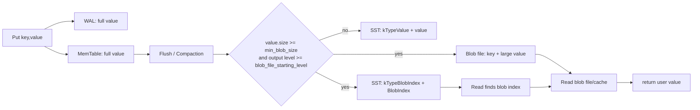
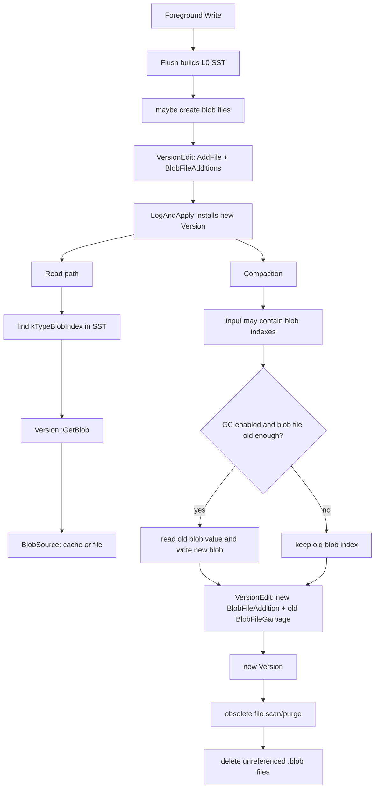
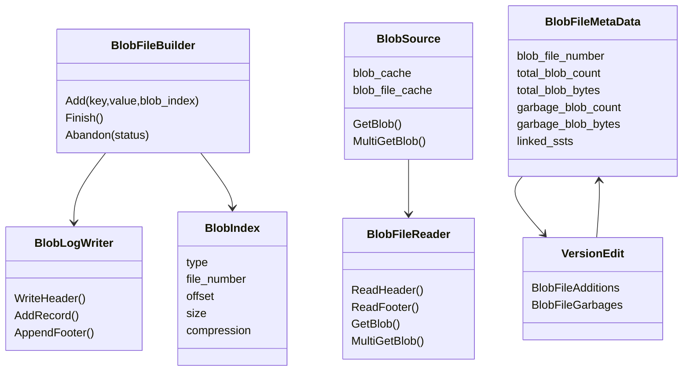
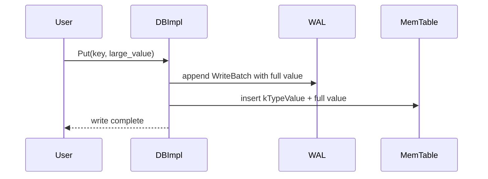
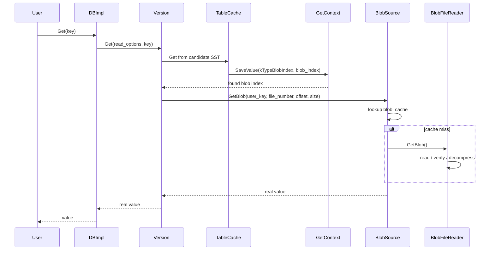
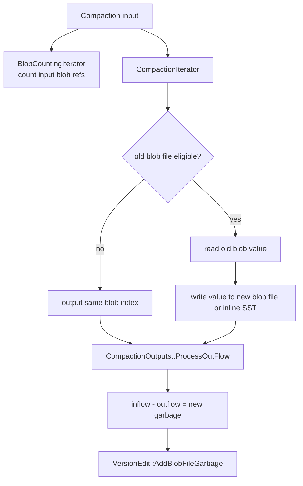
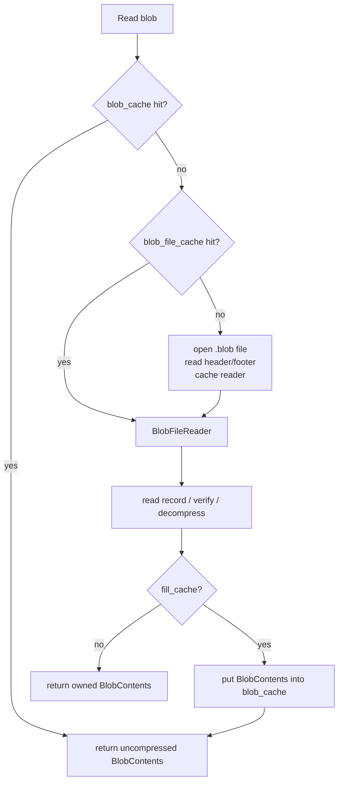

## 今日主题

- 主主题：`BlobDB / KV 分离`
- 副主题：`large value 如何从 LSM 写放大中抽离出来`

Day 017 看的是 Column Family：一个 DB 内可以有多套逻辑 LSM 状态，但共享 WAL、sequence number、MANIFEST、后台线程和一部分缓存资源。

Day 018 进入另一个重要取舍：`key-value separation`。核心问题是：

`如果 value 很大，为什么还要让它跟 key 一起反复参与 LSM compaction？能不能让 LSM 主要负责排序、索引和可见性，让大 value 单独放在 blob file 里？`

RocksDB 的 integrated BlobDB 就是这个方向的实现。

## 学习目标

今天要建立这些判断：

1. integrated BlobDB 的前台写入仍然写 WAL 和 memtable，真正把 value 抽到 blob file 发生在 flush / compaction 构建输出文件时。
2. SST 中保存的是 `kTypeBlobIndex`，它不是用户 value，而是指向 blob file 中某个 value 的索引。
3. 读路径先按普通 LSM 找到 key 的最新可见版本；如果 value type 是 blob index，再通过 `Version::GetBlob()` 读取真实 value。
4. blob file 的生命周期进入 `VersionSet / MANIFEST`，不是游离在 RocksDB 元数据系统外。
5. Blob GC 不是独立扫描全库执行的后台清理器，而是借 compaction 读取仍然有效的旧 blob，并把它搬到新 blob file。
6. `enable_blob_files` 等多数 blob 选项可以动态调整，但只影响后续 flush / compaction；已有 blob index 仍必须保持可读。

## 前置回顾

前面章节已经铺过这些基础：

- Day 003 / 004：写入先进入 `WriteBatch`、WAL 和 memtable。
- Day 007：flush 把 immutable memtable 写成 L0 SST，并通过 MANIFEST 提交。
- Day 009：`Get` 和 iterator 先读 memtable / imm，再读 current `Version` 里的 SST。
- Day 012：`VersionEdit / VersionSet / MANIFEST` 管理持久化文件集合。
- Day 013 / 015：compaction 用 `CompactionIterator` 处理版本、删除、merge、过滤和输出。
- Day 017：每个 CF 有自己的 memtable、Version、options，也有自己的 blob 选项。

BlobDB 并没有替换这些机制。它是在 flush / compaction 输出阶段增加一条旁路：大 value 进入 blob file，LSM 里保留 key 与 blob reference。

## 源码入口

本章主要阅读本地源码：

- `D:\program\rocksdb\docs\_posts\2021-05-26-integrated-blob-db.markdown`
  - integrated BlobDB 的设计背景、legacy BlobDB 对比、动态选项说明
- `D:\program\rocksdb\include\rocksdb\advanced_options.h`
  - `enable_blob_files`
  - `min_blob_size`
  - `blob_file_size`
  - `blob_compression_type`
  - `enable_blob_garbage_collection`
  - `blob_garbage_collection_age_cutoff`
  - `blob_garbage_collection_force_threshold`
  - `blob_compaction_readahead_size`
  - `blob_file_starting_level`
  - `blob_cache`
  - `prepopulate_blob_cache`
- `D:\program\rocksdb\options\cf_options.cc`
  - blob 相关 mutable CF options
- `D:\program\rocksdb\db\db_impl\db_impl.cc`
  - `DBImpl::SetOptions()` 如何热更新 CF 级 mutable options
- `D:\program\rocksdb\db\column_family.cc`
  - `ColumnFamilyData::SetOptions()`
  - `ColumnFamilyData::InstallSuperVersion()`
- `D:\program\rocksdb\db\builder.cc`
  - flush 构建 SST 时创建 `BlobFileBuilder`
- `D:\program\rocksdb\db\flush_job.cc`
  - `FlushJob::WriteLevel0Table()`
- `D:\program\rocksdb\db\compaction\compaction_job.cc`
  - compaction 输出时创建 `BlobFileBuilder`
  - 安装 `BlobFileAddition / BlobFileGarbage`
- `D:\program\rocksdb\db\compaction\compaction_iterator.cc`
  - `ExtractLargeValueIfNeeded()`
  - `GarbageCollectBlobIfNeeded()`
- `D:\program\rocksdb\db\blob\blob_file_builder.cc`
  - 写 blob file、压缩、生成 `BlobIndex`
- `D:\program\rocksdb\db\blob\blob_index.h`
  - SST 中 blob index 的编码格式
- `D:\program\rocksdb\db\blob\blob_log_format.h`
  - blob file header、record、footer 格式
- `D:\program\rocksdb\db\blob\blob_source.cc`
  - blob cache、blob file reader、真实 blob 读取
- `D:\program\rocksdb\db\blob\blob_file_reader.cc`
  - blob file 打开、校验、读取、解压
- `D:\program\rocksdb\db\blob\blob_file_cache.cc`
  - blob file reader cache
- `D:\program\rocksdb\db\version_set.cc`
  - `Version::GetBlob()`
  - `Version::MultiGetBlob()`
  - live blob files 与 forced blob GC
- `D:\program\rocksdb\table\get_context.cc`
  - `GetContext` 遇到 `kTypeBlobIndex` 后如何取真实 value
- `D:\program\rocksdb\db\db_iter.cc`
  - iterator 读 blob、lazy value、merge with blob base value
- `D:\program\rocksdb\db\version_edit.h`
  - `BlobFileAddition / BlobFileGarbage` 写入 MANIFEST
- `D:\program\rocksdb\db\version_builder.cc`
  - MANIFEST replay 后恢复 blob file metadata
- `D:\program\rocksdb\db\db_impl\db_impl_files.cc`
  - obsolete blob file 清理

### 本章源码阅读路线

本章不要从 `db/blob/` 目录直接开始读。那样很容易只看到“blob 文件怎么写”，但看不清它为什么出现在 flush / compaction 中，也看不清旧 blob file 为什么能被 Version 管理。

更适合的读法是按四条链路推进：

1. 写出链：
   - `FlushJob::WriteLevel0Table()` / `CompactionJob::CreateBlobFileBuilder()`
   - `BuildTable()`
   - `CompactionIterator::ExtractLargeValueIfNeeded()`
   - `BlobFileBuilder::Add()`
2. 读取链：
   - `GetContext::SaveValue()`
   - `Version::GetBlob()`
   - `BlobSource::GetBlob()`
   - `BlobFileReader::GetBlob()`
3. GC 链：
   - `CompactionIterator::GarbageCollectBlobIfNeeded()`
   - `BlobGarbageMeter`
   - `VersionEdit::AddBlobFileGarbage`
4. 热更新链：
   - `DBImpl::SetOptions()`
   - `ColumnFamilyData::SetOptions()`
   - `ColumnFamilyData::InstallSuperVersion()`
   - 后续 `FlushJob / CompactionJob` 捕获新的 `MutableCFOptions`

后文的源码片段按这四条链路安排。每段只截取支撑当前结论的关键部分，省略处用 `...` 明确标出；完整函数仍建议回到本地源码继续读。

## 先澄清：两个 BlobDB 语境

RocksDB 代码里会看到两套 BlobDB 语境：

1. legacy / stacked BlobDB：
   - 路径主要在 `utilities/blob_db/`
   - API 是 `rocksdb::blob_db::BlobDB`
   - 作为 `StackableDB` 包在普通 DB 外层
   - 旧实现会在前台写路径中写 blob log，并把 blob index 写到底层 DB
2. integrated BlobDB：
   - 路径主要在 `db/blob/`、`db/compaction/`、`db/builder.cc`、`version_set.cc`
   - 用户仍使用普通 `rocksdb::DB` API
   - 用 CF options 开启，例如 `enable_blob_files = true`
   - blob file 进入 MANIFEST 和 Version 管理
   - flush / compaction 后台任务负责写 blob file

本章主线是第二种：integrated BlobDB。

legacy BlobDB 仍然出现在源码注释和测试里，所以看到 `kTypeBlobIndex` 或 `WriteBatchInternal::PutBlobIndex()` 时要注意上下文。用户普通 `Put()` 在 integrated BlobDB 下不会在前台直接写 `kTypeBlobIndex` 到 WAL；它先写普通 value，后续 flush / compaction 再抽离。

## 它解决什么问题

普通 LSM 的写放大来自一个事实：key-value pair 会随着 compaction 在多个 level 中被重复读取和重写。

如果 value 很小，这通常可以接受；如果 value 是几 KB、几十 KB、甚至 MB 级，反复重写 value 会让 compaction 成本非常高。

KV 分离的做法是：

- LSM 里保留 key、sequence、type、小 value 或 blob reference。
- 大 value 写入 append-only 风格的 blob file。
- compaction 主要处理 key 和小索引，不再反复搬运完整大 value。
- 当旧 blob 因 overwrite / delete 失效后，再通过 GC 回收。

直观上，LSM 仍负责“哪个 key 的哪个版本可见”，blob file 负责“真实大 value 存在哪里”。



## 它是怎么工作的

### 总体生命周期

integrated BlobDB 的主链可以分成四段：



注意两个关键点：

- `BlobIndex` 在 SST 里，参与 LSM 可见性判断。
- blob file metadata 在 `Version` 里，参与 live files、obsolete files、checkpoint、backup 这类文件生命周期。

### 关键结构关系



## 常见配置项

### 开启与抽离阈值

- `enable_blob_files`
  - 是否开启 integrated BlobDB。
  - 开启后，大 value 才有机会进入 blob file。
  - 这是 per-CF 选项。
  - 可通过 `SetOptions()` 动态修改。

- `min_blob_size`
  - value 未压缩大小达到该阈值时才抽离。
  - `0` 表示所有 value 都可以进入 blob file。
  - 只在 `enable_blob_files = true` 时有效。
  - 可动态修改。

- `blob_file_starting_level`
  - 从哪个 LSM output level 开始允许抽离大 value。
  - 默认 `0`，也就是 flush 到 L0 就能抽离。
  - 如果设置为 `1` 或更高，短生命周期 value 可以先留在 L0，等它活到较深 level 再抽离，减少 blob 垃圾。
  - 可动态修改。

### blob file 与压缩

- `blob_file_size`
  - blob file 目标大小。
  - `BlobFileBuilder::CloseBlobFileIfNeeded()` 发现当前文件达到该大小后关闭，并打开新文件。
  - 可动态修改，影响后续生成的 blob file。

- `blob_compression_type`
  - blob value 使用的压缩算法。
  - 同一个 blob file 的 header 记录 compression type。
  - 读时 `BlobFileReader` 会校验 blob index 中的 compression 与文件 header 一致。
  - 可动态修改，影响后续 blob file。

### GC

- `enable_blob_garbage_collection`
  - 是否在 compaction 中执行 integrated BlobDB GC。
  - 可动态修改。

- `blob_garbage_collection_age_cutoff`
  - 按 blob file 年龄选择最老的一批文件作为 GC 候选。
  - 默认 `0.25`，含义是最老的 25% blob files 可被搬迁。
  - 源码里会计算 `cutoff_index = age_cutoff * blob_files.size()`，再取 `blob_files[cutoff_index]` 的 file number 作为 cutoff；真正 GC 时只搬迁 `file_number < cutoff_file_number` 的 blob reference。
  - 因为这里有向下取整，blob 文件很少时可能没有任何文件进入候选集；如果 cutoff index 超出数组，则等价于所有 blob file 都足够老。

- `blob_garbage_collection_force_threshold`
  - 如果候选 blob files 的垃圾比例超过阈值，就标记引用这些旧 blob file 的 SST，触发 forced blob GC compaction。
  - 该逻辑在 `VersionStorageInfo::ComputeFilesMarkedForForcedBlobGC()`。

- `blob_compaction_readahead_size`
  - compaction 读取 blob 做 GC / filter / merge 时的 readahead 大小。
  - 用来降低随机读 blob file 的成本。

### cache

- `blob_cache`
  - 缓存真实 blob value，缓存的是解压后的 blob 内容。
  - 可以是独立 cache，也可以与 block cache 使用同一个底层 cache。
  - 这是 immutable CF option，不像 `enable_blob_files` 那样通过 `SetOptions()` 动态切换。

- `prepopulate_blob_cache`
  - 当前源码里支持 `kFlushOnly`：flush 写出的 blob 可以直接塞进 blob cache。
  - `BlobFileBuilder::PutBlobIntoCacheIfNeeded()` 只在 flush 且配置为 `kFlushOnly` 时执行。
  - 可动态修改。

## 写路径：从 Put 到 blob file

### 前台写入阶段

前台写入仍然是普通 RocksDB 写路径：



这里还没有 blob file。这样做有两个好处：

- 前台写入不需要同步写 blob file，也不需要在用户线程里做 blob compression。
- 崩溃恢复仍可以依赖 WAL replay 恢复 memtable 状态。

### Flush 阶段抽离 value

flush 的调用链：

```text
DBImpl::BackgroundCallFlush()
  -> FlushJob::Run()
    -> FlushJob::WriteLevel0Table()
      -> BuildTable(...)
        -> new BlobFileBuilder(...) if enable_blob_files
        -> CompactionIterator(..., blob_file_builder)
          -> CompactionIterator::PrepareOutput()
            -> ExtractLargeValueIfNeeded()
              -> BlobFileBuilder::Add(user_key, value, &blob_index)
                -> OpenBlobFileIfNeeded()
                -> CompressBlobIfNeeded()
                -> BlobLogWriter::AddRecord()
                -> BlobIndex::EncodeBlob(...)
        -> builder->Add(internal_key_with_kTypeBlobIndex, blob_index)
        -> builder->Finish()
        -> blob_file_builder->Finish()
      -> edit_->AddFile(...)
      -> edit_->SetBlobFileAdditions(...)
      -> TryInstallMemtableFlushResults(...)
```

`BuildTable()` 里创建 `BlobFileBuilder` 的条件大致是：

- `mutable_cf_options.enable_blob_files == true`
- 当前输出 level 大于等于 `blob_file_starting_level`
- 调用者提供了 `blob_file_additions`

#### 源码细读：BuildTable 如何接入 BlobFileBuilder

`db/builder.cc:186` 附近是 flush 写出 blob file 的核心入口。这里不是在前台 `Put()` 时处理大 value，而是在 table builder 已经准备写 SST 时，按当前 `MutableCFOptions` 决定是否创建 `BlobFileBuilder`。核心条件可以简化成：

```cpp
// db/builder.cc::BuildTable(...)
std::unique_ptr<BlobFileBuilder> blob_file_builder(
    (mutable_cf_options.enable_blob_files &&
     tboptions.level_at_creation >=
         mutable_cf_options.blob_file_starting_level &&
     blob_file_additions)
        ? new BlobFileBuilder(
              versions, fs, &ioptions, &mutable_cf_options, &file_options,
              &(tboptions.write_options), tboptions.db_id,
              tboptions.db_session_id, job_id, tboptions.column_family_id,
              tboptions.column_family_name, write_hint, io_tracer,
              blob_callback, blob_creation_reason, &blob_file_paths,
              blob_file_additions)
        : nullptr);

CompactionIterator c_iter(
    iter, ucmp, &merge, kMaxSequenceNumber, &snapshots, earliest_snapshot,
    earliest_write_conflict_snapshot, job_snapshot, snapshot_checker, env,
    ShouldReportDetailedTime(env, ioptions.stats), range_del_agg.get(),
    blob_file_builder.get(), ioptions.allow_data_in_errors,
    ioptions.enforce_single_del_contracts,
    /*manual_compaction_canceled=*/kManualCompactionCanceledFalse,
    true /* 必须统计输入条目 */,
    /*compaction=*/nullptr, compaction_filter.get(),
    /*shutting_down=*/nullptr, db_options.info_log, full_history_ts_low);
```

这段源码把“flush 写 blob”的入口讲清楚了：`BuildTable()` 先按 `enable_blob_files`、`level_at_creation` 和 `blob_file_additions` 判断是否创建 `BlobFileBuilder`，然后把裸指针传给 `CompactionIterator`。如果条件不满足，传进去的是空指针；后面 `ExtractLargeValueIfNeededImpl()` 会直接返回 `false`，value 会以普通 `kTypeValue` 形式写入 SST。

这解释了两个边界：

- BlobDB 的 value 抽离发生在“构建输出文件”阶段，而不是 WAL / memtable 写入阶段。
- `blob_file_starting_level` 能控制 L0 是否立刻抽离：如果设为 `1`，flush 到 L0 时条件不满足，value 会先留在 SST；后续 compaction 到 L1 或更深时才可能抽离。

flush 的输出不是单独一个 SST，而是一组必须一起提交的持久化结果：

- 新 L0 SST
- 可能有若干新 `.blob` 文件
- MANIFEST 中的 table file metadata
- MANIFEST 中的 `BlobFileAddition`

只有 MANIFEST 提交后，这组文件才进入当前 `Version`。

### Compaction 阶段抽离 value

compaction 也会创建 `BlobFileBuilder`：

```text
DBImpl::BackgroundCallCompaction()
  -> CompactionJob::Run()
    -> ProcessKeyValueCompaction()
      -> CreateCompactionIterator()
        -> CreateBlobFileBuilder()
        -> CompactionIterator(..., blob_file_builder)
      -> CompactionIterator::PrepareOutput()
        -> kTypeValue: ExtractLargeValueIfNeeded()
        -> kTypeBlobIndex: GarbageCollectBlobIfNeeded()
      -> CompactionOutputs::AddToOutput()
      -> InstallCompactionResults()
        -> edit->AddFile(...)
        -> edit->AddBlobFile(...)
        -> edit->AddBlobFileGarbage(...)
        -> VersionSet::LogAndApply(...)
```

compaction 与 flush 的区别是：compaction 输入里可能已经有 `kTypeBlobIndex`。如果没有开启 GC，或者 blob file 不够老，通常保留旧 blob index；如果需要 GC，就读取旧 blob 的真实 value，再通过 `BlobFileBuilder` 写到新 blob file。

#### 源码细读：CompactionJob 用 output level 决定是否新建 blob file

`db/compaction/compaction_job.cc:1418` 附近的 `CreateBlobFileBuilder()` 与 flush 的判断类似，但它使用的是 compaction plan 中的输出层级：

```cpp
// db/compaction/compaction_job.cc::CompactionJob::CreateBlobFileBuilder(...)
const auto& mutable_cf_options =
    sub_compact->compaction->mutable_cf_options();

if (mutable_cf_options.enable_blob_files &&
    sub_compact->compaction->output_level() >=
        mutable_cf_options.blob_file_starting_level) {
  blob_resources.blob_file_builder = std::make_unique<BlobFileBuilder>(
      versions_, fs_.get(), &sub_compact->compaction->immutable_options(),
      &mutable_cf_options, &file_options_, &write_options, db_id_,
      db_session_id_, job_id_, cfd->GetID(), cfd->GetName(), write_hint_,
      io_tracer_, blob_callback_, BlobFileCreationReason::kCompaction,
      &blob_resources.blob_file_paths,
      sub_compact->Current().GetBlobFileAdditionsPtr());
} else {
  blob_resources.blob_file_builder = nullptr;
}
```

这里和 flush 的差别在于：compaction 已经有一个 `Compaction` 计划对象，所以它从 `sub_compact->compaction->mutable_cf_options()` 取配置，并用 `output_level()` 跟 `blob_file_starting_level` 比较。通过后才创建 `BlobFileBuilder`，然后交给 `CompactionIterator`。

这段支撑一个后面热更新会反复用到的结论：compaction 是否继续产出 blob file，取决于这次 compaction 计划捕获到的 `MutableCFOptions`，也取决于输出 level；它不是读每条 key 时再去全局 options 里查一次。

#### 源码细读：真正把 value 改成 kTypeBlobIndex 的地方

`db/compaction/compaction_iterator.cc:1135` 附近的 `ExtractLargeValueIfNeededImpl()` 才是真正改变输出 value 形态的地方：

```cpp
// db/compaction/compaction_iterator.cc::CompactionIterator::ExtractLargeValueIfNeededImpl()
if (!blob_file_builder_) {
  return false;
}

blob_index_.clear();
const Status s = blob_file_builder_->Add(user_key(), value_, &blob_index_);
...
if (blob_index_.empty()) {
  return false;
}

value_ = blob_index_;
return true;
```

外层 `ExtractLargeValueIfNeeded()` 再负责改 internal key type：

```cpp
// db/compaction/compaction_iterator.cc::CompactionIterator::ExtractLargeValueIfNeeded()
assert(ikey_.type == kTypeValue);

if (!ExtractLargeValueIfNeededImpl()) {
  return;
}

ikey_.type = kTypeBlobIndex;
current_key_.UpdateInternalKey(ikey_.sequence, ikey_.type);
```

这两段合起来看，`BlobFileBuilder::Add()` 只是“尝试”把 value 写到 blob file；只有 `blob_index_` 非空时，`value_` 才会被替换成 blob index，internal key type 才会变成 `kTypeBlobIndex`。所以 SST 中出现 `kTypeBlobIndex` 的条件不是“打开了 BlobDB”，而是本次输出真的有一个 value 被抽离成功。

#### 源码细读：BlobFileBuilder::Add 做了什么

`db/blob/blob_file_builder.cc:99` 附近可以把 `Add()` 拆成五步：

```cpp
// db/blob/blob_file_builder.cc::BlobFileBuilder::BlobFileBuilder(...)
: file_number_generator_(std::move(file_number_generator)),
  fs_(fs),
  immutable_options_(immutable_options),
  min_blob_size_(mutable_cf_options->min_blob_size),
  blob_file_size_(mutable_cf_options->blob_file_size),
  blob_compression_type_(mutable_cf_options->blob_compression_type),
  prepopulate_blob_cache_(mutable_cf_options->prepopulate_blob_cache),
  ...
  blob_count_(0),
  blob_bytes_(0) {
  ...
}
```

构造函数先把和 blob 输出相关的 mutable options 拷进 builder 自己的成员变量。接着 `Add()` 按这些成员执行抽离：

```cpp
// db/blob/blob_file_builder.cc::BlobFileBuilder::Add(...)
if (value.size() < min_blob_size_) {
  return Status::OK();
}

{
  const Status s = OpenBlobFileIfNeeded();
  if (!s.ok()) {
    return s;
  }
}

Slice blob = value;
std::string compressed_blob;

{
  const Status s = CompressBlobIfNeeded(&blob, &compressed_blob);
  if (!s.ok()) {
    return s;
  }
}

uint64_t blob_file_number = 0;
uint64_t blob_offset = 0;
...

{
  const Status s =
      WriteBlobToFile(key, blob, &blob_file_number, &blob_offset);
  if (!s.ok()) {
    return s;
  }
}

{
  const Status s = CloseBlobFileIfNeeded();
  if (!s.ok()) {
    return s;
  }
}

{
  const Status s =
      PutBlobIntoCacheIfNeeded(value, blob_file_number, blob_offset);
  if (!s.ok()) {
    ROCKS_LOG_WARN(immutable_options_->info_log,
                   "Failed to pre-populate the blob into blob cache: %s",
                   s.ToString().c_str());
  }
}

BlobIndex::EncodeBlob(blob_index, blob_file_number, blob_offset, blob.size(),
                      blob_compression_type_);

return Status::OK();
```

这段代码比“写入 blob file”更具体：小于 `min_blob_size_` 时直接返回空 `blob_index`；否则打开或复用当前 blob file，按当前 builder 的压缩配置压缩 value，写入 blob record，可选预填充 blob cache，最后把 `file_number / offset / size / compression` 编成 SST 中要保存的 `BlobIndex`。

这也解释了热更新边界：一个已经创建出来的 `BlobFileBuilder` 不会在写到一半时突然改用新的阈值、文件大小或压缩算法，因为这些字段已经在构造函数里拷贝出来了。

## SST 中保存什么：BlobIndex

`BlobIndex` 是 SST value 部分保存的指针结构。它的 internal key type 是 `kTypeBlobIndex`。

源码里的 `BlobIndex` 支持三种形式：

- `kInlinedTTL`
  - legacy / TTL 场景相关
- `kBlob`
  - integrated BlobDB 主路径
  - 保存 file number、offset、size、compression
- `kBlobTTL`
  - 带 TTL 的 blob 引用

本章主要看 `kBlob`：

```text
BlobIndex(kBlob)
  type
  file_number
  offset
  size
  compression
```

几个细节要记住：

- `file_number` 指向某个 `.blob` 文件，例如 `000123.blob`。
- `offset` 指向 blob value 本身，而不是 blob record header 起点。
- `size` 是 on-disk blob value size，可能是压缩后的大小。
- `compression` 用于读时校验和解压。

所以 SST 里的 value 不再是用户 value，而是一个定位真实 value 的小索引。

## Blob file 格式

integrated BlobDB 的 blob file 名字由 `BlobFileName()` 生成，后缀是 `.blob`。文件通常写在 `cf_paths.front().path` 下，不是 legacy BlobDB 那种独立 `blob_dir` 模型。

文件结构：


### Header

`BlobLogHeader` 记录：

- magic number
- version
- column family id
- flags，例如是否有 TTL
- compression
- expiration range

integrated BlobDB 普通路径要求 header 的 CF id 与当前 CF 匹配，并且不期望 TTL blob file。

### Record

每条 blob record 是：

```text
BlobLogRecord
  fixed 32-byte record header
  key
  value
```

record header 里包含：

- key length
- value length
- expiration
- header CRC
- blob CRC

读 blob 时如果 `ReadOptions::verify_checksums = true`，`BlobFileReader::GetBlob()` 会把 record header 和 key 一起读出来，校验 key、value length 和 CRC；否则可以只读 offset 指向的 value 区域。

这解释了为什么 record 里不只保存 value：blob file 不是按 key 查找的主索引，查找仍靠 SST 中的 `BlobIndex`；但是 blob file 里的 key 可以在读时做一致性校验，确认 SST 里的 blob index 没有指到错误 record、错误 offset 或损坏内容。

源码上，`BlobLogWriter::EmitPhysicalRecord()` 的物理写入顺序是：

```cpp
dest_->Append(opts, Slice(headerbuf));
dest_->Append(opts, key);
dest_->Append(opts, val);

*key_offset = block_offset_ + BlobLogRecord::kHeaderSize;
*blob_offset = *key_offset + key.size();
```

注意 `BlobIndex` 保存的是 `blob_offset`，也就是 value 起点；不是 record header 起点。读路径如果不开 checksum，就从 value 起点只读 value；如果开启 checksum，就用 `key.size() + BlobLogRecord::kHeaderSize` 回退到 record header，再读出 header + key + value 做校验：

```cpp
const uint64_t adjustment =
    read_options.verify_checksums
        ? BlobLogRecord::CalculateAdjustmentForRecordHeader(key_size)
        : 0;
const uint64_t record_offset = offset - adjustment;
```

`VerifyBlob()` 会检查三件事：

- record header 中的 `key_size` 是否等于当前 user key 的长度。
- record 中保存的 key 是否等于当前 user key。
- `blob_crc` 是否等于 `crc32c(key + value)`。

所以如果只保存 value，也不是完全不能读；但打开 `verify_checksums` 时就只能校验 value 本身，不能确认“这个 value 确实属于这个 user key”。RocksDB 选择把 key 写入 blob record，是用一点空间放大换取更强的 corruption / 错位引用检测能力。

### Footer

`BlobLogFooter` 记录：

- magic number
- blob count
- expiration range
- footer CRC

footer 只在 blob file 正常关闭后出现。`BlobFileReader::Create()` 会读取 header 和 footer，以确认文件格式、CF id、compression 等信息。

### expiration range 的作用边界

这里的 `expiration range` 不是 integrated BlobDB 主路径的核心元数据，而是 legacy stacked BlobDB / TTL blob file 的文件级辅助信息。

- integrated `db/blob` 路径里，`BlobFileBuilder::OpenBlobFileIfNeeded()` 固定写 `has_ttl=false`，并传入空的 `ExpirationRange`。
- `BlobFileBuilder::CloseBlobFile()` 只写 `blob_count`，不会补填 `expiration_range`。
- `BlobFileReader::ReadHeader()` / `ReadFooter()` 会把非空 TTL range 当成 `Unexpected TTL blob file`。

换句话说，integrated BlobDB 的 `.blob` 文件确实“带着这个字段的格式定义”，但实际写出来时通常是空的。这个字段主要给 legacy `utilities/blob_db` 用来做 TTL 文件分桶和文件级驱逐。

legacy 路径里的语义更完整：

- `BlobDBImpl::SelectBlobFileTTL()` 会按 `ttl_range_secs` 把 expiration 分桶，创建对应的 TTL blob file。
- `BlobFile::ExtendExpirationRange()` 会在写入过程中维护该文件的最小 / 最大 expiration。
- `BlobFile::WriteFooterAndCloseLocked()` 会把最终 `expiration_range` 写进 footer。
- `BlobDBImpl::EvictOldestBlobFile()` 会用 `expiration_range.first` 推进 `evict_expiration_up_to_`，做 FIFO / TTL 语义下的文件级回收。

## 读路径：Get 如何从 blob index 读到 value

点查仍先走普通 LSM：



源码链路：

```text
DBImpl::GetImpl()
  -> Version::Get()
    -> TableCache::Get()
      -> GetContext::SaveValue()
        -> type == kTypeBlobIndex
    -> Version::GetBlob()
      -> BlobIndex::DecodeFrom()
      -> storage_info_.GetBlobFileMetaData(file_number)
      -> BlobSource::GetBlob()
        -> blob_cache lookup
        -> BlobFileCache::GetBlobFileReader()
        -> BlobFileReader::GetBlob()
```

### 源码细读：GetContext 只标记 blob index，Version 再二次取值

`table/get_context.cc:295` 附近处理 `kTypeBlobIndex` 时，并不是把 blob index 当成用户 value 返回。它会把 `is_blob_index` 标记出来；随后 `Version::Get()` 才知道这次 SST 查找命中了一个 blob reference，需要继续取真实 value。

```cpp
// table/get_context.cc::GetContext::SaveValue(...)
case kTypeValue:
case kTypeValuePreferredSeqno:
case kTypeBlobIndex:
case kTypeWideColumnEntity:
  ...
  if (type == kTypeBlobIndex) {
    if (is_blob_index_ == nullptr) {
      state_ = kUnexpectedBlobIndex;
      return false;
    }
  }

  if (is_blob_index_ != nullptr) {
    *is_blob_index_ = (type == kTypeBlobIndex);
  }

  if (kNotFound == state_) {
    state_ = kFound;
    ...
  }
```

这里的重点不是 `SaveValue()` 直接去读 blob，而是它把“命中的是 blob index”这个事实传回上层。对普通 point `Get()` 来说，`Version::Get()` 之后会继续进入 `Version::GetBlob()`。

`db/version_set.cc:2562` 附近的 `Version::GetBlob()` 才把 SST 中的 blob index 解码成物理位置：

```cpp
// db/version_set.cc::Version::GetBlob(..., const Slice& blob_index_slice, ...)
BlobIndex blob_index;
Status s = blob_index.DecodeFrom(blob_index_slice);
if (!s.ok()) {
  return s;
}

return GetBlob(read_options, user_key, blob_index, prefetch_buffer, value,
               bytes_read);
```

同名重载随后根据 `file_number` 查当前 `VersionStorageInfo`：

```cpp
// db/version_set.cc::Version::GetBlob(..., const BlobIndex& blob_index, ...)
const uint64_t blob_file_number = blob_index.file_number();

auto blob_file_meta = storage_info_.GetBlobFileMetaData(blob_file_number);
if (!blob_file_meta) {
  return Status::Corruption("Invalid blob file number");
}

value->Reset();
const Status s = blob_source_->GetBlob(
    read_options, user_key, blob_file_number, blob_index.offset(),
    blob_file_meta->GetBlobFileSize(), blob_index.size(),
    blob_index.compression(), prefetch_buffer, value, bytes_read);
```

这说明 `Version` 是读 blob 的一致性边界：它既知道 SST 的可见性，也知道当前 live blob file metadata。读路径不会仅凭 blob index 里的 file number 直接打开文件；它要先确认这个 blob file 在当前 `VersionStorageInfo` 中仍是合法 live file。

`db/blob/blob_source.cc:158` 附近再决定走 cache 还是文件：

```cpp
// db/blob/blob_source.cc::BlobSource::GetBlob(...)
const CacheKey cache_key = GetCacheKey(file_number, file_size, offset);

if (blob_cache_) {
  Slice key = cache_key.AsSlice();
  s = GetBlobFromCache(key, &blob_handle);
  if (s.ok()) {
    PinCachedBlob(&blob_handle, value);
    ...
    return s;
  }
}

const bool no_io = read_options.read_tier == kBlockCacheTier;
if (no_io) {
  s = Status::Incomplete("Cannot read blob(s): no disk I/O allowed");
  return s;
}

CacheHandleGuard<BlobFileReader> blob_file_reader;
s = blob_file_cache_->GetBlobFileReader(read_options, file_number,
                                        &blob_file_reader);
...
s = blob_file_reader.GetValue()->GetBlob(
    read_options, user_key, offset, value_size, compression_type,
    prefetch_buffer, allocator, &blob_contents, &read_size);
```

所以 blob cache 的 key 不是 user key，而是物理位置。`user_key` 仍然会传给 `BlobFileReader`，主要用于读取 record header 时校验这条 blob record 是否匹配预期 key。

这里要注意：

- Bloom filter、index、data block 的查找仍发生在 SST 里。
- BlobDB 不改变“先找到 key 的最新可见版本”的 LSM 语义。
- 只有当找到的 value type 是 `kTypeBlobIndex` 时，才进行第二跳 blob 读取。
- 如果 read tier 是 `kBlockCacheTier` 且 blob 不在 cache 中，`BlobSource` 会返回 `Incomplete`，因为不允许磁盘 I/O。

## MultiGet：批量读 blob

`MultiGet` 对 BlobDB 做了额外优化：

```text
Version::MultiGet()
  -> 每个 key 先查 SST
  -> 遇到 blob index 时按 blob file number 分组
  -> Version::MultiGetBlob()
    -> BlobSource::MultiGetBlob()
      -> sort requests by offset within one blob file
      -> BlobFileReader::MultiGetBlob()
        -> RandomAccessFileReader::MultiRead()
```

这条链路的意义是：

- 多个 key 指向同一个 blob file 时，可以按 offset 排序，降低随机 I/O 混乱度。
- blob cache 命中的请求先返回；cache miss 的请求再合并到文件读取。
- 每个 blob 请求仍用 user key 做校验，因为 blob record 中保存了 key。

源码上，`db/version_set.cc:2606` 附近的 `Version::MultiGetBlob()` 先按 blob file number 组织请求；`db/blob/blob_source.cc:260` 附近的 `BlobSource::MultiGetBlob()` 再进入每个文件。

```cpp
// db/blob/blob_source.cc::BlobSource::MultiGetBlob(...)
for (auto& [file_number, file_size, blob_reqs_in_file] : blob_reqs) {
  std::sort(
      blob_reqs_in_file.begin(), blob_reqs_in_file.end(),
      [](const BlobReadRequest& lhs, const BlobReadRequest& rhs) -> bool {
        return lhs.offset < rhs.offset;
      });

  MultiGetBlobFromOneFile(read_options, file_number, file_size,
                          blob_reqs_in_file, &bytes_read_in_file);
  ...
}
```

进入同一个 blob file 后，cache key 仍是物理位置：

```cpp
// db/blob/blob_source.cc::BlobSource::MultiGetBlobFromOneFile(...)
const OffsetableCacheKey base_cache_key(db_id_, db_session_id_, file_number);

if (blob_cache_) {
  for (size_t i = 0; i < num_blobs; ++i) {
    auto& req = blob_reqs[i];

    CacheHandleGuard<BlobContents> blob_handle;
    const CacheKey cache_key = base_cache_key.WithOffset(req.offset);
    const Slice key = cache_key.AsSlice();

    const Status s = GetBlobFromCache(key, &blob_handle);
    ...
  }
}
```

这两段源码解释了 MultiGet 的两个优化：同文件内按 offset 排序，减少随机读取混乱度；cache lookup 仍按 `db_id + db_session_id + file_number + offset` 定位，而不是按 user key。

## Iterator / Scan：为什么扫描会更敏感

iterator 路径在 `DBIter`：

```text
DBImpl::NewIterator()
  -> ArenaWrappedDBIter / DBIter
    -> DBIter::FindNextUserEntry()
      -> internal key type == kTypeBlobIndex
      -> DBIter::SetValueAndColumnsFromBlob()
        -> if expose_blob_index: return blob index
        -> else if allow_unprepared_value: save lazy_blob_index
        -> else: BlobReader::RetrieveAndSetBlobValue()
```

普通 integrated BlobDB 不会把 blob index 暴露给用户，而是返回真实 value。

但 scan 的性能边界跟普通 LSM 不一样：

- SST scan 仍然是按 key 顺序的顺序访问。
- blob file 中 value 的 offset 不一定跟 scan key 顺序严格一致。
- 每走到一个 blob index，可能要额外读一次 blob file。
- 如果 value 很大、随机读多、cache 命中率低，range scan 可能比纯 SST 内联 value 更敏感。

`allow_unprepared_value` 是一个重要优化点。打开后，iterator 可以先定位 key，让 `value()` 暂时为空；调用者真正需要 value 时再调用 `PrepareValue()`，此时才读取 blob：

```text
DBIter::SetValueAndColumnsFromBlob()
  -> lazy_blob_index_ = blob_index

DBIter::PrepareValue()
  -> SetValueAndColumnsFromBlobImpl(saved_key, lazy_blob_index_)
  -> BlobReader::RetrieveAndSetBlobValue()
```

这适合只扫描 key、或者先过滤 key 再决定是否取 value 的场景。

## 持久化与恢复

### WAL 里记录什么

integrated BlobDB 的普通用户写入仍然在 WAL 中记录完整 value。也就是说：

```text
Put(key, large_value)
  -> WAL record contains large_value
  -> memtable contains large_value
  -> later flush may extract it to blob file
```

这点跟 legacy stacked BlobDB 很不一样。legacy BlobDB 会在 BlobDB 层写 blob log，并把 blob index 写到底层 DB；integrated BlobDB 把 blob file building 后移到 RocksDB 后台任务。

### MANIFEST 里记录什么

flush / compaction 产出的 blob file 通过 `VersionEdit` 进入 MANIFEST：

- `BlobFileAddition`
  - blob file number
  - total blob count
  - total blob bytes
  - checksum method/value
- `BlobFileGarbage`
  - blob file number
  - garbage blob count
  - garbage blob bytes

`VersionBuilder::ApplyBlobFileAddition()` 会创建 `SharedBlobFileMetaData`。`ApplyBlobFileGarbage()` 会更新某个 blob file 的垃圾统计。

这意味着当前 `Version` 不只包含 SST files，也包含 blob files。

### 崩溃时写一半怎么办

分场景看：

1. flush 写到一半崩溃：
   - memtable 对应的 WAL 还没有被安全删除。
   - SST / blob file 没有通过 MANIFEST 提交为 live version。
   - 重启后通过 WAL replay 重新恢复 memtable，再重新 flush。
   - 已写出但未提交的 `.sst` / `.blob` 是孤儿文件，后续 full scan 的 obsolete file 清理会删除。

2. flush 的 SST 和 blob file 都写完了，但 MANIFEST 还没提交就崩溃：
   - 这些文件仍然不是 current Version 的一部分。
   - WAL 仍是恢复来源。
   - 文件本身可被识别为不在 live set 中，后续 `FindObsoleteFiles()` / `PurgeObsoleteFiles()` 清理。

3. MANIFEST 已提交：
   - `VersionEdit` 中同时包含 SST file 与 `BlobFileAddition`。
   - 重启 replay MANIFEST 后，`VersionBuilder` 恢复 blob file metadata。
   - 这些 blob file 成为 live blob files，不能被清理。

源码中有几层保护：

- `BuildTable()` 出错会主动删除本次创建的 table file 和 blob file path。
- 后台 flush / compaction 结束后会调用 `FindObsoleteFiles()`，失败时强制 full scan，查找可能遗留的临时或孤儿文件。
- `VersionSet::AddLiveFiles()` 会把所有 live table files 和 live blob files 加入 live set。
- `DBImpl::PurgeObsoleteFiles()` 遇到 `.blob` 文件时，会检查它是否在 live blob set 中，以及是否不小于 `min_pending_output`。
- `pending_outputs_` 会保护正在生成但尚未完成的文件号，避免被并发清理误删。

所以 BlobDB 的崩溃一致性不是靠 blob file 自己恢复，而是靠“WAL + MANIFEST atomic version install + obsolete file cleanup”组合完成。

## Flush / Compaction / GC 的协作

### Flush：创建 blob file

flush 从 memtable 读出的都是普通 value。`CompactionIterator::PrepareOutput()` 看到 `kTypeValue` 后调用：

```text
ExtractLargeValueIfNeeded()
  -> BlobFileBuilder::Add()
    -> value.size < min_blob_size ? return empty blob_index
    -> write blob to blob file
    -> BlobIndex::EncodeBlob()
  -> if blob_index non-empty:
       ikey.type = kTypeBlobIndex
       value_ = blob_index
```

如果 value 小于 `min_blob_size`，`blob_index` 为空，value 会照常内联写到 SST。

### Compaction：保留、内联或搬迁

compaction 输出时有三种情况：

1. 输入是普通 value：
   - 如果当前 output level 达到 `blob_file_starting_level`，并且 value 达到 `min_blob_size`，抽到新 blob file。
   - 否则继续内联到 SST。

2. 输入已经是 blob index，且不需要 GC：
   - 保留旧 blob index。
   - 新 SST 仍指向旧 blob file。

3. 输入已经是 blob index，且需要 GC：
   - `GarbageCollectBlobIfNeeded()` 读取旧 blob value。
   - 再调用 `ExtractLargeValueIfNeededImpl()` 写入新 blob file。
   - 如果此时 `enable_blob_files` 已关闭，或不满足抽离条件，value 会被内联回 SST。

`db_sst_test.cc` 中有一个很好的边界验证：在 compact 前把 `enable_blob_files` 动态关掉，GC 过程中被搬迁的值会重新内联到 SST，而不是写入新 blob file。

源码上，`db/compaction/compaction_iterator.cc:1159` 附近的 `GarbageCollectBlobIfNeeded()` 逻辑可以压缩成：

```cpp
// db/compaction/compaction_iterator.cc::CompactionIterator::GarbageCollectBlobIfNeeded()
BlobIndex blob_index;

{
  const Status s = blob_index.DecodeFrom(value_);
  if (!s.ok()) {
    status_ = s;
    validity_info_.Invalidate();
    return;
  }
}

if (blob_index.file_number() >=
    blob_garbage_collection_cutoff_file_number_) {
  return;
}

FilePrefetchBuffer* prefetch_buffer =
    prefetch_buffers_ ? prefetch_buffers_->GetOrCreatePrefetchBuffer(
                            blob_index.file_number())
                      : nullptr;

uint64_t bytes_read = 0;

{
  const Status s = blob_fetcher_->FetchBlob(
      user_key(), blob_index, prefetch_buffer, &blob_value_, &bytes_read);
  if (!s.ok()) {
    status_ = s;
    validity_info_.Invalidate();
    return;
  }
}
...
value_ = blob_value_;

if (ExtractLargeValueIfNeededImpl()) {
  return;
}

ikey_.type = kTypeValue;
current_key_.UpdateInternalKey(ikey_.sequence, ikey_.type);
```

这里的 `false` 很关键：如果 compaction 没有 `BlobFileBuilder`，或者新 value 不满足 `min_blob_size`，GC 不是失败，而是把真实 value 写回 SST。热关闭 `enable_blob_files` 后，旧 blob 的“去 blob 化”就是靠这条路径逐步发生的。

### Compaction 输出 SST 的切分

若干个输入 SST 参与 compaction 后，不是强行合成一个超大 SST。切分点在 compaction 写出循环里：`CompactionJob::ProcessKeyValue()` 每处理一条 `CompactionIterator` 输出记录，都会调用 `SubcompactionState::AddToOutput()`，再进入 `CompactionOutputs::AddToOutput()`。

```text
CompactionJob::ProcessKeyValue()
  -> sub_compact->AddToOutput(...)
    -> CompactionOutputs::AddToOutput(...)
      -> ShouldStopBefore(c_iter) ? close current SST
      -> if no current builder: open new SST
      -> builder_->Add(key, value)
      -> current_output().meta.UpdateBoundaries(...)
```

`AddToOutput()` 的关键逻辑是：

```cpp
// db/compaction/compaction_outputs.cc::CompactionOutputs::AddToOutput(...)
if (ShouldStopBefore(c_iter) && HasBuilder()) {
  s = close_file_func(c_iter.InputStatus(), prev_iter_output_internal_key,
                      key, &c_iter, *this);
  ...
}

if (!HasBuilder()) {
  s = open_file_func(*this);
  ...
}

builder_->Add(key, value);
current_output_file_size_ = builder_->EstimatedFileSize();
current_output().meta.UpdateBoundaries(key, value, ikey.sequence, ikey.type);
```

因此切分发生在“当前 key 写入之前”：如果 `ShouldStopBefore(c_iter)` 返回 true，旧 SST 先被 `FinishCompactionOutputFile()` 关闭，当前 key 成为下一个 output SST 的起点。换句话说，输出 SST 的边界是沿着 compaction iterator 的有序 internal key 流切开的。

输出侧的主要判断函数是 `CompactionOutputs::ShouldStopBefore()`，它会在当前 output file 足够大、跨过某些边界、TTL/partitioner 要求切分等条件下返回 true。

源码里的几个边界需要分清：

```cpp
// db/compaction/compaction.cc::Compaction::Compaction(...)
max_output_file_size_ = bottommost_level_ || grandparents_.empty()
                            ? target_output_file_size_
                            : 2 * target_output_file_size_;
```

```cpp
// db/compaction/compaction_outputs.cc::CompactionOutputs::ShouldStopBefore(...)
if (compaction_->output_level() == 0) {
  return false;
}

uint64_t estimated_file_size = current_output_file_size_;
if (compaction_->mutable_cf_options().target_file_size_is_upper_bound) {
  estimated_file_size += builder_->EstimatedTailSize();
}
if (estimated_file_size >= compaction_->max_output_file_size()) {
  return true;
}
```

所以结论是：

- 一次 compaction 可以输出多个 SST。
- SST 大小主要受 `target_file_size_base` / `target_file_size_multiplier` 和 `max_output_file_size_` 控制。
- 这不是绝对硬上限；如果 `target_file_size_is_upper_bound=false`，index/filter/properties 等 tail block 可能让最终 SST 超过目标大小。
- L0 output 在这段逻辑里不会按文件大小切分，因为 L0 本身允许 key range 重叠，文件切分策略和 L1+ 不完全一样。

### GC：为什么要借 compaction

BlobDB 的垃圾来自 overwrite / delete：

```text
key -> old blob file #10 offset A
key overwritten -> new version points elsewhere
old blob A is no longer reachable by latest LSM state
```

但是 blob file 是 append-only 风格，不能就地删除 A。RocksDB 需要等 blob file 中所有 live blob 都被搬走或失效，才能删除整个 `.blob` 文件。

integrated BlobDB 的 GC 方式是：



`BlobGarbageMeter` 通过 inflow/outflow 统计垃圾：

- `ProcessInFlow()`：compaction 输入中引用了哪些旧 blob。
- `ProcessOutFlow()`：compaction 输出中仍引用了哪些旧 blob。
- 输入有、输出没有的部分，就是这次 compaction 新产生的 blob garbage。

这些 garbage 统计通过 `BlobFileGarbage` 写入 MANIFEST，进入 `BlobFileMetaData`。

### garbage_blob_count / garbage_blob_bytes 怎么统计

`BlobFileMetaData` 中的 `garbage_blob_count_` / `garbage_blob_bytes_` 不是实时引用计数，也不是扫描 blob file 得到的。它们是 compaction 过程中计算出来，并在安装新 Version 时累加到 blob file metadata 上的“已知垃圾”。

完整链路是：

```text
Compaction input iterator
  -> BlobCountingIterator
    -> BlobGarbageMeter::ProcessInFlow()
       count old kTypeBlobIndex refs by blob file

Compaction output writer
  -> CompactionOutputs::AddToOutput()
    -> BlobGarbageMeter::ProcessOutFlow()
       count old kTypeBlobIndex refs that still survive in output

CompactionJob::InstallCompactionResults()
  -> for each blob file:
       garbage = inflow - outflow
       edit->AddBlobFileGarbage(blob_file_number, count, bytes)

VersionSet::LogAndApply()
  -> VersionBuilder::ApplyBlobFileGarbage()
    -> MutableBlobFileMetaData::AddGarbage()
       update garbage_blob_count_ / garbage_blob_bytes_
```

源码上，input 侧由 `BlobCountingIterator` 包一层：

```cpp
// db/compaction/compaction_job.cc::CreateInputIterator(...)
if (sub_compact->compaction->DoesInputReferenceBlobFiles()) {
  BlobGarbageMeter* meter = sub_compact->Current().CreateBlobGarbageMeter();
  iterators.blob_counter =
      std::make_unique<BlobCountingIterator>(input, meter);
  input = iterators.blob_counter.get();
}
```

output 侧在写出每条记录后统计：

```cpp
// db/compaction/compaction_outputs.cc::CompactionOutputs::AddToOutput(...)
builder_->Add(key, value);
...
if (blob_garbage_meter_) {
  s = blob_garbage_meter_->ProcessOutFlow(key, value);
}
```

`BlobGarbageMeter::Parse()` 只关心 `kTypeBlobIndex`。普通 value、delete、merge result 等都不会计入 blob 引用：

```cpp
if (ikey.type != kTypeBlobIndex) {
  return Status::OK();
}
...
*blob_file_number = blob_index.file_number();
*bytes =
    blob_index.size() +
    BlobLogRecord::CalculateAdjustmentForRecordHeader(ikey.user_key.size());
```

注意这里的 bytes 不是只算 value payload，而是算整条 blob record 的物理空间：`record header + key + blob value`。

compaction 结束时把各 subcompaction 的流量合并，写入 `VersionEdit`：

```cpp
// db/compaction/compaction_job.cc::InstallCompactionResults(...)
if (flow.HasGarbage()) {
  blob_total_garbage[blob_file_number].Add(flow.GetGarbageCount(),
                                           flow.GetGarbageBytes());
}
...
edit->AddBlobFileGarbage(blob_file_number, stats.GetCount(),
                         stats.GetBytes());
```

最后由 `VersionBuilder` 应用：

```cpp
// db/version_builder.cc::ApplyBlobFileGarbage(...)
mutable_meta->AddGarbage(blob_file_garbage.GetGarbageBlobCount(),
                         blob_file_garbage.GetGarbageBlobBytes());
```

所以一个前台 overwrite / delete 不会立刻更新旧 blob file 的 garbage 统计。它只是先写入 WAL / memtable / 新 SST；等后续 compaction 真正读到旧 SST 中的 blob index，并且输出里不再保留这个旧 blob index 时，RocksDB 才能把这部分空间记为 garbage。

### forced blob GC

`blob_garbage_collection_force_threshold` 让 RocksDB 可以更主动地回收旧 blob files：

```text
VersionStorageInfo::ComputeFilesMarkedForForcedBlobGC()
  -> 取最老的一批 blob files
  -> 汇总 total bytes 和 garbage bytes
  -> 如果 garbage ratio 超过 threshold
  -> 找到引用最老 blob file 的 linked SSTs
  -> 标记这些 SST 需要 compaction
```

它本质上还是通过 compaction 执行 GC，只是让 compaction picker 更主动地选中相关 SST。

## 元数据管理

### BlobFileMetaData

blob file metadata 分两层：

- `SharedBlobFileMetaData`
  - 不随 Version 变化的部分：
    - blob file number
    - total blob count
    - total blob bytes
    - checksum method/value
  - 多个 Version 可以共享。

- `BlobFileMetaData`
  - 可能随 Version 变化的部分：
    - garbage blob count
    - garbage blob bytes
    - linked SST set
  - 用于判断 blob file 是否还被 SST 引用，以及 GC 进度。

### VersionStorageInfo

`VersionStorageInfo` 不只持有 level files，也持有 blob files：

```text
VersionStorageInfo
  levels -> SST FileMetaData
  blob_files_ -> BlobFileMetaData
```

`Version::AddLiveFiles()` 会同时把 live SST 和 live blob files 加进 live set。这样 checkpoint、backup、delete obsolete files 等文件生命周期逻辑才能看到 blob file。

### SST 与 blob file 的引用关系

SST 里保存每个 key 的精确 `BlobIndex`，也就是 `blob file number + offset + size + compression`。但是 blob metadata 不是维护 key 级引用计数，而是维护文件级的 linked SSTs。

更准确地说，`FileMetaData` 里记录的是这个 SST 引用到的 `oldest_blob_file_number`：

```cpp
// db/version_edit.cc::FileMetaData::UpdateBoundaries(...)
if (!blob_index.IsInlined() && !blob_index.HasTTL()) {
  if (oldest_blob_file_number == kInvalidBlobFileNumber ||
      oldest_blob_file_number > blob_index.file_number()) {
    oldest_blob_file_number = blob_index.file_number();
  }
}
```

`VersionBuilder::ApplyFileAddition()` 再把这个 SST file number link 到对应的 blob file metadata：

```cpp
// db/version_builder.cc::VersionBuilder::Rep::ApplyFileAddition(...)
const uint64_t blob_file_number = f->oldest_blob_file_number;
if (blob_file_number != kInvalidBlobFileNumber) {
  MutableBlobFileMetaData* const mutable_meta =
      GetOrCreateMutableBlobFileMetaData(blob_file_number);
  if (mutable_meta) {
    mutable_meta->LinkSst(file_number);
  }
}
```

因此 `BlobFileMetaData::linked_ssts` 是 `SST -> oldest blob file` 这个映射的反向形式。它不说明“这个 blob file 里的每个 record 分别被哪些 key 引用”，而是说明“哪些 SST 的最老 blob 引用落在这个 blob file 上”。真正的 key 级物理位置仍在 SST value 里的 `BlobIndex` 中。

这个关系用于：

- forced blob GC 时找到需要 compact 的 SST。
- 推进最老 blob file 批次的回收。
- 在 old Version 仍存在时，防止旧 blob file 被提前删除。

这跟普通 SST 的生命周期类似：只要某个 live Version 还引用文件，文件就不能删；但它不是一张 key 级 live reference 表。

## Cache：blob file reader cache 与 blob cache

BlobDB 读路径里有两层 cache：



### blob_file_cache

`BlobFileCache` 缓存的是 `BlobFileReader`，也就是打开后的 blob file reader：

- key 主要是 blob file number。
- 与 table cache 共用 cache 基础设施。
- 命中后可以避免反复打开 `.blob` 文件和读取 header/footer。

### blob_cache

`BlobSource` 的 `blob_cache` 缓存真实 blob value：

- 缓存内容是 `BlobContents`，通常是解压后的 blob。
- cache key 由 `db_id + db_session_id + blob file number + offset` 组成。
- 不是 user key。
- priority 使用 `Cache::Priority::BOTTOM`，因为大 blob 通常比 metadata / index block 更容易挤占缓存。

cache key 的关键实现是：

```text
OffsetableCacheKey(db_id, db_session_id, file_number).WithOffset(offset)
```

这里再次体现：block cache / blob cache 都是缓存物理对象，不是直接缓存用户 key。

## Merge 操作

早期 integrated BlobDB 文档里曾说 merge 支持还在补齐，但当前本地源码已经有完整主链。

### Get / Iterator 遇到 blob base value

如果 key 的历史版本是：

```text
seq 30: kTypeMerge      operand3
seq 20: kTypeMerge      operand2
seq 10: kTypeBlobIndex  base_value_ref
```

读路径必须先读取 blob base value，再把 merge operands 合并：

```text
DBIter::MergeWithBlobBaseValue()
  -> BlobReader::RetrieveAndSetBlobValue()
  -> MergeWithPlainBaseValue(blob_value, user_key)
```

`GetContext` 里也有类似逻辑：

- 如果 state 是 `kMerge`，遇到 `kTypeBlobIndex`，先 `GetBlobValue()`。
- 然后把 blob value 作为 plain base value 传给 merge operator。

### Compaction 中的 merge

compaction 里的 merge 由 `MergeHelper` 处理。如果 merge base 是 blob index：

```text
MergeHelper
  -> decode BlobIndex
  -> BlobFetcher::FetchBlob()
  -> TimedFullMerge(..., kPlainBaseValue, blob_value, operands, ...)
```

合并后的输出再进入 `CompactionIterator::PrepareOutput()`。如果 merge result 很大，且启用了 blob files，它仍可以被重新抽离到新 blob file。

所以当前 integrated BlobDB 里的 merge 语义可以概括为：

- merge operator 看到的是用户 value，不是 blob index。
- blob index 只是存储层内部引用。
- 合并结果按普通 value 再决定内联或抽离。

## Compaction Filter 与 FilterBlobByKey

BlobDB 给 compaction filter 带来一个新优化点：有些过滤逻辑只需要 key，不需要读大 value。

调用链在 `CompactionIterator::InvokeFilterIfNeeded()`：

```text
if ikey.type == kTypeBlobIndex:
  decision = compaction_filter->FilterBlobByKey(level, key, ...)
  if decision != kUndetermined:
    apply decision without reading blob
  else:
    read blob value
    call FilterV3(..., ValueType::kValue, blob_value, ...)
```

这能避免不必要的 blob file I/O。

例子：

- 如果应用按 key 前缀判断整类数据过期，`FilterBlobByKey()` 可以直接返回 remove。
- 如果过滤逻辑必须看 value 内容，就返回 `kUndetermined`，RocksDB 再读取 blob value。

注意：`CompactionFilter::ValueType::kBlobIndex` 在注释中主要是 legacy stacked BlobDB 内部使用。integrated BlobDB 会尽量把 blob value 读出来，以 `kValue` 的形式交给普通 filter。

## 动态开关与热更新边界

先说结论：BlobDB 的热更新不是“在线改写旧 SST / 旧 blob file”，而是“在线替换某个 CF 的 `MutableCFOptions`，发布新的 `SuperVersion`，让后续 flush / compaction / picker 看到新策略”。

### 哪些 BlobDB 配置可以热更新

`advanced_options.h` 的注释写着这些选项可以通过 `SetOptions()` 动态修改；`options/cf_options.cc:595` 附近进一步把它们登记到 `MutableCFOptions`，并标记为 `OptionTypeFlags::kMutable`：

- `enable_blob_files`
- `min_blob_size`
- `blob_file_size`
- `blob_compression_type`
- `enable_blob_garbage_collection`
- `blob_garbage_collection_age_cutoff`
- `blob_garbage_collection_force_threshold`
- `blob_compaction_readahead_size`
- `blob_file_starting_level`
- `prepopulate_blob_cache`

源码登记表长这样：

```cpp
// options/cf_options.cc::MutableCFOptions option table
{"enable_blob_files",
 {offsetof(struct MutableCFOptions, enable_blob_files),
  OptionType::kBoolean, OptionVerificationType::kNormal,
  OptionTypeFlags::kMutable}},
{"min_blob_size",
 {offsetof(struct MutableCFOptions, min_blob_size),
  OptionType::kUInt64T, OptionVerificationType::kNormal,
  OptionTypeFlags::kMutable}},
{"blob_file_size",
 {offsetof(struct MutableCFOptions, blob_file_size),
  OptionType::kUInt64T, OptionVerificationType::kNormal,
  OptionTypeFlags::kMutable}},
{"blob_compression_type",
 {offsetof(struct MutableCFOptions, blob_compression_type),
  OptionType::kCompressionType, OptionVerificationType::kNormal,
  OptionTypeFlags::kMutable}},
...
{"prepopulate_blob_cache",
 OptionTypeInfo::Enum<PrepopulateBlobCache>(
     offsetof(struct MutableCFOptions, prepopulate_blob_cache),
     &prepopulate_blob_cache_string_map, OptionTypeFlags::kMutable)},
```

这说明用户可以这样修改：

```cpp
db->SetOptions(cfh, {
    {"enable_blob_files", "true"},
    {"min_blob_size", "4096"},
});
```

如果某个选项没有进入 `MutableCFOptions`，它就不能靠 `SetOptions()` 变成热更新。`blob_cache` 就是这个边界：它来自 `ImmutableOptions::blob_cache`，所以不是这条路径上的 mutable option。

### SetOptions 的源码链路

热更新主链在 `db/db_impl/db_impl.cc:1179` 附近：

```cpp
// db/db_impl/db_impl.cc::DBImpl::SetOptions(...)
auto* cfd =
    static_cast_with_check<ColumnFamilyHandleImpl>(column_family)->cfd();
...
InstrumentedMutexLock ol(&options_mutex_);
MutableCFOptions new_options_copy;
Status s;
Status persist_options_status;
SuperVersionContext sv_context(/* 创建 SuperVersion */ true);
{
  auto db_options = GetDBOptions();
  InstrumentedMutexLock l(&mutex_);
  auto pre_cb = [&]() -> Status {
    Status cb_s = cfd->SetOptions(db_options, options_map);
    if (cb_s.ok()) {
      new_options_copy = cfd->GetLatestMutableCFOptions();
    }
    return cb_s;
  };
  VersionEdit dummy_edit;
  dummy_edit.MarkNoManifestWriteDummy();
  s = versions_->LogAndApply(
      cfd, read_options, write_options, &dummy_edit, &mutex_,
      directories_.GetDbDir(), false /* 不创建新 MANIFEST */,
      nullptr /* 不传新 options */, {} /* 无 MANIFEST 写回调 */, pre_cb);
  ...
  if (s.ok()) {
    InstallSuperVersionForConfigChange(cfd, &sv_context);
    persist_options_status =
        WriteOptionsFile(write_options, true /* 已持有 DB mutex */);
    bg_cv_.SignalAll();
    ...
  }
}
sv_context.Clean();
```

这里有几个源码点值得细看：

- `DBImpl::SetOptions()` 使用 `options_mutex_` 和 DB mutex 保护配置更新。
- 它没有直接裸改 `mutable_cf_options_` 就返回，而是通过一个 no-manifest dummy edit 走 `LogAndApply()` 的 Version append 路径。源码注释解释了原因：flush / compaction 也会通过 `LogAndApply()` append Version，配置变更不能和这些 Version writer 交错，否则 compaction score 等状态可能短暂回退。
- `ColumnFamilyData::SetOptions()` 会先把初始 CF options 和当前 mutable options 合成完整 `ColumnFamilyOptions`，再只允许解析 mutable option。解析和校验通过后，才替换 `mutable_cf_options_`。
- `ColumnFamilyData::InstallSuperVersion()` 会把 `GetLatestMutableCFOptions()` 拷到新的 `SuperVersion` 中，并清理 thread-local 旧 `SuperVersion`。新的读者和后台任务拿到新 `SuperVersion` 后，就会看到新的 mutable options。

`pre_cb` 里真正替换 CF options 的逻辑在 `ColumnFamilyData::SetOptions()`：

```cpp
// db/column_family.cc::ColumnFamilyData::SetOptions(...)
ColumnFamilyOptions cf_opts =
    BuildColumnFamilyOptions(initial_cf_options_, mutable_cf_options_);
ConfigOptions config_opts;
config_opts.mutable_options_only = true;
...
Status s = GetColumnFamilyOptionsFromMap(config_opts, cf_opts, options_map,
                                         &cf_opts);
if (s.ok()) {
  s = ValidateOptions(db_opts, cf_opts);
}
if (s.ok()) {
  mutable_cf_options_ = MutableCFOptions(cf_opts);
  mutable_cf_options_.RefreshDerivedOptions(ioptions_);
}
return s;
```

这段源码说明两个边界：第一，`SetOptions()` 不是随便改任意 CF option，`mutable_options_only = true` 会限制输入；第二，替换前会走 `ValidateOptions()`，所以热更新仍然要满足 option 组合约束。

发布新配置的关键在 `InstallSuperVersion()`：

```cpp
// db/column_family.cc::ColumnFamilyData::InstallSuperVersion(...)
SuperVersion* new_superversion = sv_context->new_superversion.release();
new_superversion->mutable_cf_options = GetLatestMutableCFOptions();
new_superversion->Init(this, mem_, imm_.current(), current_,
                       new_seqno_to_time_mapping.has_value()
                           ? std::move(new_seqno_to_time_mapping.value())
                           : super_version_
                               ? super_version_->ShareSeqnoToTimeMapping()
                               : nullptr);
SuperVersion* old_superversion = super_version_;
super_version_ = new_superversion;
...
if (old_superversion != nullptr) {
  ResetThreadLocalSuperVersions();
  ...
}
```

这段把 `MutableCFOptions` 放进新的 `SuperVersion`。因此热更新的读写可见性不是靠每次访问全局变量，而是通过 CF 的新 `SuperVersion` 发布出去；老 reader 如果还 pin 着旧 `SuperVersion`，仍然可以按旧视图完成。

### 为什么热更新只影响后续输出

配置被替换后，真正用到 BlobDB 配置的地方仍然在后续 flush / compaction：

```text
FlushJob::WriteLevel0Table()
  -> BuildTable(..., mutable_cf_options)
    -> maybe new BlobFileBuilder(...)

CompactionJob::CreateBlobFileBuilder()
  -> compaction->mutable_cf_options()
  -> maybe new BlobFileBuilder(...)

BlobFileBuilder::BlobFileBuilder()
  -> copy min_blob_size / blob_file_size / blob_compression_type
```

源码上，flush job 创建时会把当时取到的 `MutableCFOptions` 传进 `FlushJob`，后续 `WriteLevel0Table()` 再把它传给 `BuildTable()`：

```cpp
// db/db_impl/db_impl_compaction_flush.cc::DBImpl::FlushMemTableToOutputFile(...)
FlushJob flush_job(
    dbname_, cfd, immutable_db_options_, mutable_cf_options, max_memtable_id,
    file_options_for_compaction_, versions_.get(), &mutex_, &shutting_down_,
    job_context, flush_reason, log_buffer, directories_.GetDbDir(),
    GetDataDir(cfd, 0U),
    GetCompressionFlush(cfd->ioptions(), mutable_cf_options), stats_,
    &event_logger_, mutable_cf_options.report_bg_io_stats,
    true /* 同步输出目录 */, true /* 写 MANIFEST */, thread_pri,
    io_tracer_, cfd->GetSuperVersion()->ShareSeqnoToTimeMapping(), db_id_,
    db_session_id_, cfd->GetFullHistoryTsLow(), &blob_callback_);
```

```cpp
// db/flush_job.cc::FlushJob::WriteLevel0Table()
TableBuilderOptions tboptions(
    cfd_->ioptions(), mutable_cf_options_, read_options, write_options,
    cfd_->internal_comparator(), cfd_->internal_tbl_prop_coll_factories(),
    output_compression_, mutable_cf_options_.compression_opts,
    cfd_->GetID(), cfd_->GetName(), 0 /* 输出 level */,
    ...);
s = BuildTable(
    dbname_, versions_, db_options_, tboptions, file_options_,
    cfd_->table_cache(), iter.get(), std::move(range_del_iters), &meta_,
    &blob_file_additions, job_context_->snapshot_seqs, earliest_snapshot_,
    ...,
    mutable_cf_options_.paranoid_file_checks, cfd_->internal_stats(),
    ...);
```

这两段和前面的 `BlobFileBuilder` 构造函数连起来，就能解释“热更新只影响后续 job”：新配置先发布到 CF，之后创建的新 flush / compaction job 才会捕获它；已经创建并开始运行的 job 持有自己的 `mutable_cf_options_` 或 `compaction->mutable_cf_options()`。

所以热更新的生效模型是：

- 新的 flush / compaction job 会从新的 `MutableCFOptions` 创建 builder。
- 已经创建出来的 `BlobFileBuilder` 会继续使用构造时拷贝的阈值、文件大小和压缩类型。
- 已经写出的 SST 里如果有 `kTypeBlobIndex`，读路径仍必须通过 `Version::GetBlob()` 取回真实 value。
- 已经写出的 blob file header、record、footer 不会因为配置变化被原地修改。

### 热开启、热关闭分别发生什么

热开启 `enable_blob_files=true`：

```text
SetOptions(enable_blob_files=true)
  -> 新 SuperVersion 看到 enable_blob_files=true
  -> 后续 flush / compaction 创建 BlobFileBuilder
  -> 达到 min_blob_size 且 output level 足够深的 value 写入 blob file
  -> SST 保存 kTypeBlobIndex
```

热关闭 `enable_blob_files=false`：

```text
SetOptions(enable_blob_files=false)
  -> 后续 flush / compaction 不再创建 BlobFileBuilder
  -> 普通 value 继续内联写入 SST
  -> 旧 SST 中已有 kTypeBlobIndex 仍然可读
  -> 后续 GC compaction 读出旧 blob 后，可能以内联 kTypeValue 写回 SST
  -> 等没有 live Version / SST 再引用旧 blob file，obsolete file 清理才能删除它
```

调整 `min_blob_size`：

- 只改变后续 `BlobFileBuilder::Add()` 的抽离阈值。
- 已经抽离出去的旧 blob 不会因为阈值变大自动内联回来。
- 已经内联的旧 value 也不会因为阈值变小自动变成 blob；只有后续 compaction 改写它时才可能改变形态。

调整 `blob_file_size` / `blob_compression_type`：

- 影响后续创建的 blob file。
- 旧 blob file 的 compression 已经写在 header / blob index 中，读时仍按旧 compression 校验和解压。
- 一个已经打开的 `BlobFileBuilder` 使用构造时拷贝的 compression，不会中途切换。

调整 GC 相关选项：

- `enable_blob_garbage_collection`、age cutoff、force threshold 会影响后续 compaction 选择和 GC 行为。
- 它不会独立启动一个扫描所有 blob file 的后台线程。
- 旧 blob file 的 garbage 统计仍来自 compaction 后写入 MANIFEST 的 `BlobFileGarbage`。

### 热更新的边界

1. 动态修改只影响后续 flush / compaction。
   - 已经写出的 SST 里如果有 `kTypeBlobIndex`，仍然要继续可读。
   - 已经开始执行的后台任务通常使用创建任务时捕获的 options。

2. 关闭 `enable_blob_files` 不等于立即删除 blob files。
   - 它只是阻止后续输出继续创建新 blob files。
   - 旧 blob files 还会被当前 Version 引用。
   - 后续 compaction / GC 可能把旧 blob value 内联回 SST，等旧 blob file 不再被引用后再清理。

3. `blob_cache` 本身不是 mutable option。
   - 它在 `ImmutableCFOptions` 中。
   - 可以动态改变的是 `prepopulate_blob_cache` 这类策略开关。

动态开关最容易误解的是“热关闭”。更准确的说法是：

`关闭 enable_blob_files 只改变未来输出形态，不改变过去已经持久化的 blob index 读语义。`

## 常见误区或易混点

### 误区一：Put 时直接写 blob file

integrated BlobDB 的普通 `Put()` 不在前台线程直接写 blob file。前台还是 WAL + memtable；blob file building 被推迟到 flush / compaction。

### 误区二：blob file 是 WAL 的替代品

不是。WAL 仍然承担崩溃恢复中的写入日志职责。blob file 是 flush / compaction 产物，更接近 SST 的旁路 value 文件。

### 误区三：关闭 BlobDB 后旧 blob 文件就没用了

旧 SST 可能仍然保存 blob index，因此旧 blob file 仍然是 live data 的一部分。必须等 compaction 改写引用或旧 Version 释放后才能删除。

### 误区四：blob cache key 是 user key

不是。blob cache 缓存的是物理 blob 内容，key 是 `db_id + db_session_id + blob file number + offset`。

### 误区五：Blob GC 是独立扫描 blob file 判断 live/dead

integrated BlobDB 的 GC 主体是 compaction integrated GC。它利用 LSM compaction 已经在判断 live key/value 的机会，搬迁旧 blob 并更新 garbage metadata。

## 设计动机

BlobDB 的核心设计动机是降低大 value 场景下的写放大。它付出的代价是读路径多一跳：

- 写入 / compaction 收益：
  - LSM compaction 不再反复搬运大 value。
  - 大 value 压缩和 blob file 写入在后台任务中完成。
  - SST 更小，index/filter/cache 负担更轻。

- 读取代价：
  - 点查多一次 blob lookup。
  - scan 可能遇到更多随机 blob reads。
  - 需要额外 blob cache / file cache / GC 策略。

这也是 KV 分离的基本 tradeoff：用读路径间接性换取写路径和 compaction 的低放大。

## 横向对比

### 普通 RocksDB

```text
SST:
  key -> full value
```

- 读路径直接。
- compaction 反复搬运 full value。
- 适合 value 不大、读放大敏感、scan 密集场景。

### integrated BlobDB

```text
SST:
  key -> blob index

Blob file:
  key + full value
```

- compaction 主要搬 key 和 blob index。
- 点查多一跳。
- 适合 large value、overwrite、多 compaction 放大明显的场景。

### legacy stacked BlobDB

```text
BlobDB layer:
  foreground writes blob log
Base DB:
  key -> blob index
```

- 需要使用专门 `blob_db::BlobDB` API。
- 前台写路径更重。
- 与 RocksDB core feature 的集成程度弱于 integrated BlobDB。

## 与其他 DB 的对比
[WiscKey 发布的五年后，工业界用上了 KV 分离吗？](https://zhuanlan.zhihu.com/p/397466422) 迟先生这篇文章也是时隔这么久终于看懂了。
根据文章中所介绍的三种 DB 的 KV 分离实现，Rocksdb 的实现更像是 Titan。
rocksdb 的实现：
- 在写入时同样进入 WAL 再 flush/compaction 时写入 blob file，由于 flush/compaction 时使用 iterator，自然是按照 key 排序的，vptr 与 Titan 一样是 <fileno, offset>
- GC 的流程上，也偏向与 TiTan，使用了类似 TiTan 的 Level Merge，但是区别在于 rocksdb 不会影响前台流量，而是仅使用 compaction 来协助 GC。其优势是后台 GC 不会影响前台写入，不会阻塞前台流量。但是可能会导致 blob 的清理不及时，为了 blob file 中少量的值却要触发 compaction 重写整个 SST。而且由于使用一系列相对比较 “软” 的 GC 操作，比如 cutoff 等，可能会导致空间放大较大。
- 读取上，可以认为是好。blob file 按照 key 排序，scan 可以收益；点读遇到第一个即可停止；读 value 也可以通过 offset 直接读取。
可以看到 rocksdb 选择了对前台读写影响最小的方案，当然 blob 的 GC 可能会隐性的增加 compaction 的频率，这又是另外一回事了。
另外可以看到 TerarkDB 的实现其实也很优雅，通过元数据的修改修改指向实现了尽快 GC 和对写入的小影响；不过读取时需要读取 v-SST 进行二分，比起 offset 多了一步。

## 工程启发

rocksdb 的 KV 分离架构层面做的相当好 (不过部分代码看由于老版本 blobdb 的兼容，导致写的有点丑)。可能这就是 “优秀的设计让人感受不到在设计”。

整体的架构就是几句话， WAL 正常写入日志；flush/compaction 时写入 blob file；查询流程完全一致；GC 依赖 compaction；

1. KV 分离不是简单“把 value 放到另一个文件”。
   - 真正困难的是恢复、引用计数、旧版本、GC、cache、compaction filter、merge、backup/checkpoint 等所有边界都要统一。

2. 把 blob file 纳入 `Version` 是 integrated BlobDB 的关键。
   - 这样读路径可以用 snapshot / SuperVersion 保持一致性。
   - 文件清理也能沿用 live files / obsolete files 机制。

3. GC 借 compaction 执行，是为了复用 LSM 已经在做的 live/dead 判断。
   - 否则独立 GC 很容易跟前台写入、snapshot、旧 Version 产生复杂竞态。

4. 动态开关要理解为“未来输出策略变更”，不是“当前存量数据立即改写”。
   - RocksDB 很多 mutable option 都是这个语义。

## 今日问题与讨论

### 我的问题：BlobDB flush 时系统崩溃，已写出部分 blob file 怎么办？

简答：没有 MANIFEST 提交的 blob file 不是 live data。flush 的输入仍受 WAL 保护，重启后可以通过 WAL replay 恢复；孤儿 `.blob` 文件由 obsolete file 清理机制删除。

源码依据：

- `FlushJob::WriteLevel0Table()` 先调用 `BuildTable()` 生成 SST / blob file，再把 `BlobFileAddition` 放进 `VersionEdit`。
- `BuildTable()` 在失败时会删除本次记录的 blob file paths。
- 后台 flush / compaction 结束后会调用 `FindObsoleteFiles()`，失败时会强制 full scan。
- `PurgeObsoleteFiles()` 处理 `kBlobFile` 时，会检查 live blob set 与 `min_pending_output`。

当前结论：BlobDB 的崩溃处理依赖 RocksDB 原有的“未提交文件可丢弃，已提交文件进 Version，WAL 负责恢复未完成 flush”的组合语义。

### 我的问题：一次 flush / compaction 会不会复用 blob file？一定只产出一个 blob file 吗？

简答：不会跨 job 复用，但一次 job 里也不保证只有一个 blob file。

源码上，`BuildTable()` / `CompactionJob::CreateBlobFileBuilder()` 只是在本次 job 里创建一个 `BlobFileBuilder`，真正写 blob 时由它自己负责开文件、写记录、必要时关文件再开新文件：

```cpp
// db/blob/blob_file_builder.cc::BlobFileBuilder::Add(...)
if (value.size() < min_blob_size_) {
  return Status::OK();
}
...
{
  const Status s = OpenBlobFileIfNeeded();
  if (!s.ok()) {
    return s;
  }
}
...
{
  const Status s = CloseBlobFileIfNeeded();
  if (!s.ok()) {
    return s;
  }
}
...
```

```cpp
// db/blob/blob_file_builder.cc::BlobFileBuilder::CloseBlobFileIfNeeded(...)
if (file_writer->GetFileSize() < blob_file_size_) {
  return Status::OK();
}
return CloseBlobFile();
```

这说明三件事：

- 一次 flush / compaction 不是“预先固定一个 blob file”，而是“本 job 持有一个 builder，按需开文件”。
- 如果本次 job 中有大 value，通常至少会产生一个 blob file；但如果总量超过 `blob_file_size_`，同一次 job 里可以关闭当前 blob file 再开新文件，所以可能产出多个 blob file。
- 如果本次 job 没有任何 value 达到 `min_blob_size_`，那么 `BlobFileBuilder` 可能根本不会打开文件，也就不会产出 blob file。

所以更准确的说法是：

`一个 job 会产出 0 个、1 个或多个 blob file；blob file 不会在不同 job 间复用。`

### 我的问题：Blob GC 是怎么决定迁移老 blob 的？老 blob file 又是怎么删掉的？

简答：有两层判断。

第一层是“这次 compaction 看到的 blob，是否足够老，值得重写”。

`CompactionIterator` 在构造时会根据当前输入 version 的 blob files 和 `blob_garbage_collection_age_cutoff` 算出一个 cutoff file number：

```cpp
// db/compaction/compaction_iterator.cc::CompactionIterator::ComputeBlobGarbageCollectionCutoffFileNumber(...)
const auto& blob_files = storage_info->GetBlobFiles();
const size_t cutoff_index = static_cast<size_t>(
    compaction->blob_garbage_collection_age_cutoff() * blob_files.size());
...
const auto& meta = blob_files[cutoff_index];
return meta->GetBlobFileNumber();
```

然后在 `GarbageCollectBlobIfNeeded()` 里，如果当前 `blob_index.file_number() >= cutoff_file_number`，就直接保留旧引用；如果更老，就把旧 blob 读出来，再决定是写入新 blob file 还是改写成内联 value。

第二层是“这个老 blob file 是否已经不再被任何 live version 引用，能不能删”。

这部分不是由 `CompactionIterator` 直接删文件，而是由 `VersionStorageInfo` / `VersionBuilder` / `DBImpl::PurgeObsoleteFiles()` 这条线做：

```cpp
// db/version_set.cc::VersionStorageInfo::ComputeFilesMarkedForForcedBlobGC(...)
if (sum_garbage_blob_bytes <
    blob_garbage_collection_force_threshold * sum_total_blob_bytes) {
  return;
}

for (uint64_t sst_file_number : linked_ssts) {
  ...
  files_marked_for_forced_blob_gc_.emplace_back(level, sst_meta);
}
```

如果旧 blob 文件所在的“最老一批 blob files”垃圾比例超过阈值，RocksDB 会把引用它们的 SST 标记出来，触发更多 compaction，让这些 SST 在后续输出里改写 blob index。

而真正删除旧 blob file 时，`FindObsoleteFiles()` 会先收集当前 live blob set，`PurgeObsoleteFiles()` 再判断：

```cpp
// db/db_impl/db_impl_files.cc::DBImpl::PurgeObsoleteFiles(...)
case kBlobFile:
  keep = number >= state.min_pending_output ||
         (blob_live_set.find(number) != blob_live_set.end());
  if (!keep) {
    files_to_del.insert(number);
  }
  break;
```

也就是说：

- 只要某个 blob file 仍在任意 live version 的 `blob_files_` 里，就不能删。
- 等 compaction / flush 安装了新 Version，旧 Version 被释放，旧 blob file 不再出现在 live set 里，才会进入 obsolete file 删除路径。
- `VersionBuilder` 在构建新 Version 时会同时维护 blob file 的 `linked_ssts`、garbage 统计和新的引用关系；这不是“手动清引用”，而是“新版本自然不再带旧引用，旧版本卸载后引用消失”。

所以 GC 的直观链路是：

`年龄阈值/垃圾比例阈值 -> compaction 触发 -> 旧 blob 被读出并重写 -> 新 Version 记录新的 blob 引用和垃圾统计 -> 旧 version 退场后，obsolete blob file 被 PurgeObsoleteFiles 删除`

### 我的问题：为什么不在写线程直接写 blob file？

简答：这样会把 blob file 写入、压缩、同步、文件切换等成本放到前台写线程里。integrated BlobDB 选择把这些工作推迟到 flush / compaction 后台任务，降低前台写延迟和锁竞争。

源码依据：

- `BlobFileBuilder` 在 `BuildTable()` 和 `CompactionJob::CreateBlobFileBuilder()` 中创建。
- 前台 `WriteBatch` 普通 Put 仍记录 value。
- legacy stacked BlobDB 才有前台写 blob index 到 base DB 的路径。

当前结论：integrated BlobDB 的设计是“前台保持普通 RocksDB 写路径，后台构建 blob file”。

### 我的问题：为什么 blob file 中要保存 key？只保存 value 不行吗？

简答：查找不靠 blob file 里的 key，查找靠 SST 中的 `BlobIndex`；blob file 保存 key 主要是为了读时校验和损坏检测。

写入时，`BlobLogWriter` 的 record 布局是：

```cpp
// db/blob/blob_log_writer.cc::BlobLogWriter::EmitPhysicalRecord(...)
dest_->Append(opts, Slice(headerbuf));
dest_->Append(opts, key);
dest_->Append(opts, val);

*key_offset = block_offset_ + BlobLogRecord::kHeaderSize;
*blob_offset = *key_offset + key.size();
```

这里 `blob_offset` 指向 value 起点，因此 SST 中的 `BlobIndex.offset` 直接定位到 value，而不是 record header。读路径的优化也依赖这个设计：

- `verify_checksums=false`：只从 value offset 读取 value，避免多读 header + key。
- `verify_checksums=true`：根据当前 `user_key.size()` 回退 `key_size + record header size`，把整条 record 读出来校验。

源码上是：

```cpp
// db/blob/blob_file_reader.cc::BlobFileReader::GetBlob(...)
const uint64_t adjustment =
    read_options.verify_checksums
        ? BlobLogRecord::CalculateAdjustmentForRecordHeader(key_size)
        : 0;

const uint64_t record_offset = offset - adjustment;
const uint64_t record_size = value_size + adjustment;
```

随后 `VerifyBlob()` 会检查：

```cpp
if (record.key_size != user_key.size()) {
  return Status::Corruption("Key size mismatch when reading blob");
}
...
if (record.key != user_key) {
  return Status::Corruption("Key mismatch when reading blob");
}
...
record.CheckBlobCRC();
```

并且 `blob_crc` 是对 `key + value` 算的：

```cpp
blob_crc = crc32c::Value(key.data(), key.size());
blob_crc = crc32c::Extend(blob_crc, value.data(), value.size());
```

所以只保留 value 的确可以满足“按 blob index 读 value”的最小功能，但会削弱校验能力：如果 SST 中的 blob index 指错 offset、指到同大小的别的 value，或者 blob file 局部损坏，只校验 value 很难发现“这个 value 不属于当前 user key”。把 key 放进 record 后，RocksDB 可以验证“当前 key -> 当前 blob index -> 读出的 record key/value”这条链是一致的。

### 我的问题：为什么 integrated BlobFileBuilder::CloseBlobFile 没有设置 expiration range？

简答：因为 integrated BlobDB 的 `.blob` 文件本来就不使用 TTL 分桶语义，`expiration range` 是 legacy stacked BlobDB 的文件级元数据。

源码上，integrated builder 打开文件时直接固定：

```cpp
// db/blob/blob_file_builder.cc::BlobFileBuilder::OpenBlobFileIfNeeded(...)
constexpr bool has_ttl = false;
constexpr ExpirationRange expiration_range;
BlobLogHeader header(column_family_id_, blob_compression_type_, has_ttl,
                     expiration_range);
```

关闭文件时只写 blob count：

```cpp
// db/blob/blob_file_builder.cc::BlobFileBuilder::CloseBlobFile(...)
BlobLogFooter footer;
footer.blob_count = blob_count_;
```

也就是说，integrated BlobDB 的写入链路里没有谁会去维护这个字段。`BlobFileReader::ReadHeader()` 和 `ReadFooter()` 反而会把非空 TTL range 当成异常：

```cpp
if (header.has_ttl || header.expiration_range != no_expiration_range) {
  return Status::Corruption("Unexpected TTL blob file");
}
...
if (footer.expiration_range != no_expiration_range) {
  return Status::Corruption("Unexpected TTL blob file");
}
```

真正会用这个字段的是 legacy `utilities/blob_db`：它会按 expiration 分桶选 TTL blob file，并在关闭时把文件里的最小 / 最大 expiration 写进 footer，便于后续 FIFO eviction / TTL 回收。

### 我的问题：garbage_blob_count_ / garbage_blob_bytes_ 是怎么统计和更新的？

简答：它们不是实时统计，也不是扫描 blob file 统计；它们是在 compaction 中通过“输入 blob 引用 - 输出 blob 引用”计算出来，然后作为 `BlobFileGarbage` 写进 MANIFEST，安装新 Version 时累加到 `BlobFileMetaData` 上。

核心流程是：

```text
input 中某个 SST 还引用 blob #10
  -> ProcessInFlow(blob #10) +1

compaction 输出后：
  - 如果新 SST 仍保存同一个 blob index
      -> ProcessOutFlow(blob #10) +1
      -> inflow - outflow = 0，不新增垃圾
  - 如果 key 被更新 / 删除 / filter 掉 / GC 搬到新 blob file / 内联回 SST
      -> 输出不再引用旧 blob #10
      -> inflow - outflow = 1，旧 blob #10 新增一条 garbage
```

源码上 input 侧由 `BlobCountingIterator` 统计：

```cpp
// db/blob/blob_counting_iterator.h
status_ = blob_garbage_meter_->ProcessInFlow(key(), value());
```

output 侧由 `CompactionOutputs::AddToOutput()` 统计：

```cpp
// db/compaction/compaction_outputs.cc
if (blob_garbage_meter_) {
  s = blob_garbage_meter_->ProcessOutFlow(key, value);
}
```

`BlobGarbageMeter::Parse()` 只处理 `kTypeBlobIndex`，并把 bytes 算成整条 blob record 的物理大小：

```cpp
*bytes =
    blob_index.size() +
    BlobLogRecord::CalculateAdjustmentForRecordHeader(ikey.user_key.size());
```

compaction 结束时，`CompactionJob::InstallCompactionResults()` 把 `flow.GetGarbageCount()` / `flow.GetGarbageBytes()` 汇总成 `edit->AddBlobFileGarbage(...)`。之后 `VersionBuilder::ApplyBlobFileGarbage()` 调用 `MutableBlobFileMetaData::AddGarbage()`，才真正更新 `garbage_blob_count_` / `garbage_blob_bytes_`。

所以这个统计是“compaction 已经证明为垃圾”的累计值。前台 `Put/Delete` 不会立刻更新旧 blob file 的 garbage metadata；只有当旧 blob index 在某次 compaction 输入中出现、但没有继续出现在输出中时，垃圾统计才会增加。

这组元信息也会影响后续 Version 的保留逻辑：`VersionBuilder::SaveBlobFilesTo()` 在保存 blob files 时，如果某个 blob file 已经没有 `linked_ssts`，并且 `garbage_blob_count_ >= total_blob_count`，就不会把它带进新 Version。也就是说，垃圾统计不只是展示用，还参与“这个 blob file 是否还值得留在 live version 中”的判定。

### 我的问题：GC 的 cutoff file number 是如何计算的？

简答：它不是按时间戳逐个比较，而是按当前 Version 中 blob files 的顺序和 `blob_garbage_collection_age_cutoff` 算一个分界 file number。比这个 file number 更小的旧 blob file，才会在 compaction 中被视为 GC 候选。

源码是：

```cpp
// db/compaction/compaction_iterator.cc::ComputeBlobGarbageCollectionCutoffFileNumber(...)
if (!compaction->enable_blob_garbage_collection()) {
  return 0;
}

const auto& blob_files = storage_info->GetBlobFiles();
const size_t cutoff_index = static_cast<size_t>(
    compaction->blob_garbage_collection_age_cutoff() * blob_files.size());

if (cutoff_index >= blob_files.size()) {
  return std::numeric_limits<uint64_t>::max();
}

return blob_files[cutoff_index]->GetBlobFileNumber();
```

后续 `GarbageCollectBlobIfNeeded()` 的判断是：

```cpp
if (blob_index.file_number() >= blob_garbage_collection_cutoff_file_number_) {
  return;
}
```

所以比较关系是：

- `file_number < cutoff_file_number`：够老，可以被 GC 搬迁。
- `file_number >= cutoff_file_number`：还不够老，保留旧 blob index。
- cutoff index 是向下取整；例如 4 个 blob files、`age_cutoff = 0.25` 时，`cutoff_index = 1`，cutoff 是第二个文件的 file number，所以只有第一个最老文件进入候选。

如果 `age_cutoff * blob_files.size()` 得到 `0`，cutoff 就是第一个 blob file 的 number，而没有任何 blob file 的 number 会比它更小，因此实际不会搬迁。forced blob GC 里也有类似的 `cutoff_count == 0` 直接返回逻辑。

### 我的问题：blob file 的引用关系是如何维护的？是按 SST 计算的吗？

大方向是对的：RocksDB 不维护 key 级 blob 引用计数，而是把关系压到 SST 文件粒度。但源码里还要再精确一点：每个 SST 元数据保存的是它引用到的 `oldest_blob_file_number`，`BlobFileMetaData::linked_ssts` 是这个映射的反向索引。

也就是说，形如：

```text
SST1 -> oldest blob file #10
SST2 -> oldest blob file #10
SST3 -> oldest blob file #12

blob #10 linked_ssts = {SST1, SST2}
blob #12 linked_ssts = {SST3}
```

这里的 `linked_ssts` 不是“blob #10 中每个 record 的 key 级引用列表”。每条 key 的精确位置仍然在 SST value 的 `BlobIndex` 中；metadata 只用 SST 级链接来推动 GC 和文件生命周期。

你的例子可以这样理解：

```text
SST1, SST2 -> blob1
compaction 后：
SST3 -> blob1
SST4 -> blob2
```

如果此时要彻底删除 `blob1`，确实需要把仍以 `blob1` 作为最老 blob 引用的 SST compact 掉，例如 `SST3`。但它不会在 compaction 刚结束时立刻删文件，而是：

```text
compact SST3
  -> 输出新 SST，旧 blob index 被搬迁到新 blob file 或内联回 SST
  -> VersionEdit 安装新 SST / 删除旧 SST / 记录 BlobFileGarbage
  -> 新 Version 不再需要 blob1
  -> 等旧 Version 没有 reader / snapshot pin 住
  -> PurgeObsoleteFiles 发现 blob1 不在 live blob set 且不属于 pending output
  -> 删除 .blob 文件
```

这也是为什么 RocksDB 不需要 key 级引用计数：compaction 已经在按 LSM 可见性重写 key/value，blob GC 只需要在这条重写路径上搬迁仍然可见的 blob，并在 Version metadata 里更新文件级关系。

### 我的问题：一个 SST 文件有大小上限吗？compaction 会把输出拆成多个 SST 吗？

会拆。compaction 不是把所有输入 SST 合成一个无限大的 output SST。输出侧会根据目标文件大小、grandparent overlap、TTL、partitioner 等条件切分，常见文件大小目标来自：

- `target_file_size_base`
- `target_file_size_multiplier`
- `target_file_size_is_upper_bound`
- compaction 内部的 `max_output_file_size_`

源码注释里也明确说，非 bottommost level 会尽量贴近 target file size，但不保证严格等于，可能到目标大小的 2 倍：

```cpp
// db/compaction/compaction.cc
max_output_file_size_ = bottommost_level_ || grandparents_.empty()
                            ? target_output_file_size_
                            : 2 * target_output_file_size_;
```

实际切分发生在 `CompactionOutputs::AddToOutput()`。这不是 compaction 完成后再按大小拆文件，而是在输出每条 key/value 时先判断“当前 key 是否应该进入下一个 SST”：

```cpp
// db/compaction/compaction_outputs.cc::CompactionOutputs::AddToOutput(...)
if (ShouldStopBefore(c_iter) && HasBuilder()) {
  s = close_file_func(..., key, ...);
}

if (!HasBuilder()) {
  s = open_file_func(*this);
}

builder_->Add(key, value);
current_output_file_size_ = builder_->EstimatedFileSize();
```

核心判断在：

```cpp
// db/compaction/compaction_outputs.cc::ShouldStopBefore(...)
uint64_t estimated_file_size = current_output_file_size_;
if (compaction_->mutable_cf_options().target_file_size_is_upper_bound) {
  estimated_file_size += builder_->EstimatedTailSize();
}
if (estimated_file_size >= compaction_->max_output_file_size()) {
  return true;
}
```

因此要把“上限”理解成工程上的目标/切分阈值，而不是绝对不可能超过的硬限制。尤其 `target_file_size_is_upper_bound=false` 时，判断主要看当前数据 block 大小，最后写入 index/filter/properties 等尾部元数据后，最终 SST 可能超过 target。`target_file_size_is_upper_bound=true` 时，RocksDB 会把估算的 tail size 也算进切分判断，输出文件更接近上限。

## 今日小结

今天可以把 integrated BlobDB 记成一句话：

`WAL 和 memtable 保存普通写入；flush / compaction 把大 value 抽到 blob file，并在 SST 中保存 kTypeBlobIndex；读路径先用 LSM 找到 blob index，再通过 Version 管理下的 BlobSource 读真实 value；GC 借 compaction 搬迁旧 blob，最终通过 MANIFEST 元数据和 obsolete file 清理删除无引用 blob file。`

最关键的调用链有三条：

- 写出链：`FlushJob / CompactionJob -> BuildTable / CompactionIterator -> BlobFileBuilder -> BlobIndex -> VersionEdit`
- 读取链：`Version::Get / MultiGet / DBIter -> BlobFetcher -> Version::GetBlob -> BlobSource -> BlobFileReader`
- GC 链：`BlobCountingIterator -> CompactionIterator::GarbageCollectBlobIfNeeded -> BlobGarbageMeter -> BlobFileGarbage -> VersionBuilder`
- 热更新链：`DBImpl::SetOptions -> ColumnFamilyData::SetOptions -> InstallSuperVersionForConfigChange -> 后续 FlushJob / CompactionJob 捕获新 MutableCFOptions`

## 明日衔接

Day 019 可以进入事务与并发控制：

- `TransactionDB`
- pessimistic / optimistic transaction
- lock manager
- snapshot 与 write conflict
- WritePrepared / WriteUnprepared
- `SnapshotChecker` 如何影响 compaction 清理边界

BlobDB 与事务也有交叉点：事务读写看到的是 RocksDB 逻辑 value，blob index 只是底层存储实现；但 compaction 清理旧版本时仍必须尊重 snapshot / transaction 可见性。

## 复习题

1. integrated BlobDB 中，普通 `Put()` 何时把大 value 写入 blob file？为什么不是前台写线程直接写？
2. SST 中的 `kTypeBlobIndex` 保存了哪些信息？它和用户 value 是什么关系？
3. `Get()` 读到 blob index 后，后续调用链是什么？
4. blob file 的 header、record、footer 分别承担什么职责？为什么 record 里还保存 key？
5. WAL 和 MANIFEST 在 BlobDB 崩溃恢复中分别承担什么职责？
6. `BlobFileAddition` 和 `BlobFileGarbage` 分别记录什么？它们为什么要写进 MANIFEST？
7. Blob GC 为什么选择集成到 compaction，而不是单独扫描 blob file 后删除？
8. `enable_blob_files=false` 后，旧 blob files 为什么仍然可能必须保留？
9. blob cache 的 cache key 为什么不是 user key？它由哪些信息组成？
10. scan 场景下 BlobDB 可能比普通 SST 内联 value 多付出什么代价？`allow_unprepared_value` 可以优化什么？
11. BlobDB 的 `SetOptions()` 热更新链路是什么？为什么它只影响后续 flush / compaction，而不会原地改写旧 blob file？
12. Blob GC 的 cutoff file number 是如何根据 `blob_garbage_collection_age_cutoff` 计算出来的？为什么比较关系是 `file_number < cutoff_file_number`？
13. blob file 与 SST 的引用关系是 key 级引用计数，还是 SST 文件级元数据？`oldest_blob_file_number` 和 `linked_ssts` 分别表示什么？
14. compaction 输出 SST 会不会无限变大？`target_file_size_base`、`max_output_file_size_` 和 `target_file_size_is_upper_bound` 分别控制什么？
15. `garbage_blob_count_` / `garbage_blob_bytes_` 是实时引用计数吗？`BlobGarbageMeter` 如何通过 inflow/outflow 计算新增垃圾？

## 复习题回答评估

本次回答的主链已经过关，可以进入 Day 019；评估结果记为 `partial`，因为仍有几处边界需要纠偏。

回答正确的主线：

- 大 value 抽离发生在 flush / compaction 输出阶段，而不是前台 `Put()` 直接写 blob file。
- SST 中保存的是 `kTypeBlobIndex`，它是指向真实 value 的 blob reference。
- record 中保存 key 主要用于校验，不是用于按 key 查找 blob。
- WAL 负责未提交 flush/compaction 前的写入恢复，MANIFEST 负责恢复 live SST / blob file 元数据。
- Blob GC 借 compaction 复用 LSM live/dead 判断。
- 旧 blob file 只要仍被 live Version / SST / snapshot 间接引用，就不能立刻删除。
- scan 场景会多出 blob file 随机读；`allow_unprepared_value` 可以把取 blob value 延迟到用户真正需要 value 时。

需要纠偏的点：

1. `BlobFileGarbage` 不是“减少了多少 blob count / bytes”。
   - 它记录的是某次 compaction 新增确认的垃圾：`garbage = inflow - outflow`。
   - `VersionBuilder::ApplyBlobFileGarbage()` 会把它累加到 `garbage_blob_count_ / garbage_blob_bytes_`。

2. point `Get()` 的读 blob 链路不要把 `BlobFetcher` 放在主路径最前面。
   - 点查主链更准确是：`GetContext::SaveValue -> Version::GetBlob -> BlobSource::GetBlob -> BlobFileCache::GetBlobFileReader -> BlobFileReader::GetBlob`。
   - `BlobFetcher` 更多出现在 iterator / compaction / lazy value 等路径中，用来统一取 blob。

3. blob cache key 不是 `file number + file size + offset`。
   - `BlobSource::GetCacheKey(file_number, file_size, offset)` 的 `file_size` 参数当前没有参与构造。
   - 实际 key 是 `OffsetableCacheKey(db_id, db_session_id, file_number).WithOffset(offset)`，也就是 `db_id + db_session_id + file_number + offset`。

4. `SetOptions()` 不会产生新的 LSM `Version`。
   - 更准确的链路是更新 CF 的 `MutableCFOptions`，然后通过 `InstallSuperVersionForConfigChange()` 发布新的 `SuperVersion`。
   - 后续新创建的 flush / compaction job 捕获新的 options；已经写出的 SST / blob file 不会被原地改写。

5. `blob_garbage_collection_age_cutoff` 不是“淘汰末尾 blob 数量”。
   - 源码是 `cutoff_index = floor(age_cutoff * blob_files.size())`。
   - cutoff file number 取 `blob_files[cutoff_index]`。
   - 真正可 GC 的是更老的前缀：`blob_index.file_number() < cutoff_file_number`。

6. `linked_ssts` 的表述还可以更精确。
   - 它不是 key 级引用列表。
   - 它是 `SST -> oldest_blob_file_number` 这个文件级映射的反向索引；并不枚举 SST 中所有 key 指向的所有 blob file。

7. `garbage_blob_count_ / garbage_blob_bytes_` 的回答还缺 outflow 侧。
   - input 侧由 `BlobCountingIterator -> ProcessInFlow()` 统计。
   - output 侧由 `CompactionOutputs::AddToOutput() -> ProcessOutFlow()` 统计。
   - compaction 结束时把差值写成 `BlobFileGarbage`，随 `VersionEdit` 进入 MANIFEST。

当前结论：Day 018 无关键阻断，可以继续 Day 019；但后续学习事务和 compaction 清理边界时，建议回看 `SetOptions` 的 SuperVersion 边界、`BlobFileGarbage` 的增量语义，以及 blob cache key 的真实组成。
