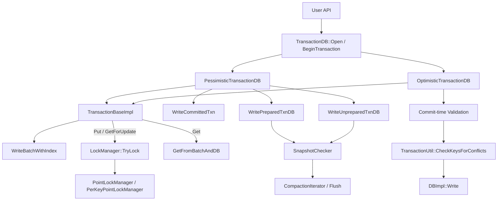
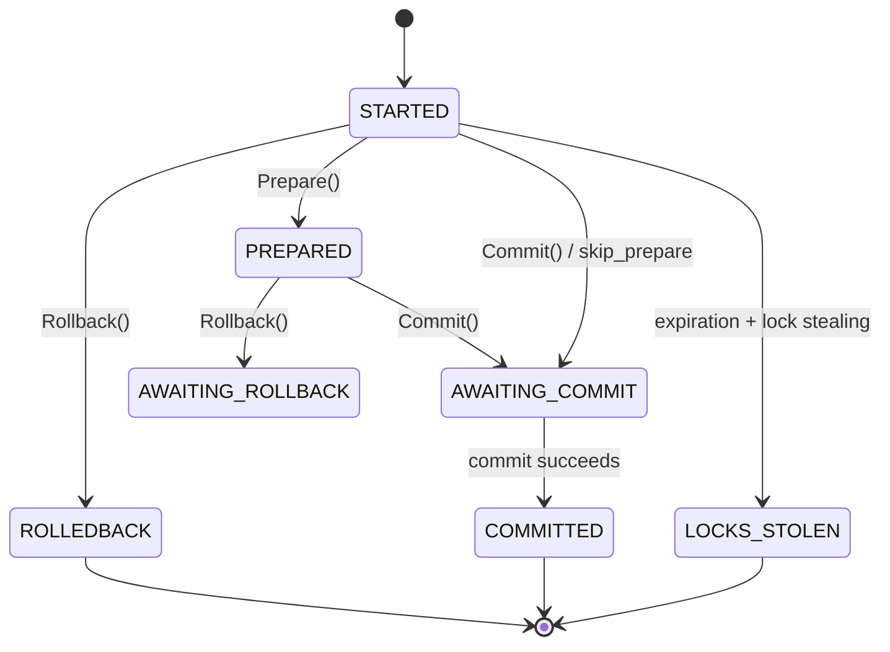

## 今日主题

- 主主题：`事务与并发控制`
- 副主题：`pessimistic / optimistic / write-prepared / write-unprepared`

Day 018 看的是 BlobDB：把大 value 抽到 blob file 之后，LSM 主要负责 key、可见性和索引。Day 019 继续往上走，进入另一个更通用的控制层：

`当多个写者、多个读者、多个 CF、甚至 2PC 恢复一起出现时，RocksDB 不能只靠 sequence number 和 snapshot 解决问题，还要回答“谁能先写、谁该等、谁必须回滚、谁的提交能被看见”。`

这就是事务与并发控制层的职责。

## 学习目标

今天要把下面几件事真正串起来：

1. 看懂 `TransactionDB`、`OptimisticTransactionDB`、`PessimisticTransactionDB` 这几层对象的分工。
2. 分清乐观事务和悲观事务的核心差异：一个是提交时验证，一个是写前加锁。
3. 理解 `TransactionDBOptions`、`TransactionOptions`、`OptimisticTransactionDBOptions` 分别管什么。
4. 看清 `WriteCommitted`、`WritePrepared`、`WriteUnprepared` 三种写策略的区别。
5. 明白 `SnapshotChecker` 为什么会介入 flush / compaction，而不只是事务读路径的附属品。

## 前置回顾

前面几天已经铺过这些基础：

- Day 003 / 004：`WriteBatch`、WAL、sequence number。
- Day 005 / 006：MemTable、读写可见性、删除语义。
- Day 010：Snapshot 与 sequence number 的关系。
- Day 012 / 013 / 015：VersionSet、Compaction、CompactionIterator。
- Day 017：Column Family 的逻辑隔离与共享资源边界。
- Day 018：BlobDB 里读写、恢复和 compaction 如何一起工作。

事务并不是一套新存储引擎，而是在这些已有组件上再加一层“冲突控制 + 事务状态机 + 恢复语义”。

## 源码入口

本章主要看这些文件：

- `D:\program\rocksdb\include\rocksdb\utilities\transaction_db.h`
  - `TransactionDBOptions`
  - `TransactionOptions`
  - `TransactionDB::Open()`
  - `TransactionDB::BeginTransaction()`
- `D:\program\rocksdb\include\rocksdb\utilities\optimistic_transaction_db.h`
  - `OptimisticTransactionDBOptions`
  - `OptimisticTransactionDB::Open()`
- `D:\program\rocksdb\utilities\transactions\pessimistic_transaction_db.h/.cc`
  - `PessimisticTransactionDB`
  - `WriteCommittedTxnDB`
  - `TransactionDB::Open() / PrepareWrap() / WrapDB()`
- `D:\program\rocksdb\utilities\transactions\transaction_base.h/.cc`
  - `TransactionBaseImpl`
  - `TryLock()`
  - `Get() / GetForUpdate() / Put()`
- `D:\program\rocksdb\utilities\transactions\pessimistic_transaction.h/.cc`
  - `PessimisticTransaction`
  - `Prepare() / Commit() / Rollback()`
- `D:\program\rocksdb\utilities\transactions\optimistic_transaction.h/.cc`
  - `OptimisticTransaction`
  - `CommitWithSerialValidate() / CommitWithParallelValidate()`
- `D:\program\rocksdb\utilities\transactions\transaction_util.h/.cc`
  - `TransactionUtil::CheckKeyForConflicts()`
  - `TransactionUtil::CheckKeysForConflicts()`
- `D:\program\rocksdb\utilities\transactions\write_prepared_txn_db.h/.cc`
  - `WritePreparedTxnDB::Initialize()`
  - `WritePreparedTxnDB::IsInSnapshot()`
  - `WritePreparedTxnDB::GetSnapshot()`
- `D:\program\rocksdb\utilities\transactions\write_prepared_txn.h/.cc`
  - `WritePreparedTxn::PrepareInternal()`
  - `WritePreparedTxn::CommitInternal()`
- `D:\program\rocksdb\utilities\transactions\write_unprepared_txn_db.h/.cc`
  - `WriteUnpreparedTxnDB::Initialize()`
  - `WriteUnpreparedTxnDB::NewIterator()`
- `D:\program\rocksdb\utilities\transactions\write_unprepared_txn.h/.cc`
  - `WriteUnpreparedTxn::FlushWriteBatchToDBInternal()`
  - `WriteUnpreparedTxnReadCallback::IsVisibleFullCheck()`
- `D:\program\rocksdb\db\snapshot_checker.h`
- `D:\program\rocksdb\utilities\transactions\snapshot_checker.cc`
- `D:\program\rocksdb\db\db_impl\db_impl_compaction_flush.cc`
- `D:\program\rocksdb\db\compaction\compaction_iterator.h/.cc`
- `D:\program\rocksdb\utilities\transactions\lock\lock_manager.h/.cc`
- `D:\program\rocksdb\utilities\transactions\lock\point\point_lock_manager.h/.cc`
- `D:\program\rocksdb\utilities\transactions\transaction_db_mutex_impl.h/.cc`

## 它解决什么问题

Plain DB 已经有 snapshot，但 snapshot 只解决“读到哪一版数据”。事务还要解决：

- 两个写者写同一个 key，谁先提交。
- 读到旧值后，提交时如何确认期间没有别的写把它改掉。
- 2PC 里准备阶段和提交阶段如何拆开。
- 恢复时如何把 WAL、prepared/commit marker、内存态事务重新拼回去。
- compaction / flush 看到“未提交值”时，能不能把它当成垃圾删掉。

RocksDB 的做法不是把这些逻辑做成一条超级长的链，而是拆成几层：

- `TransactionBaseImpl` 负责事务 API 和 pending write batch。
- `PessimisticTransactionDB` 负责锁管理。
- `OptimisticTransactionDB` 负责提交时冲突验证。
- `WritePreparedTxnDB` / `WriteUnpreparedTxnDB` 负责更细的写策略和恢复语义。
- `SnapshotChecker` 把事务可见性延伸到 compaction / flush。

## 整体链路



## 关键对象

### `TransactionDBOptions`

这是 DB 级的事务配置，决定“这台 DB 作为事务数据库，底层怎么搭”：

- `write_policy`
  - 默认是 `WRITE_COMMITTED`
  - 还可以切到 `WRITE_PREPARED` / `WRITE_UNPREPARED`
- `transaction_lock_timeout`
  - 事务锁等待超时
- `default_lock_timeout`
  - 普通 `DB::Put()` / `DB::Write()` 触发锁等待时用
- `num_stripes`
  - 锁表分片数，越大并发越高，内存也越高
- `custom_mutex_factory`
  - 给锁管理器换一套 mutex / condvar 实现
- `use_per_key_point_lock_mgr`
  - 切到 per-key point lock manager
- `skip_concurrency_control`
  - 让事务层跳过锁与验证
- `default_write_batch_flush_threshold`
  - `WriteUnprepared` 的批量隐式 flush 阈值
- `enable_udt_validation`
  - user-defined timestamp 校验开关

### `TransactionOptions`

这是单个事务的行为开关：

- `set_snapshot`
  - 开事务时就固定 snapshot
- `deadlock_detect`
  - 写前先做死锁探测
- `lock_timeout`
  - 当前事务自己的锁等待时间
- `deadlock_timeout_us`
  - 触发死锁检测的等待阈值
- `expiration`
  - 超时后事务会失效，锁可被偷走
- `skip_concurrency_control`
  - 单个事务跳过并发控制
- `skip_prepare`
  - `Commit()` 前是否必须先 `Prepare()`
- `write_batch_flush_threshold`
  - `WriteUnprepared` 的事务内批量刷盘阈值
- `commit_bypass_memtable`
  - 大事务提交时绕过 memtable 的实验性优化

### `OptimisticTransactionDBOptions`

这是乐观事务提交验证的策略：

- `validate_policy`
  - `kValidateSerial`
  - `kValidateParallel`
- `occ_lock_buckets`
  - 并行验证时的 bucket 数
- `shared_lock_buckets`
  - 多 DB 共享一池验证锁

## 源码细读

### 1. `TransactionDB::Open()` 先把底层 DB 改造成“可做事务”

```cpp
// D:\program\rocksdb\utilities\transactions\pessimistic_transaction_db.cc::TransactionDB::Open
if (txn_db_options.write_policy == WRITE_COMMITTED &&
    db_options.unordered_write) {
  return Status::NotSupported(...);
}
...
PrepareWrap(&db_options_2pc, &column_families_copy,
            &compaction_enabled_cf_indices);
const bool use_seq_per_batch =
    txn_db_options.write_policy == WRITE_PREPARED ||
    txn_db_options.write_policy == WRITE_UNPREPARED;
const bool use_batch_per_txn =
    txn_db_options.write_policy == WRITE_COMMITTED ||
    txn_db_options.write_policy == WRITE_PREPARED;
s = DBImpl::Open(db_options_2pc, dbname, column_families_copy, handles, &db,
                 use_seq_per_batch, use_batch_per_txn, ...);
s = WrapDB(db.release(), txn_db_options, compaction_enabled_cf_indices,
           *handles, dbptr);
```

这里很关键：事务层不是新引擎，而是先把普通 `DBImpl` 打开，再包一层事务壳。

`PrepareWrap()` 会做三件事：

- 打开 `allow_2pc`
- 给 CF 打开 memtable history
- 临时关掉 auto compaction，避免和初始化阶段抢资源

### 2. `OptimisticTransactionDB::Open()` 先补 memtable 历史，再进入 OCC 包装

```cpp
// D:\program\rocksdb\utilities\transactions\optimistic_transaction_db_impl.cc::OptimisticTransactionDB::Open
for (auto& column_family : column_families_copy) {
  if (column_family.options.max_write_buffer_size_to_maintain == 0) {
    column_family.options.max_write_buffer_size_to_maintain = -1;
  }
}
s = DB::Open(db_options, dbname, column_families_copy, handles, &db);
if (s.ok()) {
  *dbptr = new OptimisticTransactionDBImpl(db, occ_options);
}
```

乐观事务要在提交时回看“最近有没有冲突”，所以要给 memtable 留足历史。

它的验证策略也不是“开了就无锁”：

- `kValidateSerial`：在写组内串行验证
- `kValidateParallel`：先按 bucket 加锁，再并行做冲突检查

### 3. `TransactionBaseImpl` 统一承载事务读写骨架

```cpp
// D:\program\rocksdb\utilities\transactions\transaction_base.cc::TransactionBaseImpl::Put
Status s = TryLock(column_family, key, false /* read_only */,
                   true /* exclusive */, do_validate, assume_tracked);
if (s.ok()) {
  s = GetBatchForWrite()->Put(column_family, key, value);
}

// D:\program\rocksdb\utilities\transactions\transaction_base.cc::TransactionBaseImpl::GetForUpdate
Status s = TryLock(column_family, key, true /* read_only */, exclusive,
                   do_validate);
if (s.ok() && value != nullptr) {
  s = GetImpl(read_options, column_family, key, &pinnable_val);
}
```

`TransactionBaseImpl` 不关心你是悲观还是乐观，它只做两件事：

- 先让子类决定要不要“锁 / 追踪 key”
- 再把写入落到 `WriteBatchWithIndex`

所以悲观与乐观的差异，被压缩进 `TryLock()` 的多态实现里。

### 4. `PessimisticTransaction::TryLock()` 是“先锁，再验证，再追踪”

```cpp
// D:\program\rocksdb\utilities\transactions\pessimistic_transaction.cc::PessimisticTransaction::TryLock
if (tracked_locks_->IsPointLockSupported()) {
  status = tracked_locks_->GetPointLockStatus(cfh_id, key_str);
  previously_locked = status.locked;
  lock_upgrade = previously_locked && exclusive && !status.exclusive;
}
if (!previously_locked || lock_upgrade) {
  s = txn_db_impl_->TryLock(this, cfh_id, key_str, exclusive);
}
...
if (!do_validate || (snapshot_ == nullptr && ...)) {
  if (tracked_at_seq == kMaxSequenceNumber) {
    tracked_at_seq = db_->GetLatestSequenceNumber();
  }
} else if (s.ok()) {
  s = ValidateSnapshot(column_family, key, &tracked_at_seq);
}
if (s.ok()) {
  TrackKey(cfh_id, key_str, tracked_at_seq, read_only, exclusive);
}
```

这里的顺序不能乱：

1. 看 key 是否已经锁过。
2. 需要的话去 `LockManager` 真正抢锁。
3. 如果带 snapshot，就校验 snapshot 期间有没有冲突。
4. 最后把 key 放进 `tracked_locks_`，以便 rollback / savepoint / unlock。

这就是悲观事务的核心路径。

### 5. `OptimisticTransaction` 不是无锁，只是把验证延后到 commit

```cpp
// D:\program\rocksdb\utilities\transactions\optimistic_transaction.cc::OptimisticTransaction::TryLock
SetSnapshotIfNeeded();
SequenceNumber seq = snapshot_ ? snapshot_->GetSequenceNumber()
                               : db_->GetLatestSequenceNumber();
TrackKey(cfh_id, key_str, seq, read_only, exclusive);
return Status::OK();

// D:\program\rocksdb\utilities\transactions\optimistic_transaction.cc::CommitWithParallelValidate
for (...) {
  auto lock_bucket_ptr = &txn_db_impl->GetLockBucket(key_it->Next(), seed);
  lk_ptrs.insert(lock_bucket_ptr);
}
for (auto v : lk_ptrs) {
  v->Lock();
}
Status s = TransactionUtil::CheckKeysForConflicts(db_impl, *tracked_locks_,
                                                  true /* cache_only */);
if (!s.ok()) return s;
s = db_impl->Write(write_options_, GetWriteBatch()->GetWriteBatch());
```

乐观事务的本质是：

- 写入阶段只记录“我动了哪些 key”
- 提交阶段再做一致性检查

并行验证时它还会先给 bucket 排序加锁，避免验证过程本身形成死锁。

### 6. `TransactionUtil::CheckKeyForConflicts()` 是冲突判断的总入口

```cpp
// D:\program\rocksdb\utilities\transactions\transaction_util.cc::TransactionUtil::CheckKeyForConflicts
SequenceNumber earliest_seq = db_impl->GetEarliestMemTableSequenceNumber(sv, true);
if (snap_seq < earliest_seq || min_uncommitted <= earliest_seq) {
  need_to_read_sst = true;
}
SequenceNumber lower_bound_seq =
    (min_uncommitted == kMaxSequenceNumber) ? snap_seq : min_uncommitted;
Status s = db_impl->GetLatestSequenceForKey(
    sv, key, !need_to_read_sst, lower_bound_seq, &seq, ...);
if (found_record_for_key) {
  bool write_conflict = snap_checker == nullptr
                            ? snap_seq < seq
                            : !snap_checker->IsVisible(seq);
}
```

这里有两个要点：

- 如果 memtable 历史不够长，RocksDB 可能没法安全地只靠 memtable 判断冲突。
- 如果启用了 user-defined timestamp，还会继续做 timestamp 维度的校验。

所以乐观事务的失败并不只是“真的冲突了”，也可能是“历史不够，无法证明没冲突”，这时会返回 `TryAgain`。

### 7. `WritePreparedTxnDB` 把 prepare / commit 变成可恢复的元数据

```cpp
// D:\program\rocksdb\utilities\transactions\write_prepared_txn_db.cc::WritePreparedTxnDB::Initialize
auto rtxns = dbimpl->recovered_transactions();
for (const auto& rtxn : rtxns) {
  AddPrepared(seq + i);
}
AdvanceMaxEvictedSeq(prev_max, last_seq);
db_impl_->SetSnapshotChecker(new WritePreparedSnapshotChecker(this));
db_impl_->SetRecoverableStatePreReleaseCallback(
    new CommitSubBatchPreReleaseCallback(this));
```

`WritePrepared` 的思路是：

- prepare 时把数据写进 WAL / memtable
- commit 时只写 commit marker，并把 `prepare_seq -> commit_seq` 放进 commit cache
- recovery 时把这些内存态结构重新拼起来

`SnapshotChecker` 也就在这里接入了 compaction / flush。

### 8. `WriteUnpreparedTxn` 把写入再前移一步，但可见性更复杂

```cpp
// D:\program\rocksdb\utilities\transactions\write_unprepared_txn.cc::WriteUnpreparedTxnReadCallback::IsVisibleFullCheck
for (const auto& it : unprep_seqs_) {
  if (it.first <= seq && seq < it.first + it.second) {
    return true;
  }
}
bool snap_released = false;
auto ret = db_->IsInSnapshot(seq, wup_snapshot_, min_uncommitted_, &snap_released);
return ret;
```

`WriteUnprepared` 不是简单地“更快”，而是把事务内部的未提交序列集合显式带进可见性判断里。

它更像是在 `WritePrepared` 的基础上，再往前推进一步：

- `Put()` 就可能先触发落库
- iterator / recovery 要处理 `unprep_seqs_`
- rollback 需要更细的补偿逻辑

## 写策略对比

| 模式 | 数据何时进入 DB | 提交时做什么 | 主要收益 | 主要代价 |
| --- | --- | --- | --- | --- |
| `WRITE_COMMITTED` | commit 后 | 写入真正可见数据 | 语义最简单 | commit 阶段重，缓冲压力大 |
| `WRITE_PREPARED` | prepare 时 | commit marker + commit cache | commit 变轻，适合 2PC | 需要处理 prepared / committed 的可见性 |
| `WRITE_UNPREPARED` | Put 时 | 通过 prepare/commit marker 收敛状态 | commit 最轻 | 恢复、迭代器、回滚语义最复杂 |

悲观 / 乐观是并发控制方式，`WriteCommitted / Prepared / Unprepared` 是写入时机和恢复语义。两者不是同一维度。

## 事务状态机



这张图对应的是悲观事务的主状态。`WritePrepared` / `WriteUnprepared` 还会带上 `prepare_seq`、`commit_seq`、`unprep_seqs_`、commit cache 等额外元数据。

## 锁管理器

`TransactionDBOptions` 里有两个容易忽略但很实用的选项：

- `use_per_key_point_lock_mgr`
  - 默认走 `PointLockManager`
  - 打开后切到 `PerKeyPointLockManager`
- `num_stripes`
  - 锁表拆成多少个 stripe，影响并发度

工厂选择在这里：

```cpp
// D:\program\rocksdb\utilities\transactions\lock\lock_manager.cc::NewLockManager
if (opt.lock_mgr_handle) {
  auto mgr = opt.lock_mgr_handle->getLockManager();
  return std::shared_ptr<LockManager>(opt.lock_mgr_handle, mgr);
} else {
  if (opt.use_per_key_point_lock_mgr) {
    return std::make_shared<PerKeyPointLockManager>(db, opt);
  } else {
    return std::make_shared<PointLockManager>(db, opt);
  }
}
```

所以锁管理不是“一个 mutex 搞定”，而是可替换的策略层。

## 持久化与恢复

事务恢复时，RocksDB 不是只看 WAL 的原始 record，而是把“事务壳”和“事务状态”一起恢复出来。

### `WritePreparedTxnDB`

- 从 `dbimpl->recovered_transactions()` 里取回恢复出的 shell transaction。
- 用 `AddPrepared()` 重建 prepared 列表。
- 用 `AdvanceMaxEvictedSeq()` 维护 commit cache 的窗口。
- 安装 `WritePreparedSnapshotChecker`，让 compaction / flush 能问“这个 seq 对某个 snapshot 到底可不可见”。

### `WriteUnpreparedTxnDB`

- 初始化时也会安装 `WritePreparedSnapshotChecker`。
- 恢复时可以直接回滚不该保留的 unprepared transaction。
- iterator 创建时会把 `unprep_seqs_` 和 snapshot 绑在一起，避免把未验证的值当成已提交值。

这里的核心不是“恢复一个对象”，而是恢复一组互相引用的状态：

- WAL
- commit / prepare marker
- snapshot 列表
- prepared / unprepared 序列窗口
- 事务名 / 事务 ID

## compaction / flush 与 `SnapshotChecker`

这个点很容易漏，但它是事务系统和 LSM 交界处最关键的地方之一。

`SnapshotChecker` 的作用不是普通读路径上的“帮忙查一下可见性”，而是让 flush / compaction 在清理旧版本时知道：

- 哪些值肯定还在 snapshot 里
- 哪些值肯定不在 snapshot 里
- 哪些值因为 snapshot 已释放，暂时不能贸然下结论

```cpp
// D:\program\rocksdb\db\snapshot_checker.h / utilities/transactions/snapshot_checker.cc
bool in_snapshot = txn_db_->IsInSnapshot(
    sequence, snapshot_sequence, kMinUnCommittedSeq, &snapshot_released);
```

```cpp
// D:\program\rocksdb\db\compaction\compaction_iterator.h
return snapshot_checker_ == nullptr ||
       snapshot_checker_->CheckInSnapshot(sequence, job_snapshot_) ==
           SnapshotCheckerResult::kInSnapshot;
```

```cpp
// D:\program\rocksdb\db\db_impl\db_impl_compaction_flush.cc
if (snapshot_checker) {
  const Snapshot* snapshot =
      GetSnapshotImpl(/*is_write_conflict_boundary=*/false, /*lock=*/false);
  managed_snapshot.reset(new ManagedSnapshot(this, snapshot));
}
job_context->InitSnapshotContext(
    snapshot_checker, std::move(managed_snapshot),
    earliest_write_conflict_snapshot, std::move(snapshot_seqs));
```

这说明事务的可见性边界和 compaction 的清理边界其实是同一件事的两面：

- 事务读需要知道“我能不能看到它”
- compaction 需要知道“我能不能删掉它”

`SnapshotChecker` 就是把这两个世界接起来的桥。

## 今日问题与讨论

### RocksDB 的事务都是串行化的吗？

不是。更准确地说，RocksDB 事务不是“所有事务进入一个全局串行队列依次执行”，而是围绕 key 的读写集合做并发控制。

源码里有几个边界要分清：

1. `Commit()` 最终会进入 `DBImpl::Write()` 或 `WriteWithCallback()`，sequence number 和 memtable 写入会有一个全局顺序。  
   这说明提交结果可以落到一个确定的写入顺序里，但不等于事务执行过程被全局串行化。
2. 悲观事务在 `Put()` / `GetForUpdate()` 前先走 `TryLock()`。  
   默认是 point key 锁，非冲突 key 可以并发执行；只有命中同一个 key 或同一段 range lock 时才互相阻塞。
3. 乐观事务的 `TryLock()` 只是 `TrackKey()`，真正冲突检测发生在 `CommitWithSerialValidate()` 或 `CommitWithParallelValidate()`。  
   其中 `kValidateSerial` 只是“提交阶段的 validation 在 write group 里串行做”，不是说事务隔离级别就是全局 serializable。
4. 普通 `Transaction::Get()` 不会自动把读过的 key 纳入冲突检测。  
   需要防止后续外部写破坏本事务读到的值时，要用 `GetForUpdate()`。源码注释也明确说，`GetForUpdate()` 会确保该 key 在第一次读或 snapshot 之后没有被事务外写入。
5. predicate / range 语义不是默认自动保护的。  
   默认 point lock 只能保护具体 key；如果要保护范围，需要配置 range lock manager 并显式使用 `GetRangeLock()`。否则 iterator 或范围查询并不会自动给整个谓词范围加锁，仍可能有 phantom 风险。

因此可以这样记：

- RocksDB 能保证事务内写入用一个 batch 原子提交。
- 对被追踪的 key，悲观事务靠锁，乐观事务靠 commit validation 来防止 write conflict。
- `SetSnapshot()` 提供更严格的 snapshot-based 校验边界，但它只影响后续被写入或 `GetForUpdate()` 追踪的 key；它不会让普通 `Get()` 自动参与冲突检测。
- 如果应用把所有会影响业务判断的 key 都用 `GetForUpdate()` 追踪，并对范围谓词使用 range lock，那么可以构造更接近 serializable 的行为。
- 如果只是普通 `Get()` + 后续 `Put()`，RocksDB 不会自动知道这个读依赖，不能把它理解成完整数据库意义上的 serializable transaction。

这也是为什么 RocksDB 的事务层更像一个存储引擎提供的并发控制工具箱，而不是 SQL 数据库直接暴露的固定隔离级别。上层系统要把“哪些读会影响写决策”明确表达给 RocksDB。

更细一点说，你的判断可以修正为：

`如果所有影响事务决策的读写 key 都被 RocksDB 追踪，并且谓词 / range 读也用 range lock 表达，那么这套冲突控制可以形成冲突可串行化的执行。`

但这不是“悲观事务默认所有用法都自动 serializable”。原因是：

- `GetForUpdate()` 不是只给乐观事务用的。它在悲观事务里是真正的“读锁 / 读集合追踪”入口；在乐观事务里则是“读集合追踪 + commit validation”入口。
- 悲观事务默认会给 `Put()` / `Merge()` / `Delete()` 这类写操作加锁，所以 write-write conflict 会被挡住。
- 悲观事务不会把普通 `Get()` 自动升级成 `GetForUpdate()`。如果事务用普通 `Get()` 读了 `A`，再根据 `A` 去写 `B`，RocksDB 默认并不知道 `A` 是这个事务的 read dependency。
- 所以悲观事务默认更准确地说是“对写集合和显式 `GetForUpdate()` 读集合做 pessimistic concurrency control”，而不是“自动对事务里所有读写做 strict 2PL”。

一个典型反例是 write skew：

```text
初始：A = 0, B = 0

T1: Get(A), Get(B) 看到 0,0，然后 Put(A, 1)
T2: Get(A), Get(B) 看到 0,0，然后 Put(B, 1)
```

如果这里的 `Get()` 都只是普通读，T1 只锁 `A`，T2 只锁 `B`，两者写集合不冲突，就可能都提交。这个结果不等价于某个串行顺序，因为任意一个事务排在另一个后面时，都应该看到对方已经写过的 key。

如果把读改成 `GetForUpdate(A)` / `GetForUpdate(B)`，那么 `A` 和 `B` 都进入锁集合或验证集合，冲突就会暴露出来。悲观事务下通常表现为等待、死锁检测、timeout 或其中一个事务失败；乐观事务下通常表现为 commit validation 失败。

## 横向对比

### 悲观 vs 乐观

- 悲观事务把冲突前移到写路径，适合冲突频繁的场景。
- 乐观事务把冲突后移到提交点，适合冲突较少、读多写少的场景。
- 乐观事务并不等于没有锁，它只是把锁的范围从“key 级写入”缩成了“提交验证的 bucket 级协调”。

### `TransactionDB` vs `OptimisticTransactionDB`

- `TransactionDB` 是统一入口，下面可以跑 `WriteCommitted / WritePrepared / WriteUnprepared`。
- `OptimisticTransactionDB` 是另一条 API 线，核心是 OCC validation。
- 两者共享很多底层组件，但并发控制哲学不同。

## 常见误区

- `OptimisticTransactionDB` 不是无锁事务，只是把冲突检测挪到 commit。
- `SetSnapshot()` 不会改变你已经写进去的 pending writes，它主要影响后续写和 `GetForUpdate()`。
- `TransactionDB::Write()` 不是“绕过事务层”，它在很多配置下仍会走并发控制。
- `WritePrepared` / `WriteUnprepared` 不是简单的“写得更早”，它们都需要额外的恢复和可见性元数据。
- `SnapshotChecker` 不是只给事务读用的，它会直接影响 compaction / flush 的清理决策。

## 设计动机

这章最重要的工程判断其实是：

1. 要不要把锁前移到写路径。  
   冲突多就前移，冲突少就后移。
2. 要不要把数据前移到 memtable。  
   提交越重，就越倾向于把一部分工作提前做掉。
3. 要不要让 compaction 理解事务可见性。  
   如果不让它理解，恢复和 GC 都会出错。

所以 RocksDB 的事务不是单点技巧，而是一组互相制衡的设计：

- 锁
- snapshot
- validation
- prepare / commit marker
- commit cache
- snapshot checker
- recovery callback

## 今日小结

今天先把事务层的骨架搭起来了：

- `TransactionDB` 不是独立引擎，而是普通 DB 的事务壳。
- 悲观事务靠锁和 snapshot 验证维持隔离。
- 乐观事务靠提交时冲突检测维持隔离。
- `WritePrepared` / `WriteUnprepared` 把提交代价往前或往后挪，但都要付出额外的可见性复杂度。
- `SnapshotChecker` 把事务语义延伸到了 compaction / flush。

## 明日衔接

如果继续 Day 019，下一步就是把下面两条链路压实：

- `PessimisticTransaction::Commit / Rollback / Prepare` 的完整状态流
- `WritePrepared / WriteUnprepared` 的恢复、snapshot 和 iterator 细节

如果这一章的复习题答完并且链路闭合，再进入 Day 020：参数调优 / Rate Limiter / Write Stall。

## 复习题

1. `TransactionDB::Open()` 为什么要先做 `PrepareWrap()` 再 `WrapDB()`？
2. `TransactionBaseImpl::Put()` 和 `GetForUpdate()` 在悲观事务里分别先做了什么，为什么顺序不能反？
3. `OptimisticTransaction::CommitWithParallelValidate()` 为什么要先把 bucket 排序后再加锁？
4. `TransactionUtil::CheckKeyForConflicts()` 为什么有时会返回 `TryAgain`，这和 memtable 历史有什么关系？
5. `WritePreparedTxnDB` 为什么要安装 `SnapshotChecker`，它为什么会影响 compaction？
6. `WriteUnpreparedTxnReadCallback::IsVisibleFullCheck()` 为什么先查 `unprep_seqs_` 再查 `IsInSnapshot()`？
7. `WRITE_COMMITTED / WRITE_PREPARED / WRITE_UNPREPARED` 三种写策略分别把复杂度放到了哪里？

## 复习题回答评估

本次回答的主线可以通过，评估结果记为 `partial`。前四题已经抓住核心；第 5 题方向接近但要区分 snapshot visibility 与 write conflict；第 6、7 题需要纠偏。

回答正确或基本正确的主线：

- `TransactionDB::Open()` 先 `PrepareWrap()` 再 `WrapDB()`，是因为底层 `DBImpl::Open()` 前必须先打开事务需要的环境：memtable history、`allow_2pc`，并临时关闭自动 compaction，避免打开和包装之间出现并发边界。
- `TransactionBaseImpl::Put()` 和 `GetForUpdate()` 在悲观事务里都会先走 `TryLock()`；顺序不能反，因为如果先读或先写 batch 再加锁，期间可能已有外部写入破坏事务隔离。
- `OptimisticTransaction::CommitWithParallelValidate()` 先收集 bucket mutex，并按地址有序加锁，是为了让并发事务遵守同一加锁顺序，避免 commit validation 阶段死锁。
- `TransactionUtil::CheckKeyForConflicts()` 在 memtable history 不足时可能返回 `TryAgain`，因为它优先依赖 memtable 历史判断某个 key 在 snapshot 之后是否被写过；历史不够长时，cache-only validation 无法安全给出结论。

需要纠偏的点：

1. `WritePreparedTxnDB` 安装 `SnapshotChecker` 不是为了“检查是否冲突”。
   - 冲突检测主要仍在事务锁、`ValidateSnapshot()`、`TransactionUtil::CheckKeyForConflicts()` 这条链上。
   - `SnapshotChecker` 的核心职责是回答“某个 prepare seq / commit seq 对某个 snapshot 是否可见”。
   - 因为 `WRITE_PREPARED` 会在 prepare 阶段把数据写进 memtable / SST，而真实可见性取决于后续 commit marker / commit cache，所以 compaction 不能只按 sequence number 的普通规则清理旧版本。
   - 因此它影响 compaction 的方式是：让 compaction 在删除旧版本时尊重事务 snapshot visibility，避免把仍可能被事务 snapshot 看到的版本提前删掉。

2. `WriteUnpreparedTxnReadCallback::IsVisibleFullCheck()` 的检查顺序是有语义的。
   - 源码先遍历 `unprep_seqs_`，命中当前事务自己的 unprepared seq range 就直接返回 `true`。
   - 这保证了事务能读到自己的 unprepared writes。
   - 如果先走 `IsInSnapshot()`，这些还没有按全局提交语义完成的 seq 可能被判为不可见。
   - 所以它不是两个无序条件的简单与/或，而是“先处理本事务自写可见性，再处理全局 snapshot 可见性”。

3. 三种 write policy 的复杂度不是“放到对应 DB 类里”这么简单。
   - `WRITE_COMMITTED`：数据到 commit 才写入 DB，读路径最简单，但大事务会占用事务内存，commit 阶段更重。
   - `WRITE_PREPARED`：prepare 阶段写入 DB，commit 变轻，但需要 commit cache、prepared set、`SnapshotChecker` 和恢复逻辑来区分 prepared / committed visibility。
   - `WRITE_UNPREPARED`：更早把数据写入 DB，commit 更轻，但 read callback、`unprep_seqs_`、rollback、恢复和 iterator 可见性最复杂。

当前结论：Day 019 没有阻断点，可以进入 Day 020；但后续学习参数调优、write stall、unordered write 或事务恢复时，应回看这三个边界：`SnapshotChecker` 不是冲突检测器、`unprep_seqs_` 必须先于 `IsInSnapshot()` 处理、write policy 是复杂度位置的取舍。
