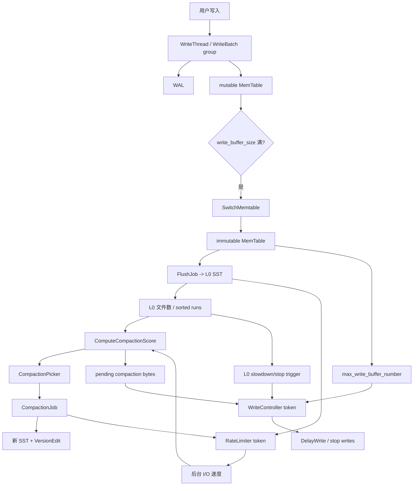

## 今日主题

- 主主题：`参数调优`
- 副主题：`Rate Limiter / Write Stall`

Day 014 已经详细看过 compaction strategy、RateLimiter 和 Write Stall 的实现入口，所以 Day 020 不重复讲“什么是 write stall”。今天换一个角度：

`一个 RocksDB 参数不是孤立开关。它会沿着 write path、flush、L0、compaction score、后台线程、I/O token、WriteController 一路传导，最后表现为吞吐、延迟、放大系数、内存占用和恢复时间。`

今天重点是三件事：

1. 参数的含义是什么。
2. 参数真正作用到哪条源码链路。
3. 遇到性能问题时，应该按什么顺序调。

## 学习目标

今天要建立一套“调参脑图”：

- 能把常见参数按层次分组：memtable、L0、level target、compaction、I/O、write stall、事务历史。
- 能说明 `write_buffer_size`、`max_write_buffer_number`、`level0_*_trigger`、`max_bytes_for_level_base`、`target_file_size_base`、`compression_per_level` 的作用链路。
- 能区分“提高阈值”和“解决后台债务”的区别。
- 能说明 `RateLimiter` 限的是文件 I/O token，不是直接限制前台 `Put()`。
- 能整理一套从观测到调参的实用顺序。

## 前置回顾

前面已经铺过这些点：

- Day 003 / 004：写入先进入 WAL 和 memtable。
- Day 007：memtable 满了以后切换成 immutable memtable，再由 flush 生成 L0 SST。
- Day 013 / 014：compaction 负责把 L0 和下层 SST 整理成更稳定的 LSM 形状。
- Day 017：Column Family 之间独立维护 memtable / SST，但共享 DB 级资源。
- Day 019：事务需要 memtable history 来做冲突检测。

所以参数调优不是“背默认值”，而是看这些默认值如何改变几条链：

```text
写入吸收能力 -> flush 频率 -> L0 文件数 -> compaction 债务 -> stall 风险
内存预算 -> 多 CF 竞争 -> WriteBufferManager -> flush/stall
后台 I/O -> RateLimiter -> flush/compaction 追赶速度 -> 前台延迟
level target -> compaction score -> 写/读/空间放大
```

## 源码入口

本章主要看这些文件：

- `D:\program\rocksdb\include\rocksdb\options.h`
  - `ColumnFamilyOptions::write_buffer_size`
  - `ColumnFamilyOptions::level0_file_num_compaction_trigger`
  - `ColumnFamilyOptions::max_bytes_for_level_base`
  - `ColumnFamilyOptions::compression`
  - `ColumnFamilyOptions::disable_auto_compactions`
  - `DBOptions::max_background_jobs`
  - `DBOptions::max_background_compactions / max_background_flushes`
  - `DBOptions::rate_limiter`
  - `DBOptions::db_write_buffer_size`
  - `DBOptions::write_buffer_manager`
  - `DBOptions::max_total_wal_size`
  - `DBOptions::bytes_per_sync / wal_bytes_per_sync`
  - `DBOptions::delayed_write_rate`
  - `WriteOptions::no_slowdown / rate_limiter_priority`
- `D:\program\rocksdb\include\rocksdb\advanced_options.h`
  - `AdvancedColumnFamilyOptions::max_write_buffer_number`
  - `AdvancedColumnFamilyOptions::min_write_buffer_number_to_merge`
  - `AdvancedColumnFamilyOptions::max_write_buffer_size_to_maintain`
  - `AdvancedColumnFamilyOptions::compression_per_level`
  - `AdvancedColumnFamilyOptions::level0_slowdown_writes_trigger`
  - `AdvancedColumnFamilyOptions::level0_stop_writes_trigger`
  - `AdvancedColumnFamilyOptions::target_file_size_base`
  - `AdvancedColumnFamilyOptions::max_bytes_for_level_multiplier`
  - `AdvancedColumnFamilyOptions::soft_pending_compaction_bytes_limit`
  - `AdvancedColumnFamilyOptions::hard_pending_compaction_bytes_limit`
- `D:\program\rocksdb\options\cf_options.h/.cc`
  - `MutableCFOptions`
  - `MutableCFOptions::RefreshDerivedOptions()`
  - `MaxFileSizeForLevel()`
- `D:\program\rocksdb\db\version_set.cc`
  - `VersionStorageInfo::CalculateBaseBytes()`
  - `VersionStorageInfo::ComputeCompactionScore()`
- `D:\program\rocksdb\db\column_family.cc`
  - `ColumnFamilyData::GetWriteStallConditionAndCause()`
  - `ColumnFamilyData::RecalculateWriteStallConditions()`
- `D:\program\rocksdb\db\write_controller.h/.cc`
  - `WriteController`
  - `WriteController::GetDelay()`
- `D:\program\rocksdb\db\db_impl\db_impl_write.cc`
  - `DBImpl::DelayWrite()`
  - `DBImpl::WriteBufferManagerStallWrites()`
  - `DBImpl::ThrottleLowPriWritesIfNeeded()`
- `D:\program\rocksdb\include\rocksdb\rate_limiter.h`
- `D:\program\rocksdb\util\rate_limiter.cc`
- `D:\program\rocksdb\file\writable_file_writer.cc`
- `D:\program\rocksdb\db\flush_job.cc`
- `D:\program\rocksdb\db\compaction\compaction_job.cc`
- `D:\program\rocksdb\include\rocksdb\write_buffer_manager.h`

外部资料本章不作为事实标准；结论以本地源码为准。

## 它解决什么问题

RocksDB 调参通常是在几类矛盾之间取平衡：

| 目标 | 常见收益 | 常见代价 |
| --- | --- | --- |
| 提高写吞吐 | 更大的 memtable、更多后台 compaction、更大的 L0 容忍度 | 更高内存、更长恢复、更高读放大、stall 被推迟但可能更重 |
| 降低读延迟 | 更少 L0 文件、更稳定 leveled 形状、更积极 compaction | 更高写放大和后台 I/O |
| 降低写放大 | 更大的 level target、Universal、延迟整理、压缩策略调整 | 读放大、空间放大或峰值 I/O 可能上升 |
| 控制内存 | `db_write_buffer_size` / `WriteBufferManager` / block cache 分配 | 过紧会频繁 flush 或触发全局 stall |
| 控制 I/O 冲击 | RateLimiter、`bytes_per_sync`、后台线程限制 | 后台追赶慢时会触发 write stall |
| 控制空间放大 | 更积极 compaction、更低 pending debt、更强底层压缩 | 写放大、CPU 和 I/O 增加 |

所以“怎么调”不能从某个单一参数开始。更稳的方式是先问：

1. 现在卡在前台写入、后台 flush、后台 compaction、磁盘 I/O、CPU 压缩，还是内存？
2. stall 的直接触发源是 memtable、L0 文件数、pending compaction bytes，还是 WriteBufferManager？
3. 业务瓶颈更怕写放大、读放大、空间放大，还是尾延迟？

这里还有一个重要判断：**在很多 RocksDB 调参讨论里，读延迟不是不重要，而是它通常不像写入延迟那样被某个保护阈值突然“掐住”。**

写入侧有非常明确的悬崖：

- memtable 堆积到 `max_write_buffer_number`，前台写入可能等待。
- L0 文件数达到 `level0_slowdown_writes_trigger / level0_stop_writes_trigger`，前台写入会 delay / stop。
- pending compaction bytes 达到 soft / hard limit，前台写入会 delay / stop。
- `WriteBufferManager::allow_stall=true` 时，全局 memtable 内存超过预算也会阻塞写入。

读侧一般没有一个对称的 `ReadController` 在某个 L0 文件数上直接让读请求 sleep。点查通常按 memtable、immutable memtable、L0、L1+ 的顺序查；在 leveled compaction 下，L1+ 大多每层只需定位少量候选文件，Bloom filter、block cache 和 OS page cache 又会把很多额外查找的代价吸收掉。因此在常见 point read + cache 命中 + LSM 形状还正常的场景里，读延迟更像是随着读放大、cache miss 和 I/O 竞争逐步变差，而不是像 write stall 一样突然进入 delay / stop 状态。

所以 Day 020 这种调参章节经常先平衡这些东西：

- 写入延迟和 write stall。
- 写放大。
- 空间放大。
- flush / compaction 写 I/O。
- 后台还债能力。

但这不表示读延迟可以忽略。下面这些场景里，读延迟会成为第一矛盾：

- L0 文件数长期偏高，点查要检查更多 sorted runs。
- Bloom filter 没配好、false positive 偏高，或者读的是 range / iterator，Bloom 无法充分帮忙。
- block cache / index / filter cache hit rate 下降，冷读落到磁盘。
- compaction / flush 抢占设备 I/O，读请求排队。
- Universal / tiered compaction 为了降低写放大而保留更多 sorted runs。
- 多 CF / 多 DB 共享 cache 和磁盘，某个写热点 CF 把读侧资源挤掉。

实用判断是：如果读 p99 稳定、写 p99 或 stall micros 异常，优先从写侧还债能力和 stall 触发源下手；如果读 p99 随 L0 文件数、cache miss、compaction read/write bytes 一起升高，就不要只为了写吞吐继续放宽 L0 或降低 compaction，而要先恢复 LSM 形状、cache 命中和 I/O 隔离。

## 整体链路



这张图是今天的核心：参数会落在不同节点上，但最终互相反馈。

- `write_buffer_size` 改变 memtable 多久切换一次。
- `max_write_buffer_number` 改变 flush 落后时能堆多少 immutable memtable。
- `level0_file_num_compaction_trigger` 改变 L0 何时开始 compact。
- `level0_slowdown_writes_trigger / level0_stop_writes_trigger` 改变 L0 文件数何时触发背压。
- `max_bytes_for_level_base / max_bytes_for_level_multiplier` 改变 L1+ 的目标容量和 compaction score。
- `target_file_size_base` 改变 compaction 输出文件粒度。
- `rate_limiter` 改变 flush / compaction 文件 I/O 能力。
- `max_background_jobs` 改变后台追债并发能力。
- `soft_pending_compaction_bytes_limit / hard_pending_compaction_bytes_limit` 不是性能优化本身，而是债务保护阈值。

## 参数分层速览

### 1. MemTable 写入吸收层

| 参数 | 层级 | 主要含义 | 调大通常意味着 | 调小通常意味着 |
| --- | --- | --- | --- | --- |
| `write_buffer_size` | CF | 单个 mutable memtable 的目标大小 | flush 更少、更大 L0 文件、更长恢复、更多内存 | flush 更频繁、L0 文件更多、恢复更快、内存更低 |
| `max_write_buffer_number` | CF | mutable + immutable memtable 可堆积数量上限 | 能吸收 flush 短时落后，但内存更高 | 更早 stall，保护内存 |
| `min_write_buffer_number_to_merge` | CF | flush 前至少合并多少 immutable memtable | 可能减少 L0 文件和重复 key，但等待更多内存积累 | 更及时 flush，L0 文件可能更多 |
| `max_write_buffer_size_to_maintain` | CF | 保留多少已 flush memtable history | 事务冲突检测少读 SST，内存更高 | 内存更低，乐观事务可能更容易 `TryAgain` |
| `db_write_buffer_size` | DB | 多 CF 总 memtable 上限 | 控制整体内存预算 | 过低会触发频繁 flush |
| `write_buffer_manager` | DB / 多 DB | 可跨 DB / CF 统计 memtable 内存 | 能共享全局预算和可选 stall | 需要结合 block cache / allow_stall 理解 |

### 2. L0 与 Compaction 触发层

| 参数 | 层级 | 主要含义 |
| --- | --- | --- |
| `level0_file_num_compaction_trigger` | CF | L0 文件数达到多少开始触发 compaction |
| `level0_slowdown_writes_trigger` | CF | L0 文件数达到多少开始 delayed writes |
| `level0_stop_writes_trigger` | CF | L0 文件数达到多少 stop writes |
| `soft_pending_compaction_bytes_limit` | CF | 估算 compaction debt 达到多少开始 delay |
| `hard_pending_compaction_bytes_limit` | CF | 估算 compaction debt 达到多少 stop |

这里要记住一条硬边界：

`trigger <= slowdown <= stop`

调大 `slowdown/stop` 可以减少 stall 出现频率，但不能让后台 compaction 变快。它只是允许 LSM 积累更多债务。

### 3. Level 形状与输出文件层

| 参数 | 层级 | 主要含义 |
| --- | --- | --- |
| `max_bytes_for_level_base` | CF | L1 或 base level 的目标总容量 |
| `max_bytes_for_level_multiplier` | CF | 相邻 level 目标容量倍数 |
| `level_compaction_dynamic_level_bytes` | CF immutable | 动态选择 base level，默认打开 |
| `target_file_size_base` | CF | compaction 输出 SST 的基础目标大小 |
| `target_file_size_multiplier` | CF | 更深层输出 SST 的文件大小倍数 |
| `max_compaction_bytes` | CF | 单次 compaction 输入规模软限制 |
| `compression_per_level` | CF | 每层压缩策略 |

这组参数决定 LSM 的“形状”。形状不对时，表现可能不是立刻 stall，而是读放大、空间放大、写放大和后台 I/O 长期不稳定。

### 4. 后台资源与 I/O 层

| 参数 | 层级 | 主要含义 |
| --- | --- | --- |
| `max_background_jobs` | DB | flush + compaction 后台 job 总数 |
| `max_subcompactions` | DB | 单个 compaction job 内部可拆分的并行子任务数 |
| `rate_limiter` | DB / 可共享 | 限制内部文件读写带宽；DB 默认禁用，显式创建 `NewGenericRateLimiter()` 时默认 mode 是写 I/O |
| `bytes_per_sync` | DB | SST 写入时做后台 writeback 的粒度 |
| `wal_bytes_per_sync` | DB | WAL 写入时做后台 writeback 的粒度 |
| `compaction_readahead_size` | DB | compaction 读输入时的预读大小 |

这组参数回答的是：后台到底有没有能力把债还掉。

## 默认值速查

下面的默认值以本地 `D:\program\rocksdb` 源码为准。这里的“为什么这样默认”不是说它适合所有 workload，而是解释 RocksDB 为什么选择一个相对保守、可启动、可恢复的通用基线。

先回答一个容易误解的问题：**这组默认值不是容量规划，也不承诺“支持多少 QPS / 多少并发”。**公开资料里也没有一个官方表格说“默认 options = X 核机器、Y 并发、Z 请求/秒”。能确认的是下面几条边界：

- 官方 tuning guide 的口径是：在 SSD 上的普通应用，RocksDB out-of-box 表现通常可以接受；如果要 fine-tune，第一步不是背默认值，而是理解 workload 和 bottleneck。也就是说，默认值面向的是“先能稳定跑起来”的通用场景，不是“压满硬件”的 benchmark 配置。
- 官方 basic tuning 文档也把大量 options 描述成多数用户可以先忽略的默认项，但同时建议新项目显式做基础调优，例如为 block cache 分配内存、按机器能力提高后台并发。这说明 defaults 更像保守基线，而不是最佳生产配置。
- 本地 `db_bench` 源码里，纯 `db_bench` 默认前台 `--threads=1`，`write_buffer_size=64MB`，`max_background_jobs=2`。而本地 `tools/benchmark.sh` 面向官方/回归 benchmark，默认 `NUM_THREADS=64`、`CACHE_SIZE=16GB`、`MAX_BACKGROUND_JOBS=16`、`NUM_KEYS=8000000000`。这已经说明公开 benchmark 常用的是 benchmark harness 配置，不是纯 Options 默认值。
- RocksDB 官方性能 benchmark 页面会明确写机器、线程数、key/value 大小、数据量和 benchmark 配置。例如某些公开测试使用 8 vCPU / 32GB RAM / 本地 NVMe 的 EC2 `m5d.2xlarge` 级机器，并能在特定 workload 下得到很高吞吐；但这些结果不能反推“默认 options 在你的机器上也能支持同样 QPS”。

所以更准确的默认值画像是：

| 维度 | 默认值面向的画像 |
| --- | --- |
| 机器 | 能覆盖开发机、小型服务和普通 SSD 服务器；不专门针对大内存、多 NVMe、高核数机器压榨吞吐。 |
| workload | 单 DB / 少量 CF、普通读写混合、写入压力不会长期超过 1 个 flush + 1 个 compaction 的还债能力。 |
| 内存 | 每个活跃 CF 至少要预期 `2 * 64MB` 左右 memtable 空间，再另算 block cache、index/filter、OS page cache 和事务 memtable history。多 CF 场景如果不设 `db_write_buffer_size / WriteBufferManager`，默认值不会自动帮你做全局内存预算。 |
| 并发 | 前台线程数不是由 options 默认值直接限定；但后台默认只有 `max_background_jobs=2`，通常是 1 个 flush + 1 个 compaction 能力。因此高并发写入能不能撑住，取决于后台是否追得上。 |
| 请求压力 | 没有可移植的默认 QPS 数字。判断方法是看 `rocksdb.stats`：L0 文件数是否长期上升、pending compaction bytes 是否持续增长、stall micros 是否出现、flush/compaction I/O 是否饱和。 |
| 不适合直接沿用默认值的场景 | 高写入吞吐、很多 CF、严格 p99 延迟、大数据 bulk load、多租户共享磁盘、需要限制 I/O 冲击、或者希望压满 NVMe / 多核 CPU 的场景。 |

一个实用判断是：如果在默认值下 `level0_file_num_compaction_trigger=4` 之后后台很快能把 L0 压回去，`level0_slowdown_writes_trigger=20` 很少碰到，`soft_pending_compaction_bytes_limit=64GB` 也不持续增长，那么默认值对当前机器和 workload 是够用的。反过来，如果 L0 文件数、pending compaction bytes、stall micros 持续上升，问题不是“默认值错了”，而是你的 workload 已经超过这组保守默认值的目标画像，需要调后台并发、memtable、level target、压缩或 I/O 限流。

参考资料入口：

- [RocksDB Tuning Guide](https://github.com/facebook/rocksdb/wiki/RocksDB-Tuning-Guide)
- [RocksDB Setup Options and Basic Tuning](https://github.com/facebook/rocksdb/wiki/Setup-Options-and-Basic-Tuning)
- [RocksDB Performance Benchmarks](https://github.com/facebook/rocksdb/wiki/Performance-Benchmarks)
- 本地源码：`D:\program\rocksdb\tools\db_bench_tool.cc`、`D:\program\rocksdb\tools\benchmark.sh`

### 1. MemTable / 内存层

| 参数 | 默认值 | 为什么这样默认 |
| --- | --- | --- |
| `write_buffer_size` | `64MB` | 足够吸收一批写入，减少过度频繁 flush；同时单 CF 内存和崩溃恢复时间还可控。 |
| `max_write_buffer_number` | `2` | 至少保留“双缓冲”：一个 memtable 正在 flush 时，另一个还能继续接收新写入。 |
| `min_write_buffer_number_to_merge` | `1` | 默认不等待多个 immutable memtable 合并，优先及时 flush，避免额外内存和等待。 |
| `max_write_buffer_size_to_maintain` | 普通 DB 为 `0`；TransactionDB / OptimisticTransactionDB 未显式设置时会用 `max_write_buffer_number * write_buffer_size` | 普通 DB 不需要保留已 flush 的 memtable history；事务 DB 需要它减少冲突检测时读取 SST 的概率。 |
| `db_write_buffer_size` | `0`，禁用 | 默认先使用每个 CF 自己的 `write_buffer_size`，避免单 CF 场景被全局预算误伤。 |
| `write_buffer_manager` | `nullptr`，禁用 | 只有多 CF / 多 DB 共享预算时才需要显式启用；默认不引入全局内存协调策略。 |
| `WriteBufferManager::allow_stall` | `false` | 即使启用 manager，也默认不做全局写 stall；只有用户明确要严格内存上限时再打开。 |
| `max_total_wal_size` | `0`，运行期动态使用 `[sum(write_buffer_size * max_write_buffer_number)] * 4` | 多 CF 下 WAL 回收需要和 memtable 容量联动；默认动态值比固定值更能跟随配置规模变化。 |

### 2. L0 / compaction debt 层

| 参数 | 默认值 | 为什么这样默认 |
| --- | --- | --- |
| `level0_file_num_compaction_trigger` | `4` | 不在每次 flush 后立刻 compact，同时把 L0 sorted runs 控制在较低水平，避免读放大过早失控。 |
| `level0_slowdown_writes_trigger` | `20` | 给短时写入峰值留缓冲；达到这个数量才开始前台减速，避免过早牺牲写吞吐。 |
| `level0_stop_writes_trigger` | `36` | 作为硬保护线，比 slowdown 留出明显间隔，让后台 compaction 有机会追赶。 |
| `soft_pending_compaction_bytes_limit` | `64GB` | pending debt 只是估算值，默认只在债务已经很大时才开始 delay，避免轻微波动触发背压。 |
| `hard_pending_compaction_bytes_limit` | `256GB` | 给 soft limit 之后的追赶留空间；到这个量级再 stop，重点是保护磁盘空间和 LSM 形状。 |

### 3. Level 形状 / 压缩层

| 参数 | 默认值 | 为什么这样默认 |
| --- | --- | --- |
| `target_file_size_base` | `64MB` | 作为 L1 输出文件粒度，在文件数量、compaction 粒度和元数据规模之间取中间值。 |
| `target_file_size_multiplier` | `1` | 默认各层 SST 文件大小接近，避免深层文件过大导致单次 compaction 粒度失控。 |
| `max_bytes_for_level_base` | `256MB` | 大约等于 `4 * target_file_size_base`，和 L0 默认 4 文件触发 compaction 的形状比较匹配。 |
| `max_bytes_for_level_multiplier` | `10` | leveled compaction 常用 fanout；在读放大、空间放大和写放大之间取一个通用折中。 |
| `level_compaction_dynamic_level_bytes` | `true` | 默认让 base level 随数据量动态移动，更容易限制最坏情况下的空间放大，并适应写入流量变化。 |
| `max_compaction_bytes` | 字段初值 `0`，运行期 sanitize 为 `target_file_size_base * 25`，默认约 `1.6GB` | 用户不填时由输出文件大小推导单次 compaction 规模，避免默认值和 `target_file_size_base` 脱节。 |
| `compression` | 支持 Snappy 时为 `kSnappyCompression`；否则为 `kNoCompression` | Snappy 压缩/解压通常比持久化存储更快，默认用少量 CPU 换更低 I/O 和空间占用。 |
| `compression_per_level` | 空 vector | 默认不做逐层覆盖，直接沿用 `compression`；只有冷热分层或 CPU/I/O 取舍明确时再细分。 |

### 4. 后台资源 / I/O 层

| 参数 | 默认值 | 为什么这样默认 |
| --- | --- | --- |
| `max_background_jobs` | `2` | 通常会被拆成 1 个 flush + 1 个 compaction 能力，是资源占用较低的保守起点。 |
| `max_background_compactions` | `-1`，弃用兼容项 | 默认交给 `max_background_jobs` 推导，避免两套后台并发参数互相打架。 |
| `max_background_flushes` | `-1`，弃用兼容项 | 同上；只有老配置显式设置它们时，RocksDB 才做兼容换算。 |
| `max_subcompactions` | `1` | 默认不拆分单个 compaction，避免额外 CPU、线程和输出协调成本。 |
| `rate_limiter` | `nullptr`，禁用 | 默认不限制内部文件 I/O，避免用户无感知地降低 flush / compaction 追赶能力。 |
| `bytes_per_sync` | `0`，关闭；若启用 `rate_limiter` 且仍为 0，打开 DB 时会自动设为 `1MB` | 默认不额外干预 OS writeback；开启限流时配合 1MB 粒度让 SST 写入更平滑。 |
| `wal_bytes_per_sync` | `0`，关闭 | WAL 写回顺序和持久化语义更敏感，默认不主动做后台 writeback。 |
| `compaction_readahead_size` | `2MB` | compaction 读大多是顺序读；2MB 对机械盘尤其有帮助，对通用环境也较保守。 |
| `delayed_write_rate` | 字段初值 `0`；运行期若有 `rate_limiter` 则用其 bytes/sec，否则用 `16MB/s` | 让前台 delay 速度能和后台 I/O 能力联动；没有限流器时给一个低冲击的保守速率。 |

### 5. RateLimiter 构造参数

`DBOptions::rate_limiter` 默认是 `nullptr`，所以这些不是 DB 的自动默认行为；只有用户显式调用 `NewGenericRateLimiter()` 时才用到。

| 参数 | 默认值 | 为什么这样默认 |
| --- | --- | --- |
| `rate_bytes_per_sec` | 无默认值，必须传入 | 限流大小必须来自磁盘、业务和部署环境，库本身无法替用户猜。 |
| `refill_period_us` | `100ms` | token 补充足够平滑，同时 CPU 定时开销不高。 |
| `fairness` | `10` | flush 是 high-pri，compaction 通常是 low-pri；默认给 low-pri 约 `1/fairness` 的机会，避免长期饥饿。 |
| `mode` | `RateLimiter::Mode::kWritesOnly` | 默认主要约束写文件 I/O，避免把读请求也无意中限住。 |
| `auto_tuned` | `false` | 默认使用用户给定的明确带宽，动态调整需要用户确认场景后再开启。 |
| `single_burst_bytes` | `0`，表示每次 refill 的字节数 | 默认 burst 大小随 `rate_bytes_per_sec` 和 `refill_period_us` 推导，避免再引入一个必须手调的值。 |

### 6. 相关写入开关

| 参数 | 默认值 | 为什么这样默认 |
| --- | --- | --- |
| `WriteOptions::no_slowdown` | `false` | 默认写请求会等待 slowdown / stall，而不是直接返回 `Incomplete`；这更符合普通写入的成功优先语义。 |
| `WriteOptions::rate_limiter_priority` | `Env::IO_TOTAL` | 默认普通写请求不计入 DB rate limiter，避免用户打开后台限流后意外影响前台 WAL 路径。 |
| `disable_auto_compactions` | `false` | 默认自动 compaction 开启，让系统能持续偿还 L0 和 pending compaction debt；关闭它通常只适合 bulk load 或人工控制场景。 |

## 源码细读

### 1. 参数先进入 `Options`，再被拆成 mutable / immutable

```cpp
// include/rocksdb/options.h + ColumnFamilyOptions
size_t write_buffer_size = 64 << 20;
int level0_file_num_compaction_trigger = 4;
uint64_t max_bytes_for_level_base = 256 * 1048576;
```

这三个默认值分别对应三层：

- memtable 默认 64MB。
- L0 默认 4 个文件触发 compaction。
- L1/base level 默认 256MB 目标容量。

但运行时真正频繁被读取的不是原始 `Options`，而是 `MutableCFOptions`。

```cpp
// options/cf_options.h + MutableCFOptions::MutableCFOptions
explicit MutableCFOptions(const ColumnFamilyOptions& options)
    : write_buffer_size(options.write_buffer_size),
      max_write_buffer_number(options.max_write_buffer_number),
      soft_pending_compaction_bytes_limit(
          options.soft_pending_compaction_bytes_limit),
      hard_pending_compaction_bytes_limit(
          options.hard_pending_compaction_bytes_limit),
      level0_file_num_compaction_trigger(
          options.level0_file_num_compaction_trigger),
      level0_slowdown_writes_trigger(options.level0_slowdown_writes_trigger),
      level0_stop_writes_trigger(options.level0_stop_writes_trigger),
      target_file_size_base(options.target_file_size_base),
      max_bytes_for_level_base(options.max_bytes_for_level_base),
      max_bytes_for_level_multiplier(options.max_bytes_for_level_multiplier),
      compression_per_level(options.compression_per_level) {
  RefreshDerivedOptions(options.num_levels, options.compaction_style);
}
```

这里有两个调参要点：

1. 很多 CF 参数是动态可变的，最后会体现在 `MutableCFOptions` 里。
2. 修改参数后不只是改一个字段，还要刷新派生字段，比如每层目标文件大小。

### 2. `target_file_size_base` 会派生出每层输出文件大小

```cpp
// options/cf_options.cc + MutableCFOptions::RefreshDerivedOptions
void MutableCFOptions::RefreshDerivedOptions(int num_levels,
                                             CompactionStyle compaction_style) {
  max_file_size.resize(num_levels);
  for (int i = 0; i < num_levels; ++i) {
    if (i == 0 && compaction_style == kCompactionStyleUniversal) {
      max_file_size[i] = ULLONG_MAX;
    } else if (i > 1) {
      max_file_size[i] = MultiplyCheckOverflow(max_file_size[i - 1],
                                               target_file_size_multiplier);
    } else {
      max_file_size[i] = target_file_size_base;
    }
  }
}
```

`target_file_size_base` 不是“所有 SST 文件都固定这么大”。它是 compaction 输出文件大小的基础目标：

- 默认 `target_file_size_multiplier = 1`，所以不同层文件大小近似一致。
- 如果 multiplier > 1，更深层文件会更大。
- 文件越大，SST 个数越少，metadata 和 open file 压力更低，但 compaction 粒度更粗。
- 文件越小，compaction 粒度更细，但文件数、metadata、iterator merge 和 cache metadata 压力可能上升。

### 3. `max_bytes_for_level_base` 影响 level target，不等于文件大小

```cpp
// db/version_set.cc + VersionStorageInfo::CalculateBaseBytes
if (!ioptions.level_compaction_dynamic_level_bytes) {
  base_level_ = (ioptions.compaction_style == kCompactionStyleLevel) ? 1 : -1;
  for (int i = 0; i < ioptions.num_levels; ++i) {
    if (i > 1) {
      level_max_bytes_[i] = MultiplyCheckOverflow(
          MultiplyCheckOverflow(level_max_bytes_[i - 1],
                                options.max_bytes_for_level_multiplier),
          options.MaxBytesMultiplerAdditional(i - 1));
    } else {
      level_max_bytes_[i] = options.max_bytes_for_level_base;
    }
  }
} else {
  assert(ioptions.compaction_style == kCompactionStyleLevel);
  ...
  if (max_level_size == 0) {
    base_level_ = num_levels_ - 1;
  }
  ...
  level_max_bytes_[i] = std::max(level_size, base_bytes_max);
}
```

这里要区分两个容易混的参数：

- `target_file_size_base`
  - 控制单个输出 SST 的目标大小。
- `max_bytes_for_level_base`
  - 控制一个 level 的目标总容量。

默认 `level_compaction_dynamic_level_bytes = true`，所以 RocksDB 不一定让 L0 总是 compact 到 L1。空 DB 起步时，L0 可以直接 compact 到最后一层；随着数据增长，base level 再逐步往上移动。

这就是 Day 014 里提到的 `base level`：它是根据当前 VersionStorageInfo 计算出来的 L0 输出层，不是固定 L1。

### 4. Compaction score 把参数变成“后台要不要追债”

```cpp
// db/version_set.cc + VersionStorageInfo::ComputeCompactionScore
if (level == 0) {
  int num_sorted_runs = 0;
  uint64_t total_size = 0;
  for (auto* f : files_[level]) {
    if (!f->being_compacted) {
      total_size += f->compensated_file_size;
      num_sorted_runs++;
    }
  }
  score = static_cast<double>(num_sorted_runs) /
          mutable_cf_options.level0_file_num_compaction_trigger;
  if (compaction_style_ == kCompactionStyleLevel && num_levels() > 1) {
    if (immutable_options.level_compaction_dynamic_level_bytes) {
      if (total_size >= mutable_cf_options.max_bytes_for_level_base) {
        score = std::max(score, 1.01);
      }
      ...
    } else {
      score = std::max(score,
                       static_cast<double>(total_size) /
                           mutable_cf_options.max_bytes_for_level_base);
    }
  }
} else {
  uint64_t level_bytes_no_compacting = 0;
  for (auto f : files_[level]) {
    if (!f->being_compacted) {
      level_bytes_no_compacting += f->compensated_file_size;
    }
  }
  score = static_cast<double>(level_bytes_no_compacting) /
          MaxBytesForLevel(level);
}
```

这个片段把 Day 020 的很多参数串起来：

- L0 的主要压力来自 sorted runs / 文件数。
- L1+ 的压力来自该层数据量 / 该层目标容量。
- `level0_file_num_compaction_trigger` 影响 L0 score。
- `max_bytes_for_level_base` 和 multiplier 影响 L1+ score。
- 动态 level bytes 打开时，L0 大小也会参与优先级，避免 L0 或 LBase 长期失衡。

所以调 `level0_file_num_compaction_trigger` 和调 `max_bytes_for_level_base` 是两种不同动作：

- 前者改变“L0 多快开始整理”。
- 后者改变“下层容量目标和整理压力”。

### 5. Write Stall 的触发源最终落到 `ColumnFamilyData`

```cpp
// db/column_family.cc + ColumnFamilyData::GetWriteStallConditionAndCause
if (num_unflushed_memtables >= mutable_cf_options.max_write_buffer_number) {
  return {WriteStallCondition::kStopped, WriteStallCause::kMemtableLimit};
} else if (!mutable_cf_options.disable_auto_compactions &&
           num_l0_files >= mutable_cf_options.level0_stop_writes_trigger) {
  return {WriteStallCondition::kStopped, WriteStallCause::kL0FileCountLimit};
} else if (!mutable_cf_options.disable_auto_compactions &&
           mutable_cf_options.hard_pending_compaction_bytes_limit > 0 &&
           num_compaction_needed_bytes >=
               mutable_cf_options.hard_pending_compaction_bytes_limit) {
  return {WriteStallCondition::kStopped,
          WriteStallCause::kPendingCompactionBytes};
} else if (mutable_cf_options.max_write_buffer_number > 3 &&
           num_unflushed_memtables >=
               mutable_cf_options.max_write_buffer_number - 1) {
  return {WriteStallCondition::kDelayed, WriteStallCause::kMemtableLimit};
} else if (!mutable_cf_options.disable_auto_compactions &&
           mutable_cf_options.level0_slowdown_writes_trigger >= 0 &&
           num_l0_files >=
               mutable_cf_options.level0_slowdown_writes_trigger) {
  return {WriteStallCondition::kDelayed, WriteStallCause::kL0FileCountLimit};
} else if (!mutable_cf_options.disable_auto_compactions &&
           mutable_cf_options.soft_pending_compaction_bytes_limit > 0 &&
           num_compaction_needed_bytes >=
               mutable_cf_options.soft_pending_compaction_bytes_limit) {
  return {WriteStallCondition::kDelayed,
          WriteStallCause::kPendingCompactionBytes};
}
```

Day 014 已经讲过 stall，这里只保留调参视角：

- `max_write_buffer_number` 太小，flush 稍微跟不上就会 stop。
- `level0_slowdown_writes_trigger` 太低，写入会很早被 delay；太高，L0 读放大会先变差。
- `level0_stop_writes_trigger` 太高，可以把 stall 往后推，但一旦停下，后台要追的债更多。
- `soft_pending_compaction_bytes_limit` 和 `hard_pending_compaction_bytes_limit` 是 compaction debt 的保护线。

所以 stall 参数不是第一优先调参对象。它们更像保险丝。保险丝老断时，先看电路哪里过载，而不是直接换更粗的保险丝。

### 6. 前台写入会检查 WriteBufferManager 和 WriteController

```cpp
// db/db_impl/db_impl_write.cc + DBImpl write preprocess
if (UNLIKELY(status.ok() && write_buffer_manager_->ShouldFlush())) {
  InstrumentedMutexLock l(&mutex_);
  WaitForPendingWrites();
  status = HandleWriteBufferManagerFlush(write_context);
}
...
if (UNLIKELY(status.ok() && (write_controller_.IsStopped() ||
                             write_controller_.NeedsDelay()))) {
  InstrumentedMutexLock l(&mutex_);
  status = DelayWrite(last_batch_group_size_, write_thread_, write_options);
}
...
if (UNLIKELY(status.ok() && write_buffer_manager_->ShouldStall())) {
  if (write_options.no_slowdown) {
    status = Status::Incomplete("Write stall");
  } else {
    InstrumentedMutexLock l(&mutex_);
    WriteBufferManagerStallWrites();
  }
}
```

这段代码说明：

- `WriteBufferManager` 超过 soft 条件时可以先触发 flush。
- `WriteController` 有 delay / stop token 时，前台写入会进入 `DelayWrite()`。
- `WriteBufferManager` 如果启用了 `allow_stall` 并达到 hard 条件，会让共享该 manager 的 DB 写入都停住。
- `no_slowdown` 不是绕过限制，而是在需要 stall 时返回 `Incomplete`。

多 CF 或多 DB 场景下，`write_buffer_manager` 比单个 CF 的 `write_buffer_size` 更接近真实内存预算。

### 7. `WriteController` 的 delay 是 credit-based rate control

```cpp
// db/write_controller.cc + WriteController::GetDelay
if (total_stopped_.load(std::memory_order_relaxed) > 0) {
  return 0;
}
if (total_delayed_.load(std::memory_order_relaxed) == 0) {
  return 0;
}

if (credit_in_bytes_ >= num_bytes) {
  credit_in_bytes_ -= num_bytes;
  return 0;
}

auto time_now = NowMicrosMonotonic(clock);
...
credit_in_bytes_ += static_cast<uint64_t>(
    1.0 * elapsed / kMicrosPerSecond * delayed_write_rate_ + 0.999999);
...
uint64_t bytes_over_budget = num_bytes - credit_in_bytes_;
uint64_t needed_delay = static_cast<uint64_t>(
    1.0 * bytes_over_budget / delayed_write_rate_ * kMicrosPerSecond);
```

`delayed_write_rate` 的含义是：当进入 delayed 状态时，前台写入大致按这个字节速率放行。

但源码里还有自适应调节：

- 如果 compaction debt 没下降，会继续降速。
- 如果从 delay 条件恢复，会逐步奖励性提速。
- 如果接近 stop，会更激进地降速。

所以 `delayed_write_rate` 是起点，不是永远不变的精确限速。

### 8. RateLimiter 限的是文件 I/O token

```cpp
// include/rocksdb/rate_limiter.h + RateLimiter
enum class OpType {
  kRead,
  kWrite,
};

enum class Mode {
  kReadsOnly = 0,
  kWritesOnly = 1,
  kAllIo = 2,
};

RateLimiter* NewGenericRateLimiter(
    int64_t rate_bytes_per_sec,
    int64_t refill_period_us = 100 * 1000,
    int32_t fairness = 10,
    RateLimiter::Mode mode = RateLimiter::Mode::kWritesOnly,
    bool auto_tuned = false,
    int64_t single_burst_bytes = 0);
```

默认 `Mode::kWritesOnly`。它主要控制 flush / compaction 写文件带宽；如果设置成 `kAllIo`，读也可能被计入。

真正消费 token 的地方在文件读写层：

```cpp
// file/writable_file_writer.cc + WritableFileWriter write path
while (left > 0) {
  size_t allowed = left;
  if (rate_limiter_ != nullptr &&
      rate_limiter_priority_used != Env::IO_TOTAL) {
    allowed = rate_limiter_->RequestToken(left, 0 /* alignment */,
                                          rate_limiter_priority_used, stats_,
                                          RateLimiter::OpType::kWrite);
  }
  ...
  s = writable_file_->Append(Slice(src, allowed), opts, nullptr);
  ...
  left -= allowed;
  src += allowed;
}
```

所以不要把 `rate_limiter` 理解成“限制 `DB::Put()` 的 QPS”。它限制的是内部文件 I/O。前台写入只有在后台追不上、WriteController 进入 delay/stop 时才被 stall 间接影响。

### 9. Flush / Compaction 的 I/O 优先级会随 stall 状态变化

```cpp
// db/flush_job.cc + FlushJob::GetRateLimiterPriority
if (write_controller->IsStopped() || write_controller->NeedsDelay()) {
  return Env::IO_USER;
}
return Env::IO_HIGH;
```

```cpp
// db/compaction/compaction_job.cc + CompactionJob::GetRateLimiterPriority
if (write_controller->NeedsDelay() || write_controller->IsStopped()) {
  return Env::IO_USER;
}
return Env::IO_LOW;
```

正常情况下：

- flush 是 `IO_HIGH`
- compaction 是 `IO_LOW`

当 write stall 已经发生或即将发生时：

- flush / compaction 会升级到 `IO_USER`
- 目的不是让前台更慢，而是让后台更快释放 stall 条件

这说明 `RateLimiter` 和 `WriteController` 不是互不相关的两个系统。WriteController 会影响后台 I/O 的 priority，从而改变 token 分配顺序。

### 10. 后台 job 数量决定“还债能力”

```cpp
// db/db_impl/db_impl_compaction_flush.cc + DBImpl::GetBGJobLimits
if (max_background_flushes == -1 && max_background_compactions == -1) {
  res.max_flushes = std::max(1, max_background_jobs / 4);
  res.max_compactions = std::max(1, max_background_jobs - res.max_flushes);
} else {
  res.max_flushes = std::max(1, max_background_flushes);
  res.max_compactions = std::max(1, max_background_compactions);
}
if (!parallelize_compactions) {
  res.max_compactions = 1;
}
```

默认 `max_background_jobs = 2`，通常得到：

- 1 个 flush 额度
- 1 个 compaction 额度

这在低写入压力下没问题，但高写入或多 CF 场景很容易不够。

需要注意：调大后台 job 不是越大越好。它会带来：

- 更多 compaction 并发。
- 更多 I/O 并发。
- 更多 CPU 压缩开销。
- 可能抢前台读 I/O。

所以它要和 `rate_limiter`、磁盘带宽、CPU、压缩策略一起调。

## 怎么调：一套实用顺序

### 第一步：先确认瓶颈来源

不要先改参数，先看现象：

| 现象 | 优先怀疑 |
| --- | --- |
| L0 文件数持续上升 | compaction 追不上、trigger 太松、后台 job 不够、RateLimiter 太低 |
| immutable memtable 堆积 | flush 追不上、写 buffer 太小、flush 线程不够、磁盘写慢 |
| pending compaction bytes 持续上升 | 下层 compaction 追不上、level target 不合理、后台 I/O 不够 |
| stall micros 上升但磁盘很空 | stall 阈值太保守、后台线程太少、压缩 CPU 瓶颈 |
| 磁盘打满且读延迟变差 | compaction / flush I/O 冲击，需要 RateLimiter 或线程控制 |
| 多 CF 下某个 CF 写入拖慢全 DB | CF 级 stall 条件传到 DB 级 WriteController |
| 事务提交出现 TryAgain | memtable history 不够，回看 `max_write_buffer_size_to_maintain` |

### 第二步：先调后台还债能力，再调 stall 阈值

如果写入被 stall，优先看：

1. `max_background_jobs`
   - 后台 compaction/flush 是否根本不够。
2. `rate_limiter`
   - 是否把后台 I/O 限得太低。
3. `compression_per_level`
   - 是否压缩 CPU 太重导致 compaction 慢。
4. `write_buffer_size / max_write_buffer_number`
   - 是否导致 L0 文件生成太频繁或 memtable 堆积。
5. `level0_file_num_compaction_trigger / max_bytes_for_level_base`
   - LSM 形状是否导致 compaction score 长期过高。

最后才考虑：

- `level0_slowdown_writes_trigger`
- `level0_stop_writes_trigger`
- `soft_pending_compaction_bytes_limit`
- `hard_pending_compaction_bytes_limit`

因为后面这几个更多是保护阈值，不是还债能力。

### 第三步：按 workload 调 memtable

#### 写入突发明显

可以考虑：

- 调大 `write_buffer_size`
- 调大 `max_write_buffer_number`
- 使用 `db_write_buffer_size` 或 `WriteBufferManager` 做全局预算
- 增加 `max_background_jobs`

要同时接受：

- 内存更高。
- WAL recovery 可能更长。
- flush 输出更大，L0 文件可能更少但单文件更大。
- 如果后台 I/O 不增加，只是把 stall 推迟。

#### 读延迟敏感

不要盲目放宽 L0：

- `level0_file_num_compaction_trigger` 不宜过高。
- `level0_slowdown_writes_trigger` 和 `stop` 不宜只为了写吞吐一路调大。
- block cache / bloom / partitioned metadata 也要回看 Day 016。

读敏感场景更关心：

- L0 文件数。
- bloom 命中和 false positive。
- block cache hit rate。
- compaction 是否把 LSM 形状维持住。

#### 多 CF 内存竞争

单纯调每个 CF 的 `write_buffer_size` 容易失控。更稳的是：

- 用 `db_write_buffer_size` 或共享 `WriteBufferManager` 控制总 memtable 内存。
- 重要 CF 给更大的 write buffer。
- 冷门 CF 避免占用太多 memtable 和 L0。
- 结合 `max_total_wal_size`，避免某些 CF 长期不 flush 导致 WAL 不能回收。

### 第四步：按 LSM 形状调 level 参数

`max_bytes_for_level_base` 和 `max_bytes_for_level_multiplier` 决定 leveled LSM 的容量分布。

经验上可以这样思考：

- 如果 L1/base level 过小：
  - L0 下推后很快触发下一层 compaction。
  - 写放大可能偏高。
- 如果 L1/base level 过大：
  - 上层 compaction 压力可能下降。
  - 但某些 key range 的旧版本可能在更大层里被拖得更久。
- multiplier 太小：
  - 层数之间容量差小，compaction 更频繁。
- multiplier 太大：
  - 下层容量跨度大，某些 compaction 范围可能更重。

默认动态 level bytes 已经做了很多适配。除非有明确证据，不要轻易关闭。

### 第五步：按 I/O 调 RateLimiter

RateLimiter 适合解决：

- compaction / flush 抢占前台读 I/O。
- 磁盘写入波峰太尖。
- 多 DB 共享设备时需要总带宽上限。

但它也有反作用：

- 限得太低，后台 compaction 还债太慢。
- 还债太慢，pending compaction bytes 上升。
- 最后前台写入通过 WriteController 被 delay 或 stop。

所以设置 RateLimiter 时要问：

```text
后台被限速后，还能不能覆盖长期写入速率带来的 flush + compaction I/O？
```

如果不能，RateLimiter 会让系统更平滑，但也会更容易积债。

### 第六步：按 CPU 与空间调压缩

`compression_per_level` 适合表达这样的策略：

- 上层用轻量压缩，减少 compaction CPU。
- 底层用更强压缩，降低空间放大和读 I/O。

源码注释特别提醒：如果 `level_compaction_dynamic_level_bytes=true`，`compression_per_level[0]` 仍对应 L0，但后面的元素是按 base level 偏移解释的，不一定等于用户在 info log 里看到的物理 level 编号。

这意味着调压缩时要结合 base level，而不是只看“L1/L2/L3”字面编号。

## 常见调参场景

### 场景 1：写入吞吐不够，但读延迟不敏感

优先尝试：

1. 增加 `max_background_jobs`。
2. 检查 `rate_limiter` 是否过低。
3. 调大 `write_buffer_size`，减少 flush 频率。
4. 适度调大 `max_write_buffer_number`，吸收 burst。
5. 如果 L0 文件数经常逼近 slowdown，适度提高 `level0_file_num_compaction_trigger`，但同步观察读放大。

不建议一上来只调大 `level0_stop_writes_trigger`。那只是让系统晚一点承认后台追不上。

### 场景 2：写入偶尔被 stop，日志显示 immutable memtable 太多

优先看：

- flush 线程是否太少。
- 磁盘写入是否被 RateLimiter 限住。
- `write_buffer_size` 是否太小导致切 memtable 太频繁。
- `max_write_buffer_number` 是否过低。

可能动作：

- 增加 `max_background_jobs`。
- 调大 `write_buffer_size`。
- 在内存允许时调大 `max_write_buffer_number`。
- 检查 `WriteBufferManager` 是否全局上限太低。

### 场景 3：L0 文件过多，读延迟变差

优先看：

- compaction 是否持续运行。
- L0 -> base level 是否被大 overlap 拖慢。
- `level0_file_num_compaction_trigger` 是否过高。
- `max_background_jobs` 是否不够。
- rate limiter 是否让 compaction 太慢。

可能动作：

- 降低过高的 L0 trigger。
- 增加 compaction 资源。
- 调整 level target，避免 LBase 形状长期不健康。
- 回看 Day 014 的 intra-L0 / trivial move / base level 判断。

### 场景 4：pending compaction bytes 高，磁盘也很忙

这是典型后台债务问题。

优先看：

- 写入速率是否长期超过设备能力。
- compression 是否 CPU 过重。
- RateLimiter 是否过低或不合适。
- compaction style 是否匹配 workload。
- `max_bytes_for_level_base` / multiplier 是否导致层级目标不合理。

可能动作：

- 增加后台 job，但要避免打爆磁盘。
- 打开或调高 RateLimiter，让 I/O 更平滑。
- 如果写放大是主要瓶颈，评估 Universal 或调大 level target，但要接受读/空间代价。
- 不要只是提高 `hard_pending_compaction_bytes_limit`。

### 场景 5：多 CF 下一个 CF 拖慢全 DB

Day 017 已经讲过：stall 条件来自 CF，但 `WriteController` 是 DB 共享控制器。

所以一个 CF 的 L0 文件数、memtable 或 pending compaction bytes 超限，可能让整个 DB 写路径 delay/stop。

调法：

- 给热点 CF 独立更合理的 write buffer 和 level 参数。
- 避免冷门 CF 长期积累 WAL 牵制。
- 用 `max_total_wal_size` 推动造成 WAL 空间放大的 CF flush。
- 多 CF 共享 block cache / write buffer manager 时，先做全局预算，再分 CF 调整。

## 今日问题与讨论

### 我的问题

**问题：参数调优应该先从哪个参数开始？**

- 简答：
  - 先从观测开始，不从参数开始。
  - 如果是 stall，先看触发源：memtable、L0 文件数、pending compaction bytes、WriteBufferManager。
  - 再看后台能力：`max_background_jobs`、RateLimiter、磁盘、CPU、压缩。
  - 最后才调 stall 阈值。
- 源码依据：
  - `ColumnFamilyData::GetWriteStallConditionAndCause()` 明确区分 memtable、L0、pending compaction bytes 三类触发源。
  - `DBImpl::DelayWrite()` 和 `WriteController::GetDelay()` 只是执行背压，不负责让后台变快。
- 当前结论：
  - 调参顺序应该是“定位瓶颈 -> 增加还债能力或减少债务生成 -> 最后调整保护阈值”。
- 是否需要后续回看：
  - 后续可以结合真实 benchmark 和 `rocksdb.stats` 输出做一章实战调参。

**问题：`write_buffer_size` 调大是不是一定能提升写性能？**

- 简答：
  - 不一定。
  - 它能减少 memtable 切换和 flush 频率，也能让每个 L0 文件更大；但会增加内存占用、WAL recovery 时间，并可能让单次 flush/compaction 更重。
- 源码依据：
  - `write_buffer_size` 是 CF 级选项；`MemTable` 会以它作为 memtable 容量目标。
  - `WriteBufferManager` 还可能从 DB / 多 DB 维度限制总 memtable 内存。
- 当前结论：
  - 写入 burst 场景适合调大；读延迟和内存敏感场景需要谨慎。
- 是否需要后续回看：
  - 多 CF 场景下需要和 Day 017 的 CF 资源竞争一起回看。

**问题：RateLimiter 和 Write Stall 的边界是什么？**

- 简答：
  - RateLimiter 控制内部文件 I/O token，主要作用于 flush / compaction 文件读写。
  - Write Stall 控制前台写入背压，在后台 flush/compaction 追不上时让 `Put()` delay 或 stop。
- 源码依据：
  - `WritableFileWriter` 通过 `rate_limiter_->RequestToken(...)` 控制文件写入。
  - `DBImpl::DelayWrite()` 通过 `WriteController` 控制前台写入等待。
- 当前结论：
  - RateLimiter 设太低可能间接增加 write stall，因为后台还债更慢。
- 是否需要后续回看：
  - 后续做 benchmark 时，需要同时观察 RateLimiter throughput 和 stall micros。

## 常见误区或易混点

1. `max_bytes_for_level_base` 不是单个 SST 大小。
   - 单文件目标看 `target_file_size_base`。
   - level 总容量目标看 `max_bytes_for_level_base`。

2. `level0_file_num_compaction_trigger` 不是 stop 阈值。
   - 它是开始 compact 的触发线。
   - slowdown / stop 分别由另外两个参数控制。

3. 放宽 stall 阈值不等于提升后台能力。
   - 它只是允许更多债务堆起来。

4. `rate_limiter` 不是前台 QPS limiter。
   - 它限制文件 I/O token。

5. `max_background_jobs` 不是越大越好。
   - 磁盘和 CPU 如果已经满了，更多 compaction 只会制造争用。

6. `compression_per_level` 在动态 level bytes 下不能只按物理 level 编号理解。
   - L0 之外的条目按 base level 偏移解释。

7. 多 CF 下不要只看单个 CF 的配置。
   - CF 级 stall 条件会传到 DB 级写路径。

## 设计动机

RocksDB 的参数系统体现了一个很强的工程取舍：

- 让用户能调很多东西。
- 但核心保护机制不能完全交给用户手动兜底。

所以源码里有几层保护：

- `MutableCFOptions` 让部分 CF 参数可动态修改。
- `VersionStorageInfo` 把 level target、base level 和 compaction score 重新计算出来。
- `WriteController` 用 token 聚合多个 CF 的压力。
- `WriteBufferManager` 允许跨 CF / DB 控制 memtable 内存。
- `RateLimiter` 允许共享和动态调节文件 I/O。

这套设计的本质不是“提供很多旋钮”，而是把 LSM 的债务显式量化：

- memtable debt
- L0 sorted run debt
- pending compaction bytes debt
- I/O bandwidth debt
- memory debt

调参就是在决定：这些债务允许积累多少、后台用多大资源偿还、前台什么时候必须停下来。

## 工程启发

做类似存储系统或后台任务系统时，可以借鉴这几条：

1. 参数应该能落到明确的状态变量。
   - RocksDB 不是只保存配置，而是把它转成 memtable 上限、level target、compaction score、token 状态。

2. 保护阈值和执行能力要分开。
   - `level0_stop_writes_trigger` 是保护阈值。
   - `max_background_jobs` 和 RateLimiter 才更接近执行能力。

3. 全局资源要有全局控制器。
   - 多 CF 下如果只看单个 CF，很容易把 DB 级内存或 I/O 打满。

4. 限流要和优先级结合。
   - RocksDB 在 stall 时把 flush/compaction priority 提高，说明限流系统不能只看字节数，还要看系统状态。

5. 调参需要闭环指标。
   - 没有 L0 文件数、pending compaction bytes、stall micros、cache hit、compaction bytes read/write 等指标，调参就是猜。

## 今日小结

Day 020 的主结论：

1. 参数调优要按链路看，不要按单个参数背默认值。
2. `write_buffer_size` 决定单 CF memtable 容量，`db_write_buffer_size / WriteBufferManager` 决定更全局的 memtable 内存控制。
3. `level0_file_num_compaction_trigger` 影响 L0 compaction score；`level0_slowdown/stop` 是背压保护线。
4. `max_bytes_for_level_base` 和 multiplier 决定 level target；`target_file_size_base` 决定输出 SST 文件粒度。
5. `level_compaction_dynamic_level_bytes` 默认打开，base level 会根据数据分布变化。
6. `RateLimiter` 限制内部文件 I/O，不直接限制前台 QPS；限得太低会让 compaction debt 更容易积累。
7. `WriteController` 把 memtable、L0、pending compaction bytes 的压力转成前台 delay/stop。
8. 实际调参顺序应是：观测 -> 找触发源 -> 增加后台还债能力或减少债务生成 -> 再调保护阈值。

## 明日衔接

下一步建议进入：

`高级特性与专题深挖`

可以优先看这些入口之一：

- `Merge Operator`
- `Compaction Filter`
- `SST File Ingestion`
- `Backup / Checkpoint`
- `DeleteRange`

如果继续按主线推进，建议 Day 021 先看 `Merge Operator / Compaction Filter`。原因是它们会直接进入写入语义和 compaction 语义：一个改变同一 key 的值如何在读/compaction 时合并，另一个改变 compaction 过程中哪些 key/value 可以被过滤。

## 复习题

1. `write_buffer_size`、`max_write_buffer_number`、`db_write_buffer_size / WriteBufferManager` 分别控制哪一层内存？
2. 为什么 `level0_file_num_compaction_trigger`、`level0_slowdown_writes_trigger`、`level0_stop_writes_trigger` 不能混为一个参数？
3. `target_file_size_base` 和 `max_bytes_for_level_base` 的区别是什么？
4. `level_compaction_dynamic_level_bytes=true` 时，base level 为什么可能不是 L1？
5. RateLimiter 限制的是哪类 I/O？为什么它设太低可能反而增加 write stall？
6. 当 pending compaction bytes 持续升高时，为什么不应该第一反应就是调高 `hard_pending_compaction_bytes_limit`？
7. 如果多 CF 场景下一个 CF 触发 write stall，为什么可能影响整个 DB 的写入？

## 复习题回答评估

本次回答主线可以通过，评估结果记为 `partial`，但不阻断进入 Day 021。整体已经抓住了参数分层、L0 三条线、RateLimiter 与 WriteController 的核心边界；需要补强的是 `level_compaction_dynamic_level_bytes` 的动机和 base level 选择逻辑。

回答正确或基本正确的主线：

- `write_buffer_size` 控制单个 CF 的单个 memtable 目标大小。
- `max_write_buffer_number` 控制单个 CF 内 mutable + immutable write buffers 的数量上限。这里要注意它限制的是数量，不是直接的字节预算；总 memtable 内存大致会受 `max_write_buffer_number * write_buffer_size` 影响，但还要考虑每个 memtable 的实际大小和多个 CF。
- `db_write_buffer_size / WriteBufferManager` 控制更全局的 memtable 内存：前者是 DB 内多 CF，后者还可以跨 DB 共享，并可选择配合 block cache / `allow_stall`。
- `level0_file_num_compaction_trigger` 是 L0 文件数触发 compaction 的线；`level0_slowdown_writes_trigger` 是前台写入开始 delay 的软背压线；`level0_stop_writes_trigger` 是 stop writes 的硬保护线。三者不能混为一个参数，因为它们分别代表“开始还债”“开始限速”“必须停写”。
- `target_file_size_base` 是 compaction 输出 SST 的基础目标文件大小；`max_bytes_for_level_base` 是 L1 或动态 base level 的目标总容量。这是“单文件粒度”和“整层容量”的区别。
- `RateLimiter` 限制的是 RocksDB 内部文件 I/O token，主要作用在 flush / compaction 文件读写上，不是直接限制前台 QPS。设得太低会让 flush / compaction 还债变慢，L0 文件数和 pending compaction debt 更容易积累，最后转成 write stall。
- `hard_pending_compaction_bytes_limit` 只是硬保护阈值，不会提高 flush / compaction 处理速度。pending compaction bytes 持续升高时，第一反应应该是确认后台还债能力、磁盘/CPU/压缩瓶颈、写入速率和 level 形状，而不是单纯提高 hard limit。
- 多 CF 场景下，一个 CF 的 stall 条件可能影响整个 DB 写入，因为 `WriteController` 是 DB 级全局控制器，前台写路径会受它统一调度。

需要纠偏的点：

`level_compaction_dynamic_level_bytes=true` 时，base level 可能不是 L1，这一点不能简单理解成“RocksDB 尽可能把数据放到 L3 / L4 来降低写放大”。

更准确的说法是：

- RocksDB 会根据当前 LSM 的总数据量、`max_bytes_for_level_base`、`max_bytes_for_level_multiplier` 和最底层数据规模动态选择一个 `base level`。
- L0 会直接 compact 到这个 base level；base level 以上的中间层可以暂时为空。
- 从空 DB 开始时，base level 甚至可能先落在最后一层；数据继续增长后，base level 再逐步向更小编号的 level 移动。
- 这样做的核心目标是让 leveled compaction 的 fanout 更稳定，使最后一层容量、base level 容量和 multiplier 关系更合理，从而限制最坏情况下的空间放大，并让 LSM 形状更可预测。
- 它可能改变写放大表现，但它的源码注释重点不是“永远降低写放大”，而是优先维护 `max_bytes_for_level_multiplier` 和更稳定的 LSM 形状。

当前结论：Day 020 没有阻断点，可以进入 Day 021：`Merge Operator / Compaction Filter`。后续做 benchmark 型实战调参时，需要继续回看三个点：`max_write_buffer_number` 是数量不是字节预算、dynamic base level 是 LSM 形状控制、RateLimiter 过低会把后台 I/O 限制间接转成前台 stall。
