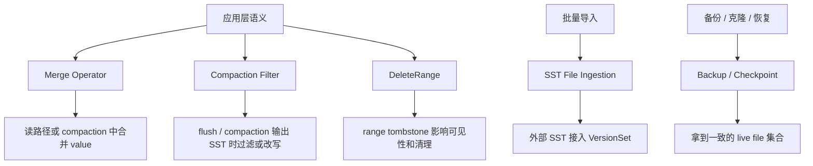

## 目录定位

Day 021 不是单个专题的深挖文章，而是后续高级特性、优化与专题文章的目录页。

从 Day 001 到 Day 020，主线已经覆盖了 RocksDB 的基础骨架：LSM、写路径、WAL、MemTable、Flush、SST、读路径、Snapshot、MANIFEST、Compaction、Block Cache、Column Family、BlobDB、事务和参数调优。接下来要看的内容开始变得更“横向”：它们不是独立于主链之外的新模块，而是把用户语义、批量导入、数据清理、备份恢复和范围删除接入已有 LSM 链路。

当前目录先收录五个专题：

| 专题 | 主要解决的问题 | 接入的 RocksDB 链路 |
| --- | --- | --- |
| `Merge Operator` | 同一 key 的增量合并与 read-modify-write 优化 | 写路径、读路径、compaction |
| `Compaction Filter` | 在后台整理数据时顺手做业务级清理 | flush、compaction、SST 输出 |
| `SST File Ingestion` | 批量导入已有有序数据 | 外部 SST 生成、版本安装、LSM 文件管理 |
| `Backup / Checkpoint` | 在线备份、恢复和一致性文件副本 | live file 管理、MANIFEST、WAL、SST 生命周期 |
| `DeleteRange` | 用范围删除替代海量点删除 | 写路径、memtable、SST、读路径、compaction |

以后如果新增高级特性或优化专题，例如 `A`，先在 Day 021 目录中补一段简短介绍，再新增单篇文章做详细描述。这样 Day 021 始终是“高级专题总入口”。

## 总体关系

这五个能力可以粗略分成三类：

1. 语义扩展：`Merge Operator`、`Compaction Filter`、`DeleteRange`。
2. 数据导入与文件接入：`SST File Ingestion`。
3. 文件集一致性与恢复：`Backup / Checkpoint`。

## 1. Merge Operator

### 是什么

`Merge Operator` 是 RocksDB 提供给用户定义“同一个 key 的多个值如何合并”的机制。

普通 `Put(key, value)` 的语义是写入一个新版本，后写覆盖先写。`Merge(key, operand)` 的语义不同：它写入的是一个“待合并操作”。最终读到什么值，不只取决于最新的 value，还取决于 base value 和后续一串 merge operands 如何被用户定义的 merge 逻辑合成。

典型场景包括计数器累加、集合追加、聚合状态合并、bitmap 更新、日志型状态折叠等。

### 为什么需要

没有 `Merge Operator` 时，应用想做 `counter += 1` 通常要先 `Get()` 旧值，再在应用层计算新值，最后 `Put()` 回去。这会带来几个问题：

- 每次写都可能变成一次读加一次写。
- 并发更新同一个 key 时，应用层要自己处理冲突和重试。
- 大量小增量更新会不断重写完整 value。
- compaction 无法理解这些增量之间是否可以提前合并。

`Merge Operator` 的价值是把“如何合并”交给 RocksDB，使前台写入可以先记录 operand，把真正的合并延后到读路径或 compaction 中执行。

### 大概原理

Merge 的核心思想是延迟计算。

写入时，RocksDB 不一定马上找出旧值并计算新值，而是把 merge operand 作为一个内部记录写入 LSM。之后如果读路径需要返回这个 key 的当前值，就从新到旧收集相关记录，把 merge operands 和 base value 交给用户的 merge 函数。后台 compaction 也可以在安全时把多个 operands 合并成更短的表示，减少后续读放大。

这里有两个常见合并动作：

- full merge：有 base value 或需要得到最终用户值时，把 base value 和 operands 合成完整 value。
- partial merge：没有 base value 时，先把多个 operands 合成一个更大的 operand，降低记录数量。

### RocksDB 大概实现方法和链路

用户在 Column Family options 中配置 merge 逻辑。前台调用 `Merge()` 时，写路径会把这次操作编码成 merge 类型的内部记录，经过 WAL 和 memtable，后续 flush 到 SST。

读取某个 key 时，RocksDB 会沿 memtable、immutable memtable 和各层 SST 查找该 key 的版本。如果遇到 merge operands，就收集 operands，并在必要时继续向旧版本寻找 base value。收集完成后，调用用户提供的 merge 逻辑生成结果。

compaction 处理同一个 key 的多版本记录时，也会识别 merge operands。它可以在不破坏 snapshot 可见性的前提下做 full merge 或 partial merge，把多个内部记录折叠成更少的输出记录。

所以它的大概链路是：

`Merge() 写入 operand -> WAL / memtable -> flush 成 SST -> Get / Iterator 或 compaction 收集 operands -> 用户 merge 逻辑生成结果或压缩表示`

## 2. Compaction Filter

### 是什么

`Compaction Filter` 是 RocksDB 在 flush 或 compaction 生成新 SST 时调用的用户过滤逻辑。

它不是普通读路径上的过滤器。它影响的是“哪些 key/value 会被写入新的 table file”。过滤器可以决定保留、删除，或者在部分接口下改写 value。

典型场景包括 TTL 过期、逻辑删除清理、租户级数据淘汰、旧状态清除、只保留最新业务版本等。

### 为什么需要

LSM 天然会积累旧版本、删除标记和过期数据，compaction 本来就要周期性扫描并重写数据。如果业务还有自己的清理规则，让应用层单独扫描全库再删除，会额外制造读 I/O、写 I/O、WAL、memtable 压力和更多 tombstone。

`Compaction Filter` 的价值是把部分业务 GC 下推到后台整理过程：既然 compaction 已经要读旧 SST 并写新 SST，就顺手判断某些数据是否还能继续保留。

### 大概原理

Compaction Filter 的核心思想是“在数据被重新物化成新文件之前做最后一次判断”。

当 flush 或 compaction 的迭代器拿到一个 key/value，准备输出到新 SST 时，RocksDB 可以把 key、value、level、是否最底层等上下文交给过滤器。过滤器返回决策：保留、删除、改写 value，或者在支持的情况下跳过某段 key。

这个机制要特别注意 snapshot 和历史可见性。某个 key/value 对当前时间看似过期，不代表对一个旧 snapshot 一定不可见。因此过滤器规则不能只按业务直觉写，还要理解 RocksDB 在 compaction 中如何保护快照语义。

### RocksDB 大概实现方法和链路

用户可以配置一个固定的 compaction filter，也可以配置 factory，让 RocksDB 为不同的 compaction 创建不同 filter。后台任务开始后，flush 或 compaction 会构造输出迭代链路。每个候选 key/value 在真正写入 table builder 之前，经过过滤器判断。

如果返回保留，该 key/value 继续进入 SST 输出；如果返回删除，它不会出现在新的 SST 中；如果返回改写，则输出改写后的 value。对于 range deletion、merge operand、snapshot 保护和 bottommost level 等场景，RocksDB 还要额外判断是否允许过滤，避免破坏读语义。

所以它的大概链路是：

`后台 flush / compaction 读取输入 -> 形成候选 key/value -> 调用用户过滤逻辑 -> 保留 / 删除 / 改写 -> 写入新的 SST -> 安装新版本`

## 3. SST File Ingestion

### 是什么

`SST File Ingestion` 是把外部生成的 SST 文件接入 RocksDB 当前 LSM 的机制。

普通写入是逐条 `Put()`，数据经过 WAL、memtable、flush，再进入 SST。SST ingestion 则是先在外部把数据按 RocksDB 的 table 格式写成 SST 文件，再让 DB 把这个文件纳入自己的版本管理。

典型场景包括离线批量导入、数据迁移、构建二级索引、回填历史数据、把上游排序结果直接导入 RocksDB。

### 为什么需要

对于大批量有序数据，逐条 `Put()` 的通用路径成本很高：

- 每条写入都进入 WAL 和 memtable。
- memtable 满了要 flush。
- 新生成的 L0 文件还会引发后续 compaction。
- 前台写入可能挤占正常在线流量。

如果数据已经可以离线排序并生成 SST，直接 ingestion 可以减少前台写路径压力，把问题转成“检查一个外部文件是否能安全接入当前 LSM”。

### 大概原理

SST ingestion 的核心思想是文件级导入。

外部 SST 必须满足 RocksDB 对排序、比较器、key range、文件属性和格式的要求。接入时，RocksDB 要判断这个文件和当前 memtable、L0、各 level 文件之间是否有重叠，应该放入哪一层，是否需要先 flush memtable，是否要复制文件或移动文件，以及是否要重写 global sequence number。

导入成功后，这个 SST 会作为当前版本的一部分被读路径看见。它不是简单把文件拷到目录里，而是要通过版本编辑把文件纳入 MANIFEST 管理。

### RocksDB 大概实现方法和链路

用户先用 SST writer 生成一个排好序的外部 SST。然后调用 ingestion 接口，把一个或多个文件交给 DB。RocksDB 会读取文件元数据，确认 comparator、最小 key、最大 key、sequence 信息和文件属性是否合规。

接着，ingestion 任务会决定接入策略：如果文件可以无重叠地进入某个 level，就尽量放到合适层级；如果和 memtable 或 L0 有冲突，可能需要先 flush 或选择更保守的层级；如果配置要求复制而不是移动，就把文件复制进 DB 目录。最后通过版本安装让新 SST 对读路径可见。

所以它的大概链路是：

`外部数据排序 -> 生成 SST -> ingestion 校验文件与 key range -> 处理 overlap / flush / move-or-copy / seqno -> 写 MANIFEST 版本编辑 -> 读路径可见`

## 4. Backup / Checkpoint

### 是什么

`Backup` 和 `Checkpoint` 都是围绕“一致性的 RocksDB 文件集合”展开的能力，但定位不同。

Backup 更像长期备份系统：它维护备份目录、备份编号、元数据、共享文件、校验和和恢复流程。

Checkpoint 更像本地快速克隆：它从当前 DB 切出一个可打开的一致性目录，常用于测试、分析、快速复制或在同机生成快照。

### 为什么需要

RocksDB 的数据不是一个单文件，而是一组不断变化的文件：SST、WAL、MANIFEST、CURRENT、OPTIONS，有时还有 blob file。后台 compaction、flush 和文件清理会持续创建新文件、安装新版本、删除旧文件。

如果应用直接复制 DB 目录，很容易得到一个不一致的文件集合：某些 SST 还没复制完，MANIFEST 已经指向新版本；或者复制过程中旧文件被后台删除。

Backup / Checkpoint 的价值是通过 RocksDB 自己的文件生命周期信息，拿到一个一致、可恢复或可打开的文件集合。

### 大概原理

两者都依赖 live file 视图。

RocksDB 需要先确定当前 DB 版本真正依赖哪些文件，并在复制或链接期间阻止这些文件被后台清理。然后根据目标不同组织输出：

- Backup 会把文件放入备份目录，记录备份元数据，并支持后续 restore。
- Checkpoint 会创建一个新的 DB 目录，尽量使用 hard link 复用已有 SST，必要时复制不能链接的文件。

它们的差异主要在生命周期：Backup 面向长期管理多个备份和恢复；Checkpoint 面向当前时刻的快速一致性副本。

### RocksDB 大概实现方法和链路

创建备份或 checkpoint 时，RocksDB 会先获取当前 live files，并保护这些文件不被删除。然后它会处理 SST、MANIFEST、CURRENT、OPTIONS、WAL 等文件的复制或链接关系。

Backup 会额外维护备份元数据、文件校验、共享文件复用和 restore 所需的信息。Checkpoint 更关注生成一个可以直接打开的 DB 目录，因此它通常更轻量，也更依赖本地文件系统能力。

所以它们的大概链路是：

`冻结或保护 live file 集合 -> 收集当前版本依赖文件 -> 复制 / hard link / 记录元数据 -> 生成备份集或 checkpoint 目录 -> 之后用于 restore 或直接打开`

## 5. DeleteRange

### 是什么

`DeleteRange` 是 RocksDB 的范围删除机制，用一个范围 tombstone 表示 `[begin, end)` 内的 key 在某个 sequence number 之后被删除。

它和普通 `Delete(key)` 不一样。普通删除是点 tombstone，只覆盖一个 key；`DeleteRange(begin, end)` 覆盖的是一个 key 区间。

典型场景包括删除某个用户、租户、时间分区、前缀分区或一段历史 key range。

### 为什么需要

如果要删除一百万个连续 key，用一百万次 `Delete()` 会制造一百万个 point tombstone。这会带来大量写入、WAL、memtable 占用和后续 compaction 负担。

`DeleteRange` 的价值是把大范围删除压缩成少量范围 tombstone。它减少了前台写入量，也让后台 compaction 可以基于范围判断哪些旧 key 已经被覆盖。

### 大概原理

DeleteRange 的核心思想是范围可见性。

写入 range tombstone 后，读路径看到某个 key 时，不仅要检查有没有这个 key 的点记录，还要检查是否存在覆盖它的 range tombstone，并比较 sequence number 和 snapshot。只有当 key 的版本对当前读视图没有被 range tombstone 覆盖时，才能返回。

compaction 时，RocksDB 也要把 range tombstone 和普通 key 一起处理。被范围删除覆盖且不再被任何 snapshot 需要的旧 key，可以被清理；range tombstone 自己也要等到它覆盖的旧数据都不再需要时才能安全丢弃。

### RocksDB 大概实现方法和链路

前台调用 `DeleteRange()` 时，这次操作会进入 write batch，并作为 range deletion 类型写入 WAL 和 memtable。flush 后，范围 tombstone 会进入 SST 的专门结构。读路径构造迭代器时，会同时带上 range tombstone 信息，用它判断点 key 是否被覆盖。

后台 compaction 会聚合来自不同文件和层级的 range tombstone，对它们做裁剪、碎片化和覆盖关系判断。这个过程要结合 snapshot、sequence number、user key comparator 和文件边界，防止过早删除仍可能被旧读视图看到的数据。

所以它的大概链路是：

`DeleteRange(begin, end) -> write batch / WAL / memtable -> flush 形成 range tombstone -> 读路径判断覆盖关系 -> compaction 聚合与裁剪 tombstone -> 安全时清理被覆盖 key 和 tombstone`

## 后续专题展开方式

Day 021 只承担目录职责。后续每个专题单独展开时，再按“源码驱动”的方式进入细节。

建议顺序暂定为：

1. `Merge Operator`
2. `Compaction Filter`
3. `SST File Ingestion`
4. `Backup / Checkpoint`
5. `DeleteRange`

如果中间新增专题，先回到 Day 021 补充目录项，再创建对应的详细文章。
