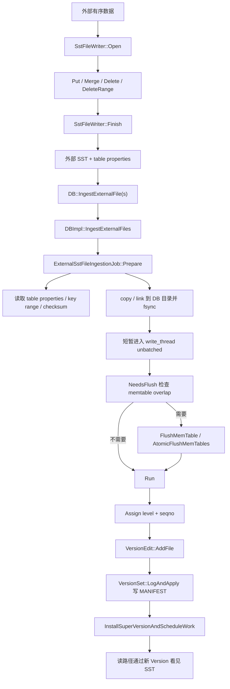

## 今日主题

- 主主题：`SST File Ingestion`
- 副主题：`SstFileWriter / ExternalSstFileIngestionJob / global seqno / level placement`

一句话概括：

`SST File Ingestion` 不是绕过 RocksDB 元数据系统把文件直接丢进目录，而是把一个已经生成好的 table file 经过文件属性校验、key range 检查、必要 flush、level 和 sequence number 分配，再通过 `VersionEdit + MANIFEST + SuperVersion` 接入当前 LSM。

## 学习目标

今天要回答这些问题：

1. 外部 SST 是怎么生成的，为什么要求 key 有序？
2. `DB::IngestExternalFile()` 和 `DB::IngestExternalFiles()` 的调用路径是什么？
3. RocksDB 在真正接入文件前检查哪些东西？
4. 为什么有时要先 flush memtable？
5. RocksDB 如何决定导入文件放到哪一层？
6. `global seqno` 是什么，为什么它能让外部 SST 覆盖已有数据？
7. 导入成功后，读路径为什么能看到新文件？
8. `move_files / link_files / copy`、`ingest_behind`、`allow_db_generated_files` 分别适合什么场景？

## 前置回顾

前面几天已经铺过这些主链：

- Day 007：flush 会把 immutable memtable 变成 L0 SST。
- Day 008：SST / BlockBasedTable 是 RocksDB 的持久化 table 格式。
- Day 012：`VersionEdit / VersionSet / MANIFEST` 负责记录当前版本包含哪些 SST。
- Day 013 / 014：compaction 负责维护 LSM 各层文件的重叠关系和放大系数。
- Day 017：Column Family 有自己的 `ColumnFamilyData / Version / MemTable / SST`，但共享 DB 级写线程和 MANIFEST 机制。

SST ingestion 正好把这些链路串起来：它跳过普通 `Put -> WAL -> memtable -> flush` 的逐条写入成本，但不能跳过 `VersionSet / MANIFEST / SuperVersion`，否则 RocksDB 根本不知道这个文件属于哪个 CF、哪一层、哪个 key range、哪个 sequence number。

## 源码入口

本章主要读这些文件：

- `D:\program\rocksdb\include\rocksdb\db.h`
  - `DB::IngestExternalFile()`
  - `DB::IngestExternalFiles()`
- `D:\program\rocksdb\include\rocksdb\options.h`
  - `IngestExternalFileOptions`
  - `IngestExternalFileArg`
- `D:\program\rocksdb\include\rocksdb\sst_file_writer.h`
  - `ExternalSstFileInfo`
  - `SstFileWriter`
- `D:\program\rocksdb\table\sst_file_writer.cc`
  - `SstFileWriter::Open()`
  - `SstFileWriter::Put() / Merge() / Delete() / DeleteRange()`
  - `SstFileWriter::Finish()`
- `D:\program\rocksdb\table\sst_file_writer_collectors.h`
  - `SstFileWriterPropertiesCollector`
  - `rocksdb.external_sst_file.version`
  - `rocksdb.external_sst_file.global_seqno`
- `D:\program\rocksdb\db\db_impl\db_impl.cc`
  - `DBImpl::IngestExternalFile()`
  - `DBImpl::IngestExternalFiles()`
  - `VersionSet::LogAndApply()`
  - `InstallSuperVersionAndScheduleWork()`
- `D:\program\rocksdb\db\external_sst_file_ingestion_job.h/.cc`
  - `IngestedFileInfo`
  - `ExternalSstFileIngestionJob::Prepare()`
  - `ExternalSstFileIngestionJob::NeedsFlush()`
  - `ExternalSstFileIngestionJob::Run()`
  - `AssignLevelAndSeqnoForIngestedFile()`
  - `AssignGlobalSeqnoForIngestedFile()`
  - `IngestedFileFitInLevel()`
- `D:\program\rocksdb\db\version_edit.h/.cc`
  - `VersionEdit::AddFile()`
  - `EncodeToNewFile4()`
- `D:\program\rocksdb\table\block_based\block_based_table_reader.cc`
  - `GetGlobalSequenceNumber()`

外部补充资料只作为问题来源，本章结论以本地源码为准：

- `D:\program\rocksdb\docs\_posts\2017-02-17-bulkoad-ingest-sst-file.markdown`

## 它解决什么问题

普通写入路径适合在线随机写：

```text
Put / WriteBatch -> WAL -> mutable MemTable -> immutable MemTable -> Flush -> L0 SST -> Compaction
```

但批量导入有时已经具备两个条件：

1. 数据可以离线排序。
2. 数据可以直接写成 RocksDB table 格式。

如果还逐条 `Put()`，就会付出额外成本：

- 每条记录进入 WAL。
- 每条记录进入 memtable。
- memtable 满了以后 flush 成 L0。
- L0 文件再通过 compaction 向下整理。
- 大批量导入可能挤占在线写入和后台 compaction 资源。

SST ingestion 的目标是把问题变成文件级接入：

```text
外部数据排序 -> SstFileWriter 生成 SST -> DB 校验并接入文件 -> MANIFEST 记录新版本 -> 读路径可见
```

它适合：

- 离线批量导入。
- 大规模回填历史数据。
- 数据迁移或 shard 搬迁。
- 用外部任务先排序再导入 RocksDB。
- 构建一个临时 RocksDB 或外部文件后再导入目标 CF。

它不适合被理解成“随便拿一个 SST 文件放进 DB 目录”。真正困难的部分不是复制文件，而是回答：

- 这个文件和当前 comparator 是否兼容？
- 这个文件的 key range 和 memtable / L0 / L1+ 是否重叠？
- 如果重叠，谁覆盖谁？
- 有没有 snapshot 需要一致性语义？
- 导入文件放在哪一层才不破坏 LSM invariant？
- 成功和失败时如何保证 MANIFEST 与文件目录一致？

## 它是怎么工作的

先看总流程：



这条链路里最重要的边界是：

- `SstFileWriter` 只负责生成外部 table file。
- `ExternalSstFileIngestionJob::Prepare()` 负责把外部文件变成“可以尝试导入”的内部文件。
- `NeedsFlush()` 保护 memtable 中可能与导入 key range 重叠的未落盘写入。
- `Run()` 决定 level、sequence number，并生成 `VersionEdit`。
- `VersionSet::LogAndApply()` 才是真正把文件安装进当前版本的提交点。

## 关键数据结构与实现点

### 1. `ExternalSstFileInfo`

`ExternalSstFileInfo` 是 `SstFileWriter::Finish()` 可以返回给用户的轻量元信息：

- 文件路径。
- 最小 / 最大 user key。
- range deletion 的最小 / 最大 key。
- 文件 checksum。
- sequence number。
- 文件大小。
- entry 数量。
- external file version。

它适合应用层确认“我刚生成了什么文件”，但 ingestion 内部还会重新用 `TableReader` 打开文件并读取更完整的 table properties。

### 2. `IngestExternalFileOptions`

这个结构控制导入语义。几个关键字段：

| 选项 | 默认 | 作用 |
| --- | --- | --- |
| `move_files` | `false` | 成功后删除原始文件链接；实现上优先 hard link 到 DB 目录，不是简单 rename |
| `link_files` | `false` | hard link 到 DB 目录，但保留原始文件 |
| `failed_move_fall_back_to_copy` | `true` | link 不支持时回退 copy |
| `snapshot_consistency` | `true` | 有 snapshot 时，为导入文件分配较新的 global seqno，避免旧 snapshot 看到新数据 |
| `allow_global_seqno` | `true` | 允许 RocksDB 给外部文件赋一个全局 sequence number |
| `allow_blocking_flush` | `true` | 外部文件和 memtable range 重叠时，允许阻塞并 flush |
| `ingest_behind` | `false` | 回填历史数据，不覆盖已有 key；要求 CF 允许 `cf_allow_ingest_behind` |
| `write_global_seqno` | `false` | 老版本兼容选项；当前默认不把 seqno 随机写回 SST 文件 |
| `verify_checksums_before_ingest` | `false` | 导入前扫描 block checksum，代价是读完整文件 |
| `verify_file_checksum` | `true` | 校验 / 生成文件级 checksum 并写入 MANIFEST |
| `fail_if_not_bottommost_level` | `false` | 要求文件必须能进入最后一层，否则返回 `TryAgain` |
| `allow_db_generated_files` | `false` | 允许导入 DB 生成的 SST，保留原 sequence number |
| `fill_cache` | `true` | ingestion 读取文件时是否把 data / metadata block 填入 block cache |

这里最容易混淆的是 `snapshot_consistency` 和 `allow_global_seqno`：

- `snapshot_consistency=true` 是语义要求。
- `allow_global_seqno=true` 是允许实现这个语义的手段之一。

### 3. `IngestedFileInfo`

`IngestedFileInfo` 是 ingestion job 内部真正使用的文件状态，包含：

- 外部路径：`external_file_path`
- DB 内部路径：`internal_file_path`
- key range：`start_ukey / limit_ukey`
- 原始 seqno：`original_seqno`
- 分配后的 seqno：`assigned_seqno`
- 文件大小、entry 数量、range deletion 数量
- 原 table properties
- file descriptor：`fd`
- 目标层级：`picked_level`
- 是否 copy：`copy_file`
- checksum 和 unique id
- DB-generated SST 的 `smallest_seqno / largest_seqno`

它比 `ExternalSstFileInfo` 更接近 `FileMetaData`，也就是最终写入 `VersionEdit::AddFile()` 的信息来源。

### 4. `VersionEdit::AddFile`

导入成功不是“目录里有文件”就结束，而是要调用 `VersionEdit::AddFile()`：

- 记录文件号、path id、file size。
- 记录 smallest / largest internal key。
- 记录 smallest / largest seqno。
- 记录 checksum、temperature、unique id、epoch number 等。
- 更新 edit 的 `last_sequence`。

然后 `VersionSet::LogAndApply()` 把这个 edit 写入 MANIFEST，并生成新的 `Version`。

## 源码细读

### 1. 公开 API：单 CF 入口只是包装多 CF 入口

```cpp
// db/db_impl/db_impl.cc + DBImpl::IngestExternalFile
Status DBImpl::IngestExternalFile(
    ColumnFamilyHandle* column_family,
    const std::vector<std::string>& external_files,
    const IngestExternalFileOptions& ingestion_options) {
  IngestExternalFileArg arg;
  arg.column_family = column_family;
  arg.external_files = external_files;
  arg.options = ingestion_options;
  return IngestExternalFiles({arg});
}
```

这段说明单 CF 的 `IngestExternalFile()` 只是把参数塞进 `IngestExternalFileArg`，再走统一的 `IngestExternalFiles()`。真正复杂的逻辑都在多 CF 入口里。

这也解释了为什么 `IngestExternalFiles()` 的注释强调“多个 CF 的结果原子记录到 MANIFEST”：多 CF ingestion 的提交点是一个带 atomic group 标记的 `VersionEdit` 集合。

### 2. `SstFileWriter` 生成的是 seqno=0 的有序外部文件

```cpp
// table/sst_file_writer.cc + SstFileWriter::Rep::AddImpl
if (file_info.num_entries == 0) {
  file_info.smallest_key.assign(user_key.data(), user_key.size());
} else {
  if (internal_comparator.user_comparator()->Compare(
          user_key, file_info.largest_key) <= 0) {
    return Status::InvalidArgument(
        "Keys must be added in strict ascending order.");
  }
}

constexpr SequenceNumber sequence_number = 0;
ikey.Set(user_key, sequence_number, value_type);
builder->Add(ikey.Encode(), value);
...
file_info.largest_key.assign(user_key.data(), user_key.size());
```

这里有两个关键结论：

1. `SstFileWriter` 要求 point key 按 comparator 严格递增。
2. 写进外部 SST 的 point key sequence number 是 `0`。

sequence number 为 0 并不是说这些数据永远最旧。后续 ingestion 可以通过 `global seqno` 让这个文件在读路径中表现为一个新的 sequence number；也可以在 `ingest_behind` 场景保留 seqno=0，把它当作历史回填数据。

### 3. 外部文件会写入特殊 table property

```cpp
// table/sst_file_writer_collectors.h + SstFileWriterPropertiesCollector::Finish
std::string version_val;
PutFixed32(&version_val, static_cast<uint32_t>(version_));
properties->insert({ExternalSstFilePropertyNames::kVersion, version_val});

std::string seqno_val;
PutFixed64(&seqno_val, static_cast<uint64_t>(global_seqno_));
properties->insert({ExternalSstFilePropertyNames::kGlobalSeqno, seqno_val});
```

`SstFileWriter` 生成的文件会带上 external SST 专用属性：

- `rocksdb.external_sst_file.version`
- `rocksdb.external_sst_file.global_seqno`

`ExternalSstFileIngestionJob::SanityCheckTableProperties()` 会检查这些属性。如果没有 version 属性，默认认为它不是 `SstFileWriter` 生成的外部 SST；除非 `allow_db_generated_files=true`，否则导入会失败。

### 4. `Prepare()` 先读文件信息，再把文件搬进 DB 目录

```cpp
// db/external_sst_file_ingestion_job.cc + ExternalSstFileIngestionJob::Prepare
for (const std::string& file_path : external_files_paths) {
  IngestedFileInfo file_to_ingest;
  status =
      GetIngestedFileInfo(file_path, next_file_number++, &file_to_ingest, sv);
  if (!status.ok()) {
    return status;
  }

  if (file_to_ingest.cf_id !=
          TablePropertiesCollectorFactory::Context::kUnknownColumnFamily &&
      file_to_ingest.cf_id != cfd_->GetID() &&
      !ingestion_options_.allow_db_generated_files) {
    return Status::InvalidArgument(
        "External file column family id don't match");
  }

  if (file_to_ingest.num_entries == 0 &&
      file_to_ingest.num_range_deletions == 0) {
    return Status::InvalidArgument("File contain no entries");
  }

  files_to_ingest_.emplace_back(std::move(file_to_ingest));
}
```

`Prepare()` 的第一件事是用 `GetIngestedFileInfo()` 打开外部 SST，读取 table properties 和 key range。这里至少会拦住几类错误：

- 文件不是合法 table。
- 文件没有 entry。
- 文件的 column family id 和目标 CF 不匹配。
- 文件 key 不合法。
- 非 DB-generated 模式下，文件里已经有非 0 sequence number。

然后它才进入 copy / link 阶段。也就是说，文件物理移动之前先做语义校验。

### 5. `Prepare()` 还要处理 copy / link / fsync

```cpp
// db/external_sst_file_ingestion_job.cc + ExternalSstFileIngestionJob::Prepare
if (ingestion_options_.move_files || ingestion_options_.link_files) {
  status =
      fs_->LinkFile(path_outside_db, path_inside_db, IOOptions(), nullptr);
  if (status.ok()) {
    std::unique_ptr<FSWritableFile> file_to_sync;
    Status s = fs_->ReopenWritableFile(path_inside_db, env_options_,
                                       &file_to_sync, nullptr);
    if (!s.IsNotSupported()) {
      status = s;
      if (status.ok()) {
        status = SyncIngestedFile(file_to_sync.get());
      }
    }
  } else if (status.IsNotSupported() &&
             ingestion_options_.failed_move_fall_back_to_copy) {
    f.copy_file = true;
  }
} else {
  f.copy_file = true;
}

if (f.copy_file) {
  status = CopyFile(fs_.get(), path_outside_db, f.file_temperature,
                    path_inside_db, dst_temp, 0, db_options_.use_fsync,
                    io_tracer_);
}
```

这里有一个工程细节：`move_files` 并不是直接 `RenameFile()`。实现优先用 hard link，把外部路径链接到 DB 内部文件名；成功后再根据 `move_files` 决定是否删除原始路径。这样失败回滚更容易。

如果文件系统不支持 link，默认可以回退 copy。copy 路径会把文件复制到 DB 目录并 sync。

这一步之后，RocksDB 已经有了内部文件路径，但文件还没有进入当前版本。失败时 `Cleanup()` 会删除内部文件。

### 6. `NeedsFlush()` 只为 memtable overlap 服务

```cpp
// db/external_sst_file_ingestion_job.cc + ExternalSstFileIngestionJob::NeedsFlush
autovector<UserKeyRange> ranges;
for (const IngestedFileInfo& file_to_ingest : files_to_ingest_) {
  ranges.emplace_back(file_to_ingest.start_ukey,
                      file_to_ingest.limit_ukey);
}
status = cfd_->RangesOverlapWithMemtables(
    ranges, super_version, db_options_.allow_data_in_errors, flush_needed);

if (status.ok() && *flush_needed) {
  if (!ingestion_options_.allow_blocking_flush) {
    status = Status::InvalidArgument("External file requires flush");
  }
}
```

这段代码解释了一个常见问题：为什么 ingestion 有时会阻塞并触发 flush？

原因是 memtable 中可能有还没落盘的 key，且这些 key 的范围和外部 SST 重叠。RocksDB 必须先把 memtable 推到不可变版本链路里，再决定外部文件的 seqno 和 level，否则导入文件和前台写入之间的覆盖关系可能不稳定。

如果 `allow_blocking_flush=false`，遇到这种情况就直接失败，让调用方自己决定是否稍后重试。

### 7. `DBImpl::IngestExternalFiles()` 会短暂阻塞写线程

```cpp
// db/db_impl/db_impl.cc + DBImpl::IngestExternalFiles
InstrumentedMutexLock l(&mutex_);

WriteThread::Writer w;
write_thread_.EnterUnbatched(&w, &mutex_);
WriteThread::Writer nonmem_w;
if (two_write_queues_) {
  nonmem_write_thread_.EnterUnbatched(&nonmem_w, &mutex_);
}

WaitForPendingWrites();

for (size_t i = 0; i != num_cfs; ++i) {
  status = ingestion_jobs[i].NeedsFlush(&tmp, cfd->GetSuperVersion());
  ...
}

if (status.ok() && at_least_one_cf_need_flush) {
  status = FlushMemTable(..., FlushReason::kExternalFileIngestion, ...);
}
```

这段位于真正安装文件之前。它说明 ingestion 不是全程无阻塞：

- `Prepare()` 里的读文件、copy/link 可以在进入写线程之前做。
- 真正检查 memtable overlap、必要 flush、运行 job、写 MANIFEST 时，会进入 unbatched writer 状态。
- `WaitForPendingWrites()` 确保没有还没落入 memtable 的乱序写入。

所以 ingestion 能减少普通写路径成本，但不是完全不影响在线写。大文件 copy 可以提前做；真正提交阶段仍要短暂协调前台写入、memtable 和版本安装。

### 8. `Run()` 负责分配 level 与 sequence number

```cpp
// db/external_sst_file_ingestion_job.cc + ExternalSstFileIngestionJob::Run
bool force_global_seqno = false;

if (ingestion_options_.snapshot_consistency && !db_snapshots_->empty()) {
  force_global_seqno = true;
}

SequenceNumber last_seqno = versions_->LastSequence();
edit_.SetColumnFamily(cfd_->GetID());

for (auto& batch : file_batches_to_ingest_) {
  int batch_uppermost_level = 0;
  status = AssignLevelsForOneBatch(batch, super_version, force_global_seqno,
                                   &last_seqno, &batch_uppermost_level,
                                   prev_batch_uppermost_level);
  if (!status.ok()) {
    return status;
  }
  prev_batch_uppermost_level = batch_uppermost_level;
}
```

`Run()` 的核心不是 copy 文件，而是生成 `edit_`。它先判断是否必须分配 global seqno：

- 如果 `snapshot_consistency=true` 且当前有 snapshot，即使外部文件没有和 DB 重叠，也要分配新的 global seqno。
- 如果输入文件之间有 overlap，也需要不同 seqno 表示“后面的文件覆盖前面的文件”。
- 如果文件必须进 L0 或和 DB 现有 key overlap，也通常需要 seqno 来表达覆盖关系。

随后 `AssignLevelsForOneBatch()` 会逐个文件决定放入哪个 level 和分配哪个 seqno。

### 9. level placement：找能容纳 key range 的最低层

```cpp
// db/external_sst_file_ingestion_job.cc + ExternalSstFileIngestionJob::AssignLevelAndSeqnoForIngestedFile
int target_level = 0;
auto* vstorage = cfd_->current()->storage_info();

for (int lvl = 0; lvl < overlap_checking_exclusive_end; lvl++) {
  if (lvl > 0 && lvl < vstorage->base_level()) {
    continue;
  }

  if (cfd_->RangeOverlapWithCompaction(file_to_ingest->start_ukey,
                                       file_to_ingest->limit_ukey, lvl)) {
    overlap_with_db = true;
    break;
  } else if (vstorage->NumLevelFiles(lvl) > 0) {
    bool overlap_with_level = false;
    status = sv->current->OverlapWithLevelIterator(
        ro, env_options_, file_to_ingest->start_ukey,
        file_to_ingest->limit_ukey, lvl, &overlap_with_level);
    if (overlap_with_level) {
      overlap_with_db = true;
      break;
    }
  }

  if (lvl < assigned_level_exclusive_end &&
      IngestedFileFitInLevel(file_to_ingest, lvl)) {
    target_level = lvl;
  }
}

file_to_ingest->picked_level = target_level;
```

这段代码的语义是：

- L0 总是能放，因为 L0 允许文件重叠。
- L1+ 只有在该层没有 key range overlap 时才能放。
- 如果某层或正在进行的 compaction 输出会和导入文件 overlap，就不能把文件放到更低层去“压住”它，必须放在更高层或 L0，并分配 seqno 表示覆盖。
- 默认目标是“能放进去的最低层”，这样减少后续 compaction 压力。

这里的“最低层”是 LSM 里更靠近底部的数据层，不是编号最小的 L0。

### 10. global seqno：文件级覆盖语义

```cpp
// db/external_sst_file_ingestion_job.cc + ExternalSstFileIngestionJob::AssignLevelAndSeqnoForIngestedFile
if (force_global_seqno || (!ingestion_options_.allow_db_generated_files &&
                           (files_overlap_ || must_assign_to_l0))) {
  *assigned_seqno = last_seqno + 1;
  if (must_assign_to_l0) {
    file_to_ingest->picked_level = 0;
    return status;
  }
}

...

if (overlap_with_db) {
  if (*assigned_seqno == 0) {
    *assigned_seqno = last_seqno + 1;
  }
}
```

`SstFileWriter` 生成的 key 都是 seqno=0，但 ingestion 后有时必须让它们表现得像“刚写入的新版本”。这就是 global seqno 的作用：为整个文件统一赋一个 sequence number。

典型触发条件：

- 有 snapshot 且需要 snapshot consistency。
- 输入文件之间互相 overlap。
- 目标只能放 L0。
- 文件 key range 与 DB 已有数据或正在输出的 compaction overlap。

如果不允许 global seqno，而又遇到这些条件，ingestion 会失败。

### 11. 当前默认不把 global seqno 写回 SST 文件

```cpp
// db/external_sst_file_ingestion_job.cc + ExternalSstFileIngestionJob::AssignGlobalSeqnoForIngestedFile
if (file_to_ingest->original_seqno == seqno) {
  return Status::OK();
} else if (!ingestion_options_.allow_global_seqno) {
  return Status::InvalidArgument("Global seqno is required, but disabled");
} else if (ingestion_options_.write_global_seqno &&
           file_to_ingest->global_seqno_offset == 0) {
  return Status::InvalidArgument(
      "Trying to set global seqno for a file that don't have a global seqno "
      "field");
}

if (ingestion_options_.write_global_seqno) {
  ...
  status = fsptr->Write(file_to_ingest->global_seqno_offset, seqno_val,
                        IOOptions(), nullptr);
  ...
}

file_to_ingest->assigned_seqno = seqno;
```

`write_global_seqno` 默认是 `false`，而且注释里已经标记为 deprecated。当前默认路径不会随机写回 SST 文件里的 global seqno 字段，而是把 assigned seqno 进入后续 `FileMetaData / VersionEdit`。

这很重要：不要把当前实现理解成“ingestion 必须修改外部 SST 文件本体”。只有为了兼容非常老的 RocksDB 版本时才需要写回。

### 12. `VersionEdit::AddFile()` 是安装文件的核心

```cpp
// db/external_sst_file_ingestion_job.cc + ExternalSstFileIngestionJob::AssignLevelsForOneBatch
FileMetaData f_metadata(
    file->fd.GetNumber(), file->fd.GetPathId(), file->fd.GetFileSize(),
    file->smallest_internal_key, file->largest_internal_key, smallest_seqno,
    largest_seqno, false, file->file_temperature, kInvalidBlobFileNumber,
    oldest_ancester_time, current_time,
    ingestion_options_.ingest_behind
        ? kReservedEpochNumberForFileIngestedBehind
        : cfd_->NewEpochNumber(),
    file->file_checksum, file->file_checksum_func_name, file->unique_id, 0,
    tail_size, file->user_defined_timestamps_persisted);

edit_.AddFile(file->picked_level, f_metadata);
```

这段把 ingestion 内部状态变成 `FileMetaData`，并加入 `VersionEdit`。关键字段包括：

- 文件号与大小。
- smallest / largest internal key。
- smallest / largest seqno。
- 目标 level。
- checksum。
- epoch number。
- user-defined timestamp 是否持久化。

`epoch_number` 对 L0 特别重要：L0 文件可能 overlap，排序不仅依赖 key range，也要知道新旧顺序。

### 13. MANIFEST 提交与 SuperVersion 安装

```cpp
// db/db_impl/db_impl.cc + DBImpl::IngestExternalFiles
status =
    versions_->LogAndApply(cfds_to_commit, read_options, write_options,
                           edit_lists, &mutex_, directories_.GetDbDir());

SequenceNumber max_assigned_seqno =
    ingestion_jobs[0].MaxAssignedSequenceNumber();
...
if (max_assigned_seqno > last_seqno) {
  versions_->SetLastAllocatedSequence(max_assigned_seqno);
  versions_->SetLastPublishedSequence(max_assigned_seqno);
  versions_->SetLastSequence(max_assigned_seqno);
}

if (status.ok()) {
  for (size_t i = 0; i != num_cfs; ++i) {
    InstallSuperVersionAndScheduleWork(cfd, &sv_ctxs[i]);
  }
}
```

`LogAndApply()` 是持久化提交点。它把 `VersionEdit` 写入 MANIFEST，并让 `VersionSet` 产生新版本。

后面的 `SetLastSequence()` 很讲究：源码注释说明不能在 `LogAndApply()` 之前更新 `VersionSet` 的 last seqno，因为 `LogAndApply()` 写 MANIFEST 时会释放 mutex，如果这时有 snapshot 被创建，可能得到不稳定视图。

最后 `InstallSuperVersionAndScheduleWork()` 发布新的 `SuperVersion`。从这时开始，前台读路径可以通过当前 `Version` 找到新导入的 SST。

## 调用路径汇总

### 生成外部 SST

```text
应用排序数据
  -> SstFileWriter::Open(file_path)
  -> SstFileWriter::Put / Merge / Delete / DeleteRange
  -> SstFileWriter::Rep::AddImpl
       - 检查 key 严格递增
       - 用 seqno=0 构造 InternalKey
       - TableBuilder::Add()
  -> SstFileWriter::Finish()
       - TableBuilder::Finish()
       - WritableFileWriter::Sync()
       - WritableFileWriter::Close()
       - 返回 ExternalSstFileInfo
```

### 导入外部 SST

```text
DB::IngestExternalFile()
  -> DBImpl::IngestExternalFile()
  -> DBImpl::IngestExternalFiles()
       - 参数检查
       - ReserveFileNumbersBeforeIngestion()
       - 为每个 CF 构造 ExternalSstFileIngestionJob
       - job.Prepare()
            -> GetIngestedFileInfo()
            -> SanityCheckTableProperties()
            -> copy/link 文件到 DB 目录
            -> fsync 文件和目录
       - 进入 write_thread unbatched
       - WaitForPendingWrites()
       - job.NeedsFlush()
       - 必要时 FlushMemTable / AtomicFlushMemTables
       - job.Run()
            -> AssignLevelsForOneBatch()
            -> AssignLevelAndSeqnoForIngestedFile()
            -> AssignGlobalSeqnoForIngestedFile()
            -> VersionEdit::AddFile()
       - job.RegisterRange()
       - VersionSet::LogAndApply()
       - 更新 VersionSet last sequence
       - InstallSuperVersionAndScheduleWork()
       - job.Cleanup()
       - NotifyOnExternalFileIngested()
```

## 关键语义分支

### 默认覆盖模式

默认 `ingest_behind=false`。如果导入文件和已有数据有重复 key，新文件通常要覆盖旧数据。实现方式不是逐条写入，而是：

- 导入文件被放到合适 level。
- 如果 overlap 需要覆盖语义，就分配 `last_seqno + 1`。
- 读路径比较 internal key 时看到这个 global seqno，认为它比旧版本新。

### `ingest_behind`

`ingest_behind=true` 是历史回填模式：

- 不覆盖已有 key。
- 文件总是进入最后一层。
- sequence number 保持为 0。
- 要求 CF 从创建或写入前就允许 `cf_allow_ingest_behind`。

这适合“补老数据，不覆盖线上新数据”的场景。

但这个模式对 tombstone 和 compaction 有额外要求：如果上层还有 seqno=0 的文件，或者 tombstone 清理过早，就可能破坏“后导入的旧数据应该被已有删除标记覆盖”的语义。因此源码里会检查上层是否还有 seqno=0 文件。

### `allow_db_generated_files`

默认外部文件应由 `SstFileWriter` 生成，所有 key seqno 为 0。`allow_db_generated_files=true` 则允许导入 RocksDB 自己生成的 SST：

- 允许文件带任意 sequence number。
- 不重新分配 global seqno。
- 要求文件不能和目标 DB 已有数据重叠。
- 如果多个输入文件之间重叠，调用方必须保证文件顺序满足 LSM 新旧关系。

这适合从一个 DB / CF 导出文件，再导入另一个 CF 或 DB 的高级场景；它比普通 `SstFileWriter` ingestion 更危险。

### 多 CF 原子提交

`DB::IngestExternalFiles()` 可以一次传多个 CF。源码会：

- 要求每个 arg 对应不同 CF。
- 对每个 CF 准备一个 ingestion job。
- 每个 job 生成自己的 `VersionEdit`。
- 多个 edit 被标记为 atomic group。
- 通过 `VersionSet::LogAndApply()` 一起写入 MANIFEST。

注释也提醒：函数执行期间应用可能观察到混合状态；跨 CF 一致读应使用 snapshot。

## 今日问题与讨论

### 我的问题

**问题：SST File Ingestion 是不是完全绕过 RocksDB 写路径？**

- 简答：
  - 它绕过的是逐条 `Put -> WAL -> memtable -> flush` 路径，不绕过版本管理。
  - 导入文件仍然必须进入 `VersionEdit / MANIFEST / SuperVersion`。
- 源码依据：
  - `DBImpl::IngestExternalFiles()` 最终调用 `versions_->LogAndApply(...)`，再调用 `InstallSuperVersionAndScheduleWork()`。
- 当前结论：
  - ingestion 是“文件级写入 + 元数据提交”，不是“目录级拷贝”。
- 是否需要后续回看：
  - 学习 Backup / Checkpoint 时可以回看 live files 和 MANIFEST 一致性。

**问题：为什么外部 SST 有时需要分配 global seqno？**

- 简答：
  - 因为 `SstFileWriter` 生成的 key 默认 seqno=0。如果它要覆盖已有数据，或要保持 snapshot consistency，就需要让整个文件表现为一个新的 sequence number。
- 源码依据：
  - `AssignLevelAndSeqnoForIngestedFile()` 在 snapshot、输入文件 overlap、必须 L0、和 DB overlap 等条件下分配 `last_seqno + 1`。
- 当前结论：
  - global seqno 是文件级可见性覆盖机制。
- 是否需要后续回看：
  - 学习 Snapshot / WritePrepared 兼容边界时可以再看。

**问题：为什么和 memtable overlap 时要 flush？**

- 简答：
  - 因为 memtable 里可能有尚未进入 Version 的写入。导入文件如果和它们 key range 重叠，必须先把 memtable 状态稳定下来，再决定导入文件的 level 和 seqno。
- 源码依据：
  - `NeedsFlush()` 调用 `ColumnFamilyData::RangesOverlapWithMemtables()`；`DBImpl::IngestExternalFiles()` 在 `Run()` 前根据结果调用 `FlushMemTable()`。
- 当前结论：
  - flush 是为了稳定覆盖关系，不是为了让 ingestion 复用 flush 输出。
- 是否需要后续回看：
  - 后续学习 `atomic_flush` 和 multi-CF MANIFEST atomic group 时可以回看。

### 外部高价值问题

**问题：既然普通写入最终也会变成 SST，为什么不直接导入外部 SST？**

- 来源类型：
  - RocksDB 官方仓库文档：`docs/_posts/2017-02-17-bulkoad-ingest-sst-file.markdown`
- 为什么这个问题重要：
  - 它解释了 ingestion 的定位：bulk load 可以跳过 WAL / memtable / flush 的逐条写入成本。
- 源码依据：
  - `SstFileWriter` 直接用 table builder 生成 SST；`DBImpl::IngestExternalFiles()` 通过 `VersionEdit::AddFile()` 安装文件。
- 当前结论：
  - 对离线有序数据，ingestion 可以显著减少写路径放大；对在线随机写，普通写路径仍然更通用。
- 是否与当前本地源码一致：
  - 一致，但当前源码已经比早期文档复杂得多，增加了多 CF 原子提交、checksum、DB-generated files、user-defined timestamp、file temperature 等边界。

## 常见误区或易混点

1. `SST File Ingestion` 不是把文件复制进目录就结束。
   - 必须通过 `VersionEdit` 写 MANIFEST。

2. `SstFileWriter` 生成的 seqno=0 不等于一定是最旧数据。
   - 默认覆盖模式下，ingestion 可以给文件分配 global seqno。

3. `write_global_seqno` 不是当前默认路径。
   - 它是 deprecated 的老版本兼容选项。当前默认不随机写回 SST 文件。

4. `allow_global_seqno=false` 不适合有 overlap 的普通导入。
   - 一旦需要覆盖旧数据或处理重叠输入文件，global seqno 往往是必须的。

5. `ingest_behind` 不是“更快的普通导入”。
   - 它是历史回填语义，不覆盖已有数据，并且要求 CF 支持。

6. `allow_db_generated_files` 风险更高。
   - 它保留原 seqno，不重新分配；如果和目标 DB 重叠，可能破坏可见性，所以源码会拒绝 overlap。

7. 导入文件放到 L0 不一定是失败。
   - 如果文件和上层或 compaction 输出有重叠，L0 可能是保持新旧关系的正确位置。

8. `allow_blocking_flush=false` 不是禁止所有阻塞。
   - 它主要禁止因 memtable range overlap 触发的阻塞 flush；提交阶段仍需要协调写线程和 MANIFEST。

## 设计动机

SST ingestion 的设计动机可以拆成三层：

1. 性能动机：
   - 大批量有序数据不必逐条进 WAL 和 memtable。
   - 能减少 flush 和后续 compaction 的中间成本。

2. 一致性动机：
   - 文件级导入不能破坏 sequence number、snapshot、tombstone 和 LSM level invariant。
   - 因此需要 memtable overlap 检查、global seqno、level placement 和 MANIFEST 原子提交。

3. 工程动机：
   - 支持 copy / link / move，让不同部署环境在可靠性和速度之间取舍。
   - 支持 checksum 和 fsync，避免“文件看似存在但崩溃后不可恢复”。
   - 支持多 CF atomic group，让复杂导入能以一个 MANIFEST 事务提交。

这也是 RocksDB 常见的设计风格：把快路径做出来，但不牺牲底层元数据系统的统一性。

## 横向对比

和普通数据库批量导入相比，RocksDB 的 ingestion 更偏“文件格式即写入协议”：

| 系统/方式 | 常见路径 | 主要成本 | 关键风险 |
| --- | --- | --- | --- |
| 普通 RocksDB `Put()` | WAL + memtable + flush + compaction | 前台写入和后台整理成本高 | 大批量导入可能制造 L0 和 compaction debt |
| RocksDB SST ingestion | 外部 SST + MANIFEST 安装 | 需要离线排序和文件校验 | seqno / overlap / snapshot 语义复杂 |
| 传统关系数据库 bulk load | 解析输入 + 建索引 + 写页 | 解析、约束、索引维护 | 索引一致性和事务日志策略 |
| 直接拷贝数据目录 | 文件系统复制 | 看似快 | 极易得到不一致文件集 |

RocksDB 的优势是 LSM 本来就以 SST 为核心持久化单元，所以外部生成 SST 是自然的优化路径。但代价是调用方必须尊重 comparator、key 顺序、CF、sequence number 和文件生命周期规则。

## 工程启发

1. 高性能导入不应绕开元数据提交。
   - 文件可以提前生成和复制，但提交必须进入统一的版本系统。

2. 批量操作要把“准备阶段”和“提交阶段”拆开。
   - `Prepare()` 可以读文件、copy/link、fsync。
   - `Run() + LogAndApply()` 才短暂阻塞写线程并安装版本。

3. 文件级优化要有回滚路径。
   - 失败时 `Cleanup()` 删除内部文件。
   - 成功且 `move_files=true` 时再删除外部原路径。

4. 可见性语义可以通过元数据表达。
   - global seqno 避免逐条重写 internal key。
   - 当前默认不修改 SST 本体，而是让 FileMetaData / TableReader 解释这个文件的 seqno。

5. 快速路径要保留观测点。
   - perf context 有 `file_ingestion_nanos` 和 `file_ingestion_blocking_live_writes_nanos`。
   - internal stats 会记录 ingested bytes、files、keys、L0 files。

## 今日小结

Day 022 的主结论：

1. `SST File Ingestion` 是文件级写入，不是目录级拷贝。
2. 外部文件通常由 `SstFileWriter` 生成，point key 必须按 comparator 严格递增，内部 seqno 默认为 0。
3. `DBImpl::IngestExternalFiles()` 是主入口；单 CF API 只是包装。
4. `Prepare()` 负责读取 table properties、校验 CF / key / seqno / checksum，并把文件 copy 或 link 到 DB 目录。
5. 如果外部文件 key range 和 memtable 重叠，`NeedsFlush()` 会要求先 flush，除非 `allow_blocking_flush=false` 让它直接失败。
6. `Run()` 负责分配 level 和 global seqno，并生成 `VersionEdit`。
7. 默认目标是把文件放到能容纳它的最低层；有 overlap 或 FIFO 等情况时可能进入 L0。
8. global seqno 是文件级覆盖语义：让 seqno=0 的外部文件在读路径中表现为较新的版本。
9. 当前默认不把 global seqno 写回 SST 文件；`write_global_seqno` 只是老版本兼容选项。
10. 真正的提交点是 `VersionSet::LogAndApply()` 写 MANIFEST，随后安装新的 `SuperVersion`。

## 明日衔接

下一步建议回到高级特性主线，进入：

`Merge Operator / Compaction Filter`

原因是今天已经看了“外部文件如何接入 LSM”。接下来可以看“用户自定义语义如何接入读路径与 compaction”：

- `Merge Operator`：把同一 key 的多个增量操作延迟合并。
- `Compaction Filter`：在 flush / compaction 输出新 SST 时做业务级清理或改写。

如果继续沿今天的主题展开，也可以后续补一个小专题：

- `ingest_behind` 与 tombstone 保留。
- `allow_db_generated_files` 和 DB 文件迁移。
- 多 CF ingestion 的 MANIFEST atomic group。
- file checksum / file temperature / remote FS 下的 ingestion 边界。

## 复习题

1. `SstFileWriter` 生成外部 SST 时，为什么要求 point key 严格递增？这些 key 的 sequence number 默认是多少？
2. `DBImpl::IngestExternalFiles()` 的主调用路径是什么？哪一步才是真正把文件安装进当前版本？
3. `ExternalSstFileIngestionJob::Prepare()` 主要做哪些事情？它和 `Run()` 的职责边界是什么？
4. 为什么外部 SST 的 key range 和 memtable 重叠时，RocksDB 可能要先 flush？
5. RocksDB 如何决定导入文件放到哪一层？为什么有时会放入 L0？
6. `global seqno` 解决什么问题？为什么当前默认不需要把它写回 SST 文件？
7. `ingest_behind=true` 和默认覆盖模式有什么语义差异？
8. `allow_db_generated_files=true` 为什么要求文件不能和目标 DB 已有数据重叠？
