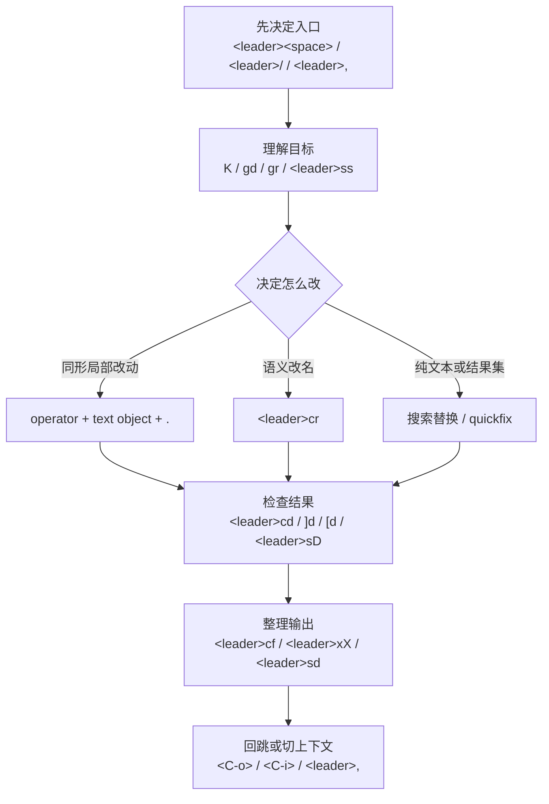

## 今日主题

- 主主题：`LazyVim 日常编辑闭环`
- 副主题：把 Day 011 的 `files / grep / buffers`、Day 012 的 `LSP` 导航，以及 Day 003 / 004 / 008 的“改”动作，接成一条每天都会重复的默认回路

## 学习目标

- 不再把“找文件、跳代码、改内容、看报错、回上下文”理解成分散技巧。
- 先学会问 3 个问题：
  - 我现在是在找文件、找文本，还是找语义符号？
  - 这次修改更适合 `.`、`<leader>cr`，还是 `:%s` / `grep + quickfix`？
  - 改完以后，我要看的是行内诊断、当前 buffer 的诊断，还是整个工作区的问题列表？
- 把 Day 013 最常用的一组入口练成第一反应：
  - `<leader><space>`
  - `<leader>/`
  - `<leader>,`
  - `gd`
  - `gr`
  - `K`
  - `<leader>ss`
  - `<C-o>` / `<C-i>`
  - `]d` / `[d`
  - `<leader>cd`
  - `<leader>sD`
  - `<leader>sd`
  - `<leader>xX`
  - `<leader>xq`
  - `[q` / `]q`
  - `<leader>cf`
- 建立一个关键判断：
  - `.` 适合重复同形改动
  - `<leader>cr` 适合语义级 rename
  - `:%s`、`grep`、quickfix 更适合纯文本或结果集批量处理

## 前置回顾

- Day 011 解决的是：
  - 怎么找文件
  - 怎么搜文本
  - 怎么切 buffer 和回上下文
- Day 012 解决的是：
  - 怎么按语义跳定义
  - 怎么看引用
  - 怎么 hover
  - 怎么 rename
- 更早的 Day 003 / 004 / 005 / 006 / 008 已经分别提供了：
  - `operator + motion`
  - 文本对象
  - 搜索替换
  - buffer / window / split
  - `.`、寄存器、宏、quickfix 结果集思维

Day 013 的任务不是再学一堆新键，而是把前面这些东西真正接成一条工作链。

## 典型场景

- 你先用 `<leader><space>` 或 `<leader>/` 找到目标，再用 `gd` / `gr` / `K` 理解它，最后开始改。
- 你跳到定义以后，想最快回到原位置继续改，而不是在几个文件里迷路。
- 你改了一个符号名，需要判断这次应该用 `.`、`rename`，还是纯文本替换。
- 你改完以后出现红线，想先看当前行，再看整个文件或整个工作区的问题列表。
- 你手里已经有一组结果列表，想按结果逐个处理，而不是再重新搜一遍。

## 最小命令集

这次我直接对齐了本机事实锚点：

- `vim --version`
- `nvim --version`
- `nvim --headless "+checkhealth vim.lsp" +qa`
- `nvim --headless "+lua local a=vim.fn.maparg(']d','n',false,true); local b=vim.fn.maparg('[d','n',false,true); print(']d='..(a.desc or '<none>')); print('[d='..(b.desc or '<none>'))" +qa`
- `:help CTRL-O`
- `:help CTRL-I`
- `:help jumplist`
- `:help .`
- `:help vim.diagnostic.jump()`
- `:help vim.diagnostic.open_float()`
- 本机 `LazyVim` 源码里的：
  - `lua/lazyvim/config/keymaps.lua`
  - `lua/lazyvim/plugins/editor.lua`
  - `lua/lazyvim/plugins/extras/editor/snacks_picker.lua`

### 入口与上下文

- `<leader><space>`
  - 按项目根目录找文件
- `<leader>/`
  - 按项目根目录搜文本
- `<leader>,`
  - 看当前 buffer 列表
- `<S-h>` / `<S-l>`
  - 在邻近 buffer 间小步切换
- `<C-o>`
  - 回到 jump list 里更旧的位置
- `<C-i>`
  - 回到 jump list 里更新的位置

### 语义理解与修改

- `K`
  - 看 hover 说明
- `gd`
  - 跳 definition
- `gr`
  - 看 references
- `<leader>ss`
  - 当前文档的结构化 symbols
- `<leader>cr`
  - 对符号做语义 rename
- `.`
  - 重复上一次改动

### 诊断与结果集

- `<leader>cd`
  - 看当前行诊断
- `]d` / `[d`
  - 下一个 / 上一个诊断
- `<leader>sD`
  - 当前 buffer 的 diagnostics
- `<leader>sd`
  - 工作区 diagnostics
- `<leader>xX`
  - 当前 buffer 的 diagnostics 列表（Trouble）
- `<leader>xq`
  - Quickfix List
- `[q` / `]q`
  - 上一个 / 下一个 quickfix 项

### 收尾

- `<leader>cf`
  - Format

## 它是怎么用的

Day 013 的重点不是“把键背下来”，而是形成一条顺序很稳定的默认流程：

这个流程可以拆成 5 层：

### 1. 入口层：先分清你到底在找什么

- 不知道文件在哪：
  - 用 `<leader><space>`
- 知道词，但不知道在哪个文件：
  - 用 `<leader>/`
- 文件已经开着，只是 buffer 多了：
  - 用 `<leader>,`

这里最容易犯的错，是还没分清问题层级，就直接开始乱跳。

### 2. 理解层：先知道这段代码在干什么

- 不确定 API 或符号说明：
  - 先 `K`
- 想看定义：
  - `gd`
- 想看影响面：
  - `gr`
- 当前文件太长，但你知道自己在找哪个函数、类或段落：
  - `<leader>ss`

Day 012 主要教的是“会跳”，Day 013 要补上的，是“跳完别丢上下文”。

所以 `gd`、`gr` 之后，`<C-o>` / `<C-i>` 很关键。

根据 `:help jumplist`、`:help CTRL-O`、`:help CTRL-I`，这不是 buffer 切换，而是跳转历史。它解决的是：

- 你刚刚跳到定义了
- 你看完了
- 你想回到原来那一行继续改

### 3. 修改层：决定这次改动属于哪一类

这是 Day 013 最核心的判断。

#### 情况 A：同形、局部、可重复

例如：

- 连续几处都要把一个函数调用的参数从 `foo` 改成 `bar`
- 连续几行都要把引号里的一个词换掉

这种优先考虑：

- `ciw` / `cib` / `ci"` 之类文本对象改动
- 然后用 `.`

这里应该想到的是 Day 003、Day 004、Day 008，不是直接上全局替换。

#### 情况 B：一个真实符号要改名

例如：

- 局部变量改名
- 函数名改名
- 模块名引用统一改名

这种优先考虑：

- `gr`
- `<leader>cr`

也就是先看引用范围，再 rename。

#### 情况 C：纯文本、跨很多地方、并不一定是同一个语义符号

例如：

- Markdown 标题统一改词
- 一批注释文本改措辞
- 某个字符串字面量批量替换

这种优先考虑：

- `:%s`
- `<leader>/`
- quickfix 结果集

### 4. 检查层：改完别立刻跑，先看诊断和结果集

Day 013 不把“保存就完事”当闭环，真正的闭环是：

- 改完
- 看问题
- 修掉
- 再继续

最小顺序通常是：

1. `<leader>cd`
2. `]d` / `[d`
3. `<leader>sD`
4. `<leader>sd`

这 4 个入口分别回答不同问题：

- 当前行到底报了什么？
- 下一个问题在哪里？
- 当前文件整体还有哪些问题？
- 工作区里还有没有别的相关问题？

如果你已经进入“结果集处理”模式，可以切到：

- `<leader>xX`
- `<leader>xq`
- `[q` / `]q`

这里要注意：

- diagnostics 是问题来源
- quickfix 是结果列表容器
- Trouble 是一种更适合浏览结果的界面

它们相关，但不是一回事。

### 5. 收尾层：整理输出，再继续下一轮

收尾最常见的动作是：

- `<leader>cf`
- `<C-o>` 回到刚才的改动起点
- `<leader>,` 继续切下一个 buffer

这一步的目标不是“格式化很高级”，而是让你每次完成一轮修改之后，留下一个干净、可继续推进的状态。

## 常见操作套路

### 套路 1：先跳定义，看懂后回原处继续改

1. `<leader><space>` 找文件
2. `gd` 跳定义
3. `K` 看说明
4. `<C-o>` 回原位置
5. 用 `ciw` / `cib` / `.` 开始改

适用场景：

- 你对这个符号半懂不懂，先确认再动手。

### 套路 2：先看引用，再做 rename

1. `gr`
2. 快速扫一遍影响面
3. `<leader>cr`
4. `<leader>cd`
5. `]d` / `[d`
6. `<leader>cf`

适用场景：

- 改的是“一个代码符号”，不是普通文本。

### 套路 3：一类重复小改动，优先 `.`，别急着批量替换

1. 到第一处目标
2. 用文本对象改一次
3. 到下一处相同结构
4. 按 `.`
5. 重复

适用场景：

- 同形、局部、可预测的小改动。

### 套路 4：改完以后先看当前文件，再看全局

1. `<leader>cd`
2. `<leader>sD`
3. `<leader>sd`
4. 如果已经有结果集，用 `<leader>xX` 或 `<leader>xq`

适用场景：

- 你不确定这次改动影响了哪一层范围。

### 套路 5：把 `<leader>,` 当主入口，把 `<S-h>` / `<S-l>` 当补充

1. buffer 很少、只是前后两个文件来回切：
  - `<S-h>` / `<S-l>`
2. buffer 多了、要明确挑一个：
  - `<leader>,`

适用场景：

- 避免只会顺着 buffer 轮切，结果越切越迷。

## 环境差异：vim / nvim / LazyVim

### Vim

- 最稳的仍然是：
  - movement
  - text objects
  - `/`
  - `:s`
  - quickfix
  - jumplist
- 它能完成很多编辑闭环，但默认没有今天这套 LSP / diagnostics 工作流。

### Neovim

- 增加了现代宿主能力：
  - `vim.lsp.buf.*`
  - `vim.diagnostic.*`
  - `:checkhealth`
- Day 013 里的语义跳转、rename、diagnostics，底层大多来自这里。

### LazyVim

- 把这些底层能力组织成一套默认入口：
  - `files / grep / buffers`
  - `gd / gr / K / rename`
  - diagnostics picker
  - Trouble 结果浏览
  - format
- 这也是为什么 Day 013 学的是“工作流闭环”，不是单个插件说明书。

当前本地事实锚点是：

- `Vim 9.2`
- `Neovim 0.12.0`
- `nvim --headless "+checkhealth vim.lsp" +qa` 能正常跑完
- `]d` / `[d` 在本机 headless 实测到的 desc 分别是：
  - `Jump to the next diagnostic in the current buffer`
  - `Jump to the previous diagnostic in the current buffer`

## 今日练习（5-10 分钟）

### 练习任务 A：练一次“跳出去，再回来”

1. 打开：
   - `C:\Users\86131\AppData\Local\nvim\lua\config\lazy.lua`
2. 把光标放到 `vim.fn.stdpath`、`vim.api.nvim_echo` 或 `require("lazy").setup` 这类位置上
3. 试：
   - `K`
   - `gd`
   - `<C-o>`
   - `<C-i>`

目标：

- 把“语义跳转”和“跳转回来”连成一组动作。

### 练习任务 B：练一次“先理解，再决定怎么改”

1. 打开：
   - `C:\Users\86131\AppData\Local\nvim\lua\plugins\example.lua`
2. 找一处你能看懂的局部改动，比如某个字符串、某个局部参数名或一个简单注释
3. 先做一次最小改动
4. 找到下一处同形改动
5. 用 `.`

目标：

- 先体验“同形改动优先 `.`”，不要动不动就上全局替换。

### 练习任务 C：练一次诊断闭环

1. 仍然在一个 Lua 文件里操作
2. 临时制造一个很容易恢复的小错误，例如少一个右括号或右花括号
3. 保存一次
4. 试：
   - `<leader>cd`
   - `]d`
   - `<leader>sD`
5. 然后 `u` 撤销，保存恢复

目标：

- 让“改完看诊断，再恢复干净状态”形成手感。

说明：

- 这一步是练流程，不是让你真的把配置搞坏。
- 关键在于体验：
  - 当前行提示
  - 下一个问题
  - 当前文件的问题列表

## 今日问题与讨论

### 我的问题

- 暂无。本节先把日常编辑闭环搭起来，后续问答继续直接补到这里。

### 外部高价值问题

#### 问题 1：`gd` 跳出去以后，怎么最快回来？

- 问题：
  - 我跳到 definition 以后，看完了，但不想再靠 buffer 来回切，应该怎么回原位置？
- 简答：
  - 用 `<C-o>` 回 jump list 里的更旧位置，用 `<C-i>` 再往前走。
- 场景：
  - 你刚刚 `gd`、`gr`、或从 symbols / picker 里跳到别处，现在想回到刚才改代码的那一行。
- 依据：
  - `:help CTRL-O`
  - `:help CTRL-I`
  - `:help jumplist`
- 当前结论：
  - `gd` 和 `<C-o>` 应该练成一组，而不是跳了就忘。
- 是否需要后续回看：
  - `是`

#### 问题 2：什么时候该用 `.`，什么时候该用 `<leader>cr`，什么时候该用 `:%s`？

- 问题：
  - 它们看起来都能“改很多地方”，边界怎么分？
- 简答：
  - `.` 处理同形重复动作；`<leader>cr` 处理一个真实代码符号的语义改名；`:%s` / `grep + quickfix` 处理纯文本或结果集批量动作。
- 场景：
  - 你一边改代码，一边在“单次编辑 / 多次重复 / 语义 rename / 纯文本替换”之间犹豫。
- 依据：
  - `:help .`
  - Day 003 / Day 004 / Day 005 / Day 008
  - Day 012 的 `gr -> <leader>cr`
- 当前结论：
  - Day 013 的核心不是记键，而是先给改动分类。
- 是否需要后续回看：
  - `是`

#### 问题 3：`<leader>cd`、`<leader>sD`、`<leader>sd`、`<leader>xX`、`<leader>xq` 是一回事吗？

- 问题：
  - 它们都像“看问题列表”，为什么要分这么多层？
- 简答：
  - 不是一回事。它们分别回答当前行、当前 buffer、整个工作区，以及已有结果列表这些不同层级的问题。
- 场景：
  - 你改完以后看到红线，但不知道该先盯一行、先盯当前文件，还是直接看整组结果。
- 依据：
  - `:help vim.diagnostic.open_float()`
  - `:help vim.diagnostic.jump()`
  - `:help vim.diagnostic.setloclist()`
  - 本机 `LazyVim` 的 `config/keymaps.lua`
  - 本机 `LazyVim` 的 `plugins/editor.lua`
  - 本机 `LazyVim` 的 `plugins/extras/editor/snacks_picker.lua`
- 当前结论：
  - 先记成这组分层：
    - `<leader>cd`：当前行
    - `<leader>sD`：当前文件
    - `<leader>sd`：工作区
    - `<leader>xq`：quickfix 结果列表
    - `<leader>xX`：buffer diagnostics 的结果列表视图
- 是否需要后续回看：
  - `是`

## 常见误区或易混点

- 误区 1：跳到了 definition，就算“完成编辑”了。
  - 不对。跳转只是理解，闭环还要包含修改、检查、回到上下文。
- 误区 2：所有多处修改都应该直接上 rename。
  - 不对。rename 适合语义符号，不适合所有纯文本场景。
- 误区 3：只要有 diagnostics，就不需要 quickfix 或结果列表。
  - 不对。诊断和结果集是两个层次。
- 误区 4：一旦 buffer 多起来，继续只靠 `<S-h>` / `<S-l>` 就行。
  - 不对。真正的主入口应该是 `<leader>,`。
- 误区 5：`gd`、`gr` 这种跳转之后，忘了 `<C-o>` / `<C-i>` 也没关系。
  - 不对。不会回跳，就很难形成稳定编辑节奏。

## 扩展内容

- `]e` / `[e`
  - 下一个 / 上一个 error，比 `]d` / `[d` 更聚焦。
- `]w` / `[w`
  - 下一个 / 上一个 warning。
- `<leader>xx`
  - 工作区 diagnostics 的 Trouble 视图。
- `<leader>xl`
  - Location List 开关，适合后面理解 loclist 与 quickfix 的区别。
- `<leader>ud`
  - toggle diagnostics，属于排查或临时降噪入口，不是主线高频动作。

## 今日小结

- Day 013 真正要建立的，不是新知识点，而是一个稳定顺序：
  - 先决定入口
  - 再理解目标
  - 再决定怎么改
  - 改完立刻看 diagnostics / 结果集
  - 最后回跳或切上下文继续下一轮
- 其中最关键的新增手感有两个：
  - `gd` 之后记得 `<C-o>`
  - 改动之前先判断是 `.`、`rename`，还是 `:%s` / quickfix
- 到这一步，前面学过的 Vim 基础和 LazyVim 默认工作流，才真正开始连成一个日常可用的系统。

## 明日衔接

- 下一天进入 `Day 014：回顾、巩固与高频扩展`。
- 重点不再是单独新增很多内容，而是回头检查：
  - 哪些动作已经能第一反应做出来
  - 哪些地方还会退回手工编辑
  - 哪些边界还在混：
    - `.` / `rename` / `:%s`
    - `grep` / `LSP`
    - diagnostics / quickfix / Trouble

## 复习题

1. Day 013 的“闭环”至少包含哪几个阶段？
2. 为什么 `gd` 以后应该顺手想到 `<C-o>`？
3. `.`、`<leader>cr`、`:%s` 最适合分别处理哪类改动？
4. `<leader>cd`、`<leader>sD`、`<leader>sd` 分别在看哪一层问题？
5. 为什么 `<leader>,` 应该是多 buffer 场景下的主入口，而不是只靠 `<S-h>` / `<S-l>`？
