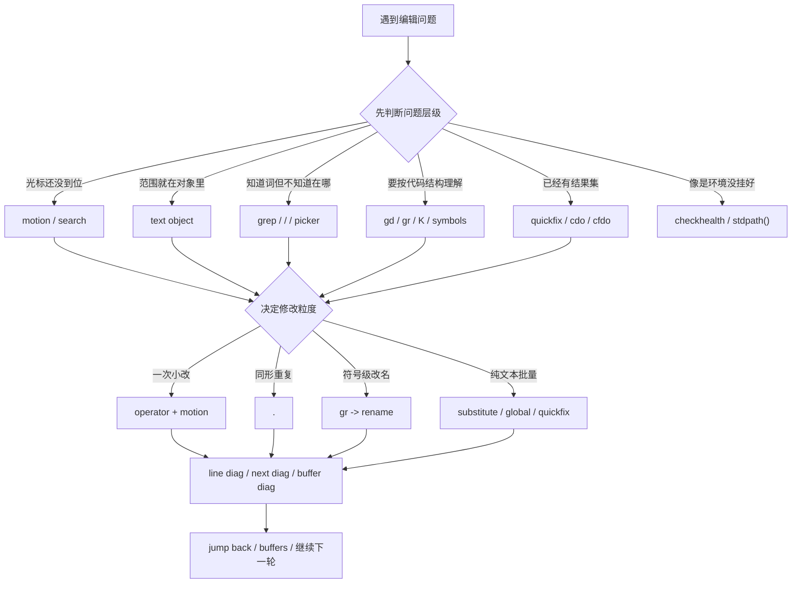

## 今日主题

- 主主题：`回顾、巩固与高频扩展`
- 副主题：把前 14 天主线压成一个日常可用的“编辑选择器”，不再把 Vim / Neovim / LazyVim 学成一堆散开的命令

## 学习目标

- 用一句话重新理解这 14 天：
  - 不是“记很多键”
  - 而是“先判断问题属于哪一层，再选最合适的编辑工具”
- 把这几个关键边界彻底拆开：
  - movement / text object / search
  - `.` / `:%s` / `:global` / quickfix / LSP rename
  - file / grep / buffer / symbol
  - diagnostics / Trouble / quickfix / health
- 为后续真实项目建立一个稳定顺序：
  - 先定位
  - 再理解
  - 再修改
  - 再检查
  - 最后回到上下文继续推进
- 明确哪些能力已经是主线，哪些属于现在开始慢慢补的高频扩展。

## 前置回顾

这 14 天其实走了 4 层。

### 第 1 层：Vim 的基本编辑语言

- Day 001：模式与编辑心智
- Day 002：移动
- Day 003：`operator + motion`
- Day 004：文本对象
- Day 005：搜索 / 替换 / 可视模式

这层回答的是：

- 光标怎么到位？
- 范围怎么表达？
- 一次改动怎么做得更短？

### 第 2 层：结果集、范围和多文件

- Day 006：buffer / window / split
- Day 007：命令行模式与 Ex
- Day 008：`.`、寄存器、宏、`:global`、多文件批处理

这层回答的是：

- 文件多了怎么不迷路？
- 范围和结果集怎么表达？
- 多次修改怎么升级工具？

### 第 3 层：Neovim 作为现代宿主

- Day 009：terminal / clipboard / config / health

这层回答的是：

- 编辑器环境出问题时，该从哪里排查？

### 第 4 层：LazyVim 默认工作流

- Day 010：leader 思维
- Day 011：files / grep / buffer
- Day 012：LSP 导航
- Day 013：日常编辑闭环

这层回答的是：

- 在现代项目里，怎么把 Vim 的底层语言和 LazyVim 的默认入口接成一套顺手工作流？

## 典型场景

- 你要改一个配置项，知道文件在哪，但不确定该用文本对象、`.` 还是替换。
- 你在项目里看到一个函数名，想知道它在哪定义、被谁调用、改名会波及哪里。
- 你已经搜到一组结果，接下来想逐个改，而不是每次重新搜索。
- 你按了某个键没反应，不知道是 keymap 没挂、LSP 没挂，还是环境有问题。
- 你希望最终在真实项目里形成一套固定动作，而不是每次都临时猜。

## 最小命令集

Day 014 不再试图扩充命令表，而是保留真正最常用的最小集合。

这次我仍然对齐本机事实锚点：

- `vim --version`
- `nvim --version`
- `nvim --headless "+checkhealth vim.lsp" +qa`
- `:help text-objects`
- `:help .`
- `:help CTRL-O`
- `:help CTRL-I`
- `:help jumplist`
- `:help quickfix`
- `:help :cdo`
- `:help :global`
- `:help vim.diagnostic.jump()`
- `:help vim.diagnostic.open_float()`
- 本机 `LazyVim` 源码里的：
  - `lua/lazyvim/config/keymaps.lua`
  - `lua/lazyvim/plugins/editor.lua`
  - `lua/lazyvim/plugins/extras/editor/snacks_picker.lua`

### 1. 定位目标

- `w` / `b` / `e`
- `0` / `^` / `$`
- `/`、`n`、`N`
- `<leader><space>`
- `<leader>/`
- `<leader>,`
- `<leader>ss`

### 2. 表达范围并修改

- `d{motion}`
- `c{motion}`
- `diw` / `daw`
- `ciw` / `cib` / `ci"`
- `v` / `V` / `<C-v>`
- `:%s/.../.../gc`
- `.`
- `<leader>cr`

### 3. 看结果与继续推进

- `gd`
- `gr`
- `K`
- `<C-o>` / `<C-i>`
- `<leader>cd`
- `]d` / `[d`
- `<leader>sD`
- `<leader>sd`
- `<leader>xq`
- `[q` / `]q`

### 4. 环境排查

- `:checkhealth`
- `:checkhealth vim.lsp`
- `stdpath('config')`
- `stdpath('data')`
- `stdpath('state')`

## 它是怎么用的

Day 014 的核心是一个选择器，而不是一个命令表。

### 第一个问题：我现在到底在处理什么？

| 你遇到的问题 | 第一反应 |
| --- | --- |
| 光标还没到位 | `motion` |
| 范围就在当前对象里 | `text object` |
| 知道一个词，但不知道在哪 | `/` 或 `<leader>/` |
| 知道大概文件名 | `<leader><space>` |
| 文件很多，想切上下文 | `<leader>,` |
| 想知道代码定义或引用 | `gd` / `gr` / `K` |
| 改完以后想看问题 | `<leader>cd` / `]d` / `<leader>sD` |
| 编辑器环境像是没挂好 | `:checkhealth` / `stdpath()` |

如果这一步判断错了，后面的动作往往都会显得笨。

### 第二个问题：这次修改是什么粒度？

这是整个 14 天里最重要的一次总复盘。

| 修改类型 | 更适合的工具 |
| --- | --- |
| 一处小改动 | `operator + motion` |
| 一类同形重复改动 | `.` |
| 一个对象内部改动 | `text object` |
| 纯文本批量替换 | `:%s` |
| 符号级改名 | `gr -> <leader>cr` |
| 一组结果逐个处理 | quickfix / `:cdo` / `[q` / `]q` |
| 多文件、规则比较明确的批量动作 | `:global`、宏、`cdo` / `cfdo` |

如果你只会一种方法，就会出现两种典型退化：

- 本来一处小改，结果上全局替换
- 本来一组结果集批量处理，结果手工一个个改

### 第三个问题：改完以后我要看哪一层反馈？

这一层很多人会混。

| 你想知道什么 | 更适合的入口 |
| --- | --- |
| 当前行到底报了什么 | `<leader>cd` |
| 下一个问题在哪 | `]d` / `[d` |
| 当前文件还有哪些问题 | `<leader>sD` |
| 整个工作区还有哪些问题 | `<leader>sd` |
| 我已经有一组结果列表，想沿着结果处理 | `<leader>xq` / `[q` / `]q` |
| 我想看更适合浏览的 diagnostics 视图 | Trouble |

所以 diagnostics、quickfix、Trouble 有联系，但不是一个东西。

### 第四个问题：这个问题是编辑问题，还是环境问题？

如果表现是下面这些，就先别急着怪自己不会按键：

- LSP 键位在某个 buffer 里是 `<none>`
- 某个 server 没挂上
- 剪贴板、provider、终端行为不符合预期
- 同一套动作在 Vim、Neovim、LazyVim 里表现不同

这时先想：

- `:checkhealth`
- `:checkhealth vim.lsp`
- `stdpath('config')`
- `stdpath('data')`
- 当前是不是有对应的 buffer / filetype / LSP client

### 把 14 天压成一张流程图

## 常见操作套路

### 套路 1：一眼看上去只是小改，就先别升级工具

1. 用 `motion` 或 `text object` 到位
2. 改一次
3. 看看下一处是否同形
4. 如果同形，再交给 `.`

适用场景：

- 局部变量名、小字符串、小参数位点的连续调整

### 套路 2：先搜文本，再决定要不要升级到语义层

1. `<leader>/` 找到大概范围
2. 进入目标文件
3. 如果只是普通文本，继续 `/` 或 `:%s`
4. 如果已经是代码符号，切到 `gd` / `gr` / `<leader>cr`

适用场景：

- 你一开始只知道词长什么样，还不确定它是不是一个真正的代码符号

### 套路 3：先看引用，再做 rename

1. `gr`
2. 看影响面
3. `<leader>cr`
4. `<leader>cd`
5. `]d`
6. `<leader>cf`

适用场景：

- 你已经处在 LSP buffer 里，改的是变量、函数、模块名

### 套路 4：先得到结果集，再批量推进

1. `<leader>/` 或 `:vimgrep` 得到结果
2. 看 quickfix
3. `[q` / `]q` 沿着结果走
4. 如果操作足够统一，再考虑 `:cdo` / `:cfdo`

适用场景：

- 改的是一批文本结果，而不是单个语义符号

### 套路 5：遇到“怎么按都不对”的问题，先排宿主环境

1. `:checkhealth`
2. `:checkhealth vim.lsp`
3. 看当前 buffer 有没有对应 filetype / server
4. 确认是不是 LazyVim 动态挂载 keymap

适用场景：

- 某个键昨天能按，今天不行
- 同一个键在不同 buffer 表现不一样

## 环境差异：vim / nvim / LazyVim

### Vim

- 你已经学会的这些能力，在 Vim 里就足够构成一个强编辑器：
  - motion
  - text objects
  - `/`
  - `:s`
  - `:global`
  - quickfix
  - `.`、宏、寄存器
- 所以 Vim 的价值不是“轻量版 Neovim”，而是底层编辑语言本体。

### Neovim

- 重点不在于“有新语法”，而在于它把编辑器变成了更现代的宿主：
  - `vim.lsp`
  - `vim.diagnostic`
  - `:checkhealth`
  - `stdpath()`
- 所以 Neovim 阶段真正补上的，是环境理解和排查能力。

### LazyVim

- 它不是替代 Vim 基础，而是把你已经学过的东西组织成默认工作流：
  - files
  - grep
  - buffers
  - LSP
  - diagnostics
  - format
- 这也是为什么学完 Day 014 之后，真正该留下来的不是“某个插件的键”，而是“先判断问题层级”的习惯。

当前本地事实锚点仍然是：

- `Vim 9.2`
- `Neovim 0.12.0`
- `nvim --headless "+checkhealth vim.lsp" +qa` 可以跑通
- 本机 `LazyVim` 源码里可以直接看到：
  - `<leader>xq => Quickfix List`
  - `<leader>cd => Line Diagnostics`
  - `<leader>sd => Diagnostics`
  - `<leader>sD => Buffer Diagnostics`

## 今日练习（5-10 分钟）

### 练习任务 A：用 3 分钟把“问题层级”说出来

拿一个真实编辑问题，强迫自己先口头回答：

1. 我现在是在找文件、找文本、找对象，还是找语义符号？
2. 这次修改是一处小改、同形重复、语义改名，还是结果集批量处理？
3. 改完以后我要看当前行、当前文件、整个工作区，还是 quickfix 列表？

目标：

- 把 Day 014 的“选择器”先从脑内跑一遍。

### 练习任务 B：做一轮完整闭环

1. 打开：
   - `C:\Users\86131\AppData\Local\nvim\lua\config\lazy.lua`
2. 先用 `gd` 或 `K` 理解一个目标
3. 回来用 `text object` 做一个很小的修改
4. 用 `.` 或直接重复一次同形修改
5. 用 `<leader>cd` 或 `<leader>sD` 看反馈
6. 用 `<C-o>` 或 `<leader>,` 回到原上下文

目标：

- 把 Day 011、Day 012、Day 013 真正压成一轮动作。

### 练习任务 C：做一次“结果集而不是手工重复”

1. 在仓库里找一个普通文本词
2. 用 `<leader>/` 或 `/` 搜出来
3. 先判断：
   - 这是纯文本问题，还是语义符号问题？
4. 如果是纯文本问题：
   - 试着用 `:%s` 或 quickfix 思维去处理
5. 如果是语义符号问题：
   - 停止文本替换，转去 `gd / gr / <leader>cr`

目标：

- 练的是“知道什么时候该换工具”，不是练一次特定命令。

## 今日问题与讨论

### 我的问题

- 暂无。本节以总复盘和后续训练路线为主，后续新的实际问题可以继续补到这里或回写到对应旧章节。

### 外部高价值问题

#### 问题 1：学完 14 天以后，最该留下来的是什么？

- 问题：
  - 如果我最后没有把所有命令都记住，这 14 天最重要的收获应该是什么？
- 简答：
  - 不是记命令，而是先判断问题层级，再选择工具。
- 场景：
  - 真实工作里，你不会先背诵命令表，而是先看这到底是“移动问题”“范围问题”“语义问题”“结果集问题”还是“环境问题”。
- 依据：
  - Day 001 到 Day 014 的主线收束
- 当前结论：
  - 真正要留下的是“编辑选择器”，不是“命令背诵表”。
- 是否需要后续回看：
  - `是`

#### 问题 2：什么时候该回到 Vim 基础，什么时候直接用 LazyVim 工作流？

- 问题：
  - 现在已经进到 LazyVim 了，还需要老回头练 `motion`、`text object`、`.` 吗？
- 简答：
  - 要。LazyVim 解决的是入口和组织，Vim 基础解决的是最后那一下怎么改。
- 场景：
  - 你可以用 LazyVim 很快找到文件和符号，但真正落刀时，仍然靠的是 `c{motion}`、文本对象、`.`、替换这些底层语言。
- 依据：
  - Day 003 / Day 004 / Day 005 / Day 008
  - Day 010 / Day 011 / Day 012 / Day 013
- 当前结论：
  - LazyVim 不是替代 Vim 基础，而是把 Vim 基础组织得更顺手。
- 是否需要后续回看：
  - `是`

#### 问题 3：什么时候该先查 `:checkhealth`，而不是怀疑自己按错键？

- 问题：
  - 我有时分不清是环境没挂好，还是自己不会用。
- 简答：
  - 当表现跟“编辑语言本身”无关，而像 provider、server、filetype、动态 keymap 没挂上时，先查 health。
- 场景：
  - 某个 buffer 里 `gd`、`K`、`rename` 没反应；终端、剪贴板、LSP 状态不稳定；同一键在不同 buffer 表现不一样。
- 依据：
  - Day 009
  - Day 012
  - 本机 `nvim --headless "+checkhealth vim.lsp" +qa`
- 当前结论：
  - 如果问题像是“宿主环境没连上”，就先查 `:checkhealth` 和 `stdpath()`，别直接怀疑自己记忆错误。
- 是否需要后续回看：
  - `是`

## 常见误区或易混点

- 误区 1：学完 14 天，就应该把所有命令都背得滚瓜烂熟。
  - 不对。更现实的目标是建立正确的第一反应和选择顺序。
- 误区 2：进了 LazyVim，就不需要再练 Vim 基础。
  - 不对。找得到不等于改得利索。
- 误区 3：一旦能用 LSP，就可以不用搜索和替换。
  - 不对。语义问题和文本问题不是一个层次。
- 误区 4：quickfix、Trouble、diagnostics 是同一回事。
  - 不对。它们是相关但不同层的结果视图。
- 误区 5：按键没反应时，第一反应应该是“我记错了”。
  - 不对。也可能是环境、filetype、server、动态挂载条件没有满足。

## 扩展内容

这部分是“高频扩展”，不是 Day 014 要求当天全掌握的内容。

- `:global`
  - 当你要对符合某个模式的多行执行命令时，很值得回看。
- `:cdo` / `:cfdo`
  - 当你已经得到 quickfix 结果集，而且动作规则足够统一时，比手工逐条处理更稳。
- 宏
  - 当改动有规律，但又不像 `.` 那么单纯时，宏仍然是非常强的中间层工具。
- location list
  - 当你想把结果约束在当前窗口上下文，而不是全局 quickfix 时，值得后面补。
- `:terminal` / provider / `:checkhealth`
  - 这类宿主环境入口不属于“炫技”，而是日常排查必须会的基础设施。

## 今日小结

- 14 天主线真正完成的，不是“把 Vim 学完了”，而是把一套足够实用的编辑模型搭起来了：
  - Vim 提供编辑语言
  - Neovim 提供现代宿主能力
  - LazyVim 提供默认工作流
- 如果只留一句话，那就是：
  - 先判断问题层级，再选工具
- 如果只留一条训练原则，那就是：
  - 小改动不要升级过度，复杂批量不要手工硬扛

## 明日衔接

- 默认 `14` 天主线到这里结束，不再强行新增 `Day 015`。
- 接下来更合理的推进方式是：
  - 项目驱动复训
  - 按薄弱点回看
  - 只在真实问题暴露时补扩展内容

建议你后续这样练：

1. 在真实项目里继续用 LazyVim 工作，不暂停主线。
2. 每次卡住时，先判断自己卡在：
   - movement
   - text object
   - search / replace
   - buffer / quickfix
   - LSP / diagnostics
   - health / provider
3. 再回看对应章节，而不是整套从头重学。

## 复习题

1. 这 14 天主线最终想建立的核心能力是什么？
2. 当你面对一个编辑问题时，最先该判断哪两件事？
3. `.`、`:%s`、`<leader>cr`、quickfix / `:cdo` 分别更适合处理什么粒度的改动？
4. diagnostics、Trouble、quickfix 的区别是什么？
5. 为什么学到 LazyVim 阶段以后，仍然要继续练 Vim 的 movement、text object 和 `.`？
