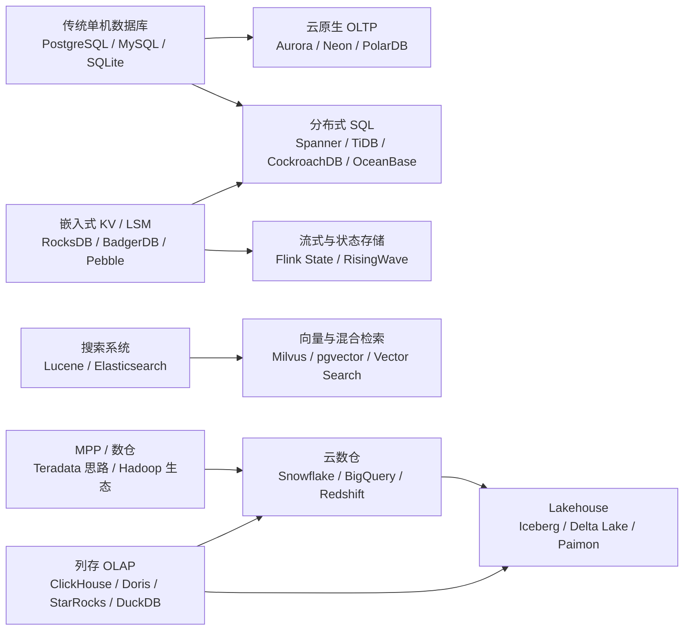

# Database Industry Learning Workflow Implementation Plan

> **For agentic workers:** REQUIRED SUB-SKILL: Use superpowers:subagent-driven-development (recommended) or superpowers:executing-plans to implement this plan task-by-task. Steps use checkbox (`- [ ]`) syntax for tracking.

**Goal:** Add durable repository scaffolding for a storage-first database industry learning and research workflow.

**Architecture:** The workflow is implemented as repository instructions plus Hugo-compatible Markdown learning documents. `AGENTS-learning-database-industry.md` defines the long-term rules, `AGENTS.md` routes database-industry learning requests to those rules, and `content/posts` stores the index, reusable report template, and first overview entry.

**Tech Stack:** Markdown, Hugo front matter, PowerShell, Git.

---

## Scope Check

This plan implements the learning workflow scaffold and the first overview entry. It does not write all three months of research reports in one pass. Each future专题 report should be implemented as a separate focused task using the workflow created here.

Existing RocksDB learning files may be dirty in the worktree. Do not modify or stage RocksDB files while executing this plan.

## File Structure

- Create `AGENTS-learning-database-industry.md`: long-term task-specific workflow for database industry learning.
- Modify `AGENTS.md`: add a routing section for database industry learning requests.
- Create `content/posts/learning-database-industry-day000-index.md`: stable index and progress state for this learning line.
- Create `content/posts/learning-database-industry-report-template.md`: reusable 17-section report template.
- Create `content/posts/learning-database-industry-day001-2026-04-28-modern-database-overview.md`: first overview/kickoff report with industry map, topic sequence, and reference anchors.

## Task 1: Add Database Industry Workflow Rules

**Files:**
- Create: `AGENTS-learning-database-industry.md`
- Modify: `AGENTS.md`

- [ ] **Step 1: Create the task-specific workflow file**

Create `AGENTS-learning-database-industry.md` with this content:

```markdown
# Database Industry Learning Workflow

When the user asks to learn, discuss, review, compare, or persist modern database industry study content in this repository, follow this task-specific workflow.

## Goal

- Build a long-term, source-backed understanding of the modern database industry.
- Prefer industry-level judgment over product encyclopedias.
- Use a storage-first perspective: storage, logs, recovery, transactions, MVCC, distributed consistency, secondary indexes, metadata, cache, and background work have higher priority than query execution details.
- Persist generated study content under `content/posts`.

## Learning Priorities

Primary goal:

- Establish a global map of modern database systems, their goals, target workloads, engineering tradeoffs, and badcases.

Secondary goals:

- Support judgment on large-capacity, low-cost, SQL, distributed, shared-storage, stateless-compute database architectures.
- Support career growth by making architecture tradeoffs explainable.
- Produce personal research reports that can be reviewed later.

## Source Rules

Every report must include references.

Minimum requirements:

- Each专题 report must include at least 5 references.
- Each重点 system must include at least 2 references.
- Open-source systems should include official docs or design docs plus local source anchors when the report makes implementation-level claims.
- Closed-source systems should include at least 2 kinds of public official material, such as docs, papers, official blogs, or official talks.
- Architecture diagrams must state their source. Self-drawn Mermaid diagrams must state that they are整理 based on public material.

Source priority:

| Priority | Source |
| --- | --- |
| P0 | Local source code, official docs, official papers |
| P1 | Official blogs, official talks, design docs |
| P2 | GitHub issues, discussions, maintainer comments |
| P3 | High-quality third-party blogs, courses, community articles |
| P4 | Ordinary second-hand summaries, usable only as leads |

For open-source systems, clone or reuse local source code when the topic needs implementation-level claims. Do not treat third-party summaries as final conclusions when local source or official docs can verify the point.

## System Report Template

Each重点 system should be studied through these sections:

1. System goal and historical motivation
2. Target workload and user demand
3. Overall architecture model diagram
4. Storage model
5. Write path
6. Read path
7. Logs, recovery, and CDC
8. Transactions, MVCC, batch, and concurrency control
9. Replication and distributed consistency
10. Metadata management
11. Secondary indexes and constraint maintenance
12. Cache, background work, and resource isolation
13. Plugins, ecosystem patches, and workaround solutions
14. My questions
15. Badcases and architecture boundaries
16. Engineering takeaways
17. References and citations

## Storage-First Weighting

High-weight modules:

- Storage layout
- Write and read paths
- WAL, redo, undo, binlog, raft log
- Recovery, checkpoint, log truncation, log recycling
- CDC and BLOB handling
- Transactions, MVCC, timestamps, snapshots, batch atomicity
- Distributed consistency, leader, learner, follower read, quorum, lease
- Secondary indexes, uniqueness, index backfill, index GC
- Metadata, catalog, region/tablet/shard metadata, manifest/version/snapshot
- Cache, compaction, flush, vacuum, GC, checkpoint, resource isolation

Lower-weight modules:

- Query optimizer
- Cost model
- Execution engine
- SQL syntax details
- BI/product-layer workflows

The lower-weight modules should be covered only when they affect storage, indexes, transactions, metadata, or distributed execution boundaries.

## Three-Month Topic Sequence

1. Modern database industry overview
2. Traditional OLTP and storage foundations
3. LSM and embedded storage engines
4. Distributed SQL and shared-nothing architecture
5. Cloud-native storage-compute separation
6. OLAP, column storage, and real-time analytics
7. Search, vector, and ecosystem patches
8. Lakehouse and object-storage table formats as a rolling follow-up

## Naming

Use stable names:

- Index: `content/posts/learning-database-industry-day000-index.md`
- Template: `content/posts/learning-database-industry-report-template.md`
- Reports: `content/posts/learning-database-industry-dayXXX-YYYY-MM-DD-<topic>.md`

Use `XXX` as a three-digit day number.

## Index Rules

Maintain one stable index file. Update `content/posts/learning-database-industry-day000-index.md`; do not create dated variants of the index.

The index should record:

- Current phase
- Current topic
- Topic sequence
- Report index
- Current open questions
- Source and local-code policy
- Next recommended report

## Badcase Rules

Badcases are not a separate专题. Every system and module should discuss badcases close to the relevant mechanism:

- Log badcases
- Transaction badcases
- Metadata badcases
- Cache badcases
- Distributed-consistency badcases
- Secondary-index badcases
- Background-task badcases
- Cost and multi-tenant badcases

## Question Rules

Every report must include a `我的问题` section.

Record:

- Questions that are currently unclear
- Questions requiring source verification
- Questions connected to engineering practice
- Resolved questions and current conclusions

## Engineering Takeaways

Use `工程启发` as the final judgment section. Do not name the section after any specific company project.
```

- [ ] **Step 2: Add routing instructions to `AGENTS.md`**

Append this section after the existing RocksDB Learning Workflow section:

```markdown

## Database Industry Learning Workflow

When the user asks to learn, discuss, review, compare, or persist modern database industry study content in this repository, follow [AGENTS-learning-database-industry.md](D:\program\Dog-Du.github.io\AGENTS-learning-database-industry.md) as the task-specific rule set.

Key points:

- Use a storage-first perspective: storage model, logs, recovery, transactions, MVCC, distributed consistency, metadata, secondary indexes, cache, and background work are higher priority than query execution details.
- Persist generated study content under `content/posts`.
- Keep the database industry study index file unique and stable at `content/posts/learning-database-industry-day000-index.md`; update it instead of creating dated index variants.
- Use the `learning-database-industry-dayXXX-YYYY-MM-DD-<topic>.md` naming scheme for new database industry learning reports.
- Treat each专题 report as a personal research document, not a product encyclopedia.
- Every report must include references and citations.
- For open-source systems, verify implementation-level claims against local source code when the topic requires that depth.
- For closed-source systems, prioritize official docs, official papers, official blogs, and official talks; mark unverified conclusions as public-material-based inference.
- Badcases must be discussed inside each relevant module, not isolated into a separate专题.
- Every report must include a `我的问题` section and a `工程启发` section.
```

- [ ] **Step 3: Verify the workflow section exists**

Run:

```powershell
rg -n "Database Industry Learning Workflow|learning-database-industry" AGENTS.md AGENTS-learning-database-industry.md
```

Expected: output shows matches in both files, including the new workflow heading and the index filename.

- [ ] **Step 4: Commit Task 1**

Run:

```powershell
git add -- AGENTS.md AGENTS-learning-database-industry.md
git commit -m "docs: add database industry learning workflow"
```

Expected: commit succeeds and only `AGENTS.md` plus `AGENTS-learning-database-industry.md` are included.

## Task 2: Add Stable Index And Report Template

**Files:**
- Create: `content/posts/learning-database-industry-day000-index.md`
- Create: `content/posts/learning-database-industry-report-template.md`

- [ ] **Step 1: Create the stable index**

Create `content/posts/learning-database-industry-day000-index.md` with this content:

```markdown
---
title: 数据库行业学习索引
date: 2026-04-28T00:00:00+08:00
lastmod: 2026-04-28T00:00:00+08:00
tags: [Database, Storage, Distributed Systems]
categories: [数据库]
series:
- "数据库行业学习"
series_order: -1
slug: learning-database-industry-index
summary: 数据库行业长期学习索引与轻量状态文件，用于恢复专题进度、导航调研报告，并记录问题、来源和工程启发。
---

## 当前状态

- 当前学习阶段：`第一阶段：三个月行业全景与 storage-first 专题调研`
- 当前投入节奏：`6-8 小时/周`
- 当前推进方式：`专题制`
- 当前产出形态：`调研报告式个人学习文档`
- 当前主目标：`建立现代数据库行业全局认知`
- 当前副目标：
  - `辅助判断大容量、低成本、SQL、分布式、共享存储、计算节点无状态等数据库架构`
  - `沉淀职业成长所需的系统目标、技术取舍、badcase 和工程启发`

## 学习原则

- 专题是推进单位，具体系统是学习单位，模块路径是深度单位。
- 每个重点系统必须讨论系统目标、历史动机、架构图、存储、日志、事务、一致性、元数据、二级索引、缓存、badcase、工程启发和引用来源。
- badcase 贯穿每个模块，不做成独立专题。
- 对开源系统，涉及实现细节时优先回到本地源码。
- 对闭源系统，优先使用官方文档、论文、官方博客和官方演讲。
- 插件和生态补丁需要单独分析，区分“能做”和“适合做”。

## 默认专题序列

| 阶段 | 专题 | 重点系统 | 状态 |
| --- | --- | --- | --- |
| 1 | 现代数据库行业全景 | PostgreSQL、MySQL、RocksDB、Redis、Lucene、Snowflake、BigQuery、Spanner、TiDB、ClickHouse、Doris、Milvus | `next` |
| 2 | 传统 OLTP 与存储基础 | PostgreSQL、MySQL/InnoDB、SQLite | `planned` |
| 3 | LSM 与嵌入式存储引擎 | RocksDB、BadgerDB、Pebble | `planned` |
| 4 | 分布式 SQL 与 shared-nothing 架构 | TiDB、CockroachDB、OceanBase、YugabyteDB、Spanner | `planned` |
| 5 | 云原生存算分离数据库 | Aurora、Neon、PolarDB、Azure SQL Hyperscale、Snowflake、BigQuery | `planned` |
| 6 | OLAP、列存与实时分析 | ClickHouse、Apache Doris、StarRocks、DuckDB、Druid、Pinot | `planned` |
| 7 | 搜索、向量与生态补丁 | Lucene/Elasticsearch、Milvus、pgvector、PostgreSQL extension 生态 | `planned` |
| 8 | Lakehouse 与对象存储表格式 | Iceberg、Delta Lake、Paimon | `rolling` |

## 报告索引

| Day | 日期 | 专题 | 文件 | 状态 |
| --- | --- | --- | --- | --- |
| 001 | 2026-04-28 | 现代数据库行业全景 | `learning-database-industry-day001-2026-04-28-modern-database-overview.md` | `planned` |

## 固定报告模板

固定模板文件：`learning-database-industry-report-template.md`

每篇专题报告至少包含：

1. 系统目标与历史动机
2. 目标 workload 与用户需求
3. 整体架构模型图
4. 存储模型
5. 写入路径
6. 读取路径
7. 日志、恢复、CDC
8. 事务、MVCC、batch、并发控制
9. 复制与分布式一致性
10. 元数据管理
11. 二级索引与约束维护
12. 缓存、后台任务、资源隔离
13. 插件、生态补丁与变相方案
14. 我的问题
15. badcase 与架构边界
16. 工程启发
17. 参考来源与引用

## 当前问题

- 如何在行业全景阶段避免过早陷入某个具体系统的源码细节？
- 如何把闭源系统的公开资料和开源系统的源码验证放在同一套判断框架里？
- 如何判断插件能力是系统优势、生态优势，还是不适合重度依赖的变通方案？

## 来源与本地源码策略

- 开源系统：优先 clone 到本地，并在报告中记录源码路径、关键目录、关键类或函数。
- 闭源系统：记录官方文档、官方博客、论文、演讲和公开架构图。
- 第三方资料：作为问题来源和辅助理解，不直接作为最终结论。
- 架构图：优先官方图；若自绘 Mermaid 图，注明根据公开资料整理。

## 下一步

下一篇建议创建：`learning-database-industry-day001-2026-04-28-modern-database-overview.md`

主题：`现代数据库行业全景：传统系统如何演进出现代数据库`
```

- [ ] **Step 2: Create the reusable report template**

Create `content/posts/learning-database-industry-report-template.md` with this content:

```markdown
---
title: 数据库行业调研报告模板
date: 2026-04-28T00:00:00+08:00
lastmod: 2026-04-28T00:00:00+08:00
tags: [Database, Storage, Research]
categories: [数据库]
series:
- "数据库行业学习"
series_order: 0
slug: learning-database-industry-report-template
summary: 数据库行业专题调研报告模板，用于按 storage-first 视角拆解现代数据库系统。
---

## 1. 系统目标与历史动机

说明系统为什么出现，受什么系统、论文、工程问题或行业变化启发，想替代或补充谁。

## 2. 目标 workload 与用户需求

说明系统面向的 workload、用户群体和核心需求。

## 3. 整体架构模型图

放置官方架构图、公开资料图，或根据公开资料整理的 Mermaid 图。

图后解释：

- 计算层在哪里
- 存储层在哪里
- 日志层在哪里
- 事务层在哪里
- 元数据层在哪里
- 复制层在哪里
- 缓存层在哪里

## 4. 存储模型

说明底层数据如何组织，例如 B+Tree、LSM、列存、对象存储文件、page、SST、segment、tablet、region、partition、倒排索引或向量索引。

## 5. 写入路径

说明写请求如何进入系统，是否支持 batch、group commit、日志聚合，写入是否经过 WAL、redo log、raft log 或 binlog，何时可见，何时持久化。

## 6. 读取路径

说明点查、范围查、snapshot read、index lookup、remote read、cache miss 后的路径，以及读路径如何处理可见性和缓存。

## 7. 日志、恢复、CDC

至少回答：

- 日志记录什么
- 日志如何写入、读取、分段、截断、删除和回收
- checkpoint 与日志回收如何关联
- 崩溃恢复从哪里开始
- CDC 读取哪类日志或变更流
- BLOB 或大对象如何进入日志或被日志引用

## 8. 事务、MVCC、batch、并发控制

说明时间戳、snapshot、可见性、冲突检测、锁、latch、长事务、大事务、失败恢复、批量写入原子性和并发安全。

## 9. 复制与分布式一致性

说明复制对象是什么，采用主从、Raft、Paxos、quorum、lease 或其他机制，leader 如何选举，副本如何追赶，learner、follower read、read replica 如何工作。

## 10. 元数据管理

说明 catalog、schema、table、index、tablet、region、shard、partition、version、manifest、snapshot 等元数据如何管理，以及 master、PD、meta service 或 catalog service 的职责。

## 11. 二级索引与约束维护

说明二级索引如何编码、写入、维护一致性，唯一索引、异步索引、索引回填、索引 GC 和约束检查如何处理。

## 12. 缓存、后台任务、资源隔离

覆盖 buffer pool、block cache、page cache、metadata cache、result cache；flush、compaction、vacuum、GC、checkpoint；以及竞争规避、资源隔离和后台任务调度。

## 13. 插件、生态补丁与变相方案

区分：

| 层次 | 含义 | 例子 |
| --- | --- | --- |
| 原生能力 | 系统内核直接支持 | PostgreSQL 的 SQL、MVCC、B+Tree |
| 官方或主流扩展 | 插件补能力 | pgvector、PostGIS、TimescaleDB、Citus |
| 外围系统组合 | 靠别的系统配合 | PostgreSQL + Elasticsearch、MySQL + Canal + ClickHouse |
| 变通方案 | 能做但不舒服 | 用 JSONB 模拟文档库，用关系表模拟队列 |

结论必须判断“能做”和“适合做”的区别。

## 14. 我的问题

记录当前不理解的问题、需要源码验证的问题、工程实践相关问题、已解决问题和当前结论。

## 15. badcase 与架构边界

按模块组织 badcase，至少关注日志、事务、元数据、缓存、分布式一致性、索引和后台任务。

## 16. 工程启发

总结哪些设计值得借鉴，哪些复杂性被转移，哪些方案看似优雅但工程代价高，哪些 badcase 对存储系统设计有警示意义。

## 17. 参考来源与引用

记录所有参考来源。开源系统记录本地源码锚点，闭源系统记录官方公开资料来源。
```

- [ ] **Step 3: Verify the index and template exist**

Run:

```powershell
rg -n "数据库行业学习索引|数据库行业调研报告模板|storage-first|参考来源与引用" content/posts/learning-database-industry-day000-index.md content/posts/learning-database-industry-report-template.md
```

Expected: output shows matches in both files, including `参考来源与引用`.

- [ ] **Step 4: Commit Task 2**

Run:

```powershell
git add -- content/posts/learning-database-industry-day000-index.md content/posts/learning-database-industry-report-template.md
git commit -m "docs: add database industry learning index"
```

Expected: commit succeeds and only the index plus template files are included.

## Task 3: Add The First Overview Entry

**Files:**
- Create: `content/posts/learning-database-industry-day001-2026-04-28-modern-database-overview.md`
- Modify: `content/posts/learning-database-industry-day000-index.md`

- [ ] **Step 1: Create Day 001 overview report**

Create `content/posts/learning-database-industry-day001-2026-04-28-modern-database-overview.md` with this content:

```markdown
---
title: 数据库行业学习 Day 001：现代数据库行业全景
date: 2026-04-28T00:00:00+08:00
lastmod: 2026-04-28T00:00:00+08:00
tags: [Database, Storage, Distributed Systems, OLTP, OLAP]
categories: [数据库]
series:
- "数据库行业学习"
series_order: 1
slug: learning-database-industry-day001-modern-database-overview
summary: 从传统单机数据库、存储引擎、搜索系统、云数仓、分布式 SQL、存算分离、OLAP、向量检索等方向建立现代数据库行业全景。
---

## 今日主题

本篇建立现代数据库行业的第一张地图。它不追求把某个系统讲深，而是回答：

- 现代数据库主要分成哪些方向？
- 每个方向从哪些传统系统或工程问题演进而来？
- 每类系统的目标、需求、原生强项和 badcase 分别是什么？
- 后续专题应该按什么顺序深入？

## 学习目标

- 建立行业全景，而不是产品清单。
- 把传统系统和现代系统的演进关系连起来。
- 明确后续 storage-first 调研的重点模块。
- 建立每篇报告必须包含引用和架构来源的习惯。

## 行业全景图



说明：这张图是根据公开资料和本学习计划整理的理解图，不是某个官方系统架构图。

## 第一层分类：传统系统原型

| 原型 | 代表系统 | 原生强项 | 典型边界 |
| --- | --- | --- | --- |
| 完整关系型数据库 | PostgreSQL | SQL、事务、MVCC、扩展机制 | 单机写扩展、vacuum、长事务、OLAP 扫描 |
| 互联网 OLTP | MySQL/InnoDB | 简洁 OLTP、生态、主从复制 | 单主写、复杂分析、分库分表复杂 |
| 嵌入式存储引擎 | RocksDB、BadgerDB、Pebble | 高写入、LSM、嵌入式 KV | 不提供 SQL、事务语义有限、compaction 复杂 |
| 本地嵌入式 SQL | SQLite | 单文件、零运维、本地事务 | 多写并发、服务化、多租户 |
| 内存数据结构 | Redis | 低延迟、缓存、实时状态 | 内存成本、持久化语义、强一致事务 |
| 搜索引擎 | Lucene、Elasticsearch | 倒排索引、全文检索、相关性 | 强事务、join、一致性、更新成本 |

## 第二层分类：现代系统方向

| 方向 | 代表系统 | 目标 | 核心 badcase |
| --- | --- | --- | --- |
| 分布式 SQL | Spanner、TiDB、CockroachDB、OceanBase、YugabyteDB | 保留 SQL/事务，同时横向扩展 | 跨分片事务、热点、二级索引一致性、元数据调度 |
| 云原生存算分离 OLTP | Aurora、Neon、PolarDB、Azure SQL Hyperscale | 兼容传统数据库体验，同时获得云弹性 | 远程 IO、缓存冷启动、元数据瓶颈、日志下沉复杂 |
| 云数仓 | Snowflake、BigQuery、Redshift | 大规模分析、弹性计算、低运维 | 小事务、点查、成本失控、数据摄入链路复杂 |
| OLAP / 实时分析 | ClickHouse、Doris、StarRocks、Druid、Pinot | 大规模聚合、列式扫描、实时报表 | 高频小更新、复杂事务、join 与数据倾斜 |
| Lakehouse | Iceberg、Delta Lake、Paimon | 低成本对象存储上的表语义和事务 | 小文件、元数据膨胀、并发更新、引擎兼容 |
| 搜索与向量 | Elasticsearch、Milvus、pgvector | 文本搜索、语义检索、RAG | 事务弱、召回不稳定、过滤与向量结合、索引维护 |

## storage-first 深入顺序

后续每个系统都优先看：

1. 存储模型：数据到底如何落地。
2. 写入路径：写请求如何进入日志、内存、磁盘和副本。
3. 读取路径：点查、范围查、快照读、索引读如何执行。
4. 日志与恢复：日志记录什么，如何截断和回收。
5. 事务与可见性：MVCC、时间戳、锁、冲突检测如何配合。
6. 分布式一致性：复制对象、leader、quorum、learner、follower read。
7. 元数据管理：catalog、region/tablet、manifest/version、master/PD/meta service。
8. 二级索引：维护路径、一致性、唯一约束、回填、GC。
9. 缓存和后台任务：buffer/page/block/metadata cache，flush、compaction、vacuum、GC。
10. 插件和生态补丁：原生能力、扩展能力、外围系统组合和变通方案。

## 我的当前问题

- Snowflake、BigQuery 这类闭源系统的公开资料足够支撑哪些结论，哪些结论必须标为推断？
- PostgreSQL 的 extension 机制在什么时候是优势，什么时候只是变通方案？
- 分布式 SQL 的二级索引一致性和跨分片事务之间如何互相影响？
- 存算分离数据库的“计算节点无状态”到底把状态转移到了哪些组件？
- 元数据服务在不同系统里为什么会成为 master、PD、catalog service 或 page server 的核心职责？

## badcase 观察入口

- 传统 OLTP：长事务、vacuum、单机写入瓶颈、主从延迟。
- LSM 引擎：写放大、读放大、空间放大、write stall、compaction 抢资源。
- 分布式 SQL：热点 region、跨分片事务、leader 倾斜、GC safe point、二级索引回填。
- 存算分离：远程 IO 尾延迟、缓存冷启动、元数据放大、租户互相影响。
- OLAP：小更新、乱序写入、数据倾斜、merge/compaction 成本、错误建模。
- 搜索与向量：索引更新成本、过滤后召回下降、embedding 版本变化、双写一致性。
- Lakehouse：小文件、元数据膨胀、并发 commit、删除更新成本。

## 工程启发

- 新数据库往往不是发明一切，而是重新划分状态、日志、计算、存储、元数据和缓存的边界。
- “能用插件补能力”不等于系统原生适合这个场景。插件价值要同时看功能、成本、数据规模、更新路径和运维边界。
- 现代数据库的核心复杂性常常藏在模块边界：SQL 到 KV、事务到复制、日志到恢复、计算到共享存储、行存到列存、主数据到索引。
- 对存储开发者来说，看系统最有价值的入口不是功能列表，而是写入路径、读取路径、日志回收、元数据推进和 badcase。

## 下一步

下一篇进入：`传统 OLTP 与存储基础`

重点系统：

- PostgreSQL
- MySQL/InnoDB
- SQLite

优先问题：

- 单机数据库如何组织 tuple/page/index/log。
- MVCC 可见性如何影响存储和索引。
- WAL、checkpoint、replication、logical decoding 如何协作。
- 插件能力如何补齐原生能力边界。

## 参考来源与引用

- PostgreSQL 官方文档：https://www.postgresql.org/docs/
- MySQL 8.4 Reference Manual：https://dev.mysql.com/doc/refman/8.4/en/
- RocksDB Wiki：https://github.com/facebook/rocksdb/wiki
- SQLite Documentation：https://www.sqlite.org/docs.html
- Redis Documentation：https://redis.io/docs/latest/
- Apache Lucene Documentation：https://lucene.apache.org/core/
- Google Cloud Spanner Documentation：https://cloud.google.com/spanner/docs
- TiDB Architecture Documentation：https://docs.pingcap.com/tidb/stable/tidb-architecture
- CockroachDB Architecture Overview：https://www.cockroachlabs.com/docs/stable/architecture/overview
- Snowflake Documentation：https://docs.snowflake.com/
- BigQuery Documentation：https://cloud.google.com/bigquery/docs
- ClickHouse Documentation：https://clickhouse.com/docs
- Apache Doris Documentation：https://doris.apache.org/docs/
- StarRocks Documentation：https://docs.starrocks.io/
- Milvus Documentation：https://milvus.io/docs
```

- [ ] **Step 2: Update the index status**

In `content/posts/learning-database-industry-day000-index.md`, change the report row status from `planned` to `done`:

```markdown
| 001 | 2026-04-28 | 现代数据库行业全景 | `learning-database-industry-day001-2026-04-28-modern-database-overview.md` | `done` |
```

Then change the first topic status from `next` to `done` and the second topic status from `planned` to `next`:

```markdown
| 1 | 现代数据库行业全景 | PostgreSQL、MySQL、RocksDB、Redis、Lucene、Snowflake、BigQuery、Spanner、TiDB、ClickHouse、Doris、Milvus | `done` |
| 2 | 传统 OLTP 与存储基础 | PostgreSQL、MySQL/InnoDB、SQLite | `next` |
```

Finally change the `下一步` section to:

```markdown
## 下一步

下一篇建议创建：`learning-database-industry-day002-2026-04-29-traditional-oltp-storage-foundations.md`

主题：`传统 OLTP 与存储基础：PostgreSQL、MySQL/InnoDB、SQLite 的存储、日志、事务和索引边界`
```

- [ ] **Step 3: Verify Day 001 includes required anchors**

Run:

```powershell
rg -n "行业全景图|storage-first|我的当前问题|badcase|工程启发|参考来源与引用|PostgreSQL|Snowflake|BigQuery|TiDB|Doris|Milvus" content/posts/learning-database-industry-day001-2026-04-28-modern-database-overview.md content/posts/learning-database-industry-day000-index.md
```

Expected: output shows all listed anchor phrases in the Day 001 report and updated index.

- [ ] **Step 4: Commit Task 3**

Run:

```powershell
git add -- content/posts/learning-database-industry-day000-index.md content/posts/learning-database-industry-day001-2026-04-28-modern-database-overview.md
git commit -m "docs: add database industry overview"
```

Expected: commit succeeds and only the index plus Day 001 report are included.

## Task 4: Final Verification

**Files:**
- Verify: `AGENTS.md`
- Verify: `AGENTS-learning-database-industry.md`
- Verify: `content/posts/learning-database-industry-day000-index.md`
- Verify: `content/posts/learning-database-industry-report-template.md`
- Verify: `content/posts/learning-database-industry-day001-2026-04-28-modern-database-overview.md`

- [ ] **Step 1: Confirm no unresolved scaffolding markers**

Run:

```powershell
rg -n "未完成项|需要补充|占位文本|临时标记" AGENTS-learning-database-industry.md content/posts/learning-database-industry-day000-index.md content/posts/learning-database-industry-report-template.md content/posts/learning-database-industry-day001-2026-04-28-modern-database-overview.md
```

Expected: no matches.

- [ ] **Step 2: Confirm Hugo front matter is present**

Run:

```powershell
rg -n "^---$|^title:|^date:|^lastmod:|^tags:|^categories:|^slug:|^summary:" content/posts/learning-database-industry-day000-index.md content/posts/learning-database-industry-report-template.md content/posts/learning-database-industry-day001-2026-04-28-modern-database-overview.md
```

Expected: each Markdown file shows front matter delimiter and required fields.

- [ ] **Step 3: Run repository-level whitespace check**

Run:

```powershell
git diff --check HEAD
```

Expected: no output and exit code `0`.

- [ ] **Step 4: Confirm unrelated RocksDB files were not staged**

Run:

```powershell
git status --short
```

Expected: if RocksDB files remain modified or untracked, they appear as unrelated worktree changes. The database industry files should be clean after the commits.

- [ ] **Step 5: Commit final verification note if changes were needed**

If Step 1-4 required edits, commit only those edits:

```powershell
git add -- AGENTS.md AGENTS-learning-database-industry.md content/posts/learning-database-industry-day000-index.md content/posts/learning-database-industry-report-template.md content/posts/learning-database-industry-day001-2026-04-28-modern-database-overview.md
git commit -m "docs: polish database industry learning scaffold"
```

Expected: commit succeeds only if verification edits were made. If no edits were made, skip this commit.

## Completion Criteria

- `AGENTS.md` routes database industry learning requests to `AGENTS-learning-database-industry.md`.
- `AGENTS-learning-database-industry.md` defines source rules, storage-first priorities, report template, naming, index behavior, badcase rules, and question rules.
- `content/posts/learning-database-industry-day000-index.md` exists as the stable index.
- `content/posts/learning-database-industry-report-template.md` exists as the reusable report template.
- `content/posts/learning-database-industry-day001-2026-04-28-modern-database-overview.md` exists as the first overview report.
- Every created report-like file includes references or a dedicated references section.
- No unrelated RocksDB changes are staged or committed by this plan.
